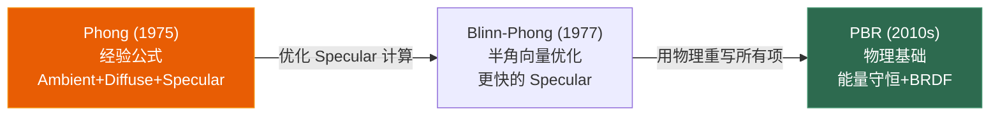

# 第三章 光照模型：Phong、Blinn-Phong 与 PBR 入门

> **一句话理解**：光照模型回答一个看似简单的问题——"这个像素应该是什么颜色？" Phong 给了基础框架（环境+漫反射+高光），Blinn-Phong 做了一个聪明的性能优化，PBR 把它重新建立在物理正确的基础上。

> 📋 前置知识：Ch1（片元着色器中执行光照计算）、算法 Ch1（向量运算——点积、叉积、归一化）

---

## 3.1 概念直觉 —— 为什么需要光照模型

### 没有光照的渲染

```
没有光照 = 只有纹理颜色
结果：物体看起来像 2D 贴纸——没有立体感，没有深度线索

加了光照 = 纹理颜色 × 光照计算
结果：物体朝向光源的面亮，背向光源的面暗——大脑从明暗变化中感知形状

光照模型的本质 = 模拟光子在物体表面的行为
  - 一部分光被表面反射（Diffuse + Specular）
  - 一部分光被吸收（变成热量——光追里才计算）
  - 一部分光从环境间接来（Ambient / Global Illumination）
```

### 三种模型的演化



---

## 3.2 Phong 光照模型

### 三个分量

```
Phong 光照 = Ambient + Diffuse + Specular

              ┌─────────────────────┐
              │ 表面最终颜色         │
              │                     │
              │ = 环境光（常亮）     │  ← 即使完全背光也有这个底色
              │ + 漫反射（明暗面）   │  ← 物体朝向光源的角度决定了亮度
              │ + 镜面高光（光斑）   │  ← 视线方向接近反射方向时出现亮点
              └─────────────────────┘
```

### 环境光 ——— Ambient

```hlsl
// 最简单的全局光照近似：所有表面都接收到相同的基础光照
float3 ambient = _AmbientColor.rgb * texColor.rgb * _AmbientIntensity;

// 为什么需要环境光？
// 现实中，背对太阳的墙面不是全黑的——天空和地面反射的光照亮了它
// 但实时渲染中计算所有间接反射太贵，环境光是一个粗略的近似
// PBR 中会用 IBL（Image-Based Lighting）替代这个粗略近似（Ch5）
```

### 漫反射 —— Diffuse

```hlsl
// Lambert 余弦定律：表面接收的光能量 ∝ cos(入射角)
// cos(入射角) = dot(N, L)（法线 · 光线方向）

float3 N = normalize(input.worldNormal);   // 表面法线
float3 L = normalize(lightDir);           // 指向光源的方向
float NdotL = max(0, dot(N, L));          // 余弦值，不能为负

float3 diffuse = lightColor * texColor.rgb * NdotL;
```

**Lambert 定律的直觉**：

```
一束光垂直照在表面上 → 所有能量集中在最小面积 → 最亮
  光源 ↓
  ═══════  法线 ∥ 光线 → dot(N, L) = 1 → 100% 能量

一束光斜照在表面上 → 同样能量分散到更大面积 → 较暗
  光源 ↘
     ═════  法线 ∦ 光线 → dot(N, L) = 0.5 → 50% 能量

关键认知：漫反射的亮度与视角无关——
从正面看和从侧面看，同一位置的颜色相同。
这是因为漫反射假设表面向所有方向均匀散射光。
```

### 高光 —— Specular

```hlsl
// Phong Specular：反射向量 vs 视线方向的夹角
float3 R = reflect(-L, N);                // L 的反射方向
float3 V = normalize(viewDir);            // 指向摄像机的方向
float RdotV = max(0, dot(R, V));
float specular = pow(RdotV, shininess);   // shininess 控制高光大小

// shininess 的效果：
//   1   → 整个半球都是亮的（像粉笔）
//   32  → 中等大小的高光（像塑料）
//   128 → 小而亮的高光（像金属）
//   256 → 几乎是一个点（像镜子）
```

**Phong Specular 的几何直觉**：

```
         法线 N
           ↑
   光源 →  │  ●  ← 眼睛（摄像机）
    L      │ /|\
           │/   \
  ═══════点═══════  表面

如果眼睛正好在反射方向 R 上 → RdotV ≈ 1 → 高光亮
如果眼睛偏离反射方向   → RdotV < 1 → pow() 后迅速衰减
```

### 完整 Phong Shader

```hlsl
float4 PhongLighting(VertexOutput input) : SV_TARGET {
    float3 N = normalize(input.worldNormal);
    float3 V = normalize(_WorldSpaceCameraPos - input.worldPos);
    float3 L = normalize(_MainLightDirection.xyz);

    // 1. 环境光
    float3 ambient = _AmbientColor.rgb * texColor.rgb * 0.1;

    // 2. 漫反射
    float NdotL = max(0, dot(N, L));
    float3 diffuse = _MainLightColor.rgb * texColor.rgb * NdotL;

    // 3. 高光
    float3 R = reflect(-L, N);
    float RdotV = max(0, dot(R, V));
    float3 specular = _MainLightColor.rgb * pow(RdotV, _Shininess);

    return float4(ambient + diffuse + specular, texColor.a);
}
```

---

## 3.3 Blinn-Phong —— 一步巧妙的优化

### 问题

Phong 的 `reflect(-L, N)` 计算反射向量需要一次向量运算，然后 `dot(R, V)` 再做一次点积。每个片元都要算——当 shininess 高时，大部分片元的 RdotV 接近 0，`pow(0, 128) = 0`，白算了。

### Blinn-Phong 的改进

```hlsl
// 不计算反射向量，而是用"半角向量"（Halfway Vector）
// H = normalize(L + V) —— 光源方向和视线方向的中间方向

float3 H = normalize(L + V);    // 半角向量——替代 R
float NdotH = max(0, dot(N, H));
float specular = pow(NdotH, shininess * 4);  // ×4 补偿——两种方法的衰减速度不同

// 为什么更快？
// Phong:   R = reflect(-L, N)  →  dot(R, V)   →  pow()
// Blinn:   H = L + V            →  dot(N, H)   →  pow()
//           ↑ 少了一次 reflect（内部有 dot 和 multiply）
// 而且当光源和视线都处于远处（方向光+正交投影）时，
// H 在整个表面上几乎恒定——可以在顶点着色器里算！
```

### 几何直觉

```
Phong 的思路：        Blinn-Phong 的思路：
"反射方向离视线多远？"  "半角向量离法线多远？"

    N ↑                    N ↑
      │  R                   │  H（半角向量）
  L → ╲  ╲ 眼睛              │ ╱
        ╲ ╲                 │╱
  ═══════点═══════       ═══点════

R 和 V 的夹角 ≈ H 和 N 的夹角的一半
所以 Blinn-Phong 的 shininess 需要 ×4 来匹配 Phong 的衰减速度
```

### 对比

| | Phong | Blinn-Phong |
|------|-------|------------|
| Specular 公式 | `pow(dot(R, V), n)` | `pow(dot(N, H), n×4)` |
| 计算量 | 反射向量 + 点积 | 加法 + 归一化 + 点积 |
| 性能 | 较低 | **更高** |
| 高光形状 | 较圆 | 稍拉长（更接近真实） |
| 固定光源+视线 | 仍需逐片元计算 | 可在顶点着色器算 H |

> 💡 **面试表述**：「Blinn-Phong 用半角向量替代了 Phong 的反射向量——本质上是用 N·H 替代 R·V。不仅少了一次 reflect 运算，而且在方向光 + 正投影的场景中，半角向量在表面上是常数，可以在顶点着色器计算。Blinn-Phong 的高光形状更符合真实材质的反射特性——Phong 的高光偏圆，Blinn-Phong 的偏长。」

---

## 3.4 PBR 入门

### Phong 的局限性

```
Phong/Blinn-Phong 是经验模型——不是基于物理的：
  - 调整参数完全靠"看着像不像"（调 Ambient 大小、调 Shininess）
  - 同一个材质在不同光照环境下需要重新调参
  - 高光和漫反射之间没有能量守恒——可能输入光 < 反射光（不真实）
  - 金属和非金属的光照行为完全不同，但 Phong 不区分
```

### PBR 的两大原则

```
原则 1：基于物理的 BRDF（Bidirectional Reflectance Distribution Function）
  BRDF 描述了"一束光从一个方向射入，在各个方向上的反射分布"
  不是调参，而是用物理参数（粗糙度、金属度）代入物理公式

原则 2：能量守恒
  反射的光 ≤ 入射的光
  高光越强 → 漫反射越弱（能量守恒）
  粗糙表面：高光弱而分散，漫反射强
  光滑表面：高光强而集中，漫反射弱
```

### PBR 的核心参数

```
PBR 替代了 Phong 的 3+ 个经验参数（Ambient/Shininess/SpecularColor），
用 2-4 个物理参数：

Metallic（金属度）: 0 = 非金属（石头/木头/皮肤），1 = 纯金属（铁/金/铜）
  - 金属没有漫反射——所有反射都是高光（带颜色）
  - 非金属有漫反射——高光是白色的（因为非金属的高光来自表面反射，不进入材质内部）

Roughness（粗糙度）: 0 = 镜面，1 = 完全粗糙（如粉笔）
  - 控制高光的模糊程度——低粗糙度 = 小而亮的高光
  - 同时控制漫反射的分布

Albedo（反照率）: 替代 Diffuse Color——物体的"本色"
  - 金属：albedo = 高光的颜色（铜偏红、金偏黄）
  - 非金属：albedo = 漫反射的颜色

Normal（法线）: 提供表面微观细节（见 3.5 节）
```

**金属度 vs 粗糙度的交互**：

```
                    粗糙度 0.0              粗糙度 1.0
金属度 0.0     光滑塑料——小亮高光        粉笔/布料——无高光
              漫反射强而均匀              漫反射强而均匀

金属度 1.0     镜面金属——小而极亮高光     粗糙金属——模糊高光
              高光带颜色（铜=红色高光）    高光带颜色但很散
              无漫反射！                  无漫反射！
```

### PBR 的优势

```
1. 一套参数适配所有光照环境——室内/室外/白天/夜晚都不需要调参
2. 不同材质之间的一致性——金属看着像金属，木头看着像木头
3. 美术工作流标准化——Albedo/Metallic/Roughness 三张贴图
4. 能量守恒——画面物理正确，不会出现"发光木头"
```

---

## 3.5 法线贴图

### 为什么模型需要法线贴图

```
高模：500 万面，雕刻了丰富的表面细节（皮肤的毛孔、布料的纹理）
低模：5000 面，只有大致的轮廓

问题：低模少了 99.9% 的面，光照计算的面法线数量也少了 99.9%
      → 光照看起来"平坦"——没有微观细节的明暗变化

解决方案：把高模的法线方向"烘焙"到一张贴图上（法线贴图）
         低模渲染时，片元着色器不取顶点插值法线，
         而是从法线贴图采样——每个像素获得不同的法线方向
         
结果：5000 面的低模看起来像 500 万面的高模——因为光照是逐像素计算的
```

### 切线空间

```
为什么法线贴图是蓝紫色的？

法线贴图存储的是"切线空间"中的法线方向：
  X (红通道): 切线方向——左右偏移
  Y (绿通道): 副切线方向——上下偏移
  Z (蓝通道): 法线方向——垂直表面（默认方向）

默认法线 = (0, 0, 1) 即笔直向外
  → RGB(128, 128, 255) 即浅蓝紫色

如果某处的法线向左偏 → X < 0 → R < 128
如果某处的法线向上偏 → Y > 0 → G > 128

整张贴图"偏蓝紫色"是因为大部分法线接近于笔直向外——
只有细节部分的红/绿通道偏离 128。
```

**为什么用切线空间？**

```
世界空间的法线贴图：
  - 模型旋转后法线贴图就错了（世界坐标变了）
  - 不同模型不能复用同一张法线贴图（世界朝向不同）

切线空间的法线贴图：
  - 跟随模型旋转自动正确——因为切线和副切线跟着模型一起转
  - 同一张法线贴图可以用在不同模型上（只要 UV 布局一致）
  - 压缩更高效——切线空间法线的 Z 分量总是正数，可以只存 X、Y，Z 推算
```

### Shader 中的法线贴图

```hlsl
// 在片元着色器中采样法线贴图并转换到世界空间

// 1. 采样法线贴图
float3 tangentNormal = UnpackNormal(SAMPLE_TEXTURE2D(_NormalMap, sampler_NormalMap, uv));
// tangentNormal.xy ∈ [-1, 1]，z ∈ [0, 1]（压缩时 z 推算出来的）

// 2. 构建 TBN 矩阵（切线空间 → 世界空间）
float3 N = normalize(input.worldNormal);    // 世界空间法线
float3 T = normalize(input.worldTangent);   // 世界空间切线
float3 B = normalize(cross(N, T) * input.tangentSign);  // 副切线
float3x3 TBN = float3x3(T, B, N);

// 3. 转换到世界空间
float3 worldNormal = normalize(mul(tangentNormal, TBN));

// 4. 用转换后的法线做光照计算
float NdotL = max(0, dot(worldNormal, L));
```

---

## 3.6 🎮 游戏实战：PBR 材质调优

### PBR 材质的常见错误

```csharp
// ❌ 错误 1：非金属的 Metallic 不为 0
// 木头、石头、皮肤 → Metallic 应该为 0 或极低
// Metallic 不为 0 → 高光带颜色 + 漫反射变弱 → 看起来像塑料镀了金属漆

// ❌ 错误 2：Albedo 太亮或太暗
// PBR 的 Albedo 有物理范围——
// 非金属最暗（木炭）≈ sRGB 50
// 非金属最亮（新雪）≈ sRGB 240
// 金属最亮（银） ≈ sRGB 230
// 超出这个范围 = PBR 计算崩坏

// ❌ 错误 3：Roughness 用贴图但贴图是反的
// Unity 的 Standard Shader：Roughness = 1 - Smoothness
// 如果你在 Substance Painter 里用 Roughness 导出，
// 但在 Unity 里直接连到 Smoothness → 粗糙的地方变光滑，光滑的地方变粗糙

// ✅ 材质验证：
// 在均匀光照下（Directional Light + 灰色环境），材质应该看起来"正常"——
// 金属像金属，非金属像非金属，没有发光体
```

### 不同光照环境下的 PBR 表现

```csharp
// PBR 的核心价值：材质参数在任意光照下都正确
// 
// 室内场景（暖光 + 暗环境）：
//   同一个 PBR 材质自动适配——由于能量守恒，不会过亮
//   金属会反射室内光源颜色，非金属保持本色
//
// 室外场景（冷光 + 天空环境光）：
//   同样的材质参数——更多漫反射（来自天空），高光偏蓝
//   不需要重新调参
//
// Phong 时代需要"同一模型在不同关卡调两套参数"——PBR 不需要
```

---

## 3.7 常见面试题

### Q1："Phong 和 Blinn-Phong 光照模型的区别？"

```
"两者的 Ambient 和 Diffuse 完全一样。区别只在 Specular 高光项。

Phong 用反射向量和视线方向的夹角：pow(dot(reflect(-L, N), V), shininess)
Blinn-Phong 用半角向量和法线的夹角：pow(dot(normalize(L+V), N), shininess×4)

Blinn-Phong 的优势：
1. 计算更快——半角向量 H = L+V 比 reflect(-L, N) 少运算
2. 方向光 + 正交投影时，H 在整个表面上恒定——可以在顶点着色器算
3. 高光形状更接近真实——Phong 偏圆，Blinn-Phong 偏椭圆

代价是 shininess 需要乘 4 来匹配衰减速度，但这是一次乘法——开销忽略不计。"
```

### Q2："PBR 的核心思想？和传统光照模型的本质区别？"

```
"传统光照模型（Phong/Blinn-Phong）是经验公式——Ambient 多大、Shininess 多少，
全靠美术调参，换个光照环境就要重新调。

PBR 的两个核心原则：
第一，基于物理的 BRDF——不是调参，而是用物理参数（粗糙度、金属度）
代入物理公式计算光的反射分布。
第二，能量守恒——反射的光不能超过入射的光。
高光越强漫反射越弱是自动保证的，不需要手动平衡。

PBR 让同一套材质参数在所有光照环境下都正确——这是它最大的工程价值。"
```

### Q3："法线贴图的原理？为什么贴图是蓝紫色的？"

```
"法线贴图存储的是切线空间中的表面法线方向。
RGB 三个通道分别对应切线空间的 X（切线方向）、Y（副切线方向）、Z（法线方向）。

默认法线方向是笔直向外的 (0,0,1)，映射到 RGB 是 (128,128,255)——浅蓝紫色。
整张贴图偏蓝紫色是因为大部分区域的表面法线接近笔直向外，
只有细节部分（凹槽、凸起）的法线才会偏离，导致红/绿通道偏离 128。

用切线空间而非世界空间存储，是因为切线空间跟着模型旋转——
模型怎么转法线都正确，而且同一张贴图可以复用在不同模型上。"
```

---

## 3.8 本章回顾

| 概念 | 一句话 |
|------|--------|
| **Phong** | Ambient + Diffuse + Specular——三个经验项叠加 |
| **Lambert** | 漫反射亮度只和入射角有关，与视角无关 |
| **Phong Specular** | 反射向量 vs 视线——`pow(R·V, n)` |
| **Blinn-Phong** | 半角向量 vs 法线——`pow(N·H, n×4)`，更快 |
| **PBR** | 物理 BRDF + 能量守恒——Metal/Roughness 替代经验参数 |
| **金属度** | 0 = 非金属（白色高光 + 漫反射），1 = 金属（有色高光 + 无漫反射） |
| **粗糙度** | 0 = 镜面，1 = 粉笔——控制高光和漫反射的分布 |
| **法线贴图** | 切线空间存法线扰动——5000 面模型有 500 万面的光照细节 |
| **切线空间** | 跟随模型旋转——法线贴图可复用 + 压缩友好 |

> 📖 本系列基础篇完结。进阶篇（Ch4 阴影 / Ch5 PBR深入 / Ch6 前向与延迟渲染）将在以后继续。Ch3 的 PBR 概念为 Ch5 的 BRDF 公式打下了直觉基础——金属度/粗糙度/能量守恒的直觉在 Ch5 会被翻译为数学。
