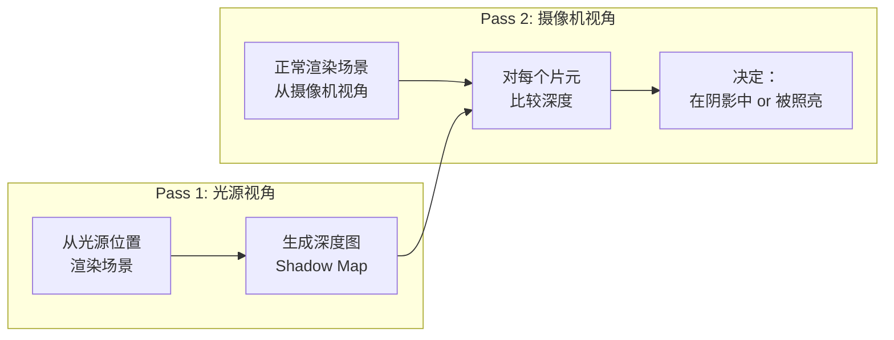
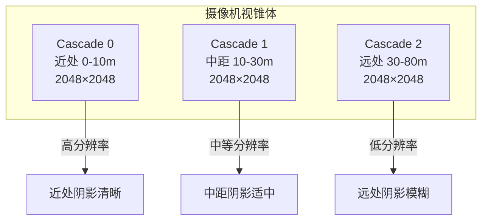

# 第四章 阴影技术

> **一句话理解**：实时阴影的本质是"从光源的视角看这个点是否可见"——Shadow Map 就是光源视角的深度图。所有的阴影技术都在解决同一个问题：如何用有限的分辨率、有限的计算量，生成没有锯齿、没有错位的软阴影。

> 📋 前置知识：Ch1（渲染管线——深度测试的底层机制）、Ch2（纹理采样——Shadow Map 本质上是一张深度纹理）

---

## 4.1 概念直觉 —— Shadow Map 的核心思想

### 为什么阴影是图形学中最难的问题之一

```
光照计算是局部的——片元着色器只关心"这个像素在光照下是什么颜色"
阴影是全局的——需要知道"这个像素有没有被其他物体挡住"

这就是为什么 Phong/PBR 的 Shader 里没有阴影——
片元着色器拿到一个像素时，不知道有没有别的东西挡住了它到光源的路径。
```

### Shadow Map 的两步流程



```
Pass 1（光源视角）：
  - 把摄像机"放到"光源位置，朝向场景
  - 渲染场景——但不输出颜色，只输出深度
  - 结果是 Shadow Map：每个像素存的是"从光源看，这一步的最近物体的深度"

Pass 2（摄像机视角）：
  - 正常渲染场景
  - 对每个片元，计算它在光源空间中的位置
  - 查 Shadow Map：光源视野中，这个方向上的最近深度是多少？
  - 如果片元深度 > Shadow Map 中的深度 → 被挡住了 → 在阴影中
  - 如果片元深度 ≈ Shadow Map 中的深度 → 没被挡住 → 被照亮
```

---

## 4.2 Shadow Map 的实现

### Shader 代码

```hlsl
// ============ Pass 1: 生成 Shadow Map ============
// 顶点着色器——只需要光源的 VP 矩阵
float4 ShadowMapVS(float3 position : POSITION) : SV_POSITION {
    return mul(UNITY_MATRIX_LVP, float4(position, 1.0));
    // LVP = Light View × Light Projection（如果是聚光灯/方向光）
}

// 片元着色器——只写深度，不输出颜色
// Unity 对 ShadowCaster Pass 有特殊处理——自动使用优化的深度-only 管线

// ============ Pass 2: 阴影采样 ============
float SampleShadowMap(float3 worldPos) {
    // 1. 世界坐标 → 光源裁剪空间
    float4 lightClipPos = mul(_LightVPMatrix, float4(worldPos, 1.0));

    // 2. 透视除法 → NDC
    float3 lightNDC = lightClipPos.xyz / lightClipPos.w;

    // 3. NDC [-1,1] → 纹理坐标 [0,1]
    float2 shadowUV = lightNDC.xy * 0.5 + 0.5;

    // 4. 采样 Shadow Map
    float shadowMapDepth = SAMPLE_TEXTURE2D(_ShadowMap, sampler_ShadowMap, shadowUV).r;

    // 5. 比较深度
    float receiverDepth = lightNDC.z;  // 当前片元在光源空间的深度

    // receiverDepth > shadowMapDepth → 当前片元比最近的物体更远 → 被遮挡
    float shadow = receiverDepth > shadowMapDepth ? 0.0 : 1.0;
    // shadow = 0（在阴影中）/ 1（被照亮）

    return shadow;
}

// 使用——在片元着色器的光照计算之后
float shadow = SampleShadowMap(input.worldPos);
float3 finalColor = (ambient + diffuse * shadow + specular * shadow) * texColor.rgb;
// 环境光不受阴影影响——完全被遮挡也应该有微弱的环境光
```

### 两种 Shadow Map 的投影方式

```
方向光（太阳）：
  用正交投影——因为方向光没有位置，是平行光
  
  问题：如果场景很大，一张 Shadow Map 覆盖不过来
  → 远处的阴影锯齿严重（一个 Shadow Map 像素覆盖了场景中一大块区域）
  → 解决方案：CSM（4.4 节）

点光源：
  用 6 张透视投影——朝向上下左右前后（Cubemap）
  开销巨大：每个点光源 = 6 次 Shadow Map 生成

聚光灯：
  用 1 张透视投影——最划算
  聚光灯本身范围有限 → Shadow Map 分辨率利用率高
```

---

## 4.3 阴影瑕疵与修复

### Shadow Acne（阴影痤疮）

```
症状：被照亮的表面出现奇怪的暗色条纹/网格

成因：
  Shadow Map 是离散的——每个像素存一个深度值
  被照亮的表面上的片元深度 ≈ Shadow Map 中的深度（理论上相等）
  但由于浮点精度 + Shadow Map 分辨率有限，
  有些片元的深度"略大于"Shadow Map 的深度 → 被错误判断为被遮挡

  ┌─────────────────┐
  │ Shadow Map 像素  │
  │ 深度 = 0.512    │
  └─────────────────┘
    ↑
    片元深度 = 0.5121（差 0.0001）
    → 0.5121 > 0.512 → "被遮挡"！ → 黑色条纹
```

**修复：Depth Bias**

```hlsl
// 在比较深度之前，把 Shadow Map 的深度向远离光源的方向偏移一点
float receiverDepth = lightNDC.z - _ShadowBias;
float shadow = receiverDepth > shadowMapDepth ? 0.0 : 1.0;

// Bias 太小 → 痤疮仍然存在
// Bias 太大 → Peter Panning（见下）
```

**更好的修复：Normal Bias**

```hlsl
// 不是偏移深度值，而是沿法线方向偏移采样位置
// 法线越垂直于光线 → 偏移越大（因为误差越大）
float3 worldPosWithBias = input.worldPos + input.worldNormal * _NormalBias;
float4 lightClipPos = mul(_LightVPMatrix, float4(worldPosWithBias, 1.0));
// 用偏移后的位置计算深度
```

### Peter Panning（彼得潘现象）

```
症状：物体的阴影和物体本身"分开了"——看起来像彼得潘的影子脱离了身体

成因：Bias 太大 → 片元深度被偏移得太靠近摄像机 → 本该在阴影中的变成了被照亮

┌─────────┐  物体
│ 阴影在这里 │  ← 本该紧贴物体
└─────────┘
        ↑ 间隙 ← Peter Panning
   ═══════  地面

解决方案：减小 Bias + 使用 Normal Bias（让偏移不全是沿深度方向）
```

### 阴影锯齿

```
硬阴影的阶梯状边缘——Shadow Map 分辨率太低

解决方案1：提高 Shadow Map 分辨率（简单粗暴——但显存带宽增加）
解决方案2：CSM——近处高分辨率，远处低分辨率（4.4 节）
解决方案3：PCF——对 Shadow Map 多次采样取平均（下文）
```

---

## 4.4 PCF —— 百分比渐近过滤

### 原理

```
硬阴影：Shadow Map 采样 1 次 → 非黑即白 → 锯齿边缘
软阴影：Shadow Map 采样 N 次 → 灰度过渡 → 模糊边缘

PCF = 在 Shadow Map 上取周围 N×N 个采样点
      每个采样点独立判断是否在阴影中
      取平均 = 阴影的"程度"（0.3 = 30% 在阴影中 = 半影）
```

```hlsl
float PCF_3x3(float2 shadowUV, float receiverDepth) {
    float shadow = 0.0;
    float2 texelSize = 1.0 / _ShadowMapSize;  // Shadow Map 一个像素对应的 UV 范围

    // 3×3 采样
    for (int x = -1; x <= 1; x++) {
        for (int y = -1; y <= 1; y++) {
            float2 offset = float2(x, y) * texelSize;
            float depth = SAMPLE_TEXTURE2D(_ShadowMap, sampler_ShadowMap,
                                            shadowUV + offset).r;
            shadow += receiverDepth > depth ? 0.0 : 1.0;
        }
    }

    return shadow / 9.0;  // 平均 = 半影程度
}

// 5×5 → 25 次采样 → 更软但更贵
// 7×7 → 49 次采样 → 很软但很贵
```

**PCF 的采样核设计**：

```
规则网格（3×3 / 5×5）：
  简单但会产生规则的重复图案——不像真实阴影

泊松分布（Poisson Disk）：
  随机但确保采样点之间保持最小距离
  结果看起来更自然——像噪声而非网格

硬件 PCF（移动 GPU 支持）：
  硬件内置的 2×2 PCF——性能接近单次采样
  Unity 默认使用硬件 PCF
```

---

## 4.5 CSM —— 级联阴影贴图

### 为什么需要 CSM

```
一张 2048×2048 的 Shadow Map 覆盖整个场景：
  - 近处的物体占 Shadow Map 的一小部分（比如 50×50 像素）
  - 远处的物体也占一小部分
  - 大部分分辨率浪费在了"中间距离"

CSM 的解决方案：
  把摄像机视锥体切成 N 个区域（级联）
  每个区域用一张独立的 Shadow Map
  近处 = 小范围 = 高密度 = 清晰的阴影
  远处 = 大范围 = 低密度 = 可以模糊
```



### CSM 的分级策略

```csharp
// Unity 中的 CSM 设置
// Quality Settings → Shadows → Cascade Count: 2 or 4

// 分级方法：
// 1. 等距分割：near→near+len/3→near+2*len/3→far（均匀分）
// 2. 对数分割：越靠近 near 越密集——因为近处阴影更重要
// 3. PSSM（Parallel-Split Shadow Maps）：混合等距和对数

// Unity 的 Cascades 可视化：
// Scene 视图 → Draw Mode → Shadow Cascades
// 红/绿/蓝/黄分别代表 Cascade 0/1/2/3
```

### CSM 的阴影采样

```hlsl
// 片元着色器需要判断当前片元属于哪个 Cascade
float SampleCSM(float3 worldPos) {
    // 1. 找出片元属于哪个 Cascade
    int cascadeIndex = 0;
    for (int i = 0; i < CASCADE_COUNT; i++) {
        if (worldPos.z <= _CascadeSplitDistances[i]) {
            cascadeIndex = i;
            break;
        }
    }

    // 2. 用对应 Cascade 的光源矩阵
    float4x4 lightVP = _LightVPMatrices[cascadeIndex];

    // 3. 采样对应 Cascade 的 Shadow Map（一般打包在 Shadow Map Atlas 中）
    float shadow = SampleShadowMap(worldPos, lightVP, cascadeIndex);

    // 4. Cascade 之间的过渡（近一层的边缘用下一层混合——避免边界突变）
    if (cascadeIndex < CASCADE_COUNT - 1) {
        float distToNext = _CascadeSplitDistances[cascadeIndex] - worldPos.z;
        float blend = saturate(distToNext / _CascadeBlendDistance);
        float nextShadow = SampleShadowMap(worldPos,
            _LightVPMatrices[cascadeIndex + 1], cascadeIndex + 1);
        shadow = lerp(nextShadow, shadow, blend);
    }

    return shadow;
}
```

### 移动端的阴影策略

```
CSM 在移动端太贵——每级级联都是一个独立的 Shadow Map 渲染
移动端（中低端设备）：
  - 不使用 CSM——单级 Shadow Map
  - 分辨率 512 或 1024（不是 2048）
  - PCF 2×2（硬件支持的最低开销版本）
  - 远距离物体不收阴影——Shadow Distance 设置短一些

移动端（高端设备）：
  - 2 级 CSM——近处清晰阴影 + 远处模糊
  - 分辨率 1024
  - PCF 3×3
```

---

## 4.6 🎮 游戏实战：阴影调优

### Unity Shadow 设置速查

```csharp
// Quality Settings → Shadows
// Shadowmask Mode: Distance Shadowmask（动态物体实时阴影 + 静态物体烘焙阴影）
// Shadows: Hard / Soft（硬阴影 / 软阴影——移动端用 Hard）
// Shadow Resolution: Low/Medium/High/Very High
// Shadow Distance: 50-150m（移动端 20-50m）
// Shadow Cascades: No/2/4
// Cascade Splits: 调节各 Cascade 的覆盖距离

// 常见调优：
// 1. 室内场景 → Shadow Distance 可以短（墙挡住了远处的阴影投射）
// 2. 室外开阔场景 → CSM 4 级 + 远的 Shadow Distance
// 3. 移动端 → 单级或不渲染实时阴影 + 烘焙静态阴影
```

### 阴影的常见问题排查

```
问题：近处阴影有锯齿，远处阴影模糊
  → CSM 分级不合理——Cascade 0 太远了
  → 增加 Cascade 0 的占比（降低 Split 1 的距离）

问题：角色脚下一圈黑边
  → Shadow Acne——增大 Normal Bias 或减小 Depth Bias

问题：阴影和角色之间有间隙
  → Peter Panning——减小 Bias 值

问题：阴影在大面积水面上消失
  → Shadow Distance 不够远——水面通常在远处
  → 但增大 Shadow Distance 会增加性能开销

问题：阴影在陡坡上错误
  → Normal Bias 可以解决——沿法线偏移而非沿深度偏移
```

---

## 4.7 面试口述

### Q："Shadow Map 的原理？Shadow Acne 怎么解决？"

```
"Shadow Map 分两步。

第一步，从光源位置渲染场景，存深度图——不输出颜色，只输出深度。
第二步，正常渲染场景时，每个片元算出它在光源空间的坐标，采样 Shadow Map——
如果片元深度大于 Shadow Map 深度，说明有别的物体更靠近光源，当前片元被挡住了。

Shadow Acne 是浮点精度和离散采样导致的——本该被照亮的像素，
因为深度差了一丁点被误判为阴影。
解决方案是用 Bias——比较前把片元深度向光源方向偏移。
更好的方案是 Normal Bias——沿法线而非深度方向偏移，
避免了普通 Bias 调太大导致的 Peter Panning 现象。"
```

### Q："CSM 的分级策略是什么？为什么近处和远处用不同分辨率？"

```
"CSM 把摄像机视锥体按距离切分成 N 个级联（通常 2 或 4 级）。
每个级联用一张独立的 Shadow Map，近处的级联覆盖范围小但分辨率密度高，
远处的级联覆盖范围大但分辨率密度低。

为什么这样设计？因为一张 Shadow Map 覆盖整个场景时，
大部分分辨率浪费在了中间距离——近处和远处的阴影都占很少像素。
把近处单独分一个级联 → 同样的 2048×2048 只覆盖 0-10 米 → 人物脚下的阴影非常清晰。
远处单独分一级 → 2048×2048 覆盖 30-80 米 → 像素密度低但可以接受（远处阴影模糊是自然的）。

分级策略有等距分割（均匀分）、对数分割（近处更密集）、
PSSM（混合等距和对数）——Unity 默认使用 PSSM。
级联之间需要做过渡混合（取相邻两级联的采样结果插值），避免级联边界出现阴影突变。"
```

---

## 4.8 本章回顾

| 概念 | 一句话 |
|------|--------|
| **Shadow Map** | 光源视角的深度图——比较深度判断遮挡 |
| **Shadow Acne** | 精度误差导致的自遮挡条纹——加 Bias |
| **Peter Panning** | Bias 太大导致阴影脱离物体——减小 Bias 或用 Normal Bias |
| **PCF** | 多次采样取平均——消除阴影锯齿 |
| **CSM** | 视锥体分层——近处清晰远处模糊 |
| **移动端阴影** | 单级 Shadow Map + 低分辨率 + 近处阴影距离 |

> 📖 下一章：[第五章 PBR 深入](./05_pbr_deep_dive) —— Cook-Torrance BRDF 的 D/F/G 三项、IBL 环境光照。Ch3 讲了 PBR 是什么，Ch5 讲它的数学。
