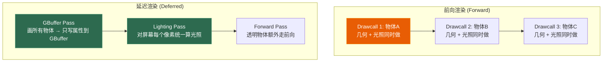

# 第六章 前向渲染与延迟渲染

> **一句话理解**：前向渲染是"每个物体对每盏灯算一次"，延迟渲染是"先画完所有物体，再对屏幕上每个像素统一算光照"。前者适合少量光源，后者适合大量光源——现代引擎通常两者混用。

> 📋 前置知识：Ch1（渲染管线——深度测试与混合阶段是理解两种架构差异的基础）、Ch3（光照模型——延迟渲染的 G-Buffer 里存的就是光照计算的输入数据）

---

## 6.1 概念直觉 —— 两种架构的哲学

### 问题：多光源的困境

```
场景：一个房间，1 个角色模型，20 盏动态灯光

前向渲染：
  角色模型的每个片元 → 对 20 盏灯各做一次光照计算
  → 200 万片元 × 20 盏灯 = 4000 万次光照计算
  
  而且！如果 10 盏灯被墙挡住了，这些计算白费了
  更糟的是——你不知道哪些灯被挡住，因为还没画墙

延迟渲染：
  先画完所有物体（不计算光照，只把属性写进 G-Buffer）
  再对屏幕上每个可见像素，统一计算所有灯的光照
  → 200 万像素 × 20 盏灯 = 4000 万次
  
  等等……次数一样？
  不一样——只有最终可见的像素才计算！
  被遮挡的片元（在 G-Buffer 写入阶段就被深度测试淘汰了）
```

### 本质差异



---

## 6.2 前向渲染

### 渲染流程

```
对每个物体：
  1. 跑 Vertex Shader（MVP 变换）
  2. 光栅化 → 生成片元
  3. 片元着色器：
     a. 采样纹理（Albedo/Normal/Roughness...）
     b. 对每一盏灯计算光照（Phong/PBR）
     c. 把所有灯光的结果累加
  4. 深度测试 → 混合 → 写入帧缓冲
```

### DrawCall = 物体数 × 光源数（最坏情况）

```csharp
// Unity Forward Rendering 的光源处理策略

// 场景中有 50 盏点光源，但每个物体只受最近的 4 盏影响
// Unity 会自动排序光源——每帧根据物体位置选出最重要的几盏

// 光源模式（在 Light 组件上设置）：
// Important（像素光）：逐像素计算——最贵，放最重要的光源
// Not Important（顶点光）：逐顶点计算——较便宜
// Auto：Unity 自动决定

// 前向渲染的 Pass 结构（Unity Built-in RP）：
// ForwardBase Pass:
//   - 1 盏方向光（通常是主光源） + 所有逐顶点光 + SH 环境光
//   - 这个 Pass 计算环境光和主光
//
// ForwardAdd Pass（每个额外的逐像素光多一个 Pass）：
//   - 额外的逐像素光——每个光源一个 Pass！
//   - 这就是"前向渲染光源数 × 物体 DrawCall"的来源
//   - Blend One One（叠加混合——把每个光源的贡献累加上去）
```

### 前向渲染的优缺点

```
✅ 优点：
  1. 硬件兼容性好——所有 GPU 都支持，移动端首选
  2. 支持 MSAA——因为几何信息在片元着色器里直接用
  3. 透明物体处理自然——本来就逐物体渲染，混合透明很简单
  4. Shader 灵活——每个物体可以用不同的 Shader 做不同的光照

❌ 缺点：
  1. 光源数多时 DrawCall 爆炸——N 物体 × M 光源
  2. 大量被遮挡的片元也算光照——浪费（Occlusion Culling 减轻但不能完全避免）
  3. 多光源下 Shader 变体爆炸——Shader 需要为不同的光源数/类型生成变体
  4. 光照计算与几何绑定——不能在屏幕空间复用计算结果
```

---

## 6.3 延迟渲染

### 两阶段流程

```
Phase 1：GBuffer Pass（几何阶段）
  渲染所有不透明物体
  片元着色器不计算光照——
  而是把 Albedo、法线、深度、粗糙度、金属度等写入多张 RT（G-Buffer）

Phase 2：Lighting Pass（光照阶段）
  对屏幕上的每个像素：
    从 G-Buffer 读取该像素的几何属性
    用这些属性计算所有灯光的影响
    累加 → 写入最终帧缓冲
```

### G-Buffer 的布局

```hlsl
// 典型的 G-Buffer 布局（4 张 RT）
// 
// RT0 (ARGB32): Albedo.rgb + 保留
// RT1 (ARGB32): Normal.xy（Octahedron 编码）+ Roughness + Metallic
// RT2 (ARGBHalf): WorldPosition.rgb + 保留
// RT3 (ARGB32): AO + 保留 + 保留 + 保留

// ============ GBuffer Pass 的片元着色器 ============
struct GBufferOutput {
    float4 albedoRT    : SV_TARGET0;  // RT0: albedo.rgb
    float4 normalRT    : SV_TARGET1;  // RT1: normal.xy + roughness + metallic
    float4 positionRT  : SV_TARGET2;  // RT2: worldPos.xyz
    float4 aoRT        : SV_TARGET3;  // RT3: ao
};

GBufferOutput GBufferPS(VertexOutput input) {
    GBufferOutput output;

    // 采样材质
    float3 albedo = SAMPLE_TEXTURE2D(_AlbedoMap, sampler_Albedo, input.uv).rgb;
    float metallic = SAMPLE_TEXTURE2D(_MetallicMap, sampler_Metallic, input.uv).r;
    float roughness = SAMPLE_TEXTURE2D(_RoughnessMap, sampler_Roughness, input.uv).r;
    float ao = SAMPLE_TEXTURE2D(_AOMap, sampler_AO, input.uv).r;
    float3 N = GetWorldNormal(input);

    // 写入 GBuffer——不计算光照！
    output.albedoRT = float4(albedo, 1.0);

    // 法线压缩：Octahedron 编码把 3 分量法线 → 2 分量（省带宽）
    float2 encodedNormal = EncodeNormalOctahedron(N);
    output.normalRT = float4(encodedNormal, roughness, metallic);

    output.positionRT = float4(input.worldPos, 1.0);
    output.aoRT = float4(ao, 0, 0, 1.0);

    return output;
}

// ============ Lighting Pass 的片元着色器 ============
float4 DeferredLightingPS(float4 screenPos : SV_POSITION) : SV_TARGET {
    // 从 G-Buffer 解码
    float3 albedo = GBuffer0.Sample(sampler, uv).rgb;
    float3 N = DecodeNormalOctahedron(GBuffer1.Sample(sampler, uv).xy);
    float roughness = GBuffer1.Sample(sampler, uv).z;
    float metallic = GBuffer1.Sample(sampler, uv).w;
    float3 worldPos = GBuffer2.Sample(sampler, uv).xyz;
    float ao = GBuffer3.Sample(sampler, uv).x;

    // 重建 View Direction
    float3 V = normalize(_WorldSpaceCameraPos - worldPos);

    // ===== 对每盏灯计算光照（和前向渲染的片元着色器一样）=====
    float3 Lo = 0;

    // 主方向光
    Lo += ComputePBRLighting(albedo, N, V, roughness, metallic,
                              _MainLightDirection, _MainLightColor);

    // 额外的点光源——在屏幕空间逐像素计算
    for (int i = 0; i < _PointLightCount; i++) {
        float3 L = _PointLights[i].position - worldPos;
        float dist = length(L);
        if (dist < _PointLights[i].range) {
            L /= dist;  // normalize
            float attenuation = 1.0 - (dist / _PointLights[i].range);
            Lo += ComputePBRLighting(albedo, N, V, roughness, metallic,
                                      L, _PointLights[i].color) * attenuation;
        }
    }

    float3 ambient = albedo * _AmbientColor.rgb * ao;
    return float4(Lo + ambient, 1.0);
}
```

### 延迟渲染的优缺点

```
✅ 优点：
  1. 光照计算 O(屏幕像素 × 光源数)——摆脱了物体数的依赖
  2. 大量光源场景性能极好——Lighting Pass 只跑一次
  3. G-Buffer 可以用于后处理——SSAO/SSR 都需要法线和深度
  4. Shader 变体少——光照计算的 Shader 只有一个

❌ 缺点：
  1. 不支持 MSAA——G-Buffer 是屏幕分辨率的，
     没有几何信息来做子像素采样（硬件 MSAA 需要知道三角形边界）
  2. 透明物体必须额外走 Forward Pass——G-Buffer 只能存一层几何信息
  3. G-Buffer 带宽消耗大——4 张 RT，每帧都要写和读
     1920×1080 × 4 张 RT × 每张 4 bytes = 33MB 的读写/帧
  4. Shader 不灵活——所有物体在 Lighting Pass 里用同一个 Shader 算光照，
     不能像前向渲染那样"这个物体用特殊的 Shader"
  5. 深度/Stencil 预先写入——不能利用 Early-Z 省掉片元着色器
```

---

## 6.4 关键辨析

### 为什么延迟渲染不支持 MSAA

```
MSAA（多重采样抗锯齿）的原理：
  每个像素采样 N 次（4×MSAA = 4 个子像素）
  光栅化时判断三角形覆盖了哪些子像素
  片元着色器只跑 1 次（颜色共享给所有覆盖的子像素）
  解析时：混合 4 个子像素的颜色 → 抗锯齿

延迟渲染的问题：
  G-Buffer 的片元着色器输出的是"几何属性"（法线、粗糙度等），
  不是最终颜色。如果做了 MSAA——
  G-Buffer 子像素 A 和 子像素 B 可能来自不同的三角形，
  法线完全不同。但 Lighting Pass 时用哪个法线？

解决方案：
  1. 不解决——Lighting Pass 后做 FXAA/TAA 等后处理抗锯齿（主流方案）
  2. 每个子像素都存一份 G-Buffer——内存 ×4（太贵了，没人这么干）
  3. Forward+（见 6.5 节）——保留了前向渲染的 MSAA 支持
```

### 为什么透明物体必须走前向渲染

```
G-Buffer 的一个像素位置只能存一个物体的属性——
被深度测试保留下来的那个（离摄像机最近的）。

但透明物体需要看到它背后的颜色——不能覆盖 G-Buffer 的值。

解决方案：
  GBuffer Pass → 画所有不透明物体 → Lighting Pass → 得到不透明的最终画面
  → Forward Pass → 在画面之上叠加透明物体（混合透明）

这就是 Unity URP 的渲染顺序：
  1. Depth Prepass（可选——写深度，用于后续做剔除）
  2. GBuffer Pass（不透明物体 → G-Buffer）
  3. Deferred Lighting Pass（G-Buffer → 光照计算）
  4. Forward Pass（透明物体 → 混合到画面上）
```

### 前向 vs 延迟的性能分界线

```
什么时候延迟渲染 > 前向渲染？

场景 A：室外大世界，1 盏太阳光 + 少量点光源（火把/篝火）
  → 前向渲染更优——光源少，DrawCall 不爆炸
    延迟渲染的 G-Buffer 带宽开销反而不划算

场景 B：室内场景，20+ 盏动态灯光（灯泡/蜡烛/魔法特效）
  → 延迟渲染更优——大量光源的 Lighting Pass 只跑一次
    前向渲染的 DrawCall × 光源数会爆炸

经验值：
  动态像素光 < 4-5 盏 → 前向渲染
  动态像素光 > 8-10 盏 → 延迟渲染
  中间 → 看场景复杂度和平台
```

---

## 6.5 Forward+ 与 Clustered Forward

### Forward+ (Tiled Forward)

```
前向渲染和延迟渲染的折中方案：

思路：把屏幕分成 Tile（如 32×32 像素的格子）
      对每个 Tile，找出影响它的光源
      渲染这个 Tile 时，只计算这些光源

步骤：
  1. 深度预渲染（Z-Prepass）→ 得到屏幕的深度信息
  2. 光源分类（CPU/Compute Shader）：
     对每个 Tile，计算它被哪些灯光影响
     只存命中率高的光源索引列表
  3. 前向渲染：
     每个物体渲染时，根据它覆盖的 Tile，
     只算可能影响它的光源而非全场景光源

优势：
  保留了前向渲染的 MSAA + 灵活的 Shader
  接近延迟渲染的多光源性能
  G-Buffer 带宽开销 ↓

代价：
  需要 Compute Shader 支持（或 CPU 端分 Tile）
  光源分类本身有开销
```

### Clustered Forward

```
Forward+ 的改进版：不仅在屏幕 XY 上分格，在 Z（深度）上也分格

Tile（Forward+）：            Cluster（Clustered Forward）：
  屏幕空间 2D 格子             屏幕空间 3D 格子（XY + 深度）
  一个 Tile 覆盖所有深度       一个 Cluster 只覆盖一段深度

为什么 Z 轴分格重要？
  场景：摄像机前方 1 米有一盏灯，后方 100 米有一盏灯
  Tile 方案：两个灯都被算进这个 Tile → 浪费（后面那盏根本照不到前面的物体）
  Cluster 方案：1 米和 100 米的深度在各自的 Cluster 中 → 只算相关的

Clustered Forward 是目前最高效的前向渲染方案。
HDRP 和 UE5 都使用（或部分使用）了类似的技术。
```

---

## 6.6 三种架构的对比

| 维度 | 前向渲染 | 延迟渲染 | Forward+ / Clustered |
|------|---------|---------|---------------------|
| 光照复杂度 | O(物体×光源) | O(像素×光源) | O(物体×Cluster 内光源) |
| MSAA | ✅ 原生支持 | ❌ 需后处理 AA | ✅ 原生支持 |
| 透明物体 | ✅ 自然处理 | ❌ 需额外 Forward Pass | ✅ 自然处理 |
| G-Buffer 开销 | 无 | 高（4+张 RT） | 低（通常只需深度） |
| Shader 灵活性 | 高（每物体可不同） | 低（统一 Lighting Shader） | 高 |
| 大量光源 | 差 | 极好 | 很好 |
| 少量光源 | 好 | 过度开销（G-Buffer 浪费） | 好 |
| 移动端适用 | ✅ 首选 | ❌ 带宽太重 | 部分支持 |
| 典型引擎 | Unity Built-in RP | 经典延迟管线 (Killzone/UE3) | UE5 / Unity HDRP |

**选型建议**：

```
移动端 → 前向渲染（带宽敏感，光源少）
PC 室内 → 延迟渲染（多光源优势明显）
PC 开放世界 → Forward+ 或 混合（前向 + 延迟）
Unity → URP 默认前向，HDRP 默认延迟/Forward+
UE5 → 默认延迟，支持 Forward 作为 Fallback
```

---

## 6.7 🎮 游戏实战：Unity 中的渲染路径配置

```csharp
// Unity URP 的渲染路径设置
// Project Settings → Graphics → Pipeline Asset → Rendering

// Forward Rendering:
//   - 性能要求低 → 适合移动端
//   - 最多支持 8 盏逐像素光（每个物体）
//
// Deferred Rendering:
//   - 需要 GBuffer 支持 → GPU 至少支持 MRT（多渲染目标）
//   - 大量动态光源 → 性能优势明显

// Unity HDRP：默认延迟渲染，可选 Forward 模式
// Unity URP：默认前向渲染，可选延迟（需要高端设备）
```

---

## 6.8 面试口述题

### Q："前向渲染和延迟渲染的区别？各自的优缺点？"

```
"本质区别是光照计算的时机。

前向渲染在渲染每个物体时，对每盏灯做一次光照计算——
光照和几何是耦合的。好处是支持 MSAA、透明物体自然处理、
Shader 灵活。坏处是多光源时复杂度 O(N×M)，DrawCall 爆炸，
大量被遮挡的片元浪费光照计算。

延迟渲染分成两个阶段——
先画所有不透明物体，把 Albedo/法线/深度/材质参数写入 G-Buffer；
再对屏幕每个像素统一算所有灯的光照。
好处是多光源开销与物体数无关、G-Buffer 数据可供 SSAO/SSR 等后处理复用。
坏处是不支持 MSAA、透明物体必须走额外 Forward Pass、
G-Buffer 带宽消耗大（每帧 4+ 张 RT 的读写）、移动端不适用。

现代方案是 Forward+ / Clustered Forward——
在屏幕空间分 Tile/Cluster 管理光源索引，
让每个物体/像素只计算可能影响它的光源。"
```

### Q："G-Buffer 存什么？为什么延迟渲染不支持 MSAA？"

```
"典型的 G-Buffer 包括 Albedo（RGB）、
压缩后的法线（Octahedron 编码，2 分量）、
Roughness 和 Metallic（各 1 分量）、
World Position（可从深度重建，省一张 RT）、
AO（1 分量）。

不支持 MSAA 是因为 G-Buffer 是屏幕分辨率的纹理数组——
每个像素只存一份几何属性。
MSAA 需要知道子像素级别的几何边界——
像素内的 4 个子像素可能来自不同的三角形，法线完全不同，
但 G-Buffer 没有这些子像素信息。
所以延迟渲染管线用后处理 AA（FXAA/TAA/SMAA）替代 MSAA。"
```

---

## 6.9 本章回顾

| 概念 | 一句话 |
|------|--------|
| **前向渲染** | 几何 + 光照同时做——每物体 × 每光源 |
| **延迟渲染** | 先存几何属性到 G-Buffer，再逐像素统一光照 |
| **G-Buffer** | Albedo + Normal + Depth + Metallic/Roughness + AO |
| **MSAA 不支持** | G-Buffer 是屏幕分辨率——缺少子像素几何信息 |
| **透明物体** | 必须额外走 Forward Pass——G-Buffer 只能存一层 |
| **Forward+** | 屏幕分 Tile 管理光源——取前向和延迟两者之长 |
| **Clustered Forward** | Tile + 深度分格——避免深度不相关光源的开销 |

> 📖 下一章：[第七章 后处理与实时GI入门](./07_postprocess_gi) —— Bloom、HDR/Tone Mapping、SSAO、Light Probe。延迟渲染的 G-Buffer 为后处理提供了完美的输入数据。
