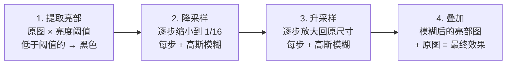

# 第七章 后处理与实时GI入门

> **一句话理解**：后处理是画面的最后一步——在渲染好的图像上再做一次"滤镜"。Bloom 让亮的地方发光，Tone Mapping 把 HDR 的物理亮度映射到显示器能显示的范围，SSAO 给角落和缝隙加上暗部细节。GI（全局光照）则是让光不止照一次——它会在场景中弹射。

> 📋 前置知识：Ch1（渲染管线），Ch6（G-Buffer——SSAO 的输入来源于 G-Buffer 的深度和法线数据）

---

## 7.1 Bloom —— 让亮的地方发光

### 为什么需要 Bloom

```
真实世界：太阳比天空亮 10000 倍，但显示器只能显示 0-255
→ 没办法"真的把太阳画得更亮"
→ 替代方案：让亮的地方的光芒扩散到周围的暗区——视觉上产生"很亮"的错觉

这就是 Bloom：提取亮部 → 模糊 → 叠回原图
```

### 四步流程



```hlsl
// ============ Pass 1: 提取亮部 ============
float4 BloomExtractPS(float2 uv : TEXCOORD) : SV_TARGET {
    float3 color = SAMPLE_TEXTURE2D(_MainTex, sampler_MainTex, uv).rgb;

    // 亮度 = 感知加权（人眼对绿色最敏感）
    float luminance = dot(color, float3(0.2126, 0.7152, 0.0722));

    // 只有超过阈值的才保留
    float contribution = max(0, luminance - _BloomThreshold);
    return float4(color * (contribution / max(luminance, 0.001)), 1.0);
}

// ============ Pass 2-5: 高斯模糊（降采样 + 升采样交替）============
// 为什么要降采样再升采样？
//   直接在高分辨率上做大范围模糊 → 采样核需要非常大 → 极慢
//   降采样到 1/16 → 同样大小的采样核覆盖了 16× 的范围 → 高效的大范围模糊

// 降采样：每次缩小 1/2 + 5×5 模糊
// 升采样：每次放大 1/2 + 5×5 模糊（用上一级的结果做上采样）

// 高斯模糊的水平/垂直分离：2D 高斯 = 水平 1D 高斯 + 垂直 1D 高斯
// 5×5 2D 高斯 = 25 次采样 → 2×(5 次采样) = 10 次采样
// 这就是 Bloom 用两次 1D Pass 而非一次 2D Pass 的原因

// ============ Pass 6: 叠加 ============
float4 BloomCompositePS(float2 uv : TEXCOORD) : SV_TARGET {
    float3 original = SAMPLE_TEXTURE2D(_MainTex, sampler_MainTex, uv).rgb;
    float3 bloom = SAMPLE_TEXTURE2D(_BloomTex, sampler_Bloom, uv).rgb;

    return float4(original + bloom * _BloomIntensity, 1.0);
}
```

### Bloom 的性能考量

```
移动端 Bloom：
  降采样到 1/8 或 1/16（不是 1/32——太小了没效果）
  使用 3×3 高斯而非 5×5
  或使用"快速 Bloom"——Kawase Blur（比高斯快 2-3 倍，移动端常用）

Kawase Blur：
  不是真正的卷积模糊——而是"取周围 4 个角 + 中心"的加权混合
  4 次迭代 ≈ 1 次大范围高斯的效果，但只需要 5 次采样/迭代
```

---

## 7.2 HDR 与 Tone Mapping

### 为什么需要 HDR

```
真实世界的亮度范围：10⁻⁶（星光）到 10⁹（太阳直射）
显示器能显示的亮度：0 到 255（LDR——Low Dynamic Range）

如果直接 clamp(0, 255)：
  亮的全白（过曝），暗的全黑（死黑），细节全丢

HDR 的做法：
  1. 用 16-bit 浮点格式渲染（亮度范围远超 0-255）
  2. 最后一步做 Tone Mapping——把 HDR 亮度"映射"到 LDR
  3. 类似人眼的自适应——亮的地方压缩高光，暗的地方保留细节
```

### 三种 Tone Mapping

```hlsl
// ============ 1. Reinhard —— 最简单的 ============
// 原理：亮处用对数曲线压缩——越亮压缩越狠
float3 Reinhard(float3 hdrColor) {
    return hdrColor / (hdrColor + 1.0);
    // 输入 0.1 → 0.09（几乎不变）
    // 输入 1.0 → 0.5（压缩一半）
    // 输入 10  → 0.91（接近饱和但不过曝）
    // 输入 100 → 0.99（不会超过 1）
}

// Reinhard Extended（改进版——保留高光细节）
float3 ReinhardExtended(float3 hdrColor, float maxWhite) {
    float3 numerator = hdrColor * (1.0 + hdrColor / (maxWhite * maxWhite));
    return numerator / (1.0 + hdrColor);
}

// ============ 2. ACES —— 电影行业标准，Unity 默认 ============
// Academy Color Encoding System
// 特征：暗部偏冷调、高光自然、色彩过渡平滑
float3 ACES(float3 hdrColor) {
    float a = 2.51;
    float b = 0.03;
    float c = 2.43;
    float d = 0.59;
    float e = 0.14;

    return saturate((hdrColor * (a * hdrColor + b)) /
                    (hdrColor * (c * hdrColor + d) + e));
}

// ============ 3. Neutral —— Unity URP 默认 ============
// 比 ACES 简单，不做颜色偏移
float3 Neutral(float3 hdrColor) {
    float3 x = max(0, hdrColor - 0.004);
    float3 result = (x * (6.2 * x + 0.5)) / (x * (6.2 * x + 1.7) + 0.06);
    return result;
}
```

### Tone Mapping 的效果对比

```
Reinhard：
  → 最简单，画面偏暗偏灰（过于保守的压缩）
  → 小项目/HDR 预览用

ACES：
  → 电影感——暗部偏冷蓝，高光偏暖黄
  → 最具"胶片感"——3A 大作首选

Neutral：
  → 颜色准确——不做色调偏移
  → 需要颜色准确的项目（产品展示、UI 密集的游戏）
```

### HDR → Tone Mapping → Gamma 校正的完整流程

```
1. 渲染（HDR）
   场景中的亮度可以是 100、1000 甚至更高（浮点精度）
   Render Target 格式：R11G11B10 或 RGBA16F

2. Tone Mapping（HDR → LDR）
   把 HDR 亮度映射到 [0, 1] 范围
   同时保留高光和暗部细节

3. Gamma 校正（LDR → 显示器空间）
   显示器不是线性的——输入 0.5 → 显示器输出亮度 ≈ 0.22
   需要：color = pow(toneMappedColor, 1/2.2)
   让显示器上的亮度看起来像你线性空间中算的那样

   Unity 底层的 sRGB 格式 RT 自动做 Gamma 校正
   Linear 工作流：渲染时用线性空间 → 输出时自动 Gamma 校正
```

---

## 7.3 SSAO —— 屏幕空间环境光遮蔽

### 直觉

```
真实世界中：
  墙角、桌子底下、衣服褶皱——这些"凹陷"区域更暗
  不是因为光照不到，而是因为周围几何体阻挡了环境光

AO = Ambient Occlusion——环境光被几何体遮挡的程度

SSAO = Screen Space AO——在屏幕空间计算 AO
  只需要深度缓冲（G-Buffer 的深度）→ 不需要预烘焙 → 实时
```

### 原理

```hlsl
// SSAO 的核心逻辑

float ComputeSSAO(float2 uv, float3 viewPos, float3 viewNormal) {
    float occlusion = 0.0;

    // 在法线方向的半球内随机采样 N 个点
    for (int i = 0; i < SAMPLE_COUNT; i++) {
        // 随机方向（在切线空间中——法线为 Z 轴）
        float3 randomDir = _SampleKernel[i];  // 预生成的采样核

        // 如果随机向量朝向法线的反方向（半球下）→ 翻转
        float3 sampleDir = randomDir;
        if (dot(sampleDir, viewNormal) < 0) {
            sampleDir = -sampleDir;
        }

        // 采样点在观察空间中的位置
        float3 samplePos = viewPos + sampleDir * _SampleRadius;

        // 把采样点投影回屏幕空间
        float4 sampleScreenPos = mul(UNITY_MATRIX_P, float4(samplePos, 1.0));
        sampleScreenPos.xy /= sampleScreenPos.w;
        float2 sampleUV = sampleScreenPos.xy * 0.5 + 0.5;

        // 采样深度——实际深度
        float sampleDepth = SAMPLE_TEXTURE2D(_CameraDepthTexture,
                                              sampler_Depth, sampleUV).r;
        // 重建观察空间深度（线性深度）
        float sampleViewDepth = LinearEyeDepth(sampleDepth);

        // 比较：采样点的实际深度 vs 这个方向的几何体深度
        // 采样点更远 → 有几何体挡在前面 → 贡献 AO
        float rangeCheck = smoothstep(0.0, 1.0,
            _SampleRadius / abs(viewPos.z - sampleViewDepth));
        occlusion += (sampleViewDepth <= samplePos.z ? 1.0 : 0.0) * rangeCheck;
    }

    return 1.0 - (occlusion / SAMPLE_COUNT);
}

// 实际的 SSAO 实现还有很多优化：
// - 用随机旋转纹理消除采样图案
// - 双边模糊——保留边缘（深度/法线不连续的地方不模糊）
// - 使用较低的 SSAO 分辨率（1/2 或 1/4）再做上采样
```

### SSAO 的常见变体

```
SSAO (Screen Space Ambient Occlusion) —— 经典版：
  用深度缓冲 + 法线做半球采样
  问题：远处会出现"灰色光晕"（场景中实际没有的暗部）

HBAO (Horizon-Based AO)：
  沿地平线方向搜索——更接近物理真实
  开销比 SSAO 大但质量更好

GTAO (Ground Truth AO)：
  考虑了"多次散射"——比 HBAO 更接近离线渲染质量
  UE5 默认使用此算法

移动端：
  不跑 SSAO——开销太大
  替代方案：烘焙 AO 到光照贴图（静态物体）+ 顶点 AO（动态物体）
```

---

## 7.4 Light Probe —— 动态物体的间接光照

### 问题

```
烘焙的光照贴图只对静态物体有效——它在预计算时假设物体不会移动。
但动态角色走到暗处时也应该变暗——怎么获得间接光照？

Light Probe = 场景中分布的光照采样球
  每个 Probe 编码了它所在位置"从各个方向接收到多少光"
  动态物体移动时，插值周围几个 Probe 的值 → 获得间接光照
```

### 球谐函数

```hlsl
// Light Probe 用球谐（Spherical Harmonics）编码光照信息
// SH = 用 N 个系数描述一个球面上的函数分布

// Unity 使用 3 阶 SH = 9 个系数（R/G/B 各 9 个 = 27 个 float）
// 9 个系数可以近似地重建任意方向的光照强度

// SH 重建——给定法线方向，返回该方向的光照颜色
float3 SampleSH9(float3 N) {
    // Unity 已经帮你做了——在 Shader 中：
    // float3 ambient = ShadeSH9(half4(N, 1.0));

    // 原理（简化）：
    // SH0: 常数项——所有方向的平均光照（基础亮度）
    // SH1-SH3: 各阶球谐基函数——编码方向信息
    //   绿色方向比红色方向亮 → SH1 的 Y 分量非零
    //   天空比地面亮 → SH2 的 Z 分量偏正

    // 重建过程 = N 的各阶球谐基函数值 × 对应系数 → 累加
    float3 result = 0;

    // L0: 常数——平均光照
    result += unity_SHAr;  // 等价于取 SH 系数的第 1 项

    // L1: 线性——方向性（来自上方 vs 下方、左边 vs 右边……）
    result += unity_SHBr * N.x;  // 左右的差异
    result += unity_SHAg * N.y;  // 上下的差异
    result += unity_SHBb * N.z;  // 前后的差异

    // L2: 二次——更细的方向变化（天空 vs 地面、水平环绕）
    result += unity_SHC.r * (N.x * N.y);
    result += unity_SHC.g * (N.y * N.z);
    result += unity_SHC.b * (N.z * N.z - 1.0 / 3.0);

    return max(0, result);
}
```

**球谐函数的直观理解**：

```
把"球面上的光照分布"看作一个信号
SH = 用傅里叶级数的方法在球面上压缩这个信号

L0（1 个系数）: 整个球的平均值 → 最粗糙的近似
L1（3 个系数）: 哪个方向更亮 → 方向感
L2（5 个系数）: 天空 vs 地面 → 更细致的方向感
（L3+ 更高阶→保留更多细节，但系数数量平方增长）

Unity 用 L0+L1+L2 = 9 个系数：
  可以区分"天空方向偏蓝、地面方向偏绿"这种细节
  但无法表示"窗户投射的小光斑"——那需要更高阶
```

---

## 7.5 Reflection Probe —— 镜面反射

```
Light Probe 只处理漫反射（各方向均匀的间接光）
镜面反射需要知道"从某个精确方向来了多少光"

Reflection Probe：
  在场景中的某个位置渲染一张 360° 环境贴图（Cubemap）
  附近物体的反射 = 从视线反射方向采样 Cubemap

盒投影 (Box Projection)：
  默认采样是"从场景中心发出的射线" → 无限远
  但室内场景中，反射应该在墙面上停止
  盒投影 = 把 Cubemap 投影到 Probe 的包围盒上
  → 反射被限制在房间内 → 更真实
```

```hlsl
// Unity 中 Reflection Probe 的采样
float3 SampleReflectionProbe(float3 worldPos, float3 reflectDir, float roughness) {
    // Unity 自动混合最近的几个 Reflection Probe
    // Shader 中直接调用：
    // half3 reflection = GlossyEnvironmentReflection(reflectDir, roughness);

    // 内部做了：
    // 1. 根据 worldPos 找最近的 Probe
    // 2. 盒投影——把反射方向限制在 Probe 的包围盒内
    // 3. Roughness → Mip Level — 粗糙度越高用更模糊的 Mip
    // 4. 多个 Probe 之间混合——避免边界突变
}
```

---

## 7.6 🎮 完整后处理管线

```csharp
// Unity URP 的后处理管线（Render Graph）
// 渲染帧 → 插入后处理 Pass

// 典型后处理管线：
// 1. Bloom（提取亮部 + 降采样模糊 + 升采样 + 叠加）
// 2. SSAO（采样深度缓冲 → 计算 AO → 模糊 → 乘到场景颜色上）
// 3. Tone Mapping（HDR → LDR）
// 4. Color Grading（LUT 调色——颜色查找表）
// 5. Vignette（暗角——屏幕四角渐暗）
// 6. Film Grain（胶片颗粒——增加质感）
// 7. Final Blit（输出到 Back Buffer）

// Volume 组件配置：
// GameObject → Volume → Add Override → 选择后处理效果
// 每个效果有：Intensity、Threshold、Quality 等参数
// Volume 的 Weight 可以平滑过渡（从一个房间走到另一个房间的后处理变化）
```

---

## 7.7 面试口述

### Q："Bloom 是怎么实现的？"

```
"Bloom 分四步。

第一步提取亮部——用亮度阈值过滤画面，只保留超过阈值的像素。
亮度用感知加权公式 luminance = 0.2126R + 0.7152G + 0.0722B（人眼对绿色最敏感）。

第二步降采样——逐步缩小到 1/8 或 1/16，每步做高斯模糊。
目的：同样的采样核在低分辨率覆盖了更大的画面范围。

第三步升采样——逐步放大回原尺寸，每步再做模糊。
结果是模糊的大范围光晕。

第四步叠加——把光晕图加到原图上。
亮的地方周围有了光晕 → 视觉上产生'超出显示器亮度范围'的错觉。"
```

### Q："HDR 和 Tone Mapping 的关系？为什么先 HDR 渲染再映射到 LDR？"

```
"HDR 和 Tone Mapping 是配对的。HDR 是输入，Tone Mapping 是转换。

HDR（High Dynamic Range）指用 16-bit 浮点格式渲染——
亮度范围远超 0-1，场景中的太阳可以是 100、1000，暗处可以是 0.001。
这保留了真实世界的亮度信息——不会因为超过 1 就被 clamp 成白色。

但显示器的亮度范围只有 0-255（LDR——Low Dynamic Range），
不能直接显示 HDR 的亮度。Tone Mapping 就是把 HDR 亮度'映射'到 LDR 范围的操作。

为什么不能直接在 LDR 里渲染？因为光照计算需要正确的亮度比例。
在 LDR 中，太阳（亮度 100）和室内灯光（亮度 1）都被 clamp 到 255 → 两者看起来一样亮。
在 HDR 中先完整计算，再通过 Tone Mapping 压缩 → 太阳依然比灯亮得多，
只是都被压缩到了显示器能显示的范围——细节保留，层次感保留。

完整管线是：
HDR 渲染（浮点 RT）→ Tone Mapping（映射到 [0,1]）→ Gamma 校正（适配显示器）→ 输出。

常见的 Tone Mapping：ACES（电影感——暗部偏冷高光偏暖）、
Reinhard（简单——y=x/(x+1)，画面偏灰）、Neutral（颜色准确——不做色调偏移）。"
```

### Q："Light Probe 和 Reflection Probe 的区别？"

```
"Light Probe 处理漫反射间接光照——用球谐函数（SH）编码空间中的光照分布。
采样时根据法线方向获得该点的环境色。适合动态物体的环境光。

Reflection Probe 处理镜面反射——用 Cubemap 存 360° 环境贴图。
采样时根据反射方向读取贴图，支持盒投影把反射限制在局部空间。
不同粗糙度对应不同 Mip 级别的模糊效果。

简单说：Light Probe 回答'这个点有多亮'，
Reflection Probe 回答'这个方向看过去有什么'。"
```

---

## 7.8 本章回顾

| 概念 | 一句话 |
|------|--------|
| **Bloom** | 提取亮部 → 降采样模糊 → 升采样 → 叠加——亮的地方发光 |
| **HDR** | 用浮点格式渲染——保留超亮和超暗的细节 |
| **Tone Mapping** | HDR → LDR 的映射——ACES（电影感）/Reinhard（简单）/Neutral（准确） |
| **Gamma 校正** | pow(color, 1/2.2)——让线性颜色在显示器上正确显示 |
| **SSAO** | 屏幕空间计算环境光遮挡——深度缓冲 + 法线半球采样 |
| **Light Probe** | 球谐函数编码空间光照——动态物体的漫反射间接光 |
| **Reflection Probe** | Cubemap + 盒投影——镜面反射的环境来源 |

> 📖 最终章：[第八章 移动端渲染架构与调试](./08_mobile_rendering) —— Tile-Based GPU、移动端性能特征、RenderDoc 抓帧实战。前面七章的理论，在移动端都有截然不同的实践。
