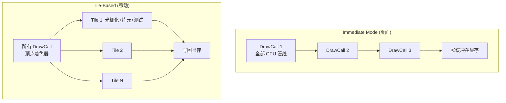

# 第八章 移动端渲染架构与调试

> **一句话理解**：移动端 GPU 和桌面 GPU 的架构完全不同——桌面的 Immediate Mode 是"DrawCall 来了就画"，移动端的 Tile-Based 是"把屏幕切成小块，一块一块画"。这个差异决定了移动端几乎所有性能优化的方向。

> 📋 前置知识：Ch1（渲染管线的深度测试与混合阶段——理解 Tile-Based GPU 的关键）、Ch6（前向渲染——为什么移动端首选前向）、引擎 Ch5（性能优化的实践视角）

---

## 8.1 两种 GPU 架构

### Immediate Mode（桌面 GPU）

```
NVIDIA / AMD 桌面 GPU 的工作方式：

1. CPU 提交 DrawCall
2. GPU 立即处理：
   顶点着色 → 光栅化 → 片元着色 → 深度测试 → 写入帧缓冲（在显存中）
3. 下一个 DrawCall

特征：
  - 帧缓冲在显存（VRAM）中——每次深度读写都走显存总线
  - 显存带宽巨大（3090 ≈ 936 GB/s）
  - 功耗不是问题（插着电源，250W+ 没关系）
  - Early-Z 非常重要——尽可能在片元着色前干掉被挡住的片元
```

### Tile-Based Rendering（移动 GPU）

```
ARM Mali / Qualcomm Adreno / Apple GPU 的工作方式：

1. CPU 提交所有 DrawCall → GPU 先只跑顶点着色器
2. 将屏幕切成 Tile（通常 16×16 或 32×32 像素）
3. 对每个 Tile：
   a. 将 Tile 的帧缓冲加载到片上 SRAM（极快——~50 GB/s）
   b. 对这个 Tile 涉及的所有片元跑片元着色器 + 深度测试 + 混合
   c. 将 Tile 的最终颜色写回显存
4. 重复下一个 Tile

特征：
  - 帧缓冲在片上 SRAM 中——深度/颜色读写极快
  - 带宽极小（中端手机 ≈ 30-50 GB/s——PC 的 1/20）
  - 功耗敏感（靠电池，< 5W）
  - Overdraw = 直接的性能杀手（每个 Tile 的 SRAM 容量有限）
```

### 核心差异对比



| 维度 | 桌面 GPU (Immediate) | 移动 GPU (Tile-Based) |
|------|---------------------|----------------------|
| 帧缓冲位置 | 显存 (VRAM) | 片上 SRAM（Tile 内） |
| 带宽 | 300-1000 GB/s | 30-60 GB/s |
| 功耗 | 75-300W | 2-5W |
| Overdraw 代价 | 高（重算片元） | **极高**（还占 Tile SRAM） |
| DrawCall 代价 | 高（驱动层重） | 中等（Vulkan 更低） |
| 首选架构 | 延迟渲染/Forward+ | **前向渲染** |
| MSAA | 几乎免费（硬件支持） | 有开销（占用 Tile SRAM） |

### Load/Store Action —— Tile Memory 的开关

```
Tile-Based GPU 的核心优势是帧缓冲在片上 SRAM 中。
但这也带来了一个问题：每个 Tile 开始渲染之前，
GPU 需要把显存中的旧数据加载到 Tile SRAM（Load），
渲染完之后把 Tile 的最终颜色写回显存（Store）。

这两个操作本身就消耗带宽。如果你不需要旧数据，
或者最终颜色不需要写回，可以跳过这些步骤——
这就叫 Load/Store Action。

Vulkan:
  VkAttachmentDescription {
      loadOp  = VK_ATTACHMENT_LOAD_OP_CLEAR / LOAD / DONT_CARE
      storeOp = VK_ATTACHMENT_STORE_OP_STORE / DONT_CARE
  }

Metal:
  MTLRenderPassDescriptor {
      loadAction  = MTLLoadActionClear / Load / DontCare
      storeAction = MTLStoreActionStore / DontCare
  }

Unity (URP/HDRP 底层——Vulkan/Metal 平台自动映射):
  通常不需要手动设置，但理解它有助于理解性能：
  
  Load Action:
    Clear  = 不清除显存，直接清 Tile SRAM → 0 带宽（最优）
    Load   = 从显存加载旧数据到 Tile SRAM → 消耗带宽
    DontCare = 不保证内容——GPU 可以优化为 Clear
    
  Store Action:
    Store    = 写回显存 → 消耗带宽
    DontCare = 丢弃（如深度缓冲只在当前 Pass 使用 → 不用写回）

关键优化：
  - 深度缓冲在后续 Pass 不再使用时 → StoreAction = DontCare（省掉一次写回）
    1920×1080 × 32bit = 8MB 写回，60 FPS = 480 MB/s 的带宽省下来
  - 渲染第一帧 → 用 Clear（不加载显存上的随机数据）
  - 后处理 Pass 的中间 RT → LoadAction = DontCare（用上一 Pass 的输出，不需要显存旧数据）

移动端：合理使用 Load/Store Action 可以节省 20-30% 的带宽。
桌面端：也有用，但不如移动端关键（带宽充裕）。
```

---

## 8.2 移动端的性能瓶颈

### 瓶颈一：带宽

```
移动端 GPU 的带宽极其有限。
一部中端手机的 GPU 带宽 ≈ 40 GB/s，高端 ≈ 60 GB/s。
作为对比，RTX 3090 ≈ 936 GB/s。

每帧带宽消耗的估算（1920×1080, 60 FPS）：

正常渲染：
  GBuffer 写入（4 张 RT × 32bpp）: 1920×1080×4×4 = 33 MB
  GBuffer 读取（Lighting Pass）: 33 MB
  Shadow Map（1024×1024, 32bpp）: 4 MB
  纹理采样（100 张贴图 × 平均 1MB/贴图, 50% Cache Hit）: 50 MB
  ─────────────────────────────────────────────────
  总计 ≈ 120 MB/帧 × 60 FPS = 7.2 GB/s
  占带宽的 18%（40 GB/s 的话）——还行

加了 HDR Bloom（降采样 + 升采样）:
  额外的 RT 读写 → +30 MB/帧
  总计 ≈ 9 GB/s——OK

加了 MSAA 4×:
  所有 RT × 4！→ GBuffer 从 33MB → 132MB
  总计 ≈ 15 GB/s——接近极限了，帧率会掉
```

### 瓶颈二：Overdraw

```
桌面 GPU：Overdraw = 多余的片元着色器执行
移动 GPU：Overdraw = 多余的片元着色器执行 + Tile SRAM 被撑满

Tile SRAM 的大小有限（通常 16-32 KB），存的是这个 Tile 的：
  - 颜色缓冲 × 采样数（MSAA 的话 ×4）
  - 深度缓冲
  - Stencil 缓冲

一个 32×32 的 Tile，RGBA8 + 32bit Depth：
  颜色：32×32×4 = 4096 bytes
  深度：32×32×4 = 4096 bytes
  ─────────────────────────
  总共：8 KB

如果 Overdraw = 5×（同一个像素被画了 5 次）:
  片元着色器跑了 5 次——每次都可能去显存取纹理 → 带宽消耗 ×5
  其中 4 次最终被深度测试丢弃了——但带宽和算力已经浪费了
```

### 瓶颈三：全屏后处理

```
Bloom 的降采样 RT：
  1920×1080 + 960×540 + 480×270 + 240×135
  = 2.07M + 0.52M + 0.13M + 0.03M ≈ 2.75M 像素
  每帧多 2.75M 次片元着色器执行

移动端：
  每个后处理 Pass = 一次显存读写（加载 RT → 处理后 → 写回）
  Bloom 的 6 个 Pass = 6 次全屏读写 → 带宽压力大
```

---

## 8.3 移动端渲染优化清单

### 纹理压缩

```
PC：DXT（BC1-BC7）——桌面 GPU 都支持
Android：ETC2（必须支持——OpenGL ES 3.0 标准）
           ASTC（推荐——质量最高，但旧设备不支持）
iOS：     ASTC（A8+ 芯片都支持——iPhone 6 以上）

不同格式的内存占用（1024×1024 纹理）：
  RGBA32（未压缩）: 4 MB
  ETC2:            1 MB（4:1）
  ASTC 4×4:        1 MB（4:1）
  ASTC 6×6:        455 KB（9:1——质量略低于 4×4 但压缩比高）

移动端绝不能用 DXT/BC：
  移动 GPU 不支持 → 引擎回退到未压缩 RGBA32 → 内存爆炸
  必须通过 Unity 的 Texture Import Override 分别设置各平台格式
```

### MSAA 的真实代价

```
桌面：
  硬件 MSAA 4× = 几乎免费（RDNA/GCN 架构的硬件优化）
  帧缓冲开销增加不多（子像素共享片元着色器的输出）

移动：
  MSAA 4× = Tile SRAM 消耗 ×4
  一个 Tile 存 4 个子像素的颜色 + 深度：
    颜色：32×32×4×4 = 16 KB（原来 4 KB）
    深度：32×32×4×4 = 16 KB（原来 4 KB）
    ──────────────────────────────────
    总计：32 KB → 可能超过 Tile SRAM 上限！
    
  后果：GPU 必须做"Tile 分拆"——一个大 Tile 拆成更多小 Tile
        更多 Tile = 更多 Tile 切换开销 = 性能下降

移动端策略：
  中低端设备：不用 MSAA，用 FXAA（后处理——几乎零开销）
  高端设备：MSAA 2× 或 4×（够强的话）
```

### Clip / Discard 的隐藏代价

```hlsl
// ❌ 移动端性能杀手
float4 AlphaTestPS(float2 uv : TEXCOORD) : SV_TARGET {
    float4 texColor = SAMPLE_TEXTURE2D(_MainTex, sampler_MainTex, uv);
    clip(texColor.a - 0.5);  // 透明度不足 → 丢弃片元
    return texColor;
}

// 桌面：clip() 没什么关系——Early-Z 失效，但带宽充裕
// 移动：clip() 导致整个 Tile 的 Early-Z 失效！
//       GPU 不能提前做深度测试（因为 clip 可能在深度测试之后的逻辑中）
//       → 所有片元必须跑完片元着色器 → Overdraw 代价全付

// ✅ 移动端替代：用 Alpha Blend 替代 Alpha Test
// 或者——如果真的需要 clip，确保它在 Shader 中越早越好
```

### Shader 优化

```hlsl
// ❌ 移动端不友好的 Shader
// 1. 过多的纹理采样——每次采样都可能 Cache Miss → 带宽
// 2. 复杂的数学运算——移动 GPU 的 ALU 比桌面弱很多
// 3. 动态分支——移动 GPU 的分支预测能力弱，if-else 代价高

// ✅ 移动端友好的 Shader
// 1. 采样数控制在 5-7 个以内
// 2. 用中等精度（half/mediump）而非 float（大多数移动效果看不出差异）
// 3. 尽量避免 clip() 和 discard
// 4. 避免复杂的嵌套循环——展开或移到 CPU 预计算
```

### 移动端渲染预算参考

```
目标：30 FPS（开放世界/RPG）或 60 FPS（动作/射击）

60 FPS 预算（16.67ms/帧）：
  CPU 逻辑 + AI + 物理: < 8ms
  GPU 渲染: < 8ms
    - Shadow Map 渲染: < 1ms
    - 不透明物体:      < 4ms
    - 透明/粒子:       < 1ms
    - 后处理:          < 1ms
    - UI:             < 1ms

DrawCall 预算：
  高端手机（iPhone 14+ / S24）: < 200
  中端手机（2-3 年前旗舰）:     < 100
  低端手机:                     < 50

纹理内存预算：
  高端: < 800 MB
  中端: < 400 MB
  低端: < 200 MB

半透明 Overdraw：
  任意屏幕位置，半透明像素叠加不超过 3-4 层
```

---

## 8.4 RenderDoc 帧调试实战

### 什么是 RenderDoc

```
RenderDoc = 免费的开源图形调试器
  抓取一帧的完整 GPU 命令流
  可以逐 DrawCall 回放
  查看每个 DrawCall 的输入/输出纹理、Shader 常量、Mesh 数据

用途：
  "为什么这个物体没画出来？" → 看深度缓冲区
  "为什么合批失败了？" → 看相邻 DrawCall 的材质/贴图
  "为什么画面在这个地方有奇怪的颜色？" → 逐 DrawCall 排查
```

### 抓帧流程

```
Unity 中使用 RenderDoc：

1. 安装 RenderDoc（renderdoc.org）
2. Unity Build Settings → 勾选 Development Build + Allow Debugging
3. 构建并运行到设备
4. RenderDoc → Attach to Running Instance → 选择你的应用
5. 在应用中触发你想调试的画面
6. RenderDoc → Capture Frame
7. 打开抓帧结果 → 分析
```

### 逐 DrawCall 分析

```
打开抓帧后，左侧是 DrawCall 列表，按执行顺序排列：

1. 先找"异常"的 DrawCall：
   - 看预览窗口——这个 DrawCall 画了什么
   - 看 Mesh View——顶点的输入和输出
   - 看 Texture Viewer——输入/输出的纹理内容

2. 常见排查：
   Q: "为什么这个物体没画出来？"
   → 找到物体的 DrawCall → 看在它之后有没有东西覆盖了它
   → 打开深度缓冲预览——看深度值是否正确

   Q: "为什么合批断了？"
   → 看相邻两个 UI DrawCall
   → 检查 Material 是否相同、Texture 是否是同一张图集

   Q: "为什么这里颜色不对？"
   → 找到这个像素所属的 DrawCall
   → 看 Fragment Shader 的输入（Albedo/Normal/Roughness 贴图）
   → 看 Shader 常量的值（Light Color、Camera Position 等）

   Q: "为什么这个 DrawCall 这么慢？"
   → 看 Mesh View——顶点数是不是异常多？
   → 看 Texture Viewer——贴图是不是过大？
   → 看 Fragment Shader——Shader 复杂度如何？
```

### 实战案例分析

```
案例：角色模型在手机上渲染成黑色

排查步骤：
1. RenderDoc 抓帧 → 找到角色 Mesh 的 DrawCall
2. 看 Fragment Shader 的输出 → 全黑
3. 看输入——Albedo 贴图正常、Normal 贴图正常
4. 看 Shader 常量——_MainLightColor = (0, 0, 0)  ← 找到了！
5. 溯因：场景中的 Directional Light 被一个 Volume 组件覆盖了颜色
6. 修复：移除不正确的 Volume Override
```

---

## 8.5 移动端渲染常见坑

### 坑一：PC 上调好直接发移动版

```
PC 上 120 FPS → 手机上 18 FPS
原因：PC 的 GPU 算力 > 移动 GPU 的 20 倍
     PC 的带宽 > 移动的 15 倍

必须在目标设备上持续测试——不能只在 Editor 里跑。
至少每周一次真机构建，检查帧率和发热。
```

### 坑二：Shader 中 float/half/fixed 混用不当

```hlsl
// ❌ 移动端：所有计算都用 float（32-bit）
float3 color = tex2D(_MainTex, uv).rgb;
float NdotL = dot(normal, lightDir);
// 大多数移动效果 half（16-bit）完全够用

// ✅ 移动端：对精度要求低的值用 half
half3 color = tex2D(_MainTex, uv).rgb;
half NdotL = dot((half3)normal, (half3)lightDir);
// 移动 GPU 对 half 运算有专门的快速通道
```

### 坑三：同时开启多个全屏后处理

```
Bloom + SSAO + Depth of Field + Motion Blur + Color Grading
→ 每帧 10+ 次全屏 RT 读写 → 移动端带宽直接撑爆

移动端后处理策略：
  只开 Bloom（降采样 + 升采样 → 6 Pass）
  + Tone Mapping（1 Pass）
  + FXAA（1 Pass，替代 MSAA）
  = 8 Pass——够多了
  不要开 SSAO（太贵）、不要开 DoF（太贵）、Motion Blur 看情况
```

### 坑四：大量半透明粒子叠加

```
10 个爆炸特效同时播放 → 屏幕中心 Overdraw 可能达到 15-20×
→ Tile GPU 的 SRAM 撑不住 → 帧率从 30 掉到 12

解决：
  减少粒子数量 + 缩小粒子大小
  用"软粒子"（Soft Particles——靠近几何体时淡出）
  限制同一位置同时存在的粒子数
```

---

## 8.6 面试口述

### Q："移动端 GPU 和桌面 GPU 的区别？为什么移动端对 Overdraw 特别敏感？"

```
"架构上的区别——桌面是 Immediate Mode，移动是 Tile-Based Rendering。

桌面 GPU 有巨大的显存带宽（500+ GB/s），帧缓冲在显存中，
Overdraw 只是多算了片元着色器。

移动 GPU 把帧缓冲放在片上 SRAM 中，一个 Tile（32×32 像素）的 SRAM
只有 16-32 KB。Overdraw 太多会撑满 Tile SRAM，
GPU 必须做 Tile 拆分——更多 Tile 切换开销，性能下降。

此外移动端的带宽只有 30-60 GB/s，是桌面的 1/15-1/20。
每次额外的纹理采样、RT 读写都在吃这个有限的带宽。

所以移动端要特别注意——
能不开的后处理不开、用前向渲染而非延迟渲染、
压缩所有纹理、用 FXAA 替代 MSAA。"
```

### Q："你用过 RenderDoc 吗？怎么用它排查渲染问题？"

```
"用过。RenderDoc 是抓帧调试工具。

它的核心是做逐 DrawCall 回放——
你可以看到每一帧里每个 DrawCall 的输入纹理、Shader 常量、
输出结果和深度/模板缓冲的状态。

常见排查：
物体没画出来→看深度缓冲是不是被前面的东西挡住了。
合批失败→看相邻 UI DrawCall 的材质和贴图是否一致。
颜色不对→逐 DrawCall 看 Shader 输入和常量值。
性能问题→看 Mesh 顶点数、纹理大小、Shader 复杂度。

移动端排查时注意：在手机上抓帧比 PC 上更能反映真实性能——
Editor 里的 DrawCall 顺序和真机可能完全不同。"
```

---

## 8.7 全系列终章回顾

```
图形学系列 8 章——从渲染管线到移动端架构：

Ch1 渲染管线    → 从 CPU 提交 DrawCall 到屏幕像素，MVP 变换
Ch2 纹理与采样  → MipMap、三线性、各向异性、压缩格式（ASTC/BC）
Ch3 光照模型    → Phong → Blinn-Phong → PBR 入门，法线贴图
Ch4 阴影技术    → Shadow Map、CSM、PCF、移动端阴影策略
Ch5 PBR 深入    → Cook-Torrance BRDF（D/G/F）、IBL（辐照度/预过滤/LUT）
Ch6 渲染架构    → 前向 vs 延迟 vs Forward+、G-Buffer 布局
Ch7 后处理 & GI → Bloom、Tone Mapping、SSAO、Light/Reflection Probe
Ch8 移动端      → Tile-Based GPU、Load/Store Action、带宽瓶颈、RenderDoc 帧调试

8 章覆盖了客户端开发需要知道的图形学全部核心知识——
从面试基础题（渲染管线/Phong）到区分度题（延迟渲染/CSM/PBR 公式），
到实战题（移动端优化/RenderDoc 排查）。
```

---

> 📖 全系列完结。每一章的目标不变：面试中不仅答"是什么"，还能说"为什么这样设计"和"我遇到过这个坑"。

---

> 📖 本系列全部文章均采用 CC BY-NC-SA 4.0 协议发布。
