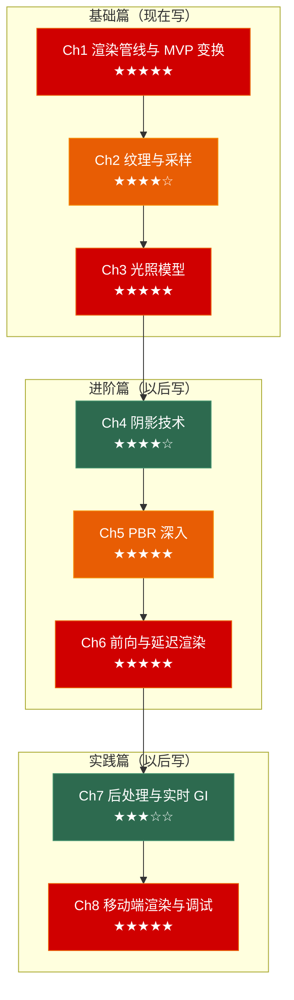

# 图形学笔记：从渲染管线到移动端架构

> 面向**游戏客户端开发岗**的图形学笔记系列。每章覆盖：**原理图解 → 管线剖析 → 面试考点 → 🎮 游戏实战**。
>
> **定位**：不是 Shader 编程教程，而是**渲染原理 + 性能理解 + 面试考点**。从客户端开发的角度讲图形学——够用，但不做图形程序员。

---

## 系列全景



---

## 与已学系列的衔接

| 前置知识 | 在图形学系列中的应用 |
|---------|-------------------|
| 引擎 Ch1（游戏循环） | 渲染在帧循环中的位置——CPU 提交 → GPU 执行的时序 |
| 引擎 Ch5（性能优化） | Ch6 前向/延迟渲染 vs 引擎 Ch5 合批策略——两个视角看同一个问题 |
| 算法 Ch1（排序） | 透明物体从后往前排序、Early-Z 利用不透明物体从前到后排序 |
| OS Ch4（CPU 缓存） | GPU 缓存架构——纹理采样的 Cache Miss 代价 |
| C++ Ch3（虚函数表） | 图形 API 的设计模式——Command Buffer、资源绑定、状态管理 |

---

## 章节导航

### 📗 基础篇 —— 现在写

---

#### [第一章 渲染管线与 MVP 变换](./01_rendering_pipeline) 🔜

> 图形学的地基。面试问"描述渲染管线"的概率接近 100%。

**核心问题**：
- 从 `DrawMesh` 调用到屏幕上的像素，数据经过了哪些阶段？
- 每个阶段做什么？哪些是可编程的（Shader），哪些是固定管线？
- MVP 三个矩阵分别做什么？为什么需要三个？

**原理图解**：
- 渲染管线完整流程图（应用 → 几何 → 光栅化 → 像素）
- MVP 变换的每个空间转换：模型空间 → 世界空间 → 观察空间 → 裁剪空间 → NDC → 屏幕空间
- 透视除法的几何意义——为什么远处的物体变小

**核心内容**：
- **应用阶段 (CPU)**：剔除、合批、设置渲染状态、提交 DrawCall
- **几何阶段 (GPU)**：顶点着色器 → 曲面细分 → 几何着色器 → 裁剪 → 屏幕映射
- **光栅化阶段 (GPU)**：三角形设置 → 三角形遍历 → 片元着色器 → 深度/模板/Alpha 测试 → 混合
- **MVP 详解**：Model（模型→世界）、View（世界→观察）、Projection（观察→裁剪，透视 vs 正交）
- **NDC 与视口变换**：从 [-1,1]³ 到屏幕像素坐标

**面试高频**：
- "描述渲染管线的各个阶段"
- "MVP 三个矩阵分别做什么？为什么不能合为一个？"
- "顶点着色器和片元着色器分别处理什么？为什么先顶点后片元？"

**🎮 游戏实战**：
- UI 为什么用正交投影、3D 场景用透视投影
- 世界坐标 → 屏幕坐标的完整转换（头顶血条定位）

---

#### [第二章 纹理与采样](./02_texture_and_sampling) 🔜

> 纹理不只是"贴图"——理解采样、过滤、压缩格式，是客户端开发的基本功。

**核心问题**：
- 为什么纹理放大时模糊、缩小时闪烁？MipMap 怎么解决？
- 各向异性过滤 (Anisotropic Filtering) 解决什么问题？
- DXT/ASTC/ETC 这些压缩格式有什么区别？怎么选？

**原理图解**：
- UV 坐标 → 纹理坐标 → 纹素采样
- MipMap 的金字塔层级结构
- 双线性 vs 三线性 vs 各向异性过滤的采样范围对比
- 压缩格式的块压缩原理（4×4 块）

**核心内容**：
- **纹理采样的本质**：屏幕上一个像素对应纹理上的一块区域——不是点对点
- **放大过滤 (Magnification)**：Bilinear——取最近 4 个纹素混合
- **缩小过滤 (Minification)**：MipMap——预先生成各级缩小版，根据屏幕占比选层级
- **三线性过滤**：MipMap 层级之间再做插值——消除 MipMap 切换时的接缝
- **各向异性过滤**：纹理在倾斜表面上的采样区域是长条形——不是正方形
- **纹理压缩**：DXT/BC（PC）vs ASTC（移动端）——压缩原理和选用指南
- **纹理尺寸**：为什么用 2 的幂？为什么不是越大越好？

**面试高频**：
- "MipMap 是什么？为什么要用？"
- "双线性和三线性的区别？各向异性过滤解决什么问题？"
- "移动端用什么纹理压缩格式？为什么不能用 PC 的 DXT？"

**🎮 游戏实战**：
- 不同的 MipMap Bias 调节画面锐度 vs 闪烁的平衡
- 纹理 Streaming——大世界不能把所有纹理加载到显存

---

#### [第三章 光照模型](./03_lighting_models) 🔜

> Phong 和 Blinn-Phong 的区别是经典面试题。PBR 概念题也越来越常见。

**核心问题**：
- 光照模型的核心——为什么物体看起来是"立体的"？
- Phong 和 Blinn-Phong 差在哪一个计算？哪个更快？
- PBR 的核心思想是什么？和传统光照模型的本质区别？

**原理图解**：
- Phong 的三个分量：Ambient + Diffuse + Specular
- Blinn-Phong 的 Halfway Vector——一步优化省掉了反射向量的计算
- PBR 的 BRDF：漫反射项 + 高光项，能量守恒的图示
- 法线贴图的切线空间示意图

**核心内容**：
- **环境光 (Ambient)**：全局间接光照的粗略近似——PBR 中会被 IBL 替代
- **漫反射 (Diffuse)**：Lambert 定律——亮度只和入射角有关，和视角无关
- **高光 (Specular)**：Phong（R·V）→ Blinn-Phong（N·H）→ 性能对比
- **PBR 概念**：Metallic/Roughness 工作流——为什么 PBR 在不同光照下都真实
- **法线贴图**：切线空间存储法线扰动——不增加面数让低模模拟高模光照
- **为什么法线贴图是蓝紫色的**：切线空间默认法线 (0, 0, 1) → RGB (128, 128, 255)

**面试高频**：
- "Phong 和 Blinn-Phong 光照模型的区别？"
- "PBR 的核心思想？为什么它比传统模型更真实？"
- "法线贴图的原理？为什么贴图是蓝紫色的？"

**🎮 游戏实战**：
- 同一个 PBR 材质在室内/室外的表现一致性
- 角色旋转后法线贴图仍然正确——切线空间的功劳

---

### 📘 进阶篇 —— 以后写

---

#### 第四章 阴影技术

> Shadow Map 是所有实时阴影的基础。CSM 是大世界阴影的标配。

**核心问题**：
- Shadow Map 的生成过程——从光源视角渲染深度图
- 阴影痤疮 (Shadow Acne) 和彼得潘现象 (Peter Panning) 怎么解决？
- CSM 怎么处理大世界阴影——为什么近处阴影清晰远处模糊？

**原理图解**：
- Shadow Map 的原理：光源视角渲染 → 深度图 → 摄像机视角采样深度图 → 比较深度
- Shadow Acne 的成因——浮点精度 + 采样偏移
- CSM 的分级策略——视锥体切分为多个区域，近处分辨率高远处分辨率低

**核心内容**：
- **Shadow Map 流程**：Pass 1 光源视角渲染深度 → Pass 2 摄像机渲染时采样比较
- **Bias 调优**：Depth Bias（偏移深度值）vs Normal Bias（沿法线偏移采样点）
- **PCF (Percentage Closer Filtering)**：对周围多个纹素采样取平均——消除锯齿
- **CSM (Cascaded Shadow Maps)**：视锥体分层，每层一张 Shadow Map
- **移动端阴影**：单级 Shadow Map + PCF，不用 CSM（太贵）

**面试高频**：
- "Shadow Map 的原理？Shadow Acne 怎么解决？"
- "CSM 的分级策略？为什么近处和远处置不同分辨率？"

---

#### 第五章 PBR 深入

> 从概念到公式——客户端开发不需要手推 BRDF，但需要理解每个参数影响什么。

**核心问题**：
- Cook-Torrance BRDF 的三个项：法线分布 (D)、几何遮蔽 (G)、菲涅尔 (F)
- 金属度和粗糙度在公式中分别影响哪个项？
- IBL (Image-Based Lighting) 是什么？环境贴图怎么照亮物体的？

**原理图解**：
- BRDF 的输入输出：入射方向 → BRDF → 出射方向的反射率分布
- D/F/G 三项各自的作用——微观表面模型
- IBL 的两张图：辐照度图 (Irradiance Map) + 预过滤环境图 (Prefiltered Environment Map)

**核心内容**：
- **微表面理论**：物体表面由无数微小镜面组成——粗糙度 = 微表面法线分布的宽度
- **法线分布函数 (D)**：Trowbridge-Reitz (GGX)——粗糙度越低高光越集中
- **几何遮蔽函数 (G)**：微表面之间的互相遮挡——Smith 模型
- **菲涅尔效应 (F)**：Schlick 近似——掠射角时反射率趋近 1（水面远处比近处反光强）
- **IBL**：用环境贴图模拟全局光照——漫反射 + 镜面反射两张查找表
- **金属度 vs 粗糙度**：金属反射没有漫反射项，非金属有——这是 PBR 简化背后的物理

**面试高频**：
- "PBR 的 BRDF 包含哪几项？各自的作用？"
- "金属度和粗糙度在 PBR 工作流中分别控制什么？"

---

#### 第六章 前向渲染与延迟渲染

> 这是渲染管线的架构级问题——客户端开发的必考题。

**核心问题**：
- 前向渲染的 DrawCall 数 = 物体数 × 光源数，为什么？
- 延迟渲染怎么把光照计算推迟到屏幕空间？为什么 DrawCall 与光源数无关？
- 为什么延迟渲染不支持 MSAA？为什么透明物体必须走前向？

**原理图解**：
- 前向渲染：几何 Pass = 渲染 + 光照同时做——每个物体 × 每盏灯
- 延迟渲染：几何 Pass 写 G-Buffer → 光照 Pass 在屏幕空间逐像素计算
- G-Buffer 的布局：Albedo/RGB + Normal/RGB + Depth + Metallic/Roughness/AO

**核心内容**：
- **前向渲染**：每个物体对每盏可见光做一遍光照——适合光源少的场景
- **延迟渲染**：几何信息写入 G-Buffer → 光照在屏幕空间计算——光源数无关
- **G-Buffer**：Albedo(RGB8), Normal(RGB10A2), Depth(24bit), PBR params(RGBA8)
- **延迟渲染的局限**：不支持 MSAA（G-Buffer 丢失了几何信息）、透明物体必须额外前向 Pass
- **Forward+ / Clustered Forward**：把屏幕分块，每个块记录影响它的光源——取两者之长
- **Tile-Based Rendering (移动 GPU)**：GPU 自己分 Tile 做光照——和 Clustered Forward 思想类似

**面试高频**：
- "前向渲染和延迟渲染的区别？各有什么优缺点？"
- "G-Buffer 存什么？为什么延迟渲染不支持 MSAA？"
- "Forward+ 是什么？解决什么问题？"

---

### 📙 实践篇 —— 以后写

---

#### 第七章 后处理与实时 GI 入门

> 后处理是画面质感的最后一步。GI 是真实感的来源。

**核心问题**：
- Bloom 是怎么实现"亮的地方发光"的？
- HDR 和 Tone Mapping 的关系——为什么先 HDR 渲染再映射到 LDR？
- Light Probe 和 Reflection Probe 分别解决什么问题？

**原理图解**：
- Bloom 的步骤：提取亮部 → 模糊（降采样 → 升采样）→ 叠加原图
- HDR → Tone Mapping 的流程：高动态范围渲染 → 色调映射到 LDR → Gamma 校正
- Light Probe 的球谐函数示意——用几个系数编码一个方向上的光照

**核心内容**：
- **Bloom**：高斯模糊 + 叠加——亮区扩散到周围暗区
- **HDR vs LDR**：真实世界亮度范围巨大（太阳 1e9，室内 1e2）→ HDR 保留 → Tone Mapping 压缩到显示器
- **Tone Mapping**：ACES（电影级）/ Reinhard（简单）/ Neutral（Unity 默认）
- **SSAO**：屏幕空间环境光遮蔽——用深度缓冲估算裂缝/角落的暗度
- **Light Probe**：场景中分布的光照采样球——动态物体移动时插值周围 Probe 获得间接光照
- **Reflection Probe**：360° 环境贴图 + 盒投影——镜子/金属反射的廉价方案

**面试高频**：
- "Bloom 是怎么实现的？"
- "HDR 和 Tone Mapping 的关系？"
- "Light Probe 怎么工作的？为什么动态物体也能有间接光照？"

---

#### 第八章 移动端渲染架构与调试

> 移动端 GPU 和桌面 GPU 完全不同的架构——Tile-Based Rendering。客户端开发必须懂。

**核心问题**：
- 移动端 GPU (Tile-Based) 和桌面 GPU (Immediate Mode) 的核心区别？
- 为什么移动端对 Overdraw 特别敏感？
- RenderDoc 怎么用？一个 DrawCall 的完整数据怎么看？

**原理图解**：
- Immediate Mode GPU vs Tile-Based GPU 的架构对比
- Tile-Based 的渲染流程：顶点处理 → Binning → 逐 Tile 光栅化 → 片元着色
- 移动端的带宽瓶颈——显存带宽是算力的 1/5

**核心内容**：
- **Immediate Mode (桌面)**：DrawCall 来了就画——简单直接但带宽需求大
- **Tile-Based (移动端)**：画面切成 tile（16×16 或 32×32 像素），一个 tile 一个 tile 画——帧缓冲在片上 SRAM
- **为什么 Tile-Based 对 Overdraw 敏感**：片上 SRAM 虽快但很小——Overdraw 会撑爆 Tile Memory
- **Vulkan/Metal 的 Load/Store Action**：明确控制 Tile Memory 的加载和写回——关键优化点
- **RenderDoc 实战**：抓帧 → 看 DrawCall 列表 → 看输入/输出纹理 → 看 Shader 常量 → 定位问题
- **常见移动端渲染坑**：MSAA 性能开销、Clip() 导致 Early-Z 失效、全屏后处理填充率爆炸

**面试高频**：
- "移动端 GPU 和桌面 GPU 的区别？"
- "为什么移动端对 Overdraw 和带宽特别敏感？"
- "RenderDoc 怎么用？你用它解决过什么问题？"

---

## 系列特色

| 特色 | 说明 |
|------|------|
| **8 章全覆盖** | 从渲染管线到移动端架构——客户端开发的图形学知识边界 |
| **面试锚点** | 每章标注高频面试题——从实习生到正职都覆盖 |
| **与引擎互补** | Ch6 前向/延迟 vs 引擎 Ch5 合批——底层原理 + 工业实践 |
| **移动端专章** | Ch8 专门讲 Tile-Based GPU——大部分图形学课程忽略了这个 |
| **RenderDoc 实战** | Ch8 带完整的帧调试流程——面试能展示调试能力 |

---

## 阅读与写作路线

```
现在写：   Ch1 → Ch2 → Ch3（基础篇——面试必考，大二打好地基）
大二暑假： Ch4 → Ch5（进阶篇——阴影和PBR，带着项目经验回头看更有体会）
大三：     Ch6 → Ch7 → Ch8（架构与实践篇——面试正职的关键区分点）
```

> 📖 本系列全部文章均采用 CC BY-NC-SA 4.0 协议发布。
