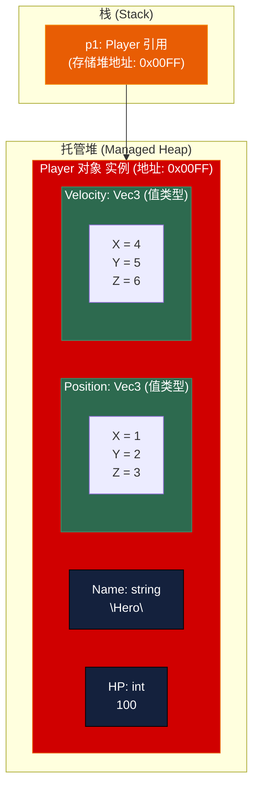
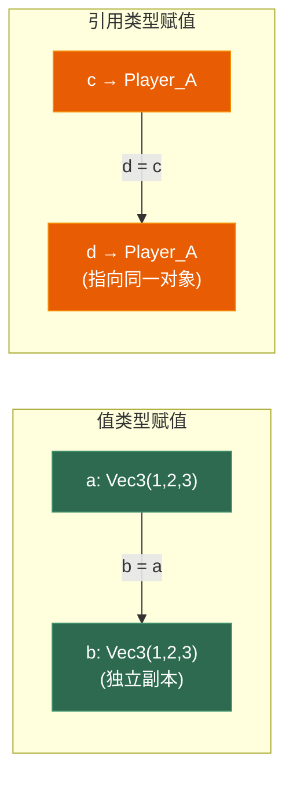
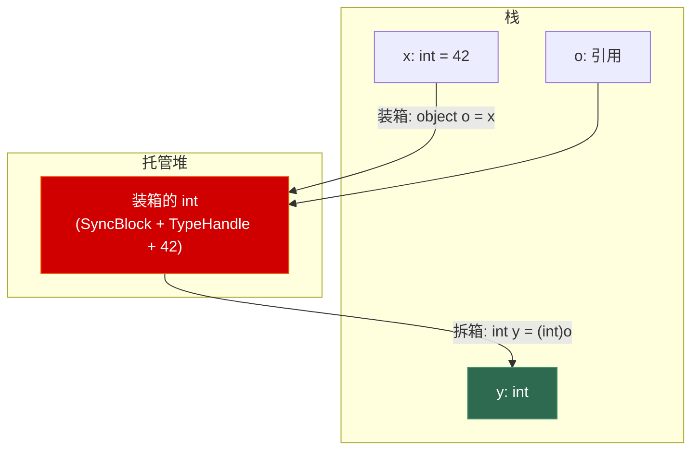

# 第一章 C# 类型系统与内存布局

> **一句话理解**：C# 的类型系统不是 C++ 的"一切都是字节"，而是一个精心设计的**双轨制**——值类型追求栈上分配与零 GC 压力，引用类型追求灵活共享与托管安全。理解这个分裂设计，是写出高性能 C# 的第一步。

---

## 1.1 概念直觉 —— 双轨制从何而来

### C++ 的"统一模型"

在 C++ 中，你声明一个对象，它就存在于你声明的地方：

```cpp
// C++：对象在哪，完全取决于你怎么声明
struct Vec3 { float x, y, z; };

Vec3 v1;                    // 栈上
Vec3* v2 = new Vec3();      // 堆上
Vec3& v3 = v1;              // 引用（别名），不影响存储位置
// 一切类型都可以放在栈上，也可以放在堆上，你说了算
```

### C# 的"分裂模型"

```csharp
// C#：类型本身决定了它的默认"家"
struct Vec3 { public float X, Y, Z; }   // 值类型 → 天生倾向栈
class Player { public string Name; }     // 引用类型 → 永远在堆上

Vec3 v1;                // 栈上（值类型）
Vec3 v2 = new Vec3();   // 还是栈上！new 不改变值类型的存储位置
Player p1 = new Player(); // 堆上（引用类型）
// p1 本身是引用（类似指针），存在栈上，指向堆上的 Player 对象
```

**核心矛盾**：C# 把"类型"和"存储位置"绑定了。值类型 struct 默认在栈，引用类型 class 永远在堆。你不能像 C++ 那样自由选择。

这是 C# 最大的设计妥协，也是最大的性能优化机会。

---

## 1.2 原理图解

### 1.2.1 值类型 vs 引用类型的内存布局



### 1.2.2 赋值语义：值类型复制，引用类型共享



---

## 1.3 底层机制剖析

### 1.3.1 值类型（struct）的完整规则

```csharp
// 值类型包括：所有内置数值类型（int, float, double...）、
// bool、char、enum、struct、ref struct（Span<T>等）

// struct 的特性
struct Point
{
    public int X;
    public int Y;
    
    // ❌ 不能有无参构造函数（C# 9 及之前）
    // public Point() { X = 0; Y = 0; }  // 编译错误！
    
    // ✅ 可以有有参构造函数
    public Point(int x, int y) { X = x; Y = y; }
    
    // ❌ 不能有析构函数（finalizer）
    // ~Point() { }
    
    // ❌ 不能继承其他 struct 或 class（除了接口）
    // struct Point3D : Point { }  // 编译错误！
    
    // ✅ 可以实现接口（但会触发装箱，后面细讲）
}

// 关键：struct 的所有字段也必须是有确定大小的类型
// 这意味着 struct 的大小在编译期就完全确定
```

```csharp
// 值类型的"零初始化"行为
Point p1;                // 字段都是默认值（X=0, Y=0）
// Console.WriteLine(p1.X);  // ❌ 编译错误！p1 没有"明确赋值"

Point p2 = new Point();  // 等价于 default(Point)，不是堆分配！
Console.WriteLine(p2.X); // ✅ 明确赋值了，可以访问

// struct 的 default 就是全零 —— 这是 C# 和 C++ 的重要区别
// C++ 的 int x; 是未定义值，C# 的 int x; 固定是 0（但要求明确赋值）
```

### 1.3.2 引用类型（class）的完整规则

```csharp
// 引用类型包括：class、interface、delegate、record、string、数组

class Player
{
    public string Name;   // Name 本身也是引用类型
    public int HP;        // int 是值类型，但作为 class 的字段 → 内嵌在堆上
    
    public Player(string name)
    {
        Name = name;
        HP = 100;
    }
    
    ~Player()  // Finalizer（析构函数），GC 回收前调用
    {
        // 清理非托管资源
    }
}

// 声明和初始化
Player p1;                // p1 是 null！（引用类型默认值是 null）
// p1.Name;               // ❌ NullReferenceException

Player p2 = new Player("Hero");  // new → 堆分配
// p2 变量本身在栈上，指向堆上的 Player 对象
```

### 1.3.3 struct vs class 选型表

| 维度 | struct（值类型） | class（引用类型） |
|------|-----------------|-------------------|
| **存储位置** | 栈 / 内嵌在包含类型中 | 托管堆 |
| **赋值语义** | 完整拷贝（值拷贝） | 引用拷贝（共享对象） |
| **默认值** | 全零（`default(T)`） | `null` |
| **继承** | 只能实现接口，不能继承 | 支持单继承 + 多接口 |
| **null** | 不可能为 null（除非 `T?`） | 可以为 null |
| **析构函数** | 不支持 | 支持 Finalizer |
| **GC 压力** | 无（栈自动回收） | 有（GC 追踪） |
| **sizeof** | 编译期确定 | 运行时确定（含对象头） |
| **适合场景** | 小数据、临时值、数学类型 | 有状态、需共享、需继承 |

```csharp
// ✅ struct 最佳实践：小而不可变
struct Vector3
{
    public readonly float X, Y, Z;
    public Vector3(float x, float y, float z) => (X, Y, Z) = (x, y, z);
    
    public static Vector3 operator +(Vector3 a, Vector3 b)
        => new Vector3(a.X + b.X, a.Y + b.Y, a.Z + b.Z);
}
// X, Y, Z 是 readonly → 不可变 → 不会有意外的修改传播问题

// ❌ struct 的反模式：大 struct
struct BadLarge
{
    public fixed byte Data[1024]; // 每次赋值都会拷贝 1KB！
}
// 微软建议 struct 大小 < 16 字节（经验值）
```

### 1.3.4 装箱（Boxing）—— 值类型到引用类型的桥梁

装箱是 C# 类型系统中最需要理解也最容易被滥用的机制。

```csharp
// 什么是装箱？
int x = 42;
object o = x;  // 装箱！
// 1. 在托管堆上分配一块内存
// 2. 把 x 的值拷贝到堆上
// 3. o 指向堆上的这个副本

// 拆箱（Unboxing）
int y = (int)o;  // 从堆上拷贝出值，类型必须精确匹配
// long z = (long)o;  // ❌ InvalidCastException！必须完全是 int
```



```csharp
// 装箱发生的常见场景（面试重点！）
int value = 42;

// 场景一：赋值给 object
object obj = value;                          // 装箱

// 场景二：值类型调用接口方法
IComparable<int> comp = value;               // 装箱！

// 场景三：值类型作为泛型 object 参数
void Print(object o) => Console.WriteLine(o);
Print(value);                                // 装箱！

// 场景四：字符串拼接（+ 操作符重载接受 object）
string s = "value is " + value;              // 装箱！（旧版本）

// 场景五：值类型放进非泛型集合
ArrayList list = new ArrayList();
list.Add(value);                             // 装箱！
list.Add(value);                             // 又一次装箱！
```

```csharp
// 装箱的性能代价
// 1. 堆分配（触发 GC）
// 2. 拷贝开销
// 3. 拆箱时的类型检查

// ✅ 避免装箱的手段
// 手段一：用泛型代替 object
List<int> list = new List<int>();  // 不用 ArrayList
list.Add(42);                       // 零装箱

// 手段二：用泛型约束 + 接口
interface IResettable { void Reset(); }
struct Data : IResettable
{
    public int Value;
    public void Reset() => Value = 0;
}

void Process<T>(T item) where T : IResettable
{
    item.Reset();  // 不装箱！泛型约束下的接口调用是零开销
}

// 手段三：重载代替 object 参数
void Print(int x) => Console.WriteLine(x);     // 不装箱
void Print(string s) => Console.WriteLine(s);  // 本来就不装箱
```

### 1.3.5 ref 返回与 ref 局部变量 —— 值类型的"指针感"

```csharp
// C++ 里你可以 int* p = &arr[3]; *p = 10;
// C# 的安全等价物是 ref

int[] array = { 1, 2, 3, 4, 5 };

// ref 局部变量：给数组元素起一个引用别名（不是拷贝！）
ref int element = ref array[2];
element = 42;
Console.WriteLine(array[2]);  // 42 —— 直接修改了数组元素

// ref 返回值：让方法返回一个"指向内部数据的引用"
ref int Find(int[] arr, int target)
{
    for (int i = 0; i < arr.Length; i++)
        if (arr[i] == target)
            return ref arr[i];
    throw new InvalidOperationException("not found");
}

ref int found = ref Find(array, 3);
found = 100;  // 直接修改了数组里的元素
```

```csharp
// 实战：用 ref 返回在 struct 数组里原地修改大 struct
struct Transform
{
    public float PosX, PosY, PosZ;
    public float RotX, RotY, RotZ, RotW;
    // 这么大的 struct（28 字节），拷贝代价不小
}

class TransformManager
{
    private Transform[] _transforms = new Transform[1000];
    
    // ❌ 不好：返回副本，修改无效
    public Transform GetTransform_copy(int i) => _transforms[i];
    
    // ✅ 好：返回 ref，零拷贝原地修改
    public ref Transform GetTransform(int i) => ref _transforms[i];
}

// 使用
manager.GetTransform(5).PosX = 10.0f;  // 直接写入了数组里的 struct
// 对比 C++: transforms[5].posX = 10.0f;  —— 完全一样的体验！
```

### 1.3.6 in / ref / out 参数修饰符

```csharp
// 三个修饰符，都是传引用，但语义不同

// ref：双向，调用前必须初始化
void Multiply(ref int x, int factor) { x *= factor; }
int a = 5;
Multiply(ref a, 3);  // a = 15

// out：单向（输出），方法必须赋值，调用前不需要初始化
bool TryParse(string s, out int result)
{
    // result 在方法内必须赋值
    result = 0;
    return int.TryParse(s, out result);
}
TryParse("123", out int b);  // b = 123

// in：单向（只读），传引用但禁止修改，避免大 struct 拷贝
void PrintVector(in Vector3 v)
{
    Console.WriteLine($"{v.X}, {v.Y}, {v.Z}");
    // v.X = 10;  // ❌ 编译错误！in 参数是只读的
}
Vector3 v = new Vector3(1, 2, 3);
PrintVector(v);    // 传引用，不拷贝 12 字节
PrintVector(in v); // 显式 in（可选）
```

### 1.3.7 Span\<T\> —— 栈上的安全视图

这是 C# 7.2 引入的最重要的性能类型，也是值类型体系中最精巧的设计。

```csharp
// Span<T> 是什么？一个"栈上的安全指针+长度"对
// 它可以指向：数组、栈上内存(stackalloc)、非托管内存、字符串

// Span<T> 的内存布局（和 C++ 的 std::span 类似）：
// struct Span<T> {
//     internal readonly ref T _reference;  // 指向数据的引用
//     internal readonly int _length;       // 长度
// }
// 一共就 2 个指针大小（在 64 位上是 16 字节）

// 基本用法：零分配的切片
int[] data = { 0, 1, 2, 3, 4, 5, 6, 7, 8, 9 };
Span<int> span = data;                // 指向整个数组
Span<int> slice = span.Slice(2, 5);   // 指向索引 2~6，零分配零拷贝！

slice[0] = 42;
Console.WriteLine(data[2]);           // 42 —— 通过 span 修改了原数组
```

```csharp
// Span<T> 是一个 ref struct —— 只能在栈上存在
// 这个限制保证了它永远不会逃逸到堆上，不会被 GC 追踪

// ❌ Span<T> 不能做的事：
Span<int> span = stackalloc int[100];
// object o = span;             // ❌ 不能装箱
// List<Span<int>> list = ...;  // ❌ 不能做泛型参数
// Span<int>[] arr = ...;       // ❌ 不能是数组元素
// async Task M() { Span<int> s; } // ❌ 不能出现在 async 方法中

// 原因：Span<T> 内部持有的是 managed pointer（ref），
// 而堆上的对象会被 GC 移动，ref 指向的内存可能失效。
// 所以把它锁死在栈上，栈上的东西不会被 GC 移动。

// 如果需要把 Span 存到堆上 → 用 Memory<T>
Memory<int> mem = data.AsMemory();
// Memory<T> 不是 ref struct，可以放进 List、class 字段、async 方法
```

```csharp
// stackalloc：在栈上分配数组
Span<int> buffer = stackalloc int[128];  // 栈上 512 字节，不涉及 GC
for (int i = 0; i < buffer.Length; i++)
    buffer[i] = i * i;

// 对比 C++: int buffer[128]; —— 一样的栈分配

// ReadOnlySpan<T>：只读版本
void Process(ReadOnlySpan<int> data)
{
    // 只读访问，不能修改
    for (int i = 0; i < data.Length; i++)
        Console.WriteLine(data[i]);
}

int[] arr = { 1, 2, 3 };
List<int> list = new List<int> { 4, 5, 6 };
Process(arr);                             // ✅ 数组
Process(list.ToArray());                  // ❌ ToArray 额外分配
Process(CollectionsMarshal.AsSpan(list)); // ✅ 直接获取 List 内部 span，零分配
```

### 1.3.8 可空值类型（Nullable\<T\>）

```csharp
// 值类型默认不能为 null，但你有时候需要"没有值"这个状态
int? maybe = null;           // 等价于 Nullable<int>
if (maybe.HasValue)
    Console.WriteLine(maybe.Value);

// Nullable<T> 本身也是一个 struct：
// struct Nullable<T> where T : struct {
//     bool hasValue;
//     T value;
// }

// 语法糖
int? a = 5;
int b = a ?? 0;       // null 合并：a 有值取 a，否则取 0
int c = a ?? default; // 等价于 a ?? 0

// C# 8.0 起：可空引用类型（Nullable Reference Types）
// 这是编译期检查，不是新的运行时类型
#nullable enable
string? maybeNull = null;    // 可以赋 null
string mustNotBeNull = "hi";  // 警告：不要赋 null

void Process(string? s)
{
    // Console.WriteLine(s.Length);  // ⚠️ 警告：可能为 null
    if (s != null)
        Console.WriteLine(s.Length); // ✅ 安全
    
    // 或用 null 宽容操作符（告诉编译器"我知道不是 null"）
    Console.WriteLine(s!.Length);
}
```

### 1.3.9 跨语言对比

```cpp
// ====== 同一语义在不同语言中的写法 ======

// 值语义对象
// C++:    Vec3 v(1, 2, 3);
// C#:     Vector3 v = new Vector3(1, 2, 3);  // ← new 不代表堆分配！

// 引用语义对象
// C++:    Player* p = new Player("hero");
// C#:     Player p = new Player("hero");      // ← class 自动是引用

// 只读引用传参
// C++:    void f(const Vec3& v);
// C#:     void f(in Vector3 v);

// 返回值避免拷贝
// C++:    Vec3& get(int i) { return data[i]; }
// C#:     ref Vector3 get(int i) => ref data[i];

// 指向数组的视图
// C++:    std::span<int> s(arr, 5);
// C#:     Span<int> s = arr.AsSpan(2, 5);

// 可空语义
// C++:    std::optional<int> x;
// C#:     int? x = null;
```

---

## 1.4 经典陷阱与面试题

### 1.4.1 这段代码有什么问题？

**陷阱一：struct 的隐式副本**

```csharp
struct Counter { public int Value; }

class Program
{
    static void Main()
    {
        var list = new List<Counter> { new Counter { Value = 0 } };
        
        // Counter c = list[0];   // 拷贝！
        // c.Value = 10;           // 修改的是副本，不是 list 里的！
        
        // ❌ 直观但错误的写法
        list[0].Value = 10;  // CS1612: 不能修改 list[0] 的成员
                             // 因为 list[0] 返回的是临时副本！
    }
}
// ✅ 正确：通过 ref 或者替换整个元素
// list[0] = new Counter { Value = 10 };
```

**陷阱二：foreach 中的值类型**

```csharp
struct Data { public int X; }

var items = new List<Data> { new Data { X = 1 }, new Data { X = 2 } };

// ❌ 不会生效！
foreach (var item in items)
    item.X = 10;  // 编译错误 CS1654 —— 不能修改 foreach 迭代变量

// 原因：对于值类型，foreach 变量是元素的副本
// 即使改成引用：
// foreach (ref var item in items)  // C# 7.3+ 不支持 ref foreach
```

**陷阱三：装箱的隐蔽发生**

```csharp
struct Point { public int X, Y; }

// ❌ 隐蔽的装箱
Point p = new Point { X = 1, Y = 2 };
Console.WriteLine($"{p}");  // 这里会装箱吗？
// 答：会的！Point 没有重写 ToString()，调用的是 object.ToString()
// 但 $"{p}" 在 C# 10+ 中编译器优化了，不会装箱。

// 更明显的例子：
string s = p + "";           // ❌ 装箱（+ 的重载接受 object）
string s2 = p.ToString();    // ✅ 不装箱（Point 有默认 ToString）

// 关键：值类型务必重写 ToString()、GetHashCode()、Equals()
```

### 1.4.2 面试问答

**Q：struct 和 class 的区别？面试中怎么答？**

> 1. **存储位置**：struct 是值类型，分配在栈上或内嵌在包含类型中；class 是引用类型，对象分配在托管堆上。
> 2. **赋值语义**：struct 赋值是完整拷贝；class 赋值是引用拷贝，指向同一对象。
> 3. **默认值**：struct 的 default 是全零（不是 null）；class 的 default 是 null。
> 4. **继承**：struct 隐式继承自 System.ValueType，不能继承其他类型（但可实现接口）；class 支持单继承。
> 5. **性能**：struct 无 GC 压力但大数据量下拷贝代价高；class 有 GC 压力但传递的是引用。微软建议 struct 小于 16 字节。

**Q：什么是装箱？为什么要避免？**

> 装箱是将值类型转为 `object` 或接口类型时，CLR 在托管堆上分配内存并拷贝值的过程。避免原因：① 堆分配增加 GC 压力；② 拷贝有 CPU 开销；③ 拆箱时可能抛 `InvalidCastException`。避免手段：泛型代替 object、泛型约束下的接口调用、重载代替 object 参数。

**Q：Span\<T\> 为什么是 ref struct？**

> `Span<T>` 内部持有 `ref T`（managed pointer），指向的内存可能在 GC 压缩时被移动。如果 `Span<T>` 出现在堆上，GC 压缩后它的 `ref` 就会指向无效位置。`ref struct` 强制它只能在栈上存在，栈上的东西不会被 GC 移动，因此是安全的。

**Q：in 参数的好处是什么？**

> `in` 参数按只读引用传递，对大的 struct（如 16 字节以上的 Transform、Matrix4x4）避免了方法调用时的拷贝开销。同时 `in` 的只读保证让调用方不用担心被修改。但注意：如果 struct 很小（如 Vector3 的 12 字节），`in` 反而可能劣化（引用传递会让 JIT 无法寄存器分配）。

---

## 1.5 游戏实战场景

### 1.5.1 ECS 中的 Component —— 值类型的天堂

```csharp
// ECS（Entity-Component-System）是 C# 结构体最重要的游戏应用
// Component 全部用 struct，密集存储在线性数组中，缓存友好

struct Position : IComponent { public float X, Y, Z; }
struct Velocity : IComponent { public float VX, VY, VZ; }
struct Health : IComponent { public int Current, Max; }

class ComponentStore<T> where T : struct, IComponent
{
    private T[] _data = new T[1024];  // 连续内存，和 C++ vector<T> 一样
    private int _count = 0;
    
    // 添加组件（值拷贝）
    public void Add(T component) => _data[_count++] = component;
    
    // 通过 ref 访问，零拷贝
    public ref T Get(int index) => ref _data[index];
}

// 使用：所有 Position 在内存中紧密排列 → 缓存命中率极高
var positions = new ComponentStore<Position>();
positions.Add(new Position { X = 0, Y = 0, Z = 0 });
ref var pos = ref positions.Get(0);
pos.X += 1.0f;  // 直接修改了数组里的 struct
```

### 1.5.2 数学库 —— struct 的天然主场

```csharp
// C# 中的数学库（包括 Unity 的 Vector3、Matrix4x4）全部用 struct
// 理由：① 频繁创建临时值，栈分配无 GC 压力
//       ② 值语义符合数学直觉

// 每帧大量调用的代码：
void Update()
{
    Vector3 gravity = new Vector3(0, -9.81f, 0);
    Vector3 velocity = new Vector3(1, 0, 0);
    Vector3 position = new Vector3(100, 50, 0);
    
    // 这一行创建了很多临时 Vector3，但全在栈上，零 GC
    position = position + velocity * Time.deltaTime 
               + 0.5f * gravity * Time.deltaTime * Time.deltaTime;
    
    // 如果 Vector3 是 class，这一行就是多次堆分配 → GC 卡顿
}
```

### 1.5.3 Span\<T\> 在网络包处理中的应用

```csharp
// 网络消息缓冲区：在栈上解析包头，零分配
ReadOnlySpan<byte> buffer = stackalloc byte[1500]; // MTU 大小

// 假设收到数据填充了 buffer
void ParsePacket(ReadOnlySpan<byte> buffer)
{
    // 解析包头（切片，零拷贝）
    var headerSpan = buffer.Slice(0, 4);          // 4 字节头
    var bodySpan = buffer.Slice(4);               // 剩余是包体
    
    // 把 span 转为结构体（用 MemoryMarshal，零拷贝）
    ref var header = ref MemoryMarshal.AsRef<PacketHeader>(headerSpan);
    
    int messageId = header.MessageId;
    int bodyLength = header.Length;
    
    // 处理包体（继续切片，全程零分配）
    var payload = bodySpan.Slice(0, bodyLength);
    ProcessPayload(payload);
}

[StructLayout(LayoutKind.Sequential, Pack = 1)]
struct PacketHeader
{
    public short MessageId;
    public short Length;
}
```

---

## 1.6 30 秒速答

**Q：C# 的类型系统核心是什么？**

> 值类型（struct）和引用类型（class）的双轨制。值类型直接包含数据，在栈上或内嵌分配，赋值是完整拷贝；引用类型包含指向堆上对象的引用，赋值只拷贝引用。struct 无 GC 压力但大 struct 拷贝代价高，class 灵活共享但有 GC 开销。

**Q：struct 可以 new 吗？new 代表堆分配吗？**

> 可以。但对 struct 来说 `new` 不代表堆分配——它只是调用构造函数初始化字段。`new Vector3()` 在栈上创建一个零初始化的值，和堆无关。

**Q：装箱的三步过程？**

> ① 在托管堆上分配内存（对象头 + 值拷贝）；② 把值类型的数据拷贝到堆上；③ 返回指向堆上对象的引用。装箱是隐式发生的（赋值给 object、调接口方法、放非泛型集合），是 C# 性能的主要隐形杀手。

**Q：Span\<T\> 和数组的区别？**

> `Span<T>` 是数组（或任何连续内存）的轻量级视图，只包含一个引用和一个长度（16 字节），创建 Span 不分配任何内存。数组是实际分配的内存块。Span 可以安全地切片（`Slice`）而零拷贝，是高性能 C# 的基础类型。

---

> 📖 下一章：[第二章 GC 与资源管理](../02_gc_and_resource_management) —— 从代际回收到底层机制，从 IDisposable 到异常安全，从对象池到 finalizer 陷阱。
