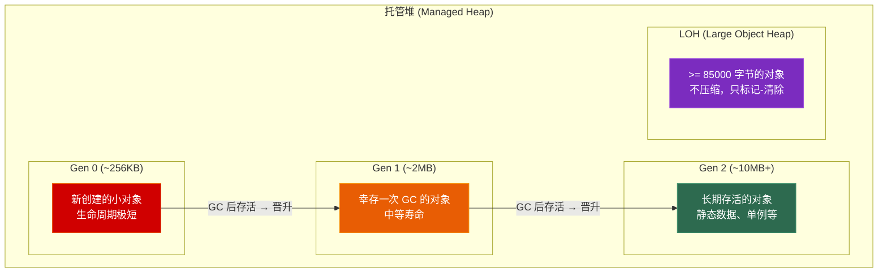
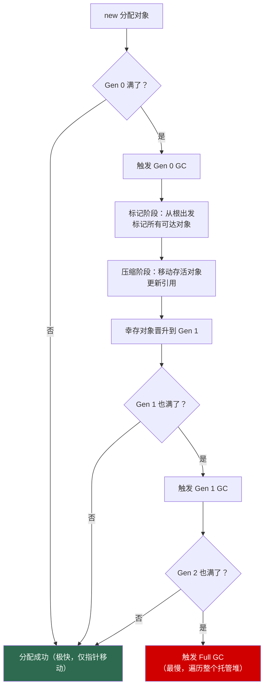
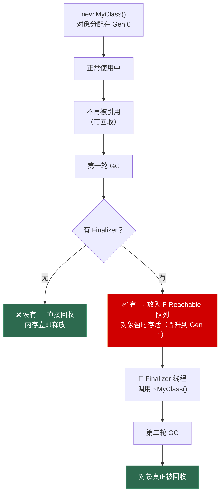

# 第二章 GC 与资源管理

> **一句话理解**：C# 没有 `delete`，内存由 GC 自动回收，但"自动"不代表"免费"。理解 GC 的工作方式，学会用 `IDisposable` 管理非托管资源、用 `struct` 和 `Span<T>` 规避 GC 分配，是 C# 性能优化的第一课。

---

## 2.1 概念直觉 —— 从 RAII 到 GC

### C++ 的世界：你掌控一切

```cpp
// C++ RAII：资源生命周期 = 对象生命周期
{
    std::ifstream file("data.bin");  // 打开文件
    // ... 使用 ...
}  // 离开作用域 → 析构函数自动关闭文件，确定性地

Texture* tex = new Texture("hero.png");
// ... 你必须记得 delete tex
delete tex;  // 忘记 = 泄漏
```

### C# 的世界：GC 掌管内存，但你得管理"非内存资源"

```csharp
// C#：内存由 GC 统一回收，但文件、网络连接、GPU 资源等不归 GC 管
// 这些"非托管资源"需要你自己清理
{
    using var file = File.OpenRead("data.bin");  // 离开作用域 → 自动 Dispose
    // ... 使用 ...
}

var tex = Resources.Load<Texture>("hero");  // 引用计数？不，Unity 另有一套
// 你不必（也不能）delete，但你需要管理它的加载/卸载时机
```

**核心矛盾**：GC 给你"不用管内存"的便利，但代价是：
1. 回收时机不确定 → 可能在 60fps 的帧循环中突然卡一下
2. 只回收内存 → 文件句柄、网络连接、GPU 资源你得自己管
3. 写高性能 C# = 学会"不给 GC 添乱"

---

## 2.2 原理图解

### 2.2.1 托管堆的代际结构



### 2.2.2 GC 触发流程



---

## 2.3 底层机制剖析

### 2.3.1 代际回收的假设

GC 基于一个核心假设：**大多数对象是短命的**。

```csharp
// 典型的"短命对象"模式
void ProcessData()
{
    var temp = new List<int>();      // Gen 0
    for (int i = 0; i < 100; i++)
        temp.Add(i);
    // ... 使用 temp ...
}  // temp 不再被引用，但仍在 Gen 0 中
// → 下次 Gen 0 GC 时，temp 直接被回收，零拷贝

// 相比之下，静态字段存活到程序结束
static readonly HttpClient client = new HttpClient();  // Gen 2 常驻
```

**三代回收的成本对比**：

| GC 类型 | 触发频率 | 暂停时间 | 做了什么 |
|---------|---------|---------|---------|
| Gen 0 | 最频繁（分配触发） | < 1ms | 只回收 Gen 0，存活对象晋升 Gen 1 |
| Gen 1 | 中等 | ~几 ms | 回收 Gen 0 + Gen 1，存活对象晋升 Gen 2 |
| Gen 2 (Full GC) | 尽量避免 | 几十~几百 ms | 遍历整个托管堆，暂停所有线程 |

```csharp
// 游戏中最要命的事：在帧循环里触发 Gen 2 GC
void Update()  // 每帧调用
{
    // ❌ 每帧分配大对象可能触发 Full GC → 卡顿
    var buffer = new byte[100000];  // > 85KB → LOH
    
    // ✅ 在 Start 中预分配，Update 中复用
}

// 预分配策略
private byte[] _buffer = new byte[100000];  // 一次分配，永久使用
void Update()
{
    Array.Clear(_buffer, 0, _buffer.Length);  // 复用
}
```

### 2.3.2 Finalizer（析构函数）—— 最后的防线

```csharp
class NativeResource
{
    private IntPtr _handle;  // 非托管资源句柄
    
    public NativeResource()
    {
        _handle = NativeAPI.CreateResource();
    }
    
    // Finalizer：GC 回收前调用，最后的兜底
    ~NativeResource()
    {
        // ⚠️ Finalizer 在专门的 Finalizer 线程上运行
        // ⚠️ 你不知道什么时候会调用
        // ⚠️ 有 Finalizer 的对象回收更慢（需要两次 GC）
        NativeAPI.ReleaseResource(_handle);
    }
}

// 有 Finalizer 的对象的回收过程：需要两轮 GC！

// 这意味着有 Finalizer 的对象至少要多活一轮 GC！
```



```csharp

```csharp
// ✅ 正确模式：IDisposable + Finalizer 双保险
class NativeResource : IDisposable
{
    private IntPtr _handle;
    private bool _disposed = false;
    
    public NativeResource()
    {
        _handle = NativeAPI.CreateResource();
    }
    
    // 主动清理（用户调用或 using）
    public void Dispose()
    {
        Dispose(true);
        GC.SuppressFinalize(this);  // 告诉 GC：不用调 Finalizer 了
    }
    
    // 兜底清理（GC 调用）
    ~NativeResource()
    {
        Dispose(false);
    }
    
    protected virtual void Dispose(bool disposing)
    {
        if (_disposed) return;
        
        if (disposing)
        {
            // 清理托管资源（其他 IDisposable 对象）
            // 这里托管对象可能还没被回收（因为 GC 顺序不确定）
        }
        
        // 清理非托管资源（无论 disposing 是 true 还是 false 都要做）
        if (_handle != IntPtr.Zero)
        {
            NativeAPI.ReleaseResource(_handle);
            _handle = IntPtr.Zero;
        }
        
        _disposed = true;
    }
}
```

### 2.3.3 using —— 确定性地释放资源

```csharp
// using 语句 —— C# 版的 RAII（针对 IDisposable）
// 编译器展开：

// 你写的：
using (var file = File.OpenRead("data.bin"))
{
    // 使用文件
}

// 编译器生成的（简化）：
var file = File.OpenRead("data.bin");
try
{
    // 使用文件
}
finally
{
    if (file != null)
        ((IDisposable)file).Dispose();
}
// finally 保证：即使抛异常，file 也会被 Dispose
```

```csharp
// C# 8.0 using 声明 —— 更简洁
using var file = File.OpenRead("data.bin");
// ... 使用 ...
// 离开作用域时自动 Dispose（当前块结束）

// 多个资源
using var stream = new FileStream("data.bin", FileMode.Open);
using var reader = new StreamReader(stream);
// 两个都会在离开作用域时 Dispose（反向顺序：reader 先，stream 后）
```

### 2.3.4 GC 工作模式

```csharp
// Workstation GC（默认）：为桌面/客户端优化，低延迟
// Server GC：为服务器优化，高吞吐，每个 CPU 核一个堆+一个 GC 线程

// 在 app.config 或 runtimeconfig.json 中配置：
// <GCServer enabled="true"/>

// Background GC（C# 4.5+）：Gen 2 GC 可以在后台进行
// 前台线程在 GC 期间只短暂暂停（Gen 0/1），Gen 2 在后台跑
// 这对游戏很重要：减少 Full GC 的暂停时间

// Latency Mode（游戏最关心的）：
// GCSettings.LatencyMode = GCLatencyMode.SustainedLowLatency;
// 抑制 Gen 2 GC，适合帧循环等高实时性场景
// ⚠️ 如果内存不够用会导致 OutOfMemoryException，只能短期使用
```

### 2.3.5 对象池 —— 游戏开发的标准策略

```csharp
// 最简单的对象池实现
class ObjectPool<T> where T : class, new()
{
    private readonly Stack<T> _available = new Stack<T>();
    
    public T Rent()
    {
        if (_available.Count > 0)
            return _available.Pop();
        return new T();
    }
    
    public void Return(T item)
    {
        // 重置状态（如果实现了 IResettable）
        if (item is IResettable resettable)
            resettable.Reset();
        _available.Push(item);
    }
}

// 使用
var pool = new ObjectPool<List<int>>();
var list = pool.Rent();
list.Add(42);
// ... 使用 ...
pool.Return(list);  // 放回池子里，不丢给 GC
```

```csharp
// Unity 中的对象池（GameObject 版本）
class BulletPool
{
    private readonly Queue<GameObject> _pool = new Queue<GameObject>();
    private readonly GameObject _prefab;
    
    public GameObject Spawn(Vector3 pos, Quaternion rot)
    {
        GameObject obj;
        if (_pool.Count > 0)
        {
            obj = _pool.Dequeue();
            obj.SetActive(true);
        }
        else
        {
            obj = Object.Instantiate(_prefab);
        }
        obj.transform.SetPositionAndRotation(pos, rot);
        return obj;
    }
    
    public void Despawn(GameObject obj)
    {
        obj.SetActive(false);
        _pool.Enqueue(obj);
    }
}
```

### 2.3.6 WeakReference —— 让 GC 能回收你的引用

```csharp
// 强引用：只要存在，GC 就不会回收
object strong = new object();  // 强引用

// 弱引用：GC 可以回收，回收后 Target 变为 null
WeakReference weak = new WeakReference(new object());

if (weak.TryGetTarget(out object target))
{
    // 对象还活着，使用它
    Console.WriteLine(target);
}
else
{
    // 对象已被 GC 回收
}

// 游戏中的应用：缓存
class TextureCache
{
    private Dictionary<string, WeakReference<Texture2D>> _cache = new();
    
    public Texture2D GetOrLoad(string path)
    {
        if (_cache.TryGetValue(path, out var weakRef)
            && weakRef.TryGetTarget(out var tex))
        {
            return tex;  // 缓存命中
        }
        
        var newTex = LoadTexture(path);  // 重新加载
        _cache[path] = new WeakReference<Texture2D>(newTex);
        return newTex;
    }
    // 优势：内存紧张时，未使用的 Texture 可以被 GC 自动回收
    //       不需要手动"卸载未使用资源"
}
```

### 2.3.7 C# 异常处理全景

对应 C++ 笔记第九章的核心对比。

```csharp
// C# 的 try-catch-finally

try
{
    // 可能抛异常的代码
    var data = File.ReadAllText("config.json");
    var config = JsonSerializer.Deserialize<Config>(data);
}
catch (FileNotFoundException ex)
{
    // 精确捕获
    Console.WriteLine($"配置文件不存在: {ex.FileName}");
}
catch (JsonException ex)
{
    Console.WriteLine($"配置格式错误: {ex.Message}");
}
catch (Exception ex) when (ex is not OutOfMemoryException)
{
    // ✅ C# 6.0 异常过滤器（Exception Filter）
    // 只捕获除了 OOM 之外的异常
    Console.WriteLine($"其他错误: {ex.Message}");
}
finally
{
    // 无论是否抛异常，这里都会执行
    // 用于释放资源（但 using 更优雅）
}
```

**C# vs C++ 异常对比**：

| 维度 | C++ | C# |
|------|-----|-----|
| **异常对象** | 可以 throw 任何类型 | 只能 throw Exception 派生类 |
| **栈展开** | 逆序析构局部对象 | 逆序调用 IDisposable.Dispose()（仅 using） |
| **异常过滤器** | 不支持 | C# 6+ `catch when`，不捕获时栈不需要展开 |
| **析构函数抛异常** | 致命（`std::terminate`） | Finalizer 抛异常 → 进程终止 |
| **重抛** | `throw;` vs `throw e;` 有关键区别 | `throw;` 保留原始调用栈 |

```csharp
// C# 异常的关键特性：throw vs throw ex
try
{
    throw new InvalidOperationException("original");
}
catch (Exception ex)
{
    // throw;      // ✅ 保留原始堆栈跟踪
    throw ex;       // ❌ 重设堆栈跟踪，原始调用位置丢失！
    // 推荐：永远用 throw; 重抛
}
```

---

## 2.4 经典陷阱与面试题

### 2.4.1 这段代码有什么问题？

**陷阱一：忘记释放 IDisposable**

```csharp
// ❌ StreamReader 不会被释放，文件句柄泄漏
string ReadFirstLine(string path)
{
    var reader = new StreamReader(path);
    return reader.ReadLine();
    // 没调用 reader.Dispose()！文件句柄要等 GC 回收 reader 时才释放
}

// ✅ 正确：用 using
string ReadFirstLine(string path)
{
    using var reader = new StreamReader(path);
    return reader.ReadLine();
}
```

**陷阱二：Finalizer 中访问托管对象**

```csharp
class Bad
{
    private Stream _stream;
    
    ~Bad()
    {
        _stream.Dispose();  // ❌ _stream 可能已被 GC 回收！
        // Finalizer 执行时，被 finalize 对象的托管字段可能已经不存在了
    }
}

// ✅ 正确：Finalizer 只清理非托管资源
```

**陷阱三：Update 中分配临时对象**

```csharp
void Update()
{
    // ❌ 每帧分配 string → Gen 0 GC 压力
    string debug = $"Position: {transform.position}";
    
    // ❌ 每帧分配 List
    var hits = new List<RaycastHit>();
    Physics.Raycast(ray, out hits);
    
    // ✅ 复用成员变量
    _hits.Clear();
    Physics.Raycast(ray, out _hits);
}
```

**陷阱四：空 catch 吞异常**

```csharp
// ❌ 这是 C# 最臭名昭著的反模式
try
{
    DoSomething();
}
catch { }  // 吞掉一切异常，包括 OutOfMemoryException！
```

### 2.4.2 面试问答

**Q：IDisposable 和 Finalizer 的区别？**

> `IDisposable.Dispose()` 是用户主动调用的确定性清理（或通过 `using`），用于释放所有资源（托管+非托管）。Finalizer（`~ClassName()`）是 GC 回收对象前的最后兜底，由 GC 线程不确定时调用，只应清理非托管资源。Dispose 会调用 `GC.SuppressFinalize` 避免不必要的 Finalizer 开销。

**Q：GC 的三代分别是什么？**

> Gen 0：新分配的小对象，回收最快最频繁；Gen 1：幸存一次 GC 的对象，作为 Gen 0 和 Gen 2 之间的缓冲；Gen 2：长期存活的对象。大对象（≥85000 字节）直接进 LOH。游戏开发的核心策略是让对象尽可能"死在 Gen 0"，避免晋升。

**Q：using 语句的底层实现？**

> `using` 展开为 `try { ... } finally { resource.Dispose(); }`。无论正常退出还是抛异常，`finally` 中的 `Dispose` 一定执行。C# 8.0 的 `using var` 自动在变量作用域结束时调用 Dispose。

**Q：C# 如何实现对象池？**

> 维护一个 `Stack<T>` 或 `Queue<T>` 存储已回收的对象。Rent 时优先从池中取，Return 时重置状态放回。避免了频繁的 `new` 和 GC 回收。Unity 中 GameObject 池更常用 `SetActive(false)` 替代销毁。

---

## 2.5 游戏实战场景

### 2.5.1 帧循环的 GC 零分配策略

```csharp
// 竞技游戏的帧循环：16ms 一帧，GC 暂停不能 > 1ms
public class CombatFrame
{
    // 预分配所有临时缓冲区
    private readonly List<DamageEvent> _damageEvents = new(64);
    private readonly List<CollisionPair> _collisions = new(256);
    private readonly CombatResult[] _results = new CombatResult[256];
    
    public void Tick(float dt)
    {
        _damageEvents.Clear();
        _collisions.Clear();
        
        // 收集伤害事件 → _damageEvents（复用，零分配）
        CollectDamageEvents(_damageEvents);
        
        // 碰撞检测 → _collisions（复用，零分配）
        DetectCollisions(_collisions);
        
        // 处理结果 → _results（复用，零分配）
        int resultCount = ProcessCombat(_damageEvents, _collisions, _results);
        
        // 应用结果
        for (int i = 0; i < resultCount; i++)
            ApplyResult(_results[i]);
        
        // 整帧 0 次 GC 分配！
    }
}
```

### 2.5.2 Unity 资源加载的异常安全

```csharp
// 加载多个资源，任何一个失败都安全回滚
class LevelLoader
{
    private List<GameObject> _loadedAssets = new List<GameObject>();
    
    public bool TryLoadLevel(string levelName)
    {
        var tempAssets = new List<GameObject>();
        try
        {
            // 加载地形
            var terrain = Resources.Load<GameObject>($"Levels/{levelName}/Terrain");
            if (terrain == null) throw new AssetLoadException("Terrain not found");
            tempAssets.Add(Object.Instantiate(terrain));
            
            // 加载建筑
            var buildings = Resources.Load<GameObject>($"Levels/{levelName}/Buildings");
            if (buildings == null) throw new AssetLoadException("Buildings not found");
            tempAssets.Add(Object.Instantiate(buildings));
            
            // 全部成功 → 提交
            _loadedAssets.AddRange(tempAssets);
            return true;
        }
        catch (AssetLoadException ex)
        {
            Debug.LogError($"关卡加载失败: {ex.Message}");
            // 回滚：销毁已加载的临时资源
            foreach (var asset in tempAssets)
                Object.Destroy(asset);
            return false;
        }
    }
}
```

### 2.5.3 粒子系统对象池

```csharp
public class ParticlePool
{
    private struct PooledParticle
    {
        public ParticleSystem System;
        public float ReturnTime;     // 预定归还时间
    }
    
    private Queue<int> _freeIndices = new();
    private PooledParticle[] _pool = new PooledParticle[1024];
    private int _activeCount = 0;
    
    public ParticleSystem Rent(ParticleSystem prefab, Vector3 pos, float duration)
    {
        if (_freeIndices.TryDequeue(out int index))
        {
            // 复用已有粒子系统
            ref var p = ref _pool[index];
            p.System.transform.position = pos;
            p.System.Play();
            p.ReturnTime = Time.time + duration;
            return p.System;
        }
        else
        {
            // 创建新的（仅在池耗尽时分配）
            var system = Object.Instantiate(prefab, pos, Quaternion.identity);
            if (_activeCount >= _pool.Length)
                Array.Resize(ref _pool, _pool.Length * 2);
            _pool[_activeCount++] = new PooledParticle
            {
                System = system,
                ReturnTime = Time.time + duration
            };
            return system;
        }
    }
    
    public void Update()
    {
        // 回收超时的粒子
        float now = Time.time;
        for (int i = 0; i < _activeCount; i++)
        {
            ref var p = ref _pool[i];
            if (p.System.isPlaying && now >= p.ReturnTime)
            {
                p.System.Stop();
                _freeIndices.Enqueue(i);
            }
        }
    }
}
```

---

## 2.6 30 秒速答

**Q：C# 的 GC 怎么工作？**

> 分代标记-压缩 GC。Gen 0 放新对象，满了触发 Gen 0 GC（标记存活对象 → 压缩移动 → 幸存对象晋升 Gen 1）。Gen 1 和 Gen 2 同理但频率递减。大对象（≥85KB）进 LOH，只标记不压缩。游戏开发核心策略是尽量让对象死在 Gen 0。

**Q：IDisposable 解决什么问题？**

> GC 只回收内存且时机不确定。非托管资源（文件句柄、网络连接、GPU 缓冲）需要确定性释放。`IDisposable` 提供 `Dispose()` 方法让用户主动释放，配合 `using` 语句实现 C# 版的 RAII。

**Q：怎么在游戏里避免 GC 卡顿？**

> ① 预分配 + 复用（对象池、List.Clear()）；② 大 struct 用 `in`/`ref` 传参避免拷贝和装箱；③ 用 `Span<T>` / `stackalloc` 做栈上临时缓冲；④ 不在 Update 里 `new` 任何引用类型；⑤ 字符串拼接用 `StringBuilder` 或预分配 char 数组。

**Q：C# 的异常处理和 C++ 的关键区别？**

> C# 只能 throw Exception 派生类，C++ 能 throw 任何类型。C# 的 `finally` 保证执行（C++ 没有），`using` 展开依赖 `finally`。C# 6+ 有异常过滤器 `catch when`，不匹配时栈不展开。C# 的 `throw;` 保留原始堆栈，`throw ex;` 重置——和 C++ 的规则完全一致。

---

> 📖 上一章：[第一章 C# 类型系统与内存布局](../01_type_system) —— 值类型/引用类型分裂、装箱拆箱、Span&lt;T&gt;。

> 📖 下一章：[第三章 OOP C# 篇](../03_oop_csharp) —— 属性/索引器/事件/委托编译产物、partial/sealed/interface 默认实现。
