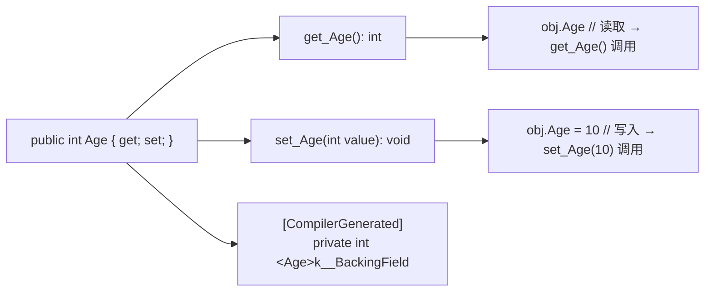
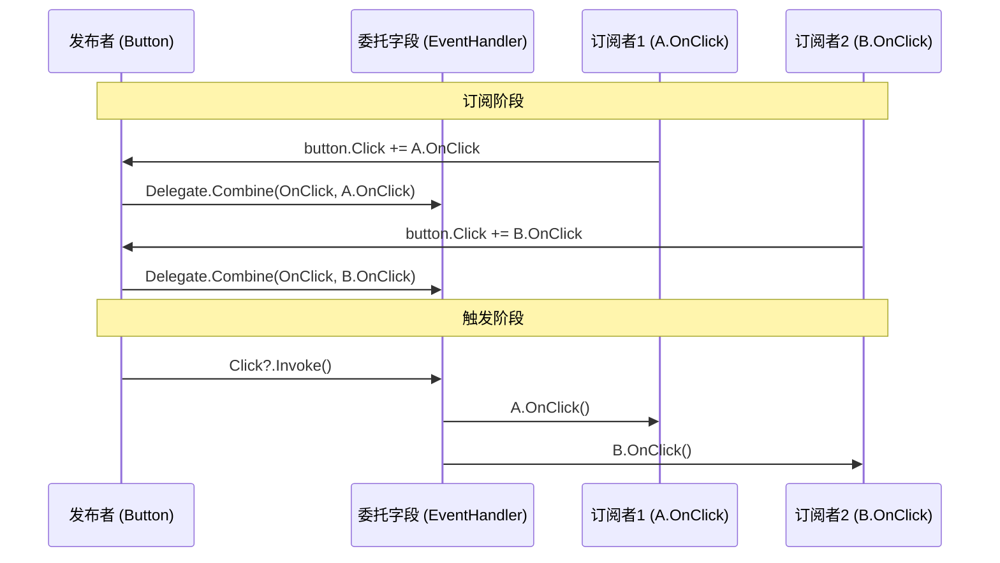
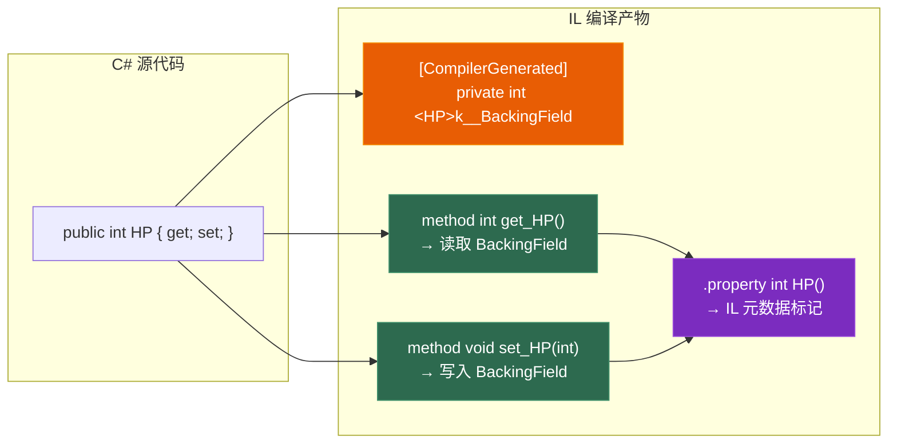
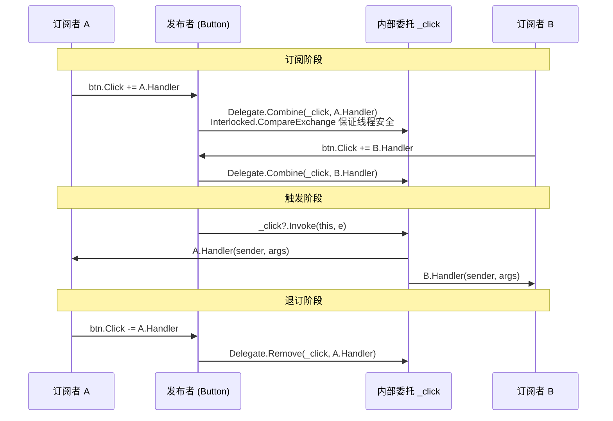

# 第三章 OOP C# 篇：属性、事件与类型设计

> **一句话理解**：C# 的 OOP 在 C++ 基础上增加了属性、索引器、事件、partial 等"语法糖设施"——它们底层都是 IL 方法调用，但让代码的表达力提升了一个层次。理解这些设施的编译产物，是读懂 IL 代码和写出地道 C# 的关键。

---

## 3.1 概念直觉 —— C# 在 OOP 上多了什么

C++ 的 OOP 工具箱：class、继承、虚函数、访问控制（public/protected/private）。

C# 在这个基础上加了五样东西，每一样都有 C++ 没有的"底层支撑"：

| 特性 | C++ 等价物 | C# 独有 |
|------|-----------|--------|
| **属性 (Property)** | Getter/Setter 方法 | 语法级支持，编译为 `get_`/`set_` 方法 |
| **索引器 (Indexer)** | `operator[]` | 语法级支持，可多维，可重载 |
| **事件 (Event)** | 观察者模式手动实现 | `event` 关键字，编译器生成 add/remove |
| **分部类 (partial)** | 无 | 一个类拆到多个文件，编译器合并 |
| **接口默认实现** | 抽象类 | C# 8.0+ 接口可以有方法体 |

---

## 3.2 原理图解

### 3.2.1 属性（Property）的编译产物



### 3.2.2 事件（Event）的观察者模式展开



---

## 3.3 底层机制剖析

### 3.3.1 属性（Property）—— 不是字段！

```csharp
// 属性的本质：一对 get_/set_ 方法 + 一个私有后备字段
class Player
{
    // 自动属性：编译器生成后备字段
    public int HP { get; set; }
    
    // 等价于手写：
    // private int _hp;
    // public int get_HP() => _hp;
    // public void set_HP(int value) => _hp = value;
    
    // 计算属性：没有后备字段
    public bool IsDead => HP <= 0;
    // 编译为：public bool get_IsDead() => HP <= 0;
    
    // 带逻辑的属性
    private int _maxHP;
    public int MaxHP
    {
        get => _maxHP;
        set => _maxHP = value > 0 ? value : throw new ArgumentException();
    }
    
    // 不同的访问级别
    public int Score { get; private set; }  // 外部只读，内部可写
    
    // init 访问器（C# 9.0）：只能在初始化时设置
    public string Name { get; init; }
}
```

> 💡 **面试必考点**：属性不是字段！`public int HP { get; set; }` 编译后生成 `get_HP()` 和 `set_HP(int)` 两个方法，以及一个 `<HP>k__BackingField` 私有字段。反射时通过 `PropertyInfo` 而非 `FieldInfo` 访问。



```csharp
// 属性与字段的行为差异
class Example
{
    public int Field;           // 字段：直接内存访问
    public int Property { get; set; }  // 属性：方法调用
    
    // ref 可以指向字段，不能指向属性
    // ref int r1 = ref example.Field;     // ✅
    // ref int r2 = ref example.Property;  // ❌ 属性没有确定的内存位置
}

// 属性的性能：方法调用有微小开销，但 JIT 通常会内联简单的 get/set
// 热路径上可以考虑字段，但差别通常可忽略
```

### 3.3.2 索引器（Indexer）—— 让对象像数组一样访问

```csharp
// 索引器本质：名为 this[] 的属性（参数化的属性）
class Grid<T>
{
    private T[,] _data;
    private int _width, _height;
    
    public Grid(int w, int h)
    {
        _width = w;
        _height = h;
        _data = new T[w, h];
    }
    
    // 二维索引器
    public T this[int x, int y]
    {
        get
        {
            if (x < 0 || x >= _width || y < 0 || y >= _height)
                throw new IndexOutOfRangeException();
            return _data[x, y];
        }
        set
        {
            if (x < 0 || x >= _width || y < 0 || y >= _height)
                throw new IndexOutOfRangeException();
            _data[x, y] = value;
        }
    }
    
    // 可以重载索引器（不同参数类型）
    public T this[string key]
    {
        get => _data[keyToX(key), keyToY(key)];
        set => _data[keyToX(key), keyToY(key)] = value;
    }
}

var grid = new Grid<int>(10, 10);
grid[3, 5] = 42;                    // 调用 set this[3, 5]
Console.WriteLine(grid[3, 5]);      // 调用 get this[3, 5]
```

### 3.3.3 事件（Event）—— 受限制的委托

事件是 C# 中实现观察者模式的语言级设施。它的核心是**限制外部对委托的操作**。

```csharp
// event 关键字的底层展开
class Button
{
    // 你写的：
    public event EventHandler Click;
    
    // 编译器生成：
    private EventHandler _click;  // 私有委托字段
    
    public void add_Click(EventHandler value)
    {
        // 线程安全的 Delegate.Combine
        EventHandler handler2;
        EventHandler click = _click;
        do
        {
            handler2 = click;
            EventHandler combined = (EventHandler)Delegate.Combine(handler2, value);
            click = Interlocked.CompareExchange(ref _click, combined, handler2);
        } while (click != handler2);
    }
    
    public void remove_Click(EventHandler value)
    {
        // 线程安全的 Delegate.Remove
        EventHandler handler2;
        EventHandler click = _click;
        do
        {
            handler2 = click;
            EventHandler removed = (EventHandler)Delegate.Remove(handler2, value);
            click = Interlocked.CompareExchange(ref _click, removed, handler2);
        } while (click != handler2);
    }
    
    // 触发事件
    protected virtual void OnClick(EventArgs e)
    {
        _click?.Invoke(this, e);
    }
}
```

```csharp
// 事件的关键限制：外部只能 += 和 -=
Button btn = new Button();
btn.Click += OnButtonClick;   // ✅ 订阅
btn.Click -= OnButtonClick;   // ✅ 取消订阅
// btn.Click = null;           // ❌ 编译错误！外部不能赋值
// btn.Click.Invoke(...);      // ❌ 编译错误！外部不能调用

// 这些限制防止了：
// 1. 外部代码清空所有订阅者（破坏其他模块的监听）
// 2. 外部代码冒充发布者触发事件
```



```csharp
// 自定义事件访问器（高级场景：如 Unity 的事件系统桥接）
class CustomEventPublisher
{
    private EventHandler _myEvent;
    
    public event EventHandler MyEvent
    {
        add
        {
            Console.WriteLine($"订阅者加入: {value.Method.Name}");
            _myEvent += value;
        }
        remove
        {
            Console.WriteLine($"订阅者移除: {value.Method.Name}");
            _myEvent -= value;
        }
    }
}
```

### 3.3.4 partial —— 一个类拆到多个文件

```csharp
// Player.Generated.cs（自动生成的代码）
partial class Player
{
    public int ID { get; set; }
    public string Name { get; set; }
    
    // 自动生成的高效序列化代码
    public void Serialize(BinaryWriter writer)
    {
        writer.Write(ID);
        writer.Write(Name);
    }
}

// Player.cs（手写逻辑）
partial class Player
{
    private int _score;
    
    public void AddScore(int points)
    {
        _score += points;
        if (_score >= 1000) LevelUp();
    }
    
    private void LevelUp()
    {
        // ...
    }
}
// 编译时合并为一个 Player 类，两个文件中的成员都能互相访问
```

```csharp
// partial 方法：允许声明和实现在不同文件中
partial class Entity
{
    // 声明（可能在生成代码中）
    partial void OnCreated();
    
    public Entity()
    {
        OnCreated();  // 如果有实现则调用，没有则编译器直接删掉调用
    }
}

partial class Entity
{
    // 实现（在用户代码中）
    partial void OnCreated()
    {
        Console.WriteLine("Entity created");
    }
}
```

### 3.3.5 sealed —— 禁止继承的性能优化

```csharp
// sealed 的两个作用
sealed class FinalClass { }    // 不能被继承
// class Derived : FinalClass { }  // ❌ 编译错误

// 1. 安全：防止你的类型被意外继承和破坏
// 2. 性能：JIT 知道 sealed 类型没有派生类，虚方法调用可以"去虚化"
//    如果 JIT 确定对象就是 sealed 类型 → 直接调用，不走虚表

sealed class PerformanceCritical
{
    public virtual void DoWork() { }
    
    public void CallDoWork()
    {
        DoWork();  // JIT: 我是 sealed 的，没人能重写 DoWork() → 直接调用
    }
}
```

### 3.3.6 接口默认实现（C# 8.0）—— 接口可以有方法体

```csharp
// C# 8.0+：接口可以有默认实现
interface ILogger
{
    void Log(string message);
    
    // 默认实现：不强制实现者写
    void LogError(string message) => Log($"[ERROR] {message}");
    void LogWarning(string message) => Log($"[WARN] {message}");
}

class ConsoleLogger : ILogger
{
    public void Log(string message) => Console.WriteLine(message);
    // LogError 和 LogWarning 自动继承默认实现
}

// 菱形问题
interface IA { void M() => Console.WriteLine("IA.M"); }
interface IB : IA { void IA.M() => Console.WriteLine("IB.M"); }  // 重写默认实现
interface IC : IA { void IA.M() => Console.WriteLine("IC.M"); }
class D : IB, IC
{
    // 编译错误！D 需要显式实现 M 来解决歧义
    void IA.M() => Console.WriteLine("D.M");  // 必须显式接口实现
}
```

### 3.3.7 命名空间（Namespace）

这个概念在 C# 中比 C++ 更重要，因为 .NET 的类型系统是全局装配的。

```csharp
// 文件作用域命名空间（C# 10+）
namespace MyGame.Core;

public class Entity { }  // 全名：MyGame.Core.Entity

// 传统块式命名空间
namespace MyGame.Core
{
    public class Entity { }
}

// using 指令的各种形式
using System;                           // 传统 using
using static System.Math;               // C# 6：导入静态成员，可以直接写 Sqrt() 而非 Math.Sqrt()
using Timer = System.Timers.Timer;      // 别名
using var file = File.OpenRead("a.bin"); // C# 8 using 声明
global using System.Collections.Generic; // C# 10 全局 using（整个项目生效）

// 全局 using 通常放在一个 GlobalUsings.cs 文件中
// 所有文件自动拥有这些 using
```

---

## 3.4 经典陷阱与面试题

### 3.4.1 这段代码有什么问题？

**陷阱一：属性 vs 字段的初始化顺序**

```csharp
class Base
{
    public Base() { Initialize(); }
    protected virtual void Initialize() => Console.WriteLine("Base.Init");
}

class Derived : Base
{
    private string _name = "default";  // 字段初始化
    public string Name { get; set; } = "default";  // 属性初始化
    
    public Derived() { _name = "constructor"; }
    protected override void Initialize()
    {
        // ⚠️ 此时 _name 是什么？
        Console.WriteLine(_name);  // "default" —— 字段初始化器已执行
        // 但 Derived 的构造函数还没跑！
        // 这是 C# 中经典的"在基类构造函数中调用虚方法"陷阱
    }
}
```

**陷阱二：事件的 null 检查竞态**

```csharp
// ❌ 有竞态条件
if (MyEvent != null)
    MyEvent(this, EventArgs.Empty);  // 在 null 检查和调用之间，最后一个订阅者可能 -= 退订

// ✅ 传统修复（C# 5 之前）
var handler = MyEvent;
if (handler != null)
    handler(this, EventArgs.Empty);

// ✅ 现代写法
MyEvent?.Invoke(this, EventArgs.Empty);
```

**陷阱三：struct 实现接口的装箱**

```csharp
interface IResettable { void Reset(); }
struct Data : IResettable
{
    public int Value;
    public void Reset() => Value = 0;
}

Data d = new Data { Value = 42 };
IResettable r = d;  // 装箱！
r.Reset();          // 重置的是堆上的副本，不是 d！
Console.WriteLine(d.Value);  // 42 —— d 没有变！

// ✅ 正确：用泛型约束避免装箱
void Reset<T>(ref T item) where T : struct, IResettable
{
    item.Reset();  // 不装箱，直接调用
}
```

### 3.4.2 面试问答

**Q：属性和字段的区别？**

> 属性本质是一对 `get_`/`set_` 方法（IL 层面），字段是一片内存。属性可以加逻辑（验证、计算、懒加载），可以有不同访问级别，可以在接口中声明。字段直接内存访问，性能略优，但不能在接口中声明。`ref` 可以指向字段，不能指向属性。

**Q：event 关键字做了什么？**

> 编译器生成一个私有委托字段、线程安全的 `add_` 和 `remove_` 方法。外部代码只能 `+=` 和 `-=`，不能赋值、不能调用、不能置 null。这保证了订阅的封装性——一个模块不能破坏另一个模块的订阅。

**Q：sealed 有什么用？**

> ① 设计意图：标记"这个类不应该被继承"；② 安全：防止未预期的继承破坏不变量；③ 性能：JIT 可以对 sealed 类型做去虚化（devirtualization），虚方法调用变成直接调用。

**Q：接口默认实现解决了什么问题？**

> C# 8.0 之前，给接口加方法会破坏所有实现者。默认实现允许"无痛演进"——加新方法时给一个默认实现，老代码不用改就能编译。也支持了类似 C++ 的 mixin 模式。但菱形继承问题需要实现者显式解决。

---

## 3.5 游戏实战场景

### 3.5.1 Unity MonoBehaviour 中的属性

```csharp
// Unity 的序列化系统需要字段，但你可以用属性封装
public class Enemy : MonoBehaviour
{
    // Unity 序列化字段 + 属性封装
    [SerializeField] private int _maxHP = 100;
    [SerializeField] private int _currentHP;
    
    // 对外暴露属性，对内用字段
    public int MaxHP => _maxHP;
    
    public int CurrentHP
    {
        get => _currentHP;
        private set
        {
            _currentHP = Mathf.Clamp(value, 0, _maxHP);
            if (_currentHP <= 0)
                OnDeath?.Invoke(this);
        }
    }
    
    public event Action<Enemy> OnDeath;
    
    public void TakeDamage(int damage)
    {
        CurrentHP -= damage;  // 走属性的 set 逻辑
    }
}
```

### 3.5.2 游戏配置的索引器

```csharp
// 用索引器让配置表访问自然
class ConfigTable
{
    private Dictionary<int, Dictionary<string, string>> _data = new();
    
    // rowId["columnName"] 的二维索引
    public string this[int rowId, string columnName]
    {
        get
        {
            if (_data.TryGetValue(rowId, out var row)
                && row.TryGetValue(columnName, out var value))
                return value;
            throw new KeyNotFoundException($"Config [{rowId}][{columnName}]");
        }
    }
}

var config = new ConfigTable();
string name = config[1001, "Name"];       // 像查 Excel 表
string desc = config[1001, "Description"];
```

### 3.5.3 用 sealed 优化热路径上的虚方法

```csharp
// 场景：一个每帧被调用数万次的 Update 逻辑
interface IUpdatable
{
    void Update(float dt);
}

// ❌ 虚方法调用：每个对象走一次虚表
class GeneralComponent : IUpdatable
{
    public virtual void Update(float dt) { /* ... */ }
}

// ✅ sealed 类：JIT 可以内联
sealed class MovementComponent : IUpdatable
{
    public void Update(float dt)
    {
        // JIT 确定：没有派生类，没有虚表 → 可能内联到调用点
        transform.position += velocity * dt;
    }
}
```

---

## 3.6 30 秒速答

**Q：C# 的属性和 C++ 的 getter/setter 有什么本质区别？**

> C# 的属性是语言级功能，编译为 `get_Prop`/`set_Prop` 方法，但有专门的 IL 元数据标记（`.property`）。反射用 `PropertyInfo` 而非 `MethodInfo` 访问。C++ 没有这个语言级概念，只能手动写 `GetX()`/`SetX()`。

**Q：event 和 delegate 字段的区别？**

> event 是 delegate 字段 + 访问限制。外部只能 `+=`/`-=`，不能赋值或调用。delegate 字段没有这个限制。event 的 add/remove 是线程安全的。

**Q：partial 解决了什么实际问题？**

> 代码生成场景：自动生成的代码在 A 文件（如 protobuf、WPF XAML 后台），手写逻辑在 B 文件。两个文件编译时合并为一个类。WinForms/WPF/Unity 的代码生成都依赖 partial。

**Q：接口和抽象类的选择？**

> 接口：轻量，多实现，无状态（C# 8+ 允许方法体但不能有实例字段）。抽象类：单继承，可以有字段、构造函数、非虚方法。优先接口（更灵活），需要共享字段或默认实现时用抽象类。

---

> 📖 上一章：[第二章 GC 与资源管理](../02_gc_and_resource_management) —— 代际回收、IDisposable、对象池。

> 📖 下一章：[第四章 运算符重载、委托与事件](../04_operators_delegates_events) —— 从运算符到闭包，C# 的表达力核心。
