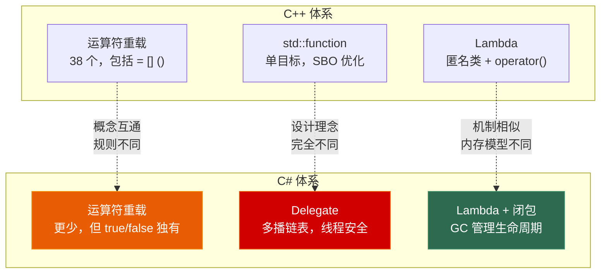
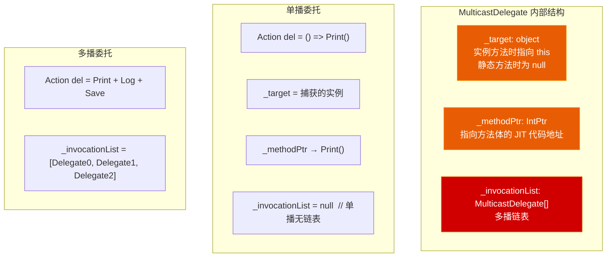
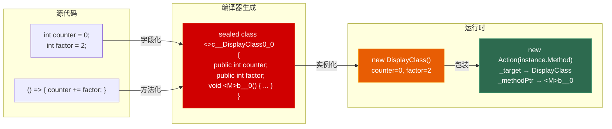

# 第四章 运算符重载、委托与闭包

> **一句话理解**：运算符重载让你的类型像 `int` 一样自然，委托是 C# 对"可调用对象"的类型安全多播抽象，闭包编译器把捕获的变量悄悄变成堆上的字段——这三者构成了 C# 表达力的核心三角。

---

## 4.1 概念直觉 —— C# 相比 C++ 多了什么

C++ 有运算符重载、有函数指针、有 `std::function`、有 Lambda。C# 这三样东西表面上看着一样，实际上每一样都有本质差异：

| 能力 | C++ | C# | 关键差异 |
|------|-----|-----|---------|
| **运算符重载** | 38 个可重载，包括 `=` `()` `[]` | 更少，`=` `()` `[]` 不能重载 | C# 用索引器/委托代替 |
| **可调用对象** | `std::function`（单个目标） | `delegate`（原生多播链表） | 多播是内置的，不只是包装器 |
| **Lambda/闭包** | 匿名类 + `operator()` | 匿名类 + 实例方法，捕获变量变成字段 | 机制相似，但 C# 有 GC 兜底 |



---

## 4.2 运算符重载 —— C# vs C++ 的关键差异

### 4.2.1 C# 可重载与不可重载的运算符

```csharp
// C# 可重载的运算符（总共约 20 个，比 C++ 的 38 个少）
// 一元：+  -  !  ~  ++  --  true  false
// 二元：+  -  *  /  %  &  |  ^  <<  >>  ==  !=  >  <  >=  <=

// 🔴 C# 不能重载而 C++ 可以重载的：
// =   赋值 — C# 中 = 永远做引用/值绑定，不允许自定义语义
// []  下标 — C# 用索引器（this[] 属性）代替，更灵活（支持多维、不同参数类型）
// ()  函数调用 — C# 用委托代替
// ->  成员指针访问 — C# 没有成员指针
// new / delete — C# 的 new 语义固定

// 🟡 C# 能重载而 C++ 不能的：
// true / false — C# 独有，让自定义类型能直接用于 if/while 条件判断
```

### 4.2.2 必须成对重载的强制规则

C# 编译器强制执行配对规则，违反直接编译错误：

```csharp
// 规则一：== 和 != 必须同时定义
// 规则二：< 和 > 必须同时定义
// 规则三：<= 和 >= 必须同时定义
// 规则四：true 和 false 必须同时定义

struct Temperature : IEquatable<Temperature>
{
    public double Celsius { get; }
    public Temperature(double c) => Celsius = c;

    // == 和 != 成对
    public static bool operator ==(Temperature a, Temperature b)
        => a.Celsius == b.Celsius;
    public static bool operator !=(Temperature a, Temperature b)
        => !(a == b);

    // < 和 > 成对
    public static bool operator <(Temperature a, Temperature b)
        => a.Celsius < b.Celsius;
    public static bool operator >(Temperature a, Temperature b)
        => a.Celsius > b.Celsius;

    // <= 和 >= 也成对（定义了 < 和 > 后编译器不自动生成 <= >=）
    public static bool operator <=(Temperature a, Temperature b)
        => a.Celsius <= b.Celsius;
    public static bool operator >=(Temperature a, Temperature b)
        => a.Celsius >= b.Celsius;

    // 重载 == 必须重写 Equals + GetHashCode + 实现 IEquatable<T>
    public override bool Equals(object obj)
        => obj is Temperature t && this == t;
    public override int GetHashCode()
        => Celsius.GetHashCode();
    public bool Equals(Temperature other) => this == other;
}
```

> 💡 为什么重载 `==` 必须同时重写 `Equals()`？因为 `Dictionary<TKey, TValue>` 查找时走的是 `EqualityComparer<T>.Default`，它在运行时会优先检查 `IEquatable<T>.Equals()`，如果没有实现就用 `Object.Equals(Object)`，后者对值类型会装箱。只重载 `==` 而漏掉 `Equals()` 会导致同一对象在 `dict.ContainsKey()` 和 `==` 中行为不一致。

### 4.2.3 true / false 运算符 —— C# 独有

这是 C++ 来的人最容易忽略的语言特性。重载 `true`/`false` 后，自定义类型可以直接出现在 `if`、`while`、`?:`、`&&`、`||` 的条件位置：

```csharp
// 场景：数据库连接状态类，有三种状态
class DbConnection
{
    public enum State { Disconnected, Connected, Error }
    public State CurrentState { get; set; }

    // true: 连接可用
    public static bool operator true(DbConnection conn)
        => conn.CurrentState == State.Connected;

    // false: 连接不可用（未连接或出错）
    public static bool operator false(DbConnection conn)
        => conn.CurrentState != State.Connected;

    // 配合 & 运算符，支持短路逻辑
    public static DbConnection operator &(DbConnection a, DbConnection b)
        => a.CurrentState == State.Connected ? b : a;
}

// 使用：自然的条件判断
DbConnection conn = new DbConnection { CurrentState = State.Connected };
if (conn)  // 隐式调用 operator true(conn) → Connected → true
{
    conn.Execute("SELECT * FROM Players");
}

// 甚至可以 &&（编译器转为 operator true + operator &）：
var conn2 = new DbConnection { CurrentState = State.Connected };
if (conn && conn2)  // 短路：如果 conn 为 false，conn2 不会被评估
{
    // ...
}
```

> 💡 `true`/`false` 运算符的设计意图是让自定义类型参与布尔逻辑运算。典型的如 `StreamReader` 可以用 `if (reader)` 判断是否还有数据。这个功能在 C# 3.0 的 LINQ 查询中也有应用。

### 4.2.4 类型转换运算符的两种面孔

```csharp
struct Celsius
{
    public double Value { get; }
    public Celsius(double v) => Value = v;

    // implicit: 隐式转换 — 安全，不丢失信息
    public static implicit operator double(Celsius c) => c.Value;

    // explicit: 显式转换 — 可能失败或丢失精度
    public static explicit operator Celsius(double d)
    {
        if (d < -273.15)
            throw new ArgumentOutOfRangeException(nameof(d),
                "温度不能低于绝对零度");
        return new Celsius(d);
    }
}

// 使用区别
Celsius c = new Celsius(100);
double d = c;                      // ✅ 隐式，不需要 cast
Celsius back = (Celsius)d;         // ✅ 显式，需要 cast
// Celsius bad = d;                // ❌ 编译错误，explicit 必须 cast

// 设计原则：
// implicit: 从"小"到"大"，不丢失信息（如 int → long，Celsius → double）
// explicit: 从"大"到"小"，可能丢失信息或抛异常（如 double → int，double → Celsius）
```

```csharp
// 转换运算符的性能陷阱：值类型转换会产生副本
struct BigStruct { /* 128 字节 */ }

struct Wrapper
{
    public BigStruct Value;
    public Wrapper(BigStruct v) => Value = v;

    // ❌ 每次转换都创建一个新 Wrapper（拷贝 128 字节）
    public static implicit operator Wrapper(BigStruct v) => new Wrapper(v);
}

// ✅ 更好：公开工厂方法，让调用方意识到有拷贝
public static Wrapper FromBigStruct(BigStruct v) => new Wrapper(v);
```

### 4.2.5 复合赋值自动生成规则

```csharp
// C# 编译器的一条重要规则：
// 如果定义了 operator +，编译器自动生成 operator +=
// 你不需要手动定义 +=、-=、*=、/=、%= 等

struct Vec3
{
    public float X, Y, Z;
    
    public static Vec3 operator +(Vec3 a, Vec3 b)
        => new Vec3 { X = a.X + b.X, Y = a.Y + b.Y, Z = a.Z + b.Z };
    
    // += 自动由 + 生成！
    // a += b;  → 编译器展开为 a = a + b;
}

// 注意：如果你想要高效的 +=（原地修改而非分配新对象），
// 需要手动定义，但通常不让 struct 可变是更好的设计
```

### 4.2.6 运算符的重载解析

```csharp
// 当多个运算符重载同时匹配时的解析规则
struct Vector
{
    public float X, Y;
    
    // 两个版本的乘法
    public static Vector operator *(Vector v, float s) => new Vector { X = v.X * s, Y = v.Y * s };
    public static Vector operator *(float s, Vector v) => new Vector { X = v.X * s, Y = v.Y * s };
    // ↑ 两个都要定义以支持 v * 3.0f 和 3.0f * v
}

// 编译器解析步骤（和 C++ 的 ADL 不同）：
// 1. 非成员候选：在当前命名空间和作用域中查找所有 operator @
// 2. 成员候选：在操作数的类型中查找成员 operator @
// 3. 如果两个操作数都定义了 operator @ → 二义性错误
```

---

## 4.3 委托（Delegate）—— C# 的多播函数指针

### 4.3.1 委托的底层类层级

委托不是简单的语法糖——它的继承链体现了完整的运行时支持：

```csharp
// 委托的继承链
// System.Object
//   → System.Delegate          ← 所有委托的抽象基类
//     → System.MulticastDelegate ← 支持多播的委托基类
//       → 你的自定义委托类型（如 Action、Func 等）

// 声明一个委托类型时，编译器生成的完整 IL 类
public delegate int BinaryOp(int a, int b);

// 编译后生成的类（反编译简化）：
// sealed class BinaryOp : MulticastDelegate
// {
//     // 构造函数
//     public BinaryOp(object target, IntPtr methodPtr);
//
//     // 调用入口（和声明的签名一致）
//     public int Invoke(int a, int b);
//
//     // 异步调用（历史遗留，现代代码不要用）
//     public IAsyncResult BeginInvoke(int a, int b, AsyncCallback cb, object state);
//     public int EndInvoke(IAsyncResult result);
// }
```



### 4.3.2 委托的内部方法表引用

```csharp
// 委托内部有两个关键 IntPtr 字段：
// _methodPtr:  指向方法 JIT 编译后的本地代码
// _methodPtrAux: 辅助指针（用于泛型方法或接口调用转换）

class Player
{
    public int GetScore() => 100;
}

Player p = new Player();
Func<int> getScore = p.GetScore;  // 委托指向实例方法

// 委托内部：
// _target     = p 的引用          （因为这是实例方法）
// _methodPtr  = GetScore() JIT 代码的地址

Func<int> staticMethod = () => 42;  // Lambda 指向静态方法

// 委托内部（闭包版本）：
// _target     = 闭包类的实例       （Lambda 捕获变量时生成 DisplayClass）
// _methodPtr  = Lambda 体的 JIT 代码地址
```

### 4.3.3 委托的分配开销

委托是引用类型，创建委托必然产生堆分配。这在热路径上是性能隐患：

```csharp
// ❌ 每帧分配新委托
void Update()
{
    // 每次 Update 都 new 一个 Action 委托对象在堆上
    ExecuteAction(() => transform.Translate(1, 0, 0));
    // → GC.Alloc 16-32 字节（委托对象）+ 可能的闭包分配
}

// ✅ 缓存委托
private Action _cachedAction;

void Start()
{
    _cachedAction = () => transform.Translate(1, 0, 0);  // 只分配一次
}

void Update()
{
    ExecuteAction(_cachedAction);  // 零分配
}

// ✅ 用静态 Lambda（C# 9+）避免闭包分配
void Update()
{
    // static 关键字确保 Lambda 不捕获任何变量 → 编译器可能重用一个静态委托实例
    ExecuteAction(static () => Console.WriteLine("tick"));
}
```

```csharp
// 委托分配成本对比实验
class DelegateAllocTest
{
    private int _counter = 0;
    
    // ❌ 实例方法委托 —— 每次创建都分配（因为 _target 是 this）
    public Action CreateInstanceAction() => () => _counter++;
    // 每次调用 CreateInstanceAction() 都创建一个新的委托对象
    
    // ✅ 静态方法委托 —— 可以缓存为单例
    private static void StaticMethod() { }
    public Action GetStaticAction() => StaticMethod;
    // 多次调用 GetStaticAction() 可能返回同一个委托对象（编译器优化）
    
    // ✅ 静态 Lambda —— C# 9+，明确告诉编译器不捕获变量
    public Action GetStaticLambda() => static () => Console.WriteLine("tick");
    // static Lambda 不捕获任何变量 → 编译器可以缓存为静态字段
}
```

### 4.3.4 多播委托的 Combine/Remove 线程安全

多播委托的 `+=` 和 `-=` 操作隐式使用 `Interlocked.CompareExchange`：

```csharp
// 你写的：
public event Action OnDamage;
// OnDamage += HandleDamage;
// OnDamage -= HandleDamage;

// 编译器为 event 生成的 add_OnDamage（简化示意）：
private Action _onDamage;
public void add_OnDamage(Action value)
{
    Action handler2;
    Action current = _onDamage;
    do
    {
        handler2 = current;
        Action combined = (Action)Delegate.Combine(handler2, value);
        current = Interlocked.CompareExchange(ref _onDamage, combined, handler2);
    } while (current != handler2);
}
// Interlocked.CompareExchange 保证即使在多线程同时 += 时也不会丢失订阅者
```

```csharp
// 但注意：Invoke 本身不是线程安全的！
// 如果在 Invoke 执行过程中有线程 += 或 -=，
// Invoke 捕获的可能是旧链表或新链表（取决于时序），
// 但不会崩溃（不像 C++ 迭代器失效）

// 如果你需要"冻结"调用列表，在 Invoke 前拷贝：
var handler = OnDamage;
handler?.Invoke(args);
// handler 捕获的是调用那一刻的快照
```

### 4.3.5 委托 vs 接口：何时用哪个

```csharp
// 委托适合：单一方法、需要 Lambda 表达式、需要多播
// 接口适合：多个方法、有状态、需要类层次

// ✅ 用委托：一次性回调
void LoadAssetAsync(string path, Action<Asset> onComplete);

// ✅ 用接口：多方法的策略模式
interface IDamageCalculator
{
    float CalculateDamage(AttackData attack, DefenseData defense);
    DamageType GetDamageType();
    string GetDescription();
}

// ✅ 混合：用委托但暴露接口（如 LINQ 的 IComparer<T> 与 Comparsion<T>）
```

### 4.3.6 委托的协变与逆变

```csharp
// 委托声明时用 in/out 标记支持变型
delegate TResult Func<in T, out TResult>(T arg);
//                   ↑ 逆变      ↑ 协变

// 协变：返回值可以用更具体的类型
Func<object, string> f1 = o => o.ToString();
Func<string, object> f2 = f1;  // ✅ string → object 是协变

// 逆变：参数可以用更抽象的类型
Action<object> printObj = o => Console.WriteLine(o);
Action<string> printStr = printObj;  // ✅ object → string 是逆变
// printStr 调用时传入 string，但接收端期望 object → 安全

// 逆变的实际用途：事件处理
public event EventHandler<EventArgs> GenericEvent;
// 订阅者可以用更具体的参数类型
void OnKeyPress(object sender, KeyEventArgs e) { }
GenericEvent += OnKeyPress;  // ✅ KeyEventArgs 继承自 EventArgs
```

---

## 4.4 闭包（Closure）—— Lambda 捕获变量的完整机制

### 4.4.1 编译器展开：从变量到字段

这段代码是理解所有闭包行为的基础：

```csharp
// === 你写的代码 ===
int counter = 0;
int factor = 2;
Action increment = () => {
    counter += factor;
    Console.WriteLine(counter);
};
increment();  // 输出 2

// === 编译器生成的代码（反编译简化） ===
[CompilerGenerated]
sealed class <>c__DisplayClass0_0
{
    public int counter;   // 捕获的 counter
    public int factor;    // 捕获的 factor
    
    internal void <M>b__0()
    {
        counter += factor;
        Console.WriteLine(counter);
    }
}

// 使用侧变成：
var closure = new <>c__DisplayClass0_0();
closure.counter = 0;
closure.factor = 2;
Action increment = new Action(closure.<M>b__0);
increment();  // 输出 2
Console.WriteLine(closure.counter);  // 2 —— counter 已经被修改了
```



### 4.4.2 同一个作用域的变量共享同一个闭包类

```csharp
// 多个 Lambda 捕获同一个作用域的变量 → 共享同一个闭包实例
int x = 0;
int y = 10;

Action incX = () => x++;
Action incY = () => y++;

// 编译器生成一个 DisplayClass，同时包含 x 和 y
// DisplayClass {
//     public int x;
//     public int y;
//     void IncX() => x++;
//     void IncY() => y++;
// }

incX();
Console.WriteLine(x);  // 1
Console.WriteLine(y);  // 10 —— 通过同一闭包实例访问
```

### 4.4.3 经典陷阱：循环变量捕获

```csharp
// ❌ 最经典的闭包面试题
var actions = new List<Action>();
for (int i = 0; i < 5; i++)
{
    actions.Add(() => Console.WriteLine(i));
}
foreach (var act in actions)
    act();
// 输出：5 5 5 5 5

// 为什么？
// for 循环的 i 在整个循环体中只有一个变量实例
// 编译器生成一个 DisplayClass 包含 i
// 所有 5 个 Lambda 共享同一个 DisplayClass 实例的同一个 i 字段
// 循环结束后 i = 5，所有 Lambda 看到的都是 5

// ✅ 修复一：为每次迭代创建独立变量
for (int i = 0; i < 5; i++)
{
    int copy = i;  // ← 每次迭代都 new 一个新的 copy
    actions.Add(() => Console.WriteLine(copy));
}
// 输出：0 1 2 3 4

// ✅ 修复二：用 foreach（C# 5.0+ 修复了 foreach 的这个问题）
foreach (int i in Enumerable.Range(0, 5))
{
    actions.Add(() => Console.WriteLine(i));
}
// 输出：0 1 2 3 4
// 原因：C# 5+ 的 foreach 每次迭代的迭代变量都是独立的（编译器行为变更）

// ⚠️ 但 foreach over array 仍然是旧行为（C# 优化为 for）
int[] arr = { 0, 1, 2, 3, 4 };
foreach (int i in arr)
{
    actions.Add(() => Console.WriteLine(i));
}
// 这是数组优化后的 foreach → 变量 i 只有一个！
```

### 4.4.4 静态 Lambda —— C# 9.0 的零闭包分配

```csharp
// 普通 Lambda 可能创建闭包（如果捕获了变量）
int threshold = 10;
Func<int, bool> isLarge = x => x > threshold;  // 捕获 threshold → 分配闭包

// 静态 Lambda：明确不捕获，编译器禁止引用外部变量
Func<int, bool> alwaysTrue = static x => x > 10;  // ✅ 只有常量 10
// Func<int, bool> broken = static x => x > threshold;  // ❌ 编译错误！
//                                    ~~~~~~~~~
//                        CS8820: 静态 Lambda 不能引用 threshold
```

```csharp
// 静态 Lambda 的运行时优势
class Component
{
    private int _state;
    
    // ❌ 普通 Lambda：创建闭包捕获 this._state
    public Action GetHandler_Bad() => () => Process(_state);
    // 每次调用 GetHandler_Bad() → 分配 DisplayClass + Action
    
    // ✅ 静态 Lambda + 参数：零闭包
    public Action GetHandler_Good()
    {
        int stateCopy = _state;
        return () => Process(stateCopy);
    }
    // 如果编译器能内联 → 可能零分配
    
    // ✅ 最优：静态 + 不捕获任何东西
    public Action GetHandler_Best() => static () => Console.WriteLine("tick");
    // 编译器可能缓存为静态只读字段，永久复用同一个委托实例
}
```

### 4.4.5 闭包 vs 对象字段 —— 参数传递的选择

```csharp
// 闭包捕获和传参的选择

// 方式一：闭包捕获（简洁但有分配）
Action CreateCounter_Closure()
{
    int count = 0;
    return () => Console.WriteLine(++count);  // 分配 DisplayClass
}

// 方式二：对象字段（零分配，但需要维护类）
class Counter
{
    private int _count;
    public void Increment() => Console.WriteLine(++_count);
}

// 选择原则：
// 临时/低频操作 → 闭包（代码简洁）
// 热路径/高频调用 → 对象字段或静态 Lambda（零分配）
```

### 4.4.6 表达式树 —— 委托的特殊形态

```csharp
// 当 Lambda 被赋值给 Expression<T> 时，编译器不生成 IL 代码，
// 而是生成一棵代表表达式结构的 AST
Expression<Func<int, int, int>> addExpr = (a, b) => a + b;

// addExpr 不是委托，不能直接调用！
// addExpr(3, 4);  // ❌ 编译错误

// 需要先编译为委托
var add = addExpr.Compile();
Console.WriteLine(add(3, 4));  // 7

// 表达式树的内部结构（简化）：
// LambdaExpression
//   Body: BinaryExpression (Add)
//     Left: ParameterExpression (a)
//     Right: ParameterExpression (b)
//   Parameters: [ParameterExpression(a), ParameterExpression(b)]

// 这就是 LINQ to SQL 的核心：
// db.Users.Where(u => u.Age > 18)
// ↑ 这个 Lambda 被编译为 Expression，然后被翻译为 SQL
```

---

## 4.5 游戏实战场景

### 4.5.1 游戏数学库的完整运算符实现

```csharp
struct Vector3 : IEquatable<Vector3>
{
    public float X, Y, Z;
    
    public Vector3(float x, float y, float z) => (X, Y, Z) = (x, y, z);
    
    // 算术
    public static Vector3 operator +(Vector3 a, Vector3 b)
        => new(a.X + b.X, a.Y + b.Y, a.Z + b.Z);
    public static Vector3 operator -(Vector3 a, Vector3 b)
        => new(a.X - b.X, a.Y - b.Y, a.Z - b.Z);
    public static Vector3 operator *(Vector3 v, float s)
        => new(v.X * s, v.Y * s, v.Z * s);
    public static Vector3 operator *(float s, Vector3 v) => v * s;
    public static Vector3 operator /(Vector3 v, float s)
        => new(v.X / s, v.Y / s, v.Z / s);
    
    // 一元
    public static Vector3 operator -(Vector3 v) => new(-v.X, -v.Y, -v.Z);
    
    // 点积（不重载为运算符，保持数学直觉——运算符只做逐元素操作）
    public static float Dot(Vector3 a, Vector3 b)
        => a.X * b.X + a.Y * b.Y + a.Z * b.Z;
    
    // 比较
    public static bool operator ==(Vector3 a, Vector3 b)
        => a.X == b.X && a.Y == b.Y && a.Z == b.Z;
    public static bool operator !=(Vector3 a, Vector3 b) => !(a == b);
    
    public override bool Equals(object obj) => obj is Vector3 v && this == v;
    public override int GetHashCode() => HashCode.Combine(X, Y, Z);
    public bool Equals(Vector3 other) => this == other;
}

// 使用体验：完全自然的物理计算
Vector3 position = new(100, 50, 0);
Vector3 velocity = new(5, -2, 0);
Vector3 gravity = new(0, -9.81f, 0);
float dt = 0.016f;

position += velocity * dt + 0.5f * gravity * dt * dt;
// 读起来就是物理公式，没有 .Add() .Multiply() 的噪音
```

### 4.5.2 委托实现 Modifier Stack（Buff 系统）

```csharp
// 游戏中 Buff/Debuff 系统：多个效果叠加
public class ModifierStack<T>
{
    private Func<T, T> _modifiers;
    
    public void Add(Func<T, T> modifier) => _modifiers += modifier;
    public void Remove(Func<T, T> modifier) => _modifiers -= modifier;
    
    public T Apply(T input)
    {
        T result = input;
        if (_modifiers != null)
        {
            foreach (Func<T, T> m in _modifiers.GetInvocationList())
                result = m(result);
        }
        return result;
    }
}

// 使用：伤害计算流水线
var damagePipeline = new ModifierStack<float>();
damagePipeline.Add(d => d * 1.2f);  // +20% 攻击力
damagePipeline.Add(d => d + 50);    // +50 固定伤害
damagePipeline.Add(d => d * 0.8f);  // 目标有 20% 减伤

float final = damagePipeline.Apply(100);
// 计算顺序：(100 * 1.2 + 50) * 0.8 = 136
// 注意：Apply 的顺序 = 添加顺序（先加的在外层）
```

### 4.5.3 事件驱动的 UI 系统

```csharp
// Unity UI 事件：用 event 封装，防止外部误调
public class GameButton
{
    public event Action OnClick;
    public event Action OnHoverEnter;
    public event Action OnHoverExit;
    
    // 内部触发（只有 Button 自己可以 Invoke）
    private void HandlePointerDown()
    {
        OnClick?.Invoke();  // ✅ 类内可以调用
    }
    
    // 提供线程安全的触发
    protected virtual void RaiseOnClick()
    {
        var handler = OnClick;  // 快照避免竞态
        handler?.Invoke();
    }
}

// 外部使用（只能订阅/取消，不能调用）
var btn = new GameButton();
btn.OnClick += () => AudioManager.Play("click.wav");     // ✅
btn.OnClick += () => SceneManager.LoadScene("Battle");   // ✅
// btn.OnClick();  // ❌ 编译错误！外部不能 Invoke 事件
// btn.OnClick = null;  // ❌ 编译错误！外部不能赋值（会清掉其他模块的订阅）
```

### 4.5.4 用类型转换实现资源 Handle 的安全转换

```csharp
// 游戏资源 Handle：支持向基类隐式转换，向子类显式转换
struct AssetHandle<T> where T : UnityEngine.Object
{
    private string _path;
    private T _cached;
    
    public AssetHandle(string path) => _path = path;
    
    // 向 T 隐式转换 —— 自动加载
    public static implicit operator T(AssetHandle<T> handle)
    {
        if (handle._cached == null)
            handle._cached = Resources.Load<T>(handle._path);
        return handle._cached;
    }
    
    // 向基类转换 —— 安全
    public static implicit operator AssetHandle<UnityEngine.Object>(AssetHandle<T> handle)
        => new AssetHandle<UnityEngine.Object>(handle._path);
}

// 使用
AssetHandle<Texture2D> heroTex = new AssetHandle<Texture2D>("Textures/Hero");
Texture2D tex = heroTex;          // 隐式加载
AssetHandle<Object> generic = heroTex;  // 隐式向基类转换
```

---

## 4.6 30 秒速答

**Q：C# 运算符重载和 C++ 的关键区别？**

> C# 不能重载 `=`（永远做值/引用绑定）、`[]`（用索引器代替）、`()`（用委托代替）。C# 有独有的 `true`/`false` 运算符用于条件判断，有强制成对规则（`==` 必须配 `!=`，`<` 必须配 `>`）。重载 `==` 必须同时重写 `Equals()` 和 `GetHashCode()`。复合赋值（`+=` 等）由对应的算术运算符自动生成。

**Q：委托的底层是什么？**

> 委托是继承自 `MulticastDelegate` 的密封类，内部有三个关键字段：`_target`（实例方法的 this 指针，静态方法为 null）、`_methodPtr`（JIT 编译后的方法地址）、`_invocationList`（多播链表）。`+=` 用 `Delegate.Combine`（内部用 `Interlocked.CompareExchange` 保证线程安全）。委托是引用类型，创建必然堆分配。

**Q：什么是闭包？编译器如何处理？**

> 闭包是 Lambda 捕获外部变量的机制。编译器生成一个嵌套类（`<>c__DisplayClass`），把捕获的所有变量变成该类的公共字段，Lambda 体变成该类的实例方法。同一个作用域内的所有 Lambda 共享同一个闭包类实例。C# 9.0 的 `static` Lambda 明确表示不捕获任何变量，编译器可以缓存为静态委托单例。

**Q：循环中创建 Lambda 的陷阱？**

> `for` 循环变量被所有 Lambda 共享（只有一个 DisplayClass 实例），循环结束后 i 是最终值。修复：每次迭代创建局部副本（`int copy = i;`），或用 `foreach`（C# 5.0+ 每次迭代有独立变量）。`static` Lambda 可以从根源避免这个问题。

**Q：什么时候用委托，什么时候用接口？**

> 单一方法（尤其是回调、事件、需要 Lambda 表达式时）用委托。多个方法、需要状态维护、需要类层次结构时用接口。委托适合"做一件事"，接口适合"是一种能力"。

---

> 📖 上一章：[第三章 OOP C# 篇](../03_oop_csharp) —— 属性/索引器/事件/partial/sealed。

> 📖 下一章：[第五章 泛型与集合](../05_generics_and_collections) —— reified generics 机制、类型约束全景、集合内部实现与选型。
