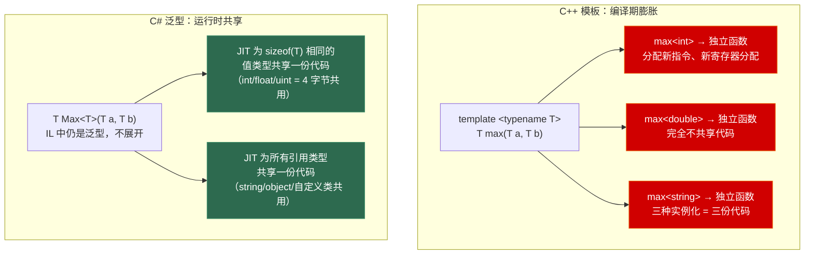
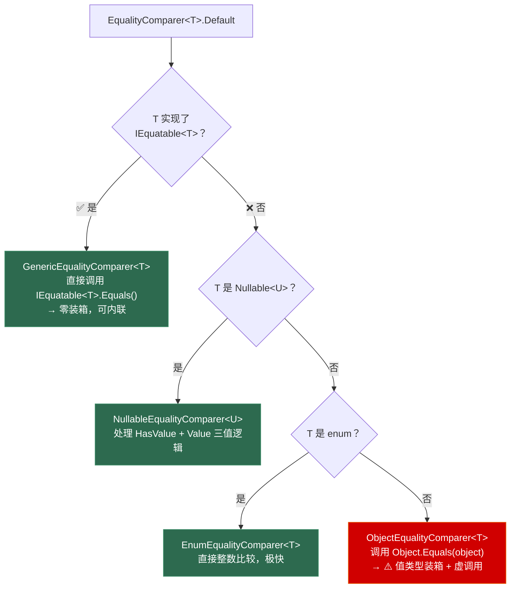
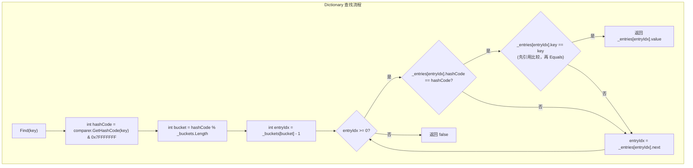

# 第五章 泛型与集合

> **一句话理解**：C# 泛型在运行时真实存在——`List<int>` 和 `List<float>` 共享同一份机器码，`typeof(List<int>)` 可以在反射中拿到。理解 JIT 如何做泛型代码共享、为什么 Dictionary 用 struct Entry 数组而非链表、以及相等比较器的选择链，是写出高性能 C# 的基础。

---

## 5.1 概念直觉 —— 代码生成的两种哲学



**一句话记住区别**：C++ 泛型是"代码复制粘贴机"，C# 泛型是"一份代码 + 类型信息运行时传递"。

---

## 5.2 底层机制剖析

### 5.2.1 JIT 泛型代码共享机制（深度）

这是 C# 泛型面试中最硬核的问题。

```csharp
// C# 泛型的 IL 表示
// 你写的：
T Max<T>(T a, T b) where T : IComparable<T>
    => a.CompareTo(b) > 0 ? a : b;

// 编译为 IL（保留泛型）：
// .method private hidebysig static !!T Max<([mscorlib]System.IComparable`1<!!T>) T>
//        (!!T a, !!T b) cil managed
// {
//     // IL 中用 !!T 表示"类型参数"，不做展开
// }

// 运行时 JIT 的策略：
// 1. 对于所有引用类型（T = string, T = object, T = Player…）
//    → 所有引用类型指针大小相同（64位下 8 字节），共享一份机器码
//    原因：引用类型操作都是指针操作，和具体类型无关
//
// 2. 对于值类型
//    → 相同大小的值类型共享一份机器码
//    → 不同大小的值类型需要不同的机器码（因为寄存器/栈帧布局不同）
//    int(4), float(4), uint(4) → 共享
//    long(8), double(8) → 共享
//    struct{int,int,int}(12) → 独享
```

```csharp
// 验证 JIT 共享：查看不同类型的方法表指针
class Test<T>
{
    public static void Method() { }
}

// Test<string>.Method 和 Test<object>.Method 的机器码地址相同
// Test<int>.Method 有独立的机器码
// Test<double>.Method 和 Test<int>.Method 共享（都是 4 字节）

// 这对性能的影响：
// ✅ 好：引用类型泛型不膨胀二进制，节省指令缓存
// ⚠️ 坏：引用类型泛型内部不能做"为 string 特化"的内联（编译器看不到具体类型）
// C++ 模板可以为每种类型做最大限度的内联优化，C# 泛型做不到
```

### 5.2.2 泛型类型初始化 —— 静态构造函数的时机

```csharp
// 每个封闭泛型类型有独立的静态构造函数
class Generic<T>
{
    public static int Value;
    
    static Generic()
    {
        Console.WriteLine($"初始化 Generic<{typeof(T).Name}>");
        Value = typeof(T) == typeof(int) ? 100 : 10;
    }
}

// 第一次访问 Generic<int> 时 → 触发 Generic<int> 的静态构造函数
Console.WriteLine(Generic<int>.Value);     // 输出：初始化 Generic<Int32> / 100

// 第一次访问 Generic<string> 时 → 触发 Generic<string> 的静态构造函数
Console.WriteLine(Generic<string>.Value);  // 输出：初始化 Generic<String> / 10

// Generic<int> 和 Generic<string> 在运行时是完全不同的类型
// → 有独立的静态字段、独立的方法表、独立的静态构造函数
```

```csharp
// 这可以用于"编译期常量化"技巧
class Factory<T>
{
    public static readonly bool IsValueType;
    
    static Factory()
    {
        IsValueType = typeof(T).IsValueType;
        // 运行时 typeof(T) 的真实类型在这里可用
    }
}

// 在泛型方法中，静态只读字段的值可以驱动 JIT 做分支消除
bool ShouldUseStack<T>()
{
    if (Factory<T>.IsValueType)
        return true;   // JIT：对于 T=int，这是常量 true → 死代码消除
    else
        return false;  // JIT：对于 T=string，这是常量 false → 死代码消除
}
```

### 5.2.3 类型约束：不仅仅是 where

```csharp
// 六种约束的完整示例
// ① base class: T 必须是 Stream 或其派生类
void Read<T>(T stream) where T : Stream { }

// ② interface: T 必须实现 IComparable<T>
//    struct + 接口约束 = 不装箱的接口调用（JIT 可以内联）
void Sort<T>(T[] items) where T : IComparable<T> { }

// ③ class: T 必须是引用类型
void HandleRef<T>(T obj) where T : class { }

// ④ struct: T 必须是值类型
//    配合 unmanaged 可以在 unsafe 中取指针
void ProcessValue<T>(T[] data) where T : struct { }

// ⑤ new(): T 必须有 public 无参构造
T Create<T>() where T : new() => new T();

// ⑥ unmanaged (C# 7.3+): T 不能包含任何引用
unsafe void Process<T>(T[] data) where T : unmanaged
{
    fixed (T* p = data) { /* 安全的指针操作 */ }
}
// unmanaged 类型：sbyte/byte/short/ushort/int/uint/long/ulong/
//                  float/double/char/bool/decimal/IntPtr/UIntPtr/
//                  以及全部由上述类型构成的 struct
```

```csharp
// 约束的组合和限制
// ✅ 可以组合多个约束
void Process<T>(T item)
    where T : class, IDisposable, new()
{ }

// ❌ 不能同时约束 class 和 struct（互斥）
// void Foo<T>(T x) where T : class, struct { }  // 编译错误

// ❌ new() 必须放在最后
// void Foo<T>() where T : new(), IDisposable { }  // 编译错误
// void Foo<T>() where T : IDisposable, new() { }  // ✅

// ❌ 不能约束为 System.Array、System.Delegate、System.Enum
//     但可以用 class/struct/接口来等效约束

// C# 7.3+: 约束为 Enum 或 Delegate
void EnumOnly<T>() where T : struct, Enum { }
void DelegateOnly<T>() where T : class, Delegate { }
```

### 5.2.4 协变逆变的运行时安全检查

```csharp
// 协变/逆变不仅是编译期检查，运行时也会验证

// 协变：IEnumerable<out T>
IEnumerable<string> strings = new List<string> { "a", "b" };
IEnumerable<object> objects = strings;  // ✅ 编译通过，运行时也安全

// 但要注意数组协变的历史坑（Java/C# 都有）
string[] strArr = { "a", "b" };
object[] objArr = strArr;      // ✅ 数组协变（C# 1.0 就支持）
objArr[0] = 123;               // ❌ ArrayTypeMismatchException！
// 运行时数组知道自己的真实类型是 string[]，拒绝存储 int

// List<T> 没有这个坑，因为 T 是不变的（没有 out/in）
// List<string> listStr = new List<string> { "a", "b" };
// List<object> listObj = listStr;  // ❌ 编译错误！List<T> 没有 out
```

```csharp
// 逆变的安全边界
Action<object> objAction = o => Console.WriteLine(o);
Action<string> strAction = objAction;  // ✅ 编译通过
strAction("hello");  // ✅ 运行时安全：string 传给 object 参数

// 换一个角度看逆变的限制：
// 以下代码为什么编译错误？
interface IHandler<in T>
{
    // T Get();  // ❌ 逆变 T 不能出现在返回值位置！
    void Handle(T item);  // ✅ 逆变 T 只能在参数位置
}
// 原因：逆变意味着 T 可以被"更抽象"的类型替代，
// 返回一个"更抽象"的类型是协变才安全的事
```

### 5.2.5 相等比较器的五层选择机制

这是面试中较少有人能答完整的硬核问题。

```csharp
// EqualityComparer<T>.Default 的查找顺序：
// 
// 1. 如果 T 实现了 IEquatable<T>
//    → 使用 GenericEqualityComparer<T>（内部调用 IEquatable<T>.Equals）
//    → 对值类型不装箱
// 
// 2. 如果 T 没有实现 IEquatable<T>，且 T 是引用类型
//    → 使用 ObjectEqualityComparer<T>（内部调用 Object.Equals）
//    → 对值类型有装箱开销
// 
// 3. 如果 T 是 Nullable<U>
//    → 使用 NullableEqualityComparer<U>（处理 null 逻辑）
// 
// 4. 如果 T 是 enum
//    → 使用 EnumEqualityComparer<T>（直接整数比较，极快）
// 
// 5. 如果 T 实现了 IStructuralEquatable
//    → 没有特殊处理，走默认路径

// 这就是为什么 struct 实现 IEquatable<T> 至关重要：
// 没实现 → Object.Equals(object) → 装箱 + 虚调用
// 实现了 → GenericEqualityComparer<T> → 直接调用，不装箱
```



```csharp
// 验证不同选择器的性能差异
struct Point : IEquatable<Point>
{
    public int X, Y;
    
    public bool Equals(Point other) => X == other.X && Y == other.Y;
    public override bool Equals(object obj) => obj is Point p && Equals(p);
    public override int GetHashCode() => HashCode.Combine(X, Y);
}

struct PointSlow  // 没有实现 IEquatable<PointSlow>
{
    public int X, Y;
}

// Point 比较 → GenericEqualityComparer → 直接调用，零装箱
// PointSlow 比较 → ObjectEqualityComparer → 装箱 + 反射比较字段
```

### 5.2.6 Dictionary 的完整内部结构

```csharp
// Dictionary<TKey, TValue> 内部结构（反编译简化）

struct Entry
{
    public uint hashCode;   // 哈希码缓存 + 状态标记
    // hashCode 的最高位 = 0: 该 Entry 空闲
    // hashCode 的最高位 = 1: 该 Entry 被使用
    public int next;        // 冲突链中下一个 Entry 的索引，-1 表示链尾
    public TKey key;
    public TValue value;
}

// 成员字段：
// int[] _buckets;       // _buckets[hashCode % buckets.Length] = Entry 索引
// Entry[] _entries;     // 紧凑存储所有键值对
// int _count;           // 已使用的 Entry 数
// int _freeList;        // 空闲 Entry 链表头（用 next 字段链接空闲槽）
// int _freeCount;       // 空闲 Entry 数
// int _version;         // 修改计数（foreach 检测修改）
// IEqualityComparer<TKey> _comparer; // 比较器
```



```csharp
// Dictionary 扩容的细节（面试重点）
// 扩容时机：_count >= _buckets.Length * loadFactor
// loadFactor 默认 ≈ 0.72（内部的 HashHelpers 硬编码）
// 
// 扩容过程：
// 1. 分配新数组（桶和条目），新大小 = HashHelpers.GetPrime(oldSize * 2)
//    → 取大于 oldSize*2 的最小质数
// 2. 遍历旧 _entries，将每个活跃 Entry 重新哈希到新桶中
// 3. 替换 _buckets 和 _entries 引用
//
// ⚠️ 扩容在 Add 时触发，耗时 O(n)
// ✅ 如果你知道大概元素数，用 new Dictionary<TKey,TValue>(capacity) 预分配
```

### 5.2.7 集合性能速查表

| 集合 | 索引 | 头/尾插 | 中间插 | 查找 | 删除 | 内存特点 |
|------|------|--------|--------|------|------|---------|
| **List\<T\>** | O(1) | O(1)* 尾插 | O(n) | O(n) | O(n) | 连续数组，缓存友好 |
| **LinkedList\<T\>** | O(n) | O(1) | O(1) | O(n) | O(1) | 双向链表节点，每个节点有前后指针 |
| **Dictionary\<K,V\>** | — | O(1) 均摊 | — | O(1) 均摊 | O(1) 均摊 | 散列，最耗内存但最快查找 |
| **HashSet\<T\>** | — | O(1) 均摊 | — | O(1) 均摊 | O(1) 均摊 | 类似 Dictionary\<T,bool\> |
| **SortedDictionary\<K,V\>** | — | O(log n) | — | O(log n) | O(log n) | 红黑树，键有序 |
| **SortedList\<K,V\>** | O(1) 索引 | O(n) 尾插 | O(n) | O(log n) | O(n) | 两个数组（键+值），内存小 |
| **Queue\<T\>** | — | O(1) | — | — | O(1) | 环形数组 |
| **Stack\<T\>** | — | O(1) | — | — | O(1) | 数组 |

> 💡 **选型黄金法则**：90% 的场景 `List<T>` + `Dictionary<K,V>` 就够了。需要有序遍历用 `SortedDictionary`，需要内存紧凑用 `SortedList`（数组实现）。`LinkedList<T>` 在 C# 中极少使用——因为节点的堆分配开销往往超过了 O(1) 插入的优势。

### 5.2.8 只读集合与 Frozen 集合

```csharp
// ReadOnlyCollection<T> — 现有集合的只读包装，零拷贝
List<int> list = new List<int> { 1, 2, 3 };
ReadOnlyCollection<int> readOnly = list.AsReadOnly();
// readOnly[0] = 10;  // ❌ 编译错误

// ImmutableList<T> — System.Collections.Immutable
// 每次"修改"都创建新实例（持久化数据结构，类似 Clojure）
var immList = ImmutableList.Create<int>(1, 2, 3);
var newList = immList.Add(4);  // immList 不变，newList 是新实例（结构共享）

// FrozenSet<T> / FrozenDictionary<K,V> — .NET 8.0
// 构建时做大量优化工作（完美哈希、线性扫描选择）
// 构建后只读，查找速度比普通 HashSet/Dictionary 快 20-50%
// 适合：游戏配置表这类"启动时构建，运行时只读"的数据
var frozen = Enumerable.Range(0, 1000)
    .Select(i => $"key_{i}")
    .ToFrozenSet();
// frozen 的内部哈希表经过编译器级优化
```

---

## 5.3 C++ vs C# 泛型对比

| 维度 | C++ 模板 | C# 泛型 |
|------|---------|--------|
| **本质** | 编译期 AST 级代码生成 | IL 泛型 + 运行时 JIT |
| **实例化时机** | 编译期展开 | 运行时首次使用 |
| **类型约束** | Concepts (C++20) / SFINAE / 鸭子类型 | 显式 where 约束 |
| **运算符约束** | ✅ `requires { a + b; }` | ❌ （最大痛点） |
| **非类型参数** | ✅ `template<int N>` | ❌ 只有类型参数 |
| **变参模板** | ✅ `template<typename... Args>` | ❌（但 `params` 可部分代替） |
| **模板特化** | ✅ 全特化 + 偏特化 | ❌ |
| **反射** | ❌ 编译后不可见 | ✅ `typeof(List<int>)` |
| **代码量** | 每种实例化一份代码 | 引用类型共享，值类型按大小分组共享 |
| **编译速度** | 慢（头文件重解析 + 展开） | 快（泛型定义只编译一次） |

---

## 5.4 经典陷阱与面试题

### 5.4.1 这段代码有什么问题？

**陷阱一：泛型的 null 检查**

```csharp
bool IsNull<T>(T value)
{
    // ❌ 值类型 T 时永远 false，且编译器会警告
    // return value == null;
    
    // ✅ 正确写法
    return value is null;  // 值类型编译期判为 false，无警告
}

// 或者针对场景选择：
bool IsNullClass<T>(T value) where T : class => value == null;  // 明确只要引用类型
```

**陷阱二：泛型静态字段是多份的**

```csharp
class Cache<T>
{
    public static Dictionary<int, T> Items = new();
}

// Cache<int>.Items 和 Cache<string>.Items 是完全不同的 Dictionary！
// 运行时 Cache<int> 和 Cache<string> 是不同的类型
Cache<int>.Items[0] = 42;
Console.WriteLine(Cache<string>.Items.Count);  // 0 —— 互不影响
```

**陷阱三：枚举时的集合修改**

```csharp
var list = new List<int> { 1, 2, 3, 4, 5 };

// ❌ InvalidOperationException: Collection was modified
foreach (var x in list)
    if (x == 3) list.Remove(x);

// 原因：List<T>.Enumerator 在 MoveNext() 时检查 _version
//      任何修改操作（Add/Remove/Insert）都会增加 _version
//      枚举器发现不匹配 → 抛异常

// ✅ 方案一：RemoveAll
list.RemoveAll(x => x == 3);

// ✅ 方案二：倒序 for
for (int i = list.Count - 1; i >= 0; i--)
    if (list[i] == 3) list.RemoveAt(i);
```

**陷阱四：Dictionary Key 类型没有正确实现 GetHashCode**

```csharp
struct Point
{
    public int X, Y;
    // ❌ 没有显式实现 GetHashCode 和 Equals
}

var dict = new Dictionary<Point, string>();
dict[new Point { X = 1, Y = 2 }] = "A";

// 查找：反射逐字段计算哈希 + 比较 → 极慢
var found = dict.TryGetValue(new Point { X = 1, Y = 2 }, out var value);
// found 可能是 false！为什么？
// ValueType.GetHashCode 对包含引用类型的 struct 只基于第一个字段计算哈希
// 如果第一个字段相等但第二个字段不同 → 哈希冲突但 Equals 比较失败

// ✅ 修复：实现 IEquatable<Point> + 重写 Equals/GetHashCode
public override int GetHashCode() => HashCode.Combine(X, Y);
```

**陷阱五：协变接口 + 值类型的隐式装箱**

```csharp
// IEnumerable<int> 是协变的？不！
// IEnumerable<T> 是 out T → 协变
// 但 int 是 struct → 装箱

IEnumerable<int> ints = new List<int> { 1, 2, 3 };
// 遍历时每个元素需要从 Enumerator.Current 装箱为 IEnumerator<int>.Current
// → 产生 GC 分配！

// ✅ 避免：直接对 List<int> 用下标遍历或 foreach（编译器对 List 有特化优化）
foreach (int x in ints)  // 对 List<int>，编译器直接用索引遍历，不走 IEnumerator
{
}
```

### 5.4.2 面试问答

**Q：C# 泛型和 C++ 模板的本质区别？同一套机制吗？**

> 不是同一套。C++ 模板是编译期 AST 级代码生成（monomorphization），每种实例化产生独立的机器码——零运行时开销但编译慢、二进制膨胀。C# 泛型在 IL 层面保留泛型参数（!!T），运行时 JIT 为所有引用类型共享一份代码（指针大小相同），为相同大小的值类型共享一份代码。C# 泛型可以通过 `typeof(List<int>)` 反射获取运行时类型，C++ 模板编译后不保留任何泛型信息。

**Q：协变和逆变分别用在哪？为什么 List\<T\> 不支持协变？**

> 协变（out）用于"只读/输出"接口，如 `IEnumerable<out T>` 允许把 `List<string>` 当 `IEnumerable<object>` 用。逆变（in）用于"只写/输入"接口，如 `Action<in T>` 允许把 `Action<object>` 当 `Action<string>` 用。`List<T>` 不支持协变因为 T 既在输入位置（Add(T)）又在输出位置（this[int] → T），标记 out 会破坏类型安全。

**Q：Dictionary 用 struct 数组而非链表解决哈希冲突，为什么？**

> 链表节点是堆对象，每个节点有 GC 开销和缓存局部性差。C# 的 `Dictionary` 用结构体数组（`Entry[] _entries`）+ 整数 `next` 字段实现链地址法——next 存的是下一个 Entry 的索引，不是指针。所有 Entry 紧凑排列在一片连续内存中，缓存友好，且避免了为每个节点单独分配堆内存。

**Q：EqualityComparer\<T\>.Default 的查找逻辑？**

> ① 优先找 `IEquatable<T>` 实现（值类型不装箱）；② 没找到则对引用类型用 `ObjectEqualityComparer`（直接调 Equals）；③ `Nullable<U>` 用专门的比较器处理三值逻辑；④ enum 有特化的整数比较。struct 实现 `IEquatable<T>` 可以避免装箱 + 反射，性能差异可达 10 倍以上。

---

## 5.5 游戏实战场景

### 5.5.1 泛型对象池（带自动归还）

```csharp
class ObjectPool<T> where T : class, new()
{
    private readonly Stack<T> _pool = new();
    
    public T Rent()
    {
        if (_pool.TryPop(out var item))
        {
            (item as IPoolable)?.OnRent();
            return item;
        }
        var newItem = new T();
        (newItem as IPoolable)?.OnRent();
        return newItem;
    }
    
    public void Return(T item)
    {
        (item as IPoolable)?.OnReturn();
        _pool.Push(item);
    }
}

interface IPoolable
{
    void OnRent();
    void OnReturn();
}

class Bullet : IPoolable
{
    public Vector3 Position;
    public bool Active;
    
    public void OnRent() => Active = true;
    public void OnReturn() { Position = default; Active = false; }
}

// 使用
var bullets = new ObjectPool<Bullet>();
Bullet b = bullets.Rent();
b.Position = spawnPoint;
// ... 使用完毕 ...
bullets.Return(b);
```

### 5.5.2 ECS 稀疏集合（带迭代器）

```csharp
// SparseSet：给每个实体类型存储组件数据，O(1) 增删查
class SparseSet<T> where T : struct
{
    private int[] _sparse;    // entityId → dense 索引（-1 = 不存在）
    private int[] _dense;     // 反向：dense 索引 → entityId
    private T[] _components;   // 组件数据紧密排列
    private int _count;
    
    public int Count => _count;
    
    public SparseSet(int maxEntities)
    {
        _sparse = new int[maxEntities];
        Array.Fill(_sparse, -1);
        _dense = new int[maxEntities];
        _components = new T[maxEntities];
    }
    
    public ref T Add(int entityId, T component)
    {
        _sparse[entityId] = _count;
        _dense[_count] = entityId;
        _components[_count] = component;
        return ref _components[_count++];  // ref 返回允许原地修改
    }
    
    public ref T Get(int entityId) => ref _components[_sparse[entityId]];
    
    public bool Has(int entityId) => 
        (uint)entityId < (uint)_sparse.Length && _sparse[entityId] != -1;
    
    public void Remove(int entityId)
    {
        int idx = _sparse[entityId];
        int lastEntity = _dense[_count - 1];
        
        // swap-remove 保持数组紧凑
        _components[idx] = _components[_count - 1];
        _dense[idx] = lastEntity;
        _sparse[lastEntity] = idx;
        _sparse[entityId] = -1;
        _count--;
    }
    
    // 迭代器：直接遍历 _components，零虚调用
    public ReadOnlySpan<T> AsSpan() => _components.AsSpan(0, _count);
}

// 使用
var positions = new SparseSet<Vector3>(10000);
positions.Add(entityId, new Vector3(1, 2, 3));
ref var pos = ref positions.Get(entityId);
pos.Y += 1.0f;  // 直接修改了数组内的数据
```

### 5.5.3 游戏配置表的有序字典

```csharp
// 配置表：key 有序 → 方便按 ID 范围遍历
class ConfigTable
{
    private SortedDictionary<int, ItemConfig> _items;
    
    public ConfigTable(string csvPath)
    {
        // 从 CSV 加载，SortedDictionary 内建红黑树
        _items = new SortedDictionary<int, ItemConfig>();
        foreach (var row in File.ReadAllLines(csvPath).Skip(1))
        {
            var parts = row.Split(',');
            var config = new ItemConfig
            {
                ID = int.Parse(parts[0]),
                Name = parts[1],
                Price = int.Parse(parts[2])
            };
            _items[config.ID] = config;
        }
    }
    
    // O(log n) 查找单个
    public ItemConfig Get(int id) => _items.TryGetValue(id, out var c) ? c : null;
    
    // 按 ID 范围查询（利用 SortedDictionary 的有序性）
    public IEnumerable<ItemConfig> GetRange(int minId, int maxId)
    {
        // 内部用二分查找定位到 minId，然后中序遍历
        foreach (var kvp in _items)
        {
            if (kvp.Key < minId) continue;
            if (kvp.Key > maxId) break;
            yield return kvp.Value;
        }
    }
}
```

### 5.5.4 用协变接口统一访问资源

```csharp
// 利用协变，让 AssetStore<T> 的只读接口统一
interface IReadOnlyAssetStore<out T> where T : UnityEngine.Object
{
    T Get(string path);
    bool TryGet(string path, out T asset);
}

class AssetStore<T> : IReadOnlyAssetStore<T> where T : UnityEngine.Object
{
    private Dictionary<string, T> _cache = new();
    
    public T Get(string path)
    {
        if (!_cache.TryGetValue(path, out var asset))
        {
            asset = Resources.Load<T>(path);
            _cache[path] = asset;
        }
        return asset;
    }
    
    public bool TryGet(string path, out T asset) => _cache.TryGetValue(path, out asset);
}

// 使用协变：可以统一传 IReadOnlyAssetStore<Object>
void PreloadAll(IReadOnlyAssetStore<UnityEngine.Object> store)
{
    // 这个函数接受任何 AssetStore<T>，因为 T 继承自 Object
}

var textureStore = new AssetStore<Texture2D>();
PreloadAll(textureStore);  // ✅ 协变，编译通过
```

---

## 5.6 30 秒速答

**Q：C# 泛型的 JIT 如何共享代码？**

> 所有引用类型的泛型实例化共享同一份机器码（指针大小相同）。值类型按 `sizeof(T)` 分组共享——int/float/uint（4 字节）共享，long/double（8 字节）共享，自定义大 struct 独享。这个策略在代码膨胀和性能之间折中。

**Q：struct 做 Dictionary Key 必须注意什么？**

> 必须重写 `GetHashCode()` 和 `Equals()`。默认的 `ValueType.GetHashCode()` 通过反射计算哈希，有装箱且慢。推荐 `HashCode.Combine()`。同时实现 `IEquatable<T>` 让 `EqualityComparer<T>.Default` 走特化路径，避免装箱。

**Q：Dictionary 的扩容时机和策略？**

> 当 `_count >= _buckets.Length * 0.72` 时触发扩大。新大小 = 大于当前 2x 的最小质数。扩容时将旧 Entry 重新哈希（rehash）到新桶中，是 O(n) 操作。可通过构造函数传入预估容量避免多次扩容。

**Q：`IList<T>` 和 `IReadOnlyList<T>` 为什么一个不变，一个协变？**

> `IList<T>` 有 `Add(T)` 方法（T 在输入位置）和 `this[int]`（T 在输出位置），T 同时出现在 in 和 out 位置 → 不变。`IReadOnlyList<T>` 只有索引器返回 T（T 只在 out 位置）→ 可以标记为 `out` 协变。

**Q：什么时候用 SortedDictionary 而非 Dictionary？**

> 需要按键排序遍历时（如配置表的 ID 范围查询）。`SortedDictionary` 内部是红黑树，操作 O(log n) 但支持范围查询和有序遍历。`Dictionary` 操作 O(1) 均摊但遍历顺序不确定。

---

> 📖 上一章：[第四章 运算符重载、委托与闭包](../04_operators_delegates_events) —— 多播委托、闭包捕获、C# 表达力。

> 📖 下一章：[第六章 LINQ 与 Lambda](../06_linq_and_lambda) —— 迭代器状态机、表达式树、函数式编程在游戏数据查询中的应用。
