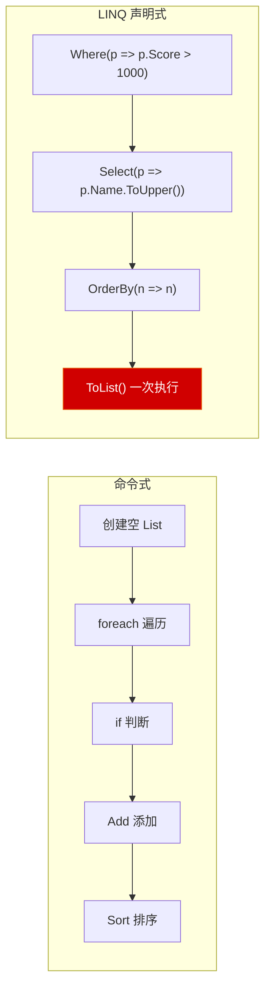
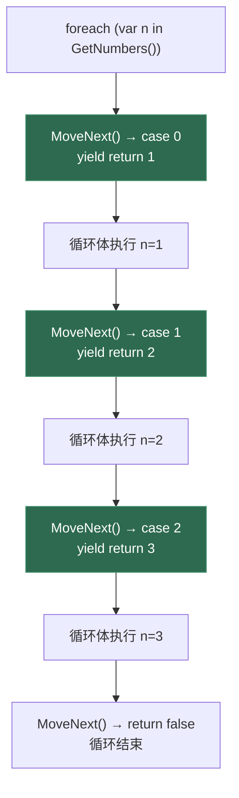
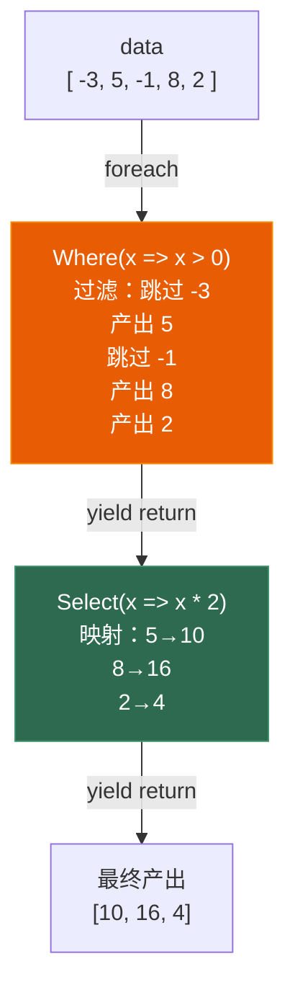
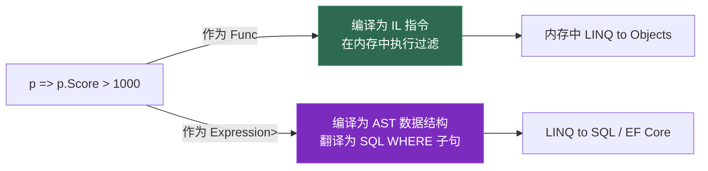

# 第六章 LINQ 与迭代器

> **一句话理解**：LINQ 不是"语法糖"——它的核心是延迟执行。`Where` 不遍历数据，`Select` 不创建新集合，直到你调用 `ToList()` 或 `foreach` 的那一刻，查询才真正执行。理解这一点，是驾驭 LINQ 的第一步。

---

## 6.1 概念直觉 —— 声明式 vs 命令式

### 为什么需要 LINQ

```csharp
// 命令式（告诉计算机"怎么做"）
var results = new List<string>();
foreach (var player in players)
{
    if (player.Score > 1000)
    {
        results.Add(player.Name.ToUpper());
    }
}
results.Sort();

// 声明式（告诉计算机"我要什么"）
var results = players
    .Where(p => p.Score > 1000)
    .Select(p => p.Name.ToUpper())
    .OrderBy(n => n)
    .ToList();
```

LINQ 的核心理念：**描述查询意图，而非控制执行步骤**。这和 SQL 的逻辑完全一致——你写 `SELECT Name FROM Players WHERE Score > 1000`，不用管数据是怎么找出来的。



---

## 6.2 底层机制剖析

### 6.2.1 迭代器（yield return）—— 状态机编译

`yield return` 是 LINQ 所有延迟执行特性的基础。它的本质是编译器生成一个 IEnumerator 状态机类：

```csharp
// === 你写的 ===
IEnumerable<int> GetNumbers()
{
    yield return 1;
    yield return 2;
    yield return 3;
}

// === 编译器生成的（反编译简化） ===
class GetNumbers_d__0 : IEnumerator<int>
{
    private int __state;     // 状态机位置（-2: 初始, 0~2: 各 yield, -1: 结束）
    private int __current;   // 当前值
    
    public bool MoveNext()
    {
        switch (__state)
        {
            case 0:
                __current = 1;   // yield return 1
                __state = 1;
                return true;
            case 1:
                __current = 2;   // yield return 2
                __state = 2;
                return true;
            case 2:
                __current = 3;   // yield return 3
                __state = -1;
                return true;
            default:
                return false;    // 结束
        }
    }
    
    public int Current => __current;
    // ... Reset, Dispose 等省略
}
```



```csharp
// 迭代器的关键特性：每次只产出一个值，不预先计算全部结果
IEnumerable<int> Fibonacci()
{
    int a = 0, b = 1;
    while (true)
    {
        yield return a;
        (a, b) = (b, a + b);
    }
}

// 取前 10 个：只计算了 10 次迭代，不会无限循环
var first10 = Fibonacci().Take(10).ToList();
// 0, 1, 1, 2, 3, 5, 8, 13, 21, 34
```

### 6.2.2 延迟执行 —— LINQ 最核心的概念

```csharp
// ❌ 直觉陷阱：LINQ 返回的不是"结果集合"，而是"查询计划"
var query = players.Where(p => p.Score > 1000);
// 此时没有任何遍历！Where 返回的是一个迭代器对象

// 只有"消费"时，查询才真正执行：
foreach (var p in query) { }  // ← 此时才遍历
var list = query.ToList();    // ← 此时才遍历
int count = query.Count();    // ← 此时才遍历（而且是重新遍历！）

// ⚠️ 最经典的坑：两次遍历
var highScores = players.Where(p => p.Score > 1000);
Console.WriteLine($"人数: {highScores.Count()}");  // 第一次遍历
foreach (var p in highScores)                       // 第二次遍历！
{
    Process(p);
}
```

```csharp
// ✅ 正确：用 ToList() 物化查询结果
var highScores = players.Where(p => p.Score > 1000).ToList();
Console.WriteLine($"人数: {highScores.Count}");  // 读内存
foreach (var p in highScores)                     // 读内存
{
    Process(p);
}

// 原则：如果你要多次使用查询结果 → ToList() 或 ToArray()
//       如果只用一次 → 保持 IEnumerable，零分配
```

### 6.2.3 链式迭代器的嵌套机制

理解 LINQ 的迭代器链是如何一层层"包裹"的，才能真正理解它的性能特征：

```csharp
// 你写的 LINQ 链：
var result = data
    .Where(x => x > 0)
    .Select(x => x * 2);

// 编译器生成的等价代码(简化)：
// Where 迭代器包装原始迭代器，Select 迭代器包装 Where 迭代器
class WhereIterator : IEnumerable<int>
{
    private IEnumerable<int> _source;  // 指向 data
    private Func<int, bool> _predicate;
    
    public IEnumerator<int> GetEnumerator()
    {
        foreach (var item in _source)       // 遍历 data
            if (_predicate(item))            // 执行 x > 0
                yield return item;           // 产出满足条件的
    }
}

class SelectIterator : IEnumerable<int>
{
    private IEnumerable<int> _source;  // 指向 WhereIterator
    private Func<int, int> _selector;
    
    public IEnumerator<int> GetEnumerator()
    {
        foreach (var item in _source)       // 遍历 WhereIterator
            yield return _selector(item);    // 执行 x * 2
    }
}

// 调用链：
// foreach → SelectIterator.GetEnumerator()
//         → MoveNext → WhereIterator.GetEnumerator()
//                     → MoveNext → data.GetEnumerator()
//                                → MoveNext → 返回原始元素
//                     → 检查 predicate
//         → 执行 selector
//         → 返回最终结果

// 结论：每一次迭代都要穿越整条调用链。链越长，每元素的开销越大。
// 但这是 O(元素数 × 链长度)，不是 O(元素数²)，因为每层只是多了一次虚调用
```



```csharp
// GroupBy 是缓冲操作 —— 面试重点
// 和 Where/Select 不同，GroupBy 必须在第一次 MoveNext 时读取全部源数据
var groups = data.GroupBy(x => x.Category);
// ↑ 此时还没有遍历！

foreach (var group in groups)  // ← 第一次 MoveNext 时，GroupBy 内部：
{
    // 1. 遍历整个 data，填充内部 Dictionary<TKey, List<T>>
    // 2. 把分组结果缓存起来
    // 3. 以后每次 MoveNext 直接从 Dictionary 中取
}

// 为什么 GroupBy 必须缓冲？
// 因为你在遍历第一个组时，还没读到的元素可能属于第一个组！
// 不读完整个源数据，GroupBy 不敢确定每个组有哪些成员。
// 
// OrderBy / Reverse / ToList 同理 —— 它们都是"缓冲"操作
```

### 6.2.4 IQueryable —— 表达式树的真正用武之地

```csharp
// IEnumerable<T> 的 Where：在内存中遍历过滤
// IQueryable<T> 的 Where：构建表达式树，由 Provider 最终翻译执行

// 关键区别：
IEnumerable<Player> memQuery = players.Where(p => p.Score > 1000);
// → 编译器生成委托: Func<Player, bool>
// → 运行时在内存中逐一遍历过滤

IQueryable<Player> dbQuery = db.Players.Where(p => p.Score > 1000);
// → 编译器生成表达式树: Expression<Func<Player, bool>>
// → Provider (EF Core) 遍历表达式树 → 翻译为 SQL：
//   SELECT * FROM Players WHERE Score > 1000

// IQueryable 的核心：Expression Tree 提供了"看一眼代码结构"的能力
// 这就是为什么 db.Players.Where(...).Select(...).ToList()
// 可以被整体翻译为一条 SQL，而不是 N+1 查询
```

```csharp
// 表达式树的递归遍历：自己实现一个简单的 Where 翻译器
string TranslateWhere<T>(Expression<Func<T, bool>> predicate)
{
    if (predicate.Body is BinaryExpression bin)
    {
        string left = GetMemberName(bin.Left);   // 如 "Score"
        string op = bin.NodeType switch          // 如 GreaterThan
        {
            ExpressionType.GreaterThan => ">",
            ExpressionType.Equal => "=",
            _ => "??"
        };
        object right = GetConstantValue(bin.Right); // 如 1000
        return $"{left} {op} {right}";
    }
    return string.Empty;
}

var sql = TranslateWhere<Player>(p => p.Score > 1000);
// sql = "Score > 1000"
```

### 6.2.3 LINQ 操作符的分层

```csharp
// === 第一层：延迟执行（返回 IEnumerable） ===
// 这些操作符不触发遍历，只构建查询链
players.Where(p => p.Score > 1000)              // 过滤
       .Select(p => p.Name)                      // 投影
       .SelectMany(p => p.Items)                 // 扁平化
       .Take(10)                                 // 取前 N 个
       .Skip(5)                                  // 跳过 N 个
       .Distinct()                               // 去重
       .OrderBy(p => p.Score)                    // 排序（但这是"延迟"的吗？）

// ⚠️ 注意：OrderBy 也是延迟的！但它是"缓冲"操作——
//       它需要读取全部数据才能排序，所以第一次 MoveNext 时会遍历整个源

// === 第二层：立即执行（返回具体类型） ===
players.Count()                                  // 遍历后返回 int
players.ToList()                                 // 遍历后返回 List
players.ToArray()                                // 遍历后返回 Array
players.First()                                  // 取第一个（源为空抛异常）
players.FirstOrDefault()                         // 取第一个（源为空返回 default）
players.Any(p => p.Score > 1000)                 // 是否存在
players.All(p => p.IsAlive)                      // 是否全部满足
```

### 6.2.4 SelectMany —— 扁平化的秘密

```csharp
// SelectMany 将嵌套结构"拍平"
class Player
{
    public string Name;
    public List<Item> Inventory;  // 每个玩家有一个物品列表
}

// 任务：获取所有玩家的所有物品（扁平列表）
// 不用 LINQ：
var allItems = new List<Item>();
foreach (var p in players)
    foreach (var item in p.Inventory)
        allItems.Add(item);

// 用 SelectMany：一行搞定
var allItems = players.SelectMany(p => p.Inventory).ToList();

// SelectMany 内部等价于：
IEnumerable<Item> SelectMany_Impl(IEnumerable<Player> players)
{
    foreach (var p in players)
        foreach (var item in p.Inventory)
            yield return item;  // 一个 yield return 搞定两层嵌套
}
```

### 6.2.5 表达式树 —— Lambda 的双重身份

```csharp
// Lambda 的两个身份：
// 1. 委托（Func<T>）    → 编译为 IL，可以直接执行
// 2. 表达式树（Expression<T>） → 编译为数据结构，描述表达式的 AST

// 同一个 Lambda，取决于目标类型：
Func<int, bool> isEven = x => x % 2 == 0;         // 委托
Expression<Func<int, bool>> expr = x => x % 2 == 0; // 表达式树

// 表达式树的内部结构（简化示意）：
// LambdaExpression
//   ├── Parameters: [ParameterExpression("x")]
//   └── Body: BinaryExpression(Equal)
//       ├── Left: BinaryExpression(Modulo)
//       │   ├── Left: ParameterExpression("x")
//       │   └── Right: ConstantExpression(2)
//       └── Right: ConstantExpression(0)

// 表达式树的作用：让代码可以被程序化地分析、转换、执行
// 这是 Entity Framework 的核心机制：
// db.Players.Where(p => p.Score > 1000)
// ↑ 这里的 Lambda 被编译为 Expression，然后被 EF 翻译为 SQL
```



### 6.2.6 查询语法 vs 方法语法

```csharp
// 两种语法，底层完全等价（编译器将查询语法翻译为方法调用）

// 查询语法（像 SQL）
var result = from p in players
             where p.Score > 1000
             orderby p.Score descending
             select p.Name;

// 方法语法（Lambda + 扩展方法）
var result = players
    .Where(p => p.Score > 1000)
    .OrderByDescending(p => p.Score)
    .Select(p => p.Name);

// 编译器将查询语法翻译为方法语法（反编译结果完全一样）
// 哪些功能查询语法不支持？
// - Take / Skip / Distinct
// - 自定义扩展方法
// → 方法语法是 LINQ 的"完整版"
```

```csharp
// 查询语法的 let 和 into —— 方法语法中很难表达的东西
var query = from p in players
            let totalValue = p.Inventory.Sum(i => i.Price)
            where totalValue > 500
            select new { p.Name, TotalValue = totalValue };

// 等价的方法语法（需要 Select 投影中间结果）：
var query = players
    .Select(p => new { p, totalValue = p.Inventory.Sum(i => i.Price) })
    .Where(t => t.totalValue > 500)
    .Select(t => new { t.p.Name, TotalValue = t.totalValue });
```

---

## 6.3 经典陷阱

### 6.3.1 闭包捕获 LINQ 中的循环变量

```csharp
// ❌ 经典陷阱：LINQ 中的 Lambda 也受闭包影响
var filters = new List<Func<int, bool>>();
var thresholds = new[] { 10, 20, 30 };

// ❌ 所有 filter 共享同一个 t → 全部用 30
foreach (var t in thresholds)  // C# 5+ foreach 修复了这个问题
    filters.Add(x => x > t);

// ✅ 安全写法（防御性）：
foreach (var t in thresholds)
{
    int local = t;
    filters.Add(x => x > local);
}

// 或者用 LINQ 本身避免问题：
var filters = thresholds.Select<int, Func<int, bool>>(t => x => x > t).ToList();
// ↑ 每个 Select 迭代，t 是不同的参数绑定
```

### 6.3.2 多次枚举同一个 IEnumerable

这是 LINQ 最常踩的坑，没有之一：

```csharp
// ❌ 延迟执行 + 多次消费 = 重复工作
var query = players.Where(p => {
    Console.WriteLine($"检查 {p.Name}");
    return p.Score > 1000;
});

Console.WriteLine(query.Count());  // 遍历一次 → 输出 "检查 ..." × N 次
Console.WriteLine(query.Any());    // 又遍历一次 → 又输出 "检查 ..." × N 次
// 如果 players 是 IQueryable → 两次 SQL 查询！

// ✅ 物化快照
var list = query.ToList();
Console.WriteLine(list.Count);     // 内存操作，零副作用
Console.WriteLine(list.Any());     // 内存操作
```

### 6.3.3 First() vs FirstOrDefault() 的异常

```csharp
// ❌ 空集合上 First() 抛 InvalidOperationException
var result = players.Where(p => p.Score > 999999).First();
// → InvalidOperationException: Sequence contains no elements

// ✅ 你期望一个"可能没有"的结果 → 用 FirstOrDefault
var result = players.Where(p => p.Score > 999999).FirstOrDefault();
// → null (或 default)

// ✅ 你确定一定有 → 用 First() 向阅读代码的人传达这个意图
var result = players.First(p => p.ID == knownID);  // 找不到就是 bug
```

### 6.3.4 LINQ 中的异步陷阱

```csharp
// ❌ Where 中的异步 Lambda —— 返回的是 Task<bool>，不是 bool
var filtered = players.Where(async p => await IsValidAsync(p));
// 编译通过！但 filtered 的元素类型是 Task<bool>（永远是 true，因为 Task 是引用类型非 null）

// ❌ Select 中调用异步方法 —— 返回 IEnumerable<Task<T>>
var tasks = players.Select(async p => await LoadProfileAsync(p));
// 结果是 5 个未完成的 Task，不是 5 个 Profile

// ✅ 正确：用 Task.WhenAll 并行等待
var profiles = await Task.WhenAll(players.Select(p => LoadProfileAsync(p)));
```

### 6.3.5 在热路径上使用 LINQ 的隐性分配

```csharp
// ❌ Update 中使用 LINQ —— 分配迭代器 + Lambda 委托
void Update()
{
    var alive = enemies.Where(e => e.HP > 0).ToList();
    // 堆分配：Where 迭代器对象 + ToList 的新 List + Lambda 委托（如果没缓存）
}

// ✅ 手动遍历，零分配（在预分配的 List 上工作）
private List<Enemy> _aliveCache = new(64);

void Update()
{
    _aliveCache.Clear();
    foreach (var e in enemies)
        if (e.HP > 0)
            _aliveCache.Add(e);
}
```

---

## 6.3a LINQ 性能分析：什么时候该避免

```csharp
// LINQ 的分配开销来源：
// 1. 迭代器对象（每个操作符一个堆对象，如 WhereIterator, SelectIterator）
// 2. Lambda 委托（每次创建 Func<T> 可能有分配）
// 3. 缓冲操作的临时集合（GroupBy、OrderBy 内部新分配）

// 基准对比（典型数据量 1000 个元素）：
// 操作               | LINQ                | 手动 foreach
// Where              | ~80ns/元素 + 迭代器 | ~20ns/元素
// Select             | ~60ns/元素 + 迭代器 | ~15ns/元素
// Where().Select()   | ~140ns/元素 + 2迭代器| ~35ns/元素
// ToList()           | 额外堆分配 + 拷贝   | 堆分配 + 拷贝（一样）

// 决策原则：
// ✅ 用 LINQ：游戏逻辑（非热路径）、编辑器工具、数据管线、配置处理
// ❌ 不用 LINQ：Update() 帧循环、粒子系统、物理回调（每帧数千次调用）
// 中间地带：偶尔使用的系统（如 UI 刷新、背包排序）→ LINQ 的代码清晰度 > 微小性能损失
```

---

## 6.4 游戏实战场景

### 6.4.1 技能树查询

```csharp
class SkillNode
{
    public int ID;
    public string Name;
    public int RequiredLevel;
    public List<int> PrerequisiteIDs;  // 前置技能 ID
    public bool Unlocked;
}

// 获取玩家可解锁的技能（所有前置技能都已解锁）
var unlockable = skillTree
    .Where(s => !s.Unlocked)
    .Where(s => s.PrerequisiteIDs.All(preId =>
        skillTree.Any(pre => pre.ID == preId && pre.Unlocked)))
    .OrderBy(s => s.RequiredLevel)
    .ToList();
```

### 6.4.2 背包物品统计

```csharp
class InventoryItem
{
    public int ItemID;
    public string Category;   // "Weapon", "Potion", "Material"
    public int Count;
    public int Price;
}

// 按类别统计总价值
var categoryValue = inventory
    .GroupBy(i => i.Category)
    .Select(g => new {
        Category = g.Key,
        TotalValue = g.Sum(i => i.Price * i.Count),
        ItemCount = g.Count(),
        TopItem = g.OrderByDescending(i => i.Price).First().ItemID
    })
    .OrderByDescending(c => c.TotalValue)
    .ToList();
```

### 6.4.3 场景实体查询

```csharp
// 在场景中查找所有距离玩家 50 米内、生命值低于 30% 的敌人
var nearbyWeakEnemies = entities
    .OfType<Enemy>()                          // 类型筛选
    .Where(e => e.IsAlive)
    .Where(e => Vector3.Distance(e.Position, player.Position) < 50f)
    .Where(e => (float)e.HP / e.MaxHP < 0.3f)
    .OrderBy(e => Vector3.Distance(e.Position, player.Position))
    .Take(5)                                   // 最多取 5 个（锁敌上限）
    .ToList();

// ⚠️ Distance 被调用了至少两次（OrderBy 再次计算）
// ✅ 优化：先投影，再排序（避免重复计算距离）
var withDistance = entities
    .OfType<Enemy>()
    .Where(e => e.IsAlive)
    .Select(e => new { Enemy = e, Dist = Vector3.Distance(e.Position, player.Position) })
    .Where(x => x.Dist < 50f)
    .Where(x => (float)x.Enemy.HP / x.Enemy.MaxHP < 0.3f)
    .OrderBy(x => x.Dist)
    .Take(5)
    .Select(x => x.Enemy)
    .ToList();
```

### 6.4.4 用 SelectMany 实现任务系统

```csharp
class Quest
{
    public int ID;
    public string Title;
    public List<QuestObjective> Objectives;
}

class QuestObjective
{
    public string Description;
    public int RequiredCount;
    public int CurrentCount;
    public bool IsCompleted => CurrentCount >= RequiredCount;
}

// 获取所有未完成的任务目标（扁平化）
var incompleteObjectives = questLog
    .SelectMany(q => q.Objectives, (quest, obj) => new {
        QuestTitle = quest.Title,
        obj.Description,
        obj.RequiredCount,
        obj.CurrentCount
    })
    .Where(o => o.CurrentCount < o.RequiredCount)
    .OrderByDescending(o => (float)o.CurrentCount / o.RequiredCount)
    .ToList();
```

---

## 6.5 30 秒速答

**Q：LINQ 的延迟执行是什么意思？**

> LINQ 查询方法（`Where`、`Select`、`Take` 等）返回的是一个迭代器，不遍历源数据。只有调用 `ToList()`、`ToArray()`、`Count()`、`foreach` 等"消费"操作时，查询才真正执行。这意味着每次消费都会重新遍历源数据——如果源数据在此期间变了，结果也会不同。

**Q：yield return 的底层是什么？**

> 编译器生成一个状态机类（实现 `IEnumerator<T>`），把每个 `yield return` 位置映射为 `switch case` + `__state`。每次 `MoveNext()` 执行一段代码，到下一个 `yield` 暂停。它和 C++ 协程的设计原理类似——都是将线性代码改写为可恢复的状态机。

**Q：SelectMany 和 Select 的区别？**

> `Select` 是一对一映射（每个元素映射为一个新元素）。`SelectMany` 是一对多映射 + 扁平化（每个元素映射为零个或多个元素，最终合并为一个序列）。典型场景：每个玩家有多个物品 → `SelectMany` 得到所有物品的扁平列表。

**Q：LINQ to Objects 和 LINQ to SQL 的 Lambda 有什么不同？**

> LINQ to Objects 的 Lambda 被编译为 `Func<T>` 委托，直接在内存中执行。LINQ to SQL（EF Core）的 Lambda 被编译为 `Expression<T>` 表达式树，由 Provider 翻译为 SQL。同一个 Lambda 语法，取决于目标类型走完全不同的路径。

**Q：什么情况应该用 ToList() 物化查询？**

> ① 需要多次使用查询结果（避免重复遍历）；② 源数据可能在后续被修改（需要快照）；③ 需要在查询后修改结果集合。如果只用一次且不需要修改 → 保持 `IEnumerable<T>` 零分配。

---

> 📖 上一章：[第五章 泛型与集合](../05_generics_and_collections) —— reified generics、协变逆变、集合内部实现。

> 📖 下一章：[第七章 异步编程](../07_async_programming) —— Task 状态机、SynchronizationContext、Unity 主线程调度。
