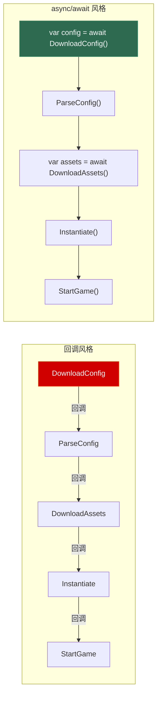
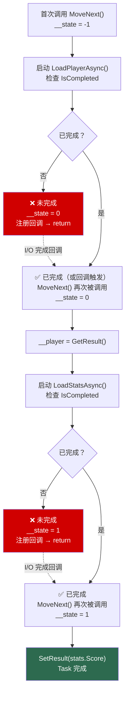
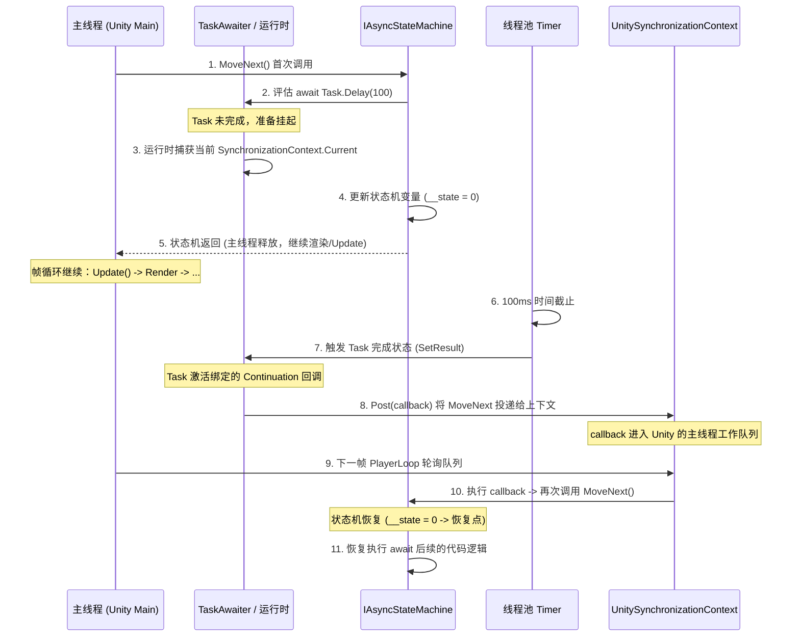

# 第七章 异步编程：Task 与 async/await

> **一句话理解**：`async/await` 不是多线程——它是让编译器帮你写回调的语法糖。`await` 之后代码在哪个线程执行，取决于你 await 之前的 SynchronizationContext。在 Unity 中搞错这个概念，你会看到"只能在主线程调用"的异常。

---

## 7.1 概念直觉 —— 从回调地狱到线性代码

```csharp
// 没有 async/await 的时代（C# 4 及之前）—— 回调地狱
void LoadGameData()
{
    ShowLoadingScreen();
    DownloadConfigAsync(config => {
        ParseConfig(config, parsedConfig => {
            DownloadAssetsAsync(parsedConfig.AssetList, assets => {
                InstantiateAssets(assets, () => {
                    HideLoadingScreen();
                    StartGame();
                });
            });
        });
    });
}

// async/await —— 同样的逻辑，线性写法
async Task LoadGameData()
{
    ShowLoadingScreen();
    var configJson = await DownloadConfigAsync();
    var config = ParseConfig(configJson);
    var assets = await DownloadAssetsAsync(config.AssetList);
    InstantiateAssets(assets);
    HideLoadingScreen();
    StartGame();
}
```



---

## 7.2 底层机制剖析

### 7.2.1 Task 状态机 —— 编译器如何改写你的代码

这是 async/await 面试中最硬核的问题。编译器把 `async` 方法改写为一个状态机结构体：

```csharp
// === 你写的 ===
async Task<int> FetchScoreAsync(string playerId)
{
    var player = await LoadPlayerAsync(playerId);   // 暂停点 1
    var stats = await LoadStatsAsync(player);         // 暂停点 2
    return stats.Score;
}

// === 编译器生成的（反编译简化） ===
[AsyncStateMachine(typeof(<FetchScoreAsync>d__0))]
Task<int> FetchScoreAsync(string playerId)
{
    var stateMachine = new <FetchScoreAsync>d__0();
    stateMachine.__this = this;
    stateMachine.playerId = playerId;
    stateMachine.__builder = AsyncTaskMethodBuilder<int>.Create();
    stateMachine.__state = -1;  // 初始状态
    stateMachine.__builder.Start(ref stateMachine);
    return stateMachine.__builder.Task;
}

struct <FetchScoreAsync>d__0 : IAsyncStateMachine
{
    public int __state;           // 状态机位置：-1=初始, 0=await1后, 1=await2后, -2=完成
    public AsyncTaskMethodBuilder<int> __builder;
    public string playerId;
    private Player __player;      // await 之间的局部变量变成字段！
    private Stats __stats;
    private TaskAwaiter<Player> __u1;  // 第一个 await 的等待器
    private TaskAwaiter<Stats> __u2;   // 第二个 await 的等待器
    
    public void MoveNext()
    {
        int result;
        try
        {
            switch (__state)
            {
                case 0:  // 从第一个 await 恢复
                    __state = -1;
                    __player = __u1.GetResult();       // 拿到 LoadPlayerAsync 的结果
                    __u2 = LoadStatsAsync(__player).GetAwaiter();  // 启动第二个异步操作
                    if (__u2.IsCompleted)
                        goto case 1;                   // 如果已完成，直接跳转
                    __state = 1;                       // 否则：标记状态，注册回调
                    __builder.AwaitUnsafeOnCompleted(ref __u2, ref this);
                    return;                            // 返回给调用方！
                    
                case 1:  // 从第二个 await 恢复
                    __state = -1;
                    __stats = __u2.GetResult();
                    result = __stats.Score;
                    break;
                    
                default:  // 首次进入
                    __u1 = LoadPlayerAsync(playerId).GetAwaiter();
                    if (__u1.IsCompleted)
                        goto case 0;
                    __state = 0;
                    __builder.AwaitUnsafeOnCompleted(ref __u1, ref this);
                    return;
            }
            __state = -2;
            __builder.SetResult(result);
        }
        catch (Exception ex)
        {
            __state = -2;
            __builder.SetException(ex);
        }
    }
}
```



> 💡 注意：状态机是一个 **struct**，不是 class。编译器尽量让它存活在栈上，只有真正需要挂起（await 未完成）时才会装箱到堆上。如果 await 的对象已经完成（`IsCompleted == true`），整个异步调用同步执行，零堆分配。

### 7.2.2 SynchronizationContext —— 谁来决定 await 之后在哪个线程

```csharp
// await 前后的线程由 SynchronizationContext.Current 决定
// 在 await 之前捕获 Current，在 await 之后通过它 Post 回原来的上下文

// 不同环境的 SynchronizationContext：
// 环境                   | SynchronizationContext.Current
// Console App            | null（默认线程池）
// WinForms / WPF         | WindowsFormsSynchronizationContext / DispatcherSynchronizationContext
//                         → Post 回到 UI 线程（Control.BeginInvoke / Dispatcher.BeginInvoke）
// ASP.NET Core           | null（无 SynchronizationContext）
// Unity                  | UnitySynchronizationContext
//                         → Post 回到主线程（通过 PlayerLoop 调度）

// 关键实验：
async Task TestContext()
{
    Console.WriteLine($"Before await: Thread {Thread.CurrentThread.ManagedThreadId}");
    // Unity: MainThread, WPF: UI Thread
    
    await Task.Delay(100);
    
    Console.WriteLine($"After await: Thread {Thread.CurrentThread.ManagedThreadId}");
    // 有 SynchronizationContext → 原线程
    // 没有 SynchronizationContext → 线程池线程（不一定是原来的）
}
```

```csharp
// SynchronizationContext 的 Post 机制
// Unity 的 SynchronizationContext 大致等价于：
class UnitySynchronizationContext : SynchronizationContext
{
    public override void Post(SendOrPostCallback callback, object state)
    {
        // 把回调放入主线程的执行队列
        // 主线程在每一帧的 PlayerLoop 中处理这个队列
        MainThreadActions.Enqueue(() => callback(state));
    }
}

// 所以 await Task.Delay(100) 在 Unity 中的完整流程：
// 1. 主线程执行到 await，发现 Task.Delay(100) 未完成
// 2. 状态机挂起，捕获 SynchronizationContext.Current (= UnitySyncCtx)
// 3. 主线程继续执行游戏的 Update()，渲染帧
// 4. 100ms 后，Timer 回调在线程池触发
// 5. Task.Delay 的 Task 完成 → 触发 continuation
// 6. continuation 通过 UnitySyncCtx.Post() 被调度到主线程
// 7. 主线程在下一帧执行 continuation → 从 await 之后继续
```



### 7.2.3 ConfigureAwait(false) —— 为什么在 Unity 中是致命的

```csharp
// ConfigureAwait(false) 的含义：
// "恢复时不要回到原来的 SynchronizationContext，随便用线程池线程就行"

// 在服务器/库代码中，ConfigureAwait(false) 是最佳实践：
async Task<string> ReadFileAsync(string path)
{
    using var stream = File.OpenRead(path);
    var buffer = new byte[stream.Length];
    await stream.ReadAsync(buffer, 0, buffer.Length).ConfigureAwait(false);
    // ↑ 不回到原来的 SynchronizationContext，减少调度开销
    return Encoding.UTF8.GetString(buffer);
}

// ⚠️ 但在 Unity 中，下面这段代码是致命的：
async void LoadScene()
{
    var data = await LoadAssetAsync("scene.json").ConfigureAwait(false);
    //                                                  ^^^^^^^^^^^^^^^^
    // 之后的代码在线程池线程上执行！
    
    // ❌ Unity API 只能在主线程调用！
    GameObject.Instantiate(data.Prefab);  // → 崩溃或未定义行为
    SceneManager.LoadScene(data.SceneName);  // → 崩溃
}

// ✅ Unity 中永远不要用 ConfigureAwait(false)，除非你确定后面不调用 Unity API
```

### 7.2.4 异步状态机是 struct —— 装箱的触发条件

```csharp
// 状态机是 struct，以下情况触发装箱：
async Task<int> GetValueAsync()
{
    await Task.Delay(100);   // 未完成 → 需要挂起
    // ↑ 此时状态机被装箱到堆上（因为需要被回调持有）
    return 42;
}

async Task<int> GetCachedAsync()
{
    return 42;  // 同步完成 → 零装箱
}

// 热路径优化：如果你的异步方法经常同步完成
async ValueTask<int> GetValueOptimizedAsync()
{
    if (TryGetCached(out var value))
        return value;          // 同步路径：零装箱，零 Task 分配
    
    return await FetchAsync();  // 异步路径：ValueTask 包装
}
// ValueTask 是一个 struct 包装的"可能异步"结果
// 同步完成时：直接包含结果值，不分配 Task
// 异步完成时：包装一个 Task
```

### 7.2.5 async void —— 永远不要在非事件处理器中使用

```csharp
// async void 的三个致命问题：
// 1. 调用方无法等待（没有 Task 可以 await）
// 2. 调用方无法捕获异常（异常直接抛到 SynchronizationContext 上，可能 crash 整个进程）
// 3. 无法知道何时完成（没有 Task 可以检查状态）

// ❌ 致命：
async void LoadScene()
{
    await LoadAssetsAsync();
    // 如果这里抛异常 → SynchronizationContext 直接收到 → 进程可能崩溃
}
LoadScene();  // 没有 Task 可以 await，不知道何时完成

// ✅ 正确：async Task
async Task LoadSceneAsync()
{
    await LoadAssetsAsync();
}
await LoadSceneAsync();  // 可以等待，可以 catch 异常

// ✅ async void 的唯一合法用途：UI 事件处理器
button.Click += async (sender, args) =>
{
    await LoadDataAsync();
    button.Text = "Done";
};
// 事件处理器的签名是 void，没办法返回 Task
```

### 7.2.6 CancellationToken —— 协作式取消

```csharp
// C# 的取消是"协作式"的——你请求取消，被取消的代码自己检查并响应
// 这不是 abort/terminate，不会强制终止线程

async Task LoadWithTimeout(string path, TimeSpan timeout)
{
    using var cts = new CancellationTokenSource(timeout);
    
    try
    {
        var data = await LoadAssetAsync(path, cts.Token);
        ProcessData(data);
    }
    catch (OperationCanceledException)
    {
        Console.WriteLine($"加载超时: {path}");
        // 清理半成品状态
    }
}

async Task<AssetData> LoadAssetAsync(string path, CancellationToken token)
{
    // 在每个可能长时间运行的操作前后检查取消
    token.ThrowIfCancellationRequested();
    
    var bytes = await File.ReadAllBytesAsync(path, token);
    // ↑ ReadAllBytesAsync 内部会检查 token
    
    token.ThrowIfCancellationRequested();
    return ParseAsset(bytes);
}
```

```csharp
// 将 CancellationToken 传递给所有异步操作
async Task ProcessBatchAsync(IEnumerable<string> paths, CancellationToken token)
{
    foreach (var path in paths)
    {
        token.ThrowIfCancellationRequested();
        await ProcessFileAsync(path, token);
    }
}

// CancellationTokenSource 的三种创建方式：
var cts1 = new CancellationTokenSource(TimeSpan.FromSeconds(5));  // 超时取消
var cts2 = new CancellationTokenSource();
cts2.Cancel();  // 手动取消

// 组合取消源（任一取消即取消）
using var linked = CancellationTokenSource.CreateLinkedTokenSource(userToken, timeoutToken);
```

### 7.2.7 IAsyncEnumerable —— C# 8.0 的异步流

```csharp
// 普通 IEnumerable 不适用于异步数据源
// IAsyncEnumerable 允许在每次 yield 之间 await

async IAsyncEnumerable<LogEntry> ReadLogsAsync(string filePath)
{
    using var reader = new StreamReader(filePath);
    while (!reader.EndOfStream)
    {
        var line = await reader.ReadLineAsync();  // 每次读取都是异步的
        yield return ParseLogEntry(line);          // 产出一条，不等待全部读完
    }
}

// 消费：await foreach
await foreach (var entry in ReadLogsAsync("server.log"))
{
    if (entry.Level == LogLevel.Error)
        Console.WriteLine(entry.Message);
    if (entry.Timestamp > cutoff)
        break;  // 提前终止 —— 后续行不会被读取
}

// 支持 CancellationToken
await foreach (var entry in ReadLogsAsync("server.log").WithCancellation(token))
{
    // ...
}
```

---

## 7.3 经典陷阱

### 7.3.1 async void 异常吞噬

```csharp
// ❌ 这段代码的异常你永远 catch 不到
try
{
    FireAndForget();  // async void！
}
catch (Exception)
{
    // 永远不会执行！async void 的异常不进入这个 catch
}

async void FireAndForget()
{
    await Task.Delay(100);
    throw new InvalidOperationException("Boom!");
    // 异常被 Post 到 SynchronizationContext → 在 Unity 中可能静默丢失
}
```

### 7.3.2 Task.Wait() 和 Task.Result 的死锁

```csharp
// ❌ 在有 SynchronizationContext 的环境中（WPF、Unity Editor），这会死锁
Task<int> task = FetchDataAsync();
int result = task.Result;  // 死锁！
// 
// 死锁过程：
// 1. main 线程调用 task.Result → 阻塞等待 task 完成
// 2. FetchDataAsync 内部 await 完成后，需要 Post 到 main 线程继续执行
// 3. 但 main 线程在等 task 完成，不会处理 Post 的 continuation
// → 互相等待，死锁

// ✅ 方案一：一路 async 到底
int result = await FetchDataAsync();

// ✅ 方案二：确定不需要回到原上下文
int result = FetchDataAsync().GetAwaiter().GetResult();
// 仍然阻塞，但不会死锁？不，还是会死锁！
// 正确做法：在调用链内部用 ConfigureAwait(false)
```

### 7.3.3 忘记 await 导致异常被吞

```csharp
// ❌ 编译器只给一个警告，异常无声无息
void Update()
{
    LoadAsync();  // ⚠️ CS4014: 因为没有 await，异步调用不会等待
    // LoadAsync 内部的异常会被静默丢弃（Task 被 GC 时 finalized）
}

// ✅ 如果确实不需要等待，至少要处理异常
async void Update()
{
    try
    {
        await LoadAsync();
    }
    catch (Exception ex)
    {
        Debug.LogError(ex);
    }
}
```

### 7.3.4 Parallel.ForEach 中的 async

```csharp
// ❌ Parallel.ForEach 不理解 async —— 它只等 Action 返回就以为完成了
Parallel.ForEach(urls, async url => {
    var data = await DownloadAsync(url);
    Process(data);
});
// Parallel.ForEach 在 await 返回 Task 时就认为"完成了"！
// 实际数据可能还没下载完

// ✅ 真并行异步：用 Task.WhenAll
var tasks = urls.Select(async url => {
    var data = await DownloadAsync(url);
    Process(data);
});
await Task.WhenAll(tasks);
```

---

## 7.4 游戏实战场景

### 7.4.1 Unity 场景异步加载

```csharp
// Unity 中的场景异步加载
async Task LoadGameSceneAsync()
{
    // 显示加载界面
    loadingScreen.Show();
    
    // 异步加载场景（Unity 的 AsyncOperation 支持 await）
    var asyncLoad = SceneManager.LoadSceneAsync("GameLevel");
    asyncLoad.allowSceneActivation = false;  // 等待准备完成
    
    // 同时预加载资源
    var assetsTask = PreloadAssetsAsync();
    
    // 等待场景加载到 90%
    while (asyncLoad.progress < 0.9f)
    {
        loadingScreen.SetProgress(asyncLoad.progress);
        await Task.Yield();  // 让出这一帧，下一帧继续
    }
    
    // 等待资源加载完成
    await assetsTask;
    
    // 一切就绪，激活场景
    asyncLoad.allowSceneActivation = true;
    loadingScreen.Hide();
}
```

### 7.4.2 网络通信的超时与取消

```csharp
// 游戏中的网络请求：连接超时 + 用户取消
async Task<ServerList> FetchServerListAsync(CancellationToken userCancel)
{
    using var timeoutCts = new CancellationTokenSource(TimeSpan.FromSeconds(10));
    using var linkedCts = CancellationTokenSource.CreateLinkedTokenSource(
        userCancel, timeoutCts.Token);
    
    try
    {
        using var client = new HttpClient();
        var response = await client.GetStringAsync(ServerListUrl, linkedCts.Token);
        return JsonSerializer.Deserialize<ServerList>(response);
    }
    catch (OperationCanceledException) when (timeoutCts.IsCancellationRequested)
    {
        // 超时：提示用户检查网络
        return ServerList.Empty;
    }
    catch (OperationCanceledException)
    {
        // 用户取消：静默返回
        return null;
    }
}
```

### 7.4.3 异步资源预热

```csharp
// 游戏启动时并行加载所有必需资源
async Task WarmupAsync()
{
    var tasks = new List<Task>
    {
        LoadTextureCacheAsync(),
        LoadAudioBankAsync("common.sound"),
        LoadConfigTablesAsync(),
        PrecompileShadersAsync()
    };
    
    // 等待所有任务完成（任一失败则全部取消）
    try
    {
        await Task.WhenAll(tasks);
        Debug.Log("预热完成");
    }
    catch (Exception ex)
    {
        Debug.LogError($"预热失败: {ex.Message}");
        // 优雅降级：用默认资源启动
    }
}
```

---

## 7.5 30 秒速答

**Q：async/await 的底层实现是什么？**

> 编译器将 async 方法改写为一个实现 `IAsyncStateMachine` 的结构体（struct）。每个 `await` 对应 `MoveNext()` 中的一个状态（`case`），await 之间的局部变量提升为结构体字段。未完成时注册回调并返回，完成后通过回调或直接触发下一个 `MoveNext()`。struct 设计允许同步完成时零堆分配。

**Q：SynchronizationContext 决定什么？**

> 决定 `await` 之后代码在哪个线程恢复执行。WinForms/WPF 的 SynchronizationContext 把 continuation Post 回 UI 线程，Unity 的把 continuation Post 回主线程。控制台程序和 ASP.NET Core 没有 SynchronizationContext，continuation 在线程池上执行。

**Q：为什么 Unity 中不能用 ConfigureAwait(false)？**

> `ConfigureAwait(false)` 让 continuation 不回到原来的 SynchronizationContext。Unity API（`GameObject`、`Transform`、`SceneManager` 等）只能在主线程调用。如果 continuation 在线程池线程上执行并调用了 Unity API → 崩溃。Unity 中永远不要用 `ConfigureAwait(false)`。

**Q：async void 和 async Task 的区别？**

> `async Task` 返回一个可等待的 Task 对象，调用方可以 `await`、可以 `catch` 异常、可以知道何时完成。`async void` 不返回任何东西，异常直接抛到 SynchronizationContext 上（可能导致进程崩溃），调用方完全无法控制。`async void` 只应用在 UI 事件处理器中。

**Q：Task.WhenAll 和 Task.WaitAll 的区别？**

> `Task.WhenAll` 返回一个 Task，本身是异步的，不阻塞线程。`Task.WaitAll` 同步阻塞当前线程直到所有任务完成。在有 SynchronizationContext 的环境中，`WaitAll` 可能导致死锁（任务完成后的 continuation 需要回到原线程，但原线程被 WaitAll 阻塞了）。

---

> 📖 上一章：[第六章 LINQ 与迭代器](../06_linq_and_lambda) —— 迭代器状态机、延迟执行、表达式树。

> 📖 下一章：[第八章 模式匹配与现代 C#](../08_pattern_matching_modern_csharp) —— is/switch 演进、records、Source Generator 入门。
