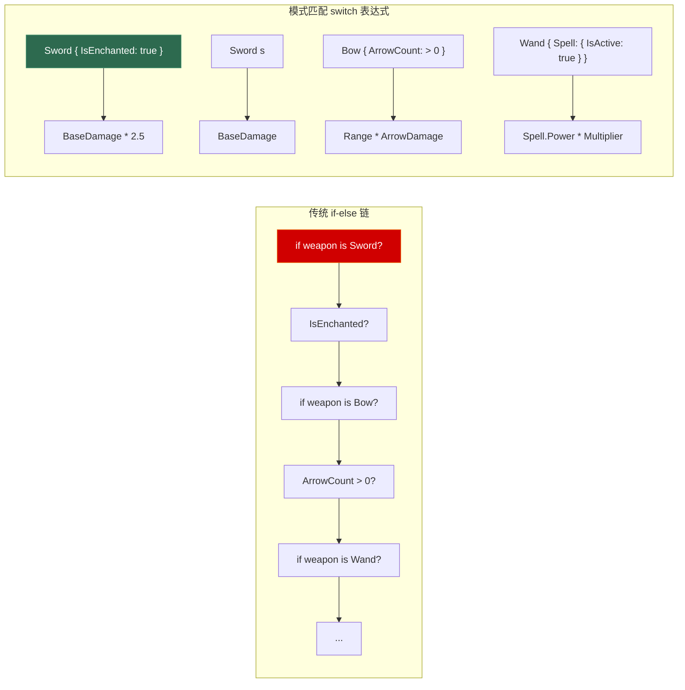
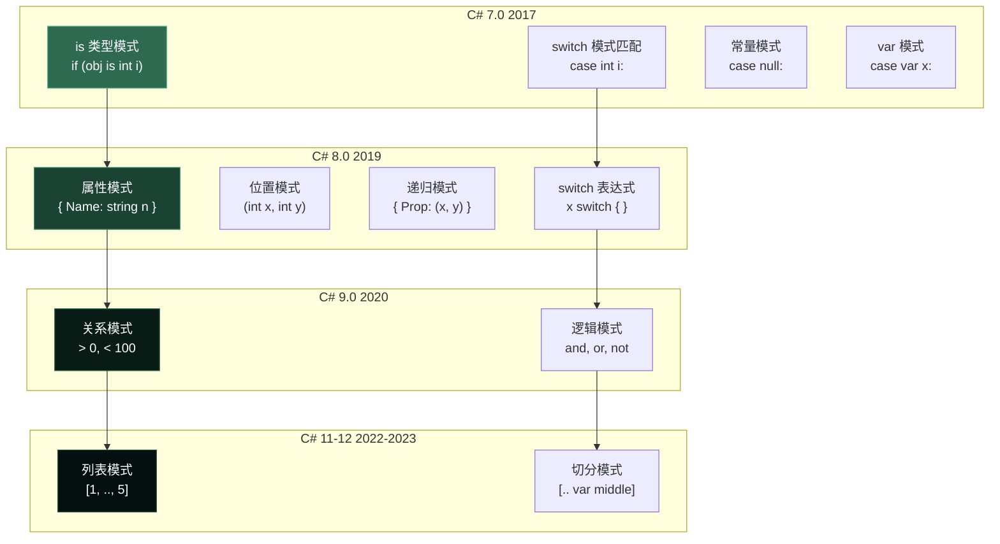
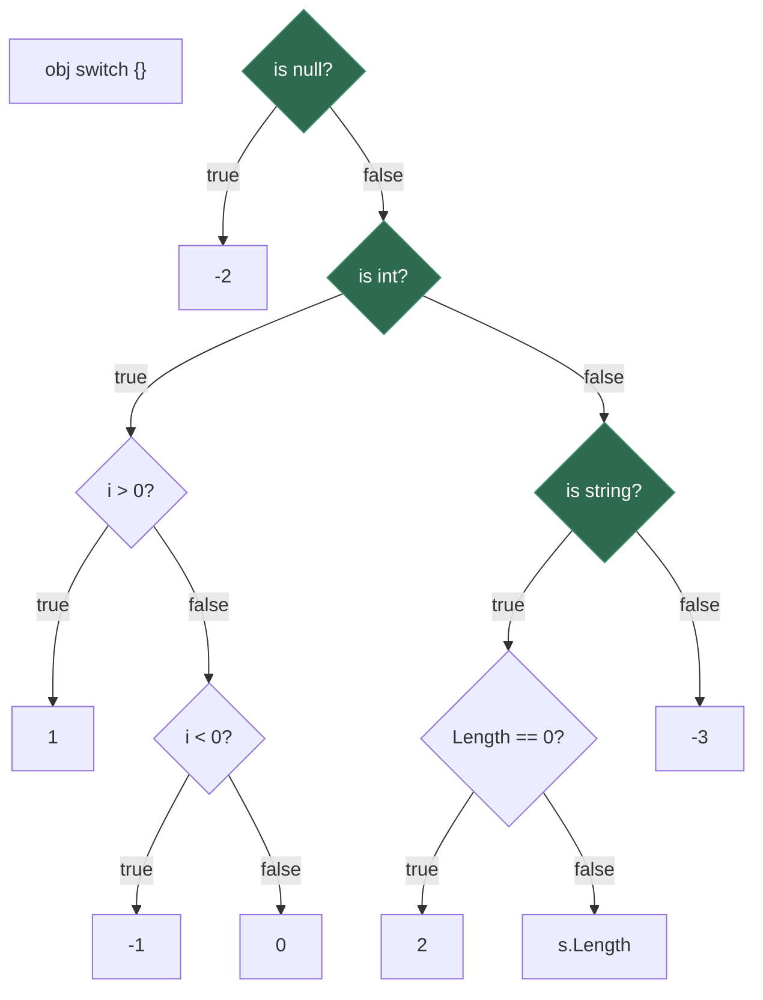
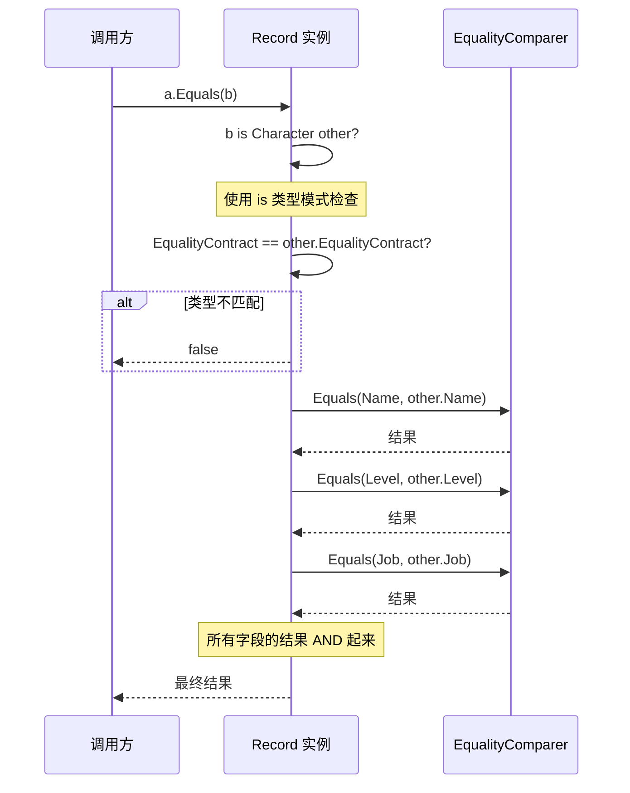
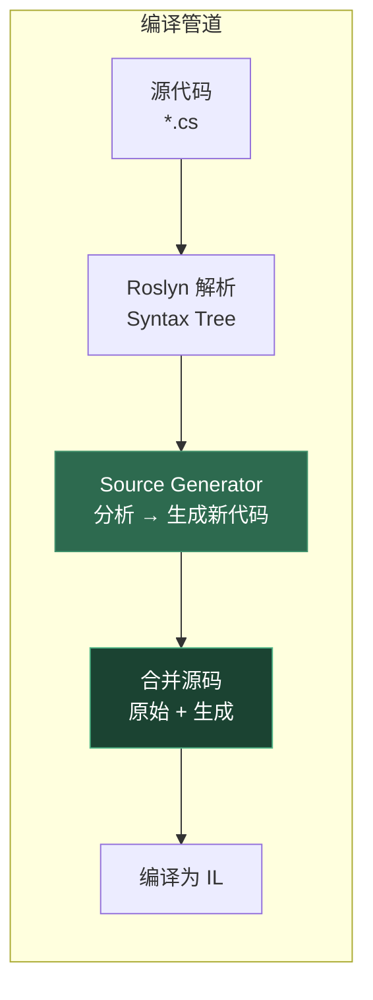

# 第八章 模式匹配与现代 C#

> **一句话理解**：模式匹配不是花哨的语法糖——它是编译器帮你把"如果是这个形状就做这个"的判断树，展开为最高效的一连串 IL 指令。`record` 则把"不可变数据 + 值相等"这个在 C++ 中需要手写数百行代码的模式，变成一行声明。

---

## 8.1 概念直觉 —— 从 if-else 堆砌到声明式形状匹配

先看一段没有模式匹配的代码：

```csharp
// C# 6 及之前 —— 你不得不这样写
double ComputeDamage(object weapon)
{
    if (weapon == null)
        throw new ArgumentNullException(nameof(weapon));
    
    var sword = weapon as Sword;
    if (sword != null && sword.IsEnchanted)
        return sword.BaseDamage * 2.5;
    else if (sword != null)
        return sword.BaseDamage;
    
    var bow = weapon as Bow;
    if (bow != null && bow.ArrowCount > 0)
        return bow.Range * bow.ArrowDamage;
    else if (bow != null)
        return 0;
    
    var wand = weapon as Wand;
    if (wand != null)
    {
        if (wand.Spell != null && wand.Spell.IsActive)
            return wand.Spell.Power * wand.MagicMultiplier;
    }
    
    throw new ArgumentException("未知武器类型");
}
```

```csharp
// C# 12 —— 模式匹配让逻辑一目了然
double ComputeDamage(object weapon) => weapon switch
{
    null           => throw new ArgumentNullException(nameof(weapon)),
    Sword { IsEnchanted: true } s => s.BaseDamage * 2.5,
    Sword s                         => s.BaseDamage,
    Bow { ArrowCount: > 0 } b       => b.Range * b.ArrowDamage,
    Bow                              => 0,
    Wand { Spell: { IsActive: true } spell } w
                                     => spell.Power * w.MagicMultiplier,
    Wand                              => 0,
    _                                => throw new ArgumentException("未知武器类型")
};
```



**核心直觉**：模式匹配让你描述"数据像什么形状"，而不是描述"如何检查数据"。编译器负责把"形状描述"翻译成最优的检查序列。

---

## 8.2 模式匹配全谱系

模式匹配从 C# 7.0 一路演进到 C# 12，已经形成了一个完整的"模式家族"：



### 8.2.1 类型模式与声明模式

最基础的模式——检查类型并提取变量：

```csharp
// 类型模式：is 后面跟类型名 + 变量声明
if (obj is string s)               // obj 是 string？顺便声明变量 s
    Console.WriteLine(s.Length);

// 声明模式：相当于"总是匹配"的 var
if (obj is var anything)           // 总是 true，anything = obj
    Console.WriteLine(anything);

// switch 语句中使用
switch (obj)
{
    case int i:
        Console.WriteLine($"整数: {i}");
        break;
    case string s when s.Length > 0:   // when 子句：附加条件
        Console.WriteLine($"非空字符串: {s}");
        break;
    case string s:
        Console.WriteLine("空字符串");
        break;
    case null:
        Console.WriteLine("null");
        break;
    default:
        Console.WriteLine("其他类型");
        break;
}
```

### 8.2.2 属性模式

直接匹配对象的属性值——不需要先类型判断再属性访问：

```csharp
// 装备系统的属性模式
string GetWeaponLabel(Weapon w) => w switch
{
    Sword { Rarity: Rarity.Legendary, Element: Element.Fire } => "🔥 传说火焰剑",
    Sword { Rarity: Rarity.Legendary }                       => "⚔️ 传说剑",
    Sword { Damage: >= 100 }                                 => "⚔️ 高阶剑",
    Bow { Range: > 50, ArrowCount: > 10 }                     => "🏹 远程重弓",
    { IsBroken: true }                                       => "💔 损坏的武器",
    _                                                         => "普通装备"
};

// 嵌套属性模式 —— 递归匹配属性的属性
if (player is { CurrentWeapon: { Element: Element.Fire, IsEnchanted: true } })
    Console.WriteLine("玩家持有附魔火焰武器");
```

### 8.2.3 位置模式

依赖 `Deconstruct` 方法，把对象拆成元组进行匹配：

```csharp
// 定义一个可解构的 Vec3
record Vec3(float X, float Y, float Z);

string ClassifyVector(Vec3 v) => v switch
{
    (0, 0, 0)                => "零向量",
    ( > 0, 0, 0)             => "X 轴正向",
    (0, > 0, 0)             => "Y 轴正向",
    (0, 0, < 0)             => "Z 轴负向",
    (var x, var y, var z)    => $"任意向量 ({x}, {y}, {z})"
};

// 配合关系模式使用
string DescribeHP(float hp) => hp switch
{
    <= 0     => "已死亡",
    < 0.25f  => "濒危",
    < 0.50f  => "重伤",
    < 0.75f  => "轻伤",
    >= 1.0f  => "满血",
    _         => "正常"
};
```

### 8.2.4 逻辑模式：and / or / not

组合多个模式，替代 `when` 子句的很多场景：

```csharp
// 逻辑模式让组合判断更简洁
string ClassifyPoint(int x, int y) => (x, y) switch
{
    (0, 0)              => "原点",
    (0, not 0)          => "Y 轴",
    (not 0, 0)          => "X 轴",
    ( > 0 and > 0)      => "第一象限",
    ( < 0 and > 0)      => "第二象限",
    ( < 0 and < 0)      => "第三象限",
    ( > 0 and < 0)      => "第四象限",
};

// not 模式在 null 检查中极其常用
if (obj is not null)
    Console.WriteLine(obj.ToString());

// 等价于 old-style:
// if (obj != null) —— 但当 obj 重载了 != 时，is not null 是纯引用检查
```

### 8.2.5 列表模式

C# 11 引入，直接匹配集合内容——游戏中最有用的场景是命令解析：

```csharp
// 游戏控制台命令解析
string ExecuteCommand(params string[] args) => args switch
{
    ["help"]                                       => "显示帮助",
    ["move", var direction]                        => $"向 {direction} 移动",
    ["attack", var target, var skill]              => $"用 {skill} 攻击 {target}",
    ["trade", "buy", var item, var count]          => $"购买 {count} 个 {item}",
    ["trade", "sell", var item]                    => $"出售 {item}",
    ["save"]                                       => "存档完成",
    ["load", .. var slots]                         => $"加载存档: {string.Join(", ", slots)}",
    []                                             => "请输入命令",
    _                                               => "未知命令"
};

// 切分模式：匹配任意长度的中间部分
int[] numbers = { 1, 2, 3, 4, 5 };
string result = numbers switch
{
    [1, .. var middle, 5] => $"中间是 [{string.Join(", ", middle)}]",  // [2, 3, 4]
    [1, ..]                => "以1开头",
    [.., 5]                => "以5结尾",
    _                      => "不匹配"
};
```

### 8.2.6 switch 表达式 vs switch 语句

```csharp
// switch 语句（C# 1-6）—— 需要 break，可以多行语句
string grade;
switch (score)
{
    case >= 90:
        grade = "A";
        break;
    case >= 80:
        grade = "B";
        break;
    case >= 70:
        grade = "C";
        break;
    default:
        grade = "F";
        break;
}

// switch 表达式（C# 8）—— 返回值的表达式，无需 break
string grade = score switch
{
    >= 90 => "A",
    >= 80 => "B",
    >= 70 => "C",
    _     => "F"
};
```

**编译器差异**：switch 表达式的 `_` 是丢弃模式（匹配所有），比 `default` 更彻底——它不要求穷举性检查但编译器会尽可能做穷举性分析。

---

## 8.3 底层机制 —— 编译器如何展开模式匹配

### 8.3.1 `is` 类型模式的 IL 展开

```csharp
// C# 源码
object obj = "hello";
if (obj is string s && s.Length > 3)
    Console.WriteLine(s);

// 编译器生成的等效代码
// IL 层面：isinst string + brfalse + stloc
// 伪代码恢复：
string s;
if (obj is string)           // L_0006: isinst string → L_000B: brfalse
{
    s = (string)obj;         // L_0010: stloc.0
    if (s.Length > 3)        // L_0011: callvirt get_Length → L_0016: ldc.i4.3 → ble
    {
        Console.WriteLine(s);
    }
}
```

一个关键优化：**`is` 表达式做类型检查 + `as` 转换时，IL 层面只做一次 `isinst` 指令，不会重复检查**——编译器自动合并了类型测试和转换。

### 8.3.2 switch 表达式的编译策略

C# 编译器对 switch 表达式采用**决策树优化**而非简单的线性测试：

```csharp
// 源码
int Classify(object obj) => obj switch
{
    int i when i > 0    => 1,
    int i when i < 0    => -1,
    int i               => 0,
    string { Length: 0 } => 2,
    string s            => s.Length,
    null                => -2,
    _                   => -3,
};
```

编译器首先按类型分桶，再对同一类型的模式进行优化排序：



**决策树的三条规则**：
1. **类型测试优先**：先按类型分桶，避免对 string 做 int 相关检查
2. **常量折叠**：同一类型的常量匹配可以被优化为跳转表
3. **`when` 子句**：总是在类型匹配成功后、结果赋值前执行——它是"第二道门槛"

### 8.3.3 属性模式的编译

属性模式展开为对属性访问 + 比较的链式调用。嵌套属性模式会产生级联的 `brtrue`/`brfalse`：

```csharp
// player is { Weapon: { IsBroken: false, Damage: > 10 } }
// 编译器生成（伪代码）：
var t1 = player.Weapon;
if (t1 != null && !t1.IsBroken && t1.Damage > 10)
    // 匹配成功
```

编译器会利用**短路求值**：一旦某个属性检查失败，后续属性不再访问。所以属性顺序即为检查顺序。

---

## 8.4 Record —— 不可变数据的终极武器

### 8.4.1 什么是 Record

`record` 是 C# 9.0 引入的类型声明方式。一句话：**record 是用值相等语义比较的不可变引用类型**。

```csharp
// === 传统的 class ===
public class CharacterClass
{
    public string Name { get; init; }    // init 让属性只能在初始化时赋值
    public int Level { get; init; }
    public string Job { get; init; }
    
    public override bool Equals(object obj) => /* 你得手写 */ ;
    public override int GetHashCode() => /* 也得手写 */ ;
    public override string ToString() => $"Character {{ Name = {Name}, ... }}";
}

// === record：一行搞定上面所有 ===
public record Character(string Name, int Level, string Job);
```

自动生成的内容：

```csharp
// 当你写 public record Character(string Name, int Level, string Job);
// 编译器三秒内为你生成以下所有代码：

// 1. 属性（init-only）
public string Name { get; init; }
public int Level { get; init; }
public string Job { get; init; }

// 2. 构造函数 + Deconstruct
public Character(string Name, int Level, string Job) { /* ... */ }
public void Deconstruct(out string Name, out int Level, out string Job) { /* ... */ }

// 3. 值相等比较
protected virtual Type EqualityContract => typeof(Character);
public override bool Equals(object obj) => obj is Character other
    && EqualityContract == other.EqualityContract
    && EqualityComparer<string>.Default.Equals(Name, other.Name)
    && EqualityComparer<int>.Default.Equals(Level, other.Level)
    && EqualityComparer<string>.Default.Equals(Job, other.Job);

public override int GetHashCode() => HashCode.Combine(Name, Level, Job);

// 4. ToString
public override string ToString() => $"Character {{ Name = {Name}, Level = {Level}, Job = {Job} }}";

// 5. <Clone>$ 方法（供 with 表达式调用）
public virtual Character <Clone>$() => new Character(this);
protected Character(Character original) { Name = original.Name; ... }
```

### 8.4.2 值相等 vs 引用相等

```csharp
var a = new Character("Warrior", 50, "Knight");
var b = new Character("Warrior", 50, "Knight");

Console.WriteLine(a == b);           // class:  false（引用不同）
                                      // record: true（值相同！）

Console.WriteLine(a.Equals(b));      // class:  false（除非重写）
                                      // record: true（编译器已生成）

// 但引用仍然不同！
Console.WriteLine(ReferenceEquals(a, b));  // false
```



### 8.4.3 `with` 表达式 —— 非破坏性修改

`with` 表达式的底层机制：

```csharp
var warrior = new Character("Warrior", 50, "Knight");

// with 表达式创建副本并只修改指定属性
var elite = warrior with { Level = 60 };

// 编译器展开：
// var elite = warrior.<Clone$>();
// elite.Level = 60;

Console.WriteLine(warrior.Level);  // 50 —— 原对象不变！
Console.WriteLine(elite.Level);    // 60
Console.WriteLine(elite.Name);     // "Warrior" —— 其他属性来自副本
```

`with` 背后的 `Copy constructor` + `init` 访问器：

```csharp
// 编译器为 record 生成受保护的拷贝构造函数
protected Character(Character original)
{
    Name = original.Name;
    Level = original.Level;
    Job = original.Job;
}

// <Clone$> 方法调用它
public virtual Character <Clone>$() => new Character(this);

// with 表达式 = <Clone$>() + init 属性赋值
// elite = warrior.<Clone$>(); 然后 elite.Level = 60;
```

### 8.4.4 Record 的继承

```csharp
public record Person(string FirstName, string LastName);
public record Employee(string FirstName, string LastName, string Department)
    : Person(FirstName, LastName);

// 值相等继承行为
Person p = new Employee("John", "Doe", "Engineering");
Person p2 = new Person("John", "Doe");
Console.WriteLine(p == p2);  // false —— 因为 EqualityContract 不同！
// Employee 的 EqualityContract 是 typeof(Employee)
// Person 的 EqualityContract 是 typeof(Person)
// 即使所有公共值相同，类型不同则不相等
```

**关键陷阱**：record 的值相等于会检查 `EqualityContract`，这意味着派生 record 永远不会等于基类 record，即使所有共同属性的值相同。

### 8.4.5 record struct

C# 10 引入了 `record struct`（值类型 record）和 `readonly record struct`：

```csharp
// record class（引用类型，C# 9）
public record class MyRecord(string Name);  // class 可省略

// record struct（值类型，C# 10）
public record struct Point3D(float X, float Y, float Z);

// readonly record struct（不可变值类型，C# 10）
public readonly record struct Color(byte R, byte G, byte B, byte A);
```

| 特性 | record class | record struct | readonly record struct |
|------|-------------|---------------|----------------------|
| 分配位置 | 堆 | 栈（尽量） | 栈（尽量） |
| 值相等 | ✓ | ✓ | ✓ |
| with 表达式 | ✓ (浅克隆) | ✓ (完整副本) | ✓ (完整副本) |
| 不可变性 | 默认（init 属性） | 可选 | 强制 |
| ToString 生成 | ✓ | ✓ | ✓ |

**Unity 实践**：在 IL2CPP 环境下，`record struct` 比 `record class` 更受欢迎——避免 GC 分配。

---

## 8.5 Source Generator —— 编译时代码生成

### 8.5.1 什么是 Source Generator

Source Generator 是 C# 9 / Roslyn 4.0 引入的编译期代码生成技术。与运行时反射不同，它在编译阶段分析代码并生成新源码，注入到编译管道中。



### 8.5.2 最简单的 Generator 示例

```csharp
// 你的源码中标注 [AutoToString]
[AttributeUsage(AttributeTargets.Class)]
public class AutoToStringAttribute : Attribute { }

// Source Generator 在编译时生成：
[Generator]
public class AutoToStringGenerator : ISourceGenerator
{
    public void Initialize(GeneratorInitializationContext context)
    {
        // 注册语法接收器
        context.RegisterForSyntaxNotifications(() => new AttributeSyntaxReceiver());
    }
    
    public void Execute(GeneratorExecutionContext context)
    {
        // 对每个标记了 [AutoToString] 的类，生成 ToString() 重写
        foreach (var classSymbol in GetMarkedClasses(context))
        {
            var source = GenerateToString(classSymbol);
            context.AddSource($"{classSymbol.Name}.ToString.g.cs", source);
        }
    }
}
```

### 8.5.3 Source Generator vs 其他方案

| 方案 | 时机 | 产物可见 | 性能影响 | 适用场景 |
|------|------|---------|---------|---------|
| **Source Generator** | 编译期 | 源码，可调试 | 零运行时开销 | 序列化、DTO映射、模式检测 |
| **反射** | 运行时 | 元数据查询 | JIT编译 + 缓存开销 | 动态配置、插件加载 |
| **IL Weaving** | 后编译 | 修改 IL，不可见 | 零运行时开销 | AOP、性能插桩 |
| **T4 模板** | 预编译 | 生成源码文件 | 零运行时开销 | 批量代码生成 |

**游戏开发中的 Source Generator 典型场景**：
- 自动生成网络协议序列化/反序列化代码
- 自动生成 GameObject 查找代理（替代 GetComponent 字符串查找）
- 自动为标记了 `[AutoSave]` 的字段生成 PlayerPrefs 存取代码
- 自动生成 IL2CPP 兼容的泛型约束代码

---

## 8.6 C# 现代特性速览

### 8.6.1 Init-Only 属性

已在 [第三章](03_oop_csharp.md#properties) 详述——`init` 访问器让属性只能在对象初始化器中赋值：

```csharp
var config = new GameConfig { MaxPlayers = 64 };
// config.MaxPlayers = 128;  // 编译错误！init 属性不可修改

// 与 record 的关系：record 的位置参数自动变成 init 属性
record GameConfig(int MaxPlayers, float TickRate);
// 等价于：
// class GameConfig { public int MaxPlayers { get; init; } public float TickRate { get; init; } }
```

### 8.6.2 Primary Constructors

C# 12 引入——给 class/struct 添加主构造函数：

```csharp
// C# 12 之前
public class GameTimer
{
    private readonly float _duration;
    private readonly Action _onComplete;
    private float _elapsed;
    
    public GameTimer(float duration, Action onComplete)
    {
        _duration = duration;
        _onComplete = onComplete;
        _elapsed = 0;
    }
}

// C# 12：Primary Constructor（class 版）
public class GameTimer(float duration, Action onComplete)
{
    private float _elapsed;
    
    public void Tick(float delta)
    {
        _elapsed += delta;
        if (_elapsed >= duration)
            onComplete();
            // duration 和 onComplete 在整个类体内可用
    }
}
```

**注意**：class 的 primary constructor 参数**不是自动属性**——它们是"构造参数"而非字段。如果需要存储，必须手动赋值。这和 record 不同——record 的主构造参数自动生成属性。这就是 class 和 record 的一个核心区别：record 是为数据服务，class 是为行为服务。

### 8.6.3 文件级命名空间与全局 using

```csharp
// C# 10 文件级命名空间 —— 省掉一级大括号和缩进
namespace MyGame.Combat;
// 之后所有代码自动在此命名空间内

// 全局 using —— 放在任何 .cs 文件（通常是 GlobalUsings.cs）
global using System;
global using System.Collections.Generic;
global using UnityEngine;
```

### 8.6.4 集合表达式

C# 12 引入的简洁初始化语法：

```csharp
// C# 12 之前
int[] numbers = new int[] { 1, 2, 3, 4, 5 };
List<string> names = new List<string> { "Alice", "Bob" };
Span<int> span = stackalloc int[] { 1, 2, 3 };

// C# 12 集合表达式 —— 统一语法
int[] numbers = [1, 2, 3, 4, 5];
List<string> names = ["Alice", "Bob"];
Span<int> span = [1, 2, 3];

// 更强大的：混合展开
int[] base = [1, 2, 3];
int[] extended = [..base, 4, 5];  // [1, 2, 3, 4, 5]
```

---

## 8.7 C++ 程序员对照

| 概念 | C# | C++ | 关键差异 |
|------|-----|-----|---------|
| 模式匹配 | 原生语法 `x switch { }` | C++17 `std::variant` + `visit` | C# 的模式是语言级特性，IL 层面被优化；C++ 是库级模式 |
| 结构化绑定 | 位置模式 + Deconstruct | C++17 `auto [x, y] = point;` | C# 需要显式定义 Deconstruct 方法；C++ 自动按成员顺序绑定 |
| 不可变数据 | `record` | `const` 对象 + 手写复制 | C# 的 record + with 是语言级不可变支持；C++ 需要手动实现 |
| 编译期生成 | Source Generator | 模板 + constexpr + 宏 | Generator 是真正的编译期代码生成；C++ 模板更强大但更复杂 |
| init 访问器 | `get; init;` | `const` 成员 + 构造函数 | C# 的 init 只在初始化时允许赋值，语义更精确 |
| `is not null` | 纯引用检查 | 无对应（`!= nullptr`） | C# 的 `is not null` 绕过重载的 `!=` 运算符，C++ 无此问题 |

---

## 8.8 常见陷阱与面试题

### 陷阱 1：switch 表达式的穷举性

```csharp
// 编译警告：switch 表达式未处理所有输入
string GetName(int id) => id switch
{
    1 => "One",
    2 => "Two",
    // 缺少 _ 丢弃模式！
};

// 正确：始终加 _ 或穷举所有可能值
string GetName(int id) => id switch
{
    1 => "One",
    2 => "Two",
    _ => "Unknown"
};

// 但 bool/enum 等有限类型，编译器能做穷举检查
// 如果 enum 只有 A, B, C 三个值，switch 表达式覆盖了 A, B, C 就不需要 _
```

### 陷阱 2：record 的 `==` 不是引用相等

```csharp
var dict = new Dictionary<Character, string>();
var key1 = new Character("Mage", 30, "Wizard");
dict[key1] = "Elite";
var key2 = new Character("Mage", 30, "Wizard");

Console.WriteLine(dict.ContainsKey(key2));  // true —— 值相等！
Console.WriteLine(dict[key2]);              // "Elite" —— 用 key2 能取到

// 但如果 Character 是 class 而非 record，ContainsKey 返回 false
```

### 陷阱 3：`with` 只做浅拷贝

```csharp
record InventoryItem(string Name, List<string> Tags);

var original = new InventoryItem("Sword", new List<string> { "Weapon", "Steel" });
var copy = original with { Name = "Excalibur" };

copy.Tags.Add("Legendary");
Console.WriteLine(original.Tags.Contains("Legendary"));  // true —— Tags 是同一个 List！

// with 只复制引用，不复制引用的对象
// 如需深拷贝，必须手动处理引用类型属性
```

### 陷阱 4：Positional Record 参数 vs Primary Constructor 参数

```csharp
// record：参数自动变属性
public record Player(string Name, int HP);
// 等价于：
// public record Player { public string Name { get; init; } public int HP { get; init; } }

// class with primary constructor：参数不是属性
public class PlayerClass(string Name, int HP);
// Name 和 HP 只是构造参数，不能从外部访问！必须手动声明属性和赋值

// 混淆二者的行为是常见错误
```

### 陷阱 5：`is` 类型检查后 C# 不保证变量非空

```csharp
// 危险模式
object obj = GetSomething();
if (obj is IDisposable d)
{
    d?.Dispose();  // d 已证非 null，不需要 ?.
    d.Dispose();   // 这样写即可
}

// 但是！
string? nullableStr = GetMaybeNull();
if (nullableStr is string s)  // 即使 nullableStr 声明为 string?，
                              // 进入分支后 s 被证明非空
    Console.WriteLine(s.Length); // 不需要 s?.Length
```

### 面试题精选

**Q1：`record` 的 `Equals` 实现中为什么检查 `EqualityContract`？**

答：防止派生 record 等于基类 record。例如 `Employee("John", "Doe", "Eng")` 不应该等于 `Person("John", "Doe")`，因为类型不同。`EqualityContract` 就是这个类型标识。另外这也防止了违反对称性的情况——如果 Employee 重写了 Equals 但 Person 没识别到（或反之）。

**Q2：`switch { _ => ... }` 和 `switch { ... default => ... }` 有什么区别？**

答：在 switch 表达式中等效。在 switch 语句中，`case _:` 匹配所有值（丢弃模式），而 `default:` 是未匹配时才执行。差异在于编译器分析——`_` 优先级高于 `default`，且 `_` 可以被覆盖（如果后续有更具体的模式），`default` 在 switch 语句中永远最后。

**Q3：Source Generator 可以修改已有代码吗？**

答：不能。Generator 只能**添加**新源码，不能修改或删除现有代码。这是设计约束——保证编译的确定性。如果需要修改 IL，得用 IL Weaver（如 Fody）。

**Q4：`record struct` 和 `struct` 有什么区别？**

答：`record struct` 自动生成值相等比较、ToString()、Deconstruct() 和 with 表达式支持。普通 struct 默认使用反射来做 Equals（装箱 + 慢），`record struct` 的 Equals 是编译期生成的高效实现。但如果 struct 包含引用类型字段，二者的 Equals 行为相同（都调用 EqualityComparer<T>.Default）。

**Q5：列表模式 `[1, .. var mid, 5]` 在 IL 层面展开成什么？**

答：编译器生成对集合的 Length 检查 + 索引访问。对于数组：直接检查 `Length >= 2`，然后 `arr[0] == 1`、`arr[Length-1] == 5`，中间切片用 `AsSpan(1, Length-2)` 返回。对于 `Span<T>`：同样高效。但对于 `List<T>` 等，需要连续的索引调用。

**Q6：C# 的 pattern matching 运行时效率如何？比手写 if-else 慢吗？**

答：**通常更快**。编译器对 switch 表达式做决策树优化（先按类型分桶），并且可以利用运行时类型信息的缓存。对于常量模式匹配整数，JIT 可以将 switch 表达式编译为跳转表（O(1)），而手写 if-else 链是 O(n)。

---

## 8.9 游戏开发实战

### 场景 1：技能系统 —— 模式匹配处理任意效果

```csharp
// 定义技能效果
public abstract record SkillEffect;
public record DamageEffect(float Amount, ElementType Element) : SkillEffect;
public record HealEffect(float Amount, bool CanRevive) : SkillEffect;
public record StatusEffect(StatusType Type, float Duration, float Chance) : SkillEffect;
public record CompositeEffect(SkillEffect First, SkillEffect Second) : SkillEffect;

// 处理效果 —— 模式匹配让逻辑清晰无比
void ApplyEffect(SkillEffect effect, CharacterStats target)
{
    switch (effect)
    {
        case DamageEffect { Amount: >= 1000, Element: ElementType.Fire }:
            // 大伤害火焰特殊处理
            target.TakeDamage(1000, isCritical: true);
            SpawnFireParticles(target.Position);
            break;
            
        case DamageEffect { Amount: var dmg, Element: var elem }:
            var multiplier = target.GetResistance(elem);
            target.TakeDamage(dmg * multiplier);
            break;
            
        case HealEffect { CanRevive: true } when target.IsDead:
            // 复活逻辑
            target.Revive(effect.Amount * 0.5f);  // 复活只恢复一半
            break;
            
        case HealEffect { Amount: var heal }:
            target.Heal(heal);
            break;
            
        case StatusEffect { Chance: var c, Duration: > 10f }:
            // 长时间的 DEBUFF 有特殊播放提示
            if (Random.value < c)
                target.ApplyStatus(effect.Type, effect.Duration, showWarning: true);
            break;
            
        case StatusEffect s:
            if (Random.value < s.Chance)
                target.ApplyStatus(s.Type, s.Duration);
            break;
            
        case CompositeEffect { First: var f, Second: var s }:
            ApplyEffect(f, target);  // 递归处理组合效果
            ApplyEffect(s, target);
            break;
            
        default:
            Debug.LogWarning($"未处理的技能效果类型: {effect.GetType()}");
            break;
    }
}
```

### 场景 2：配置数据管道 —— Record + with 构建不可变流水线

```csharp
public readonly record struct GameConfig
(
    int Width,
    int Height,
    int TargetFPS,
    float MasterVolume,
    bool EnableDebug
)
{
    // 预设配置
    public static readonly GameConfig Default = new(1920, 1080, 60, 1.0f, false);
    public static readonly GameConfig MobileLow = Default with
    {
        Width = 1280,
        Height = 720,
        TargetFPS = 30,
        EnableDebug = false
    };
    public static readonly GameConfig EditorDebug = Default with { EnableDebug = true };
}

// 运行时按需派生
var current = GameConfig.Default;
if (Application.isMobilePlatform)
    current = current with { Width = Screen.width, Height = Screen.height };
if (QualitySettings.GetQualityLevel() < 3)
    current = current with { TargetFPS = 30 };
```

### 场景 3：网络协议解析 —— 列表模式

```csharp
// 假设服务器发来的消息格式: 命令名 + 变长参数
string RouteMessage(string[] tokens) => tokens switch
{
    ["PING"]                                              => HandlePing(),
    ["JOIN", var roomId]                                 => HandleJoin(roomId),
    ["CHAT", var channel, .. var msgParts]               => HandleChat(channel, string.Join(" ", msgParts)),
    ["MOVE", var x, var y, var z]                        => HandleMove(float.Parse(x), float.Parse(y), float.Parse(z)),
    ["ATTACK", var targetId, var skillId, var param]     => HandleAttack(targetId, skillId, param),
    ["SYSTEM", "KICK", var playerId, var reason]         => HandleKick(playerId, reason),
    ["SYSTEM", "BAN", var playerId, .. var banArgs]      => HandleBan(playerId, banArgs),
    ["SYSTEM", ..]                                        => "未知系统命令",
    ["ERROR", var code]                                   => HandleError(int.Parse(code)),
    [] or [" "]                                           => "空消息",
    _                                                     => $"未识别的消息: {string.Join(" ", tokens)}"
};
```

---

## 8.10 三十秒速答

| 问题 | 答案 |
|------|------|
| **模式匹配的最大好处？** | 把"判断 + 提取"合并为一个表达式，编译器保证类型安全并优化为决策树 |
| **record vs class？** | record = 值相等 + init属性 + 自动ToString/Deconstruct；class = 引用相等 + 可变属性 |
| **with 怎么做非破坏性修改？** | 调用编译生成的 `<Clone>$()` 拷贝构造，然后用 `init` 访问器赋值指定属性 |
| **record struct vs struct？** | record struct 自动生成值相等和 ToString，普通 struct 用反射 Equals（慢） |
| **Source Generator 何时运行？** | 编译期——在 Roslyn 完成语法分析之后、IL 生成之前 |
| **`is not null` 为什么安全？** | 它做纯引用检查，绕过可能被重载的 `!=` 运算符 |
| **switch 表达式 vs 语句？** | 表达式返回值，不需要 break，编译器做穷举性分析更积极 |

---

## 8.11 延伸阅读

- [[01_type_system]](01_type_system.md) —— struct/class 选择与 record struct 的底层分配
- [[03_oop_csharp]](03_oop_csharp.md) —— init 访问器与属性的完整机制
- [[05_generics_and_collections]](05_generics_and_collections.md) —— EqualityComparer 选择链（record 的 Equals 依赖它）
- [Microsoft Docs: Patterns (C# reference)](https://learn.microsoft.com/en-us/dotnet/csharp/language-reference/operators/patterns)
- [Microsoft Docs: Records (C# reference)](https://learn.microsoft.com/en-us/dotnet/csharp/language-reference/builtin-types/record)
- [Source Generators Cookbook](https://github.com/dotnet/roslyn/blob/main/docs/features/source-generators.cookbook.md)
