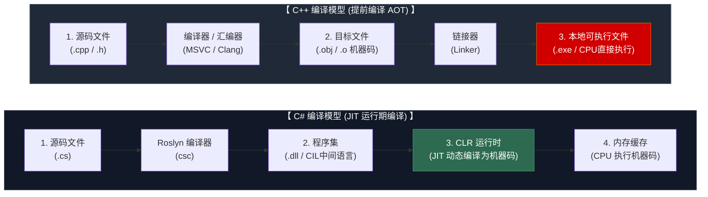
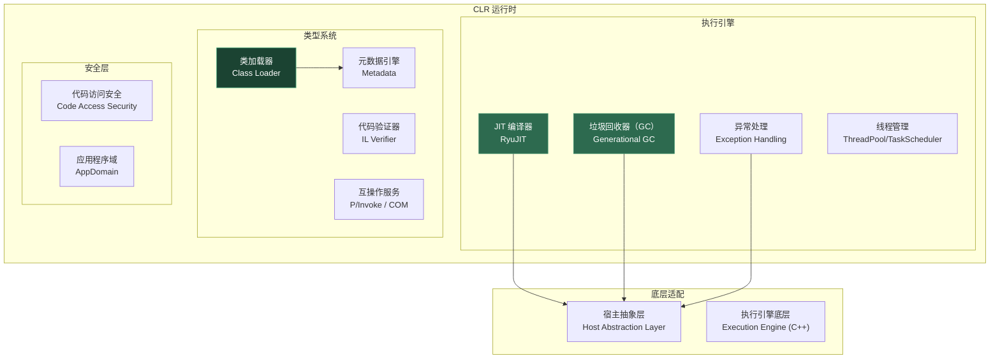
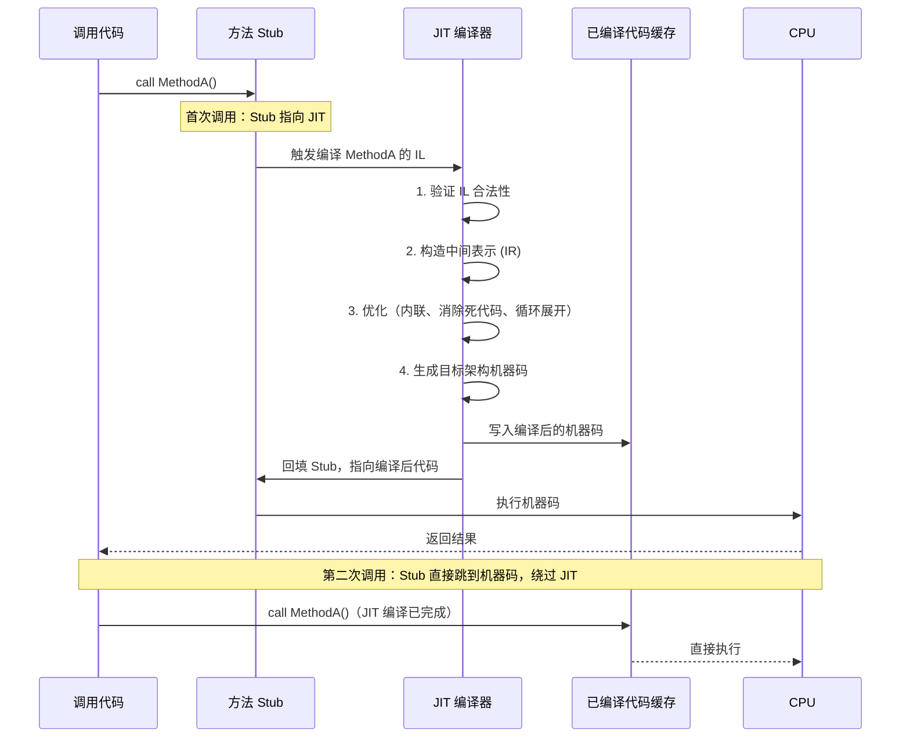
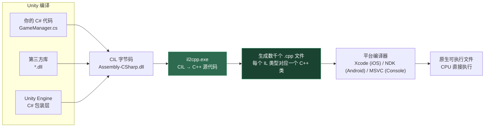

# 第九章 CLR 与编译管线

> **一句话理解**：CLR 不是简单的"IL 解释器"——它是一个包含 JIT 编译、GC 调度、异常处理、线程管理、代码验证的完整运行时。理解 JIT 的分层编译策略和 IL2CPP 的 AOT 转换，是在 Unity 中写出高性能代码的前提。

---

## 9.1 概念直觉 —— 从 C++ 编译到 C# 编译

C++ 程序员习惯的编译模型是"源码 → 目标文件 → 可执行文件"，运行时 CPU 直接执行机器码。C# 的编译模型多了"中间语言"和"运行时编译"两个阶段：



**关键差异**：
- C++ 编译器在编译时就知道目标 CPU 的确切指令集（但有交叉编译问题）
- C# 编译器生成中间语言（CIL），CLR 在运行时的目标机器上做最终编译——这意味着 JIT 可以利用目标 CPU 的最新特性（如 AVX-512），生成比预编译更优的代码

---

## 9.2 CLR 架构全景

### 9.2.1 CLR 的四大组件



**四个核心职责**：
1. **JIT 编译**：将 IL 字节码翻译为本机机器码
2. **GC**：自动内存管理（见[第二章](02_gc_and_resource_management.md)）
3. **类型系统**：类加载、代码验证、从元数据创建类型信息
4. **互操作**：P/Invoke 调用原生代码、COM 互操作

### 9.2.2 三种 CLR 实现

| 特性 | Mono | CoreCLR (.NET 5+) | .NET Framework CLR |
|------|------|-------------------|-------------------|
| 历史 | 2004 年独立项目 | 2016 年 .NET Core 1.0 | 2002 年 .NET Framework 1.0 |
| 平台 | 跨平台（移动端为主） | 跨平台 | **仅 Windows** |
| GC | SGen（分代） | 现代分代 GC | 分代 GC |
| JIT | Mono JIT / LLVM | RyuJIT | RyuJIT / 旧版 LegacyJIT |
| AOT | Mono AOT | ReadyToRun / NativeAOT | NGEN |
| Unity 使用 | ✓（Unity 2021 前默认） | ✗（Unity 计划迁移） | ✗ |
| 当前状态 | Unity 中逐步被 CoreCLR 替代 | 主力运行时，持续更新 | 维护模式（最终版本 4.8） |

**Unity 的特殊情况**：
- Unity 使用**定制版 Mono** 作为 C# 运行时
- 支持 **IL2CPP**（AOT 编译）：将 IL 转成 C++ 代码，再由平台编译器生成机器码
- Unity 2022+ 开始测试 CoreCLR 迁移（性能提升巨大，但兼容性仍在完善）

---

## 9.3 JIT 编译深入

### 9.3.1 方法首次调用流程

当 CLR 第一次调用一个方法时，触发 JIT 编译：



### 9.3.2 分层编译（Tiered Compilation）

.NET Core 3.0 引入的分层编译是理解现代 C# 性能的关键：

```
┌─────────────────────────────────────────────────┐
│  Tier 0: 快速编译 (Quick JIT)                   │
│  - 几乎不优化                                    │
│  - 编译速度优先（< 1ms）                         │
│  - 产生"预备份"机器码                            │
│  - 主要目的：字节码 → 本机码（越快越好）          │
│  - 同时：记录调用计数等运行时数据                 │
├─────────────────────────────────────────────────┤
│  Tier 1: 优化编译 (Optimizing JIT)               │
│  - 方法被调用超过 ~30 次后触发                   │
│  - 使用完整的 RyuJIT 优化管线                    │
│  - 内联展开、循环优化、边界检查消除               │
│  - 基于运行时数据的 profile-guided 优化          │
│  - 编译完成后，所有现有调用点热替换为优化版本      │
└─────────────────────────────────────────────────┘
```

```csharp
// 分层编译的实际效果
// 冷路径：Tier 0 → 启动快
// 热路径：Tier 1 → 运行快

void GameLoop()
{
    // 主循环：每帧调用，很快触发 Tier 1
    for (int frame = 0; frame < 100000; frame++)
    {
        UpdateAI();    // 前 30 帧：Tier 0（较慢）
                       // 30 帧后：自动切换到 Tier 1（优化后）
    }
    
    // 启动逻辑：只调用一次，始终 Tier 0
    InitializeOnce();  // 永远不需要 Tier 1
}
```

**Tier 1 优化的关键内容**：
- **方法内联**：小方法体直接嵌入调用点，省去调用开销
- **边界检查消除**：证明索引不会越界后，删除 `LowerBound`/`UpperBound` 检查
- **常量折叠与传播**：编译期已知的值直接替换
- **Tail Call 优化**：尾递归转循环（在特定条件下）
- **虚拟调用去虚拟化**：如果 JIT 能确定实际类型，把 `callvirt` 降级为 `call`

### 9.3.3 方法内联的条件

JIT 是否内联一个方法，取决于以下规则：

```csharp
// 会被内联的典型模式
public int Add(int a, int b) => a + b;          // ✓ 极小体，无条件内联
public static bool IsAlive(Player p) => p.HP > 0; // ✓ 简单调用链

// 不会被内联的情况
public virtual void Attack() { /* ... */ }       // ✗ 虚方法（除非 JIT 去虚拟化）
public void HugeMethod() { /* 200 行 ... */ }    // ✗ 超过 IL 字节数阈值（约 32 字节 IL）
public async Task DoAsync() => await ...;         // ✗ async 方法（实际调用状态机）
// 包含 try-catch 的方法也不易被内联
```

**Unity 特别关注**：IL2CPP 在 AOT 编译阶段做内联——这比 JIT 更激进，因为编译时间不受用户耐心限制。但这也意味着 IL2CPP 的内联决策**不考虑运行时计数器**，可能内联过多（代码膨胀）或过少（错过热路径）。

---

## 9.4 AOT 与 IL2CPP 深度剖析

### 9.4.1 iOS 为什么必须用 IL2CPP

iOS 不允许内存页具有"可写 + 可执行"权限（No W^X policy）。JIT 需要在运行时生成机器码并写入可执行内存，这与 iOS 安全策略冲突。所以 Unity 在 iOS 上必须走 AOT 编译。

### 9.4.2 IL2CPP 的完整管线



### 9.4.3 IL2CPP 的"翻译"

IL2CPP 将 CIL 字节码翻译为 C++ 代码，虚拟机也一并翻译：

```cpp
// IL2CPP 生成的 C++（高度简化）
// 原始 C#：
//   public void Damage(int amount) { HP -= amount; }

// 生成的 C++ 大致逻辑：
void Player_Damage_m12345(Player_t* __this, int32_t amount, MethodInfo* method)
{
    // NullReferenceException 检查
    if (__this == NULL)
        il2cpp::vm::Exception::RaiseNullReferenceException();
    
    // 字段访问 = 偏移量计算
    int32_t* hpField = (int32_t*)((uint8_t*)__this + kPlayer_HP_Offset);
    *hpField -= amount;
    
    // 泛型共享实现（运行时类型信息传入）
    // 虚方法调用通过 vtable 间接跳转
}
```

### 9.4.4 IL2CPP 的限制与对策

```csharp
// 问题 1：泛型虚拟方法 — IL2CPP 需要提前生成所有可能的实例化
public class Processor<T> where T : IProcessable
{
    public virtual void Process(T item) { /* ... */ }
}
// IL2CPP 不知道 T 可能是哪些具体类型
// 解决：添加 link.xml 保留需要的泛型实例化

// 问题 2：反射 —— 未直接引用的类型会被 Strip
Type.GetType("MyGame.Weapons.LegendarySword");
// 如果 LegendarySword 没被直接 new 过，IL2CPP 可能移除它
// 解决：link.xml 中 preserve，或使用 [Preserve] 属性

// 问题 3：System.Reflection.Emit —— 完全不可用
// IL2CPP 是 AOT，无法在运行时生成 IL 再编译
// 替代：Source Generator (见第八章) 或手写替代代码
```

### 9.4.5 IL2CPP 的泛型代码生成策略

这是 IL2CPP 中最影响性能的设计决策。与 JIT 不同，IL2CPP 必须在编译时决定要为哪些泛型实例化生成代码：

```csharp
// === 策略 1：值类型泛型 —— 按大小分组共享 ===
// IL2CPP 为每种不同大小的值类型泛型生成独立代码
List<int> intList;       // sizeof(int) = 4 → 生成 List_Int32
List<float> floatList;   // sizeof(float) = 4 → 可以共享 List_Int32 的代码！
List<double> doubleList; // sizeof(double) = 8 → 生成 List_Double
List<long> longList;     // sizeof(long) = 8 → 共享 List_Double 的代码

// 注意：共享的前提是 GC 描述符相同
// int 和 float 都是 4 字节且不含引用 → 可以共享
// Vector3 (12字节，无引用) 和某个 12 字节 struct → 可以共享

// === 策略 2：引用类型泛型 —— 全部共享 ===
// 所有引用类型泛型共享同一份机器码（和 JIT 一样）
List<string> strList;
List<Player> playerList;
List<Enemy> enemyList;
// 三个 list 共享同一份 List<object> 的机器码
// 原因：所有引用类型在运行时都是 8 字节指针（64位），行为一致

// === 策略 3：推测性生成（Speculative Generation） ===
// IL2CPP 扫描所有 IL 代码中的显式实例化
void KnownUsage()
{
    var a = new List<int>();           // ✓ 被扫描到 → 生成
    var b = new Dictionary<int, string>(); // ✓ 被扫描到 → 生成
}

// 但无法处理反射创建
void UnknownUsage()
{
    Type t = Type.GetType("System.Collections.Generic.List`1");
    Type closed = t.MakeGenericType(typeof(SomeRuntimeType));
    var instance = Activator.CreateInstance(closed);
    // ✗ IL2CPP 不知道 SomeRuntimeType 是什么 → 缺少代码 → 运行时异常！
}

// 解决：在 link.xml 中显式声明
// <assembly fullname="mscorlib">
//   <type fullname="System.Collections.Generic.List`1">
//     <genericargument name="MyGame.SomeRuntimeType" />
//   </type>
// </assembly>
```

**IL2CPP 泛型共享的限制**：
- 值类型泛型的共享只按**大小**分桶，不按语义。`int` 和 `float` 共享代码意味着 `List<T>.Add(T item)` 中的比较逻辑（如 `IndexOf`）由运行时传入的 `TypeInfo` 来区分——这会引入**函数指针调用开销**，而非直接的机器指令
- 如果一个值类型包含引用类型字段（如 `struct Pair { int a; string b; }`），它的 GC 描述符包含引用追踪信息，不能与纯值类型共享代码
- `Nullable<T>` 是特殊优化的：`Nullable<int>` 可以与 `int` 共享部分代码（因为底层只是 `int` + `bool`）

### 9.4.6 ReadyToRun 与 NativeAOT —— IL2CPP 在 .NET 世界的对应物

.NET 生态系统也有自己的 AOT 方案，与 IL2CPP 形成对照：

| 特性 | IL2CPP (Unity) | ReadyToRun (.NET) | NativeAOT (.NET 7+) |
|------|---------------|-------------------|---------------------|
| 编译产物 | C++ → 平台编译器 → 原生 | 预编译 IL + 少量 JIT 回退 | 直接生成原生代码 |
| 泛型支持 | 推测性生成 + link.xml | 预编译已知 + JIT 未知 | 全 AOT（必须提前声明所有实例化） |
| 反射.Emit | 不支持 | 支持（JIT 回退） | 不支持 |
| 二进制体积 | 大（全量翻译） | 中（混合） | 小（只包含实际使用的代码） |
| 适用场景 | Unity 引擎游戏 | 服务器/桌面应用快速启动 | 云端微服务/CLI 工具 |
| IL2CPP 类比 | — | 类似 Mono AOT | 最接近的对应物 |

```csharp
// NativeAOT 的典型限制 —— 与 IL2CPP 趋同
// 1. 必须显式声明所有泛型实例化
[DynamicDependency(DynamicallyAccessedMemberTypes.All, typeof(List<Player>))]
// 2. 不支持 MakeGenericType 创建未知泛型
// 3. 默认启用代码裁剪（Trimming）—— 比 IL2CPP 更激进
```

---

## 9.5 程序集加载与元数据

### 9.5.1 Assembly 的分层加载

```csharp
// CLR 按需加载程序集
// 1. 显式加载
Assembly asm = Assembly.Load("MyGame.Core");
Assembly asm2 = Assembly.LoadFrom("Plugins/MyPlugin.dll");

// 2. 类型引用触发加载
// 当方法中第一次用到 MyClass 类时，CLR 自动加载包含它的程序集
var obj = new MyClass();  // 如果 MyClass 所在的 Assembly 未加载，CLR 自动加载

// 3. AssemblyLoadContext（.NET Core）—— 隔离加载
var context = new AssemblyLoadContext("PluginSandbox", isCollectible: true);
Assembly plugin = context.LoadFromAssemblyPath("plugins/Dynamic.dll");
// 插件卸载：context.Unload();  // 整个上下文及加载的程序集被 GC 回收
```

### 9.5.2 元数据的运行时形态

每个 .NET 类型在运行时都有对应的 `Type` 对象和 `MethodTable`（CLR 内部数据结构）：

```
┌──────────────────────────────────────────┐
│ Type 对象 (托管堆，反射可见)               │
│  - Name, Namespace, Assembly              │
│  - GetMethods(), GetProperties()          │
│  - 慢路径：每次调用都查内部结构            │
└──────────────┬───────────────────────────┘
               │ 每个 Type 持有一个指针
┌──────────────▼───────────────────────────┐
│ MethodTable (EE 堆，仅 CLR 内部可见)      │
│  - 虚方法槽表 (vtable slots)              │
│  - 接口映射表 (interface dispatch map)     │
│  - 基类指针 (parent MethodTable)          │
│  - 字段布局描述 (offset + size)           │
│  - GC 描述符 (哪些字段是引用，需要 GC 追踪) │
└──────────────────────────────────────────┘
```

**为什么比 C++ vtable 快**：CLR 的接口调度使用**虚方法槽表 + 接口映射表**，不需要 C++ 的菱形继承解决方案（虚基类偏移）。但在 IL2CPP 模式下，接口调度的开销更大（需要查表），和 C++ 的 `dynamic_cast` 类似。

---

## 9.6 C++ 程序员对照

```csharp
// C# 的虚拟分发 vs C++ 的虚拟分发

// === C# ===
interface IAttackable { void TakeDamage(int dmg); }
class Enemy : MonoBehaviour, IAttackable
{
    public virtual void TakeDamage(int dmg) => HP -= dmg;
}

IAttackable target = new Enemy();
target.TakeDamage(10);  // 接口调用：查 Enemy 的 MethodTable → IAttackable 映射槽 → 实际方法地址

// === C++ ===
class IAttackable { public: virtual void TakeDamage(int dmg) = 0; };
class Enemy : public IAttackable
{
public:
    virtual void TakeDamage(int dmg) override { hp -= dmg; }
};

IAttackable* target = new Enemy();
target->TakeDamage(10);  // vtable 间接调用：查 vptr → vtable[0] → 实际函数地址
```

| 维度 | C# (CLR) | C++ |
|------|----------|-----|
| 虚方法调度 | `callvirt` IL 指令 → vtable 间接调用 | vptr → vtable 间接调用 |
| 接口调度 | 接口映射表（更慢但更灵活） | 多重继承 vtable（更快但复杂） |
| 去虚拟化 | JIT 可去虚拟化（检测到单态） | 编译器可去虚拟化（静态类型已知） |
| GC 支持 | 每个类型有 GC 描述符（哪些字段是引用） | 无 GC（手动管理 / shared_ptr） |
| 泛型代码共享 | JIT：值类型分大小，引用类型共享（见第五章） | 模板：每种实例化独立编译 |
| 元数据 | 丰富的运行时元数据（反射） | RTTI 最小（typeid + dynamic_cast） |
| 启动时间 | JIT 预热有开销，Tier 0 改善 | 预编译，无运行时编译开销 |

---

## 9.7 常见陷阱与面试题

### 陷阱 1：误以为 IL2CPP 性能一定比 Mono JIT 好

```csharp
// IL2CPP 的 AOT 代码通常启动更快、内存更小
// 但在纯计算密集型代码中，JIT 可能更优——原因：

// JIT 可以做 Profile-Guided Optimization：
// 如果某个 if 分支 99% 走 true，JIT 会把 true 分支编译到 fall-through 路径
// 而 AOT 无法获取运行时数据，只能依赖静态启发式

// 但 IL2CPP 也有优势：编译器可以做全局优化（跨模块内联）
// JIT 的内联范围受限于"当前已加载的方法"
```

### 陷阱 2：CLR 的 type cast 开销被低估

```csharp
// 这段代码在 IL2CPP 下的开销远大于 Mono JIT
void ProcessObjects(List<object> items)
{
    foreach (var item in items)
    {
        if (item is IDamageable d)  // 每次迭代：isinst IL 指令
            d.TakeDamage(10);       // 接口虚调用：查接口映射表
    }
}

// 优化：如果可以确定类型，避免频繁的 is 检查和接口调用
// 将 IDamageable 作为存储类型而非 object
void ProcessObjects(List<IDamageable> items)
{
    foreach (var item in items)
        item.TakeDamage(10);  // 省去 isinst，但接口调度仍然存在
}
```

### 陷阱 3：AssemblyLoadContext 不会自动卸载

```csharp
// 即使 context 被设为 null，GC 也不一定回收它
AssemblyLoadContext context = new AssemblyLoadContext("Plugin", isCollectible: true);
Assembly plugin = context.LoadFromAssemblyPath("plugin.dll");

// ... 使用插件 ...

// 卸载：必须先确保所有对插件类型的引用被清除
context.Unload();  // 触发卸载，但如果还有引用：静默失败
context = null;
GC.Collect();      // 必须显式 GC 才能回收 AssemblyLoadContext
GC.WaitForPendingFinalizers();
```

### 面试题精选

**Q1：JIT 编译和 AOT 各有什么优势和劣势？**

答：
- **JIT 优势**：可以利用运行时 CPU 特性（如检测到 AVX-512 就用 AVX-512 指令），可以做基于运行时数据的优化（PGO），编译后的代码只包含实际执行的路径，内存占用小（未执行的方法不编译）
- **JIT 劣势**：首次调用有编译延迟（Tier 0 缓解但不消除），无法做全程序优化（只能看到已加载的方法），需要运行时包含编译器本身
- **AOT 优势**：启动无编译延迟，可以做全局分析，二进制体积更小（不含编译器），iOS 等平台必备
- **AOT 劣势**：无法利用运行时数据优化，必须为所有可能的泛型实例化生成代码，不支持 `Reflection.Emit`

**Q2：分层编译的 Tier 0 到 Tier 1 切换是线程安全的吗？**

答：是的。JIT 使用"方法描述表"中的函数指针做原子替换。当 Tier 1 编译完成，CLR 通过一次原子写入将函数指针从 Tier 0 替换为 Tier 1。正在 Tier 0 执行中的调用不受影响（用完当前调用再切），切换对外界透明。

**Q3：IL2CPP 如何处理 C# 的泛型虚方法？**

答：IL2CPP 是 AOT，无法在运行时为泛型生成新代码。它的策略是"推测性生成"——在编译阶段，IL2CPP 分析所有直接调用场景，生成需要的具体实例化。对于无法推测的（如通过反射），需要开发者在 link.xml 中显式声明，或使用 `[Preserve]` 属性。

**Q4：`typeof(MyClass) == obj.GetType()` 和 `obj is MyClass` 哪个更快？**

答：`obj is MyClass` 更快。`GetType()` 返回 Type 对象需要 GC 分配（虽然 Type 对象是被缓存的，但调用本身有开销），而 `is` 操作符直接编译为 `isinst` IL 指令，是 MethodTable 指针的直接比较。在 IL2CPP 中差异更大——`GetType()` 需要查全局类型表。

**Q5：为什么 Unity 游戏启动时会有明显的"卡顿"？和 CLR 有关吗？**

答：部分相关。Mono JIT 在游戏启动时编译大量方法（场景加载、资源管理、初始化逻辑），造成 CPU 峰值。缓解方案：
- 场景预加载时预热关键代码路径（在 Loading 界面时主动调用一次关键方法，触发 JIT）
- 使用 IL2CPP 消除 JIT 开销（但增加了构建时间）
- .NET 的 ReadyToRun（部分 AOT + JIT 混合）

---

## 9.8 游戏开发实战

### 场景 1：热更新与程序集隔离

```csharp
// 游戏的热更新系统 —— 使用 AssemblyLoadContext 实现 DLL 热替换
public class HotUpdateManager
{
    private AssemblyLoadContext _currentContext;
    private Type _gameLogicType;
    private object _gameLogicInstance;
    
    public bool LoadHotUpdateDll(string dllPath)
    {
        // 卸载旧版本
        if (_currentContext != null)
        {
            _gameLogicInstance = null;
            _gameLogicType = null;
            _currentContext.Unload();
            GC.Collect();
            GC.WaitForPendingFinalizers();
        }
        
        // 加载新版本
        _currentContext = new AssemblyLoadContext("HotUpdate", isCollectible: true);
        var asm = _currentContext.LoadFromAssemblyPath(dllPath);
        _gameLogicType = asm.GetType("HotUpdate.GameLogic");
        _gameLogicInstance = Activator.CreateInstance(_gameLogicType);
        
        return true;
    }
    
    public void Update()
    {
        // 通过反射调用热更 DLL 中的方法
        _gameLogicType?.GetMethod("OnUpdate")?.Invoke(_gameLogicInstance, null);
    }
}
```

### 场景 2：IL2CPP 下的泛型兼容处理

```csharp
// 为 IL2CPP 准备的泛型代码 —— 避免运行时无法解析的泛型实例化
public static class IL2CPPSafeGenerics
{
    // 这些显式调用确保 IL2CPP 生成所需的泛型实例化
    static IL2CPPSafeGenerics()
    {
        // 强制 IL2CPP 生成这些具体类型
        ForceGeneric<List<int>>();
        ForceGeneric<List<float>>();
        ForceGeneric<List<string>>();
        ForceGeneric<Dictionary<int, string>>();
        ForceGeneric<Dictionary<string, object>>();
    }
    
    [MethodImpl(MethodImplOptions.NoInlining)]
    static void ForceGeneric<T>() { /* 空方法，只为触发泛型代码生成 */ }
}

// 或者使用 link.xml：
// <linker>
//   <assembly fullname="mscorlib">
//     <type fullname="System.Collections.Generic.List`1">
//       <genericargument name="MyGame.Player" />
//     </type>
//   </assembly>
// </linker>
```

### 场景 3：利用 JIT 分层编译优化加载

```csharp
// 在 Loading 场景"预热"关键代码路径
public class JITWarmup : MonoBehaviour
{
    IEnumerator Start()
    {
        var progress = ShowLoadingScreen("正在优化性能...");
        
        // 强制 JIT 编译以下方法（Tier 1 优化会在游戏开始前完成）
        yield return null;
        WarmupMath();
        
        progress.SetText("准备战斗系统...");
        yield return null;
        WarmupCombat();
        
        progress.SetText("准备 AI 系统...");
        yield return null;
        WarmupAI();
        
        progress.Complete();
        SceneManager.LoadScene("Game");
    }
    
    void WarmupMath()
    {
        // 多次调用触发 Tier 1 优化
        for (int i = 0; i < 100; i++)
        {
            Vector3.Dot(Vector3.one, Vector3.up);
            Mathf.Sin(i * 0.1f);
        }
    }
    
    void WarmupCombat()
    {
        var dummy = new DamageCalculator();
        for (int i = 0; i < 50; i++)
        {
            dummy.CalculateDamage(i * 10, 50, 0.2f);
        }
    }
    
    void WarmupAI()
    {
        var dummy = new PathFinder();
        for (int i = 0; i < 50; i++)
        {
            dummy.FindPath(Vector3.zero, new Vector3(i * 2, 0, i * 2));
        }
    }
}
```

---

## 9.9 三十秒速答

| 问题 | 答案 |
|------|------|
| **CLR 是什么？** | .NET 的运行时环境：JIT 编译 IL → 机器码 + GC + 类型系统 + 异常处理 + 线程管理 |
| **IL2CPP 做了什么？** | 将 CIL 字节码转换成 C++ 源码，再用平台编译器生成原生机器码——消除 JIT |
| **JIT 分层编译？** | Tier 0 快速编译（低延迟），调用超 30 次后 Tier 1 优化重编译（高吞吐） |
| **什么时候必须 IL2CPP？** | iOS（禁止 JIT 内存页）、主机平台（安全策略）、需要最小二进制体积 |
| **Mono vs CoreCLR？** | Mono 是 Unity 当前默认运行时；CoreCLR 是 .NET 现代化运行时，性能显著更好 |
| **IL2CPP 的代价？** | 构建时间大幅增加（CIL → C++ → 编译），不支持 Emit，泛型需要提前声明 |

---

## 9.10 延伸阅读

- [[02_gc_and_resource_management]](02_gc_and_resource_management.md) —— GC 的完整机制与 CLR 中的实现
- [[05_generics_and_collections]](05_generics_and_collections.md) —— JIT 泛型代码共享机制
- [[08_pattern_matching_and_modern_csharp]](08_pattern_matching_and_modern_csharp.md) —— Source Generator（IL2CPP 下反射的替代方案）
- [RyuJIT: The next-generation JIT compiler for .NET](https://github.com/dotnet/runtime/blob/main/docs/design/coreclr/jit/ryujit-overview.md)
- [Unity IL2CPP Documentation](https://docs.unity3d.com/Manual/IL2CPP.html)
