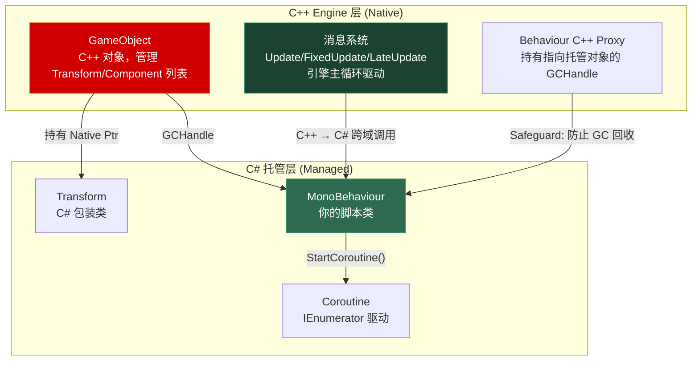
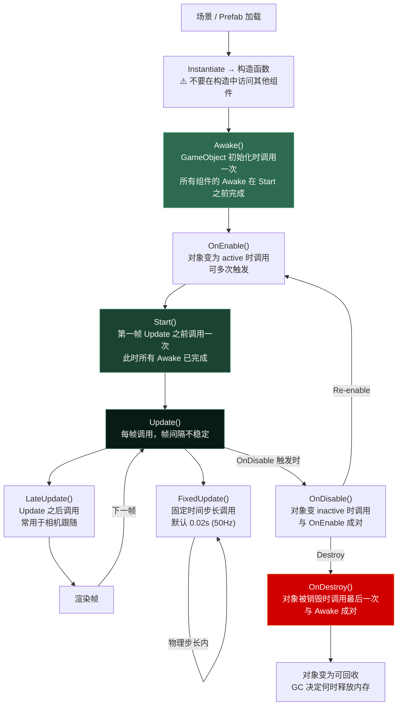
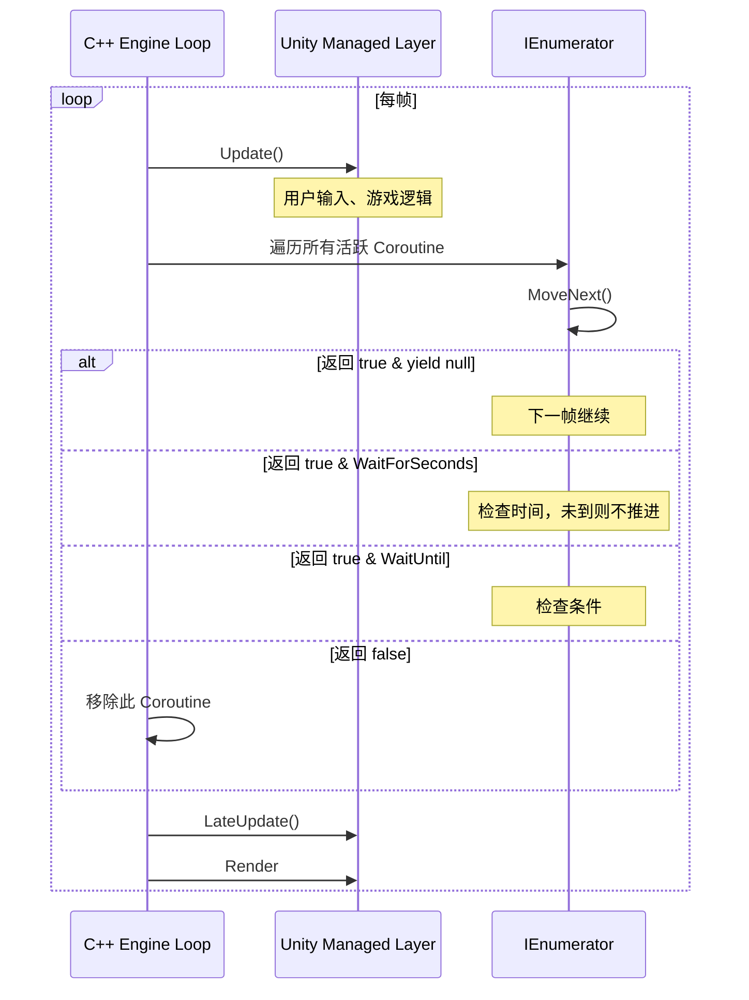

# 第十章 MonoBehaviour 深入

> **一句话理解**：`MonoBehaviour` 不是普通的 C# 类——它是一个横跨 C++ engine 和 C# 托管层的**双向桥接对象**。Unity 引擎通过这个桥接，在每一帧向你的脚本注入生命周期回调。理解这个桥接机制，你才能理解为什么有些操作只能在主线程做、为什么 `null` 检查这么特殊、以及 Coroutine 的本质不是线程。

---

## 10.1 概念直觉 —— MonoBehaviour 是什么

从 C++ 程序员的角度看：`MonoBehaviour` 类似于一个"引擎插槽"。你写的 C# 脚本被 Unity 引擎发现后，引擎为每个挂载了脚本的 GameObject 在 C++ 端创建对应的管理对象，然后通过托管控件（Managed Bridge）将引擎事件广播给你的 C# 代码。



**核心认知**：
1. 你的 `MonoBehaviour` 对象活在托管堆上，被 GC 管理
2. C++ 引擎通过 `GCHandle` 持有它的强引用，**防止被 GC 回收**
3. 当 `GameObject.Destroy()` 被调用时，C++ 端释放 `GCHandle`，C# 对象变为可回收
4. Unity 重载了 `==` 运算符——对已销毁的 MonoBehaviour 做 `if (obj == null)` 返回 `true`，但 `ReferenceEquals(obj, null)` 返回 `false`

---

## 10.2 生命周期完整剖析

### 10.2.1 生命周期时序图



### 10.2.2 生命周期规则详解

```csharp
public class LifecycleDemo : MonoBehaviour
{
    // 1. Awake：初始化自己的状态
    void Awake()
    {
        // 此时不能依赖其他组件的 Start 已完成
        // 但可以依赖 Awake（Unity 保证所有 Awake 在 Start 前执行）
        _rigidbody = GetComponent<Rigidbody>();  // 安全
        _playerHealth = GetComponent<PlayerHealth>();  // 存在，但可能尚未 Start
    }
    
    // 2. OnEnable：对象变为 active、每次启用时调用
    void OnEnable()
    {
        // 注册事件、订阅消息
        EventBus.OnPlayerDied += HandlePlayerDied;
        // 可能被多次调用，注意防止重复注册！
    }
    
    // 3. Start：第一帧开始前
    void Start()
    {
        // 所有组件的 Awake 已完成，可以安全访问外部组件
        _playerHealth.Initialize(_maxHP);  // 安全
    }
    
    // 4. Update：每帧
    void Update()
    {
        // 帧间隔 = Time.deltaTime，不稳定
        transform.Translate(Vector3.forward * speed * Time.deltaTime);
    }
    
    // 5. FixedUpdate：物理步长
    void FixedUpdate()
    {
        // 间隔 = Time.fixedDeltaTime (默认 0.02s)，稳定
        _rigidbody.AddForce(Vector3.forward * force);
    }
    
    // 6. LateUpdate：Update 之后
    void LateUpdate()
    {
        // 常用于相机跟随 —— 确保在角色移动完成后再跟
        Camera.main.transform.position = target.position + offset;
    }
    
    // 7. OnDisable：禁用时
    void OnDisable()
    {
        // 取消订阅（与 OnEnable 成对）
        EventBus.OnPlayerDied -= HandlePlayerDied;
        // 停止所有协程
        StopAllCoroutines();
    }
    
    // 8. OnDestroy：销毁时
    void OnDestroy()
    {
        // 释放非托管资源，最后一次清理
        // 注意：此时对象已从引擎侧标记为销毁
    }
}
```

### 10.2.3 FixedUpdate 的帧追赶机制

当游戏帧率低于物理帧率时，FixedUpdate 会在同一帧内调用多次以"追赶"物理时间：

```csharp
// 假设：targetFPS = 30, fixedDeltaTime = 0.02s (50Hz)
// 渲染一帧 ≈ 0.033s，物理需要模拟 0.033 / 0.02 ≈ 1.67 次
//
// Frame 1 (time=0.000):  Update → FixedUpdate(1) → LateUpdate → Render
// Frame 2 (time=0.033):  Update → FixedUpdate(2) → LateUpdate → Render  ← 调用2次追逐
// Frame 3 (time=0.066):  Update → FixedUpdate(2) → LateUpdate → Render  ← 调用2次

// 最大调用次数 = Time.maximumDeltaTime / Time.fixedDeltaTime
// 防止卡顿时无限 FixedUpdate 积累
```

---

## 10.3 序列化系统

### 10.3.1 Unity 的序列化规则

Unity 的序列化系统不在运行时使用 .NET 的 `BinaryFormatter` 或 JSON——它使用引擎自己的序列化器，在 Editor 和运行时都可以工作：

```csharp
public class SerializationDemo : MonoBehaviour
{
    // ✓ 会被序列化（显示在 Inspector 中）
    public int publicField;                        // public 字段
    [SerializeField] private int privateField;     // 标记 SerializeField 的私有字段
    
    // ✗ 不会被序列化
    private int _hiddenField;                      // 私有字段，未标记
    public static int StaticField;                 // static 字段永远不序列化
    public const int ConstField = 5;               // const
    public int Prop { get; set; }                  // 属性（除非标记 [field: SerializeField]）
    public readonly int ReadonlyField;              // readonly
    
    // ✓ 可序列化的类型
    public int integer;                            // 基本类型
    public string text;                            // string
    public Vector3 position;                       // Unity 结构体
    public Color color;                            // Unity 结构体
    public AnimationCurve curve;                   // Unity 对象
    public GameObject prefab;                      // UnityEngine.Object 引用
    public int[] array;                            // 数组（可序列化元素类型）
    public List<int> list;                         // List<T>
    
    // △ 需要 [SerializeReference] 的多态字段
    [SerializeReference] public IWeapon weapon;    // 接口/抽象类引用
    [SerializeReference] public WeaponBase baseWeapon; // 继承体系中的引用
}
```

### 10.3.2 SerializeField vs SerializeReference

```csharp
[System.Serializable]
public class Sword : IWeapon { public int damage; }
[System.Serializable]
public class Bow : IWeapon { public float range; }

public class WeaponHolder : MonoBehaviour
{
    // [SerializeField]：值拷贝，不支持多态
    // 在 Inspector 中：直接编辑 Sword 的字段
    [SerializeField] private Sword _sword;
    
    // [SerializeReference]：引用类型，支持多态（C#，Unity 2019.3+）
    // 在 Inspector 中：可以选择托管具体类型（Sword 或 Bow）
    [SerializeReference] private IWeapon _weapon;
    [SerializeReference] private List<IWeapon> _weapons;  // 多态列表
}
```

**`SerializeReference` 的内部机制**：Unity 在序列化时额外存储类型的全限定名，反序列化时通过 `System.Activator.CreateInstance()` 或 `FormatterServices.GetUninitializedObject()` 重建正确类型的对象。这就是为什么多了 `[Serializable]` 标记还不够，`SerializeReference` 是另外的开销。

### 10.3.3 嵌套序列化

```csharp
// 可序列化的"纯数据"类 —— 不需要继承 MonoBehaviour
[System.Serializable]
public class CharacterData
{
    public string name;
    public int level;
    public List<SkillData> skills;
}

[System.Serializable]
public class SkillData
{
    public string skillName;
    public float cooldown;
    public AnimationCurve damageCurve;  // Unity 对象也可以序列化
}

// 在 MonoBehaviour 中使用
public class CharacterSheet : MonoBehaviour
{
    [SerializeField] private CharacterData[] _characters;  // 显示在 Inspector 中
}
```

**非 MonoBehaviour 类的限制**：
- 必须标记 `[System.Serializable]`
- 不能继承 `MonoBehaviour`（否则必须挂 GameObject）
- 不能引用场景对象（不能 `public GameObject` 指向 Hierarchy 中的对象），只能引用 Assets 中的 Prefab/ScriptableObject
- 自定义类在 Inspector 中**必须**有一个无参构造函数，否则 Unity 反序列化时无法创建实例

---

## 10.4 Coroutine 深度剖析

### 10.4.1 Coroutine 不是多线程

这是初级 Unity 面试最常见的误解。Coroutine 全部在主线程运行：

```csharp
// Coroutine 的本质：Unity 在每帧 Update 之后检查 IEnumerator 是否完成
IEnumerator MyCoroutine()
{
    Debug.Log($"Frame {Time.frameCount}: 第一步");  // Frame 10
    yield return new WaitForSeconds(2f);              // 暂停 2 秒
    Debug.Log($"Frame {Time.frameCount}: 第二步");  // Frame ~130（2 秒后）
    yield return null;                                // 暂停一帧
    Debug.Log($"Frame {Time.frameCount}: 第三步");  // Frame 131
}

// Unity 引擎在每帧的 Update 之后，遍历所有活跃的 Coroutine：
// 伪代码（C++ engine 侧）：
void PlayerLoop()
{
    while (true)
    {
        // 1. 调用所有 Update
        for (auto& comp : activeComponents)
            comp.CallManagedUpdate();
        
        // 2. 推进所有 Coroutine
        for (auto it = coroutines.begin(); it != coroutines.end(); )
        {
            if (!it->MoveNext())   // IEnumerator.MoveNext()
                it = coroutines.erase(it);  // 协程结束
            else
                ++it;
        }
        
        // 3. 调用所有 LateUpdate
        // 4. 渲染
    }
}
```

### 10.4.2 yield 指令的内部机制

```csharp
// 每个 yield 指令都是 Unity 自定义的 YieldInstruction 子类
public class CoroutineHost : MonoBehaviour
{
    IEnumerator LoadGameSequence()
    {
        // yield return null → 下一帧继续
        // 内部：标记为"等待一帧"，下次 Update 后推进
        yield return null;
        
        // yield return new WaitForSeconds(5f) → 5 秒后继续
        // 内部：记录时间戳，每帧检查 Time.time >= targetTime
        yield return new WaitForSeconds(5f);
        
        // yield return new WaitForEndOfFrame() → 渲染帧结束后继续
        // 内部：在渲染管线末尾、下一帧 Update 之前推进
        yield return new WaitForEndOfFrame();
        
        // yield return new WaitForFixedUpdate() → 下一次 FixedUpdate 后继续
        // 内部：在 FixedUpdate 循环后推进
        yield return new WaitForFixedUpdate();
        
        // yield return new WaitUntil(() => Input.GetKeyDown(KeyCode.Space))
        // 内部：每帧 Update 后检查条件
        yield return new WaitUntil(() => _isLoaded);
        
        // yield return new WaitWhile(() => _isLoading)
        // 内部：每帧检查条件为 false
        yield return new WaitWhile(() => _isLoading);
        
        // yield return anotherCoroutine → 等待另一个 Coroutine 完成
        // 内部：嵌套 IEnumerator，引擎先推进子协程
        yield return StartCoroutine(SubTask());
        
        // yield return asyncOperation → 等待异步操作完成
        yield return SceneManager.LoadSceneAsync("Game");
        
        // yield break → 立即终止（等价于 return）
        if (_cancelled)
            yield break;
    }
}
```



### 10.4.3 Coroutine vs async/await

| 维度 | Coroutine | async/await (Task) |
|------|-----------|-------------------|
| 运行线程 | **始终主线程** | 可能切换（取决于 SynchronizationContext） |
| 暂停机制 | `yield return` 挂起 IEnumerator | `await` 挂起状态机 |
| 返回类型 | `IEnumerator` / `void` / `Coroutine` | `Task` / `Task<T>` / `ValueTask` |
| 异常处理 | 异常直接抛在调用帧，不易捕获 | `try-catch` 包裹 await（状态机内捕获） |
| 生命周期绑定 | 随 GameObject 销毁自动停止 | **不自动停止**——可能导致"僵尸"Task |
| Unity API 访问 | 安全（主线程） | 安全（需要在主线程，见[第七章](07_async_programming.md) 7.2.2） |
| 取消机制 | `StopCoroutine()` / `StopAllCoroutines()` | `CancellationToken` |
| 性能 | 每帧遍历开销（引擎层），但极轻量 | Task 状态机分配（class），但可复用 ValueTask |

**选型原则**：
- Unity API 相关的异步操作（加载资源、场景）→ Coroutine（自动绑定生命周期）
- 纯数据操作、网络请求、文件 IO → async/await（更好的错误处理、组合性）
- 两者混用：`await` 一个 `AsyncOperation`（`await sceneLoad.ConfigureAwait(false)` 不可用）——在 Unity 中必须回到主线程

---

## 10.5 执行顺序与脚本排序

### 10.5.1 默认顺序 vs 显式排序

```csharp
// Unity 默认不保证不同脚本的 Awake/Start/Update 调用顺序
// 三种方式控制：

// 方式 1：Script Execution Order 设置（Project Settings）
// 指定脚本的优先级数值（越小越先执行）

// 方式 2：[DefaultExecutionOrder] 属性
[DefaultExecutionOrder(-100)]
public class InputManager : MonoBehaviour { }  // 最先执行

[DefaultExecutionOrder(100)]
public class CameraController : MonoBehaviour { }  // 最后执行

// 方式 3：手动依赖管理（最可靠）
public class DependentComponent : MonoBehaviour
{
    [SerializeField] private InputManager _inputManager;
    
    void Start()
    {
        // 不依赖执行顺序，直接引用
    }
}
```

### 10.5.2 禁用域（Disabled Domain）的保护

```csharp
// 当预制体被禁用时，Awake 不会执行——但序列化字段仍然存在
public class EnemySpawner : MonoBehaviour
{
    [SerializeField] private GameObject _enemyPrefab;
    
    void Awake()
    {
        // 如果 GameObject 初始 active=false，Awake 不会执行
        // 但当它首次变为 active 时，Awake + OnEnable 都会执行
        // 此时 _enemyPrefab 已经正确反序列化
    }
}
```

---

## 10.6 C++ 程序员对照

| C# Unity (MonoBehaviour) | C++ 等价概念 |
|--------------------------|-------------|
| `MonoBehaviour` 组件 | 引擎基类 `Component` + 反射注册（UE 的 `AActor` / `UActorComponent`） |
| `Awake()` / `Start()` | 构造函数 + 置后初始化（UE 的 `BeginPlay`） |
| `Update()` | 引擎主循环 `Tick(float DeltaTime)` |
| `FixedUpdate()` | 固定步长 `Tick`（物理帧） |
| `Coroutine` | `std::coroutine` (C++20) 或在主循环中推进的任务队列 |
| `[SerializeField]` | 编辑器反射标记（UE 的 `UPROPERTY()`） |
| `GCHandle` 防止 GC 回收 | `std::shared_ptr` 保持引用（但无自动回收） |
| `GameObject` | Scene Node / Actor（持有组件列表的聚合节点） |

**C++ 引擎开发者的关键思维转换**：
- C++ 你需要关心对象的所有权和生命周期（谁负责 delete），Unity 中 GC 替你回收托管内存——但**非托管资源（纹理、Mesh、NativeArray）必须手动释放**
- C++ 可以直接 `delete obj; obj = nullptr;`，Unity 中你调用 `Destroy(gameObject)` 后 C# 对象只是被标记为 "已销毁"——GC 未来才回收，在此之前 `obj == null` 返回 `true` 但 `ReferenceEquals(obj, null)` 是 `false`

---

## 10.7 常见陷阱与面试题

### 陷阱 1：MonoBehaviour 的构造函数

```csharp
public class BadPattern : MonoBehaviour
{
    public BadPattern()  // ⚠️ 不要这么做！
    {
        // Unity 在主线程以外的线程也可能构造 MonoBehaviour
        // 构造函数中访问 Unity API 会导致崩溃
        // GetComponent<>() 在构造函数中不可用
    }
    
    void Awake()  // ✓ 在这里做初始化
    {
        _rigidbody = GetComponent<Rigidbody>();
    }
}
```

### 陷阱 2：MonoBehaviour 的 "伪 null"

```csharp
public class NullTrap : MonoBehaviour
{
    void Update()
    {
        if (_target == null)  // Unity 重载了 ==
        {
            // _target 可能是：
            // 1. 真正的 null（C# 引用为空）
            // 2. Unity Object 已销毁但 CLR 对象还在
            // 两种情况都满足 == null！
            _target = FindNewTarget();
        }
        
        // 如果需要区分"真 null"和"已销毁"：
        // bool isReallyNull = ReferenceEquals(_target, null);  // 真 null
        // bool isDestroyed = _target == null && !ReferenceEquals(_target, null);
        // 但绝大多数情况下，你不需要区分——两者都不该使用
    }
    
    private Enemy _target;
}
```

### 陷阱 3：Coroutine 在 GameObject 禁用时自动停止

```csharp
// 禁用 GameObject → 所有 Coroutine 停止
// OnDisable 中 StopAllCoroutines() 被自动调用
// 但 async Task 不会停止！

IEnumerator MixedPattern()
{
    yield return LoadAsync();  // Coroutine 阶段
    // 如果此时 GameObject 被禁用，下面的代码不会执行
    ShowResult();
}

async void BadMixedPattern()
{
    await LoadAsync();  // Task 阶段
    // 即使 GameObject 被禁用了，这段仍然执行！
    // 可能导致 NullReferenceException（访问已销毁的组件）
    ShowResult();
}
```

### 陷阱 4：FixedUpdate 中的 Input 检查

```csharp
void FixedUpdate()
{
    // ⚠️ Input.GetKeyDown 在 FixedUpdate 中可能丢失
    // GetKeyDown 只在按键的"当前帧"返回 true
    // 如果 FixedUpdate 在某一帧被调用 0 次或 2 次：
    //   - 0 次 → 漏掉按键
    //   - 2 次 → 可能检测不到（第二次调用时 Input 缓冲区已清空）
    if (Input.GetKeyDown(KeyCode.Space))
        Jump();
}

// ✓ 正确：在 Update 中检测 Input，在 FixedUpdate 中应用
void Update()
{
    if (Input.GetKeyDown(KeyCode.Space))
        _shouldJump = true;
}

void FixedUpdate()
{
    if (_shouldJump)
    {
        _rigidbody.AddForce(Vector3.up * jumpForce, ForceMode.Impulse);
        _shouldJump = false;
    }
}
```

### 陷阱 5：`WaitForSeconds` 受 `Time.timeScale` 影响

```csharp
IEnumerator WaitWithScale()
{
    yield return new WaitForSeconds(5f);       // 受 timeScale 影响（暂停时无限等待）
    yield return new WaitForSecondsRealtime(5f); // 不受 timeScale 影响（暂停时继续）
}
```

### 面试题精选

**Q1：Awake、OnEnable、Start 的调用顺序？如果对象初始状态是 disabled 呢？**

答：`Awake()` → `OnEnable()` → `Start()`。如果对象初始 disabled：`Awake()` 仍然调用（在加载时），但 `OnEnable()` 和 `Start()` 推迟到第一次 enable 时。如果对象被反复 enable/disable：`Awake()` 只调用一次，`OnEnable()` 每次都调用，`Start()` 只在第一次 enable 时调用。

**Q2：为什么 Unity 重载了 `==` 运算符？**

答：Unity 的 `Object` 类重载了 `==`，将底层 C++ engine 对象的存活性纳入判断。当你 `Destroy(gameObject)` 后，C# 对象仍在托管堆上（GC 未回收），但 C++ 端的 native 对象已被销毁。Unity 的 `==` 同时检查 native 对象是否存活，所以能正确返回 `true` 表示"不可用"。如果使用 `ReferenceEquals` 或 `is null`，会得到 `false`（因为 C# 对象仍在）。

**Q3：Coroutine 中的异常如何传播？**

答：Coroutine 的 `IEnumerator.MoveNext()` 被 Unity 引擎调用。如果 Coroutine 内部抛出未捕获的异常，异常会穿透 `MoveNext()` 到达引擎层。Unity 引擎会捕获该异常并输出到 Console，但**不会**停止其他 Coroutine 或导致程序崩溃。这与 async void 的异常传播类似——可以用 `try-catch` 包裹 `yield return` 点来捕获，但不能在外部 `try-catch` 整个 `StartCoroutine()` 调用。

**Q4：`[SerializeField]` private 字段为什么能被 Unity 序列化？**

答：Unity 的序列化系统不依赖 C# 的访问修饰符。它通过反射扫描字段（`FieldInfo`），检查是否为 `public` 或标记了 `[SerializeField]`。序列化引擎直接使用 `FieldInfo.SetValue()` 写入值，绕过访问控制。类似的，标记 `[NonSerialized]` 的 public 字段也不会被序列化。

**Q5：MonoBehaviour 的 `null` 检查性能开销有多大？**

答：比普通 C# 的 `is null` 显著更大。Unity 重载的 `==` 需要：
1. 检查 C# 引用是否为 null
2. 调用 native 层检查 C++ 对象是否存活（跨域调用）
在一个热循环中做大量 `if (component == null)` 检查会造成可测量的性能影响。优化方案：缓存引用、使用 `is null`（纯托管检查，但不检测已销毁）、或在 OnDestroy 中显式置 null。

---

## 10.8 游戏开发实战

### 场景 1：模块化 AI —— 生命周期管理状态

```csharp
public class AIController : MonoBehaviour
{
    [SerializeField] private AIState _initialState;
    private AIState _currentState;
    private Coroutine _stateRoutine;
    
    void OnEnable()
    {
        _currentState = _initialState;
        _stateRoutine = StartCoroutine(RunStateMachine());
    }
    
    void OnDisable()
    {
        // 停止状态机——OnDisable 自动停止所有 Coroutine
        _currentState?.OnExit();
    }
    
    IEnumerator RunStateMachine()
    {
        while (_currentState != null)
        {
            _currentState.OnEnter();
            
            while (_currentState.IsActive)
            {
                _currentState.OnUpdate();
                yield return null;  // 每帧一次
            }
            
            _currentState.OnExit();
            _currentState = _currentState.GetNextState();
        }
    }
}
```

### 场景 2：序列化驱动的技能编辑器

```csharp
// 利用 SerializeReference 在 Inspector 中构建技能树
[System.Serializable]
public abstract class SkillNode
{
    public string displayName;
    public abstract void Execute(CharacterController caster);
}

[System.Serializable]
public class DamageSkillNode : SkillNode
{
    public float baseDamage;
    public ElementType element;
    
    public override void Execute(CharacterController caster)
    {
        // 伤害计算逻辑
    }
}

[System.Serializable]
public class ConditionSkillNode : SkillNode
{
    public enum Condition { HPBelow, MPAbove, HasBuff }
    public Condition condition;
    public float threshold;
    
    [SerializeReference] public SkillNode onSuccess;
    [SerializeReference] public SkillNode onFail;
    
    public override void Execute(CharacterController caster)
    {
        if (Evaluate(caster))
            onSuccess?.Execute(caster);
        else
            onFail?.Execute(caster);
    }
}

// 在 MonoBehaviour 中使用
public class SkillConfig : MonoBehaviour
{
    [SerializeReference]
    private SkillNode _rootNode;  // Inspector 中可以自由组合 Damage/Condition/等
}
```

### 场景 3：加载流程 —— Coroutine 链式编排

```csharp
public class GameLoader : MonoBehaviour
{
    [SerializeField] private Slider _progressBar;
    
    IEnumerator Start()
    {
        _progressBar.value = 0f;
        
        // 加载配置
        yield return StartCoroutine(LoadConfig());
        _progressBar.value = 0.2f;
        
        // 加载玩家数据
        yield return StartCoroutine(LoadPlayerData());
        _progressBar.value = 0.5f;
        
        // 加载场景（异步操作可以直接 yield return）
        var sceneLoad = SceneManager.LoadSceneAsync("Game", LoadSceneMode.Additive);
        while (!sceneLoad.isDone)
        {
            _progressBar.value = 0.5f + sceneLoad.progress * 0.4f;
            yield return null;
        }
        
        // 预热
        yield return StartCoroutine(WarmupManagers());
        _progressBar.value = 1.0f;
        
        // 加载完成
        _progressBar.gameObject.SetActive(false);
    }
    
    IEnumerator LoadConfig()
    {
        // 模拟等待
        yield return new WaitForSeconds(0.5f);
    }
    
    IEnumerator LoadPlayerData()
    {
        yield return new WaitForSeconds(1.0f);
    }
    
    IEnumerator WarmupManagers()
    {
        yield return new WaitForSeconds(0.3f);
    }
}
```

---

## 10.9 三十秒速答

| 问题 | 答案 |
|------|------|
| **Awake vs Start？** | Awake 做自身初始化，Start 做依赖外部组件的初始化 |
| **Coroutine 在线程上吗？** | 不在——Coroutine 在主线程，Unity 引擎每帧推进 IEnumerator |
| **yield return null 做了什么？** | 告诉 Unity "我还没完成，下一帧再检查我"——引擎暂停此 IEnumerator |
| **MonoBehaviour null 为什么特殊？** | Unity 重载了 `==`，已销毁对象也返回 `true`（native 端检测） |
| **SerializeField vs SerializeReference？** | SerializeField 值拷贝不支持多态；SerializeReference 支持多态，存储类型信息 |
| **FixedUpdate 为什么可能不调用？** | 当帧率过高时，物理帧可能跳过（fixedDeltaTime 决定最小间隔） |

---

## 10.10 延伸阅读

- [[07_async_programming]](07_async_programming.md) —— async/await 与 Coroutine 的对比与 Unity 中的陷阱
- [[09_clr_and_compilation]](09_clr_and_compilation.md) —— IL2CPP 下的序列化限制与 GCHandle 机制
- [[11_unity_performance]](11_unity_performance.md) —— 避免 MonoBehaviour 的 Update 空转、组件缓存优化
- [Unity Manual: Order of Execution](https://docs.unity3d.com/Manual/ExecutionOrder.html)
- [Unity Blog: SerializeReference](https://blog.unity.com/technology/serializereference-in-unity-2019-3)
