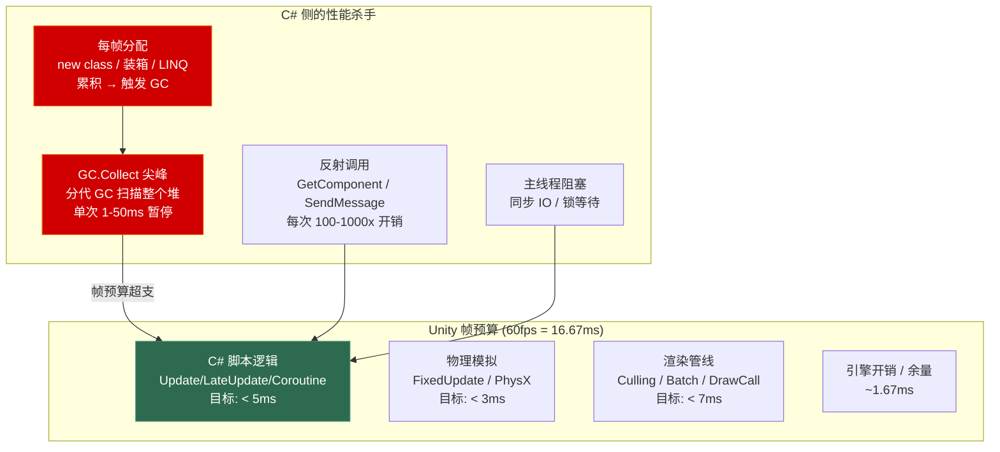
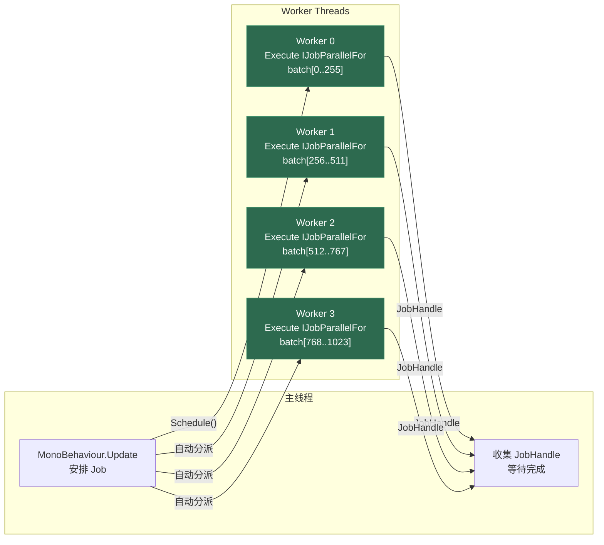
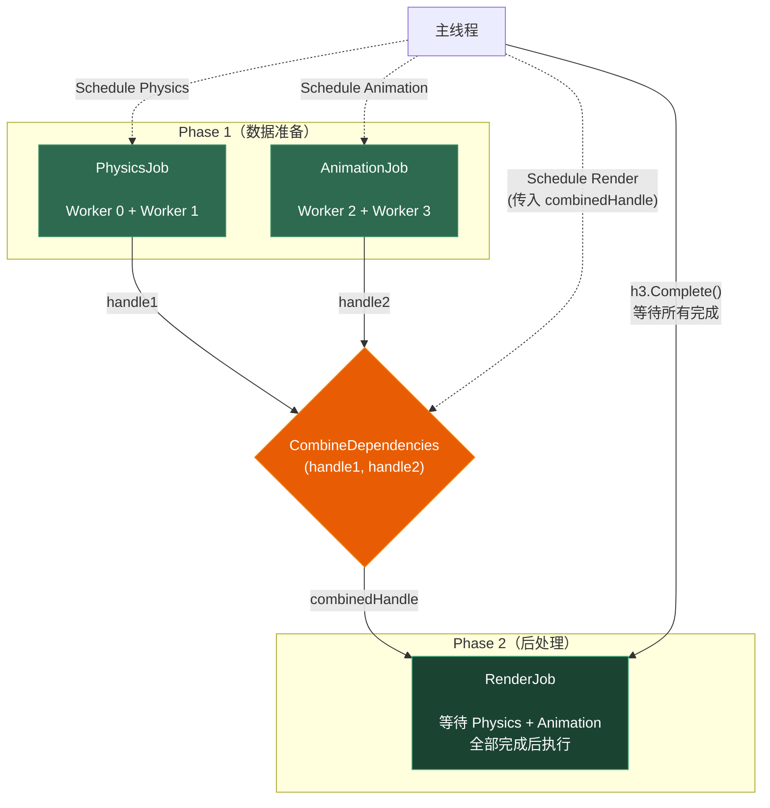

# 第十一章 Unity C# 性能优化

> **一句话理解**：Unity C# 性能优化的核心只有三件事——**控制 GC 分配**（不让垃圾产生）、**利用 Job System + Burst**（把计算移出主线程且用 SIMD 加速）、**理解 IL2CPP 的优化边界**（避免写出在 AOT 下慢 10 倍的代码）。其他优化都是这三件事的延伸。

---

## 11.1 概念直觉 —— 性能问题的根源



---

## 11.2 GC 避免 —— 最优先的优化

### 11.2.1 分配热力图

GC 问题排查的第一步不是乱改代码，而是**定位分配热点**。Unity Profiler 的 CPU Usage 模块可以按帧显示 GC Alloc 量。

```csharp
// 每帧分配检测 —— 使用 Profiler.BeginSample 定位
void Update()
{
    Profiler.BeginSample("AI.Update");
    UpdateAI();  // 如果这里分配了 2KB/帧，60fps = 120KB/s，很快触发 GC
    Profiler.EndSample();
}

// 常见的分配陷阱（每条都在产生垃圾）：
// ✗ foreach 在非数组类型上（产生 IEnumerator 装箱）
// ✗ LINQ 热路径（迭代器分配）
// ✗ string 拼接（产生中间 string）
// ✗ lambda 捕获局部变量（产生闭包类）
// ✗ 没有缓存的 GetComponent<>()（内部分配）
```

### 11.2.2 六大 GC 避免策略

**策略 1：对象池**

```csharp
public class BulletPool
{
    private readonly Queue<Bullet> _pool = new();
    private readonly Bullet _prefab;
    
    public Bullet Get(Vector3 position, Quaternion rotation)
    {
        Bullet bullet;
        if (_pool.Count > 0)
        {
            bullet = _pool.Dequeue();
            bullet.gameObject.SetActive(true);
        }
        else
        {
            bullet = Object.Instantiate(_prefab);
        }
        bullet.transform.SetPositionAndRotation(position, rotation);
        return bullet;
    }
    
    public void Return(Bullet bullet)
    {
        bullet.gameObject.SetActive(false);
        _pool.Enqueue(bullet);
    }
}
```

**策略 2：struct 替代 class**

参考[第一章](01_type_system.md#13-struct-与-class-的选择)——高频创建的数据使用 `struct` 避免堆分配：

```csharp
// ✗ 每帧 1000 个 Entity 状态查询 → 1000 次堆分配
class EntityState { public int HP; public Vector3 Position; }

// ✓ 值类型 —— 零 GC 分配
struct EntityState { public int HP; public Vector3 Position; }

// 但注意：struct 不要太大（超过 16-24 字节时复制成本超过分配成本）
```

**策略 3：缓存组件引用**

```csharp
public class OptimizedComponent : MonoBehaviour
{
    // ✗ 错误示范
    void Update()
    {
        GetComponent<Rigidbody>().AddForce(Vector3.up);    // 每次分配 + 查找
        GetComponent<Renderer>().material.color = Color.red; // material 产生新实例！
    }
    
    // ✓ 缓存引用
    private Rigidbody _rb;
    private Renderer _renderer;
    
    void Awake()
    {
        _rb = GetComponent<Rigidbody>();
        _renderer = GetComponent<Renderer>();
    }
    
    void Update()
    {
        _rb.AddForce(Vector3.up);
        _renderer.sharedMaterial.color = Color.red;  // sharedMaterial 不复制
    }
}
```

**策略 4：避免装箱**

```csharp
// ✗ 隐式装箱
int damage = 100;
string message = "造成 " + damage + " 点伤害";     // int → string 需要 int.ToString()
Debug.Log(damage);                                   // Debug.Log(object) → 装箱

// ✓ 避免
string message = $"造成 {damage} 点伤害";            // string interpolation 内部避免装箱
Debug.Log(damage.ToString());                         // 显式调用，但大多数情况下没必要

// ✗ 最隐蔽的装箱：将 struct 当作 interface 使用
struct DamageInfo : ICombatInfo { public int Value; }
ICombatInfo info = new DamageInfo { Value = 100 };   // 装箱！
int v = info.Value;                                    // 每次访问都在装箱的对象上

// ✓ 使用泛型约束避免装箱
void Process<T>(T info) where T : ICombatInfo
{
    int v = info.Value;  // 无装箱——JIT 为每种 T 生成直接调用
}
```

**策略 5：StringBuilder 缓存与字符串优化**

```csharp
// ✗ 热路径中的字符串拼接
string uiText = "HP: " + currentHP + " / " + maxHP + " (" + percentage + "%)";
// 分配 5 个中间 string

// ✓ StringBuilder 缓存
private StringBuilder _uiBuilder = new StringBuilder(100);
void UpdateUI(int currentHP, int maxHP)
{
    _uiBuilder.Clear();  // 不重新分配！
    _uiBuilder.Append("HP: ");
    _uiBuilder.Append(currentHP);
    _uiBuilder.Append(" / ");
    _uiBuilder.Append(maxHP);
    _uiBuilder.Append(" (");
    _uiBuilder.Append(currentHP * 100 / maxHP);
    _uiBuilder.Append("%)");
    _uiText.text = _uiBuilder.ToString();
}
```

**策略 6：避免 foreach 在 List 上的分配**

```csharp
// ✗ 在 Unity 旧版本 Mono 中，foreach List<T> 有装箱
foreach (var enemy in _enemies)  // 旧 Mono: IEnumerator<T> 装箱
    enemy.UpdateAI();

// ✓ 使用 for 循环（零分配）
for (int i = 0; i < _enemies.Count; i++)
    _enemies[i].UpdateAI();

// .NET Core / 新版本中 foreach 已无装箱，但 for 仍比 foreach 略快（少一次 MoveNext 调用）
```

---

## 11.3 Job System —— 多线程任务调度

### 11.3.1 概念直觉

Unity C# Job System 允许将计算密集型任务分配到工作线程执行，利用多核 CPU。



### 11.3.2 IJobParallelFor —— 最常用的 Job

```csharp
using Unity.Jobs;
using Unity.Collections;
using Unity.Burst;

// 定义一个 Job
[BurstCompile]  // 启用 Burst 编译
public struct MoveJob : IJobParallelFor
{
    [ReadOnly] public NativeArray<Vector3> Directions;   // 只读输入
    [ReadOnly] public float DeltaTime;
    public NativeArray<Vector3> Positions;                // 可写输出
    
    public void Execute(int index)
    {
        // Burst 将此函数编译为高度优化的机器码（可能包含 SIMD 指令）
        Positions[index] += Directions[index] * DeltaTime;
    }
}

// 在 MonoBehaviour 中调度
public class MovementSystem : MonoBehaviour
{
    private NativeArray<Vector3> _positions;
    private NativeArray<Vector3> _directions;
    
    void Update()
    {
        var job = new MoveJob
        {
            Directions = _directions,
            DeltaTime = Time.deltaTime,
            Positions = _positions
        };
        
        // Schedule: 并行执行，batchSize 控制每个 worker 的批大小
        JobHandle handle = job.Schedule(_positions.Length, batchSize: 64);
        
        // 可以继续在主线程调度其他 Job...
        
        // 最终：等待 Job 完成
        handle.Complete();
        
        // 现在 _positions 已更新，可以用于渲染
    }
    
    void OnDestroy()
    {
        // NativeArray 必须手动释放！
        _positions.Dispose();
        _directions.Dispose();
    }
}
```

### 11.3.3 Job 的依赖链

```csharp
// 复杂的多阶段计算
var phase1 = new Phase1Job { Input = rawData, Output = phase1Result };
var phase2 = new Phase2Job { Input = phase1Result, Output = phase2Result };

// phase2 依赖 phase1 的输出
JobHandle handle1 = phase1.Schedule(dataLength, 64);
JobHandle handle2 = phase2.Schedule(dataLength, 64, handle1);  // 传入依赖

// 两个独立的 Job 可以并行
var physicsJob = new PhysicsJob { /* ... */ };
var animationJob = new AnimationJob { /* ... */ };
JobHandle h1 = physicsJob.Schedule(count, 32);
JobHandle h2 = animationJob.Schedule(count, 32);

// 合并多个依赖——合并后的 Job 等 h1 和 h2 都完成才执行
var renderJob = new RenderJob { /* ... */ };
JobHandle combinedHandle = JobHandle.CombineDependencies(h1, h2);
JobHandle h3 = renderJob.Schedule(count, 32, combinedHandle);

// 等待所有完成
h3.Complete();
```



### 11.3.4 NativeContainer 类型

| 类型 | 用途 | 线程安全 |
|------|------|---------|
| `NativeArray<T>` | 连续数组 | 读写保护（schedule 自动加锁） |
| `NativeList<T>` | 可变长度列表 | 并行写入受限 |
| `NativeHashMap<K,V>` | 哈希映射 | 仅 ParallelWriter 支持并行写入 |
| `NativeQueue<T>` | 队列 | 仅主线程写入 |
| `NativeStream` | 每个线程独立的输出流 | 并行安全（天然隔离） |

---

## 11.4 Burst Compiler —— LLVM 后端优化

### 11.4.1 Burst 的核心原理

Burst Compiler 将 C# IL 通过 LLVM 编译为高度优化的本机代码：

```
C# Job 代码 → IL 字节码 → Burst (LLVM) → 优化的机器码
                                         ↓
                              ● SIMD 自动向量化
                              ● 循环展开
                              ● 常量折叠与传播
                              ● 内联展开（跨函数调用）
                              ● 死代码消除
```

### 11.4.2 Burst 的适用与不适用

```csharp
// ✓ Burst 极适合的场景（纯计算、无引用类型、无 Unity API 调用）
[BurstCompile]
public struct CalculateDamageJob : IJobParallelFor
{
    [ReadOnly] public NativeArray<float> AttackStats;
    [ReadOnly] public NativeArray<float> DefenseStats;
    [ReadOnly] public NativeArray<ElementType> Elements;
    public NativeArray<float> Results;
    
    public void Execute(int i)
    {
        // 纯数学计算 → Burst 优化到极致
        float baseDmg = AttackStats[i];
        float defense = DefenseStats[i];
        
        // Burst 会将这些分支编译为条件移动指令 (cmov) 避免分支预测失败
        float reduction = defense / (defense + 200f);
        float elementMod = Elements[i] switch
        {
            ElementType.Fire => 1.2f,
            ElementType.Ice => 0.8f,
            _ => 1.0f
        };
        
        Results[i] = baseDmg * (1f - reduction) * elementMod;
    }
}

// ✗ Burst 不支持的
// - 任何引用类型 (class) 的访问
// - Unity API 调用 (Transform, GameObject, MonoBehaviour)
// - 字符串操作
// - try-catch 异常处理
// - 虚方法调用（接口也不行）
```

### 11.4.3 Burst SIMD 示例

```csharp
[BurstCompile]
public struct VectorMultiplyJob : IJobParallelFor
{
    [ReadOnly] public NativeArray<Vector3> Vectors;
    [ReadOnly] public float Multiplier;
    public NativeArray<Vector3> Results;
    
    public void Execute(int i)
    {
        // Burst 自动检测到这是 3 分量的乘法，一次性用 SSE/NEON 指令处理
        Results[i] = Vectors[i] * Multiplier;
        // 生成的汇编大致为：
        //   movss  xmm0, [input]      ; 加载 x
        //   movss  xmm1, [input+4]    ; 加载 y
        //   movss  xmm2, [input+8]    ; 加载 z
        //   mulss  xmm0, xmm3         ; 同时乘法
        //   mulss  xmm1, xmm3
        //   mulss  xmm2, xmm3
        //   movss  [output], xmm0     ; 存储结果
        //   ...
    }
}
```

---

## 11.5 IL2CPP 专项优化

### 11.5.1 IL2CPP 下的代码大小优化

```csharp
// IL2CPP 将每个泛型实例化都生成独立的 C++ 代码
// 以下代码在 IL2CPP 下会产生巨大的代码膨胀：

// ✗ 大量泛型实例化
void ProcessAll()
{
    Process<int>(1);
    Process<float>(2f);
    Process<double>(3.0);
    Process<long>(4L);
    Process<short>(5);
    Process<byte>(6);
    // 每个 T 类型的 Process<T> 在 IL2CPP 下生成独立 C++ 代码！
}

// ✓ 减少泛型多样性
void ProcessAll()
{
    // 如果可以，尽量统一为一种类型
    ProcessFloat(1f);
    ProcessFloat(2f);
    ProcessFloat(3f);
}
```

### 11.5.2 托管代码剥离防护

IL2CPP 在构建时会剥离未直接引用的类型（Managed Code Stripping）。导致运行时 `Type.GetType()` 或反射失败：

```xml
<!-- link.xml：保护需要反射访问的类型不被剥离 -->
<linker>
    <assembly fullname="Assembly-CSharp">
        <type fullname="MyGame.Player" preserve="all" />
        <namespace fullname="MyGame.Weapons" preserve="all" />
    </assembly>
    
    <!-- 保护 System.Collections.Generic 的特定泛型实例化 -->
    <assembly fullname="mscorlib">
        <type fullname="System.Collections.Generic.List`1">
            <genericargument name="MyGame.Player" />
        </type>
    </assembly>
</linker>
```

---

## 11.6 常见陷阱与反模式

### 陷阱 1：Find 方法的隐藏开销

```csharp
// ✗ 每帧搜索
void Update()
{
    var player = GameObject.Find("Player");          // 遍历整个 Hierarchy —— O(n)
    var enemies = GameObject.FindGameObjectsWithTag("Enemy");  // 同样 O(n)
    var comp = FindObjectOfType<GameManager>();       // 遍历所有 GameObject
}

// ✓ 启动时缓存
private GameObject _player;
private GameManager _gameManager;
private List<GameObject> _enemies = new();

void Start()
{
    _player = GameObject.Find("Player");
    _gameManager = FindObjectOfType<GameManager>();
}

void OnEnable()
{
    // 如果需要动态更新敌人列表，使用事件或碰撞检测而非每帧 Find
    EnemySpawner.OnEnemySpawned += OnEnemyAdded;
    EnemySpawner.OnEnemyDestroyed += OnEnemyRemoved;
}
```

### 陷阱 2：Material 属性访问分配

```csharp
// ✗ 每帧分配新的 Material 实例
renderer.material.color = Color.red;  // .material 会 clone 一份！

// ✓ 使用 sharedMaterial（不影响其他相同材质的对象时）
renderer.sharedMaterial.color = Color.red;

// 如果需要每实例不同的材质属性，使用 MaterialPropertyBlock（零分配）
private MaterialPropertyBlock _propBlock;
void Start() => _propBlock = new MaterialPropertyBlock();

void UpdateColor(Color color)
{
    _propBlock.SetColor("_Color", color);
    renderer.SetPropertyBlock(_propBlock);  // 零分配！
}
```

### 陷阱 3：Transform 组件访问

```csharp
// ✗ Transform 的位置修改会产生矩阵重新计算
transform.position += Vector3.one * Time.deltaTime;
// 每次修改 position 都会：
// 1. 通知物理引擎
// 2. 触发 OnTransformChanged 消息
// 3. 重新计算世界矩阵
// 4. 重新计算子物体的世界矩阵

// 对于大量物体的位置更新，考虑：
// - 使用 C# Job System + TransformAccessArray
// - 或者减少 Transform 层级（摊平 Hierarchy）
```

### 陷阱 4：不必要的 Coroutine 分配

```csharp
// ✗ 每次 StartCoroutine 分配 WaitForSeconds 对象
IEnumerator BadPattern()
{
    while (true)
    {
        yield return new WaitForSeconds(0.1f);  // 每次循环都 new！
    }
}

// ✓ 缓存 YieldInstruction
private static readonly WaitForSeconds WaitPointOneSeconds = new WaitForSeconds(0.1f);

IEnumerator GoodPattern()
{
    while (true)
    {
        yield return WaitPointOneSeconds;  // 复用
    }
}

// WaitForEndOfFrame、WaitForFixedUpdate 也是同理
```

### 陷阱 5：Update 空转

```csharp
// ✗ 每个 MonoBehaviour 都有自己的 Update——即使为空
public class EmptyUpdate : MonoBehaviour
{
    void Update()
    {
        // 空的 Update 也会消耗引擎开销：
        // C++ → C# 跨域调用 + 方法查找 + 帧计数更新
        // 1000 个空 Update 可能消耗 1ms+
    }
}

// ✓ 移除非必要的 Update，使用事件驱动
public class EventDriven : MonoBehaviour
{
    void OnEnable()
    {
        GameEvents.OnTick += HandleTick;  // 只在需要时订阅
    }
    
    void OnDisable()
    {
        GameEvents.OnTick -= HandleTick;
    }
    
    void HandleTick(float deltaTime)
    {
        // 只有一个订阅点调用，而不是每组件一个 Update
    }
}
```

---

## 11.7 面试题精选

**Q1：Unity 中最常见的性能问题来源是什么？按优先级排序。**

答：优先级排序：
1. **GC 分配**：每帧的堆分配累积触发 GC，造成 1-50ms 的尖峰暂停
2. **DrawCall 过多**：每个不同材质/Shader 的渲染对象产生额外 DrawCall（非 C# 问题，但有 C# 侧的优化方法如 GPU Instancing）
3. **过多的 Update 调用**：大量 MonoBehaviour 的 Update 空转消耗 C++→C# 调用开销
4. **反射/字符串查找**：`SendMessage`、`GetComponent(string)`、`GameObject.Find()`
5. **Overdraw + 复杂 Shader**：GPU 侧瓶颈

**Q2：Unity Job System 和 C# 的 Task Parallel Library 有什么区别？**

答：
- **Job System**：Unity 原生线程池，与引擎紧密集成。Job 可以在 Burst Compiler 下编译。NativeContainer 提供自动的读写冲突检测。但不能访问 Unity API（Transform、GameObject 等）。
- **Task Parallel Library（TPL）**：C# 标准库的多线程 API（`Task.Run`、`Parallel.For`）。可以访问任何 C# API，但不能直接访问 Unity API（仍需主线程）。不与 Burst 集成。在线程池管理上不如 Job System 高效（Job System 使用 lock-free work-stealing）。

**Q3：IL2CPP 下，泛型代码的 AOT 生成有什么限制？**

答：IL2CPP 在编译时分析所有**可直接证明**的泛型实例化。对于值类型泛型，IL2CPP 尝试共享代码但如果值类型大小不同则必须生成独立版本。对于引用类型泛型，所有引用类型共享一份代码（和 JIT 一样）。限制：通过反射或用变量间接创建的泛型实例化（如 `MakeGenericType(typeof(T))`）可能被遗漏，需要 link.xml 或 `[Preserve]` 显式保留。

**Q4：Burst Compiler 为什么不能编译所有 C# 代码？**

答：Burst 的目标是高性能计算——它的类型系统限于 HPC（High-Performance Computing）子集。不支持引用类型是因为 Burst 生成无 GC 的代码（使用自己的内存管理）。不支持 Unity API 是因为 Unity 对象需要通过 C++ 互操作层访问。不支持 try-catch 是因为 Burst 追求零开销的异常模型（类似 C++ 的 `-fno-exceptions`）。

**Q5：1000 个敌人每帧移动，怎么优化？**

答：
1. **Job System + Burst**：`IJobParallelFor` 在多个 worker 线程处理，Burst SIMD 加速向量运算
2. **TransformAccessArray**：配合 Job 批量更新 Transform，避免 C#→C++ 的逐次互操作开销
3. **LOD 降频**：远处敌人每 3 帧更新一次
4. **ECS (DOTS)**：如果项目规模极大，迁移到 Entity Component System 彻底消除 MonoBehaviour 开销
5. **Animator Culling**：屏幕外敌人禁用 Animator

---

## 11.8 游戏开发实战

### 场景 1：AOE 伤害计算 —— Job System 化

```csharp
[BurstCompile]
public struct AOEDamageJob : IJobParallelFor
{
    [ReadOnly] public Vector3 Center;
    [ReadOnly] public float Radius;
    [ReadOnly] public float Damage;
    [ReadOnly] public NativeArray<Vector3> TargetPositions;
    [ReadOnly] public NativeArray<float> TargetHealths;
    
    public NativeArray<float> Results;          // 输出的新生命值
    public NativeArray<bool> WasHit;            // 哪些目标被命中
    
    public void Execute(int i)
    {
        float distSq = math.distancesq(Center, TargetPositions[i]);
        if (distSq < Radius * Radius)
        {
            // 距离越近伤害越高（线性衰减）
            float dist = math.sqrt(distSq);
            float falloff = 1f - (dist / Radius);
            Results[i] = TargetHealths[i] - Damage * falloff;
            WasHit[i] = true;
        }
        else
        {
            Results[i] = TargetHealths[i];
            WasHit[i] = false;
        }
    }
}

// 使用
public class AOESystem : MonoBehaviour
{
    private NativeArray<Vector3> _positions;
    private NativeArray<float> _healths;
    private NativeArray<float> _results;
    private NativeArray<bool> _wasHit;
    
    public void ExecuteAOE(Vector3 center, float radius, float damage)
    {
        var job = new AOEDamageJob
        {
            Center = center,
            Radius = radius,
            Damage = damage,
            TargetPositions = _positions,
            TargetHealths = _healths,
            Results = _results,
            WasHit = _wasHit
        };
        
        JobHandle handle = job.Schedule(_positions.Length, 64);
        handle.Complete();
        
        // 在主线程处理被命中的目标（触发特效、音效等 Unity API 操作）
        for (int i = 0; i < _wasHit.Length; i++)
        {
            if (_wasHit[i])
            {
                _healths[i] = _results[i];
                OnEnemyHit?.Invoke(i, damage);
            }
        }
    }
}
```

### 场景 2：零 GC UI 更新

```csharp
public class DamageNumberDisplay : MonoBehaviour
{
    // 对象池化的 Damage 数字
    private static readonly Queue<DamageNumber> _pool = new();
    
    [SerializeField] private Transform _worldSpaceCanvas;
    private readonly StringBuilder _builder = new();
    private Camera _camera;
    
    public void ShowDamage(Vector3 worldPos, float damage, bool isCritical)
    {
        var display = GetOrCreate();
        display.transform.position = worldPos;
        
        _builder.Clear();
        _builder.Append(isCritical ? "<color=red>" : "");
        _builder.Append(Mathf.CeilToInt(damage));
        _builder.Append(isCritical ? "</color>" : "");
        
        display.SetText(_builder.ToString());
        display.PlayAnimation();
    }
    
    private DamageNumber GetOrCreate()
    {
        return _pool.Count > 0 ? _pool.Dequeue() : Instantiate(_prefab, _worldSpaceCanvas);
    }
    
    public static void Return(DamageNumber number) => _pool.Enqueue(number);
}
```

### 场景 3：Burst 加速的曲线计算

```csharp
[BurstCompile]
public struct EvaluateCurveJob : IJobParallelFor
{
    [ReadOnly] public NativeArray<Keyframe> Keyframes;  // 序列化的关键帧
    [ReadOnly] public int KeyframeCount;
    [ReadOnly] public NativeArray<float> Inputs;
    public NativeArray<float> Outputs;
    
    public void Execute(int i)
    {
        float t = Inputs[i];
        
        // 查找 t 所在的段（Burst 优化的二分查找）
        int segment = 0;
        for (int k = 1; k < KeyframeCount; k++)
        {
            if (Keyframes[k].time > t)
                break;
            segment = k;
        }
        
        // 线性插值
        var k0 = Keyframes[segment];
        var k1 = Keyframes[math.min(segment + 1, KeyframeCount - 1)];
        
        float localT = (t - k0.time) / math.max(k1.time - k0.time, 0.0001f);
        Outputs[i] = math.lerp(k0.value, k1.value, localT);
    }
}
```

---

## 11.9 三十秒速答

| 问题 | 答案 |
|------|------|
| **GC 的单项最大优化？** | 对象池 + struct 替代 class——消除高频分配 |
| **Job System 适合什么？** | 纯计算、无 Unity API 访问、可并行的数据批量处理 |
| **Burst 的核心价值？** | LLVM 编译 C# IL → 高度优化机器码，自动 SIMD 向量化 |
| **IL2CPP 下最大陷阱？** | Managed Code Stripping 删除了反射需要的类型 → link.xml 保护 |
| **foreach vs for？** | 新版 .NET 区别不大，旧 Mono foreach 有装箱；在热路径用 for 更心安 |
| **Material.material 为什么危险？** | 每次访问都 clone 一份新 Material——GC 分配 + 增加 DrawCall |

---

## 11.10 延伸阅读

- [[01_type_system]](01_type_system.md) —— struct vs class 选择与 Span&lt;T&gt; 的零分配栈操作
- [[02_gc_and_resource_management]](02_gc_and_resource_management.md) —— GC 触发机制与分代回收细节
- [[05_generics_and_collections]](05_generics_and_collections.md) —— 集合性能参考表与选择决策
- [[09_clr_and_compilation]](09_clr_and_compilation.md) —— IL2CPP 深度剖析
- [[10_monobehaviour_in_depth]](10_monobehaviour_in_depth.md) —— 序列化与 MonoBehaviour 生命周期
- [Unity DOTS Documentation](https://docs.unity3d.com/Packages/com.unity.entities@1.0/manual/index.html)
- [Burst User Guide](https://docs.unity3d.com/Packages/com.unity.burst@1.8/manual/index.html)
