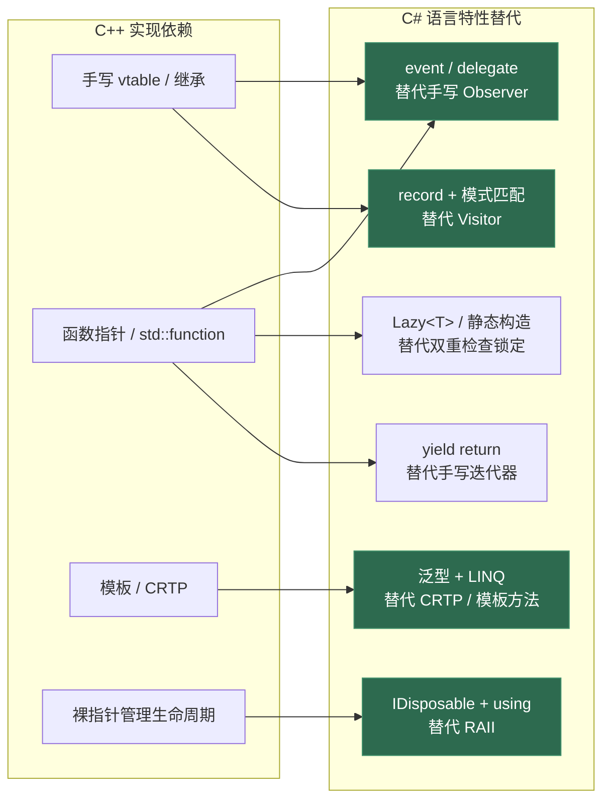
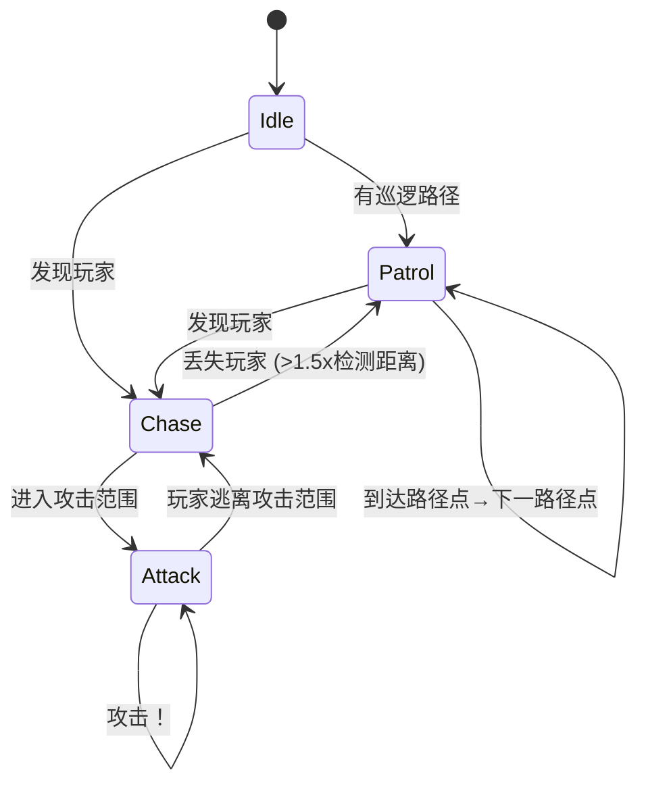

```mermaid
sequenceDiagram
    participant Player as Player (发布者)
    box rgb(30, 41, 59) 委托与事件机制 (MulticastDelegate)
        participant Event as OnHealthChanged (事件)
    end
    participant HealthBar as HealthBarUI (订阅者)
    participant VFX as VFXController (订阅者)
    participant Audio as AudioManager (订阅者)
    
    Note over HealthBar,Audio: 初始化或Awake时挂载监听
    HealthBar->>Event: += OnHealthChanged
    VFX->>Event: += OnHealthChanged
    Audio->>Event: += OnHealthChanged
    
    rect rgb(45, 106, 79)
        Note over Player: 【事件触发阶段】
        Player->>Player: HP 从 100 变为 80
        Player->>Event: Invoke(100, 80)
    end
    
    rect rgb(27, 67, 50)
        Note over Event: 【底层委托链轮询通知】
        Event->>HealthBar: UpdateHealthBar(100, 80)
        Event->>VFX: OnHurt(20)
        Event->>Audio: PlaySound("hit")
    end
    
    Note over HealthBar,Audio: 所有订阅者同步在主线程执行响应
```

# 第十二章 C# 设计模式与游戏架构

> **一句话理解**：设计模式在 C# 中的实现与 C++ 截然不同——C# 的 `event`、`delegate`、泛型、`record`、LINQ、`using` 语句让大量模式可以**用语言特性直接表达，而非手写样板代码**。理解这种表达方式的差异，是校招面试中体现"语言驾驭能力"的关键。

---

## 12.1 C# 特性如何重塑设计模式



**关键对比**：C++ 中许多模式需要手动实现（拷贝构造控制、虚析构、线程安全、引用计数），C# 通过语言特性和运行时提供了更安全的替代方案。但这不意味着不需要理解模式——理解模式帮助你选择正确特性，而非盲用。

---

## 12.2 单例模式 —— C# 的五种线程安全实现

### 12.2.1 静态构造器实现（最推荐）

```csharp
// C# 最简洁安全的单例 —— CLR 保证静态构造器只执行一次
public sealed class AudioManager
{
    public static AudioManager Instance { get; } = new AudioManager();
    
    private AudioManager()
    {
        // 初始化逻辑
    }
}

// 原理：CLR 保证类型初始化器（Type Initializer）的线程安全
// 编译后等价于：
//   static AudioManager()
//   {
//       Instance = new AudioManager();
//   }
// CLR 在访问 AudioManager.Instance 之前自动且仅执行一次静态构造器
```

### 12.2.2 Lazy&lt;T&gt; 实现（延迟初始化）

```csharp
// 需要延迟初始化（避免启动时分配）用 Lazy<T>
public sealed class ConfigManager
{
    private static readonly Lazy<ConfigManager> _lazy = 
        new Lazy<ConfigManager>(() => new ConfigManager(), 
                                LazyThreadSafetyMode.ExecutionAndPublication);
    
    public static ConfigManager Instance => _lazy.Value;
    
    private ConfigManager() { /* 首次访问时才初始化 */ }
}

// LazyThreadSafetyMode 选项：
// - None: 无线程安全保证（最快）
// - PublicationOnly: 允许多线程创建，只有一个赢家（Lock-Free，适合高并发）
// - ExecutionAndPublication: 保证只执行一次（默认，最安全）
```

### 12.2.3 Unity 中的 MonoBehaviour 单例

```csharp
// Unity 特有的单例模式 —— 需要挂载到 GameObject
public class GameManager : MonoBehaviour
{
    public static GameManager Instance { get; private set; }
    
    void Awake()
    {
        if (Instance != null && Instance != this)
        {
            Destroy(gameObject);  // 重复实例 → 销毁
            return;
        }
        
        Instance = this;
        DontDestroyOnLoad(gameObject);  // 跨场景保留
    }
}

// 泛型单例基类（避免每个 Manager 都写一遍）
public abstract class Singleton<T> : MonoBehaviour where T : Singleton<T>
{
    public static T Instance { get; private set; }
    
    protected virtual void Awake()
    {
        if (Instance != null && Instance != this)
        {
            Destroy(gameObject);
            return;
        }
        Instance = (T)this;
    }
}

// 使用
public class AudioManager : Singleton<AudioManager>
{
    protected override void Awake()
    {
        base.Awake();  // 不要省略！
        _audioSource = GetComponent<AudioSource>();
    }
    private AudioSource _audioSource;
}
```

### 12.2.4 单例的反模式与测试

```csharp
// 问题：单例让单元测试变得困难
public class PlayerHealth : MonoBehaviour
{
    void TakeDamage(int damage)
    {
        AudioManager.Instance.PlaySound("hit");  // 强依赖单例
        // 测试时怎么 mock AudioManager？
    }
}

// 解决方案：依赖注入
public class PlayerHealth : MonoBehaviour
{
    [SerializeField] private AudioManager _audioManager;  // Inspector 拖入
    
    void TakeDamage(int damage)
    {
        _audioManager.PlaySound("hit");  // 可替换为 mock
    }
}

// 或者：服务定位器 + 接口
public interface IAudioService
{
    void PlaySound(string soundId);
}

public static class ServiceLocator
{
    private static readonly Dictionary<Type, object> _services = new();
    
    public static void Register<T>(T service) => _services[typeof(T)] = service;
    public static T Get<T>() => (T)_services[typeof(T)];
}

// 生产代码
ServiceLocator.Register<IAudioService>(new AudioManager());

// 测试代码
ServiceLocator.Register<IAudioService>(new MockAudioService());
```

---

## 12.3 Observer 模式 —— event 关键字就是答案

### 12.3.1 C# event 的重塑

在 C++ 中实现 Observer 需要手写 `std::vector<std::function<void(Args...)>>` + `AddListener` + `RemoveListener` 等。C# 的 `event` 关键字直接提供了类型安全的观察者模式：

```csharp
// C# 一行 event 等价于 C++ 中 30+ 行的观察者实现
public class Player
{
    // event 关键字 = 编译期生成 add/remove 访问器（见第三章 3.3 节）
    public event Action<int, int> OnHealthChanged;  // (oldHP, newHP)
    public event Action OnDied;
    
    private int _hp;
    public int HP
    {
        get => _hp;
        private set
        {
            if (_hp == value) return;
            int oldHP = _hp;
            _hp = value;
            OnHealthChanged?.Invoke(oldHP, _hp);
            if (_hp <= 0) OnDied?.Invoke();
        }
    }
}

// 订阅方
public class HealthBarUI : MonoBehaviour
{
    [SerializeField] private Player _player;
    
    void OnEnable()
    {
        _player.OnHealthChanged += UpdateHealthBar;
        _player.OnDied += ShowDeathScreen;
    }
    
    void OnDisable()
    {
        _player.OnHealthChanged -= UpdateHealthBar;  // 务必备份取消订阅！
        _player.OnDied -= ShowDeathScreen;
    }
    
    void UpdateHealthBar(int oldHP, int newHP)
    {
        _slider.value = (float)newHP / _player.MaxHP;
    }
    
    void ShowDeathScreen() { /* ... */ }
    private Slider _slider;
}
```

### 12.3.2 UnityEvent —— 在 Inspector 中连线

```csharp
using UnityEngine.Events;
using System;

// Unity 提供了两种可序列化的事件类型
public class InteractiveObject : MonoBehaviour
{
    // UnityEvent：可在 Inspector 中拖拽绑定（无参数）
    [SerializeField] private UnityEvent _onInteracted;
    
    // UnityEvent<T>：带参数的 Inspector 可绑定事件
    [SerializeField] private UnityEvent<GameObject> _onTargetAcquired;
    
    // 如果只需要纯代码绑定，用 C# 原生 event（性能更好）
    public event Action OnInteracted;
    public event Action<GameObject> OnTargetAcquired;
    
    void OnTriggerEnter(Collider other)
    {
        _onTargetAcquired?.Invoke(other.gameObject);
        OnTargetAcquired?.Invoke(other.gameObject);
    }
}

// 性能提示：UnityEvent 使用反射调用目标方法
// 热路径上建议使用 C# event/delegate（静态绑定，性能更好）
```



---

## 12.4 命令模式 —— 在 Unity 中实现撤销/重做

### 12.4.1 C# 接口 + 闭包的实现

```csharp
// 传统接口方式
public interface ICommand
{
    void Execute();
    void Undo();
}

// 使用 C# 闭包简化（适合简单命令）
public class CommandManager
{
    private readonly Stack<Action> _undoStack = new();
    private readonly Stack<Action> _redoStack = new();
    
    public void Execute(Action doAction, Action undoAction)
    {
        doAction();
        _undoStack.Push(undoAction);  // push 反过来 —— Undo 时执行
        _redoStack.Clear();           // 新命令清空 Redo 栈
    }
    
    public void Undo()
    {
        if (_undoStack.Count == 0) return;
        var undoAction = _undoStack.Pop();
        undoAction();
        // 注意：这里需要把 redo 信息也入栈（简化示例略）
    }
    
    public void Redo()
    {
        if (_redoStack.Count == 0) return;
        var redoAction = _redoStack.Pop();
        redoAction();
    }
}

// 使用示例
public class EditorController : MonoBehaviour
{
    private readonly CommandManager _commands = new();
    
    void MovePlayer(Vector3 newPosition)
    {
        Vector3 oldPosition = transform.position;
        
        _commands.Execute(
            doAction: () => transform.position = newPosition,
            undoAction: () => transform.position = oldPosition  // 闭包捕获了 oldPosition！
        );
    }
    
    void Update()
    {
        if (Input.GetKey(KeyCode.LeftControl))
        {
            if (Input.GetKeyDown(KeyCode.Z)) _commands.Undo();
            if (Input.GetKeyDown(KeyCode.Y)) _commands.Redo();
        }
    }
}
```

### 12.4.2 经典接口命令 —— 复杂操作

```csharp
// 对于复杂命令（序列化、保存、网络同步），用经典的接口方式
public interface ICommand
{
    void Execute();
    void Undo();
    string Description { get; }  // 显示在 UI 中
}

public class SpawnEnemyCommand : ICommand
{
    private readonly EnemyConfig _config;
    private readonly Vector3 _position;
    private Enemy _spawnedEnemy;
    
    public string Description => $"生成 {_config.name}";
    
    public SpawnEnemyCommand(EnemyConfig config, Vector3 position)
    {
        _config = config;
        _position = position;
    }
    
    public void Execute()
    {
        _spawnedEnemy = EnemyFactory.Create(_config, _position);
    }
    
    public void Undo()
    {
        if (_spawnedEnemy != null)
            Object.Destroy(_spawnedEnemy.gameObject);
    }
}
```

---

## 12.5 策略模式 —— delegate 直接替代接口

### 12.5.1 C# 中的策略可以直接用 delegate 表达

```csharp
// C++ 中策略模式需要：抽象基类 + 多态 + 手动管理生命周期
// C# 中一个 Func<> 或 Action 就足够了：

// === C# delegate 方式（适合单方法策略） ===
public class AIController : MonoBehaviour
{
    private Func<Vector3> _moveStrategy;
    
    public void SetMovementStrategy(Func<Vector3> strategy)
    {
        _moveStrategy = strategy;
    }
    
    void Update()
    {
        if (_moveStrategy != null)
        {
            Vector3 direction = _moveStrategy();
            transform.Translate(direction * Time.deltaTime);
        }
    }
}

// 使用
var ai = enemy.GetComponent<AIController>();
ai.SetMovementStrategy(() => (player.position - enemy.position).normalized);      // 追击
ai.SetMovementStrategy(() => Random.insideUnitSphere);                            // 巡逻
ai.SetMovementStrategy(() => Vector3.zero);                                       // 待机

// === 需要状态的策略：仍然用接口 ===
public interface IMovementStrategy
{
    Vector3 GetDirection(Vector3 currentPos, float deltaTime);
}

public class PatrolStrategy : IMovementStrategy
{
    private readonly Vector3[] _waypoints;
    private int _currentWaypoint;
    
    public Vector3 GetDirection(Vector3 currentPos, float deltaTime)
    {
        // 巡逻逻辑：走向路径点，到达后切换下一个
        Vector3 target = _waypoints[_currentWaypoint];
        if (Vector3.Distance(currentPos, target) < 0.1f)
            _currentWaypoint = (_currentWaypoint + 1) % _waypoints.Length;
        return (target - currentPos).normalized;
    }
    
    public PatrolStrategy(Vector3[] waypoints) => _waypoints = waypoints;
}
```

---

## 12.6 对象池 —— 泛型 + IDisposable

参考[第十一章](11_unity_performance.md#1122-六大-gc-避免策略)的 GC 避免。这里展示完整的泛型对象池实现：

```csharp
// 泛型对象池：用 IDisposable 保证归还
public class ObjectPool<T> where T : class, new()
{
    private readonly ConcurrentBag<T> _pool = new();
    private readonly Action<T> _onRent;    // 取出时的初始化
    private readonly Action<T> _onReturn;  // 归还时的清理
    
    public ObjectPool(Action<T> onRent = null, Action<T> onReturn = null)
    {
        _onRent = onRent;
        _onReturn = onReturn;
    }
    
    public T Rent()
    {
        if (!_pool.TryTake(out var item))
            item = new T();
        _onRent?.Invoke(item);
        return item;
    }
    
    public void Return(T item)
    {
        _onReturn?.Invoke(item);
        _pool.Add(item);
    }
    
    // 用 IDisposable 保证自动归还（类似 RAII）
    public RentHandle RentScoped(out T item)
    {
        item = Rent();
        return new RentHandle(this, item);
    }
    
    public readonly struct RentHandle : IDisposable
    {
        private readonly ObjectPool<T> _pool;
        private readonly T _item;
        
        public RentHandle(ObjectPool<T> pool, T item)
        {
            _pool = pool;
            _item = item;
        }
        
        public void Dispose() => _pool.Return(_item);
    }
}

// 使用 IDisposable 保证归还（using 语句）
void ProcessDamage()
{
    using (var handle = _damageInfoPool.RentScoped(out var info))
    {
        info.Calculate(target);
        _ui.ShowDamage(info.Value);
    }  // Dispose 时自动归还
}
```

---

## 12.7 游戏架构模式 —— Unity 中的实际应用

### 12.7.1 EventBus —— 跨系统解耦

```csharp
// 轻量级事件总线 —— 解耦不同系统
public static class EventBus
{
    private static readonly Dictionary<Type, Delegate> _handlers = new();
    
    public static void Subscribe<T>(Action<T> handler) where T : struct
    {
        var type = typeof(T);
        if (_handlers.ContainsKey(type))
            _handlers[type] = Delegate.Combine(_handlers[type], handler);
        else
            _handlers[type] = handler;
    }
    
    public static void Unsubscribe<T>(Action<T> handler) where T : struct
    {
        var type = typeof(T);
        if (_handlers.ContainsKey(type))
            _handlers[type] = Delegate.Remove(_handlers[type], handler);
    }
    
    public static void Publish<T>(T eventData) where T : struct
    {
        if (_handlers.TryGetValue(typeof(T), out var handler))
            (handler as Action<T>)?.Invoke(eventData);
    }
}

// 事件定义（使用 struct 避免堆分配）
public struct EnemyKilledEvent
{
    public GameObject Enemy;
    public int ExperienceGranted;
}

public struct ItemCollectedEvent
{
    public string ItemId;
    public int Count;
}

// 使用
public class ExpSystem : MonoBehaviour
{
    void OnEnable()  => EventBus.Subscribe<EnemyKilledEvent>(OnEnemyKilled);
    void OnDisable() => EventBus.Unsubscribe<EnemyKilledEvent>(OnEnemyKilled);
    
    void OnEnemyKilled(EnemyKilledEvent e)
    {
        _playerExp += e.ExperienceGranted;
    }
    private int _playerExp;
}

public class CombatSystem : MonoBehaviour
{
    void OnEnemyDeath(GameObject enemy)
    {
        EventBus.Publish(new EnemyKilledEvent
        {
            Enemy = enemy,
            ExperienceGranted = 100
        });
    }
}
```

### 12.7.2 组件模式 —— MonoBehaviour 本身就是

Unity 的 GameObject + MonoBehaviour 就是组件模式的原生实现。这里的重点是**如何在 Unity 组件风格下组织代码**：

```csharp
// 单一职责的组件拆分 —— 每个组件只做一件事
public class HealthComponent : MonoBehaviour
{
    [SerializeField] private int _maxHP = 100;
    private int _currentHP;
    
    public bool IsAlive => _currentHP > 0;
    public event Action OnDied;
    
    void Awake() => _currentHP = _maxHP;
    
    public void TakeDamage(int amount)
    {
        if (!IsAlive) return;
        _currentHP -= amount;
        if (_currentHP <= 0)
        {
            _currentHP = 0;
            OnDied?.Invoke();
        }
    }
}

public class MovementComponent : MonoBehaviour
{
    [SerializeField] private float _speed = 5f;
    private CharacterController _controller;
    
    void Awake() => _controller = GetComponent<CharacterController>();
    
    public void Move(Vector3 direction)
    {
        _controller.Move(direction * _speed * Time.deltaTime);
    }
}

public class AttackComponent : MonoBehaviour
{
    [SerializeField] private float _damage = 10f;
    [SerializeField] private float _range = 2f;
    
    public void Attack(HealthComponent target)
    {
        if (Vector3.Distance(transform.position, target.transform.position) <= _range)
            target.TakeDamage(Mathf.RoundToInt(_damage));
    }
}

// 组装
// 一个 Enemy GameObject 挂载：HealthComponent + MovementComponent + AttackComponent
// 一个 Prop GameObject 只需挂载：HealthComponent（不需要移动和攻击）
// 每个组件独立、可测试、可复用
```

### 12.7.3 状态模式 —— record + 模式匹配

这是 C# 现代特性重塑经典模式的典型案例：

```csharp
// 用 record 定义状态（不可变数据）
public abstract record EnemyState;
public record IdleState : EnemyState;
public record PatrolState(Vector3[] Waypoints, int CurrentIndex) : EnemyState;
public record ChaseState(Transform Target, float LastKnownDistance) : EnemyState;
public record AttackState(Transform Target, float CooldownRemaining) : EnemyState;

// 状态机：模式匹配驱动转换
public class EnemyStateMachine : MonoBehaviour
{
    private EnemyState _state = new IdleState();
    
    void Update()
    {
        _state = _state switch
        {
            IdleState idle => HandleIdle(idle),
            PatrolState patrol => HandlePatrol(patrol),
            ChaseState chase => HandleChase(chase),
            AttackState attack => HandleAttack(attack),
            _ => _state
        };
    }
    
    EnemyState HandleIdle(IdleState idle)
    {
        if (CanSeePlayer(out var target))
            return new ChaseState(target, Vector3.Distance(transform.position, target.position));
        if (_patrolPath.Length > 0)
            return new PatrolState(_patrolPath, 0);
        return idle;  // 保持当前状态
    }
    
    EnemyState HandleChase(ChaseState chase)
    {
        float dist = Vector3.Distance(transform.position, chase.Target.position);
        transform.position = Vector3.MoveTowards(transform.position, chase.Target.position, _speed * Time.deltaTime);
        
        if (dist <= _attackRange)
            return new AttackState(chase.Target, _attackCooldown);
        if (dist > _detectionRange * 1.5f)
            return new PatrolState(_patrolPath, 0);
        
        return chase with { LastKnownDistance = dist };  // 更新状态（with = 新对象）
    }
    
    EnemyState HandlePatrol(PatrolState patrol)
    {
        var target = patrol.Waypoints[patrol.CurrentIndex];
        transform.position = Vector3.MoveTowards(transform.position, target, _patrolSpeed * Time.deltaTime);
        
        int nextIndex = patrol.CurrentIndex;
        if (Vector3.Distance(transform.position, target) < 0.1f)
            nextIndex = (patrol.CurrentIndex + 1) % patrol.Waypoints.Length;
        
        if (CanSeePlayer(out var player))
            return new ChaseState(player, Vector3.Distance(transform.position, player));
        
        return patrol with { CurrentIndex = nextIndex };
    }
    
    EnemyState HandleAttack(AttackState attack)
    {
        if (attack.CooldownRemaining > 0)
            return attack with { CooldownRemaining = attack.CooldownRemaining - Time.deltaTime };
        
        // 执行攻击
        DealDamage(attack.Target);
        
        float dist = Vector3.Distance(transform.position, attack.Target.position);
        if (dist > _attackRange)
            return new ChaseState(attack.Target, dist);
        
        return new AttackState(attack.Target, _attackCooldown);
    }
    
    // 在 Inspector 中配置
    [SerializeField] private float _speed = 3f;
    [SerializeField] private float _patrolSpeed = 1.5f;
    [SerializeField] private float _detectionRange = 10f;
    [SerializeField] private float _attackRange = 2f;
    [SerializeField] private float _attackCooldown = 1f;
    [SerializeField] private Vector3[] _patrolPath;
    
    private bool CanSeePlayer(out Transform target) { /* 检测逻辑 */ target = null; return false; }
    private void DealDamage(Transform target) { target.GetComponent<HealthComponent>()?.TakeDamage(20); }
}
```



---

## 12.8 C++ 程序员对照：模式实现差异

| 模式 | C++ 实现成本 | C# 实现成本 |
|------|------------|-----------|
| **Singleton** | 双重检查锁定 + `static` 局部变量 | `Lazy<T>` 或静态属性（CLR 保证线程安全） |
| **Observer** | `std::vector<std::function<>>` + 手动管理 | `event` 关键字（编译器生成 add/remove） |
| **Command** | 抽象基类 + `std::unique_ptr` 管理 | 接口 + `Action` 闭包（无内存管理负担） |
| **Strategy** | 继承 + 虚函数 | `Func<>` delegate 或接口（delegate 更轻量） |
| **Object Pool** | `std::stack<T*>` + 手动 new/delete | 泛型 `ConcurrentBag<T>`（线程安全内置） |
| **State** | 继承 + 状态转换表 | `record` + 模式匹配 `switch`（不可变状态） |
| **Visitor** | 双层虚函数派生（最复杂的 GoF 模式） | `record` + 模式匹配（彻底消除 Visitor） |
| **Iterator** | 手写迭代器类 | `yield return` 或 LINQ（编译器生成迭代器） |

---

## 12.9 面试题精选

**Q1：C# 中经典 GoF 的 Visitor 模式为什么几乎不需要了？**

答：Visitor 模式的本质是"对一个类型层次中的每个类型做不同操作"。C# 7+ 的**模式匹配**（特别是 `switch` 表达式 + 属性模式）直接提供了等价能力，且更简洁。见 [8.2](08_pattern_matching_and_modern_csharp.md#82-模式匹配全谱系) 节的例子。对 `record` 类型层次，`switch` 表达式自动检测穷举性，比 Visitor 模式的手动派生更安全。但 Visitor 在需要"跨编译单元扩展操作"的场景（如编译器 AST 遍历）中仍有价值。

**Q2：C# 的 event 和 UnityEvent 有什么区别，何时用哪个？**

答：
- **C# event**：语法级支持，编译期静态绑定，性能好。不能序列化，不能在 Inspector 中配置。适合纯代码逻辑。
- **UnityEvent**：`UnityEngine.Events.UnityEvent`，支持序列化（Inspector 中拖拽绑定），使用反射调用目标方法（性能较低）。适合需要在 Editor 中配置的场景（按钮点击、触发器等）。
- **建议**：热路径（Update 中频繁调用）用 C# event；编辑器配置用 UnityEvent。

**Q3：lazy singleton 使用 `Lazy<T>` 和静态构造器有什么区别？**

答：
- **静态构造器**：在类型被 CLR 访问时立即执行（eager-ish），但执行时机由 CLR 决定——可能在首次访问 `Instance` 之前就触发了。
- **`Lazy<T>`**：保证在实际访问 `Value` 时才创建实例（真正的 lazy）。更精确控制初始化时机。可以配置线程安全模式。
- **性能**：静态属性版本不需要 `Lazy<T>` 的间接调用，微基准下略快。实际使用中差异可忽略。

**Q4：在 Unity 中，为什么传统的 GoF 装饰器模式很少见？**

答：Unity 的组件系统本身就是装饰器模式的一种体现——你可以给 GameObject 添加多个独立的组件来"装饰"其行为。例如：一个"火球"技能可以挂载 `DamageComponent`（伤害能力）、`HomingComponent`（追踪能力）、`ExplosionComponent`（爆炸效果），这些组件各自独立地装饰基础行为。所以 Unity 开发者不需要写 class 层面的装饰器继承链——用多个 Component 组合即可。

**Q5：策略模式的 delegate 实现 vs 接口实现如何选择？**

答：见 12.5 节。简单原则：如果策略**无状态**或状态简单（如一个浮点数参数），用 `Func<>`/`Action`。如果策略**有复杂内部状态**（如 PatrolStrategy 需要记录路径点索引），用接口。另外 delegate 实现不能序列化到 Inspector 中——如果策划需要在 Editor 中配置策略，必须用接口 + ScriptableObject 方式。

---

## 12.10 游戏开发实战

### 场景 1：Mediator —— UI 解耦

```csharp
// 问题：商店 UI 打开时，背包 UI 应该关闭。两个 UI 互相引用 → 耦合
// 解决：中介者（UIManager）集中管理所有 UI

public class UIManager : MonoBehaviour
{
    private readonly Dictionary<Type, UIWindow> _windows = new();
    
    public void Register<T>(T window) where T : UIWindow
    {
        _windows[typeof(T)] = window;
        window.Initialize(this);
    }
    
    public void Open<T>() where T : UIWindow
    {
        foreach (var kv in _windows)
        {
            if (kv.Key == typeof(T))
                kv.Value.Show();
            else if (kv.Value.Config.CloseOnOtherOpen)
                kv.Value.Hide();
        }
    }
    
    public void Close<T>() where T : UIWindow
    {
        if (_windows.TryGetValue(typeof(T), out var window))
            window.Hide();
    }
}

public abstract class UIWindow : MonoBehaviour
{
    public UIWindowConfig Config { get; private set; }
    protected UIManager UIManager { get; private set; }
    
    public void Initialize(UIManager manager) => UIManager = manager;
    public virtual void Show() => gameObject.SetActive(true);
    public virtual void Hide() => gameObject.SetActive(false);
}
```

### 场景 2：Factory + ScriptableObject —— 配置驱动的敌人创建

```csharp
// 敌人配置
[CreateAssetMenu(fileName = "EnemyConfig", menuName = "Game/Enemy Config")]
public class EnemyConfig : ScriptableObject
{
    public string EnemyId;
    public GameObject Prefab;
    public int MaxHP;
    public float MoveSpeed;
    public float AttackDamage;
    public IMovementStrategy MovementStrategy;  // ScriptableObject 本身也可以实现接口！
}

// 工厂
public static class EnemyFactory
{
    private static readonly Dictionary<string, EnemyConfig> _configs = new();
    
    // 初始化时加载所有 EnemyConfig
    [RuntimeInitializeOnLoadMethod]
    static void Initialize()
    {
        foreach (var config in Resources.LoadAll<EnemyConfig>("Enemies"))
            _configs[config.EnemyId] = config;
    }
    
    public static Enemy Create(string enemyId, Vector3 position, Quaternion rotation)
    {
        if (!_configs.TryGetValue(enemyId, out var config))
        {
            Debug.LogError($"未找到敌人配置: {enemyId}");
            return null;
        }
        
        var go = Instantiate(config.Prefab, position, rotation);
        var enemy = go.GetComponent<Enemy>();
        enemy.Initialize(config);  // 把配置数据注入对象
        return enemy;
    }
}
```

### 场景 3：Observer 泛型化 —— 弱引用事件

```csharp
// 问题：标准的 event 持有强引用，订阅者忘记取消订阅会导致 GC 无法回收
// 解决方案：弱引用事件包装

public class WeakEvent<TEventArgs> where TEventArgs : struct
{
    private readonly List<WeakReference<Action<TEventArgs>>> _handlers = new();
    
    public void Subscribe(Action<TEventArgs> handler)
    {
        _handlers.Add(new WeakReference<Action<TEventArgs>>(handler));
    }
    
    public void Unsubscribe(Action<TEventArgs> handler)
    {
        _handlers.RemoveAll(wr => wr.TryGetTarget(out var h) && h == handler);
    }
    
    public void Invoke(TEventArgs args)
    {
        // 清理已死的订阅者（惰性清除）
        _handlers.RemoveAll(wr => !wr.TryGetTarget(out _));
        
        foreach (var wr in _handlers)
        {
            if (wr.TryGetTarget(out var handler))
                handler.Invoke(args);
        }
    }
}

// 使用
public class UIEventAggregator : MonoBehaviour
{
    public static readonly WeakEvent<EnemyKilledEvent> OnEnemyKilled = new();
    public static readonly WeakEvent<ItemCollectedEvent> OnItemCollected = new();
}
```

---

## 12.11 三十秒速答

| 问题 | 答案 |
|------|------|
| **C# event 的本质？** | 编译器生成的 add/remove 访问器，内部是 MulticastDelegate 的合并/移除 |
| **Lazy&lt;T&gt; vs static constructor？** | static constructor 在类型首次被引用时执行；Lazy&lt;T&gt; 在首次访问 Value 时执行 |
| **C# 中 Observer 最快实现？** | `event Action<T>` — 编译期静态绑定，无反射，类型安全 |
| **Unity 中策略模式用什么？** | 简单策略用 `Func<>`；复杂策略用接口（可 Inspector 配置 via ScriptableObject） |
| **record + 模式匹配替代什么模式？** | Visitor、State、Command（部分）— 不需要继承层次即可做多态操作 |
| **设计模式在游戏中最重要的？** | Observer（事件系统）、Component（Unity 原生的）、Object Pool（性能）、State（AI/UI） |

---

## 12.12 延伸阅读

- [[03_oop_csharp]](03_oop_csharp.md) —— event 编译器展开与 MulticastDelegate 内部
- [[04_operators_delegates_events]](04_operators_delegates_events.md) —— delegate 与闭包的底层机制
- [[05_generics_and_collections]](05_generics_and_collections.md) —— 泛型约束与对象池的抽象
- [[08_pattern_matching_and_modern_csharp]](08_pattern_matching_and_modern_csharp.md) —— record 与模式匹配如何重塑设计模式
- [[11_unity_performance]](11_unity_performance.md) —— 对象池性能与 GC 避免
- [Game Programming Patterns (Robert Nystrom)](https://gameprogrammingpatterns.com/)
- 原有笔记系列: [[设计模式导航]](../design_patterns/index.md) —— C++ 版本的设计模式（对比阅读）
