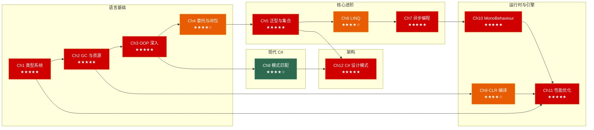

# C# 面试突击：从类型系统到游戏引擎

> 面向**游戏客户端开发岗**的 C# 深入笔记系列。每章覆盖：原理图解 → 底层剖析 → C++ 对比 → ⚠️ 陷阱速查 → 🎮 游戏实战 → 30 秒速答。

---

## 系列全景



---

## 各章速览

| 章节 | 主题 | 行数 | 图解 | 面试权重 | 核心考点 |
|------|------|------|------|---------|---------|
| [**第一章**](01_type_system.md) | 类型系统与内存布局 | 705 | 3 | ★★★★★ | 值/引用双轨、装箱拆箱、ref 返回、Span&lt;T&gt;、struct vs class |
| [**第二章**](02_gc_and_resource_management.md) | GC 与资源管理 | 726 | 3 | ★★★★★ | 分代 GC、Finalizer vs IDisposable、using 展开、对象池 |
| [**第三章**](03_oop_csharp.md) | OOP 深入 | 645 | 4 | ★★★★★ | 属性 IL 编译、索引器、event 展开、interface 默认实现、sealed |
| [**第四章**](04_operators_delegates_events.md) | 运算符、委托与闭包 | 868 | 3 | ★★★★☆ | 运算符规则、MulticastDelegate、闭包类生成、static lambda、表达式树 |
| [**第五章**](05_generics_and_collections.md) | 泛型与集合 | 758 | 3 | ★★★★★ | reified generics、JIT 代码共享、协变逆变、Dictionary 内部、EqualityComparer 选择链 |
| [**第六章**](06_linq_and_lambda.md) | LINQ 与 Lambda | 703 | 3 | ★★★★☆ | yield 状态机、延迟执行、IQueryable 表达式树转换、GroupBy 缓冲、性能陷阱 |
| [**第七章**](07_async_programming.md) | 异步编程 | 661 | 3 | ★★★★★ | Task 状态机、SynchronizationContext、ConfigureAwait、CancellationToken、IAsyncEnumerable |
| [**第八章**](08_pattern_matching_and_modern_csharp.md) | 模式匹配与现代 C# | 992 | 5 | ★★★★☆ | is/switch 模式、record 值相等、with 表达式、Source Generator、列表模式 |
| [**第九章**](09_clr_and_compilation.md) | CLR 与编译管线 | 687 | 4 | ★★★★☆ | JIT 分层编译、IL2CPP 管线与泛型代码共享、ReadyToRun vs NativeAOT、AssemblyLoadContext |
| [**第十章**](10_monobehaviour_in_depth.md) | MonoBehaviour 深入 | 784 | 3 | ★★★★★ | 生命周期、序列化、Coroutine 驱动原理、执行顺序、null 检查陷阱 |
| [**第十一章**](11_unity_performance.md) | Unity C# 性能优化 | 838 | 3 | ★★★★★ | GC 避免六策略、Job System + Burst、IL2CPP 优化、Material/Transform 陷阱 |
| [**第十二章**](12_csharp_design_patterns.md) | C# 设计模式与游戏架构 | 980 | 3 | ★★★★★ | event 替代 Observer、delegate 重构 Strategy、record+模式匹配替代 Visitor、EventBus 架构 |

**总计：9,347 行，41 幅 Mermaid 图解**

---

## 推荐阅读路线

### 🚀 面试急救（3 天）

> 时间紧迫？按面试权重从高到低刷：

```
Day 1: Ch1 类型系统 → Ch2 GC → Ch3 OOP 深入
Day 2: Ch5 泛型 → Ch7 异步 → Ch12 设计模式（Singleton/Observer/State）
Day 3: Ch10 MonoBehaviour → Ch11 性能优化 → Ch8 模式匹配（record/switch 表达式）
```

### 📚 系统掌握（2 周）

> 每天 1 小时，按章节顺序 Ch1→Ch12 完整阅读 + 手写代码验证。

### 🎮 Unity 客户端开发重点

> 已有 C# 基础？重点看游戏实战场景：

- **类型与内存**：Ch1 struct vs class 选型 / Span&lt;T&gt;、Ch2 对象池 / IDisposable 模式
- **Unity 核心**：Ch10 生命周期全流程 / Coroutine vs async / 序列化最佳实践
- **性能优化**：Ch11 GC 避免 / Job System + Burst / Material 陷阱
- **架构设计**：Ch12 EventBus / 组件模式 / record 状态机 / WeakEvent
- **面试难点**：Ch5 JIT 泛型代码共享 / Ch7 Task 状态机 IL 展开 / Ch8 record Equals 的 EqualityContract

### 🔗 与 C++ 对照学习

> 有 C++ 基础？重点阅读每章的"C++ 程序员对照"表：

| C++ 概念 | C# 章节 | 关键差异 |
|---------|--------|---------|
| 栈/堆分配 | [Ch1](01_type_system.md) | C# 值类型在栈，引用类型在堆；C++ 统一模型 |
| RAII | [Ch2](02_gc_and_resource_management.md) | C# 用 IDisposable + using；C++ 用析构函数 |
| 虚函数/vtable | [Ch3](03_oop_csharp.md) | C# 的 override 需要显式关键字；C++ 同名即覆盖 |
| std::function | [Ch4](04_operators_delegates_events.md) | C# delegate 类型安全多播；C++ std::function + 手写列表 |
| 模板 | [Ch5](05_generics_and_collections.md) | C# reified generics 运行时存在；C++ 模板编译期膨胀 |
| 迭代器 | [Ch6](06_linq_and_lambda.md) | C# yield return 状态机；C++ 手写 Iterator 类 |
| std::async | [Ch7](07_async_programming.md) | C# async/await 状态机 + SynchronizationContext；C++ std::async + future |
| union/variant | [Ch8](08_pattern_matching_and_modern_csharp.md) | C# record + 模式匹配；C++ std::variant + visit |
| 编译流程 | [Ch9](09_clr_and_compilation.md) | C# IL → JIT/AOT；C++ 直接编译为机器码 |
| 组件系统 | [Ch10](10_monobehaviour_in_depth.md) | Unity C++→C# 桥接；自定义引擎 C++ 原生组件 |
| 性能优化 | [Ch11](11_unity_performance.md) | C# GC 控制 vs C++ 手动内存管理 |
| 设计模式 | [Ch12](12_csharp_design_patterns.md) | C# event/delegate/LINQ 重塑 GoF 模式实现 |

---

## 系列特色

- 🧠 **面试导向**：每章末尾的"30 秒速答"覆盖高频面试问答题，可直接用于面试口述
- 🎮 **游戏实战**：每章包含 3 个 Unity 游戏开发场景，从 Loading 流程到 AI 状态机
- 📊 **IL 层图解**：Mermaid 图解 IL 编译展开、GC 分代回收、JIT 分层编译、Task 状态机
- ⚠️ **陷阱速查**："这段代码有什么问题？" 系列覆盖校招面试高频易错点
- 🔗 **交叉引用**：章节间深度关联（如 Ch1 类型系统 + Ch11 struct 池化 = 零 GC 热路径）
- 🆚 **C++ 对比**：每章有"C++ 程序员对照"表和对比说明，方便从 C++ 快速迁移到 C#
- 💡 **30 秒速答**：每章有 6-9 个核心 Q&A，适合面试前的最后冲刺

---

## 笔记间关联

本系列与其他笔记系列的交叉引用：

```
learn_csharp/
├── Ch1-Ch2: 类型/GC ──── → cpp_deep_dive/ (Ch1 Ch2 Ch4 内存/指针/移动)
├── Ch3-Ch4: OOP/委托 ──── → cpp_deep_dive/ (Ch3 Ch10 多态/运算符)
├── Ch5: 泛型 ────────────── → cpp_deep_dive/ (Ch5 模板) + data_structures/
├── Ch6: LINQ ────────────── → cpp_deep_dive/ (Ch8 迭代器)
├── Ch7: 异步 ────────────── → cpp_deep_dive/ (Ch7 Ch8 线程/协程)
├── Ch8: 模式匹配 ────────── → cpp_deep_dive/ (Ch8 variant)
├── Ch9: CLR ─────────────── → cpp_deep_dive/ (Ch6 编译链接)
├── Ch10-Ch11: Unity引擎/性能 → game_engine/
└── Ch12: 设计模式 ────────── → design_patterns/ (Ch1-Ch6)
```
