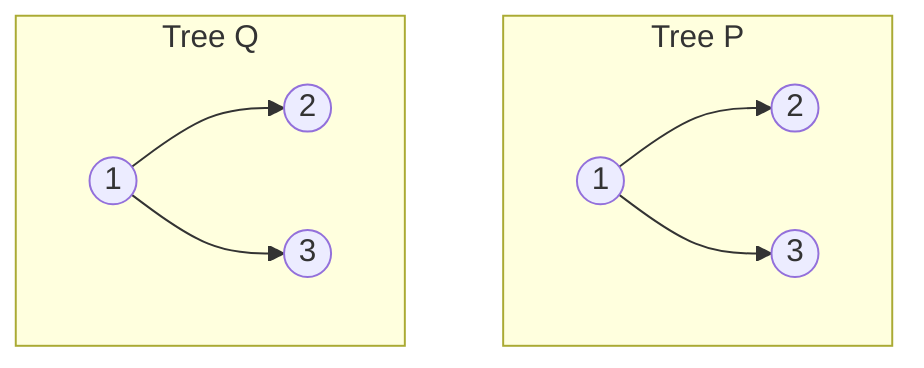
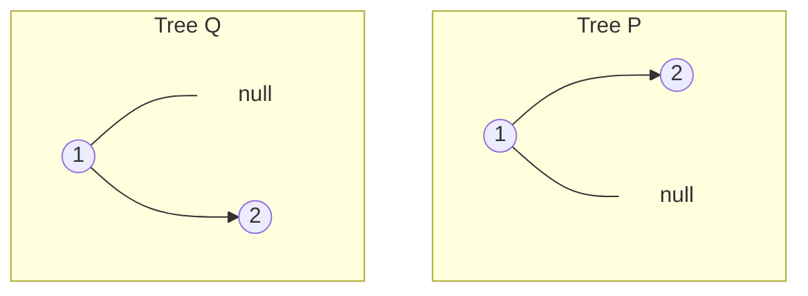
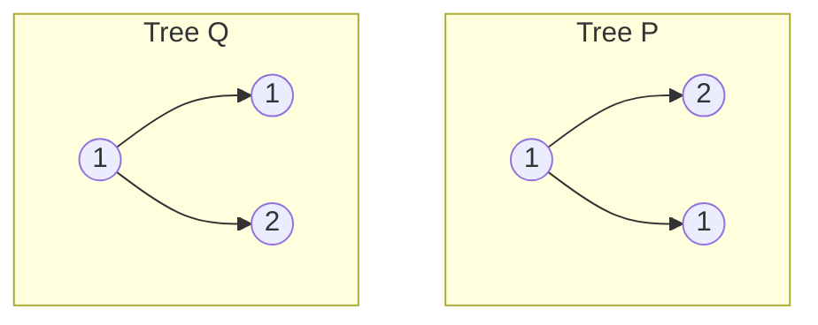

题目链接：[100. 相同的树 - 力扣（LeetCode）](https://leetcode.cn/problems/same-tree/)

- **难度**：简单
- **标签**：树、深度优先搜索、二叉树

---

## 题目描述

> [!NOTE]
> **原题说明**：
> 给你两棵二叉树的根节点 `p` 和 `q` ，编写一个函数来检验这两棵树是否相同。如果两个树在 **结构上相同**，并且节点具有 **相同的值**，则认为它们是相同的。

### 示例 1
**两棵树完全相同（返回 `true`）**


**结构不同（示例 2，返回 `false`）**


**数值不同（示例 3，返回 `false`）**


---

## 方案一：递归 DFS（最优雅）

**核心思路**：
判断两棵树是否相同，可以拆解为三个条件：
1. 根节点的值是否相同。
2. 左子树是否相同。
3. 右子树是否相同。
这三个条件必须同时满足（逻辑与关系）。

### 源码实现
```cpp
class Solution {
public:
    bool isSameTree(TreeNode* p, TreeNode* q) {
        // 1. 基本情况：都为空，说明这一分支匹配成功
        if (!p && !q) return true;
        
        // 2. 异常情况：一个空一个不空，或者值不同，匹配失败
        if (!p || !q || p->val != q->val) return false;
        
        // 3. 递归：只有左右子树都对齐，整棵树才相同
        return isSameTree(p->left, q->left) && isSameTree(p->right, q->right);
    }
};
```

#### 复杂度分析
- **时间复杂度**：$O(n)$。其中 $n$ 是节点数较少的那棵树的节点数。每个节点最多被访问一次。
- **空间复杂度**：$O(h)$。$h$ 是树的高度，主要消耗在系统递归栈上。

---

## 方案二：迭代 DFS（手动维护栈）

**核心思路**：
使用栈（`stack`）来模拟递归过程。我们将两棵树中位置对应的节点成对存入栈中，每次弹出一对进行比对。

### 源码实现
```cpp
#include <stack>
#include <utility>

class Solution {
public:
    bool isSameTree(TreeNode* p, TreeNode* q) {
        // 使用 pair 存储待比较的两个节点对
        stack<pair<TreeNode*, TreeNode*>> st;
        st.push({p, q});
        
        while (!st.empty()) {
            auto [a, b] = st.top(); 
            st.pop();
            
            if (!a && !b) continue; // 都为空，继续检查其他分支
            if (!a || !b || a->val != b->val) return false;
            
            // 将对应的左右子树成对入栈
            st.push({a->left, b->left});
            st.push({a->right, b->right});
        }
        return true;
    }
};
```

---

## 总结

- **结构与数值的双重校验**：在树的算法中，`!p || !q` 这种判断是处理递归边界的“标准起手式”。
- **递归的魅力**：在树结构中，递归往往能以极少的代码行数表达出极为复杂的逻辑。
- **与 101 题（对称二叉树）的联系**：本题判断的是两棵树“一模一样”，而 101 题判断的是一棵树“镜像对称”，两者的核心思想高度一致。

> [!TIP]
> 树的比较类问题，本质上都是在进行某种形式的遍历。只要掌握了 DFS，所有关于“相等”、“镜像”、“包含”的问题都能迎刃而解！