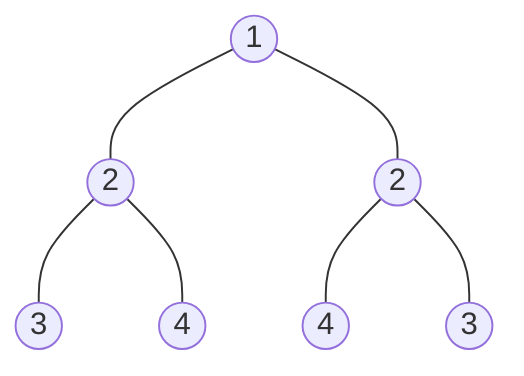
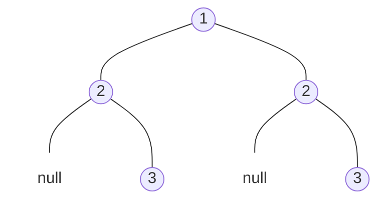

题目链接：[101. 对称二叉树 - 力扣（LeetCode）](https://leetcode.cn/problems/symmetric-tree/)

- **难度**：简单
- **标签**：树、深度优先搜索、广度优先搜索、二叉树

---

## 题目描述

> [!NOTE]
> **原题说明**：
> 给你一个二叉树的根节点 `root` ， 检查它是否轴对称。

### 示例 1（对称）

**输出**：`true`

### 示例 2（不对称）

**输出**：`false`

---

## 避坑指南：中序遍历回文是否可行？

> [!WARNING]
> **思考陷阱**：
> 有同学可能会想：“如果一棵树是对称的，那它的中序遍历结果一定是一个**回文数组**吧？”
> 
> **答案是不一定**。虽然对称二叉树的中序遍历确实是回文的，但**反之不成立**。例如：`[1, 2, 2, 2, null, 2]`。如果仅仅依靠中序遍历结果，会由于丢失了层级结构信息（尤其是 `null` 节点的位置）而导致判断失误。因此，必须使用直接操作树结构的算法。

---

## 方案一：递归 DFS（镜像比对）

**核心思路**：
判断一棵树是否对称，等价于判断其**左子树**和**右子树**是否互为镜像。
- 镜像的规则：
    1. 两个节点值相等。
    2. 左树的左子树 与 右树的右子树 镜像。
    3. 左树的右子树 与 右树的左子树 镜像。

### 源码实现
```cpp
class Solution {
public:
    bool isSymmetric(TreeNode* root) {
        if (!root) return true;
        return isMirror(root->left, root->right);
    }
private:
    bool isMirror(TreeNode* L, TreeNode* R) {
        if (!L && !R) return true;  // 都为空，匹配
        if (!L || !R) return false; // 一个空一个不空，不匹配
        
        // 值匹配 且 交叉位匹配
        return (L->val == R->val) 
            && isMirror(L->left, R->right) 
            && isMirror(L->right, R->left);
    }
};
```

#### 复杂度分析
- **时间复杂度**：$O(n)$。需要遍历整棵树的所有节点。
- **空间复杂度**：$O(h)$。取决于递归栈的最大深度，即树的高度。

---

## 方案二：迭代解法（队列辅助）

**核心思路**：
使用队列（或栈）成对地存入需要进行镜像比对的节点。每次取出两个节点进行对比，并将它们的子节点按“镜像顺序”再次压入队列。

### 源码实现
```cpp
#include <queue>

class Solution {
public:
    bool isSymmetric(TreeNode* root) {
        if (!root) return true;
        
        queue<TreeNode*> q;
        q.push(root->left);
        q.push(root->right);

        while (!q.empty()) {
            TreeNode* L = q.front(); q.pop();
            TreeNode* R = q.front(); q.pop();

            if (!L && !R) continue;
            if (!L || !R || L->val != R->val) return false;

            // 按照镜像顺序成对入队
            q.push(L->left);   // 左的左
            q.push(R->right);  // 右的右
            q.push(L->right);  // 左的右
            q.push(R->left);   // 右的左
        }
        return true;
    }
};
```

---

## 总结

- **镜像逻辑的精髓**：在于“内侧”比“内侧”（`L->right` vs `R->left`），“外侧”比“外侧”（`L->left` vs `R->right`）。
- **结构化思维**：处理树类问题时，始终要思考如何将大树拆解为可以递归处理的子任务。

> [!IMPORTANT]
> 理解了“镜像”的递归定义，你就掌握了二叉树对称性问题的万能钥匙！