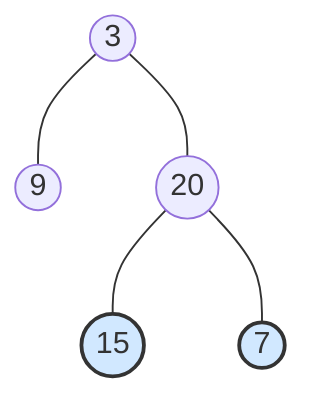

题目链接：[102. 二叉树的层序遍历 - 力扣（LeetCode）](https://leetcode.cn/problems/binary-tree-level-order-traversal/)

- **难度**：🟡 中等
- **标签**：树、广度优先搜索、二叉树、队列

---

## 题目描述

> [!NOTE]
> **原题说明**：
> 给你二叉树的根节点 `root` ，返回其节点值的 **层序遍历** 。 （即逐层地，从左到右访问所有节点）。

### 示例 1

**输出**：`[[3], [9, 20], [15, 7]]`

---

## 方案：广度优先搜索 (BFS)

**核心思路**：
层序遍历是典型的广度优先搜索（BFS）应用。为了能够区分不同的层，我们需要在每一层开始处理前，记录下当前队列中节点的数量。
1. **初始化**：根节点入队。
2. **层级循环**：只要队列不为空，就说明还有层没跑完。
3. **节点循环**：记录当前队列的大小 `sz`，表示这一层有多少个节点。
4. **出队与入队**：循环 `sz` 次，弹出节点并记录值，同时将其左右子节点（如果有）送入队列末尾排队。

### 源码实现
```cpp
#include <queue>
#include <vector>

class Solution {
public:
    vector<vector<int>> levelOrder(TreeNode* root) {
        vector<vector<int>> ans;
        if (!root) return ans;
        
        queue<TreeNode*> q;
        q.push(root);

        while (!q.empty()) {
            // 关键：在进入本层循环前，记录当前队列长度
            int sz = q.size(); 
            vector<int> curLevel;

            // 严格出队 sz 个节点，这些节点恰好属于同一层
            for (int i = 0; i < sz; ++i) {
                TreeNode* node = q.front();
                q.pop();
                curLevel.push_back(node->val);
                
                // 将下一层节点加入队尾（此时不会在当前 for 循环中被处理）
                if (node->left) q.push(node->left);
                if (node->right) q.push(node->right);
            }
            // 使用 move 避免不必要的 vector 拷贝
            ans.push_back(move(curLevel));
        }
        return ans;
    }
};
```

#### 复杂度分析
- **时间复杂度**：$O(n)$。每个节点入队和出队各一次。
- **空间复杂度**：$O(n)$。在最坏情况下（完全二叉树），队列中最多存储一层节点，即 $n/2$ 个节点。

---

## 避坑指南：为什么需要 `sz = q.size()`？

> [!IMPORTANT]
> **常见误区**：
> 如果直接在 `for` 循环中使用 `i < q.size()`，由于循环体内会不断向队列 `push` 下一层的节点，会导致 `q.size()` 实时变大，从而导致单次循环无法准确收割“当前层”的所有节点。
> **解决办法**：在 `for` 循环之前快照当下的 `size`。

---

## 总结

- **BFS 的灵魂**：队列（Queue）是实现 BFS 的核心数据结构。
- **层级区分**：快照 `size` 技巧是层序遍历中处理 `vector<vector<int>>` 的金标准。
- **内存优化**：使用 `std::move` 可以有效提升二维容器填充时的效率。

> [!TIP]
> 掌握了 BFS 的这个“套路”，不仅能解二叉树层序遍历，连图论里的最短路径、网络流量等复杂问题也都能迎刃而解！