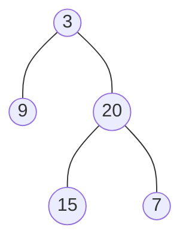

题目链接：[104. 二叉树的最大深度 - 力扣（LeetCode）](https://leetcode.cn/problems/maximum-depth-of-binary-tree/)

- **难度**：简单
- **标签**：树、深度优先搜索、广度优先搜索、二叉树

---

## 题目描述

> [!NOTE]
> **原题说明**：
> 给定一个二叉树 `root` ，返回其 **最大深度** 。二叉树的 **最大深度** 是指从根节点到最远叶子节点的最长路径上的节点数。

### 示例 1

**输出**：`3`

---

## 方案一：后序遍历（最直观的递归）

**核心思路**：
思路很清晰：递归即可。最大深度其实就是左右子树深度的最大值再加 1（加上根节点自己）。

### 源码实现
```cpp
class Solution {
public:
    int getdepth(TreeNode* node){
        // 开始前先判断节点是否为空
        // 注意：此处不能写 node == null，编译器会报错，在 C++ 里该使用 nullptr
        if (node == nullptr) return 0;
        
        // 将左右子树都挨个“递”过去
        int leftdepth = getdepth(node->left);
        int rightdepth = getdepth(node->right);
        
        // 记录下子树最大深度，然后 +1。max() 是库函数，目的是找到最大值
        int depth = 1 + max(leftdepth, rightdepth);
        return depth;
    }
    
    int maxDepth(TreeNode* root) {
        return getdepth(root);
    }
};
```

#### 复杂度分析
- **时间复杂度**：$O(n)$。需要遍历整棵树的所有节点。
- **空间复杂度**：$O(h)$。主要取决于系统递归栈的深度，最坏情况下（树退化成链）为 $O(n)$。

---

## 方案二：迭代 BFS（层序遍历思维）

**核心思路**：
这种方法是一层一层的扫过去，直到最后一层。运用的是队列的思想，和 [102. 层序遍历](./102.binary-tree-level-order-traversal.md) 那道题的套路差不多。
- 每进入一层，深度加 1。
- 保证把每一层都遍历完后再处理下一层。

### 源码实现
```cpp
#include <queue>

class Solution {
public:
    int maxDepth(TreeNode* root) {
        if (!root) return 0;
        queue<TreeNode*> q;
        q.push(root);
        int depth = 0;
        
        while (!q.empty()) {
            int size = q.size();    // 1. 获取当前层的节点个数（快照）
            for (int i = 0; i < size; ++i) {
                TreeNode* node = q.front(); 
                q.pop();
                if (node->left)  q.push(node->left);
                if (node->right) q.push(node->right);
            }
            depth++;                // 2. 一层扫完深度加 1
        }
        return depth;
    }
};
```

#### 复杂度分析
- **时间复杂度**：$O(n)$。
- **空间复杂度**：$O(n)$。取决于队列中存储的最多节点数。

---

## 总结

- **递归的简洁**：代码量最少，逻辑清晰，是处理树类问题的首选。
- **迭代的稳重**：BFS 虽然代码稍长，但它不会像递归那样因为树太深而导致“系统栈溢出”。
- **技巧点**：在 C++ 中判断指针为空务必使用 `nullptr` 而不是 Java/C# 风格的 `null`。

> [!TIP]
> 树的深度问题本质上还是遍历。理解了“层”的概念，无论是求深度、求宽度还是求层平均值，都是换汤不换药！