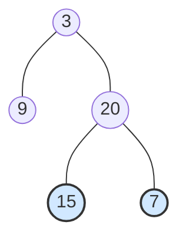

题目链接：[107. 二叉树的层序遍历 II - 力扣（LeetCode）](https://leetcode.cn/problems/binary-tree-level-order-traversal-ii/)

- **难度**：🟡 中等
- **标签**：树、广度优先搜索、二叉树

---

## 题目描述

> [!NOTE]
> **原题说明**：
> 给你二叉树的根节点 `root` ，返回其节点值 **自底向上** 的层序遍历 。 （即按从叶子节点所在层到根节点所在的层，逐层从左向右遍历）。

### 示例 1

**输出**：`[[15, 7], [9, 20], [3]]`

---

## 方案：BFS + 结果反转

**核心思路**：
这道题其实非常简单，只需要把 [102. 二叉树的层序遍历](./102.binary-tree-level-order-traversal.md) 的结果**反过来输出就行**。

### 源码实现
```cpp
#include <algorithm> // 为了使用 reverse
#include <queue>
#include <vector>

class Solution {
public:
    vector<vector<int>> levelOrderBottom(TreeNode* root) {
        vector<vector<int>> ans;
        if (!root) return ans;
        
        queue<TreeNode*> q;
        q.push(root);

        while (!q.empty()) {
            int sz = q.size();
            vector<int> curLevel;

            // 标准层序遍历逻辑
            for (int i = 0; i < sz; ++i) {
                TreeNode* node = q.front();
                q.pop();
                curLevel.push_back(node->val);
                
                if (node->left) q.push(node->left);
                if (node->right) q.push(node->right);
            }
            ans.push_back(move(curLevel));
        }

        // 调用标准库函数 reverse，将自顶向下的结果反转为自底向上
        reverse(ans.begin(), ans.end());
        
        return ans;
    }
};
```

#### 复杂度分析
- **时间复杂度**：$O(n)$。层序遍历耗时 $O(n)$，最后的 `reverse` 耗时 $O(h)$，总复杂度仍为线性。
- **空间复杂度**：$O(n)$。主要是队列和结果容器的开销。

---

## 总结

- **举一反三**：很多算法题都是在经典题目上的“微调”。掌握了 102 题的 BFS 模板，本题只是多了一行 `reverse`。
- **工具库的使用**：在面试中，熟练调用 `std::reverse` 等标准库函数体现了你对 C++ 工具链的熟悉程度。

> [!TIP]
> 如果题目要求“自底向上”，最稳妥且最高效的办法往往是先“正常做”，最后再一键反转！
