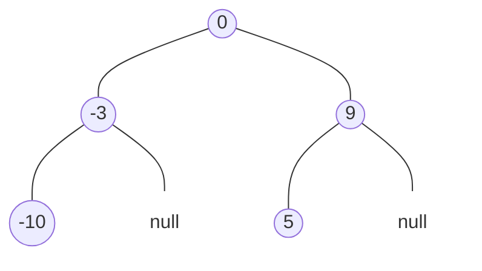
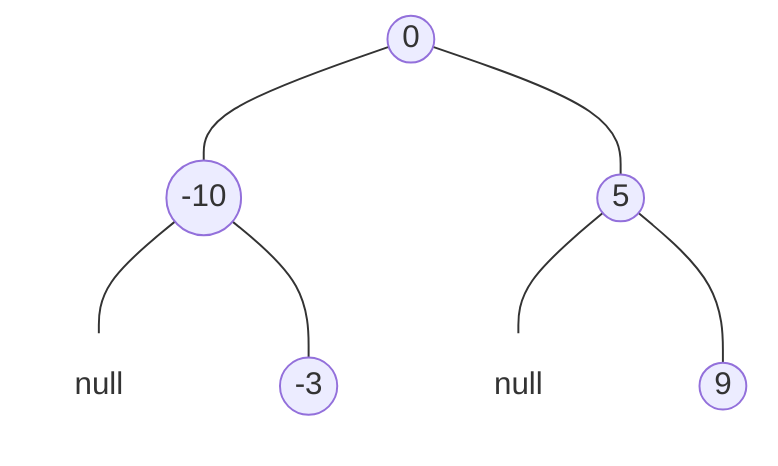
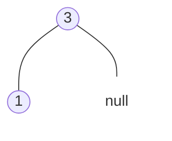

题目链接：[108. 将有序数组转换为二叉搜索树 - 力扣（LeetCode）](https://leetcode.cn/problems/convert-sorted-array-to-binary-search-tree/)

- **难度**：简单
- **标签**：树、二叉搜索树、分治、二叉树

---

## 什么是二叉搜索树 (BST)？

> [!NOTE]
> **定义**：
> 1. 左子树的所有节点值都**小于**根节点。
> 2. 右子树的所有节点值都**大于**根节点。
> 3. 左右子树本身也必须是二叉搜索树。
> 
> ```mermaid
> graph TD
>     8((8)) --- 3((3))
>     8((8)) --- 10((10))
>     3((3)) --- 1((1))
>     3((3)) --- 6((6))
>     10((10)) --- null1[null]
>     10((10)) --- 14((14))
>     style null1 fill:none,stroke:none
> ```

---

## 题目描述

给你一个整数数组 `nums` ，其中元素已经按 **升序** 排列，请你将其转换为一棵 **平衡** 二叉搜索树。

### 示例展示（多种合法的 BST）

**方案 A：以 0 为根节点**


**方案 B：另一种平衡形态**


**示例 2**


---

## 方案一：递归分治（最直观）

**核心思路**：
其实还是很好搞的。由于数组已经是排好序的，这就像是**二分查找**的逆过程：
1. 找到数组的**中间节点**作为根。
2. 之后左右分两条路，分别递归构建左右子树。
这样能保证左右两边的节点数差值不超过 1，天然就是平衡的！

### 源码实现
```cpp
class Solution {
public:
    TreeNode* sortedArrayToBST(vector<int>& nums) {
        // 主函数：从整个数组区间开始构建
        return build(nums, 0, nums.size() - 1);
    }
private:
    TreeNode* build(const vector<int>& nums, int left, int right){
        // 递归终止条件：左指针超过右指针
        if(left > right) return nullptr;
        
        // 找到中间位置，避免 (left + right) / 2 可能带来的溢出风险
        int mid = left + (right - left) / 2;
        
        // 创建当前子树的根节点
        TreeNode* root = new TreeNode(nums[mid]);
        
        // 递归地构建左右子树
        root->left = build(nums, left, mid - 1);  // 左半部分去盖左楼
        root->right = build(nums, mid + 1, right); // 右半部分去盖右楼
        
        return root;
    }
};
```

#### 复杂度分析
- **时间复杂度**：$O(n)$。每个数组元素都会被访问并转换为节点。
- **空间复杂度**：$O(\log n)$。递归栈的深度等于平衡树的高度。

---

## 方案二：迭代法（手动压栈）

如果不想用递归，也可以用栈来模拟这个过程。我们定义一个 `Task` 结构，专门记录“我们要用哪段区间盖哪棵子树”。

### 源码实现
```cpp
class Solution {
public:
    struct Task {              
        int l, r;
        TreeNode** parentPtr;  // 指向父亲节点中 left 或 right 指针的地址
        Task(int l_, int r_, TreeNode** p_) : l(l_), r(r_), parentPtr(p_) {}
    };

    TreeNode* sortedArrayToBST(vector<int>& nums) {
        if (nums.empty()) return nullptr;
        TreeNode* root = nullptr;
        stack<Task> st;
        st.emplace(0, (int)nums.size() - 1, &root);

        while (!st.empty()) {
            auto [l, r, ptr] = st.top(); st.pop();
            if (l > r) { *ptr = nullptr; continue; }
            
            int mid = l + (r - l) / 2;
            *ptr = new TreeNode(nums[mid]); // 直接给对应的指针赋值
            
            // 下一次要处理的任务，先压右后压左
            st.emplace(mid + 1, r, &(*ptr)->right);
            st.emplace(l, mid - 1, &(*ptr)->left);
        }
        return root;
    }
};
```

---

## 总结

- **有序即平衡**：在有序数组里取中点，是构建平衡 BST 的“金科玉律”。
- **递归与二分的联动**：你会发现这道题的代码逻辑和二分查找惊人地相似，只是二分是在找值，而我们在造树。

> [!TIP]
> 为什么一定要取中点？因为只有中点能让左右两边的“劳动力”（节点数）分配得最均匀，从而让整棵树长得最匀称！