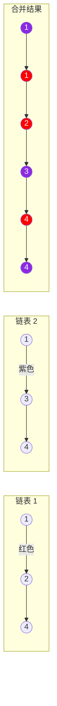

题目链接：[21. 合并两个有序链表 - 力扣（LeetCode）](https://leetcode.cn/problems/merge-two-sorted-lists/)

- **难度**：简单
- **标签**：链表、递归、迭代

---

## 题目描述

> [!NOTE]
> **原题说明**：
> 将两个升序链表合并为一个新的 **升序** 链表并返回。新链表是通过拼接给定的两个链表的所有节点组成的。

### 示例图解

根据题意，合并过程如下所示（使用 Mermaid 流程图表示）：



---

## 方案一：暴力解法（先合并，再排序）

**核心思路**：
将两个链表的所有节点先强行串在一起，然后把所有 `val` 提取出来存入数组进行排序，最后按顺序写回各节点。

### 源码实现
```cpp
class Solution {
public:
    ListNode* mergeTwoLists(ListNode* list1, ListNode* list2) {
        // 1. 在栈上创建哨兵节点，方便统一操作
        ListNode dummy(0);
        ListNode *tail = &dummy;
        
        // 2. 先把两个链表简单粗暴地连起来
        for(ListNode *p = list1; p; p = p->next) tail = tail -> next = p;
        for(ListNode *p = list2; p; p = p->next) tail = tail -> next = p;

        // 3. 提取所有值并排序
        std::vector<int> vals;
        for(ListNode *p = dummy.next; p; p = p->next)
            vals.push_back(p->val);
        std::sort(vals.begin(), vals.end());

        // 4. 将排好序的值写回原节点
        ListNode *cur = dummy.next;
        for(int v : vals){
            cur -> val = v;
            cur = cur -> next;
        }
        return dummy.next;
    }
};
```

#### 复杂度分析
- **时间复杂度**：$O(N \log N)$。$N$ 为两个链表的节点总数。排序的开销占据了主导。
- **空间复杂度**：$O(N)$。由于使用了 `vector` 来存储所有节点的值，因此需要额外的线性空间。

---

## 方案二：迭代归并法（标准解法）

**核心思路**：
利用原链表本身就是**升序**的特点，准备一个新链表的头。每次比较两个旧链表当前的头结点，将较小的那个接在新链表尾部。

### 源码实现
```cpp
class Solution {
public:
    ListNode* mergeTwoLists(ListNode* l1, ListNode* l2) {
        ListNode dummy(0);          // 哨兵头节点
        ListNode* tail = &dummy;    // 指向新链表的末尾

        // 归并核心：双指针比较
        while (l1 && l2) {
            if (l1->val < l2->val) {
                tail->next = l1;
                l1 = l1->next;
            } else {
                tail->next = l2;
                l2 = l2->next;
            }
            tail = tail->next;
        }

        // 拼接剩余段（当一条链走完，另一条链剩下的直接挂在尾部）
        tail->next = l1 ? l1 : l2;

        return dummy.next;
    }
};
```

#### 复杂度分析
- **时间复杂度**：$O(n + m)$。其中 $n$ 和 $m$ 是两个链表的长度。我们只需要遍历两个链表的所有节点。
- **空间复杂度**：$O(1)$。我们只改变了已有节点的指针指向，没有使用额外的存储结构。

---

## 方案三：递归法（极其简洁）

**核心思路**：
如果其中一个链表为空，直接返回另一个。否则，比较头节点，将较小者的 `next` 指向“剩余部分的合并结果”。

```cpp
class Solution {
public:
    ListNode* mergeTwoLists(ListNode* l1, ListNode* l2) {
        if (!l1) return l2;
        if (!l2) return l1;

        if (l1->val < l2->val) {
            l1->next = mergeTwoLists(l1->next, l2);
            return l1;
        } else {
            l2->next = mergeTwoLists(l1, l2->next);
            return l2;
        }
    }
};
```

#### 复杂度分析
- **时间复杂度**：$O(n + m)$。
- **空间复杂度**：$O(n + m)$。递归调用的深度取决于节点的总数，系统栈空间开销与节点数成正比。

---

## 总结

- **理解哨兵节点 (Dummy Node)**：在处理链表问题时，哨兵节点可以极大地简化边界情况的处理（如空链表、头结点插入等）。
- **空间换时间 vs 原地修改**：方案一虽然直观，但效率较低且破坏了原链表。方案二和三是面试的首选。

> [!TIP]
> 以后遇到两个有序序列的合并，“双指针 + 比较” 的归并思想永远是最优解！