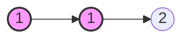
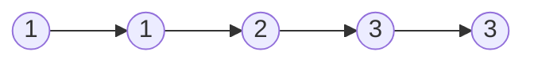

题目链接：[83. 删除排序链表中的重复元素 - 力扣（LeetCode）](https://leetcode.cn/problems/remove-duplicates-from-sorted-list/)

- **难度**：简单
- **标签**：链表

---

## 题目描述

> [!NOTE]
> **原题说明**：
> 给定一个已排序的链表的头 `head` ， 删除所有重复的元素，使每个元素只出现一次 。返回 **已排序的链表** 。

### 示例 1

**输出**：`[1, 2]`

### 示例 2

**输出**：`[1, 2, 3]`

---

## 方案：迭代指针（跳过重复项）

**核心思路**：
由于链表已经排好序，重复的元素一定是相邻的。
1. 让当前指针 `cur` 指向 `head`。
2. 比较 `cur` 和 `cur->next` 的值。
3. 如果相等，说明找到了重复元素，让 `cur->next` 指向 `cur->next->next`（即跳过重复节点）。
4. 如果不相等，则移动 `cur` 指针到下一个节点。

### 源码实现
```cpp
/**
 * Definition for singly-linked list.
 * struct ListNode {
 *     int val;
 *     ListNode *next;
 *     ListNode() : val(0), next(nullptr) {}
 *     ListNode(int x) : val(x), next(nullptr) {}
 *     ListNode(int x, ListNode *next) : val(x), next(next) {}
 * };
 */
class Solution {
public:
    ListNode* deleteDuplicates(ListNode* head) {
        if (!head) return nullptr;
        
        ListNode* cur = head;
        // 当当前节点和下一个节点都存在时
        while (cur && cur->next) {
            if (cur->val == cur->next->val) {
                // 原则：发现重复，直接跨过重复节点
                cur->next = cur->next->next;
            } else {
                // 原则：没有重复，正常移动指针
                cur = cur->next;
            }            
        }
        return head;
    }
};
```

#### 复杂度分析
- **时间复杂度**：$O(n)$。其中 $n$ 是链表的长度。我们只需遍历一次链表。
- **空间复杂度**：$O(1)$。我们只使用了常数级的额外指针变量。

---

## 避坑指南：`=` 与 `==`

> [!CAUTION]
> **血泪教训**：
> 在编写 `cur->next = cur->next->next` 时，千万不要写成 `cur->next == cur->next->next`。
> - `==` 是比较运算符，它不会改变指针的指向。
> - 如果写错，会导致 `while` 循环无法打破（或逻辑停滞），从而引发死循环。

---

## 总结

- **链表精髓**：理解 `next` 指针的重新定向是链表操作的灵魂。
- **内存安全**：在实际工程中，跳过的节点（被删除的重复元素）通常需要手动释放内存（`delete`），但在 LeetCode 的简单题中通常不需要严苛考虑这一点。
- **有序特性**：正是因为有序，我们才只需要比较相邻节点，而不需要使用额外的哈希表来记录。

> [!TIP]
> 链表题目看起来花哨，但只要脑子里有一张“连线图”，代码实现往往比数组还要简洁！