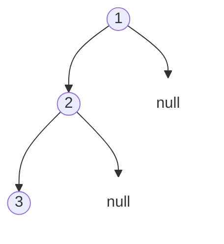

题目链接：[94. 二叉树的中序遍历 - 力扣（LeetCode）](https://leetcode.cn/problems/binary-tree-inorder-traversal/)

- **难度**：简单
- **标签**：树、深度优先搜索、二分查找、二叉树

---

## 题目描述

> [!NOTE]
> **原题说明**：
> 给定一个二叉树的根节点 `root` ，返回它的 **中序** 遍历。

### 示例 1

**输出**：`[1, 3, 2]`

---

## 遍历基础复习

二叉树的常见遍历顺序如下：
- **先序遍历 (Preorder)**：根 → 左 → 右
- **中序遍历 (Inorder)**：左 → 根 → 右
- **后序遍历 (Postorder)**：左 → 右 → 根

---

## 方案一：递归解法（最直观）

**核心思路**：
利用函数调用栈，在处理当前节点前先递归访问左子树，处理完后再递归访问右子树。

### 源码实现
```cpp
class Solution {
public:
    vector<int> inorderTraversal(TreeNode* root) {
        vector<int> ans;
        dfs(root, ans);
        return ans;
    }
private:
    void dfs(TreeNode* node, vector<int>& out) {
        if (!node) return;
        dfs(node->left, out);   // 左
        out.push_back(node->val); // 根
        dfs(node->right, out);  // 右
    }
};
```

#### 复杂度分析
- **时间复杂度**：$O(n)$。$n$ 是节点总数。
- **空间复杂度**：$O(n)$。在最坏情况下（树呈链状），递归深度可达 $n$。

---

## 方案二：迭代解法（手动维护栈）

**核心思路**：
为了避免系统递归栈过深，我们可以自己手动维护一个 `stack`。
1. 一路向左：将所有遇到的左孩子压入栈中。
2. 弹栈访问：当左边到头时，弹出栈顶节点并读取。
3. 转向右侧：对右孩子重复上述过程。

### 源码实现
```cpp
#include <stack>
#include <vector>

class Solution {
public:
    vector<int> inorderTraversal(TreeNode* root) {
        vector<int> ans;
        stack<TreeNode*> st;
        TreeNode* cur = root;

        while (cur || !st.empty()) {
            // 阶段 1: 一路向左压栈
            while (cur) {
                st.push(cur);
                cur = cur->left;
            }
            // 阶段 2: 弹栈并读取
            cur = st.top(); 
            st.pop();
            ans.push_back(cur->val);
            // 阶段 3: 转向右子树
            cur = cur->right;
        }
        return ans;
    }
};
```

#### 复杂度分析
- **时间复杂度**：$O(n)$。
- **空间复杂度**：$O(n)$。栈的大小取决于树的高度。

---

## 方案三：Morris 遍历（$O(1)$ 空间神技）

**核心思路**：
利用二叉树中大量空闲的指针（叶子节点的 `right` 指针）来建立特殊的连接（线索），从而在不使用栈的情况下实现回溯。
- **建立线索**：在移动到左子树前，让左子树的最右侧节点（当前节点的前驱）指向当前节点。
- **拆除线索**：当再次回到当前节点时，说明左子树已处理完，恢复指针并输出当前值。

### 源码实现
```cpp
class Solution {
public:
    vector<int> inorderTraversal(TreeNode* root) {
        vector<int> ans;
        TreeNode *cur = root, *pre;
        while (cur) {
            if (cur->left) {
                // 寻找左子树的最右节点（前驱）
                pre = cur->left;
                while (pre->right && pre->right != cur) pre = pre->right;
                
                if (!pre->right) {
                    pre->right = cur; // 建立回勾线索
                    cur = cur->left;
                    continue; // 继续向左探路
                } else {
                    pre->right = nullptr; // 任务完成，拆除线索
                }
            }
            ans.push_back(cur->val); // 访问根节点
            cur = cur->right;        // 向右（真子结点或回勾）
        }
        return ans;
    }
};
```

#### 复杂度分析
- **时间复杂度**：$O(n)$。虽然有 `while` 嵌套，但每个边最多被访问两次。
- **空间复杂度**：$O(1)$。没有任何辅助栈或开销。

---

## 总结

- **递归 vs 迭代**：递归代码简洁，迭代更贴合计算机底层逻辑。
- **中序特性**：中序遍历二叉搜索树（BST）得到的是一个**递增**的有序序列。
- **高级技巧**：Morris 遍历虽然在工业实践中不常用（会短暂破坏树结构），但在算法面试中是体现深度的绝佳话题。

> [!IMPORTANT]
> 掌握了中序遍历的这三种姿势，二叉树的遍历逻辑你就已经彻底通关了！