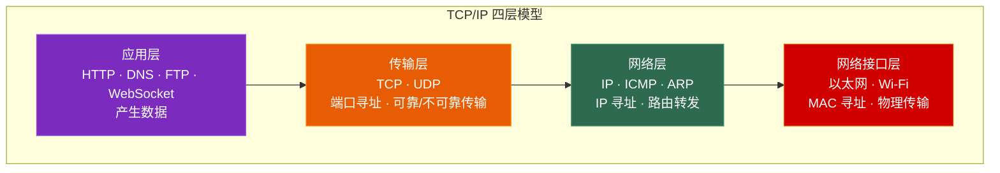
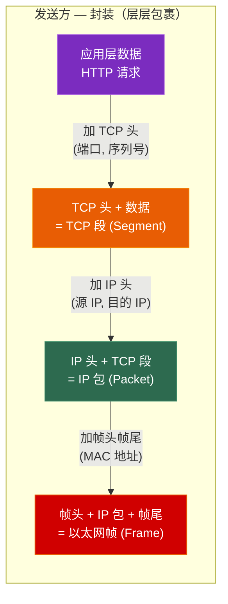
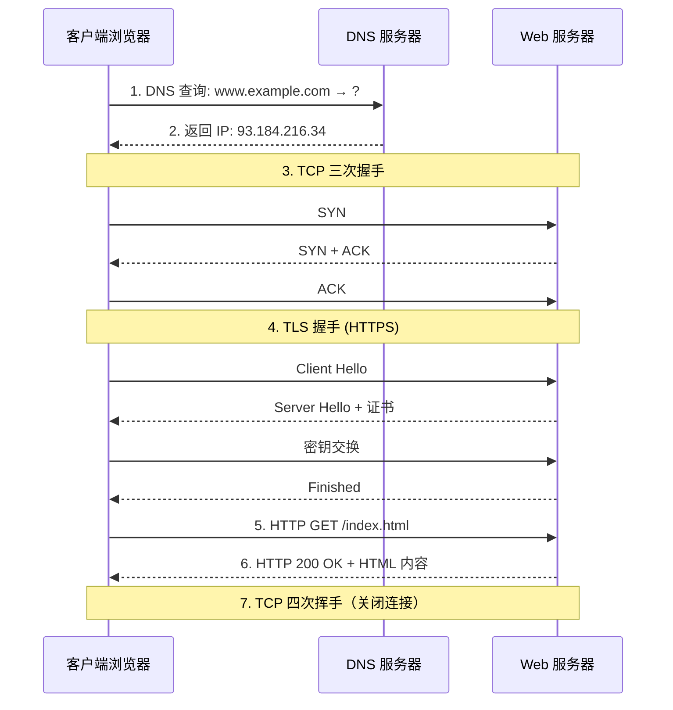

# 第一章 网络分层模型与协议概览

> **一句话理解**：分层的本质是**分工**——每层只关心自己的事，上层不需要知道下层的实现细节。就像寄快递：你只管写地址，不用关心快递员走哪条路。

---

## 1.1 概念直觉 —— What & Why

### 为什么需要分层？

```
问题：两台计算机要通信，需要解决的问题太多了——
• 数据用什么格式？（应用层）
• 数据怎么可靠传输？丢了怎么办？（传输层）
• 两台机器不在同一个网络，怎么找到对方？（网络层）
• 物理上怎么把 0 和 1 送出去？（链路层/物理层）

解决方案：分层！每层只解决一类问题，通过接口与上下层交互。
好处：独立演进（换了物理网线不影响上层应用）、易于理解和维护。
```

### TCP/IP 四层 vs OSI 七层

| TCP/IP 四层 | OSI 七层 | 功能 | 典型协议 |
|------------|---------|------|---------|
| **应用层** | 应用层 + 表示层 + 会话层 | 为用户提供服务 | HTTP, DNS, FTP, WebSocket |
| **传输层** | 传输层 | 端到端的可靠/不可靠传输 | TCP, UDP |
| **网络层** | 网络层 | 路由和转发，跨网络通信 | IP, ICMP, ARP |
| **网络接口层** | 数据链路层 + 物理层 | 物理传输 | 以太网, Wi-Fi |

> 💡 **面试中的表述**：「实际工程中用 TCP/IP 四层模型，OSI 七层是理论参考。区别在于 OSI 把应用层拆成三层（应用+表示+会话），把网络接口层拆成两层（链路+物理）。面试中提到哪个都行，但要知道另一个的对应关系。」

---

## 1.2 原理图解

### TCP/IP 四层模型



### 数据封装与解封装



```
收到数据后，接收方反向操作（解封装）：
帧 → 去掉帧头帧尾 → IP 包 → 去掉 IP 头 → TCP 段 → 去掉 TCP 头 → 应用数据
每一层只看自己的头部，处理完后交给上一层。
```

### 一次 HTTP 请求的完整旅程



> 💡 **面试超高频题**："在浏览器输入 URL 后发生了什么？" —— 按上面的时序图从头讲到尾即可，能讲 2~3 分钟。

---

## 1.3 各层核心协议速览

### 应用层

| 协议 | 端口 | 传输层 | 用途 |
|------|------|--------|------|
| HTTP | 80 | TCP | 网页传输 |
| HTTPS | 443 | TCP | 加密网页传输 |
| DNS | 53 | UDP/TCP | 域名解析 |
| FTP | 21 | TCP | 文件传输 |
| SSH | 22 | TCP | 远程登录 |
| WebSocket | 80/443 | TCP | 全双工实时通信 |
| 游戏自定义协议 | 自定义 | TCP/UDP/KCP | 游戏数据同步 |

### 传输层

| 协议 | 特点 | 使用场景 |
|------|------|---------|
| **TCP** | 面向连接、可靠、字节流 | 文件传输、HTTP、游戏登录/交易 |
| **UDP** | 无连接、不可靠、数据报 | DNS、视频流、游戏战斗同步 |

> 详细对比见 Ch2（TCP）和 Ch3（UDP）。

### 网络层

```cpp
// IP 地址的本质：一个 32 位（IPv4）或 128 位（IPv6）的数字
// IPv4 示例：192.168.1.100 = 0xC0A80164

// 端口号：16 位，范围 0~65535
// 0~1023：系统保留（Well-known ports）
// 1024~49151：注册端口
// 49152~65535：动态/私有端口

// Socket 地址 = IP + 端口
// 192.168.1.100:8080 唯一标识了一台机器上的一个进程
```

### 关键概念速查

| 概念 | 作用 | 层级 | 长度 |
|------|------|------|------|
| **MAC 地址** | 局域网内标识网卡 | 链路层 | 48 位 (6B) |
| **IP 地址** | 跨网络标识主机 | 网络层 | 32 位 (IPv4) / 128 位 (IPv6) |
| **端口号** | 标识进程 | 传输层 | 16 位 |
| **MTU** | 最大传输单元 | 链路层 | 以太网 1500 字节 |
| **MSS** | TCP 最大段大小 | 传输层 | MTU - IP 头 - TCP 头 = 1460 |

---

## 1.4 IP 协议基础

### IPv4 报文头

```
 0                   1                   2                   3
 0 1 2 3 4 5 6 7 8 9 0 1 2 3 4 5 6 7 8 9 0 1 2 3 4 5 6 7 8 9 0 1
+-+-+-+-+-+-+-+-+-+-+-+-+-+-+-+-+-+-+-+-+-+-+-+-+-+-+-+-+-+-+-+-+
|Version|  IHL  |    ToS        |          Total Length         |
+-+-+-+-+-+-+-+-+-+-+-+-+-+-+-+-+-+-+-+-+-+-+-+-+-+-+-+-+-+-+-+-+
|         Identification        |Flags|    Fragment Offset      |
+-+-+-+-+-+-+-+-+-+-+-+-+-+-+-+-+-+-+-+-+-+-+-+-+-+-+-+-+-+-+-+-+
|   TTL (8b)    |  Protocol(8b) |     Header Checksum           |
+-+-+-+-+-+-+-+-+-+-+-+-+-+-+-+-+-+-+-+-+-+-+-+-+-+-+-+-+-+-+-+-+
|                       Source IP Address                        |
+-+-+-+-+-+-+-+-+-+-+-+-+-+-+-+-+-+-+-+-+-+-+-+-+-+-+-+-+-+-+-+-+
|                    Destination IP Address                      |
+-+-+-+-+-+-+-+-+-+-+-+-+-+-+-+-+-+-+-+-+-+-+-+-+-+-+-+-+-+-+-+-+
```

| 字段 | 大小 | 含义 |
|------|------|------|
| Version | 4 bit | IPv4 = 4, IPv6 = 6 |
| IHL | 4 bit | 头部长度（单位 4 字节），通常 = 5（20 字节） |
| TTL | 8 bit | 生存时间，每经过一个路由器减 1，到 0 就丢弃（防环路） |
| Protocol | 8 bit | 上层协议：TCP=6, UDP=17, ICMP=1 |
| Source/Dest IP | 各 32 bit | 源和目的 IP 地址 |

### 子网划分与 CIDR

```cpp
// CIDR 表示法：192.168.1.0/24
// /24 表示前 24 位是网络号，后 8 位是主机号
// 子网掩码：255.255.255.0 (11111111.11111111.11111111.00000000)

// 网络地址 = IP & 子网掩码
// 192.168.1.100 & 255.255.255.0 = 192.168.1.0（网络地址）

// 广播地址 = 网络地址 | ~子网掩码
// 192.168.1.0 | 0.0.0.255 = 192.168.1.255（广播地址）

// 可用主机数 = 2^(32-前缀长度) - 2
// /24 → 2^8 - 2 = 254 台主机
```

### 公网 vs 私网 IP

| 范围 | 类别 | 用途 |
|------|------|------|
| `10.0.0.0/8` | A 类私有 | 大型企业内网 |
| `172.16.0.0/12` | B 类私有 | 中型企业内网 |
| `192.168.0.0/16` | C 类私有 | 家庭/小型网络 |
| 其他 | 公网 IP | 互联网直接可达 |

> 💡 私网 IP 不能直接在互联网上路由——需要 **NAT** 转换为公网 IP（详见 Ch6）。

---

## 1.5 经典面试题

### "在浏览器输入 URL 后发生了什么？"

> **必须 2~3 分钟完整说出来的八股之王**：
>
> 1. **URL 解析**：浏览器解析协议（HTTPS）、域名（www.example.com）、路径（/index.html）
> 2. **DNS 解析**：浏览器缓存 → OS 缓存 → 路由器缓存 → ISP DNS → 递归查询 → 得到 IP
> 3. **TCP 三次握手**：SYN → SYN+ACK → ACK，建立连接
> 4. **TLS 握手**（HTTPS）：协商加密算法、验证证书、交换密钥
> 5. **发送 HTTP 请求**：GET /index.html HTTP/1.1
> 6. **服务器处理**：路由 → 业务逻辑 → 生成响应
> 7. **返回 HTTP 响应**：200 OK + HTML 内容
> 8. **浏览器渲染**：解析 HTML → 构建 DOM → 加载 CSS/JS → 渲染页面
> 9. **TCP 四次挥手**：FIN → ACK → FIN → ACK，关闭连接

### 其他高频题

**Q：TCP/IP 和 OSI 的区别？**
> OSI 是 7 层理论模型，TCP/IP 是 4 层实践模型。OSI 的应用+表示+会话 = TCP/IP 的应用层，OSI 的链路+物理 = TCP/IP 的网络接口层。实际使用的是 TCP/IP。

**Q：为什么需要 ARP？**
> ARP 把 IP 地址解析为 MAC 地址。在局域网内发送数据需要知道目标的 MAC 地址，而上层只知道 IP。ARP 通过广播"谁是 192.168.1.1？"来获取 MAC 地址。

**Q：MTU 是什么？超过 MTU 会怎样？**
> MTU 是链路层一帧能承载的最大数据量，以太网是 1500 字节。超过 MTU 的 IP 包会被**分片**（Fragmentation），到目的端再重组。分片增加复杂度和丢包风险，所以一般设置 DF（Don't Fragment）标志 + Path MTU Discovery。

---

## 1.6 🎮 游戏实战场景

### 游戏协议分层设计

```
┌─────────────────────────────────────────┐
│  游戏层：Protobuf 消息（移动/攻击/聊天）  │  ← 应用层
├─────────────────────────────────────────┤
│  可靠层：KCP / 自研 ARQ（可靠 + 排序）    │  ← 传输层（自研）
├─────────────────────────────────────────┤
│  UDP 传输                               │  ← 传输层
├─────────────────────────────────────────┤
│  IP / 以太网                             │  ← 网络层/链路层
└─────────────────────────────────────────┘
```

```cpp
// 游戏数据包格式设计（常见方案）
struct PacketHeader {
    uint16_t length;      // 整个包的长度（含头部）
    uint16_t msg_id;      // 消息类型（对应 Protobuf 消息）
    uint32_t sequence;    // 序列号（可靠 UDP 用）
    uint32_t ack;         // 确认号
    uint8_t  flags;       // 标志位（可靠/不可靠/心跳等）
    uint8_t  reserved;    // 保留
};
// sizeof(PacketHeader) = 14 字节

// 典型游戏包大小：
// 移动同步包：14 (头) + 24 (位置+方向) = 38 字节
// 技能释放包：14 (头) + 16 (技能数据) = 30 字节
// 保持在 MTU(1500) - IP(20) - UDP(8) = 1472 字节以内 ✅
```

### MTU 与游戏

```
以太网 MTU = 1500 字节
- IP 头 = 20 字节
- UDP 头 = 8 字节
= 可用 1472 字节（UDP payload 上限）

游戏包通常远小于这个值（几十到几百字节），
但大型数据（如场景快照）可能超过，需要：
1. 应用层分片（推荐，自己控制）
2. 依赖 IP 层分片（不推荐，丢一片全丢）
```

---

## 1.7 30 秒速答

**Q：TCP/IP 四层分别做什么？**

> 应用层提供用户服务（HTTP/DNS），传输层提供端到端传输（TCP 可靠/UDP 不可靠），网络层负责 IP 寻址和路由转发，网络接口层负责物理传输。数据发送时逐层封装，接收时逐层解封装。

**Q：数据从应用层到网络经历了什么？**

> 封装过程：应用数据加 TCP/UDP 头变成段(Segment)，加 IP 头变成包(Packet)，加帧头帧尾变成帧(Frame)，最终变成比特流在物理介质上传输。每层加的头包含该层需要的控制信息（端口、IP、MAC）。

---

> 📖 下一章：[第二章 TCP 深入：可靠传输的代价](../02_tcp) —— 三次握手、四次挥手、滑动窗口、拥塞控制与游戏中的粘包处理。
