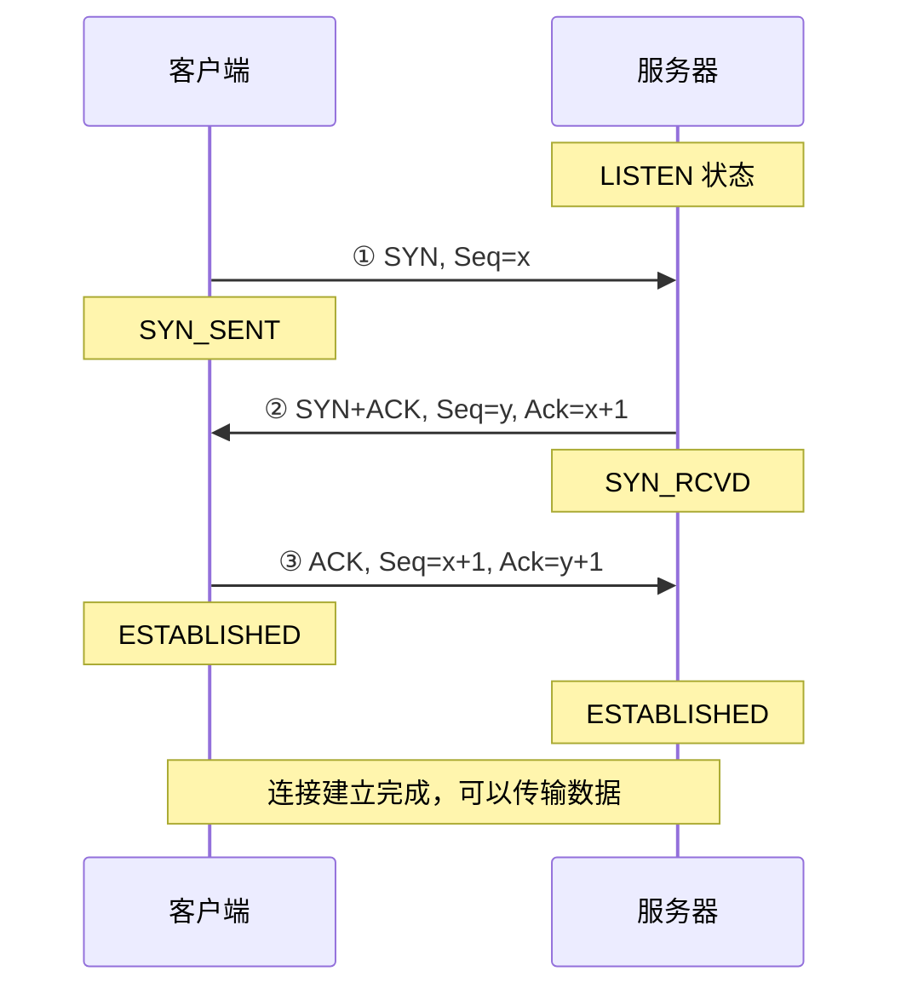
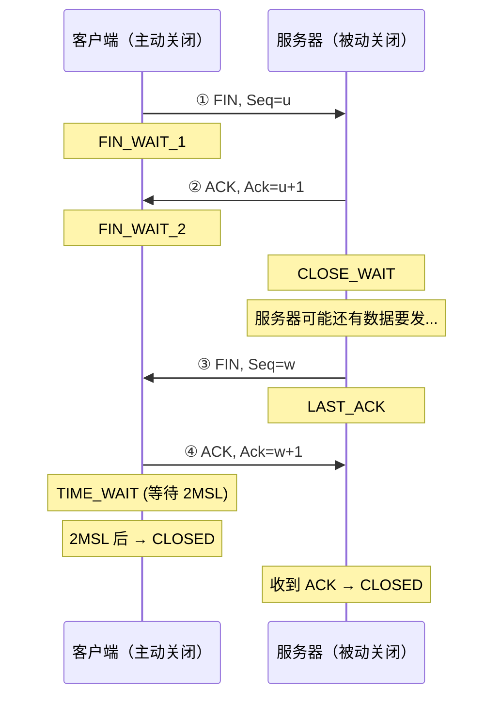
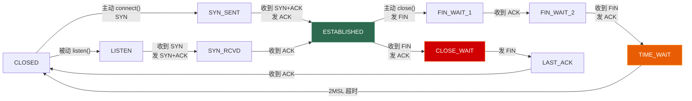
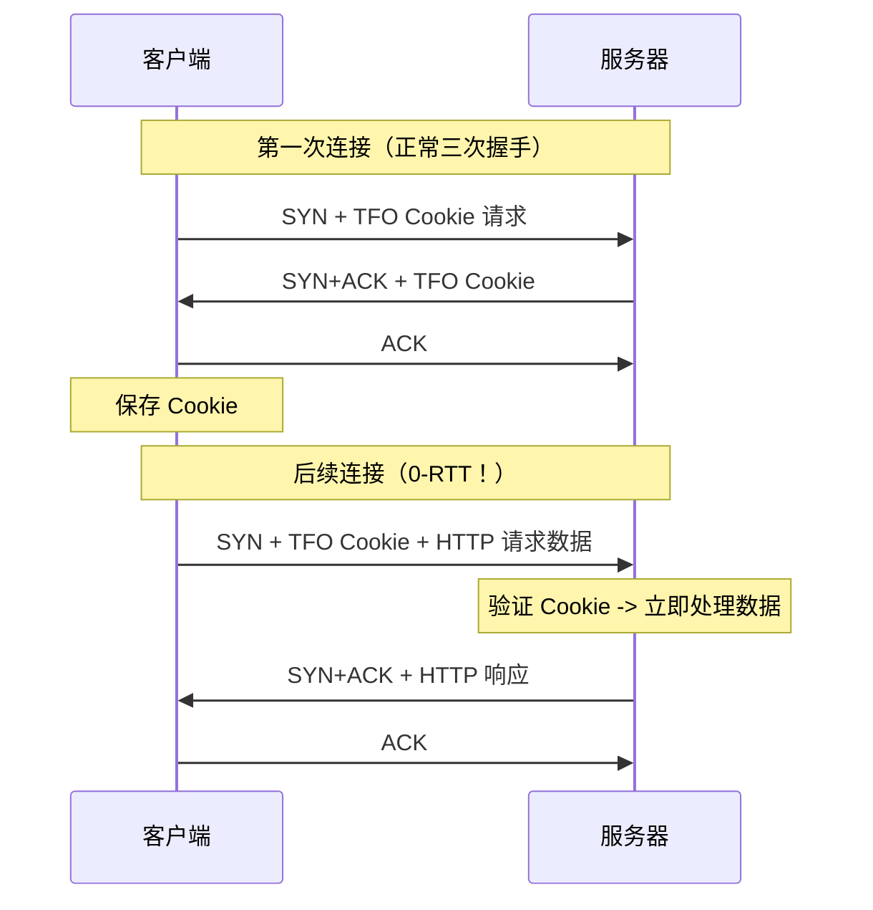
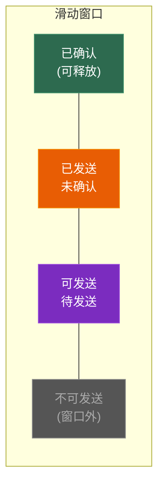
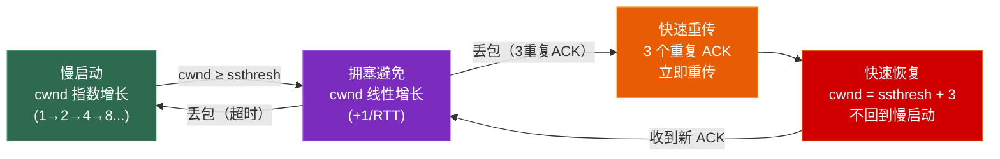

# 第二章 TCP 深入：可靠传输的代价

> **一句话理解**：TCP 用**连接管理 + 序列号 + 确认重传 + 流控 + 拥塞控制**五大机制换来可靠传输——代价是延迟和复杂度。

---

## 2.1 概念直觉 —— What & Why

### TCP 的四个承诺

TCP 保证你发的数据：
1. **不丢** —— 丢了会重传
2. **不重** —— 序列号去重
3. **不乱** —— 按序列号排序后交给应用
4. **不错** —— 校验和检测错误

### 可靠的代价

| 代价 | 原因 |
|------|------|
| **建连延迟** | 三次握手至少 1.5 RTT |
| **队头阻塞** | 一个包丢了，后面的都要等 |
| **头部开销** | TCP 头 20 字节 vs UDP 头 8 字节 |
| **拥塞控制** | 主动降速，可能浪费带宽 |

---

## 2.2 原理图解

### TCP 报文头

```
 0                   1                   2                   3
 0 1 2 3 4 5 6 7 8 9 0 1 2 3 4 5 6 7 8 9 0 1 2 3 4 5 6 7 8 9 0 1
+-+-+-+-+-+-+-+-+-+-+-+-+-+-+-+-+-+-+-+-+-+-+-+-+-+-+-+-+-+-+-+-+
|          Source Port          |       Destination Port        |
+-+-+-+-+-+-+-+-+-+-+-+-+-+-+-+-+-+-+-+-+-+-+-+-+-+-+-+-+-+-+-+-+
|                        Sequence Number                        |
+-+-+-+-+-+-+-+-+-+-+-+-+-+-+-+-+-+-+-+-+-+-+-+-+-+-+-+-+-+-+-+-+
|                    Acknowledgment Number                      |
+-+-+-+-+-+-+-+-+-+-+-+-+-+-+-+-+-+-+-+-+-+-+-+-+-+-+-+-+-+-+-+-+
| Offset| Rsv |U|A|P|R|S|F|          Window Size               |
+-+-+-+-+-+-+-+-+-+-+-+-+-+-+-+-+-+-+-+-+-+-+-+-+-+-+-+-+-+-+-+-+
|           Checksum            |         Urgent Pointer        |
+-+-+-+-+-+-+-+-+-+-+-+-+-+-+-+-+-+-+-+-+-+-+-+-+-+-+-+-+-+-+-+-+
```

| 字段 | 大小 | 含义 |
|------|------|------|
| Sequence Number | 32 bit | 本段数据第一个字节的序号 |
| Acknowledgment Number | 32 bit | 期望收到的下一个字节序号 |
| SYN | 1 bit | 建立连接 |
| ACK | 1 bit | 确认（ACK 号有效） |
| FIN | 1 bit | 关闭连接 |
| RST | 1 bit | 重置连接 |
| Window Size | 16 bit | 接收窗口大小（流量控制） |

### 三次握手



### 四次挥手



### TCP 状态机（简化版）



---

## 2.3 协议深入剖析

### 2.3.1 三次握手详解

**为什么三次握手，不是两次？**

```
两次握手的问题：
1. 客户端发了一个 SYN（连接请求），由于网络延迟在路上卡了很久
2. 客户端超时重发了一个新的 SYN，成功建立连接并通信完毕
3. 之后第一个延迟的 SYN 到达服务器
4. 服务器以为是新的连接请求 → 发 SYN+ACK → 直接建立连接
5. 但客户端早已关闭 → 服务器白白维护了一个无效连接 ❌

三次握手的解决：
3. 服务器收到延迟的 SYN → 发 SYN+ACK
4. 客户端收到 SYN+ACK 但发现不是自己期望的 → 发 RST 拒绝
5. 服务器收到 RST → 丢弃这个连接 ✅
```

> 💡 **面试中的表述**：「三次握手的核心目的是：① 同步双方的初始序列号（ISN）② 防止历史重复连接的 SYN 导致错误建连。两次握手无法让客户端告诉服务器"这个连接我不需要了"。」

**SYN 攻击**：

```
攻击者用伪造的源 IP 发送大量 SYN -> 服务器为每个 SYN 分配资源并等待 ACK
-> ACK 永远不会来（源 IP 是假的）-> 服务器的半连接队列被占满 -> 正常用户无法连接

防御：SYN Cookie
- 服务器收到 SYN 时不分配资源
- 把连接信息编码进 SYN+ACK 的序列号中
- 只有收到合法的第三次 ACK 时才分配资源
```

**半连接队列 vs 全连接队列**：

```
半连接队列（SYN Queue）：
  存放收到 SYN 但还没完成三次握手的连接（SYN_RCVD 状态）
  大小由 tcp_max_syn_backlog 控制

全连接队列（Accept Queue）：
  存放已完成三次握手但还没被 accept() 取走的连接（ESTABLISHED 状态）
  大小由 listen() 的 backlog 参数和 somaxconn 控制

面试常问：
  accept() 发生在三次握手的哪个时刻？
  -> accept() 不参与三次握手。三次握手由内核完成，
     完成后连接放入全连接队列，accept() 只是从队列中取出一个。
```

**TCP Fast Open (TFO)**：



```
TCP Fast Open：在第一个 SYN 包中就携带数据
-> 省去一个 RTT，适合短连接场景
-> Linux 3.7+ 支持
-> 需要服务器支持 TFO Cookie 验证（防重放攻击）
```

---

### 2.3.2 四次挥手详解

**为什么四次挥手，不是三次？**

```
TCP 是全双工的——两个方向的数据流独立关闭。
• 客户端发 FIN：我不再发数据了
• 服务器发 ACK：我知道了，但我可能还有数据要发
• 服务器发 FIN：我也不发了
• 客户端发 ACK：好的

如果服务器没有数据要发了，②③ 可以合并（ACK + FIN），
变成"三次挥手"——这在实际中偶尔会出现。
```

**TIME_WAIT 状态**：

```
TIME_WAIT 持续 2MSL（Maximum Segment Lifetime，通常 60 秒）

为什么要等？
1. 确保最后的 ACK 到达服务器（如果 ACK 丢了，服务器会重发 FIN）
2. 让网络中残留的旧连接数据包消亡（防止新连接收到旧包）

太多 TIME_WAIT 的问题：
- 每个 TIME_WAIT 占用一个 (源IP, 源端口, 目的IP, 目的端口) 四元组
- 高并发短连接服务器可能耗尽端口（客户端连同一个服务器最多 65535 个）
```

```cpp
// === 解决 TIME_WAIT 的方案 ===

// 方案 1：SO_REUSEADDR（最常用）
// 允许绑定到一个处于 TIME_WAIT 状态的地址
// 服务器重启时不用等 60 秒才能重新 bind
int reuse = 1;
setsockopt(sock, SOL_SOCKET, SO_REUSEADDR, &reuse, sizeof(reuse));

// 方案 2：SO_REUSEPORT（Linux 3.9+）
// 允许多个 socket 绑定同一个端口（负载均衡）
int reuseport = 1;
setsockopt(sock, SOL_SOCKET, SO_REUSEPORT, &reuseport, sizeof(reuseport));

// 方案 3：Linux 内核参数
// net.ipv4.tcp_tw_reuse = 1   (允许复用 TIME_WAIT 连接)
// net.ipv4.tcp_max_tw_buckets  (限制 TIME_WAIT 总数)

// 方案 4：使用长连接
// 游戏中通常用长连接 -> TIME_WAIT 只在断线时出现 -> 不是问题
```

**CLOSE_WAIT 大量堆积**:

```
CLOSE_WAIT = 对方已经关闭（发了 FIN），但自己还没有调 close()
大量 CLOSE_WAIT = 代码 bug：收到 FIN 后没有关闭 socket

排查步骤：
1. netstat -anp | grep CLOSE_WAIT   # 找到哪些连接
2. 检查代码中 recv() 返回 0 后是否调用了 close()
3. 检查是否有未关闭的 fd 泄露（RAII 封装 socket 可以避免）
```

**`close()` vs `shutdown()`**：

```cpp
close(fd);
// 关闭 fd，引用计数减 1，计数为 0 时发 FIN
// 如果 fd 被 fork/dup 了，close 不会立即发 FIN

shutdown(fd, SHUT_WR);   // 关闭写端，立即发 FIN（不管引用计数）
shutdown(fd, SHUT_RD);   // 关闭读端
shutdown(fd, SHUT_RDWR); // 关闭双端

// 推荐：先 shutdown(SHUT_WR) 通知对方，再 close()
// 这叫"优雅关闭"（graceful shutdown）
```

---

### 2.3.3 可靠传输机制

```cpp
// 序列号与确认号
// 发送方：每个字节一个序号
// 接收方：ACK = "我已收到所有序号 < ACK 的数据，下一个期望收 ACK"

// 例：发送方发 Seq=100, 长度=50 的数据
//     接收方回 ACK=150（表示 150 之前的都收到了）

// 超时重传
// RTO (Retransmission Timeout) = 根据 RTT 动态计算
// RTT 测量 → SRTT = (1-α)*SRTT + α*RTT（指数加权移动平均）
// RTO = SRTT + 4*RTTVAR

// 快速重传（不等超时）
// 发送方收到 3 个重复 ACK → 立即重传丢失的段
// 例：发了 1,2,3,4,5，其中 2 丢了
// 接收方收到 1 → ACK 2
// 接收方收到 3 → ACK 2（重复 ACK #1，因为还没收到 2）
// 接收方收到 4 → ACK 2（重复 ACK #2）
// 接收方收到 5 → ACK 2（重复 ACK #3）
// 发送方收到 3 个重复 ACK → 立即重传 2（不等超时！）
```

**SACK (Selective ACK)**：

```
普通 ACK 只能说"我收到了连续到 N 的数据"
SACK 可以说"我收到了 1-100, 200-300, 400-500"
→ 发送方只需要重传 101-199, 301-399
→ 大幅减少不必要的重传
```

---

### 2.3.4 流量控制



```
发送窗口 = min(拥塞窗口 cwnd, 接收窗口 rwnd)

• rwnd（接收窗口）：由接收方在 ACK 中告知，防止接收方缓冲区溢出
• cwnd（拥塞窗口）：由发送方根据网络状况动态调整，防止网络拥塞

零窗口：
  接收方来不及处理 → rwnd = 0 → 发送方停止发送
  发送方启动"零窗口探测定时器"，定期发探测包询问窗口是否恢复
```

**Nagle 算法**：

```cpp
// Nagle 算法：把小数据包合并发送，减少网络中的小包数量
// 规则：如果有未确认的数据，则累积后续小数据，直到收到 ACK 或数据量达到 MSS

// 问题：游戏中每帧发一个小包（几十字节），Nagle 会合并它们
// → 导致延迟增加（要等 ACK 或凑够一个 MSS）
// → 游戏体验极差

// 解决：关闭 Nagle
int flag = 1;
setsockopt(sock, IPPROTO_TCP, TCP_NODELAY, &flag, sizeof(flag));
// 设置 TCP_NODELAY 后，数据立即发送，不等合并
```

**Delayed ACK（延迟确认）与 Nagle 的痛苦组合**：

```
延迟确认：接收方不是每收到一个包就立即回 ACK，
而是等一小段时间（40ms），看能否和数据一起捎带回去。

Nagle + Delayed ACK 组合的灾难：
  发送方发了一个小包 -> 等 ACK 才发下一个（Nagle）
  接收方收到小包 -> 等 40ms 再回 ACK（Delayed ACK）
  -> 每个小包延迟 40ms！

游戏必须关闭 Nagle：TCP_NODELAY
接收方也可关闭延迟确认：TCP_QUICKACK（Linux）
```

**Silly Window Syndrome（糊涂窗口综合症）**：

```
问题：接收方缓冲区快满了 -> 窗口变得很小（比如只有 1 字节）
-> 发送方发 1 字节数据 + 20 字节 TCP 头 + 20 字节 IP 头 = 41 字节传 1 字节
-> 效率极低

解决：
- 接收方：窗口小于 MSS 或缓冲区一半时，直接通告 rwnd = 0（Clark 方案）
- 发送方：Nagle 算法（凑够 MSS 或无未确认数据才发送）
```

---

### 2.3.5 拥塞控制

```
拥塞控制 ≠ 流量控制
• 流量控制：保护接收方（rwnd）
• 拥塞控制：保护网络（cwnd）
```

**四个阶段**：



```
1. 慢启动 (Slow Start)
   初始 cwnd = 1 MSS
   每收到一个 ACK → cwnd 翻倍（指数增长：1→2→4→8→16...）
   直到 cwnd ≥ ssthresh → 进入拥塞避免

2. 拥塞避免 (Congestion Avoidance)
   每个 RTT → cwnd 增加 1 MSS（线性增长）
   直到发生丢包

3. 快速重传 (Fast Retransmit)
   收到 3 个重复 ACK → 立即重传（不等超时）

4. 快速恢复 (Fast Recovery) —— Reno 算法
   ssthresh = cwnd / 2
   cwnd = ssthresh + 3
   继续拥塞避免（不回到慢启动）

   如果是超时丢包（更严重）：
   ssthresh = cwnd / 2
   cwnd = 1 MSS
   回到慢启动
```

#### 拥塞控制算法对比

| 算法 | 丢包时行为 | 特点 | 使用 |
|------|-----------|------|------|
| **Tahoe** | cwnd 回到 1，回慢启动 | 最早的，太保守 | 淘汰 |
| **Reno** | cwnd 减半，快速恢复 | 改进 Tahoe | 广泛使用 |
| **Cubic** | 三次函数增长曲线 | 高带宽网络更好 | **Linux 默认** |
| **BBR** | 基于带宽和 RTT 估计 | 不依赖丢包信号 | Google 服务 |

```
Reno vs Cubic 的区别：
  Reno：丢包后线性增长，探测可用带宽慢
  Cubic：用三次函数快速逼近上次丢包前的窗口大小
         在高 BDP（带宽 x 延迟）网络中表现远优于 Reno

BBR（2016 年 Google 提出）：
  传统算法把"丢包"当作拥塞信号 -> 不够准确（WiFi/4G 也会丢包）
  BBR 主动测量带宽和 RTT -> 追求最大吞吐量和最低延迟
  发送速率 = 估计带宽，窗口 = 估计 BDP
  -> 在丢包较多的网络（如移动网络）中表现远好于 Cubic
  -> 适合游戏服务器使用（sudo sysctl net.ipv4.tcp_congestion_control=bbr）
```

---

### 2.3.6 粘包问题

```
TCP 是字节流协议——没有消息边界！
发送方发两次："Hello" 和 "World"
接收方可能收到：
  • "HelloWorld"    → 粘包
  • "Hel" + "loWorld" → 拆包
  • "Hello" + "World" → 刚好（运气好）

原因：TCP 把应用数据视为连续的字节流，Nagle 合并 + 接收方缓冲区一次读多个
```

**解决方案**：

```cpp
// 方案 1：固定长度（简单但浪费）
// 每个消息固定 256 字节，不够补零

// 方案 2：分隔符（适合文本协议）
// 每条消息以 \r\n 结尾

// 方案 3：长度前缀（游戏最常用 ✅）
struct GamePacket {
    uint16_t length;  // 整个包的长度（含头部）
    uint16_t msg_id;  // 消息类型
    // ... payload ...
};

// 接收时的处理：
void onData(const char* data, size_t len) {
    recv_buffer.append(data, len);

    while (recv_buffer.size() >= sizeof(uint16_t)) {
        uint16_t pkt_len = *reinterpret_cast<const uint16_t*>(recv_buffer.data());

        if (recv_buffer.size() < pkt_len) break;  // 数据不完整，等更多数据

        // 完整的包！处理它
        processPacket(recv_buffer.data(), pkt_len);
        recv_buffer.erase(0, pkt_len);
    }
}
```

---

## 2.4 经典面试题

**Q：三次握手的过程？**
> ① 客户端发 SYN（Seq=x），进入 SYN_SENT。② 服务器回 SYN+ACK（Seq=y, Ack=x+1），进入 SYN_RCVD。③ 客户端发 ACK（Ack=y+1），双方进入 ESTABLISHED。目的是同步序列号和防止历史连接。

**Q：为什么不是两次握手？**
> 两次握手无法防止历史延迟的 SYN 导致服务器建立无效连接。三次握手让客户端有机会通过 RST 拒绝过时的连接。

**Q：TIME_WAIT 有什么用？太多怎么办？**
> 等 2MSL 确保最后的 ACK 到达对方（丢了可以重发 FIN），并让旧连接的残留包消亡。太多 TIME_WAIT 用 SO_REUSEADDR 或长连接解决。

**Q：TCP 如何保证可靠传输？**
> 五个机制：① 序列号确认（ACK）② 超时重传 ③ 快速重传（3 重复 ACK）④ 流量控制（滑动窗口）⑤ 拥塞控制（慢启动+拥塞避免）。

**Q：什么是粘包？怎么解决？**
> TCP 是字节流无消息边界，多个消息可能粘在一起或被拆开。用长度前缀（包头写长度）解决——读到足够长度才算一个完整消息。

**Q：Nagle 算法是什么？游戏为什么要关闭它？**
> Nagle 把小包合并发送减少网络开销。但游戏每帧发小包，合并导致延迟不可控。设置 TCP_NODELAY 关闭 Nagle。

---

## 2.5 🎮 游戏实战场景

### TCP 在游戏中的使用场景

```
✅ 适合 TCP：
• 登录认证（安全、可靠）
• 聊天系统（有序、不丢）
• 商城/交易（必须可靠）
• 好友/公会系统
• 热更新下载

❌ 不适合 TCP：
• 位置同步（延迟敏感）
• 战斗同步（队头阻塞致命）
• 语音/视频（丢包可容忍）
```

### 游戏中的 TCP 配置

```cpp
// 游戏客户端 TCP 连接的典型配置
int sock = socket(AF_INET, SOCK_STREAM, 0);

// 1. 关闭 Nagle（必须！）
int nodelay = 1;
setsockopt(sock, IPPROTO_TCP, TCP_NODELAY, &nodelay, sizeof(nodelay));

// 2. 设置发送/接收缓冲区
int bufsize = 64 * 1024;  // 64KB
setsockopt(sock, SOL_SOCKET, SO_SNDBUF, &bufsize, sizeof(bufsize));
setsockopt(sock, SOL_SOCKET, SO_RCVBUF, &bufsize, sizeof(bufsize));

// 3. 设置 keep-alive（心跳检测断线）
int keepalive = 1;
setsockopt(sock, SOL_SOCKET, SO_KEEPALIVE, &keepalive, sizeof(keepalive));
```

#### TCP Keep-Alive 详解

```cpp
// TCP Keep-Alive 的三个参数（Linux）

// 空闲多久后开始发探测包（默认 7200 秒 = 2 小时，太长！）
int idle = 60;  // 游戏中建议 60 秒
setsockopt(sock, IPPROTO_TCP, TCP_KEEPIDLE, &idle, sizeof(idle));

// 每次探测的间隔（默认 75 秒）
int interval = 10;  // 游戏中建议 10 秒
setsockopt(sock, IPPROTO_TCP, TCP_KEEPINTVL, &interval, sizeof(interval));

// 探测多少次失败后判定断连（默认 9 次）
int count = 5;  // 5 次失败就断线
setsockopt(sock, IPPROTO_TCP, TCP_KEEPCNT, &count, sizeof(count));

// 总断线检测时间 = idle + interval * count = 60 + 10*5 = 110 秒
```

```
TCP Keep-Alive vs 应用层心跳：

TCP Keep-Alive：
  - 操作系统实现，零代码
  - 只检测 TCP 连接存活，不检测应用层是否正常
  - 默认间隔太长（2 小时），需要调参

应用层心跳（游戏常用）：
  - 自己实现，客户端定期发 Ping 包，服务器回 Pong
  - 能检测应用逻辑是否卡死（TCP alive 不代表游戏逻辑正常）
  - 频率高（5~30 秒一次）
  - 能携带额外信息（延迟测量、时间同步）

游戏中通常两者都用：TCP Keep-Alive 兜底 + 应用层心跳做细粒度检测
```

### 非阻塞 connect

```cpp
// 游戏中 connect 必须是非阻塞的 —— 不能让游戏主线程卡住
// 方案：非阻塞 socket + poll 等待连接完成

// 1. 设置非阻塞
fcntl(sock, F_SETFL, fcntl(sock, F_GETFL) | O_NONBLOCK);

// 2. connect 会立即返回（errno = EINPROGRESS）
int ret = connect(sock, (sockaddr*)&addr, sizeof(addr));
if (ret == -1 && errno == EINPROGRESS) {
    // 3. 用 poll 等待连接完成
    pollfd pfd = {sock, POLLOUT, 0};
    int ready = poll(&pfd, 1, 5000);  // 5 秒超时

    if (ready > 0 && (pfd.revents & POLLOUT)) {
        // 4. 检查是否真的连接成功
        int err = 0;
        socklen_t len = sizeof(err);
        getsockopt(sock, SOL_SOCKET, SO_ERROR, &err, &len);
        if (err == 0) {
            // 连接成功
        } else {
            // 连接失败（err = ECONNREFUSED 等）
        }
    } else {
        // 超时或错误
    }
}
```

### 队头阻塞 —— TCP 在战斗中的致命缺陷

```
场景：FPS 游戏，每 16ms 发一个位置包
  包序号: 1  2  3  4  5  6  7  8 ...
  包 3 在网络中丢失了

TCP 的行为：
  接收方收到 1,2 → 交给游戏
  收到 4,5,6,7,8 → 缓存起来不交给游戏！（因为 3 还没到）
  等发送方超时重传 3 → 收到 3 → 才一次性交 3,4,5,6,7,8 给游戏

结果：游戏在 3 丢失后卡了一个 RTT + 超时时间
      玩家看到的是"卡了一下然后瞬移"

UDP 的行为：
  收到 1,2 → 交给游戏
  收到 4,5,6,7,8 → 直接交给游戏（跳过 3）
  游戏拿最新的 8 来渲染 → 玩家感知不到丢包

→ 这就是为什么 FPS/MOBA 用 UDP 而不是 TCP
```

---

## 2.6 30 秒速答

**Q：三次握手的过程？**
> 客户端发 SYN，服务器回 SYN+ACK，客户端发 ACK。目的是同步序列号、防止历史连接。

**Q：四次挥手的过程？**
> 主动方发 FIN，被动方回 ACK（此时被动方可能还有数据要发），被动方发 FIN，主动方回 ACK 并进入 TIME_WAIT 等 2MSL。

**Q：TCP 如何保证可靠传输？**
> 序列号+ACK 确认、超时重传、快速重传（3 重复 ACK）、流量控制（滑动窗口）、拥塞控制（慢启动+拥塞避免+快速恢复）。

**Q：什么是粘包？**
> TCP 是字节流无消息边界，多个消息可能粘在一起读出。用长度前缀方案解决：每个消息头部写明长度，接收时按长度拆分。

---

> 📖 上一章：[第一章 网络分层模型与协议概览](../01_network_model) —— TCP/IP 四层模型、数据封装、IP 协议基础。

> 📖 下一章：[第三章 UDP 与可靠 UDP](../03_udp) —— UDP 特点、TCP vs UDP 对比、KCP 原理与游戏网络架构。
