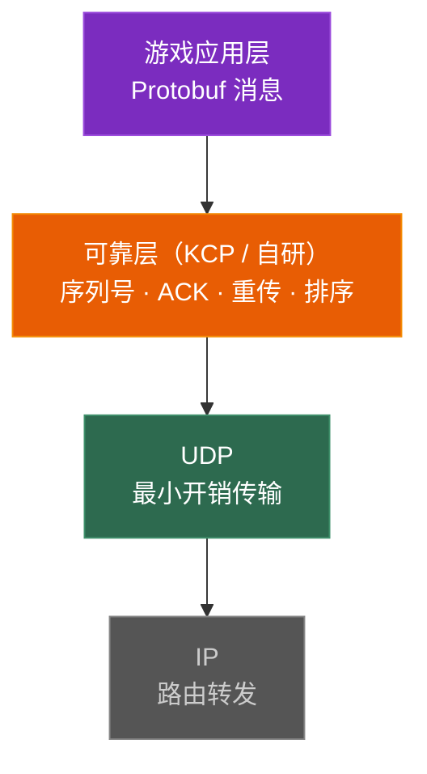
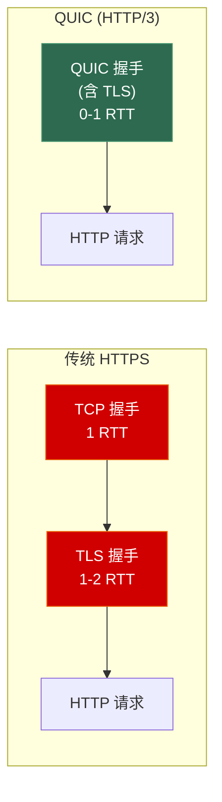

# 第三章 UDP 与可靠 UDP

> **一句话理解**：UDP 是一张"白纸"——它几乎什么都不做，但这正是它的价值。你可以在白纸上只画你需要的东西（可靠 UDP），而不是被迫接受 TCP 的全套机制。

---

## 3.1 概念直觉 —— What & Why

### UDP 的哲学

```
TCP 的态度：我帮你做所有事——可靠、有序、流控、拥塞控制。代价？延迟自己承受。
UDP 的态度：我只负责把包发出去。丢了？乱了？你自己处理。代价？没有代价。
```

### 游戏为什么偏爱 UDP？

| 场景 | 要求 | TCP | UDP |
|------|------|-----|-----|
| FPS 位置同步 | **低延迟** > 不丢包 | ❌ 队头阻塞 | ✅ 立即交付 |
| MOBA 操作指令 | 低延迟 + 可靠 | ❌ 延迟不可控 | ✅ 自研可靠层 |
| MMO 聊天 | 可靠 > 低延迟 | ✅ | — |
| 语音通话 | 实时 > 一切 | ❌ | ✅ 丢了就丢了 |

---

## 3.2 原理图解

### UDP 报文头（只有 8 字节！）

```
 0                   1                   2                   3
 0 1 2 3 4 5 6 7 8 9 0 1 2 3 4 5 6 7 8 9 0 1 2 3 4 5 6 7 8 9 0 1
+-+-+-+-+-+-+-+-+-+-+-+-+-+-+-+-+-+-+-+-+-+-+-+-+-+-+-+-+-+-+-+-+
|          Source Port          |       Destination Port        |
+-+-+-+-+-+-+-+-+-+-+-+-+-+-+-+-+-+-+-+-+-+-+-+-+-+-+-+-+-+-+-+-+
|            Length             |           Checksum            |
+-+-+-+-+-+-+-+-+-+-+-+-+-+-+-+-+-+-+-+-+-+-+-+-+-+-+-+-+-+-+-+-+
```

### TCP vs UDP 全方位对比

| 维度 | TCP | UDP |
|------|-----|-----|
| **连接** | 面向连接（三次握手） | 无连接 |
| **可靠性** | 可靠（重传+确认） | 不可靠 |
| **有序性** | 保证有序 | 不保证 |
| **流量控制** | 有（滑动窗口） | 无 |
| **拥塞控制** | 有（慢启动等） | 无 |
| **头部大小** | 20 字节 | **8 字节** |
| **传输方式** | 字节流（无边界） | **数据报（有边界）** |
| **粘包** | 会粘包 | **不会！** |
| **广播/多播** | 不支持 | **支持** |
| **速度** | 受拥塞控制限制 | 想多快就多快 |
| **场景** | 文件、网页、登录 | 游戏、视频、DNS |

### 可靠 UDP 的分层架构



---

## 3.3 协议深入剖析

### 3.3.1 UDP 的特点

```cpp
// UDP 发送 = 直接扔出去
sendto(sock, data, len, 0, (sockaddr*)&addr, sizeof(addr));
// 不需要 connect()，不需要建立连接
// 每次 sendto 指定目标地址

// UDP 接收 = 一个 recvfrom 收一个完整的数据报
char buf[1500];
sockaddr_in from;
socklen_t fromlen = sizeof(from);
int n = recvfrom(sock, buf, sizeof(buf), 0, (sockaddr*)&from, &fromlen);
// n = 这个数据报的完整长度（有消息边界！不会粘包）
```

**关键特性**：
- **无连接**：不需要握手，发就完了
- **有消息边界**：`sendto` 一次 = `recvfrom` 一次，不会粘包
- **不可靠**：可能丢包、乱序、重复
- **支持广播/多播**：一发多收

### 3.3.2 ARQ 自动重传请求

可靠 UDP 的基础是 ARQ（Automatic Repeat reQuest）：

```
=== Stop-and-Wait ARQ ===
发一个包 → 等 ACK → 收到才发下一个
• 简单但效率低（利用率 = 数据传输时间 / (数据+等待)时间）

=== Go-Back-N ARQ ===
连续发 N 个包（窗口大小 = N）
丢了第 k 个 → 从 k 开始全部重发
• 效率较好但可能重传不必要的包

=== Selective Repeat ARQ ===
连续发 N 个包
丢了第 k 个 → 只重传第 k 个
• 效率最好，KCP 就用的这个
```

### 3.3.3 KCP 协议详解

```
KCP 的设计哲学：
用 10~20% 的带宽浪费，换取 30~40% 的延迟降低。
```

**KCP vs TCP 的核心区别**：

| 优化点 | TCP | KCP |
|--------|-----|-----|
| **RTO 计算** | 超时后 RTO×2（指数退避） | 超时后 RTO×1.5（更激进） |
| **ACK 策略** | 延迟 ACK（等 40ms 合并） | **立即 ACK**（不等待） |
| **重传触发** | 3 个重复 ACK 才快速重传 | **2 个跨越重传**（更快） |
| **流量控制** | 拥塞退让（降速保护网络） | **非退让流控**（你网络拥塞关我什么事） |
| **选择重传** | SACK（可选） | **始终选择重传** |

```cpp
// KCP 的使用方式（纯算法库，不涉及网络 IO）
#include "ikcp.h"

// 1. 创建 KCP 对象
ikcpcb* kcp = ikcp_create(0x1234, user_data);

// 2. 设置输出回调（KCP 要发数据时调用你的 UDP sendto）
ikcp_setoutput(kcp, [](const char* buf, int len, ikcpcb* kcp, void* user) -> int {
    return sendto(udp_sock, buf, len, 0, /*...*/);
});

// 3. 收到 UDP 数据时喂给 KCP
char buf[1500];
int n = recvfrom(udp_sock, buf, sizeof(buf), 0, /*...*/);
ikcp_input(kcp, buf, n);

// 4. 从 KCP 读取可靠有序的数据
char data[1024];
int len = ikcp_recv(kcp, data, sizeof(data));
if (len > 0) {
    processGameMessage(data, len);
}

// 5. 发送数据（KCP 自动拆分、排序、重传）
ikcp_send(kcp, msg, msg_len);

// 6. 定时驱动 KCP（通常每 10~20ms 调用一次）
ikcp_update(kcp, current_ms);
```

### 3.3.4 QUIC 协议简介



**QUIC 核心优势**：
- **0-RTT 恢复连接**：之前连过的服务器可以零延迟恢复
- **无队头阻塞**：基于 UDP，多个流独立，一个流丢包不影响其他流
- **内建 TLS 1.3**：安全性与传输合一
- **连接迁移**：网络切换（Wi-Fi → 4G）不断连（用 Connection ID 而非 IP+Port 标识连接）

---

## 3.4 经典面试题

**Q：TCP 和 UDP 的区别？**
> TCP 面向连接、可靠、字节流；UDP 无连接、不可靠、数据报。TCP 有流控和拥塞控制，头部 20 字节；UDP 无，头部仅 8 字节。TCP 保证有序不丢，UDP 可能乱序丢包。TCP 不能广播，UDP 可以。

**Q：为什么 FPS 游戏用 UDP 不用 TCP？**
> TCP 的队头阻塞问题——一个包丢失会导致后续所有包被阻塞等待重传，游戏中表现为"卡顿后瞬移"。UDP 丢了就丢了，游戏用最新状态渲染，体验更流畅。需要可靠性时在 UDP 上加自研可靠层（KCP）。

**Q：如何在 UDP 上实现可靠传输？**
> 用 ARQ 机制：给每个包编序列号，接收方回 ACK，超时未收到 ACK 就重传。用选择性重传（Selective Repeat）只重翻丢失的包。KCP 就是这个思路的成熟实现。

**Q：KCP 为什么比 TCP 快？**
> 四个优化：① 不延迟 ACK，立即回复 ② RTO 不做指数退避（×1.5 而非 ×2）③ 快速重传更激进（2 个跨越就重传）④ 不做拥塞退让（流量换延迟）。代价是多用 10~20% 带宽。

**Q：UDP 会粘包吗？**
> 不会！UDP 是数据报协议，有消息边界。`sendto` 一次发的数据，`recvfrom` 一次完整接收。这是 UDP 和 TCP（字节流）的本质区别。

---

## 3.5 🎮 游戏实战场景

### 3.5.1 游戏网络架构方案

```
方案 1：纯 TCP（小型/回合制游戏）
  简单可靠，Nagle 关掉后延迟可接受

方案 2：纯 UDP + 可靠层（FPS/MOBA）
  全部走 KCP/自研可靠 UDP
  最低延迟，但需要自己处理可靠性

方案 3：TCP + UDP 混合（MMO，最常见）
  TCP：登录、聊天、交易、邮件（可靠不急）
  UDP/KCP：位置同步、战斗、技能（延迟敏感）

方案 4：WebSocket（H5 / 微信小游戏）
  浏览器不支持原生 UDP → 只能用 WebSocket（基于 TCP）
  延迟较高，适合休闲/卡牌/回合制
```

### 3.5.2 简化版可靠 UDP 实现

```cpp
// 简化版可靠发送：序列号 + ACK + 超时重传
class ReliableUDP {
    struct PendingPacket {
        uint32_t seq;
        std::vector<uint8_t> data;
        std::chrono::steady_clock::time_point send_time;
        int retries = 0;
    };

    int _sock;
    sockaddr_in _remote;
    uint32_t _next_seq = 0;
    uint32_t _remote_ack = 0;
    std::deque<PendingPacket> _pending;
    static constexpr auto RTO = std::chrono::milliseconds(100);

public:
    void sendReliable(const void* data, size_t len) {
        // 加上序列号头部
        uint32_t seq = _next_seq++;
        std::vector<uint8_t> packet(sizeof(seq) + len);
        std::memcpy(packet.data(), &seq, sizeof(seq));
        std::memcpy(packet.data() + sizeof(seq), data, len);

        sendto(_sock, packet.data(), packet.size(), 0,
               (sockaddr*)&_remote, sizeof(_remote));

        _pending.push_back({seq, packet,
            std::chrono::steady_clock::now()});
    }

    void onAckReceived(uint32_t ack_seq) {
        // 移除已确认的包
        while (!_pending.empty() && _pending.front().seq <= ack_seq) {
            _pending.pop_front();
        }
    }

    void tick() {
        auto now = std::chrono::steady_clock::now();
        for (auto& pkt : _pending) {
            if (now - pkt.send_time > RTO) {
                // 超时重传
                sendto(_sock, pkt.data.data(), pkt.data.size(), 0,
                       (sockaddr*)&_remote, sizeof(_remote));
                pkt.send_time = now;
                pkt.retries++;
            }
        }
    }
};
```

---

## 3.6 30 秒速答

**Q：TCP 和 UDP 的区别？**
> TCP 面向连接、可靠、字节流、有流控拥塞控制、头部 20 字节。UDP 无连接、不可靠、数据报有边界、无流控、头部 8 字节。游戏战斗用 UDP，登录交易用 TCP。

**Q：游戏为什么用 UDP？**
> TCP 的队头阻塞导致丢包时后续数据全被卡住，游戏表现为卡顿瞬移。UDP 丢了不等，用最新数据渲染。需要可靠性时在 UDP 上加 KCP 等可靠层，只实现需要的可靠性。

**Q：KCP 的核心原理？**
> 基于 UDP 的可靠传输库，用带宽换延迟。四个优化：不延迟 ACK、RTO 不指数退避、更激进的快速重传、非退让流控。适合游戏等延迟敏感场景。

---

> 📖 上一章：[第二章 TCP 深入：可靠传输的代价](../02_tcp) —— 三次握手、四次挥手、滑动窗口、拥塞控制。

> 📖 下一章：[第四章 HTTP、HTTPS 与应用层协议](../04_http) —— HTTP 版本演进、TLS 加密、WebSocket、Protobuf 序列化。
