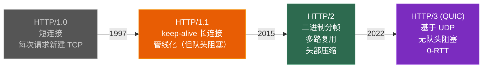
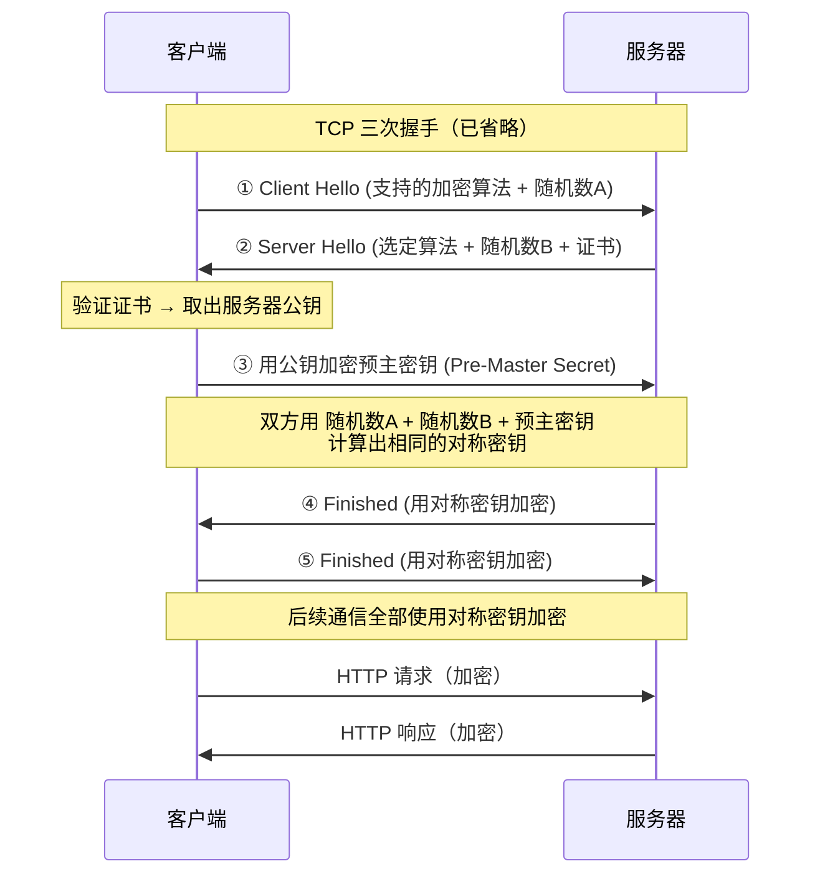
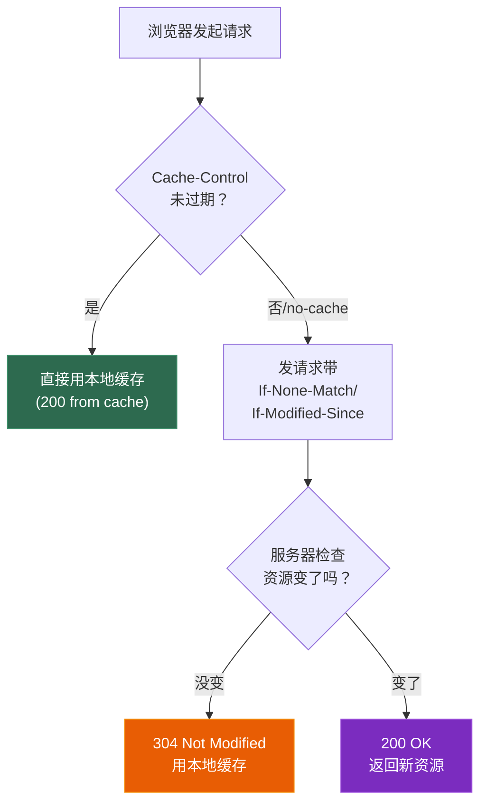

# 第四章 HTTP、HTTPS 与应用层协议

> **一句话理解**：HTTP 是 Web 的通用语言，HTTPS 给它加了一把锁（TLS），而游戏真正关心的是**序列化方案**（Protobuf）和**实时通信**（WebSocket / 自定义协议）。

---

## 4.1 概念直觉 —— What & Why

### 游戏为什么要关心 HTTP？

```
游戏中 HTTP 的使用场景（比你想象的多）：
• 登录认证 → HTTPS + OAuth / JWT
• 热更新   → HTTP + CDN 下载资源包
• 排行榜   → REST API
• 公告/邮件 → HTTP 接口
• SDK 接入  → 支付、广告都是 HTTP
• 埋点上报  → HTTP POST
```

---

## 4.2 原理图解

### HTTP 版本演进



### HTTPS = HTTP + TLS



---

## 4.3 协议深入剖析

### 4.3.1 HTTP 报文结构

```
=== 请求报文 ===
GET /api/leaderboard?type=pvp HTTP/1.1      ← 请求行（方法 URI 版本）
Host: game.example.com                       ← 头部
Content-Type: application/json
Authorization: Bearer <token>
                                             ← 空行
{"page": 1, "count": 20}                     ← 请求体（GET 通常没有）

=== 响应报文 ===
HTTP/1.1 200 OK                              ← 状态行
Content-Type: application/json
Content-Length: 256
                                             ← 空行
{"players": [...]}                           ← 响应体
```

### 常见状态码

| 状态码 | 含义 | 场景 |
|--------|------|------|
| **200** | OK | 正常返回 |
| **301** | 永久重定向 | 域名迁移 |
| **302** | 临时重定向 | 登录后跳转 |
| **304** | Not Modified | 缓存有效（配合 ETag） |
| **400** | Bad Request | 请求参数错误 |
| **401** | Unauthorized | 未登录 |
| **403** | Forbidden | 无权限 |
| **404** | Not Found | 资源不存在 |
| **500** | Internal Server Error | 服务器 bug |
| **502** | Bad Gateway | 网关/代理后端挂了 |
| **503** | Service Unavailable | 服务器过载 |

### GET vs POST

| 维度 | GET | POST |
|------|-----|------|
| **语义** | 获取资源 | 提交数据 |
| **参数位置** | URL 查询字符串 | 请求体 |
| **长度** | URL 有长度限制（~2KB） | 无限制 |
| **缓存** | 可缓存 | 不缓存 |
| **安全性** | 参数暴露在 URL 中 | 参数在 body 中 |
| **幂等性** | 幂等（多次请求结果一样） | 不幂等 |

---

### 4.3.2 HTTP/1.1 vs HTTP/2

| 特性 | HTTP/1.1 | HTTP/2 |
|------|---------|--------|
| **格式** | 文本 | 二进制帧 |
| **多路复用** | 队头阻塞（一个连接一次一个请求） | ✅ 一个连接并行多个流 |
| **头部** | 每次完整发送 | HPACK 压缩 |
| **服务器推送** | ❌ | ✅ 主动推送资源 |

```
HTTP/1.1 的队头阻塞：
  连接 1: 请求A → 等响应A → 请求B → 等响应B
  解决方案：开 6 个并行连接 → 但每个都占资源

HTTP/2 多路复用：
  连接 1: 流1:请求A  流2:请求B  流3:请求C  → 并行处理
  一个 TCP 连接就够了
```

---

### 4.3.3 HTTPS / TLS 详解

**对称加密 vs 非对称加密**：

| 维度 | 对称加密 | 非对称加密 |
|------|---------|-----------|
| **密钥** | 一把（加解密同一把） | 一对（公钥加密、私钥解密） |
| **速度** | 快（AES ≈ GB/s） | 慢（RSA ≈ MB/s） |
| **问题** | 如何安全传递密钥？ | 慢，不适合大量数据 |
| **算法** | AES, ChaCha20 | RSA, ECDHE |

```
HTTPS 的聪明之处：
用非对称加密安全地交换对称密钥 → 之后用对称密钥加密数据
= 非对称的安全性 + 对称的速度
```

**证书链**：

```
服务器证书是否可信？
→ 证书由 CA（证书颁发机构）签名
→ CA 的证书由更高级 CA 签名
→ 根 CA 的证书内置在操作系统/浏览器中

验证链：服务器证书 → 中间 CA → 根 CA（预装信任）

中间人攻击 (MITM)：
  攻击者拦截通信 → 伪造证书 → 如果客户端不验证证书就会被骗
  防御：严格验证证书链 + 证书固定 (Certificate Pinning)
```

---

### 4.3.4 WebSocket

```cpp
// WebSocket = HTTP 升级后的全双工协议
// 建立过程：
// 1. 客户端发 HTTP 请求带 Upgrade: websocket
// 2. 服务器回 101 Switching Protocols
// 3. 之后双方直接发 WebSocket 帧（不再是 HTTP）

// WebSocket vs HTTP 长连接 vs TCP
// HTTP 长连接：保持 TCP 连接复用，但仍是请求-响应模式
// WebSocket：建立后双方可随时发消息（全双工）
// 裸 TCP：更底层，WebSocket 是基于 TCP 的应用层协议
```

---

### 4.3.5 序列化协议

| 协议 | 格式 | 速度 | 大小 | 场景 |
|------|------|------|------|------|
| **JSON** | 文本 | 慢 | 大 | REST API、可读性要求高 |
| **Protobuf** | 二进制 | **快** | **小** | 游戏协议（首选） |
| **FlatBuffers** | 二进制 | **极快**（零拷贝） | 中 | 高性能场景 |
| **MessagePack** | 二进制 | 快 | 小 | JSON 的二进制替代 |

```protobuf
// Protobuf 定义（.proto 文件）
message PlayerMove {
    uint32 player_id = 1;
    float x = 2;
    float y = 3;
    float z = 4;
    float yaw = 5;
    uint32 timestamp = 6;
}

// 序列化后只有 ~24 字节（JSON 可能 100+ 字节）
// 编解码速度比 JSON 快 5~10 倍
```

---

### 4.3.6 HTTP 缓存机制

```
面试高频！缓存是性能优化的核心手段。

=== 强缓存（不发请求，直接用本地缓存）===
Cache-Control: max-age=3600    // 3600 秒内直接用缓存
Cache-Control: no-cache        // 每次都验证（不是不缓存！）
Cache-Control: no-store        // 真正的不缓存
Expires: Thu, 01 Jan 2027 00:00:00 GMT  // 过期时间（HTTP/1.0，已被 Cache-Control 取代）

=== 协商缓存（发请求问服务器，资源变了吗？）===
方案 1: Last-Modified / If-Modified-Since
  首次响应: Last-Modified: Wed, 22 Apr 2026 10:00:00 GMT
  再次请求: If-Modified-Since: Wed, 22 Apr 2026 10:00:00 GMT
  未修改: 304 Not Modified（不传 body，省带宽）
  已修改: 200 OK + 新内容

方案 2: ETag / If-None-Match（更精确）
  首次响应: ETag: "abc123"
  再次请求: If-None-Match: "abc123"
  未修改: 304
  已修改: 200 + 新 ETag
```



---

### 4.3.7 认证：Cookie / Session / JWT

| 维度 | Cookie | Session | JWT |
|------|--------|---------|-----|
| **存储位置** | 客户端浏览器 | 服务器内存/Redis | 客户端（token 字符串） |
| **大小限制** | 4KB | 无（服务器端） | 无（但尽量小） |
| **安全性** | 可被窃取（XSS） | 较安全（数据在服务器） | 签名防篡改，但可解码 |
| **跨域** | 受同源策略限制 | 依赖 Cookie | 可跨域（放 Header） |
| **扩展性** | 差 | 差（有状态） | 好（无状态） |
| **游戏中** | 少用 | Web 后台管理 | **游戏登录首选** |

```
JWT (JSON Web Token) 在游戏中的使用：
  登录流程：
  1. 客户端用账号密码请求登录接口
  2. 服务器验证 -> 生成 JWT (Header.Payload.Signature)
  3. 客户端保存 JWT，后续请求放在 Authorization: Bearer <token>
  4. 服务器收到请求 -> 验证签名 -> 解析 Payload 得到 user_id

  优点：无状态，服务器不需要存 session -> 适合分布式游戏服务器
```

---

### 4.3.8 CORS 跨域

```
同源策略：浏览器限制 JS 只能访问同协议+同域名+同端口的资源
跨域请求：前端 https://game.com 请求 https://api.game.com -> 跨域！

CORS（Cross-Origin Resource Sharing）：
  服务器在响应头中声明允许哪些源访问：
  Access-Control-Allow-Origin: https://game.com
  Access-Control-Allow-Methods: GET, POST
  Access-Control-Allow-Headers: Authorization, Content-Type

简单请求 vs 预检请求：
  简单请求（GET/POST + 常见 Content-Type）-> 直接发
  复杂请求（PUT/DELETE 或自定义 Header）-> 先发 OPTIONS 预检
```

---

## 4.4 经典面试题

**Q：HTTP 和 HTTPS 的区别？**
> HTTP 明文传输，端口 80；HTTPS = HTTP + TLS 加密，端口 443。HTTPS 用非对称加密交换密钥，再用对称加密传数据。需要 CA 证书验证身份。

**Q：HTTPS 的加密过程？**
> TLS 握手：客户端发支持的算法和随机数，服务器返回选定算法、随机数和证书，客户端验证证书后用公钥加密预主密钥发给服务器，双方用三个随机数生成对称密钥。后续用对称密钥加密。

**Q：HTTP/1.1 和 HTTP/2 的区别？**
> HTTP/2 用二进制帧替代文本格式，支持多路复用（一个连接并行多个流），HPACK 头部压缩，服务器推送。核心解决了 HTTP/1.1 的队头阻塞问题。

**Q：GET 和 POST 的区别？**
> GET 获取资源，参数在 URL 中，幂等可缓存。POST 提交数据，参数在 body 中，非幂等不缓存。GET 有长度限制，POST 无。

**Q：Cookie 和 Session 的区别？**
> Cookie 存在客户端浏览器中，Session 存在服务器端。Cookie 通过 HTTP 头自动发送，Session 通过 Cookie 中的 Session ID 关联。Session 更安全（数据在服务器），Cookie 有大小限制（4KB）。

**Q：为什么游戏用 Protobuf 而不是 JSON？**
> Protobuf 是二进制格式，比 JSON 小 3~10 倍，编解码快 5~10 倍。游戏每秒发大量同步包，用 JSON 会浪费带宽和 CPU。Protobuf 还有强类型 schema，代码生成方便。

---

## 4.5 🎮 游戏实战场景

### 4.5.1 热更新系统

```cpp
// 游戏热更新流程
// 1. 客户端启动 → 请求版本检查接口
// GET https://update.game.com/api/version?platform=android&channel=official
// 响应: { "latest": "1.2.3", "patches": [...] }

// 2. 对比本地版本 → 下载差异包
// GET https://cdn.game.com/patches/1.2.2_to_1.2.3.zip
// (从 CDN 下载，不走游戏服务器)

// 3. 校验（MD5/SHA256） → 解压 → 应用

// 为什么用 HTTP + CDN？
// • CDN 在全球有边缘节点，就近下载速度快
// • HTTP 协议成熟，断点续传（Range 头部）
// • 与游戏服务器解耦，更新不影响游戏逻辑
```

### 4.5.2 游戏协议设计

```cpp
// 典型的游戏协议栈
//
// ┌──────────────────────────────────┐
// │ Protobuf 消息 (PlayerMove 等)    │
// ├──────────────────────────────────┤
// │ 包头: [2B 长度][2B 消息ID]       │
// ├──────────────────────────────────┤
// │ 可靠层 (KCP / TCP)              │
// └──────────────────────────────────┘

// 协议注册表
std::unordered_map<uint16_t, std::function<void(const char*, size_t)>> handlers;

void registerHandlers() {
    handlers[1001] = [](const char* data, size_t len) {
        PlayerMove msg;
        msg.ParseFromArray(data, len);  // Protobuf 反序列化
        handlePlayerMove(msg);
    };
    handlers[1002] = [](const char* data, size_t len) {
        ChatMessage msg;
        msg.ParseFromArray(data, len);
        handleChat(msg);
    };
}

void onPacketReceived(uint16_t msgId, const char* data, size_t len) {
    if (auto it = handlers.find(msgId); it != handlers.end()) {
        it->second(data, len);
    }
}
```

---

## 4.6 30 秒速答

**Q：HTTP 和 HTTPS 的区别？**
> HTTP 明文不安全，HTTPS 加了 TLS 加密。TLS 用非对称加密交换密钥，之后用对称密钥加密数据。需要 CA 证书验证服务器身份。

**Q：对称加密和非对称加密？**
> 对称加密用同一把密钥，快但密钥分发难。非对称加密用公钥加密私钥解密，安全但慢。HTTPS 结合两者：非对称交换密钥，对称加密数据。

**Q：HTTP/1.1 vs 2.0？**
> HTTP/2 用二进制帧、支持多路复用解决队头阻塞、HPACK 压缩头部、支持服务器推送，一个 TCP 连接就能并行处理多个请求。

**Q：为什么游戏用 Protobuf？**
> 二进制编码比 JSON 小 3~10 倍、快 5~10 倍。强类型 schema 自动生成代码，适合高频网络同步。

---

> 📖 上一章：[第三章 UDP 与可靠 UDP](../03_udp) —— UDP 特点、TCP vs UDP、KCP 原理与游戏网络架构。

> 📖 下一章：[第五章 Socket 编程与 IO 模型](../05_socket_and_io) —— Socket API、select/poll/epoll、Reactor 模式与游戏服务器 IO 架构。
