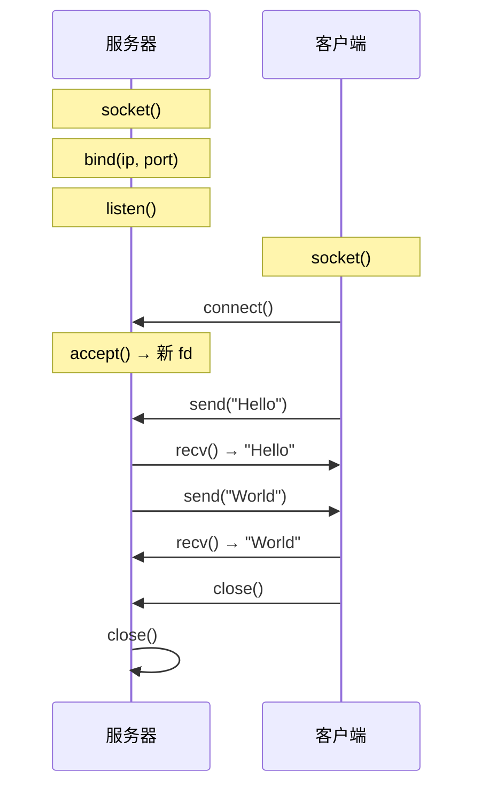
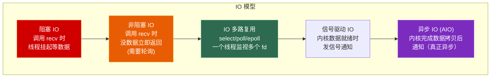
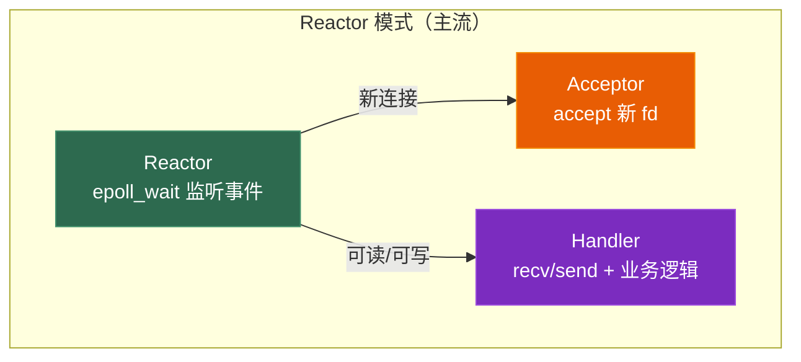

# 第五章 Socket 编程与 IO 模型

> **一句话理解**：Socket 是操作系统给你的"网络文件描述符"——对它读写就是收发网络数据。IO 模型决定你"怎么高效地管理上千个 Socket"。

---

## 5.1 概念直觉 —— What & Why

### Socket 是什么？

```
Socket = IP 地址 + 端口号 = 网络通信的端点
在 OS 眼中，Socket 就是一个文件描述符（fd），和文件一样可以 read/write。

一条 TCP 连接由五元组唯一标识：
<源 IP, 源端口, 目的 IP, 目的端口, 协议(TCP/UDP)>
```

### 为什么需要 IO 多路复用？

```
问题：游戏服务器要管理几千个连接，每个连接可能随时有数据到来。

方案 1：每连接一个线程
  → 1000 个连接 = 1000 个线程 → 内存爆炸 + 上下文切换开销

方案 2：非阻塞 + 轮询
  → 每个 fd 都试一遍 recv → CPU 空转浪费

方案 3：IO 多路复用 ✅
  → 一个线程监视所有 fd → 哪个 fd 有数据就处理哪个
  → select / poll / epoll
```

---

## 5.2 原理图解

### TCP Socket 编程流程



### 五种 IO 模型



```
关键区别：
• 阻塞/非阻塞/IO 多路复用/信号驱动 → 都是同步 IO
  （数据从内核缓冲区拷贝到用户缓冲区时，进程阻塞）
• 异步 IO → 内核帮你完成全部操作，完成后通知你
```

---

## 5.3 深入剖析

### 5.3.1 Socket API 基础

```cpp
#include <sys/socket.h>   // Linux
// #include <winsock2.h>   // Windows

// === TCP 服务器 ===
// 1. 创建 socket
int server_fd = socket(AF_INET, SOCK_STREAM, 0);  // TCP

// 2. 绑定地址
sockaddr_in addr{};
addr.sin_family = AF_INET;
addr.sin_addr.s_addr = INADDR_ANY;  // 监听所有网卡
addr.sin_port = htons(8080);         // 端口 8080（网络字节序）
bind(server_fd, (sockaddr*)&addr, sizeof(addr));

// 3. 监听
listen(server_fd, 128);  // backlog = 128（半连接/全连接队列大小）

// 4. 接受连接
sockaddr_in client_addr{};
socklen_t client_len = sizeof(client_addr);
int client_fd = accept(server_fd, (sockaddr*)&client_addr, &client_len);
// accept 返回一个新的 fd，用于和这个客户端通信

// 5. 收发数据
char buf[1024];
ssize_t n = recv(client_fd, buf, sizeof(buf), 0);
send(client_fd, "OK", 2, 0);

// 6. 关闭
close(client_fd);
close(server_fd);

// === TCP 客户端 ===
int sock = socket(AF_INET, SOCK_STREAM, 0);
sockaddr_in server_addr{};
server_addr.sin_family = AF_INET;
server_addr.sin_port = htons(8080);
inet_pton(AF_INET, "127.0.0.1", &server_addr.sin_addr);

connect(sock, (sockaddr*)&server_addr, sizeof(server_addr));
send(sock, "Hello", 5, 0);
close(sock);
```

```cpp
// === UDP 通信（无需 connect/listen/accept）===
int sock = socket(AF_INET, SOCK_DGRAM, 0);  // SOCK_DGRAM = UDP

// 发送（指定目标地址）
sendto(sock, data, len, 0, (sockaddr*)&dest, sizeof(dest));

// 接收（返回来源地址）
sockaddr_in from{};
socklen_t fromlen = sizeof(from);
recvfrom(sock, buf, sizeof(buf), 0, (sockaddr*)&from, &fromlen);
```

---

### 5.3.2 阻塞 vs 非阻塞

```cpp
// 阻塞（默认）：没数据就一直等
ssize_t n = recv(fd, buf, sizeof(buf), 0);
// → 线程挂起，直到有数据或连接关闭

// 非阻塞：没数据立即返回
#include <fcntl.h>
fcntl(fd, F_SETFL, fcntl(fd, F_GETFL) | O_NONBLOCK);

ssize_t n = recv(fd, buf, sizeof(buf), 0);
if (n == -1 && errno == EAGAIN) {
    // 没有数据，稍后再试
}
```

---

### 5.3.3 IO 多路复用

#### select

```cpp
fd_set readfds;
FD_ZERO(&readfds);
FD_SET(server_fd, &readfds);
FD_SET(client_fd, &readfds);

int max_fd = std::max(server_fd, client_fd);
timeval tv = {1, 0};  // 超时 1 秒

int ready = select(max_fd + 1, &readfds, nullptr, nullptr, &tv);
if (ready > 0) {
    if (FD_ISSET(server_fd, &readfds)) {
        // 新连接到来
        accept(server_fd, ...);
    }
    if (FD_ISSET(client_fd, &readfds)) {
        // 客户端有数据
        recv(client_fd, buf, ...);
    }
}
```

**select 的问题**：
- `fd_set` 是位图，受 `FD_SETSIZE` 限制（通常 **1024**）
- 每次调用都要把 `fd_set` 从用户态**拷贝到内核态**
- 内核返回后要 **O(n) 遍历**所有 fd 找出就绪的
- 每次调用完 `fd_set` 会被修改，需要重新设置

#### poll

```cpp
std::vector<pollfd> fds;
fds.push_back({server_fd, POLLIN, 0});
fds.push_back({client_fd, POLLIN, 0});

int ready = poll(fds.data(), fds.size(), 1000);  // 超时 1000ms
for (auto& pfd : fds) {
    if (pfd.revents & POLLIN) {
        // 有数据可读
    }
}
```

**poll vs select**：用 `pollfd` 数组替代位图，**无 1024 限制**，但仍然 O(n) 遍历。

#### epoll（Linux，最优解）

```cpp
// 1. 创建 epoll 实例
int epfd = epoll_create1(0);

// 2. 注册 fd
epoll_event ev{};
ev.events = EPOLLIN;       // 监听可读事件
ev.data.fd = server_fd;
epoll_ctl(epfd, EPOLL_CTL_ADD, server_fd, &ev);

// 3. 等待事件
epoll_event events[1024];
int n = epoll_wait(epfd, events, 1024, 1000);  // 超时 1000ms

// 4. 只遍历就绪的 fd（不是所有 fd！）
for (int i = 0; i < n; ++i) {
    if (events[i].data.fd == server_fd) {
        int client = accept(server_fd, ...);
        // 注册新客户端
        ev.events = EPOLLIN | EPOLLET;  // 边缘触发
        ev.data.fd = client;
        epoll_ctl(epfd, EPOLL_CTL_ADD, client, &ev);
    } else {
        recv(events[i].data.fd, buf, ...);
    }
}
```

### select vs poll vs epoll 对比

| 维度 | select | poll | epoll |
|------|--------|------|-------|
| **fd 上限** | 1024 | 无限制 | 无限制 |
| **内核实现** | 线性遍历 | 线性遍历 | **红黑树 + 就绪链表** |
| **每次调用** | 拷贝全部 fd | 拷贝全部 fd | **不拷贝**（内核维护） |
| **返回后** | O(n) 遍历找就绪 | O(n) 遍历找就绪 | **只返回就绪的 fd** |
| **性能** | O(n) | O(n) | **O(就绪数)** |
| **触发模式** | LT | LT | **LT + ET** |
| **跨平台** | ✅ | ✅ | ❌ Linux 专有 |

#### ET vs LT

```
LT (Level Triggered, 水平触发, 默认)：
  只要 fd 可读 → 每次 epoll_wait 都返回它
  → 你可以分多次读

ET (Edge Triggered, 边缘触发)：
  fd 从不可读变为可读时 → 只通知一次
  → 你必须一次读完（循环 read 直到 EAGAIN）
  → 性能更好（通知次数少），但编程更难

ET 的正确使用：
  while (true) {
      ssize_t n = read(fd, buf, sizeof(buf));
      if (n == -1 && errno == EAGAIN) break;  // 读完了
      if (n == 0) { /* 对方关闭 */ break; }
      process(buf, n);
  }
```

#### Windows IOCP（完成端口）

```
IOCP 是 Windows 的异步 IO 模型（Proactor 模式）：
• 你告诉内核"帮我读这个 fd"
• 内核完成读操作后通知你"读好了，数据在这"
• 真正的异步——数据已经在用户缓冲区了

vs epoll（Reactor 模式）：
• epoll 告诉你"这个 fd 可读了"
• 你自己调 read() 把数据从内核拷到用户空间
• 是同步 IO（read 时进程仍然阻塞）
```

---

### 5.3.4 网络编程模式



| 模式 | 描述 | 典型应用 |
|------|------|---------|
| **单 Reactor 单线程** | 一个线程 epoll + 处理 | Redis |
| **单 Reactor 多线程** | 一个线程 epoll，线程池处理业务 | 中型游戏服 |
| **多 Reactor 多线程** | 主 Reactor 接连接，子 Reactor 处理 IO | Nginx, 大型游戏服 |

---

## 5.4 经典面试题

**Q：select、poll、epoll 的区别？**
> select 用位图，上限 1024，每次全量拷贝和遍历。poll 用数组，无上限但仍 O(n)。epoll 用红黑树+就绪链表，只返回就绪 fd，O(就绪数)。epoll 是 Linux 高性能服务器的标准选择。

**Q：epoll 的 ET 和 LT 模式区别？**
> LT 只要可读就每次返回，可以分多次读。ET 只在状态变化时通知一次，必须一次读完（循环到 EAGAIN）。ET 性能更好但编程更复杂。

**Q：什么是 Reactor 模式？**
> Reactor 用一个事件循环（epoll_wait）监听所有 fd 的事件，事件就绪后分发给对应的 Handler 处理。分为单 Reactor 单线程（如 Redis）、单 Reactor 多线程、多 Reactor 多线程（如 Nginx）。

**Q：IO 多路复用是同步还是异步？**
> 同步！select/poll/epoll 只是告诉你"哪个 fd 就绪了"，你仍然需要自己调 read/write，这一步是阻塞的（数据从内核拷贝到用户空间）。真正的异步 IO 是 IOCP——内核帮你完成整个读操作。

**Q：C10K 问题是什么？**
> 如何用一台服务器同时处理 10,000 个并发连接。传统每连接一个线程模型会耗尽内存。解决方案：IO 多路复用（epoll）+ 非阻塞 IO + 事件驱动（Reactor）。

---

## 5.5 🎮 游戏实战场景

### 5.5.1 游戏客户端网络线程

```cpp
// 游戏客户端：单独的网络线程 + 主线程消息队列
// （交叉引用 C++ Ch7 的 SPSC 无锁队列）

class NetworkThread {
    int _sock;
    SPSCQueue<NetMessage, 4096> _recv_queue;  // 网络线程 → 主线程
    SPSCQueue<NetMessage, 4096> _send_queue;  // 主线程 → 网络线程
    std::atomic<bool> _running{true};

public:
    void run() {
        while (_running.load()) {
            // 用 select/poll 检查读写就绪（客户端只有一个连接，不需要 epoll）
            pollfd pfd = {_sock, POLLIN | POLLOUT, 0};
            int ret = poll(&pfd, 1, 10);  // 10ms 超时

            if (pfd.revents & POLLIN) {
                // 有数据可读
                char buf[4096];
                int n = recv(_sock, buf, sizeof(buf), 0);
                if (n > 0) {
                    // 解析包 → 推入接收队列
                    NetMessage msg = parsePacket(buf, n);
                    _recv_queue.push(msg);
                }
            }

            // 发送队列中的数据
            NetMessage out;
            while (_send_queue.pop(out)) {
                auto data = serializePacket(out);
                send(_sock, data.data(), data.size(), 0);
            }
        }
    }

    // 主线程调用
    void sendMessage(const NetMessage& msg) { _send_queue.push(msg); }
    bool pollMessage(NetMessage& msg) { return _recv_queue.pop(msg); }
};

// 游戏主循环
void gameLoop() {
    NetMessage msg;
    while (netThread.pollMessage(msg)) {
        handleServerMessage(msg);  // 处理服务器消息
    }
}
```

### 5.5.2 RAII Socket 封装

```cpp
// C++ RAII 封装（跨平台）
class Socket {
    int _fd = -1;
public:
    Socket(int domain, int type, int protocol = 0)
        : _fd(::socket(domain, type, protocol)) {
        if (_fd == -1) throw std::runtime_error("socket() failed");
    }

    ~Socket() { if (_fd != -1) ::close(_fd); }

    // 禁止拷贝，允许移动
    Socket(const Socket&) = delete;
    Socket& operator=(const Socket&) = delete;
    Socket(Socket&& other) noexcept : _fd(other._fd) { other._fd = -1; }
    Socket& operator=(Socket&& other) noexcept {
        if (this != &other) {
            if (_fd != -1) ::close(_fd);
            _fd = other._fd;
            other._fd = -1;
        }
        return *this;
    }

    int fd() const { return _fd; }
    int release() { int f = _fd; _fd = -1; return f; }
};
```

---

## 5.6 30 秒速答

**Q：select / poll / epoll 的区别？**
> select 上限 1024，每次全量拷贝+遍历，O(n)。poll 无上限但仍 O(n)。epoll 红黑树+就绪链表，只返回就绪 fd，O(就绪数)，是 Linux 高并发首选。

**Q：什么是 Reactor 模式？**
> 用事件循环（epoll_wait）统一监听所有 fd，事件就绪后分发给 Handler。分单线程/多线程/多 Reactor 三种变体。Nginx、Redis 都用 Reactor。

**Q：epoll 的 ET 和 LT？**
> LT 可读就一直通知，可以分次读；ET 只通知一次状态变化，必须一次读完到 EAGAIN。ET 性能更好但编程更复杂。

---

> 📖 上一章：[第四章 HTTP、HTTPS 与应用层协议](../04_http) —— HTTP 版本演进、TLS 加密、WebSocket、Protobuf。

> 📖 下一章：[第六章 网络基础设施：DNS、NAT 与 CDN](../06_infrastructure) —— DNS 解析、NAT 穿透、CDN 分发与游戏中的实际应用。
