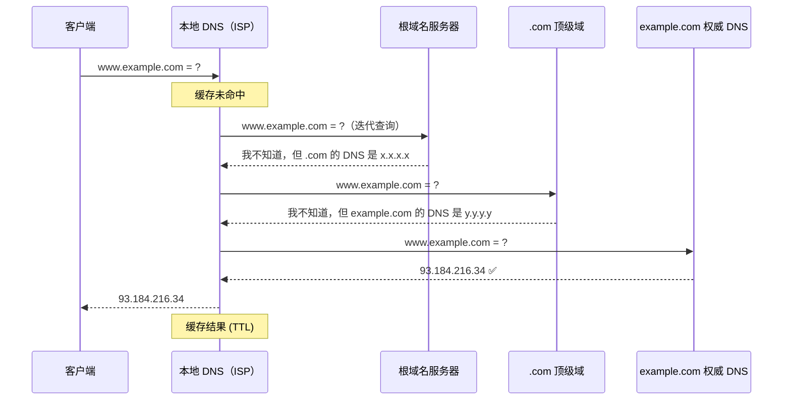
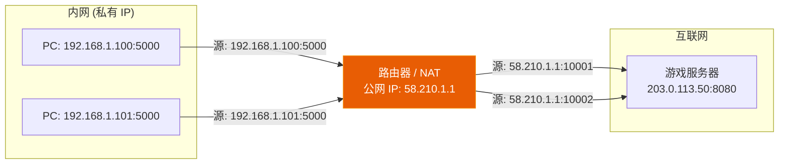

# 第六章 网络基础设施：DNS、NAT 与 CDN

> **一句话理解**：DNS 帮你找到服务器在哪，NAT 让你从私网走到公网，CDN 把内容搬到离你最近的地方——这三样东西支撑着整个互联网（和你的游戏）。

---

## 6.1 概念直觉 —— What & Why

```
你在游戏中点了"开始匹配"：

1. DNS：game.example.com → 203.0.113.50（找到游戏服务器 IP）
2. NAT：你的私网 IP 192.168.1.100 → 路由器公网 IP 58.x.x.x（出门）
3. CDN：更新包不从游戏服务器下载，而是从离你最近的 CDN 节点下载（快）
```

---

## 6.2 原理图解

### DNS 查询流程



### NAT 工作原理



```
NAT 转换表：
内网 IP:Port          →  公网 IP:Port
192.168.1.100:5000   →  58.210.1.1:10001
192.168.1.101:5000   →  58.210.1.1:10002

收到服务器回包时，根据目标端口(10001/10002)转发给对应内网设备。
```

---

## 6.3 深入剖析

### 6.3.1 DNS

#### DNS 缓存层级

```
浏览器缓存（几分钟）
  → OS 缓存（hosts 文件 / 系统 DNS 缓存）
    → 路由器缓存
      → ISP 的本地 DNS 服务器缓存
        → 递归/迭代查询

每级缓存有 TTL（Time To Live），过期才重新查询。
```

#### DNS 记录类型

| 类型 | 含义 | 示例 |
|------|------|------|
| **A** | 域名 → IPv4 地址 | `example.com → 93.184.216.34` |
| **AAAA** | 域名 → IPv6 地址 | `example.com → 2606:2800:...` |
| **CNAME** | 域名 → 域名（别名） | `www.example.com → example.com` |
| **MX** | 邮件服务器 | `example.com → mail.example.com` |
| **NS** | 权威 DNS 服务器 | `example.com → ns1.example.com` |
| **TXT** | 任意文本（验证等） | SPF, DKIM 邮件验证 |

#### DNS 用 TCP 还是 UDP？

```
通常用 UDP（端口 53）：
• DNS 请求/响应通常很小（< 512 字节）
• UDP 快，无需建连

使用 TCP 的场景：
• 响应超过 512 字节（Zone Transfer, DNSSEC）
• DNS over TCP, DNS over HTTPS (DoH), DNS over TLS (DoT)
```

---

### 6.3.2 NAT

#### NAT 四种类型

| 类型 | 描述 | 穿透难度 |
|------|------|---------|
| **Full Cone** | 内网 A:P → 公网 X:Q，任何外部主机都能通过 X:Q 联系 A | 最易 |
| **Restricted Cone** | 只有 A 主动联系过的 IP 才能通过 X:Q 回复 | 较易 |
| **Port Restricted** | 只有 A 主动联系过的 IP:Port 才能通过 X:Q 回复 | 较难 |
| **Symmetric** | 对不同目标使用不同的公网端口 | **最难** |

#### NAT 穿透技术

```
STUN (Session Traversal Utilities for NAT)：
• 客户端向 STUN 服务器发包
• STUN 服务器告诉客户端"你的公网 IP:Port 是什么"
• 两个客户端交换各自的公网 IP:Port → 直连（P2P）
• 仅适用于 Full Cone / Restricted Cone

TURN (Traversal Using Relays around NAT)：
• 当 STUN 失败时（Symmetric NAT），通过中继服务器转发
• 双方 → TURN 服务器 → 对方
• 一定能成功，但增加延迟和服务器成本

ICE (Interactive Connectivity Establishment)：
• 综合框架：先尝试直连 → 再 STUN → 最后 TURN
• WebRTC 使用 ICE
```

---

### 6.3.3 CDN

```
CDN 的工作流程：
1. 用户请求 cdn.game.com/hero_texture.png
2. DNS 把域名解析到最近的 CDN 边缘节点
3. 边缘节点有缓存 → 直接返回 ✅
4. 边缘节点没缓存 → 回源到原始服务器 → 缓存 → 返回
```

**CDN 在游戏中的应用**：

| 用途 | 说明 |
|------|------|
| **热更新包** | 全球玩家就近下载，节省带宽 |
| **静态资源** | 图片、音频、视频 |
| **安装包** | App Store 之外的分发渠道 |
| **直播/视频** | 游戏直播流分发 |

---

## 6.4 经典面试题

**Q：DNS 的解析过程？**
> 客户端先查本地缓存（浏览器→OS→路由器），未命中则向本地 DNS 服务器发起递归查询。本地 DNS 迭代查询：根域→顶级域→权威域，得到 IP 后缓存并返回给客户端。

**Q：DNS 用的是 TCP 还是 UDP？**
> 通常用 UDP（快、请求小）。响应超过 512 字节或 Zone Transfer 时用 TCP。现代还有 DNS over HTTPS (DoH) 和 DNS over TLS (DoT) 增强隐私。

**Q：什么是 NAT？NAT 有哪些类型？**
> NAT 把私网 IP 转换为公网 IP，解决 IPv4 地址不足。四种类型：Full Cone（任何人可回）、Restricted Cone（只有联系过的 IP 可回）、Port Restricted（IP+Port 匹配）、Symmetric（最严格，每个目标用不同端口）。

---

## 6.5 🎮 游戏实战场景

### 6.5.1 HTTPDNS —— 防 DNS 劫持

```cpp
// 普通 DNS 的问题：
// • ISP 可能劫持 DNS 结果（弹广告）
// • DNS 解析可能被污染（返回错误 IP）
// • 解析速度不稳定

// HTTPDNS 方案（腾讯云/阿里云都提供）：
// 不走系统 DNS，直接通过 HTTP 请求获取 IP
// GET https://httpdns.example.com/resolve?domain=game.example.com
// 响应: {"ip": "203.0.113.50", "ttl": 300}

std::string resolveByHttpDns(const std::string& domain) {
    // 直接 HTTP 请求 HTTPDNS 服务
    auto resp = httpGet("https://httpdns.service.com/resolve?domain=" + domain);
    auto json = parseJson(resp);
    return json["ip"].get<std::string>();
}

// 游戏启动时：
// 1. 先用 HTTPDNS 解析游戏服务器域名
// 2. 缓存结果
// 3. 连接时直接用 IP，跳过系统 DNS
```

### 6.5.2 NAT 穿透 —— P2P 联机

```cpp
// P2P 联机流程（如局域网对战、Steam P2P）
// 1. 玩家 A 和 B 都向 STUN 服务器发包
// 2. STUN 服务器返回各自的公网 IP:Port
// 3. A 和 B 通过信令服务器交换公网地址
// 4. A 向 B 的公网地址发包，B 向 A 的公网地址发包
// 5. NAT 打洞成功 → P2P 直连

// 如果失败（Symmetric NAT）→ fallback 到 TURN 中继

// 简化的 NAT 打洞流程
void natPunchThrough(const std::string& stun_server,
                     const std::string& peer_public_addr) {
    // 1. 获取自己的公网地址
    auto my_public = queryStun(stun_server);

    // 2. 通过信令服务器交换地址...

    // 3. 开始打洞：双方同时向对方发 UDP 包
    sockaddr_in peer = parseAddr(peer_public_addr);
    for (int i = 0; i < 10; ++i) {
        sendto(sock, "PUNCH", 5, 0, (sockaddr*)&peer, sizeof(peer));
        std::this_thread::sleep_for(std::chrono::milliseconds(100));
    }
    // 如果对方的 NAT 收到了我们的包 → 在 NAT 表中建立映射 → 后续可以通信
}
```

---

## 6.6 30 秒速答

**Q：DNS 解析过程？**
> 先查本地缓存（浏览器→OS→路由器→ISP），未命中则本地 DNS 迭代查询根域→顶级域→权威域，得到 IP 后逐级缓存。通常用 UDP 端口 53。

**Q：NAT 穿透是什么？**
> NAT 穿透让两个都在 NAT 后面的设备直接通信（P2P）。STUN 帮你发现公网地址，两端同时"打洞"建立连接。Symmetric NAT 打洞会失败，需要 TURN 中继。ICE 框架综合三种方式选最优。

---

> 📖 上一章：[第五章 Socket 编程与 IO 模型](../05_socket_and_io) —— select/poll/epoll、Reactor 模式与游戏服务器 IO 架构。

> 📖 下一章：[第七章 游戏网络同步专题](../07_game_networking) —— 帧同步 vs 状态同步、客户端预测、延迟补偿与反作弊。
