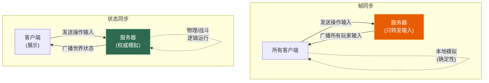
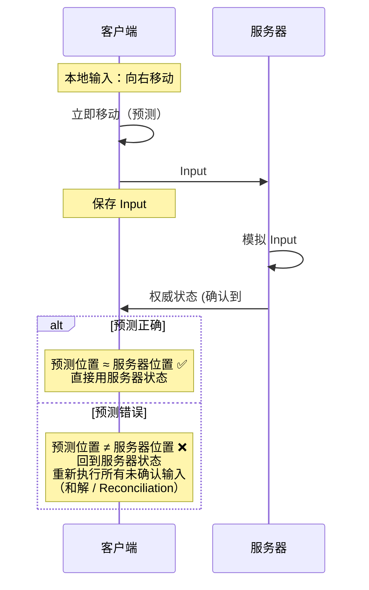

# 第七章 🎮 游戏网络同步专题

> **一句话理解**：网络游戏的核心挑战不是"如何传输数据"，而是"如何让所有玩家看到一致的世界"——所有同步方案都在 **一致性 vs 响应性** 之间做取舍。

---

## 7.1 概念直觉 —— What & Why

### 网络游戏的根本矛盾

```
物理限制：光速 → 北京到上海至少 10ms 延迟（单程），实际 RTT ≈ 30~50ms

玩家 A 在北京按下攻击 → 服务器在上海收到 → 处理 → 发给玩家 B
总延迟 ≈ RTT + 服务器处理 ≈ 50~100ms

在 60fps 游戏中，100ms = 6 帧的延迟
如果每次操作都等服务器响应 → 游戏完全无法玩

所以：延迟不可消除，只能隐藏。
```

### 同步方案的核心取舍


| | 一致性优先 | 响应性优先 |
|---|-----------|-----------|
| **典型方案** | 严格帧同步 | 强客户端预测 |
| **体验** | 可能卡顿等待 | 操作流畅但可能出现"回弹" |
| **适合** | MOBA、RTS | FPS、动作 |

---

## 7.2 原理图解

### 帧同步 vs 状态同步



### 客户端预测与和解



---

## 7.3 同步方案深入剖析

### 7.3.1 帧同步 (Lockstep)

**原理**：

```
核心思想：相同的初始状态 + 相同的输入序列 = 相同的结果
服务器不运行游戏逻辑，只负责收集和转发输入。

每一"逻辑帧"（通常 66ms = 15fps）：
1. 所有客户端发送本帧的操作输入给服务器
2. 服务器等待所有人的输入到齐
3. 服务器广播"第 N 帧所有玩家的输入"
4. 所有客户端执行相同的输入 → 得到相同的结果
```

**乐观帧同步**（现代改进）：

```
严格帧同步的问题：最慢的玩家拖慢所有人

乐观帧同步：
• 不等所有人的输入 → 超时就用预测输入（重复上一帧输入）
• 收到迟到的真实输入后 → 回滚到出错帧 → 追帧重新模拟
• 快的玩家正常体验，慢的玩家可能偶尔"回弹"
```

**确定性要求**：

```cpp
// 帧同步必须保证确定性！
// 问题 1：浮点数不确定
float a = 0.1f + 0.2f;  // 不同 CPU 可能有微小差异！
// 解决：用定点数
using Fixed = int32_t;  // 放大 1000 倍
Fixed pos_x = 1500;     // 表示 1.500

// 问题 2：随机数
// 解决：所有客户端用相同的随机种子
std::mt19937 rng(shared_seed);  // 相同种子 → 相同序列

// 问题 3：遍历顺序
// 解决：不用 unordered_map（迭代顺序不确定），用 map 或 vector
```

| 帧同步优点 | 帧同步缺点 |
|-----------|-----------|
| 带宽极低（只传输入） | 需要确定性模拟（浮点、随机数） |
| 完美支持回放（存输入即可） | 不支持中途加入 |
| 不需要服务器运行游戏逻辑 | 延迟 = 最慢玩家的延迟 |
| 作弊检测简单（对比结果） | 反外挂困难（逻辑在客户端） |
| **适合**：MOBA、RTS、格斗 | |

---

### 7.3.2 状态同步 (State Synchronization)

**原理**：

```
核心思想：服务器是唯一真相来源。
客户端只是"显示器"——展示服务器发来的世界状态。

每帧：
1. 客户端发送操作输入给服务器
2. 服务器运行全部游戏逻辑（物理、战斗、AI）
3. 服务器把世界状态广播给所有客户端
4. 客户端根据状态渲染画面
```

| 状态同步优点 | 状态同步缺点 |
|------------|------------|
| 不需要确定性（服务器算） | 带宽高（传世界状态） |
| 支持中途加入 | 服务器压力大 |
| 天然防作弊（服务器权威） | 纯服务器权威→操作延迟大 |
| 客户端实现简单 | 需要客户端预测来隐藏延迟 |
| **适合**：FPS、MMO | |

---

### 7.3.3 实际游戏的方案

| 游戏 | 同步方案 | 关键技术 |
|------|---------|---------|
| **王者荣耀** | 帧同步 | 乐观帧同步、追帧、定点数 |
| **英雄联盟** | 帧同步（改良） | 服务器验证、延迟补偿 |
| **CS2** | 状态同步 | 预测+回滚、延迟补偿、Tick Rate 64/128 |
| **Overwatch** | 状态同步 | 强预测+回滚、延迟补偿、ECS |
| **原神** | 状态同步 | 服务器权威、部分客户端预测 |
| **Minecraft** | 状态同步 | 简单预测、区块同步 |

---

## 7.4 延迟隐藏技术

### 7.4.1 客户端预测 (Client-side Prediction)

```cpp
// 核心思想：不等服务器，客户端先按输入移动
class PredictionSystem {
    struct InputRecord {
        uint32_t seq;        // 输入序号
        Input input;         // 玩家输入
        Vec3 predicted_pos;  // 预测后的位置
    };

    std::deque<InputRecord> _pending_inputs;
    Vec3 _position;

public:
    void onLocalInput(const Input& input) {
        // 1. 立即应用输入（预测）
        _position = applyInput(_position, input);

        // 2. 发送给服务器
        uint32_t seq = sendToServer(input);

        // 3. 保存到待确认队列
        _pending_inputs.push_back({seq, input, _position});
    }

    void onServerState(uint32_t ack_seq, Vec3 server_pos) {
        // 4. 移除已确认的输入
        while (!_pending_inputs.empty() &&
               _pending_inputs.front().seq <= ack_seq) {
            _pending_inputs.pop_front();
        }

        // 5. 和解 (Reconciliation)
        _position = server_pos;
        for (auto& record : _pending_inputs) {
            _position = applyInput(_position, record.input);
            record.predicted_pos = _position;
        }
    }
};
```

### 7.4.2 延迟补偿 (Lag Compensation)

```
问题：FPS 游戏中，玩家 A 射击时看到的敌人位置是 100ms 前的。
如果用服务器当前时刻的位置判断命中→ 即使瞄准了也打不中。

延迟补偿：
1. 服务器保存过去若干帧的世界状态快照
2. 玩家 A 射击时告诉服务器"我在 T 时刻射击"
3. 服务器回退到 T 时刻的世界状态
4. 在回退后的状态中判断射线是否命中
5. 用当前状态执行命中结果

→ 射击者的体验："指哪打哪"
→ 被击者的体验："我已经躲到掩体后面了怎么还被打死？"
→ 这就是 "Peeker's Advantage"（先看到的人有优势）
```

```cpp
// 简化的延迟补偿
class LagCompensation {
    struct Snapshot {
        uint32_t tick;
        std::vector<PlayerState> players;
    };

    std::deque<Snapshot> _history;  // 保存过去 1 秒的快照

public:
    void saveSnapshot(uint32_t tick, const std::vector<PlayerState>& states) {
        _history.push_back({tick, states});
        // 只保留 1 秒内的快照
        while (_history.size() > 128) _history.pop_front();
    }

    bool checkHit(uint32_t shooter_tick, const Ray& shot) {
        // 找到射击时刻的快照
        auto it = std::find_if(_history.begin(), _history.end(),
            [shooter_tick](const Snapshot& s) { return s.tick >= shooter_tick; });

        if (it == _history.end()) return false;

        // 在那个时刻的状态中做射线检测
        for (auto& player : it->players) {
            if (rayIntersectsBox(shot, player.hitbox)) {
                return true;  // 命中！
            }
        }
        return false;
    }
};
```

### 7.4.3 插值与外推

```
插值 (Interpolation)：
  在两个已知状态之间平滑过渡
  客户端总是渲染"过去一小段时间"的画面
  没有预测错误，但增加了少量延迟

  时间线：
  收到服务器状态 S1 (T=100ms) 和 S2 (T=200ms)
  客户端在 T=150ms 时渲染 S1 和 S2 的中间状态
  → 即使 S3 延迟了，也有 1~2 帧的缓冲

外推 (Extrapolation)：
  基于当前速度预测未来位置
  预测可能出错 → 需要修正（"回弹"）
  适合延迟大的场景
```

```cpp
// 实体插值系统
struct InterpolationBuffer {
    struct State {
        float time;
        Vec3 position;
        Quat rotation;
    };

    std::deque<State> _buffer;
    float _interp_delay = 0.1f;  // 100ms 的插值延迟

    void addState(float time, Vec3 pos, Quat rot) {
        _buffer.push_back({time, pos, rot});
        while (_buffer.size() > 20) _buffer.pop_front();
    }

    std::pair<Vec3, Quat> getInterpolated(float current_time) {
        float render_time = current_time - _interp_delay;

        // 找到 render_time 前后的两个状态
        for (size_t i = 0; i + 1 < _buffer.size(); ++i) {
            if (_buffer[i].time <= render_time &&
                _buffer[i + 1].time >= render_time) {
                float t = (render_time - _buffer[i].time) /
                          (_buffer[i + 1].time - _buffer[i].time);
                return {
                    lerp(_buffer[i].position, _buffer[i + 1].position, t),
                    slerp(_buffer[i].rotation, _buffer[i + 1].rotation, t)
                };
            }
        }
        // 没有足够数据 → 外推
        auto& last = _buffer.back();
        return {last.position, last.rotation};
    }
};
```

---

## 7.5 快照与带宽优化

### Delta 压缩

```
完整快照 = 所有实体的完整状态 = 可能几 KB
每帧发完整快照 → 30fps × 5KB = 150KB/s × 100 个玩家 = 15MB/s

Delta 快照 = 只发与上一帧不同的部分
• 没有移动的实体 → 不发
• 移动了的实体 → 只发变化的字段

优化后：30fps × 200B = 6KB/s × 100 = 600KB/s（节省 96%！）
```

### 其他带宽优化

```
1. 量化 (Quantization)
   float 位置 (32bit) → 16bit 定点数
   浮点角度 (32bit) → 8bit (256 个方向足够了)

2. 位打包 (Bit Packing)
   bool 用 1 bit 而不是 1 byte
   HP/MP 用 10 bit（0~1023）而不是 32 bit

3. 兴趣管理 (Area of Interest)
   只同步玩家视野范围内的实体
   MMO 中离你 100 米外的人 → 不同步
   通过九宫格/AOI 算法实现

4. 降频策略
   近处实体：30fps 同步
   远处实体：10fps 同步
   极远实体：不同步
```

---

## 7.6 反作弊基础

| 策略 | 描述 | 防范 |
|------|------|------|
| **服务器权威** | 所有计算在服务器，客户端只是显示 | 速度 hack、穿墙 |
| **输入验证** | 验证移动速度、攻击频率 | 加速器、连点器 |
| **状态校验** | 服务器定期校验客户端状态 | 修改本地数据 |
| **加密** | 协议加密、数据签名 | 抓包修改 |
| **行为检测** | 统计异常行为模式 | 自瞄、透视（间接） |

```
帧同步的反作弊困境：
  游戏逻辑在客户端 → 客户端可以看到全部信息（全图挂）
  对策：关键信息服务器控制（战争迷雾由服务器判定）

状态同步的天然优势：
  逻辑在服务器 → 客户端无法修改游戏状态
  但客户端仍可获得当前可见信息 → 透视挂仍有可能
```

---

## 7.7 Tick Rate 与网络抖动

### Tick Rate（服务器帧率）

```
Tick Rate = 服务器每秒运行物理/逻辑模拟的次数

| 游戏 | Tick Rate | 含义 |
|------|-----------|------|
| CS2 竞技模式 | 128 Hz | 每 7.8ms 模拟一次，极高精度 |
| CS2 普通模式 | 64 Hz | 每 15.6ms 模拟一次 |
| Overwatch | 63 Hz | |
| Fortnite | 30 Hz | 大逃杀人多，服务器压力大 |
| 王者荣耀 | 15 Hz | 帧同步，逻辑帧率低但足够 |

Tick Rate 越高 -> 命中判定越精确 -> 服务器压力越大
客户端帧率（如 60fps/144fps）和 Tick Rate 是独立的——
客户端用插值在两个 Tick 之间平滑渲染。
```

### 网络抖动 (Jitter)

```
延迟波动：RTT 不是固定的
  第 1 帧 RTT = 40ms
  第 2 帧 RTT = 35ms
  第 3 帧 RTT = 120ms  <- 抖动！
  第 4 帧 RTT = 38ms

抖动的影响：
  即使平均延迟低，抖动高 -> 体验差（忽快忽慢）
  插值缓冲区可能被耗尽 -> 外推 -> 画面跳变
```

```cpp
// 抖动缓冲区 (Jitter Buffer)
// 原理：增加固定延迟来吸收网络波动
class JitterBuffer {
    struct TimedPacket {
        float recv_time;
        float server_time;
        std::vector<uint8_t> data;
    };

    std::deque<TimedPacket> _buffer;
    float _buffer_delay;  // 缓冲延迟（通常 = 平均抖动的 2~3 倍）

public:
    JitterBuffer(float delay = 0.05f) : _buffer_delay(delay) {}

    void push(float recv_time, float server_time,
              std::vector<uint8_t> data) {
        _buffer.push_back({recv_time, server_time, std::move(data)});
    }

    // 取出"够老"的数据包
    bool pop(float current_time, std::vector<uint8_t>& out) {
        if (_buffer.empty()) return false;
        if (current_time - _buffer.front().recv_time >= _buffer_delay) {
            out = std::move(_buffer.front().data);
            _buffer.pop_front();
            return true;
        }
        return false;
    }

    // 动态调整缓冲延迟（根据实际抖动）
    void adaptDelay(float measured_jitter) {
        _buffer_delay = measured_jitter * 2.5f;
        _buffer_delay = std::clamp(_buffer_delay, 0.02f, 0.2f);
    }
};
```

### 时间同步

```
问题：客户端和服务器的时钟不一样！
  客户端时间 12:00:00.000
  服务器时间 12:00:00.150  -> 差 150ms

解决方案：类似 NTP 的时钟同步
  1. 客户端发 Ping（带本地时间戳 T1）
  2. 服务器收到，记录到达时间 T2，处理后返回 Pong（T2, T3=发送时间）
  3. 客户端收到 Pong，记录时间 T4

  RTT = (T4 - T1) - (T3 - T2)       // 去除服务器处理时间
  单程延迟 = RTT / 2
  时差 = T2 - T1 - 单程延迟

  多次采样取中位数 -> 得到稳定的时间偏移
  客户端的服务器时间 = 本地时间 + 时差
```

---

## 7.8 乐观帧同步追帧实现

```cpp
// 乐观帧同步的核心：当收到迟到的"真实输入"时，
// 回滚到出错帧，然后快速重新模拟到当前帧（追帧）

class OptimisticLockstep {
    struct FrameInput {
        uint32_t frame;
        std::vector<PlayerInput> inputs;
        bool confirmed = false;  // 是否收到服务器确认
    };

    GameState _current_state;
    std::vector<GameState> _state_history;   // 历史快照
    std::vector<FrameInput> _input_history;  // 历史输入
    uint32_t _current_frame = 0;
    uint32_t _last_confirmed_frame = 0;

public:
    void tick() {
        // 正常推进一帧
        auto& input = getOrPredictInput(_current_frame);
        _state_history.push_back(_current_state);
        _current_state = simulate(_current_state, input);
        _current_frame++;
    }

    void onServerConfirm(uint32_t frame,
                         const std::vector<PlayerInput>& real_inputs) {
        auto& record = _input_history[frame];

        if (record.inputs != real_inputs) {
            // 预测错误！需要回滚 + 追帧
            rollbackAndResimulate(frame, real_inputs);
        }

        record.confirmed = true;
        record.inputs = real_inputs;
        _last_confirmed_frame = frame;
    }

private:
    void rollbackAndResimulate(uint32_t from_frame,
                               const std::vector<PlayerInput>& correct_input) {
        // 1. 回滚到出错帧的状态
        _current_state = _state_history[from_frame];

        // 2. 用正确输入模拟出错帧
        _input_history[from_frame].inputs = correct_input;

        // 3. 快速追帧：从 from_frame 到 current_frame
        for (uint32_t f = from_frame; f < _current_frame; ++f) {
            auto& input = _input_history[f];
            _state_history[f] = _current_state;
            _current_state = simulate(_current_state, input);
        }
        // 追帧完成，画面纠正
    }

    FrameInput& getOrPredictInput(uint32_t frame) {
        if (frame >= _input_history.size()) {
            _input_history.resize(frame + 1);
        }
        if (!_input_history[frame].confirmed) {
            // 预测：重复上一帧的输入
            if (frame > 0) {
                _input_history[frame].inputs =
                    _input_history[frame - 1].inputs;
            }
        }
        return _input_history[frame];
    }
};
```

```
追帧的性能注意：
  如果落后太多帧（比如 10 帧），一帧内要模拟 10 次
  -> CPU 开销大 -> 可能导致掉帧

  优化：
  1. 限制最大追帧数（超过就直接跳到最新状态）
  2. 追帧时关闭渲染和音效（只跑逻辑）
  3. 用更粗的物理步长追帧
```

---

## 7.9 断线重连

```
帧同步的重连：
  问题：帧同步没有"当前状态快照"，只有输入历史
  重连方案：
  1. 服务器保存从第 0 帧开始的所有输入
  2. 重连时发送全部输入历史 -> 客户端从头追帧
  3. 优化：定期保存状态快照（关键帧），
     重连时只需从最近的快照开始追帧

状态同步的重连：
  问题简单得多——
  1. 客户端重新建立连接
  2. 服务器发送当前完整的世界状态快照
  3. 客户端加载快照 -> 继续游戏
```

## 7.10 经典面试题

**Q：帧同步和状态同步的区别？**
> 帧同步：服务器只转发输入，客户端本地模拟，需要确定性。带宽低、支持回放，但延迟 = 最慢玩家。状态同步：服务器运行逻辑，广播世界状态。天然防作弊、支持中途加入，但带宽高、服务器压力大。

**Q：什么是客户端预测？**
> 客户端不等服务器响应，按本地输入先行移动。收到服务器权威状态后对比：一致则继续，不一致则回到服务器状态并重新执行未确认的输入（和解/Reconciliation）。

**Q：如何处理网络延迟对游戏的影响？**
> 四种技术：① 客户端预测（操作即时反馈）② 延迟补偿（服务器倒回时间验证命中）③ 插值（在已知状态间平滑过渡）④ 外推（预测未来位置）。

**Q：MOBA 用帧同步还是状态同步？FPS 呢？**
> MOBA/RTS 通常用帧同步（王者荣耀、星际争霸）——只传输入，带宽极低。FPS 通常用状态同步（CS2、Overwatch）——需要服务器权威防作弊，配合强预测和延迟补偿。

**Q：如何防止网络游戏作弊？**
> 核心是服务器权威——所有关键逻辑在服务器运行，客户端只负责显示和发送输入。配合输入合法性验证、状态校验、协议加密和行为检测。

---

## 7.11 30 秒速答

**Q：帧同步和状态同步的区别？**
> 帧同步只同步输入，客户端本地模拟，需要确定性，带宽低但延迟等最慢。状态同步由服务器运行逻辑广播状态，天然防作弊但带宽高。MOBA 用帧同步，FPS 用状态同步。

**Q：什么是客户端预测？**
> 操作立即本地执行不等服务器，收到服务器状态后和解——回到服务器状态重新执行未确认输入。让玩家操作无延迟感。

**Q：如何隐藏网络延迟？**
> 客户端预测让操作即时，延迟补偿让射击准确，插值让其他玩家移动流畅，外推在数据迟到时预测位置。四者结合实现"看不出有网络延迟"的体验。

---

> 📖 上一章：[第六章 网络基础设施：DNS、NAT 与 CDN](../06_infrastructure) —— DNS 解析、NAT 穿透、CDN 分发。

> 📖 系列导航：[计算机网络面试突击 · 全部章节](../network/) —— 7 章内容一览，推荐阅读路线。
