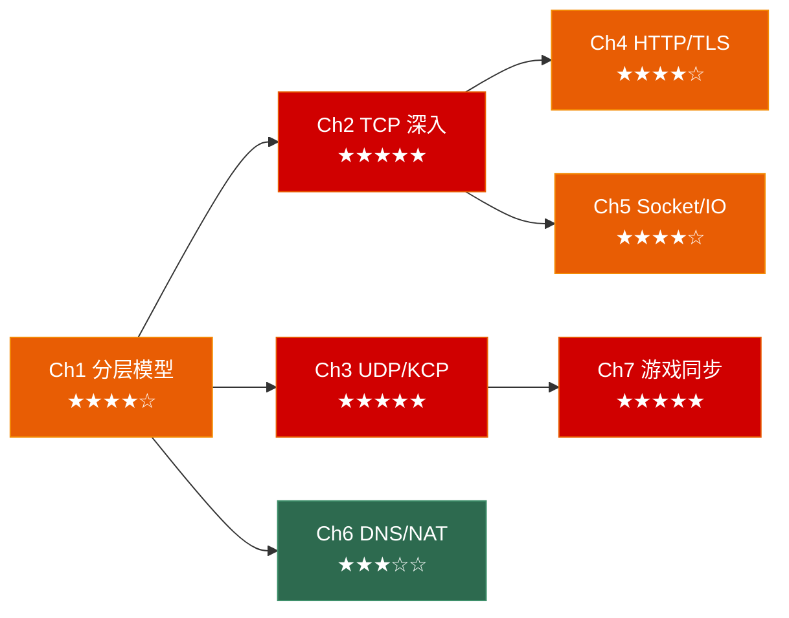

# 计算机网络面试突击：从协议到实战

> 面向**游戏客户端开发岗**面试 & 计网课程考试的网络笔记系列。每章覆盖：原理图解 → 协议剖析 → 经典面试题 → 🎮 游戏实战 → 30 秒速答。

---

## 系列全景



---

## 各章速览

| 章节 | 主题 | 面试权重 | 核心考点 |
|------|------|---------|---------|
| [**第一章**](./01_network_model/) | 网络分层模型 | ★★★★☆ | TCP/IP vs OSI、数据封装、IP 报头、"输入 URL 后发生什么" |
| [**第二章**](./02_tcp/) | TCP 深入 | ★★★★★ | 三次握手/四次挥手、滑动窗口、拥塞控制、粘包、Nagle |
| [**第三章**](./03_udp/) | UDP 与可靠 UDP | ★★★★★ | TCP vs UDP、ARQ、KCP 原理、QUIC、游戏网络架构 |
| [**第四章**](./04_http/) | HTTP/HTTPS 与应用层 | ★★★★☆ | HTTP 版本演进、TLS 握手、WebSocket、Protobuf |
| [**第五章**](./05_socket_and_io/) | Socket 编程与 IO 模型 | ★★★★☆ | select/poll/epoll、ET vs LT、Reactor 模式、C10K |
| [**第六章**](./06_infrastructure/) | DNS、NAT 与 CDN | ★★★☆☆ | DNS 查询流程、NAT 穿透 (STUN/TURN/)、CDN 原理 |
| [**第七章**](./07_game_networking/) | 游戏网络同步 | ★★★★★ | 帧同步 vs 状态同步、客户端预测、延迟补偿、反作弊 |

---

## 推荐阅读路线

### 🚀 面试急救（2 天）

```
Day 1: Ch1 分层模型 → Ch2 TCP（三次握手必考） → Ch3 UDP + KCP
Day 2: Ch7 游戏同步（帧同步 vs 状态同步必考） → Ch4 HTTP/HTTPS
```

### 📚 考试复习（3 天）

```
Day 1: Ch1 分层模型 + IP 协议 → Ch2 TCP 全部
Day 2: Ch3 UDP → Ch4 HTTP/HTTPS → Ch6 DNS
Day 3: Ch5 Socket/IO 模型 → 整体复习速答
```

### 🎮 游戏面试加分

> 看完 Ch2+Ch3 后直接看 Ch7：

- **帧同步 vs 状态同步** → 必考，能讲清楚直接加分
- **客户端预测 + 延迟补偿** → 展示你理解"为什么射击会回弹"
- **KCP 原理** → 展示你知道游戏实际用什么协议
- **NAT 穿透** → 展示你理解 P2P 联机的底层