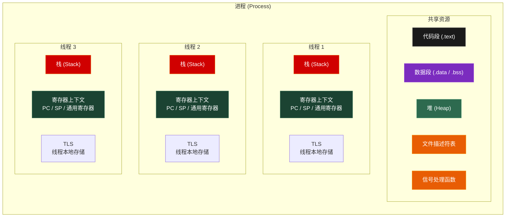
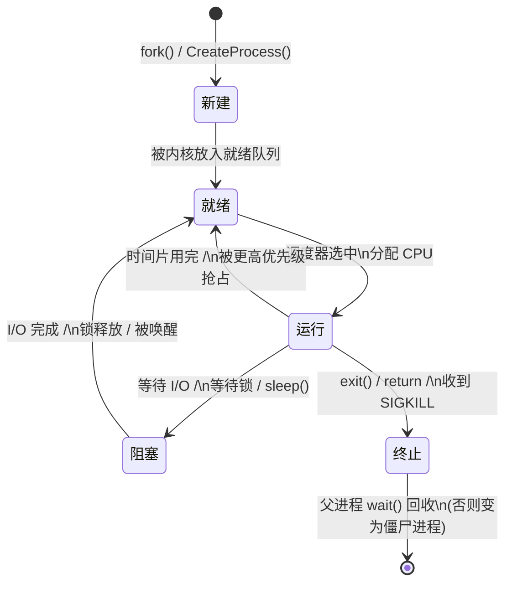
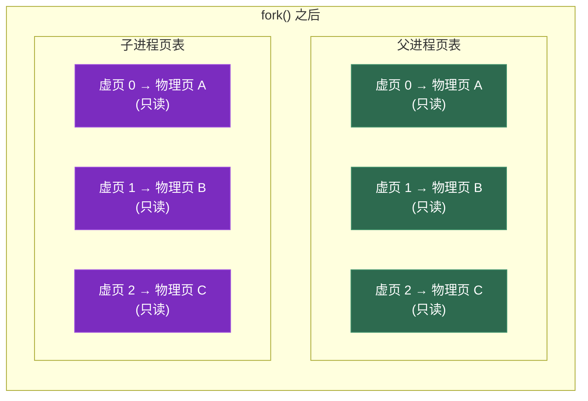
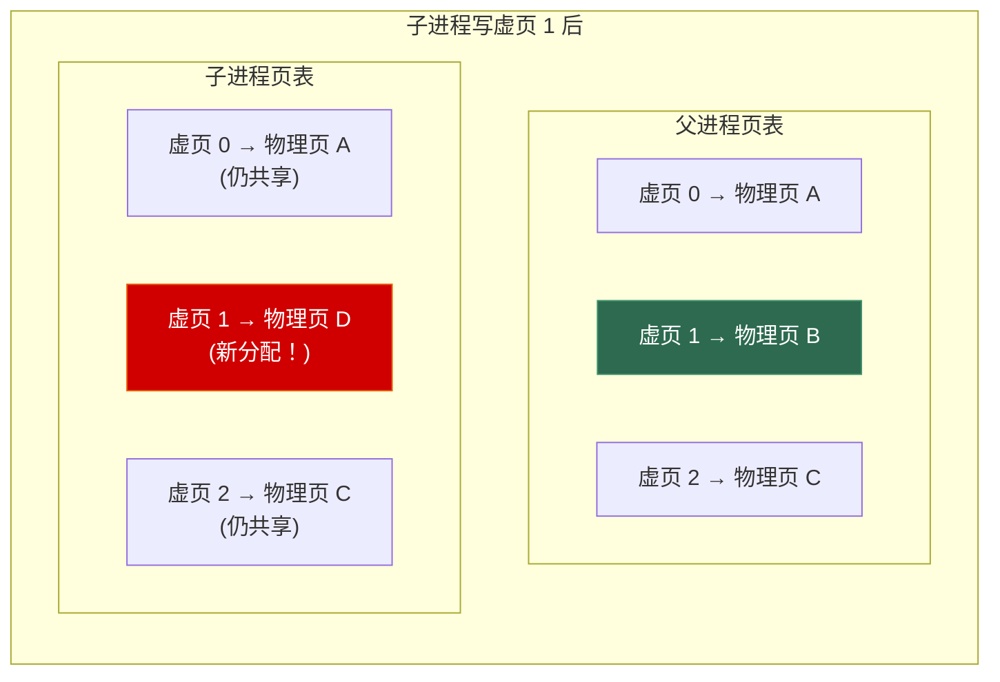
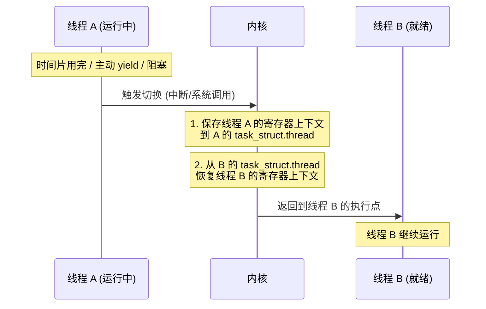
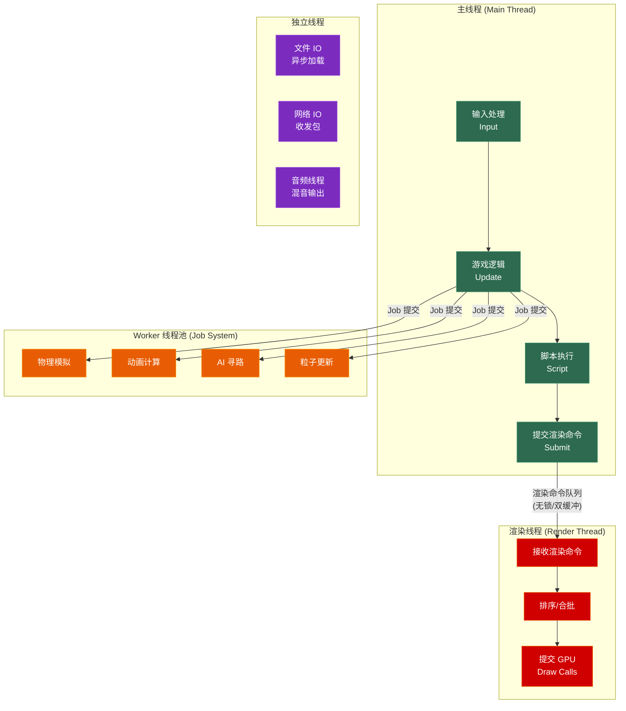

# 第一章 进程与线程

> **一句话理解**：进程是资源分配的最小单位，线程是 CPU 调度的最小单位。理解它们的区别和联系，是理解操作系统和并发编程的起点。

---

## 1.1 概念直觉 —— What & Why

### 程序 vs 进程

- **程序 (Program)**：躺在磁盘上的可执行文件（`.exe`/`ELF`），是静态的指令集合
- **进程 (Process)**：程序的一次「运行实例」，是动态的执行实体

```
程序是食谱，进程是正在做菜的过程。
同一个食谱可以同时做两份——两个进程，各有各的锅碗瓢盆（资源隔离）。
```

### 进程 vs 线程

| 维度 | 进程 (Process) | 线程 (Thread) |
|------|---------------|--------------|
| **定义** | 资源分配的最小单位 | CPU 调度的最小单位 |
| **地址空间** | 独立——每个进程有自己的虚拟地址空间 | 共享——同一进程的线程共享地址空间 |
| **创建开销** | 重（需要复制页表、分配资源） | 轻（只需分配栈和寄存器上下文） |
| **切换开销** | 大（切换页表 + TLB flush + 缓存污染） | 小（不切换页表，共享地址空间） |
| **通信** | 需要 IPC（管道、共享内存、Socket） | 直接读写共享变量（但需同步） |
| **安全性** | 高——一个进程崩了不影响其他进程 | 低——一个线程崩了整个进程都挂 |
| **典型使用** | 浏览器的多标签页、微服务 | 游戏引擎的渲染/逻辑/IO 分离 |

> 💡 **面试中的表述**：「进程拥有独立的地址空间和资源，线程共享进程的地址空间。线程切换只需保存/恢复寄存器上下文，进程切换还需要切换页表和刷新 TLB，所以进程切换比线程切换更昂贵。」

### 进程 vs 线程 vs 协程

| 维度 | 进程 | 线程 | 协程 |
|------|------|------|------|
| 调度者 | 操作系统内核 | 操作系统内核 | **用户程序自身** |
| 切换方式 | 内核态切换 | 内核态切换 | **用户态切换**（无系统调用） |
| 切换开销 | ~10μs | ~1-10μs | **~0.01-0.1μs** |
| 栈大小 | 独立地址空间 | 默认 1-8MB | **几 KB~几十 KB** |
| 并行性 | ✅ 真并行 | ✅ 真并行 | ❌ 默认不并行（单线程调度）|
| 适用场景 | 进程隔离 | 计算密集型并行 | **IO 密集型并发** |

> 💡 协程的详细原理将在 [第八章 协程](../08_coroutine) 中深入剖析。本章只介绍其与进程/线程的定位区别。

---

## 1.2 原理图解

### 进程的虚拟地址空间

每个进程都有自己独立的虚拟地址空间。操作系统通过页表将虚拟地址映射到物理内存。


> 这个图和 [C++ Ch1 内存模型](../cpp_deep_dive/01_memory_model) 中的地址空间图是同一个东西。C++ 章侧重「变量存在哪」，OS 章侧重「操作系统如何管理这个空间」。

### 多线程共享模型



```
线程之间 共享 什么？
✅ 代码段、数据段、堆、文件描述符、信号处理函数、进程 PID

线程之间 独立 什么？
🔒 栈、寄存器上下文（PC/SP/通用寄存器/FPU 状态）、线程 ID (TID)、TLS（线程本地存储）、信号掩码
```

> 💡 **面试中的表述**：「线程共享进程的代码段、数据段、堆和文件描述符，但每个线程有独立的栈和寄存器上下文。这就是为什么线程之间通信很方便（直接读写共享内存），但也容易出现数据竞争。」

### 进程状态机



```
面试常问：进程有几种状态？
答：五种。新建(New)、就绪(Ready)、运行(Running)、阻塞/等待(Blocked/Waiting)、终止(Terminated)。
Linux 实际还有一个"僵尸(Zombie)"状态——进程已终止但父进程尚未 wait() 回收其 PCB。
```

---

## 1.3 底层机制剖析

### 1.3.1 PCB —— 进程控制块

操作系统用 **PCB (Process Control Block)** 来描述和管理一个进程。PCB 是内核为每个进程维护的数据结构。

在 Linux 中，PCB 就是 `struct task_struct`（定义在 `include/linux/sched.h`），大约 600+ 个字段。简化后的核心字段：

```cpp
// Linux task_struct 简化模型
struct task_struct {
    // ========== 标识信息 ==========
    pid_t pid;                      // 进程 ID
    pid_t tgid;                     // 线程组 ID（= 主线程的 pid）
    
    // ========== 状态信息 ==========
    volatile long state;            // TASK_RUNNING / TASK_INTERRUPTIBLE / ...
    int exit_state;                 // EXIT_ZOMBIE / EXIT_DEAD
    unsigned int flags;             // PF_EXITING / PF_KTHREAD / ...
    
    // ========== 调度信息 ==========
    int prio;                       // 动态优先级
    int static_prio;                // 静态优先级（nice 值映射）
    int normal_prio;                // 归一化优先级
    struct sched_entity se;         // CFS 调度实体（含 vruntime）
    
    // ========== CPU 上下文 ==========
    struct thread_struct thread;    // 寄存器上下文（SP、IP、通用寄存器...）
    
    // ========== 内存管理 ==========
    struct mm_struct *mm;           // 内存描述符（页表、VMA 链表...）
                                    // 线程间共享同一个 mm_struct！
    
    // ========== 文件系统 ==========
    struct files_struct *files;     // 打开的文件描述符表
    struct fs_struct *fs;           // 文件系统信息（pwd、根目录）
    
    // ========== 信号 ==========
    struct signal_struct *signal;   // 信号处理相关
    sigset_t blocked;               // 被阻塞的信号集
    
    // ========== 家族关系 ==========
    struct task_struct *parent;     // 父进程
    struct list_head children;      // 子进程链表
    struct list_head sibling;       // 兄弟进程链表
};
```

> 💡 **面试核心点**：Linux 中线程和进程使用**同一个**数据结构 `task_struct`。线程 = 共享 `mm_struct`（内存空间）和 `files_struct`（文件描述符表）的 `task_struct`。

**Windows 对应概念**：Windows 用 `EPROCESS` 描述进程，`ETHREAD` 描述线程，功能类似但结构分离。

### 1.3.2 进程创建

#### Linux: fork() + exec()

Unix/Linux 的进程创建分两步：

```c
pid_t pid = fork();  // 1. 复制当前进程

if (pid == 0) {
    // 子进程
    exec("/bin/ls", args);  // 2. 替换为新程序的代码和数据
} else if (pid > 0) {
    // 父进程
    wait(NULL);  // 等待子进程结束
} else {
    // fork 失败
    perror("fork");
}
```

**为什么 Unix 要分两步？**

```
fork + exec 的哲学：
- fork 只复制进程，exec 只替换程序
- 两步之间，子进程可以修改自己的环境（重定向 fd、修改环境变量等）
- 这种分离提供了极大的灵活性

例：shell 实现管道 `ls | grep .cpp`
1. fork() 子进程 A
2. 子进程 A: 重定向 stdout 到管道写端 → exec("ls")
3. fork() 子进程 B
4. 子进程 B: 重定向 stdin 到管道读端 → exec("grep", ".cpp")
```

#### Copy-On-Write (COW) —— fork 为什么快

面试中 `fork()` 最常问的就是 COW：



```
fork() 的 COW 流程：
1. fork() 时：不复制物理页！只复制页表，父子共享同一组物理页
2. 把所有共享页标记为 "只读"
3. 父或子第一次写某页时 → 触发 Page Fault（缺页中断）
4. 内核拦截：分配新的物理页，复制数据，更新页表 → 写入方得到独立副本
5. 结果：只有被修改的页才会真正复制（按需复制）
```



> 💡 **面试中的表述**：「`fork()` 并不会立即复制父进程的所有内存，而是采用 Copy-On-Write——父子进程共享物理页并标记为只读，只在某一方写入时才触发缺页中断，按需复制被修改的页。所以 `fork()` 本身非常快，开销主要在复制页表。如果紧接着 `exec()`，大部分页根本不会被复制，效率很高。」

#### exec() 系列

`exec()` 用新程序的代码和数据**替换**当前进程的地址空间：

```c
// exec 家族（名字规律：l=列表参数 v=向量参数 p=搜索PATH e=自定义环境变量）
execl("/bin/ls", "ls", "-la", NULL);            // 路径 + 参数列表
execlp("ls", "ls", "-la", NULL);                // 搜索 PATH
execle("/bin/ls", "ls", NULL, envp);            // 自定义环境变量
execv("/bin/ls", argv);                         // 路径 + 参数数组
execvp("ls", argv);                             // 搜索 PATH + 参数数组
execvpe("ls", argv, envp);                      // 全部自定义
```

```
exec() 做了什么：
1. 释放旧的代码段、数据段、堆、栈
2. 加载新程序的 ELF 文件（映射代码段、数据段）
3. 初始化新的栈（放入 argc, argv, envp）
4. 设置 PC 指向新程序的 _start (→ __libc_start_main → main)
5. PID 不变！文件描述符不变（除非设了 CLOEXEC）
```

#### Windows: CreateProcess()

```cpp
// Windows 不分 fork/exec，CreateProcess 一步到位
STARTUPINFO si = { sizeof(si) };
PROCESS_INFORMATION pi;

CreateProcess(
    L"C:\\game\\game.exe",  // 可执行文件路径
    NULL,                    // 命令行参数
    NULL, NULL,              // 安全属性
    FALSE,                   // 不继承句柄
    0,                       // 创建标志
    NULL,                    // 环境变量（继承父进程的）
    NULL,                    // 工作目录
    &si, &pi                 // 输出：启动信息和进程信息
);

// pi.hProcess = 进程句柄
// pi.hThread  = 主线程句柄
// pi.dwProcessId = PID
```

> Windows 的哲学：进程创建和程序加载是原子的一步操作，没有 fork 的概念。

### 1.3.3 线程创建

#### Linux: clone() —— 线程的真相

Linux 内核不区分进程和线程。`pthread_create()` 底层调用 `clone()` 系统调用：

```c
// clone() 的核心在于 flags 参数——控制父子共享什么
// 创建线程：共享一切（地址空间、文件描述符、信号...）
clone(thread_func, child_stack,
      CLONE_VM |           // 共享地址空间（内存）
      CLONE_FS |           // 共享文件系统信息
      CLONE_FILES |        // 共享文件描述符表
      CLONE_SIGHAND |      // 共享信号处理函数
      CLONE_THREAD |       // 放入同一线程组
      CLONE_PARENT_SETTID, // 设置父线程的 TID
      arg);

// 创建进程：什么都不共享（= fork）
clone(child_func, child_stack, SIGCHLD, arg);
// 不传任何 CLONE_* 标志 → 全部独立 → 等价于 fork()
```

```
Linux 的统一模型：
- 进程 = clone() 不带 CLONE_VM 标志 → 独立地址空间
- 线程 = clone() 带 CLONE_VM 标志  → 共享地址空间
- 本质上都是 task_struct，只是共享的资源不同
```

> 💡 **面试中的表述**：「在 Linux 中，线程和进程在内核层面使用相同的数据结构 `task_struct`，通过 `clone()` 系统调用创建，区别只在于 flags 控制了哪些资源被共享。`CLONE_VM` 标志决定是否共享地址空间——共享就是线程，不共享就是进程。」

#### C++ 线程创建

```cpp
#include <thread>

// C++ std::thread 底层调用：
// Linux:   pthread_create() → clone(CLONE_VM | ...)
// Windows: CreateThread() / _beginthreadex()

std::thread t([]() {
    // 线程函数
});
t.join();
```

（详细的 C++ 线程 API 参见 [C++ Ch7 并发与多线程](../cpp_deep_dive/07_concurrency)）

### 1.3.4 线程模型

#### 用户态线程 vs 内核态线程

```mermaid
graph TB
    subgraph "1:1 模型 (Linux/Windows)"
        direction TB
        ut1a["用户线程 1"] --> kt1a["内核线程 1"]
        ut2a["用户线程 2"] --> kt2a["内核线程 2"]
        ut3a["用户线程 3"] --> kt3a["内核线程 3"]
    end

    subgraph "M:N 模型 (Go)"
        direction TB
        ut1b["goroutine 1"] --> kt1b["内核线程 1"]
        ut2b["goroutine 2"] --> kt1b
        ut3b["goroutine 3"] --> kt2b["内核线程 2"]
        ut4b["goroutine 4"] --> kt2b
    end

    subgraph "1:N 模型 (早期 Java)"
        direction TB
        ut1c["用户线程 1"] --> kt1c["内核线程 1"]
        ut2c["用户线程 2"] --> kt1c
        ut3c["用户线程 3"] --> kt1c
    end

    style ut1a fill:#2d6a4f,stroke:#40916c,color:white
    style ut2a fill:#2d6a4f,stroke:#40916c,color:white
    style ut3a fill:#2d6a4f,stroke:#40916c,color:white
    style kt1a fill:#d00000,stroke:#e85d04,color:white
    style kt2a fill:#d00000,stroke:#e85d04,color:white
    style kt3a fill:#d00000,stroke:#e85d04,color:white
    
    style ut1b fill:#2d6a4f,stroke:#40916c,color:white
    style ut2b fill:#2d6a4f,stroke:#40916c,color:white
    style ut3b fill:#2d6a4f,stroke:#40916c,color:white
    style ut4b fill:#2d6a4f,stroke:#40916c,color:white
    style kt1b fill:#d00000,stroke:#e85d04,color:white
    style kt2b fill:#d00000,stroke:#e85d04,color:white

    style ut1c fill:#2d6a4f,stroke:#40916c,color:white
    style ut2c fill:#2d6a4f,stroke:#40916c,color:white
    style ut3c fill:#2d6a4f,stroke:#40916c,color:white
    style kt1c fill:#d00000,stroke:#e85d04,color:white
```



| 模型 | 描述 | 优点 | 缺点 | 代表 |
|------|------|------|------|------|
| **1:1** | 一个用户线程对应一个内核线程 | 真并行、阻塞不影响其他线程 | 创建/切换开销大 | Linux (NPTL)、Windows |
| **M:N** | M 个用户线程映射到 N 个内核线程 | 兼顾轻量和并行 | 实现复杂 | Go (goroutine)、Rust (tokio) |
| **1:N** | 所有用户线程共享一个内核线程 | 切换极快（用户态切换） | 一个阻塞全部阻塞、不能并行 | 早期 Java 绿色线程 |

```
为什么 Linux 最终选择了 1:1 模型？
1. 硬件发展：多核 CPU 让真并行变得重要
2. clone() 足够轻量：创建线程的系统调用已经很快
3. futex 的出现：用户态锁极大减少了内核线程切换
4. M:N 的复杂性：调度器维护用户态线程的成本太高
```

> 💡 **面试中的表述**：「Linux 使用 1:1 线程模型，每个用户线程对应一个内核线程。优势是实现简单且能真正并行。Go 语言使用 M:N 模型，将大量 goroutine 映射到少量 OS 线程上，兼顾了轻量创建和多核并行。」

### 1.3.5 上下文切换

上下文切换 (Context Switch) 是操作系统将 CPU 从一个任务切换到另一个任务的过程。

#### 线程上下文切换



```
线程切换需要保存/恢复的寄存器（x86-64）：
┌─────────────────────────────────────────────┐
│  通用寄存器: RAX, RBX, RCX, RDX,            │
│             RSI, RDI, R8-R15                │
│  栈指针:    RSP, RBP                         │
│  指令指针:  RIP (PC)                          │
│  标志寄存器: RFLAGS                            │
│  段寄存器:  CS, DS, SS, ES, FS, GS           │
│  FPU/SSE:  XMM0-XMM15, MXCSR, x87 状态      │
│  AVX:      YMM0-YMM15 (如果用了 AVX)          │
└─────────────────────────────────────────────┘
```

#### 进程上下文切换 vs 线程上下文切换


| 维度 | 线程切换 | 进程切换 |
|------|---------|---------|
| 保存/恢复寄存器 | ✅ 需要 | ✅ 需要 |
| 切换页表 (CR3) | ❌ 不需要 | ✅ **需要** |
| TLB 刷新 | ❌ 不需要 | ✅ **需要**（切换后 TLB 失效） |
| 缓存影响 | 小（地址空间相同） | 大（**几乎全部缓存行失效**） |
| 典型耗时 | ~1-10 μs | ~10-50 μs |

```
上下文切换的开销来源：
1. 直接成本：保存/恢复约 100+ 个寄存器
2. 间接成本（更大！）：
   - TLB 失效（进程切换时）：后续的内存访问需要重新查页表
   - 缓存污染：新进程/线程的数据还没在 L1/L2 缓存中
   - 流水线冲刷：CPU 流水线中的指令全部作废
```

> 💡 **面试中的表述**：「上下文切换的直接成本是保存/恢复寄存器，但间接成本更大——进程切换需要刷新 TLB，后续访存都会 TLB miss；缓存中的数据也会被替换，导致大量 cache miss。这就是为什么频繁切换会严重影响性能，也是游戏引擎用线程池而不是频繁创建/销毁线程的原因。」

### 1.3.6 特殊进程状态

#### 僵尸进程 (Zombie Process)

```
子进程已经终止（exit），但父进程没有调用 wait() 回收它的 PCB。

状态：子进程的代码、数据、堆、栈已全部释放
     但 task_struct（PCB）仍然保留在内核中
     目的是让父进程能读取子进程的退出状态码

危害：每个僵尸进程占用一个 PID 和少量内核内存
     大量僵尸进程会耗尽 PID 资源
```

```c
// 产生僵尸进程
pid_t pid = fork();
if (pid == 0) {
    exit(0);     // 子进程退出
}
// 父进程没有 wait()，一直运行 → 子进程变成 Zombie

// 解决方案 1：父进程调用 wait/waitpid
wait(NULL);  // 阻塞等待任意子进程结束

// 解决方案 2：忽略 SIGCHLD 信号
signal(SIGCHLD, SIG_IGN);  // 子进程退出时自动回收

// 解决方案 3：双 fork
// fork → 子进程 fork → 孙进程
// 子进程立即退出 → 孙进程被 init 接管 → 不会产生僵尸
```

#### 孤儿进程 (Orphan Process)

```
父进程先于子进程终止。
子进程变成"孤儿"，被 init 进程（PID=1）/ systemd 接管。
init 会自动 wait() 所有孤儿进程 → 不会产生僵尸。

结论：孤儿进程是无害的。
```

| 类型 | 原因 | 危害 | 解决方案 |
|------|------|------|---------|
| **僵尸进程** | 子进程退出，父进程未 `wait()` | 耗尽 PID | `wait()` / `SIGCHLD` / 双 fork |
| **孤儿进程** | 父进程先退出 | **无害** (被 init 收养) | 无需处理 |

---

## 1.4 面试高频题

### 1.4.1 必考题

**Q1：进程和线程有什么区别？**

> 进程是资源分配的最小单位，拥有独立的地址空间；线程是 CPU 调度的最小单位，同一进程的线程共享地址空间。线程切换只需保存/恢复寄存器，进程切换还要切换页表和刷新 TLB，所以进程切换的开销远大于线程切换。线程通信可以直接读写共享内存，进程通信需要 IPC 机制。

**Q2：什么是上下文切换？有哪些开销？**

> 上下文切换是操作系统将 CPU 从一个任务切换到另一个任务的过程。直接开销是保存和恢复寄存器上下文（通用寄存器、PC、SP、FPU 状态等），间接开销包括 TLB 刷新（进程切换时）、缓存污染（新任务的数据不在缓存中）、流水线冲刷。间接开销通常比直接开销大得多。

**Q3：fork() 的 Copy-On-Write 是什么？**

> fork() 不会立即复制父进程的物理内存，而是让父子进程共享同一组物理页并标记为只读。当任一方尝试写入时，触发缺页中断，内核才会复制该页——这叫 Copy-On-Write。好处是 fork() 本身很快（只复制页表），如果紧接着 exec()，大部分页根本不会被复制。

**Q4：僵尸进程和孤儿进程的区别？**

> 僵尸进程是子进程已终止但父进程未调用 wait() 回收其 PCB，会占用 PID 资源；解决方案是父进程 wait() 或忽略 SIGCHLD。孤儿进程是父进程先于子进程终止，子进程被 init 进程收养并自动回收，是无害的。

**Q5：为什么 Linux 线程用 1:1 模型？**

> Linux 选择 1:1 模型有三个原因：一是多核 CPU 需要真正的内核级并行；二是 clone() 系统调用已经足够轻量，创建线程的开销可接受；三是 futex 机制让用户态锁很高效，减少了不必要的内核态切换。M:N 模型虽然更灵活，但实现复杂度高，Linux 社区认为 1:1 + futex 是更好的平衡。

### 1.4.2 进阶题

**Q6：进程/线程的通信方式有哪些？**

> 进程间通信 (IPC)：管道（匿名/命名）、消息队列、共享内存（最快）、信号、Socket（最通用）。线程间通信：直接读写共享变量（需要 mutex/atomic 同步）、条件变量通知、无锁队列、信号量。详见 [Ch2 进程同步](../02_synchronization) 和 [Ch6 IPC](../06_ipc)。

**Q7：一个进程最多能创建多少线程？**

> 受限于三个因素：1. 每个线程需要独立的栈（默认 8MB on Linux / 1MB on Windows），地址空间有限；2. 进程的最大线程数限制（`/proc/sys/kernel/threads-max`）；3. PID 数量限制（`/proc/sys/kernel/pid_max`）。64 位 Linux 上理论上限是 `地址空间 / 栈大小`，实际受内存限制。可以通过 `ulimit -s` 减小栈大小来增加线程数。

**Q8：多进程和多线程怎么选？**

> 多进程：隔离性好（一个崩了不影响其他）、适合不需要频繁通信的场景（如浏览器多标签页、微服务架构）。多线程：通信方便、创建/切换开销小、适合需要共享大量数据的场景（如游戏引擎）。游戏客户端几乎总是选多线程——渲染、物理、AI 需要共享大量游戏状态数据，进程隔离反而增加了同步成本。

---

## 1.5 🎮 游戏实战场景

### 1.5.1 游戏引擎的多线程架构

#### 典型线程模型

现代游戏引擎通常采用以下多线程架构：



```
为什么这么分？

主线程：运行游戏逻辑、脚本、输入处理。大多数游戏引擎的 API 不是线程安全的，
       所以游戏逻辑必须在单线程中执行。

渲染线程：接收主线程提交的渲染命令，排序合批后提交 GPU。
         与主线程通过双缓冲/命令队列通信（参见 C++ Ch7 DoubleBuffer 实现）。

Worker 线程池：CPU 密集型的并行任务（物理、动画、AI、粒子）。
             不是「一个系统一个线程」，而是把工作拆成小 Job 投入线程池。

独立线程：IO 和音频等有实时性要求或阻塞特性的任务独占线程。
```

#### 为什么不用「一个系统一个线程」？

```cpp
// ❌ 错误做法：每个系统独占一个线程
std::thread physics_thread(runPhysics);
std::thread ai_thread(runAI);
std::thread animation_thread(runAnimation);
std::thread particle_thread(runParticles);
// 问题 1：线程数可能超过 CPU 核心数 → 频繁上下文切换
// 问题 2：各系统工作量不均 → 有的线程空转，有的线程过载
// 问题 3：系统之间有依赖 → 需要复杂的同步（容易死锁）

// ✅ 正确做法：Job System（任务粒度 + 线程池）
// 所有可并行的工作拆成小 Job，投入线程池
// 线程池中的 Worker 线程数 = CPU 核心数（最大化利用、最少切换）
```

### 1.5.2 简化版 Job System

```cpp
#include <functional>
#include <atomic>
#include <vector>
#include <thread>

// Job 定义
struct Job {
    std::function<void()> task;       // 要执行的任务
    std::atomic<int> unfinished_jobs; // 未完成的子任务计数
    Job* parent;                      // 父任务（完成时通知）
};

// 简化版 Job System（完整版参见 C++ Ch7 线程池）
class JobSystem {
    static constexpr int MAX_JOBS = 4096;
    
    // 每个 Worker 线程有自己的 Job 队列（减少锁竞争）
    struct WorkerQueue {
        Job jobs[MAX_JOBS];
        std::atomic<int> head{0};
        std::atomic<int> tail{0};
        
        void push(const Job& job) {
            int t = tail.load(std::memory_order_relaxed);
            jobs[t % MAX_JOBS] = job;
            tail.store(t + 1, std::memory_order_release);
        }
        
        bool pop(Job& job) {
            int h = head.load(std::memory_order_relaxed);
            if (h >= tail.load(std::memory_order_acquire)) return false;
            job = jobs[h % MAX_JOBS];
            head.store(h + 1, std::memory_order_release);
            return true;
        }
    };
    
    std::vector<std::thread> _workers;
    std::vector<WorkerQueue> _queues;
    std::atomic<bool> _running{true};
    int _num_workers;
    
public:
    JobSystem() 
        : _num_workers(std::thread::hardware_concurrency() - 1) // 留一个核给主线程
    {
        _queues.resize(_num_workers);
        for (int i = 0; i < _num_workers; ++i) {
            _workers.emplace_back([this, i]() {
                while (_running.load(std::memory_order_relaxed)) {
                    Job job;
                    // 先从自己的队列取
                    if (_queues[i].pop(job)) {
                        job.task();
                    } else {
                        // 自己队列空了 → work stealing：从其他线程的队列偷
                        bool stolen = false;
                        for (int j = 0; j < _num_workers && !stolen; ++j) {
                            if (j != i && _queues[j].pop(job)) {
                                job.task();
                                stolen = true;
                            }
                        }
                        if (!stolen) {
                            std::this_thread::yield();  // 都空了，让出 CPU
                        }
                    }
                }
            });
        }
    }
    
    // 提交 Job
    void submit(std::function<void()> task) {
        static std::atomic<int> round_robin{0};
        int idx = round_robin.fetch_add(1) % _num_workers;
        Job job;
        job.task = std::move(task);
        _queues[idx].push(job);
    }
    
    ~JobSystem() {
        _running.store(false);
        for (auto& w : _workers) w.join();
    }
};
```

**使用示例**：

```cpp
JobSystem jobs;

void GameFrame() {
    // 并行更新物理（按区块拆分）
    for (int chunk = 0; chunk < num_chunks; ++chunk) {
        jobs.submit([chunk]() {
            updatePhysicsChunk(chunk);
        });
    }
    
    // 并行更新 AI
    for (auto& entity : entities_with_ai) {
        jobs.submit([&entity]() {
            entity.ai->tick();
        });
    }
    
    // 并行计算动画
    for (auto& anim : active_animations) {
        jobs.submit([&anim]() {
            anim.evaluate(current_time);
        });
    }
    
    // 注意：实际引擎中需要等待所有 Job 完成后再继续
    // 这里省略了同步机制（CountdownLatch / Atomic Counter）
}
```

**Job System 的核心优势**：

| 维度 | 传统多线程 | Job System |
|------|-----------|-----------|
| 线程数 | 可能远多于核心数 | = CPU 核心数 |
| 上下文切换 | 频繁 | 极少 |
| 负载均衡 | 手动 | **Work Stealing 自动均衡** |
| 任务粒度 | 粗（整个系统） | 细（一个小任务） |
| 缓存利用 | 差（大量切换） | **好**（线程绑核） |

> 💡 **面试中的表述**：「现代游戏引擎使用 Job System 而不是给每个系统分配一个线程。Job System 的 Worker 线程数等于 CPU 核心数，通过 Work Stealing 实现负载均衡。好处是最少的上下文切换、最好的缓存利用、自动负载均衡。UE5 的 TaskGraph 和 Unity 的 Job System 都是这个思路。」

### 1.5.3 线程亲和性 (Thread Affinity)

```cpp
// 将线程绑定到特定 CPU 核心 → 减少缓存污染

// Linux
#include <pthread.h>
void setThreadAffinity(std::thread& t, int core_id) {
    cpu_set_t cpuset;
    CPU_ZERO(&cpuset);
    CPU_SET(core_id, &cpuset);
    pthread_setaffinity_np(t.native_handle(), sizeof(cpu_set_t), &cpuset);
}

// Windows
#include <windows.h>
void setThreadAffinity(HANDLE thread, int core_id) {
    SetThreadAffinityMask(thread, 1ULL << core_id);
}
```

```
游戏引擎中的线程绑核策略：
- 主线程 → 核心 0
- 渲染线程 → 核心 1
- 音频线程 → 核心 2（实时线程，必须绑核避免抢占）
- Worker 线程池 → 核心 3 ~ N

好处：
1. 避免 OS 调度器在核心间迁移线程 → 减少缓存污染
2. 确保实时线程（音频）不被抢占 → 避免爆音
3. 性能更可预测（帧时间更稳定）
```

---

## 1.6 30 秒速答

> 📋 以下是本章核心知识点的面试速答模板。每个回答控制在 30 秒内。

---

**Q：进程和线程的区别？**

> 进程是资源分配的最小单位，线程是 CPU 调度的最小单位。进程有独立地址空间，线程共享进程的地址空间。线程切换只需保存恢复寄存器，进程切换还要切换页表和刷新 TLB。所以线程切换比进程切换快一个数量级。

**Q：什么是上下文切换？**

> 操作系统将 CPU 从一个任务切换到另一个任务。直接开销是保存和恢复寄存器，间接开销是 TLB 刷新和缓存污染——间接开销通常更大。频繁切换会严重影响性能，这就是线程池优于频繁创建销毁线程的原因。

**Q：fork 的 COW 是什么？**

> Copy-On-Write。fork 时不复制物理内存，父子进程共享同一组物理页并标记只读。某一方写入时才触发缺页中断按需复制。好处是 fork 本身很快，如果紧接着 exec，大部分页根本不会被复制。

**Q：僵尸进程是什么？怎么处理？**

> 子进程已退出但父进程没有 wait 回收其 PCB。危害是占用 PID 资源。解决方案：父进程调用 wait/waitpid，或忽略 SIGCHLD 信号让内核自动回收，或用双 fork 让 init 托管孙进程。

**Q：游戏引擎为什么用 Job System？**

> 传统方式给每个系统分配一个线程，容易导致线程数过多和负载不均。Job System 将工作拆成小任务投入线程池，Worker 线程数等于 CPU 核心数，通过 Work Stealing 自动负载均衡。好处是最少的上下文切换和最好的缓存利用率。

---

> 📖 下一章：[第二章 进程同步与互斥](../02_synchronization) —— 竞态条件、死锁、互斥锁、信号量——并发编程中最容易出错的领域。
