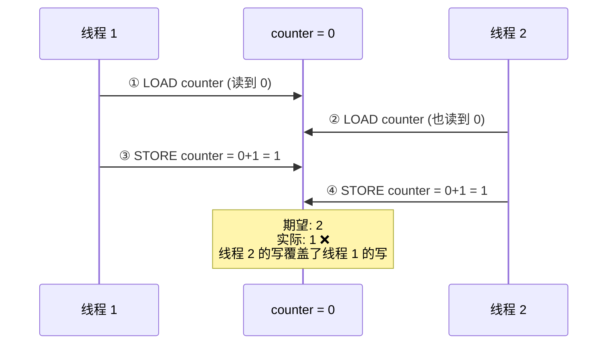
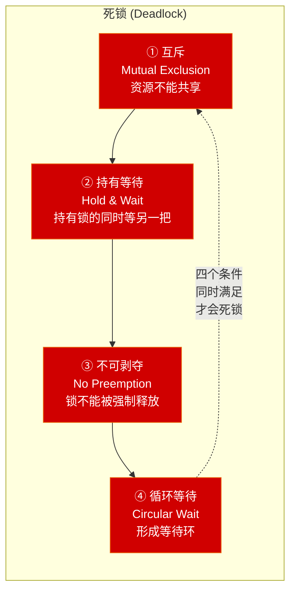
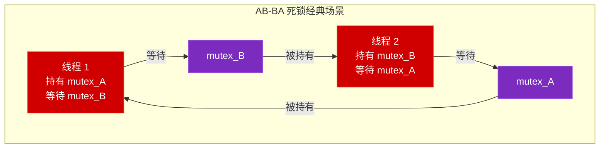
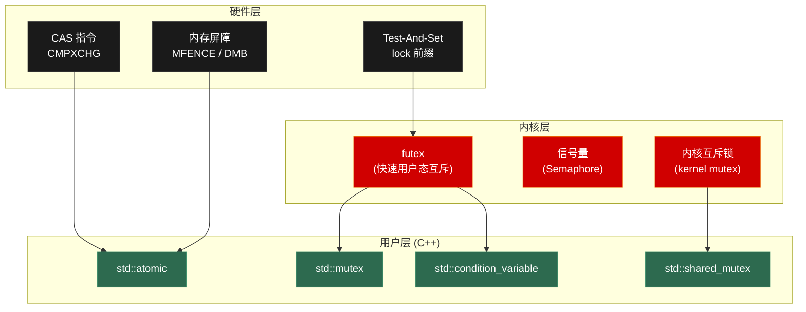
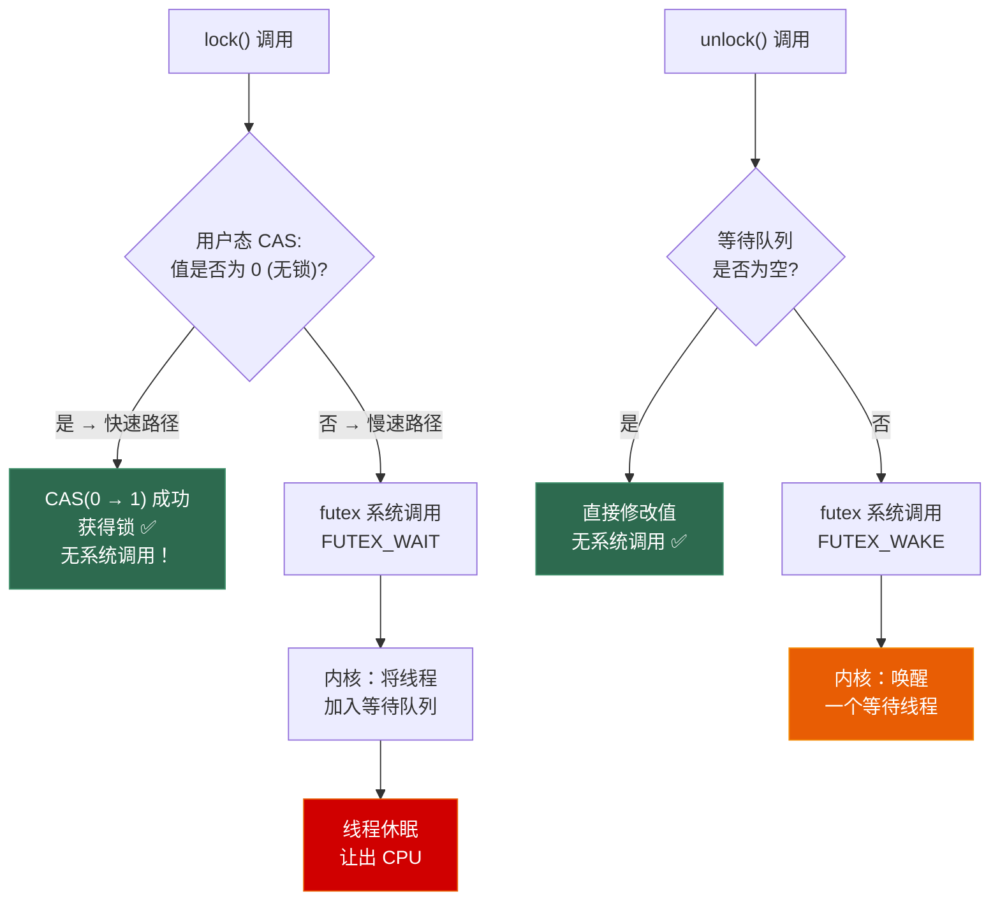
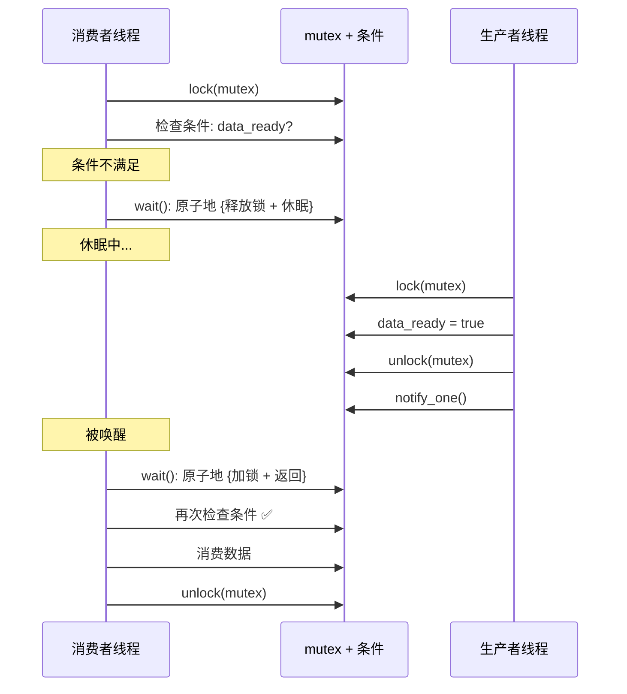
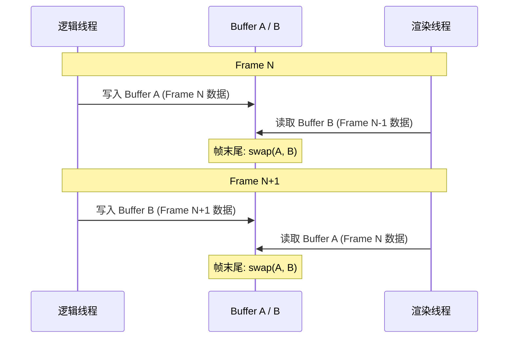

# 第二章 进程同步与互斥

> **一句话理解**：「共享可变状态」是并发 bug 的万恶之源。同步机制的本质就是：**让多个执行流安全地访问共享资源**。

---

## 2.1 概念直觉 —— What & Why

### 竞态条件 (Race Condition)

当多个线程/进程对共享资源的**访问顺序不确定**，且至少有一个是**写操作**时，程序的行为取决于「谁先跑到」——这就是竞态条件。

```cpp
// 经典竞态：两个线程同时执行 counter++
int counter = 0;  // 共享变量

// counter++ 不是原子操作！它实际上是三步：
// 1. 读取 counter 的值到寄存器    (LOAD)
// 2. 寄存器值 + 1                (ADD)
// 3. 把结果写回 counter          (STORE)
```

### 临界区 (Critical Section)

访问共享资源的那段代码叫**临界区**。同一时刻，只能有一个线程/进程进入临界区。

```
进入临界区的四个条件（Dijkstra 提出）：
1. 互斥 (Mutual Exclusion)：任一时刻最多一个进程在临界区内
2. 有限等待 (Bounded Waiting)：不能饿死——等待进入的进程必须在有限时间内进入
3. 空闲让进 (Progress)：临界区空闲时，不能阻止等待的进程进入
4. 让权等待（可选）：等不到就让出 CPU（不忙等）
```

### 为什么需要同步机制？

```
没有同步机制时：
- 数据竞争 (Data Race) → 结果不确定
- 脏读 (Dirty Read) → 读到写了一半的数据
- 丢失更新 (Lost Update) → 两个写互相覆盖
- 死锁 (Deadlock) → 过度同步时的副作用
```

> 💡 **面试中的表述**：「竞态条件是指程序的正确性依赖于线程的执行顺序。根本原因是多个线程对共享变量的非原子操作交错执行。解决方案是把对共享资源的访问包在临界区中，用锁、原子操作或无锁数据结构来保证互斥。」

---

## 2.2 原理图解

### 竞态条件时序图



### 死锁的四个必要条件





### 同步机制全景图



> 本章从底向上讲解：硬件原语 → 内核机制 → 用户态 API。C++ API 的详细用法参见 [C++ Ch7 并发与多线程](../cpp_deep_dive/07_concurrency)，本章侧重**原理**。

---

## 2.3 底层机制剖析

### 2.3.1 原子操作 —— 硬件层面的基石

#### 为什么 counter++ 不是原子的？

```
CPU 执行 counter++ 的实际指令序列（x86）：

mov eax, [counter]    ; 1. 从内存加载到寄存器 (LOAD)
add eax, 1            ; 2. 寄存器 +1           (ADD)
mov [counter], eax    ; 3. 写回内存             (STORE)

三条指令之间，另一个 CPU 核心可能插入自己的 LOAD-ADD-STORE → 竞态！
```

#### lock 前缀 —— x86 的原子保证

```nasm
; x86 提供了 lock 前缀，让一条指令变成原子操作
lock add [counter], 1    ; 原子地 counter += 1

; lock 前缀的硬件实现：
; 早期 CPU：锁总线（bus lock） → 其他核心完全无法访问内存 → 太慢
; 现代 CPU：锁缓存行（cache lock）→ 只锁住含 counter 的那 64 字节缓存行
;           通过 MESI 协议保证一致性，开销小得多
```

#### CAS (Compare-And-Swap) —— 无锁编程的核心

```nasm
; x86 的 CAS 指令：CMPXCHG
; 语义：if (*addr == expected) { *addr = desired; return true; }
;       else { expected = *addr; return false; }

lock cmpxchg [addr], desired
; 比较 EAX(expected) 和 [addr]
; 如果相等 → 把 desired 写入 [addr]，设置 ZF
; 如果不等 → 把 [addr] 的值写入 EAX，清除 ZF
```

```cpp
// C++ 中的 CAS
std::atomic<int> value{0};

int expected = 0;
int desired = 42;
bool success = value.compare_exchange_strong(expected, desired);
// success == true:  value 从 0 变为 42
// success == false: expected 被更新为 value 的当前值

// CAS 循环 —— 无锁自增的标准模式
void lock_free_increment(std::atomic<int>& val) {
    int old_val = val.load();
    while (!val.compare_exchange_weak(old_val, old_val + 1)) {
        // compare_exchange_weak 失败时 old_val 自动更新为当前值
        // weak 版本允许虚假失败（在循环中用更高效）
    }
}
```

#### ABA 问题

```
CAS 的经典陷阱：

线程 1：读到 value = A，准备 CAS(A → B)
线程 2：把 value 从 A 改成 C
线程 3：又把 value 从 C 改回 A
线程 1：CAS 成功！因为 value 确实是 A —— 但中间被改过了！

这在链表操作中可能导致严重 bug（节点被释放又重新分配到同一地址）。
```

```
ABA 解决方案：
1. 版本号（Tagged Pointer）: 每次修改时递增版本号
   CAS 比较的不是值本身，而是 <值, 版本号> 对
   即使值回到 A，版本号已经变了 → CAS 失败

2. Hazard Pointer / RCU: 延迟释放（使旧地址不会被重新分配）

3. GC: 有垃圾回收的语言（Java/C#）天然避免 ABA
   因为对象未被释放前地址不会被重用
```

> 💡 **面试中的表述**：「CAS 是无锁编程的核心原语，它原子地比较并交换内存值。ABA 问题是 CAS 的经典陷阱——值被改成别的又改回来，CAS 无法察觉。解决方案是加版本号，每次修改都递增版本号，即使值相同版本号也不同。」

---

### 2.3.2 互斥锁 (Mutex) —— 从硬件到内核

#### 自旋锁 (Spinlock) —— 用户态最简单的锁

```cpp
// 基于 Test-And-Set 的自旋锁
class SpinLock {
    std::atomic_flag _flag = ATOMIC_FLAG_INIT;  // 初始化为 false
public:
    void lock() {
        while (_flag.test_and_set(std::memory_order_acquire)) {
            // test_and_set: 原子地 { old = _flag; _flag = true; return old; }
            // 如果 old == false → 获得锁 → 退出循环
            // 如果 old == true  → 锁被占 → 继续旋转（忙等）
        }
    }
    void unlock() {
        _flag.clear(std::memory_order_release);
    }
};
```

**自旋锁的问题**：

| 问题 | 原因 |
|------|------|
| 浪费 CPU | 忙等期间一直占用 CPU 时间片 |
| 不适合长临界区 | 持锁线程被调度走 → 其他线程白白旋转整个时间片 |
| 无公平性 | 多线程竞争时无法保证先来先服务 |

**什么时候适合用自旋锁？**
- 临界区**极短**（几条指令）
- **多核**环境（单核上忙等毫无意义——持锁线程不可能在别的核上运行）
- 不允许阻塞的上下文（如内核中断处理函数）

> 💡 **面试中的表述**：「自旋锁适合临界区极短的多核场景，因为线程切换的开销可能比旋转几圈还大。但如果临界区较长，自旋锁浪费 CPU，应该用互斥锁让等待的线程休眠。」

#### futex —— Linux 互斥锁的底层

**futex (Fast Userspace muTEX)** 是 Linux 为了解决自旋锁和内核锁各自缺陷而设计的混合机制：



```
futex 的精髓：
无竞争时 → 纯用户态 CAS，零系统调用（和自旋锁一样快）
有竞争时 → 陷入内核休眠（和传统互斥锁一样省 CPU）

= 两全其美

这就是为什么 std::mutex 在无竞争场景下几乎和 atomic 一样快。
```

```
调用链：
std::mutex::lock()
  → pthread_mutex_lock()        (glibc)
    → futex(FUTEX_WAIT, ...)    (只在竞争时调用)
      → 内核调度器挂起线程

std::mutex::unlock()
  → pthread_mutex_unlock()
    → futex(FUTEX_WAKE, ...)    (只在有等待者时调用)
      → 内核唤醒一个等待线程
```

**Windows 对应**：`SRWLock` (Slim Reader/Writer Lock) 和 `Critical Section` 使用类似的用户态自旋 + 内核等待混合策略。

#### 锁的性能对比

| 锁类型 | 无竞争开销 | 有竞争行为 | 适用场景 |
|--------|-----------|-----------|---------|
| **SpinLock** | ~10ns (CAS) | 忙等（CPU 白转） | 极短临界区、内核、多核 |
| **std::mutex** (futex) | ~25ns (CAS) | 休眠让出 CPU | **通用选择** |
| **Adaptive Mutex** | ~10-25ns | 先自旋 N 次，再休眠 | 临界区长度不确定 |
| **std::shared_mutex** | ~35ns | 分读写 | 读多写少 |
| **std::atomic** | ~5-10ns | 无锁 CAS 循环 | 单变量操作 |

> 数字为近似值，取决于硬件和竞争程度。

---

### 2.3.3 信号量 (Semaphore)

信号量是比 mutex 更通用的同步原语。mutex 是信号量的特例（初始值为 1 的二值信号量）。

```
信号量 = 一个整数计数器 + 两个原子操作：

P 操作 (wait / down)：
    if (count > 0) { count--; }       // 有资源 → 获取
    else           { 阻塞当前线程; }  // 无资源 → 等待

V 操作 (signal / up)：
    count++;
    if (有线程在等待) { 唤醒一个; }
```

| 类型 | 初始值 | 含义 | 等价于 |
|------|--------|------|--------|
| **二值信号量** | 1 | 同时最多 1 个 | ≈ mutex |
| **计数信号量** | N | 同时最多 N 个 | 连接池、限流 |

```cpp
// C++20 引入了 std::counting_semaphore
#include <semaphore>

// 控制最大并发数（如线程池、连接池）
std::counting_semaphore<10> pool_sem(10);  // 最多 10 个

void use_resource() {
    pool_sem.acquire();    // P 操作：count--，如果 count<0 则阻塞
    // ... 使用资源 ...
    pool_sem.release();    // V 操作：count++，唤醒一个等待者
}

// 二值信号量用于线程间通知
std::binary_semaphore ready(0);  // 初始值 0 = "未就绪"

// 线程 A
void producer() {
    prepare_data();
    ready.release();    // 通知：数据就绪
}

// 线程 B
void consumer() {
    ready.acquire();    // 等待：直到数据就绪
    use_data();
}
```

#### 经典问题：生产者-消费者

```cpp
#include <semaphore>
#include <mutex>
#include <array>

constexpr int BUFFER_SIZE = 8;

std::array<int, BUFFER_SIZE> buffer;
int in_idx = 0, out_idx = 0;

std::counting_semaphore<BUFFER_SIZE> empty_slots(BUFFER_SIZE);  // 空位数
std::counting_semaphore<BUFFER_SIZE> filled_slots(0);           // 已填数
std::mutex buffer_mutex;  // 保护 buffer 和下标

void producer(int item) {
    empty_slots.acquire();              // 等待空位 (P)
    {
        std::lock_guard lock(buffer_mutex);
        buffer[in_idx] = item;
        in_idx = (in_idx + 1) % BUFFER_SIZE;
    }
    filled_slots.release();             // 增加已填数 (V)
}

int consumer() {
    filled_slots.acquire();             // 等待数据 (P)
    int item;
    {
        std::lock_guard lock(buffer_mutex);
        item = buffer[out_idx];
        out_idx = (out_idx + 1) % BUFFER_SIZE;
    }
    empty_slots.release();              // 增加空位 (V)
    return item;
}
```

```
信号量 vs 互斥锁 vs 条件变量：

mutex：保护临界区（只有加锁的线程能解锁）
信号量：控制资源数量（任何线程都能 release，不一定是 acquire 的线程）
条件变量：等待某个条件成立（必须配合 mutex 使用）

面试中要能区分这三者的适用场景。
```

---

### 2.3.4 条件变量 (Condition Variable)

条件变量解决的问题：**等待某个条件成立**。

```
为什么不能用忙等？

// ❌ 忙等浪费 CPU
while (!data_ready) {}  // CPU 狂跑空循环

// ✅ 条件变量：没有数据时休眠，有数据时被唤醒
std::unique_lock lock(mtx);
cv.wait(lock, []{ return data_ready; });
```

#### 为什么 wait 必须配合 mutex？



```
关键点：wait() 做的事情（原子操作）：
1. 释放 mutex（让生产者能进入临界区修改条件）
2. 让线程休眠（加入条件变量的等待队列）
3. 被唤醒后：重新获取 mutex → 检查条件

如果不配合 mutex，检查条件和休眠之间会有间隙：
  → "检查条件为 false" 之后、"休眠" 之前，生产者修改条件并 notify
  → 通知丢失！消费者永远睡着 (Lost Wakeup)
```

#### 虚假唤醒 (Spurious Wakeup)

```cpp
// ❌ 错误：用 if 检查条件
cv.wait(lock);
if (queue.empty()) return;  // 虚假唤醒时 queue 可能仍为空！

// ✅ 正确：用 while 循环 或 lambda
cv.wait(lock, [&]{ return !queue.empty(); });
// 等价于：while (!predicate()) { cv.wait(lock); }
```

```
虚假唤醒的原因：
1. 操作系统实现上的原因（某些 OS 的信号处理可能打断 wait）
2. notify_all 唤醒了多个消费者，但只有一个能获取资源
3. POSIX 标准允许虚假唤醒（简化内核实现）

所以必须在循环中检查条件。C++ 的 lambda 版 wait 自动帮你做了 while 循环。
```

> 详细的 C++ 条件变量 API（代码示例、生产者-消费者完整实现）参见 [C++ Ch7 §7.3.3](../cpp_deep_dive/07_concurrency)。

---

### 2.3.5 读写锁 (RWLock)

读写锁把「读者」和「写者」区分对待：

```
规则：
- 多个读者可以同时读（shared/读锁）
- 写者独占（exclusive/写锁）
- 写者和读者互斥
- 写者和写者互斥

适用场景：读远多于写的共享数据（如配置缓存、游戏状态查询）
```

| 操作 | 读锁被持有时 | 写锁被持有时 |
|------|------------|------------|
| 加读锁 | ✅ 允许（共享） | ❌ 阻塞 |
| 加写锁 | ❌ 阻塞 | ❌ 阻塞 |

#### 写者饥饿问题

```
场景：读者不断涌入，写者永远拿不到独占锁

时间线：
Reader A → 持有读锁
    Reader B → 也加了读锁（多读者共享）
        Writer → 等待所有读者释放
            Reader C → 又加了读锁（因为现在是读模式）
                Reader D → 又加了读锁...
                    Writer → 永远排不到 💀

解决方案：
1. 写者优先策略：有写者等待时，新的读者也阻塞
2. 公平策略：按到达顺序排队
3. 实际实现：pthread_rwlock 默认写者优先
```

> C++ 的 `std::shared_mutex` + `std::shared_lock`(读) / `std::unique_lock`(写) 的用法参见 [C++ Ch7 §7.3.2](../cpp_deep_dive/07_concurrency)。

---

### 2.3.6 死锁 (Deadlock)

#### 四个必要条件

```
死锁发生需要同时满足以下四个条件（缺一不可）：

1. 互斥 (Mutual Exclusion)
   → 资源一次只能被一个线程持有

2. 持有等待 (Hold & Wait)
   → 持有一个资源的同时，等待获取另一个资源

3. 不可剥夺 (No Preemption)
   → 线程持有的资源不能被强制释放，只能主动释放

4. 循环等待 (Circular Wait)
   → 线程之间形成环形等待链
```

#### 死锁的三种应对策略

**1. 预防 (Prevention) —— 破坏四个条件之一**

| 破坏条件 | 方法 | 代价 |
|---------|------|------|
| 破坏互斥 | 使资源可共享（如读写锁） | 不是所有资源都能共享 |
| 破坏持有等待 | 一次性申请所有锁（`std::scoped_lock`） | 降低并发度 |
| 破坏不可剥夺 | 拿不到锁就释放已有的锁（try_lock） | 可能活锁 |
| **破坏循环等待** | **给锁排序，所有线程按相同顺序加锁** | **最常用！** |

```cpp
// ❌ 可能死锁：两个线程以不同顺序加锁
void thread1() { lock(m1); lock(m2); /* ... */ }
void thread2() { lock(m2); lock(m1); /* ... */ }  // 顺序相反！

// ✅ 方案 1：固定加锁顺序
void thread1() { lock(m1); lock(m2); /* ... */ }
void thread2() { lock(m1); lock(m2); /* ... */ }  // 相同顺序

// ✅ 方案 2：std::scoped_lock（C++17，自动处理顺序）
void safe_transfer(Account& a, Account& b, int amount) {
    std::scoped_lock lock(a.mutex, b.mutex);  // 内部用 std::lock 避免死锁
    a.balance -= amount;
    b.balance += amount;
}

// ✅ 方案 3：try_lock + 重试
void try_approach() {
    while (true) {
        m1.lock();
        if (m2.try_lock()) {  // 尝试获取，不阻塞
            break;  // 两把锁都拿到了
        }
        m1.unlock();  // 拿不到 m2 就释放 m1
        std::this_thread::yield();  // 让出 CPU，避免活锁
    }
    // 临界区...
    m2.unlock();
    m1.unlock();
}
```

**2. 避免 (Avoidance) —— 银行家算法**

```
银行家算法 (Banker's Algorithm)：

思想：在分配资源前，先模拟分配，看是否存在一条「安全序列」，
     即每个进程都能获得足够资源完成并释放。如果存在，就分配；否则等待。

例子：
系统有 10 个单位的资源 R
进程 A：最大需要 8，已分配 3，还需 5
进程 B：最大需要 5，已分配 2，还需 3  
进程 C：最大需要 3，已分配 2，还需 1
当前剩余 = 10 - 3 - 2 - 2 = 3

安全序列：C(需 1,释放后 4) → B(需 3,释放后 7) → A(需 5,释放后 10) ✅

实际应用：主要在数据库中使用。游戏引擎中开销太大，不实用——
但面试会考银行家算法的思想和过程。
```

**3. 检测与恢复 (Detection & Recovery)**

```
思路：允许死锁发生，定期检测（资源分配图中是否有环），发现后恢复。

恢复手段：
1. 杀死一个死锁进程（释放其资源）
2. 回滚到安全检查点
3. 逐步剥夺资源

实际应用：数据库的事务死锁检测 + 回滚。
```

---

## 2.4 面试高频题

### 2.4.1 必考题

**Q1：互斥锁和自旋锁的区别？各自适用场景？**

> 自旋锁等待时忙等（循环 CAS），不让出 CPU，适合临界区极短的多核场景；互斥锁等待时让线程休眠让出 CPU，适合临界区较长的场景。Linux 的 `std::mutex` 底层用 futex 实现——无竞争时是纯用户态 CAS（接近自旋锁的速度），有竞争时才陷入内核休眠。

**Q2：什么是死锁？怎么避免？**

> 死锁是两个以上线程互相等待对方持有的资源，造成所有线程永远阻塞。需要同时满足四个条件：互斥、持有等待、不可剥夺、循环等待。最常用的预防方法是破坏循环等待——给锁排序，所有线程按相同顺序加锁。C++17 的 `std::scoped_lock` 可以自动处理多把锁的加锁顺序。

**Q3：什么是 CAS？有什么问题？**

> CAS (Compare-And-Swap) 是硬件提供的原子指令：原子地比较内存值和期望值，相等则写入新值。它是无锁编程的基石。主要问题是 ABA——值被改成别的又改回来，CAS 无法察觉。解决方案是加版本号，每次修改都递增版本号。

**Q4：volatile 能保证线程安全吗？**

> 不能。`volatile` 只告诉编译器不要优化掉对变量的读写（用于硬件寄存器映射），它不保证原子性（多线程可能看到半写状态），也不提供内存屏障（没有 happens-before 关系）。线程安全要用 `std::atomic`。详见 [C++ Ch7 §7.4.1](../cpp_deep_dive/07_concurrency)。

**Q5：条件变量为什么要用 while 循环检查条件？**

> 因为虚假唤醒——`wait()` 可能在没有 `notify` 的情况下返回（OS 的信号处理或多消费者竞争）。所以被唤醒后必须再次检查条件是否真的满足。C++ 中推荐用 lambda 谓词形式的 `wait`，它会自动在循环中检查。

### 2.4.2 进阶题

**Q6：futex 是什么？为什么需要它？**

> futex 是 Linux 的快速用户态互斥机制。纯自旋锁浪费 CPU，纯内核锁每次加锁都需要系统调用。futex 取两者之长：无竞争时在用户态 CAS，零系统调用；有竞争时才陷入内核休眠。`std::mutex` 底层就是基于 futex 实现的。

**Q7：信号量和互斥锁的区别？**

> 互斥锁只有 0/1 两个状态，且只有加锁的线程能解锁（所有权语义）。信号量有计数值，任何线程都能 release（生产-消费语义）。互斥锁保护临界区，信号量控制并发数量（如连接池限制最多 N 个连接）。

**Q8：什么是优先级反转？怎么解决？**

> 低优先级线程持有锁，中优先级线程不需要锁但抢占了 CPU，高优先级线程等待锁却无法运行——高优先级实际上被中优先级间接阻塞了。解决方案是优先级继承：低优先级线程持有锁时，暂时继承等待该锁的最高优先级线程的优先级，用完释放后恢复。Mars Pathfinder 是优先级反转导致系统重启的著名案例。

---

## 2.5 🎮 游戏实战场景

### 2.5.1 双缓冲/三缓冲同步

#### 为什么渲染线程和逻辑线程不能直接共享数据？

```
如果逻辑线程和渲染线程直接读写同一份数据：

逻辑线程正在更新 Entity 的位置：
  entity.position.x = new_x;    ← 写了 x
  // 渲染线程此时读取 entity.position → 读到了新 x 但旧 y！
  entity.position.y = new_y;    ← 还没写 y

结果：渲染出的画面是半新半旧的 → 撕裂、抖动、穿模
```

#### 双缓冲解决方案

```
核心思想：
- 两份帧数据：Buffer A 和 Buffer B
- 逻辑线程写 Buffer A，渲染线程读 Buffer B
- 帧末尾交换 A 和 B（原子操作）
- 逻辑线程永远不会写渲染线程正在读的数据 → 无竞态

代价：一帧延迟（渲染的是上一帧的数据）
对游戏来说完全可接受（60fps = 16.7ms 延迟，人眼不可察觉）
```



> 完整的 C++ 双缓冲实现代码参见 [C++ Ch7 §7.5.1 DoubleBuffer](../cpp_deep_dive/07_concurrency)。

#### 三缓冲进阶

```
双缓冲的问题：如果逻辑比渲染快，逻辑线程必须等渲染完成才能交换。

三缓冲：三份 buffer —— 逻辑写一份、渲染读一份、剩一份待命
- 逻辑线程永远不等（写完直接交换到待命 buffer）
- 渲染线程永远有最新的可用数据
- 代价：多一帧延迟 + 多用一份内存

适用场景：逻辑帧率 > 渲染帧率的情况（如物理 120Hz + 渲染 60Hz）
```

### 2.5.2 无锁队列在游戏中的应用

#### 为什么游戏引擎偏好无锁数据结构？

```
游戏引擎的线程通信场景：
- 主线程 → 渲染线程：渲染命令队列 (每帧几千条)
- 网络线程 → 主线程：网络消息队列 (收包)
- 主线程 → 音频线程：音频事件队列

这些队列的特点：
1. 高频：每帧都在读写
2. 低延迟要求：队列操作必须极快
3. 大多是 SPSC（单生产者-单消费者）

用 mutex 保护队列的问题：
❌ 优先级反转：渲染线程持锁 → 逻辑线程等锁 → 帧延迟
❌ 最坏情况不可预测：持锁线程被调度走 → 其他线程全部阻塞
❌ 锁竞争在高频场景下成为瓶颈

无锁队列的优势：
✅ 无阻塞：push/pop 永远不会挂起线程
✅ 最坏情况可预测：每次操作都是有限步骤
✅ 没有优先级反转风险
```

> 完整的 SPSC 无锁队列 C++ 实现参见 [C++ Ch7 §7.5.3 SPSCQueue](../cpp_deep_dive/07_concurrency)。关键设计点：
> - `_head` 和 `_tail` 用 `alignas(64)` 放在不同缓存行 → 避免伪共享（详见 [Ch4 CPU 缓存](../04_cpu_cache)）
> - 使用 `acquire/release` 内存序（而非更昂贵的 `seq_cst`）

### 2.5.3 原子操作在游戏中的应用

```cpp
// === 1. 引用计数（shared_ptr 底层） ===
// shared_ptr 的引用计数用 atomic 递增/递减，
// 多个线程拷贝/销毁同一对象的 shared_ptr 是安全的。
// （但 shared_ptr 变量本身的读写不是线程安全的！—— 详见 C++ Ch7）

// === 2. 无锁的状态标志位 ===
class GameEntity {
    // 多线程可以安全地读写这些标志，无需加锁
    std::atomic<bool> _is_active{true};
    std::atomic<bool> _needs_destroy{false};
    std::atomic<uint32_t> _dirty_flags{0};

public:
    void markForDestroy() {
        _needs_destroy.store(true, std::memory_order_release);
    }
    
    bool shouldDestroy() const {
        return _needs_destroy.load(std::memory_order_acquire);
    }
    
    // 位操作：原子地设置脏标记
    void setDirty(uint32_t flag) {
        _dirty_flags.fetch_or(flag, std::memory_order_relaxed);
    }
    
    uint32_t consumeDirty() {
        return _dirty_flags.exchange(0, std::memory_order_acq_rel);
    }
};

// === 3. 帧计数器 / 统计计数器 ===
// 只需要原子性，不需要与其他变量的顺序关系 → relaxed
std::atomic<uint64_t> total_frames{0};
std::atomic<uint64_t> total_draw_calls{0};

void endFrame() {
    total_frames.fetch_add(1, std::memory_order_relaxed);
}
```

### 2.5.4 游戏中的死锁案例与防范

```cpp
// === 真实案例：技能系统 + 状态系统的死锁 ===

class SkillSystem {
    std::mutex _skill_mutex;
    StatusSystem& _status;

public:
    void castSkill(Entity& e) {
        std::lock_guard lock(_skill_mutex);        // ① 锁 skill
        // 施放技能需要检查 buff 状态
        if (_status.hasBuff(e, "silence")) return; // ② 内部会锁 status
        // ...
    }
};

class StatusSystem {
    std::mutex _status_mutex;
    SkillSystem& _skill;

public:
    void applyBuff(Entity& e, const Buff& buff) {
        std::lock_guard lock(_status_mutex);        // ① 锁 status
        // 某些 buff 需要中断当前技能
        _skill.interruptSkill(e);                   // ② 内部会锁 skill
        // ...
    }
};

// 如果线程 A 先调 castSkill（锁 skill → 等 status）
// 线程 B 同时调 applyBuff（锁 status → 等 skill）
// → 死锁！

// === 解决方案 ===

// 方案 1：统一加锁顺序（skill < status，所有地方都先锁 skill 再锁 status）
// 方案 2：不要在锁内调用外部系统 → 收集需求，锁外执行
// 方案 3：用消息队列解耦（skill 系统发消息给 status 系统，而非直接调用）

// 方案 3 示例：
class SkillSystem_NoDeadlock {
    std::mutex _skill_mutex;
    SPSCQueue<StatusRequest, 256>& _status_queue;  // 无锁队列

public:
    void castSkill(Entity& e) {
        std::lock_guard lock(_skill_mutex);
        // 不直接调用 StatusSystem，而是发消息
        _status_queue.push({e.id, StatusRequest::CHECK_BUFF, "silence"});
    }
};
```

```
游戏引擎防死锁最佳实践：
1. 尽量避免多把锁 → 用消息队列或命令模式解耦
2. 如果必须多把锁 → std::scoped_lock 或严格的加锁顺序
3. 不要在持锁时调用外部系统（callout 规则）
4. 使用 lock-free 数据结构替代锁
5. 定期用 ThreadSanitizer 检测数据竞争
```

---

## 2.6 30 秒速答

> 📋 以下是本章核心知识点的面试速答模板。每个回答控制在 30 秒内。

---

**Q：什么是竞态条件？**

> 多个线程同时访问共享变量，且至少有一个是写操作，结果取决于执行顺序。根本原因是非原子操作的交错。解决方案是用锁、原子操作或无锁数据结构保证互斥。

**Q：互斥锁和自旋锁的区别？**

> 自旋锁等待时忙等不让出 CPU，适合极短临界区的多核场景。互斥锁让线程休眠让出 CPU，适合较长临界区。Linux 的 mutex 底层用 futex——无竞争时纯用户态 CAS（接近自旋锁），有竞争时才陷入内核休眠，两全其美。

**Q：死锁的四个条件和解决方法？**

> 互斥、持有等待、不可剥夺、循环等待，四个同时满足才会死锁。最常用的预防方法是破坏循环等待——所有线程按相同顺序加锁。C++17 的 `scoped_lock` 可以自动处理多锁顺序。

**Q：CAS 是什么？ABA 问题是什么？**

> CAS 是硬件原子指令，比较内存值和期望值，相等则写入新值。ABA 问题是值被改成别的又改回来，CAS 无法察觉。解决方案是版本号——每次修改递增版本号，即使值相同版本号也不同。

**Q：条件变量为什么要配合 while 使用？**

> 因为虚假唤醒——wait 可能在没有 notify 的情况下返回。被唤醒后必须再次检查条件是否真的满足。C++ 推荐用 lambda 谓词形式的 wait，它自动做循环检查。

**Q：什么是优先级反转？**

> 低优先级线程持有锁，被中优先级线程抢占 CPU，高优先级线程等待锁却无法运行——高优先级被间接阻塞。解决方案是优先级继承：持锁线程暂时继承等待者的最高优先级。

---

> 📖 上一章：[第一章 进程与线程](../01_process_and_thread) —— 进程地址空间、PCB、fork/COW、线程模型、上下文切换。

> 📖 下一章：[第三章 内存管理](../03_memory_management) —— 虚拟内存、页表、TLB、页面置换、mmap、自定义分配器。
