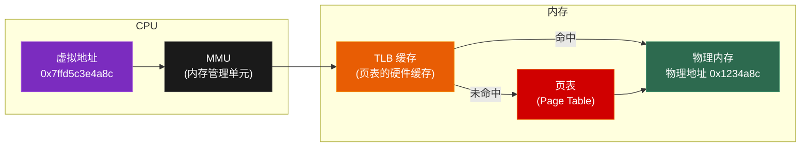
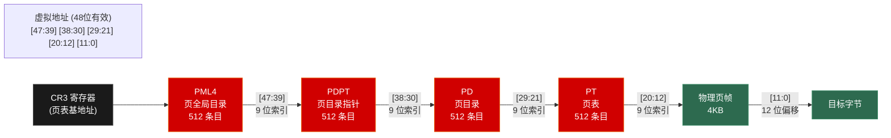
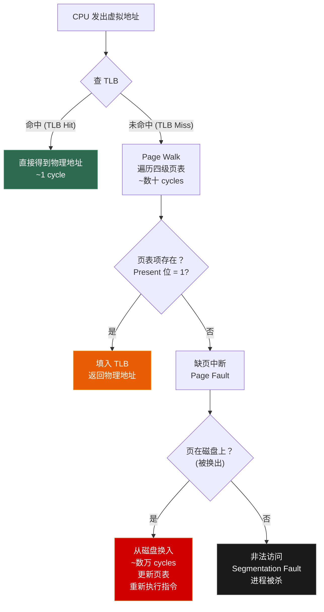
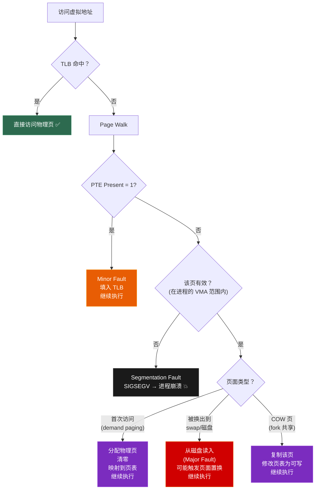
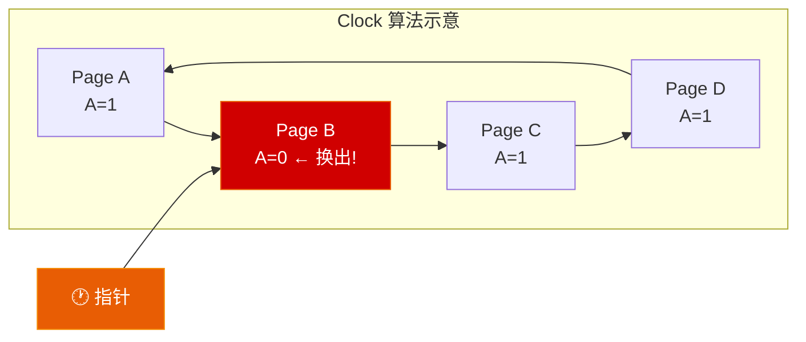
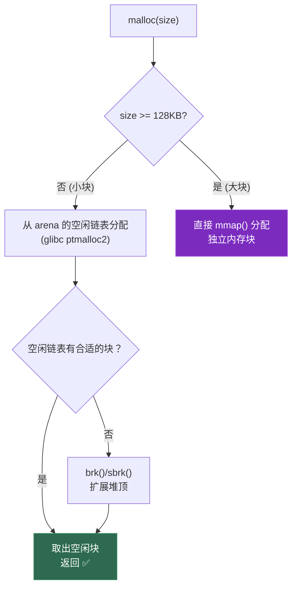
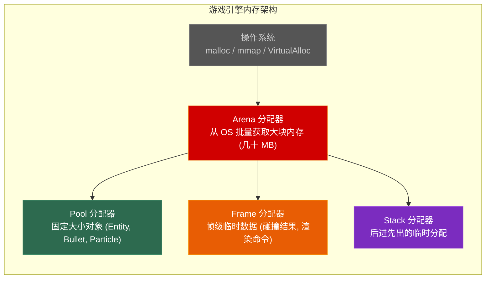

# 第三章 内存管理

> **一句话理解**：虚拟内存是操作系统给每个进程的「幻觉」——让每个进程以为自己独占了整个地址空间，但物理内存是共享的，操作系统在背后默默做着映射和调度。

---

## 3.1 概念直觉 —— What & Why

### 为什么需要虚拟内存？

如果所有进程直接使用物理地址：

```
问题 1：没有隔离
  进程 A 可以读写进程 B 的内存 → 一个 bug 搞崩全系统

问题 2：地址冲突
  两个程序都想用地址 0x400000 → 无法同时运行

问题 3：内存不够
  物理内存只有 8GB，但开了几十个程序各自以为自己有 4GB

问题 4：碎片
  进程申请/释放内存后，物理内存碎片化 → 大块分配失败
```

**虚拟内存的解决方案**：给每个进程一个独立的「虚拟地址空间」，由 OS + MMU 硬件在背后将虚拟地址映射到物理地址。

```
虚拟内存的四大好处：
1. 进程隔离：每个进程有独立地址空间，互不干扰
2. 地址空间抽象：每个进程以为自己从 0x0 开始，有连续的大段内存
3. 内存超售（Overcommit）：所有进程的虚拟内存总和可以超过物理内存
4. 共享与保护：多个进程可以共享同一物理页（如动态库），同时设置权限位
```

### 一个程序看到的地址是虚拟的

```cpp
int x = 42;
printf("%p\n", &x);  // 输出如 0x7ffd5c3e4a8c

// 这个地址是 虚拟地址（Virtual Address）
// 它不是 DRAM 芯片上的真实地址
// CPU 的 MMU 会通过 页表 把它翻译成 物理地址（Physical Address）
// 程序永远看不到物理地址（用户态无法访问）
```

> 💡 **面试中的表述**：「程序中的指针存的是虚拟地址，不是物理地址。CPU 的 MMU 通过查页表将虚拟地址翻译成物理地址。每个进程有独立的页表，所以同一个虚拟地址在不同进程中会映射到不同的物理页。」

---

## 3.2 原理图解

### 虚拟地址到物理地址的映射



### 页 (Page) 的概念

```
虚拟内存以 页 (Page) 为单位管理，而非逐字节。

典型页大小：4KB (4096 bytes) = 2^12

为什么是 4KB？
1. 太小（如 512B）→ 页表条目太多，占用太多内存
2. 太大（如 1MB）→ 内部碎片严重（只用 1 字节也占 1MB 的页）
3. 4KB 是硬盘扇区大小的整数倍，IO 友好
4. 历史原因 + 硬件优化（TLB 条目数有限，4KB 是平衡点）

虚拟地址 = 页号 (VPN) + 页内偏移 (Offset)
物理地址 = 帧号 (PFN) + 页内偏移 (Offset)

示例（以 4KB 页为例）：
虚拟地址 0x12345678
= 页号 0x12345 + 偏移 0x678
页表将 VPN 0x12345 → PFN 0x89ABC
物理地址 = 0x89ABC000 + 0x678 = 0x89ABC678
```

### x86-64 四级页表



```
x86-64 四级页表拆解：
48 位虚拟地址 = 9 + 9 + 9 + 9 + 12

PML4 索引 [47:39]  → 9 位 → 512 个条目
PDPT 索引 [38:30]  → 9 位 → 512 个条目  
PD   索引 [29:21]  → 9 位 → 512 个条目
PT   索引 [20:12]  → 9 位 → 512 个条目
页内偏移  [11:0]   → 12 位 → 4096 字节 = 4KB

每个条目 8 字节 → 一页 4KB 刚好放 512 个条目 (512 × 8 = 4096)

理论可寻址：2^48 = 256TB
```

### TLB 命中/未命中流程



```
各级访问延迟对比：
TLB 命中:        ~1 cycle     (~0.3ns)
TLB 未命中:      ~10-100 cycles (~3-30ns)  需要 Page Walk
缺页 (内存中):   即 Minor Page Fault, 无需磁盘IO
缺页 (磁盘换入): ~1,000,000 cycles (~数 ms)  SSD/HDD IO
```

---

## 3.3 底层机制剖析

### 3.3.1 虚拟内存

#### 虚拟地址空间划分

```
x86-64 Linux 的地址空间划分：

用户空间: 0x0000_0000_0000_0000 ~ 0x0000_7FFF_FFFF_FFFF (低 128TB)
          ← 用户程序可以访问
          ← 每个进程独立（各自有不同的页表映射）

规范空洞: 0x0000_8000_0000_0000 ~ 0xFFFF_7FFF_FFFF_FFFF
          ← 不可使用（地址不规范）

内核空间: 0xFFFF_8000_0000_0000 ~ 0xFFFF_FFFF_FFFF_FFFF (高 128TB)
          ← 只有内核态可以访问
          ← 所有进程共享同一份内核映射

Windows 类似，但划分略有不同（用户空间默认 128TB）。
```

#### 虚拟内存的四个核心优势

```
1. 进程隔离
   进程 A 的虚拟地址 0x400000 和进程 B 的 0x400000
   映射到不同的物理页 → 互不干扰，一个崩了不影响另一个

2. 内存超售 (Overcommit)
   10 个进程各 malloc 1GB = 10GB 虚拟内存
   但物理内存只有 8GB？没问题！
   → OS 保证分配虚拟页（页表项标记 not present）
   → 真正写入时才分配物理页（按需分配 = demand paging）
   → 大部分页可能永远不被访问

3. 共享内存
   多个进程加载同一个 libc.so → 只需要在物理内存中存一份
   每个进程的页表都映射到相同的物理页（共享映射）

4. 权限保护
   代码段 → 只读+可执行（不可写 → 防止代码注入）
   栈 → 可读写+不可执行（NX bit → 防止栈溢出攻击）
   内核空间 → 用户态不可访问（Ring 0 vs Ring 3）
```

### 3.3.2 页表

#### 单级页表的问题

```
假设 32 位地址空间，4KB 页：
虚拟页数 = 2^32 / 2^12 = 2^20 = 1M 个页
每个页表项 4 字节 → 页表大小 = 4MB / 进程

问题：
- 100 个进程 = 400MB 只用来存页表！
- 大部分页表项永远不会被使用（进程通常只用很少的地址空间）
- 浪费严重
```

#### 多级页表 —— 按需创建

```
多级页表的核心思想：只为实际使用的地址空间创建页表。

以两级页表为例（32 位）：
┌────────────┬────────────┬────────────┐
│ 一级索引 10位│ 二级索引 10位│  偏移 12位   │
└────────────┴────────────┴────────────┘

一级页表（Page Directory）：1024 个条目 → 4KB
每个条目指向一个二级页表（如果那段地址被使用了的话）

如果进程只用了 12MB 的地址空间（3 个一级条目）：
- 一级页表：4KB（始终存在）
- 二级页表：3 × 4KB = 12KB（只为使用的部分创建）
- 总计：16KB ← 远小于单级页表的 4MB！

x86-64 用四级页表，原理相同，只是层数更多。
```

#### 页表项 (PTE) 的结构

```
x86-64 的页表项（Page Table Entry）= 8 字节 = 64 位

┌─────────────────────────────────────────────────┐
│ [63]    NX (No Execute)     → 该页不可执行      │
│ [62:52] 保留/软件使用位                           │
│ [51:12] 物理页帧号 (PFN)    → 物理地址的高位      │
│ [11:9]  可用位              → OS 自定义使用       │
│ [8]     G (Global)          → TLB 不随 CR3 刷新  │
│ [7]     PS (Page Size)      → 大页标志           │
│ [6]     D (Dirty)           → 该页被写过         │
│ [5]     A (Accessed)        → 该页被访问过       │
│ [4]     PCD (Cache Disable) → 禁用缓存           │
│ [3]     PWT (Write Through) → 写穿策略           │
│ [2]     U/S (User/Supervisor) → 用户态可访问？   │
│ [1]     R/W (Read/Write)    → 可写？             │
│ [0]     P (Present)         → 该页在物理内存中？  │
└─────────────────────────────────────────────────┘

面试重点标志位：
P  = 0 → 页不在内存 → 访问时触发 Page Fault
R/W    → 控制只读/可写（COW 用这个位实现）
U/S    → 控制用户态是否可访问（内核隔离）
D      → 脏页标记（换出时需要写回磁盘）
A      → 访问标记（Clock 算法用这个位）
NX     → 不可执行（防止 shellcode 攻击）
```

### 3.3.3 TLB (Translation Lookaside Buffer)

```
TLB = 页表的硬件缓存，位于 MMU 内部。

查页表需要 4 次内存访问（四级页表的每一级都是一次内存访问）。
TLB 把最近使用的「虚拟页号 → 物理帧号」映射缓存起来，
命中时只需 1 个时钟周期。

典型 TLB 配置（现代 CPU）：
L1 DTLB (数据): 64-128 条目, 4-way 组相联
L1 ITLB (指令): 64-128 条目
L2 TLB (统一):  512-2048 条目

TLB 命中率通常 > 99%（因为程序的局部性原理）
```

#### 大页 (Huge Pages)

```
普通页 4KB → TLB 一条覆盖 4KB
大页 2MB   → TLB 一条覆盖 2MB (= 512 个普通页)
巨页 1GB   → TLB 一条覆盖 1GB

好处：
- TLB 条目数不变，但覆盖的地址范围增大 512/262144 倍
- 大幅减少 TLB miss
- 减少 Page Walk 的次数（大页只需两/三级查找）

代价：
- 内部碎片增大（分配 2MB，可能只用几 KB）
- 内存分配灵活性降低

适用场景：
- 数据库（Oracle/MySQL 推荐开启大页）
- 游戏服务器（大量连续内存访问）
- JVM 堆（大块连续内存）

Linux：
  echo 1024 > /proc/sys/vm/nr_hugepages  # 预分配 1024 个 2MB 大页
  或使用 Transparent Huge Pages (THP) 自动合并
```

> 💡 **面试中的表述**：「TLB 是页表的硬件缓存。进程切换时 TLB 必须刷新（因为新进程的页表不同），这是进程切换比线程切换慢的重要原因之一。大页可以让 TLB 覆盖更大的地址范围，减少 TLB miss，适合数据库和游戏服务器等大内存场景。」

### 3.3.4 缺页中断 (Page Fault)

访问的虚拟页不在物理内存中时，MMU 触发**缺页中断**，CPU 陷入内核处理。



```
三种缺页中断：

1. Minor Page Fault（软缺页）
   页在内存中但不在页表/TLB 中（如首次访问 mmap 的文件）
   处理：建立映射，填入 TLB → 很快（~几微秒）

2. Major Page Fault（硬缺页）
   页被换出到磁盘（swap）→ 需要磁盘 IO
   处理：从磁盘读入物理页 → 很慢（~数毫秒）

3. Invalid Page Fault（无效访问）
   访问了不属于该进程的地址 → Segmentation Fault
   处理：发送 SIGSEGV 信号给进程 → 进程崩溃
```

### 3.3.5 页面置换算法

当物理内存不够时，OS 需要把某些页**换出**到磁盘（swap），腾出物理页给新的请求。选择哪个页换出，就是页面置换算法的问题。

| 算法 | 策略 | 优点 | 缺点 |
|------|------|------|------|
| **FIFO** | 先进先出 | 实现简单 | Bélády 异常（增加页框数反而更多缺页） |
| **OPT** | 换出未来最久不用的 | 理论最优 | 需预知未来，不可实现 |
| **LRU** | 换出最近最久未使用的 | 接近最优 | 需要精确记录访问时间/顺序，开销大 |
| **Clock** | LRU 的近似（二次机会） | 实现高效 | **Linux 实际使用** |
| **LFU** | 换出使用频率最低的 | 考虑长期频率 | 短期突发不友好 |

#### FIFO —— 简单但有陷阱

```
缺页序列：7, 0, 1, 2, 0, 3, 0, 4, 2, 3
3 个页框：

访问: 7  0  1  2  0  3  0  4  2  3
帧1: [7] 7  7 [2] 2  2 [0] 0  0 [3]
帧2:     [0] 0  0 [0] 0  0 [4] 4  4
帧3:         [1] 1  1 [3] 3  3 [2] 2
缺页: ✗  ✗  ✗  ✗  -  ✗  ✗  ✗  ✗  ✗  = 9 次缺页

Bélády 异常：4 个页框反而可能比 3 个页框缺页更多！
这是 FIFO 独有的怪异行为。
```

#### LRU —— 面试最爱考

```
同样序列，3 个页框：

访问: 7  0  1  2  0  3  0  4  2  3
帧:  [7][0,7][1,0,7][2,1,0][0,2,1][3,0,2][0,3,2][4,0,3][2,4,0][3,2,4]
缺页: ✗  ✗    ✗      ✗     -      ✗     -      ✗      ✗      ✗  = 8 次

LRU 比 FIFO 少 1 次缺页，且不会有 Bélády 异常。
```

> **手写 LRU 是面试必考题**。用哈希表 + 双向链表实现 O(1) 的 get 和 put。详细实现参见 [数据结构 Ch5 哈希表](../data_structure/05_hash_table) 中的 LRU 缓存题目。

#### Clock 算法 —— Linux 的实际选择

```
Clock 算法是 LRU 的低开销近似：

原理：
1. 所有页帧围成一个环形（clock face）
2. 每个页有一个 Accessed 位（硬件自动设置）
3. 时钟指针从上次停的位置开始扫描

页面置换时：
→ 检查指针指向的页
  if (Accessed == 1)：
    Accessed = 0（给第二次机会）
    指针前进
  if (Accessed == 0)：
    换出这个页！
    指针停在下一位

直觉：最近被访问过的页会有 Accessed=1 → 得到保留
      长时间没被访问的页 Accessed=0 → 被换出
      效果接近 LRU，但只需要一个位（O(1)空间）
```



### 3.3.6 内存映射 (mmap)

`mmap` 将文件或设备映射到进程的虚拟地址空间——之后读写内存就等于读写文件。

```c
#include <sys/mman.h>

// 基本用法：将文件映射到内存
int fd = open("game_asset.pak", O_RDONLY);
struct stat sb;
fstat(fd, &sb);

void* ptr = mmap(
    NULL,            // 让 OS 选择映射地址
    sb.st_size,      // 映射长度 = 文件大小
    PROT_READ,       // 只读
    MAP_PRIVATE,     // 私有映射（修改不影响原文件）
    fd,              // 文件描述符
    0                // 文件偏移
);

// 直接像数组一样访问文件内容
char first_byte = ((char*)ptr)[0];
// 第一次访问时触发 Minor Page Fault → OS 从文件读入该页

munmap(ptr, sb.st_size);  // 解除映射
close(fd);
```

#### 四种映射类型

| 类型 | 可见性 | 写回文件 | 用途 |
|------|--------|---------|------|
| `MAP_SHARED` + 文件 | 多进程共享 | ✅ 写回文件 | 共享文件、进程间通信 |
| `MAP_PRIVATE` + 文件 | 进程私有 (COW) | ❌ 不写回 | 加载可执行文件、只读资源 |
| `MAP_SHARED` + 匿名 | 多进程共享 | N/A | 进程间共享内存 |
| `MAP_PRIVATE` + 匿名 | 进程私有 | N/A | malloc 大块分配（>128KB） |

```
mmap vs read 的对比：

read():
1. 用户调用 read() 系统调用
2. 内核从磁盘读数据到 Page Cache（内核缓冲区）
3. 内核把 Page Cache 的数据拷贝到用户缓冲区
→ 数据在内存中存了两份：Page Cache + 用户缓冲区

mmap():
1. 用户调用 mmap()，OS 建立虚拟地址到文件的映射
2. 首次访问时 Page Fault → OS 从磁盘读入 Page Cache
3. 用户直接访问 Page Cache（页表直接映射到 Page Cache 的物理页）
→ 数据只在内存中存一份！零拷贝！

适用场景：大文件的随机读取（如游戏资源包）
```

### 3.3.7 内存分配器

#### malloc 的底层实现

用户调用 `malloc(size)` 时，实际的分配路径取决于大小：



#### ptmalloc2 (glibc 默认)

```
ptmalloc2 的核心概念：

Arena（分配区）：每个线程有自己的 arena → 减少锁竞争
  主 arena: 使用 brk() 扩展
  非主 arena: 使用 mmap() 分配

Chunk（内存块）：malloc 返回的每块内存前面有 header
  ┌─────────────────────────────────┐
  │ prev_size (8B) │ size (8B)      │ ← chunk header
  │ flags: P(前块在用) M(mmap) A    │
  ├─────────────────────────────────┤
  │           用户数据               │ ← malloc 返回的指针指向这里
  │           ...                   │
  └─────────────────────────────────┘

Bin（空闲链表）：按大小分组的空闲 chunk 链表
  Fast Bins:     16~80 字节，LIFO，不合并（极速分配）
  Small Bins:    < 512 字节，FIFO，排序
  Large Bins:    >= 512 字节，按大小排序
  Unsorted Bin:  刚释放的 chunk 先放这里，稍后整理
```

#### tcmalloc / jemalloc —— 高性能替代品

```
ptmalloc2 的问题：
- 多线程场景下 arena 锁竞争（非主 arena 数量有限）
- 内存碎片较严重
- free 后的内存不容易归还 OS

tcmalloc (Google) / jemalloc (Facebook/FreeBSD) 的核心优化：

1. Thread-Local Cache（线程本地缓存）
   每个线程有自己的小对象缓存 → 分配/释放完全无锁！
   只有缓存耗尽时才需要加锁从全局取

2. Size Class（大小分类）
   把分配大小归类到固定的 size class（如 8, 16, 32, 48, 64...）
   减少碎片 + 加速查找

3. 页级管理（span/slab）
   批量从 OS 获取页面，按 size class 切割
   
性能对比（多线程场景）：
ptmalloc2:  可能有锁竞争 → 多线程不稳定
tcmalloc:   TLC 无锁快速路径 → ~10-20ns/次
jemalloc:   类似 tcmalloc + 更好的碎片控制
```

> 💡 **面试中的表述**：「malloc 底层分两种情况：小于 128KB 用 brk 从堆上分配，维护空闲链表管理；大于 128KB 直接 mmap 分配独立页。glibc 的 ptmalloc2 用 arena 减少线程锁竞争，但仍有瓶颈。tcmalloc 和 jemalloc 通过线程本地缓存实现无锁的快速分配路径。」

> 自定义内存分配器（Pool Allocator / Frame Allocator）的 C++ 实现参见 [C++ Ch1 §1.5 游戏实战](../cpp_deep_dive/01_memory_model)。

---

## 3.4 面试高频题

### 3.4.1 必考题

**Q1：什么是虚拟内存？有什么作用？**

> 虚拟内存给每个进程一个独立的地址空间抽象。好处四个：进程隔离（互不影响）、地址空间统一（每个进程从 0 开始）、内存超售（虚拟内存可以超过物理内存）、共享与保护（多进程共享动态库的物理页）。CPU 的 MMU 通过页表做虚拟到物理的翻译。

**Q2：页表是什么？为什么用多级页表？**

> 页表是虚拟页号到物理帧号的映射表。单级页表的问题是即使进程只用了很少的地址空间，也要为整个虚拟空间分配页表（32 位下 4MB/进程）。多级页表按需创建——只有实际使用的地址范围才分配对应层级的页表，稀疏地址空间节省大量内存。x86-64 用四级页表，48 位虚拟地址分为 4 个 9 位索引 + 12 位页内偏移。

**Q3：什么是 TLB？TLB 未命中怎么办？**

> TLB 是页表的硬件缓存，存在 MMU 内部。TLB 命中时只需 1 个周期得到物理地址。未命中时需要 Page Walk——遍历多级页表查找映射，要访问数次内存，慢数十倍。如果页表项的 Present 位为 0，还会触发缺页中断。进程切换时 TLB 需要刷新，这是进程切换比线程切换慢的核心原因之一。

**Q4：常见的页面置换算法有哪些？**

> FIFO 先进先出（简单但有 Bélády 异常），LRU 最近最久未使用（效果好但开销大），Clock 算法是 LRU 的低开销近似（Linux 实际使用），用 Accessed 位给页面第二次机会。OPT 是理论最优但不可实现。面试中常考手写 LRU 缓存（哈希表 + 双向链表 O(1)）。

**Q5：什么是缺页中断？**

> 访问的虚拟页不在物理内存中时，MMU 触发缺页中断。分三种：Minor Fault（页在内存但未映射到页表，建立映射即可，如首次访问 mmap），Major Fault（页被换出到磁盘，需要磁盘 IO 读回，很慢），Invalid Fault（非法地址，进程收到 SIGSEGV 崩溃）。

**Q6：malloc 底层是怎么实现的？**

> 小于 128KB 用 brk/sbrk 从堆顶扩展，维护空闲链表（fast bins/small bins/large bins）管理，free 后归还到空闲链表。大于 128KB 直接 mmap 分配独立页面，free 时直接 munmap 归还 OS。glibc 的 ptmalloc2 用 arena 机制减少多线程锁竞争，tcmalloc/jemalloc 通过线程本地缓存进一步消除锁。

**Q7：什么是 mmap？和 read 有什么区别？**

> mmap 将文件映射到虚拟地址空间，访问内存就等于访问文件。与 read 的关键区别：read 需要从内核 Page Cache 拷贝数据到用户缓冲区（多一次拷贝），mmap 直接让用户页表映射到 Page Cache 的物理页（零拷贝）。mmap 适合大文件的随机读取。

---

## 3.5 🎮 游戏实战场景

### 3.5.1 游戏引擎的分层内存管理



```
为什么游戏引擎不直接用 malloc？

1. 速度：malloc 内部有锁、空闲链表查找，~25-100ns/次
   自定义分配器：~1-5ns/次（指针前进或链表头弹出）

2. 碎片：malloc 长时间运行后产生大量碎片
   → 手游运行 2 小时后 OOM（虽然"空闲"内存够，但全是碎片）

3. 可预测性：malloc 的耗时不可预测（可能触发 mmap/brk 系统调用）
   游戏需要每帧 16ms 完成 → 不能有随机的长耗时

4. 统计与调试：自定义分配器可以记录每次分配的来源、大小
   → 精确追踪内存泄漏和使用峰值
```

#### UE5 FMallocBinned2 的设计思路

```
UE5 的默认分配器 FMallocBinned2：

1. Size Class 分桶（类似 tcmalloc）
   小对象：按 16B 步进→ 16, 32, 48, 64, ..., 256B
   中对象：按更大步进→ 288, 320, ..., 4KB
   大对象：直接走 OS 的 VirtualAlloc/mmap

2. 每个线程有自己的缓存（Thread-Local）
   分配/释放热路径无锁

3. Pool 组织
   每个 size class 有一组 64KB 的 pool
   pool 内用位图(bitmap)管理空闲 slot → O(1) 分配

4. 虚拟内存预留
   启动时预留大块虚拟内存（Reserve）
   按需提交物理页（Commit）
   → 避免碎片，地址空间连续
```

> Pool Allocator 和 Frame Allocator 的完整 C++ 实现参见 [C++ Ch1 §1.5](../cpp_deep_dive/01_memory_model)。

#### 内存预算 (Memory Budget)

```
移动端游戏的内存限制：

iOS:  超过设备内存的一定比例 → 系统直接杀进程（没有 swap！）
      iPhone 15: ~6GB 物理内存，游戏通常限制 ~1.5-2GB
      
Android: 有 zRAM（压缩内存）和 swap，但超限也会被 LMK 杀掉
      低端机可能只有 2-3GB，游戏限制 ~800MB-1GB

主机/PC: 限制宽松但仍需管理
      PS5: 16GB GDDR6（CPU+GPU 共享）
      实际可用约 12GB

游戏引擎的内存预算系统：
├── 纹理预算:     ~500MB (最大的部分)
├── 网格/模型:    ~200MB
├── 音频:         ~100MB
├── 动画:         ~50MB
├── 脚本/代码:    ~100MB
├── 物理:         ~50MB
├── UI:           ~50MB
└── 系统/引擎:    ~200MB
    总计:         ~1.25GB

每个系统有预算上限 → 超出时触发 LOD 降级 / 资源卸载
```

### 3.5.2 流式加载 (Streaming)

#### 为什么不能一次加载所有资源？

```
一个 3A 游戏的资源总量：
- 纹理: ~50-200GB（所有 mipmap 级别）
- 模型: ~10-50GB
- 音频: ~5-20GB
- 动画: ~5-10GB

内存只有几 GB → 必须按需加载

流式加载 = 根据玩家位置和视角，动态加载/卸载资源
```

#### 基于 mmap 的纹理流式加载

```cpp
// 纹理流式加载的简化原理
class TextureStreamer {
    struct TextureLevel {
        void* mapped_data;    // mmap 映射的数据
        size_t offset;        // 在 PAK 文件中的偏移
        size_t size;          // 该 mip 级别的大小
        bool resident;        // 是否已加载到 GPU
    };

    int _pak_fd;              // 资源包文件描述符
    
public:
    // 流式加载某个 mip 级别
    void streamIn(Texture& tex, int mip_level) {
        auto& level = tex.levels[mip_level];
        
        // mmap 该 mip 级别的数据（不立即读入内存！）
        level.mapped_data = mmap(
            nullptr, level.size,
            PROT_READ, MAP_PRIVATE,
            _pak_fd, level.offset
        );
        
        // 上传到 GPU（此时才真正从磁盘读取 → Page Fault → OS 异步读入）
        uploadToGPU(level.mapped_data, level.size, mip_level);
        level.resident = true;
        
        // 上传完成后可以 munmap（GPU 已经有数据了）
        munmap(level.mapped_data, level.size);
    }
    
    // 卸载不需要的 mip 级别（释放 GPU 内存）
    void streamOut(Texture& tex, int mip_level) {
        freeGPUMemory(tex, mip_level);
        tex.levels[mip_level].resident = false;
    }
};
```

#### LOD 与内存的关系

```
LOD (Level of Detail) 策略：

         近距离         中距离           远距离
纹理:   4096×4096      1024×1024       256×256
        (mip 0)        (mip 2)         (mip 4)
        64MB           4MB             256KB

模型:   10000 三角面    2000 三角面     200 三角面

常驻内存（永远不卸载）：
- 低 mip 级别的纹理（远处看到的，体积小）
- 玩家角色的高精度模型

按需加载（接近时才加载）：
- 高 mip 级别的纹理（近处看到的，体积大）
- 远处物体的高精度模型

优先卸载（远离后立刻卸载）：
- 之前位置的高精度资源
```

> 💡 **面试中的表述**：「游戏引擎用流式加载解决资源远大于内存的问题。核心思路是 LOD——近处高精度、远处低精度，根据玩家位置动态加载/卸载。底层可以用 mmap 映射资源包文件，利用 OS 的 Page Cache 和按需分页（demand paging），首次访问时才真正从磁盘读入。」

---

## 3.6 30 秒速答

> 📋 以下是本章核心知识点的面试速答模板。每个回答控制在 30 秒内。

---

**Q：什么是虚拟内存？**

> 虚拟内存给每个进程独立的地址空间，由 MMU + 页表将虚拟地址翻译成物理地址。好处是进程隔离、地址空间统一、内存超售、共享与保护。程序中的指针存的都是虚拟地址，不是物理地址。

**Q：页表是什么？为什么多级？**

> 页表存储虚拟页号到物理帧号的映射。单级页表为整个地址空间分配条目太浪费，多级页表按需创建——只有被使用的地址范围才分配页表，稀疏空间省内存。x86-64 用四级页表，48 位虚拟地址拆成 4 个 9 位索引和 12 位偏移。

**Q：什么是 TLB？**

> TLB 是 MMU 内部的页表缓存。查页表需要多次内存访问，TLB 命中只需 1 个周期。命中率通常 >99%。进程切换时 TLB 要刷新，这是进程切换比线程切换慢的核心原因。大页能让 TLB 覆盖更大范围减少 miss。

**Q：什么是缺页中断？**

> 访问的虚拟页不在物理内存中时触发。分三种：Minor Fault（建立映射即可），Major Fault（需要从磁盘读入，很慢），Invalid Fault（非法地址，段错误）。首次 malloc 后访问会触发 Minor Fault 进行按需分页。

**Q：malloc 底层怎么实现？**

> 小于 128KB 用 brk 从堆上分配，维护空闲链表。大于 128KB 直接 mmap 分配独立页。glibc 用 arena 减少线程锁竞争，tcmalloc/jemalloc 用线程本地缓存实现无锁快速路径。

**Q：游戏引擎为什么自定义分配器？**

> 三个原因：速度——malloc 太慢（有锁和空闲链表查找），自定义分配器几纳秒；碎片——malloc 长时间运行后碎片化导致 OOM，对象池和帧分配器无碎片；可预测性——游戏需要每帧 16ms 完成，malloc 偶尔触发系统调用耗时不可控。

---

> 📖 上一章：[第二章 进程同步与互斥](../02_synchronization) —— 竞态条件、死锁、CAS、futex、信号量、游戏引擎的同步模式。

> 📖 下一章：[第四章 CPU 缓存与性能优化](../04_cpu_cache) —— Cache Line、MESI 协议、伪共享、分支预测——游戏引擎性能优化的硬件基础。
