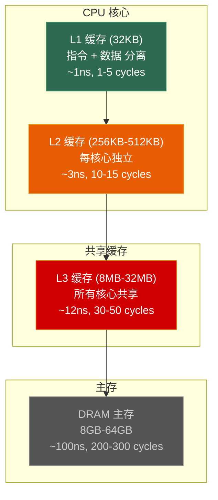
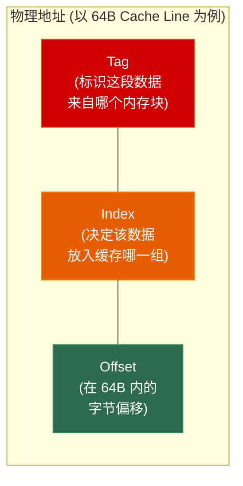
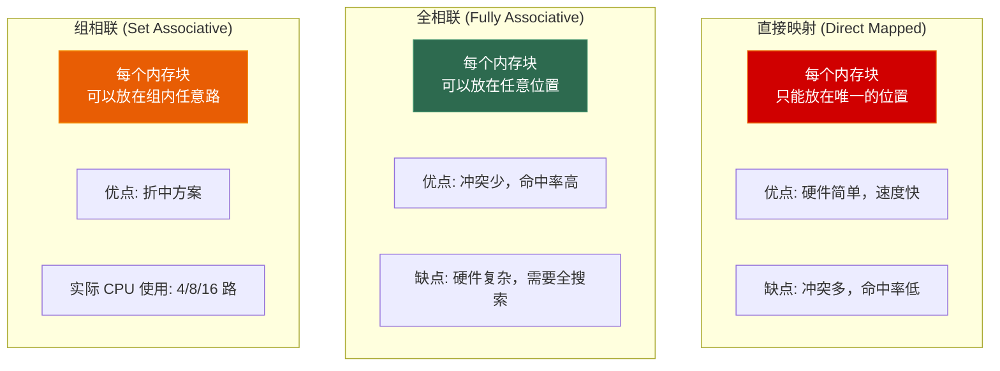
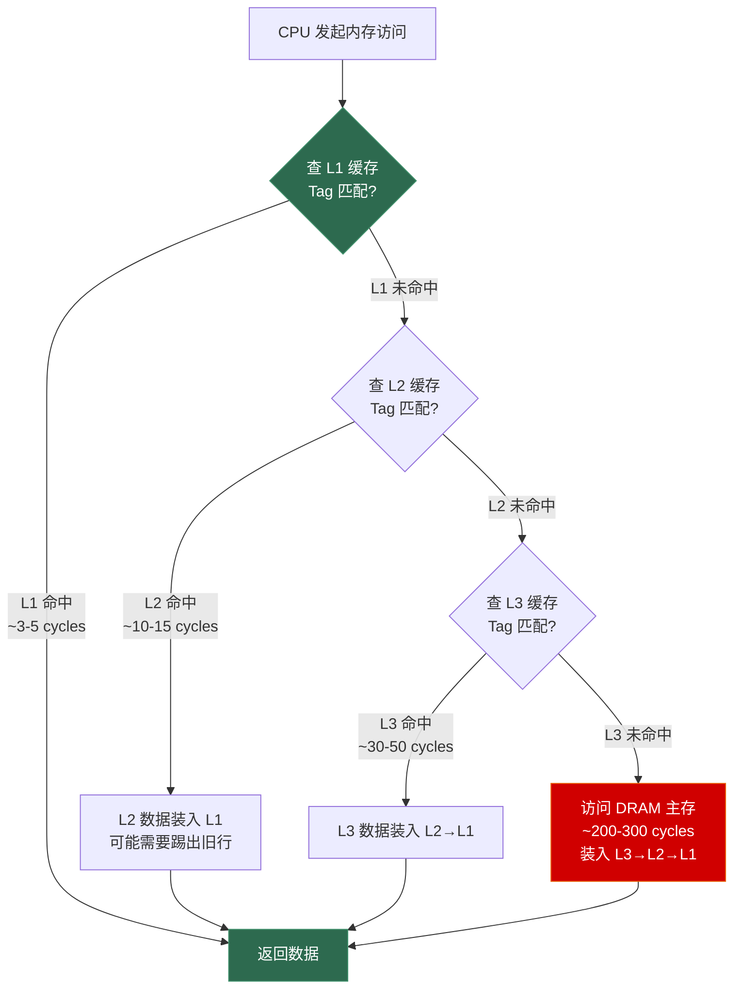
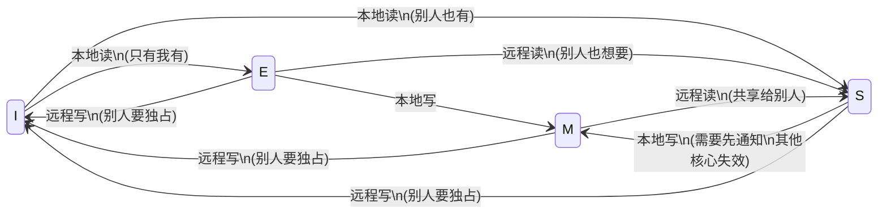
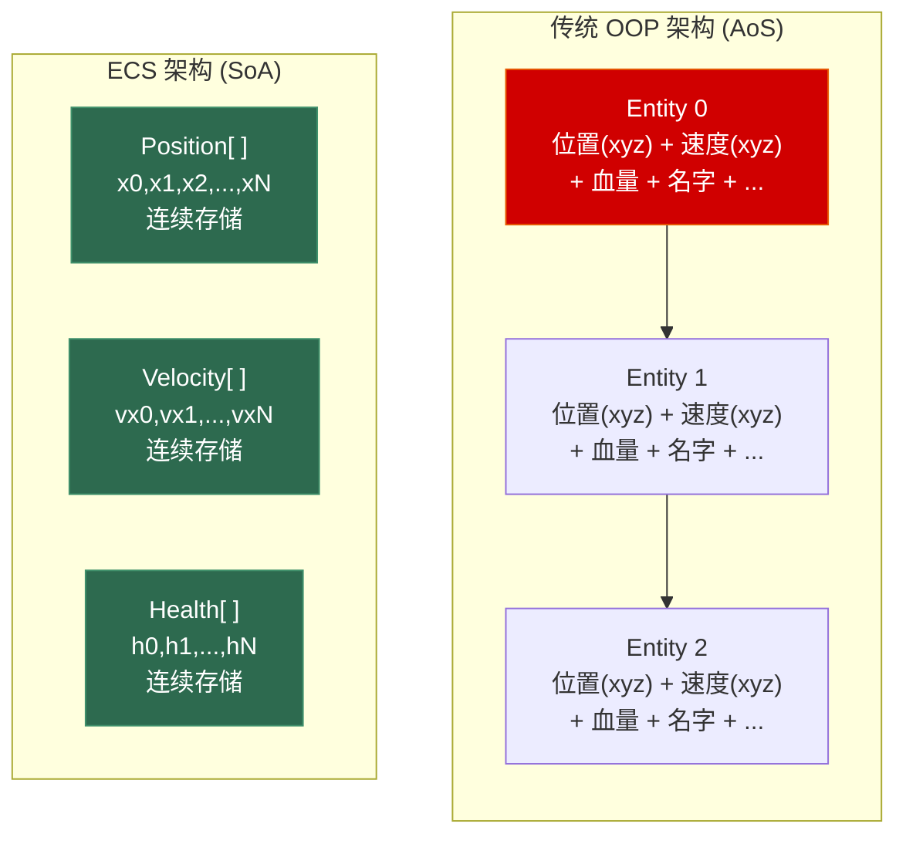

# 第四章 CPU 缓存与性能优化

> **一句话理解**：CPU 和内存之间有 ~300 倍的速度差。缓存是填平这个鸿沟的唯一手段。理解缓存如何工作，是写出高性能代码的硬件基础。

---

## 4.1 概念直觉 —— What & Why

### 为什么 CPU 需要缓存？

```
CPU 和内存的速度鸿沟（数量级对比）：

CPU 执行一条指令:  ~0.3ns  (3GHz, 1 cycle)
L1 缓存访问:       ~1ns    (3-5 cycles)
L2 缓存访问:       ~3ns    (10-15 cycles)
L3 缓存访问:       ~12ns   (30-50 cycles)
主存 (DRAM) 访问:  ~100ns  (200-300 cycles)

差距：访问主存比执行指令慢 ~300 倍。
```

问题来了——现代 CPU 每秒钟可以执行 30 亿条指令，但每秒钟只能从内存读取约 1 亿次数据。如果 CPU 每次都直接访问内存，绝大部分时间都在「等数据」，性能将惨不忍睹。

**缓存的解决方案**：在 CPU 和内存之间插入小而快的 SRAM，利用**时间局部性**和**空间局部性**，把经常用的数据保持在 CPU 附近。

```
时间局部性 (Temporal Locality)：刚被访问过的数据，很快会再次被访问。
  → 把最近访问的数据留在缓存中

空间局部性 (Spatial Locality)：访问了某个地址，附近地址很快也会被访问。
  → 每次以 Cache Line (64B) 为单位批量拉取
```

### 缓存层级金字塔



| 层级 | 典型大小 | 延迟 | 带宽 | 共享范围 |
|------|---------|------|------|---------|
| L1 数据缓存 | 32KB | ~1ns (3-5 cycles) | ~1TB/s | 每核心独享 |
| L1 指令缓存 | 32KB | ~1ns | ~1TB/s | 每核心独享 |
| L2 缓存 | 256KB-512KB | ~3ns (10-15 cycles) | ~500GB/s | 每核心独享 |
| L3 缓存 | 8MB-32MB | ~12ns (30-50 cycles) | ~200GB/s | 所有核心共享 |
| DRAM 主存 | 8GB-64GB | ~100ns (200-300 cycles) | ~50GB/s | 整个系统 |

> 💡 **面试中的表述**：「现代 CPU 通常有三级缓存。L1 最快但最小，分为指令缓存和数据缓存，每个核心独立。L2 略大稍慢，也是核心独立。L3 最大最慢，由所有核心共享。缓存的命中和未命中之间的性能差距可达数百倍，这是性能优化的最大杠杆点。」

---

## 4.2 原理图解

### Cache Line 的结构

CPU 从不逐字节访问内存——每次访问都是以 **Cache Line（缓存行）** 为单位。典型大小是 64 字节。



```
假设 64 位地址，L1 缓存 32KB，8 路组相联，64B Cache Line：

缓存总行数 = 32KB / 64B = 512 行
组数 = 512 / 8 = 64 组

地址拆分：
Offset:  log2(64)  = 6 位   → [5:0]
Index:   log2(64)  = 6 位   → [11:6]
Tag:     64 - 6 - 6 = 52 位 → [63:12]

CPU 查找流程：
1. 用 Index 定位到某一组（64 组之一）
2. 在该组的 8 路中，比较 Tag（并行比较 → 硬件实现）
3. 命中 → 用 Offset 取出 Cache Line 中的目标字节
4. 未命中 → 从下一级缓存或内存加载整个 Cache Line
```

### 缓存映射方式



```
现代 CPU 的缓存配置（以 Intel Core i7 为例）：

L1 数据缓存: 32KB, 8路组相联, 64B Cache Line
L1 指令缓存: 32KB, 8路组相联, 64B Cache Line
L2 缓存:     256KB, 4路组相联, 64B Cache Line
L3 缓存:     8MB, 16路组相联, 64B Cache Line

为什么都是组相联？
- 直接映射冲突太多：两个热数据映射到同一位置 → 互相踢出 → 抖动
- 全相联硬件太贵：需要同时比较所有 tag → 功耗和面积不可接受
- 组相联 = 在冲突率和硬件成本之间取平衡
```

### 缓存命中/未命中流程



### 写策略：Write-Through vs Write-Back

```
Write-Through (写穿)：
  写数据时，同时更新缓存和主存。
  优点: 缓存和主存永远一致（简单）
  缺点: 每次写都要等待主存 → 慢
  使用场景: 少量需要强一致性的场景

Write-Back (写回)：
  写数据时，只更新缓存，并标记 Cache Line 为 "Dirty"。
  只有当该 Cache Line 被踢出时，才写回主存。
  优点: 写操作很快（只写缓存）
  缺点: 多核间缓存一致性问题（需要 MESI 协议）
  使用场景: 现代 CPU 的默认策略

Write-Allocate vs No-Write-Allocate：
  Write-Allocate: 写未命中时，先加载 Cache Line，再修改（配合 Write-Back）
  No-Write-Allocate: 写未命中时，直接写主存，不加载缓存（配合 Write-Through）
```

---

## 4.3 底层机制剖析

### 4.3.1 Cache Line 的三大效应

#### 空间局部性的威力

```cpp
#include <chrono>
#include <vector>
#include <iostream>

// 测试：连续访问 vs 跳跃访问
constexpr int SIZE = 1024 * 1024 * 64;  // 64M 个 int = 256MB

void sequential_access(std::vector<int>& data) {
    long long sum = 0;
    for (int i = 0; i < SIZE; i++) {
        sum += data[i];          // 连续访问 → 每次 Cache Line 装 16 个 int
    }
}

void strided_access(std::vector<int>& data, int stride) {
    long long sum = 0;
    for (int i = 0; i < SIZE; i += stride) {
        sum += data[i];          // 跳跃访问 → 每个 Cache Line 只用 1 个 int
    }
}

// 结果 (Intel i7)：
// 连续访问:   ~10ms   (每个 Cache Line 16 次命中)
// stride=16:  ~10ms   (与连续相同——刚好每个 Cache Line 一个 int)
// stride=1:   ~10ms   (连续 = stride=1，最佳)
// stride=8:   ~20ms   (每 32B 一次访问，命中率 50%)
// stride=64:  ~50ms   (每次访问都在不同 Cache Line → 全部 miss)
```

#### 对齐对 Cache Line 的影响

```cpp
// ❌ 跨 Cache Line 访问——一次读触发两次缓存加载
struct Misaligned {
    char padding[60];
    int64_t value;  // 这个 value 跨了两个 Cache Line！
};

// ✅ 对齐到 Cache Line 边界
struct alignas(64) Aligned {
    char padding[60];
    int64_t value;  // 整个结构在一个 Cache Line 内
};
static_assert(sizeof(Aligned) % 64 == 0);

// 对于热路径上频繁访问的数据，对齐到 64 字节可以：
// 1. 保证一次加载不跨 Cache Line
// 2. 避免伪共享（见 4.3.3）
```

### 4.3.2 缓存一致性 —— MESI 协议

多核 CPU 中，每个核心有自己的 L1/L2 缓存。当核心 A 修改了某个地址的数据，核心 B 的缓存中对应的数据就「过期」了。MESI 协议用状态机来保证所有核心看到的数据一致。

```
MESI 四个状态：

M (Modified, 已修改)
  - 数据只在本核心的缓存中，且已被修改（Dirty）
  - 与主存不一致
  - 被踢出时必须写回主存

E (Exclusive, 独占)
  - 数据只在本核心的缓存中，但与主存一致（Clean）
  - 可以随时改为 M（写时不需要通知其他核心）

S (Shared, 共享)
  - 数据可能在多个核心的缓存中，且与主存一致（Clean）
  - 要改为 M 必须先通知其他核心失效（Invalidate）

I (Invalid, 失效)
  - 该 Cache Line 无效——数据已经过时了
```



**MESI 的消息类型**：

```
MESI 在核心之间传递四类消息：

1. BusRd (Bus Read): "我要读这个数据"
2. BusRdX (Bus Read Exclusive): "我要读并打算写这个数据"
3. BusUpgr (Bus Upgrade): "我有 S 状态的数据，现在要升为 M"
4. Flush (Writeback): "我要把 Dirty 数据写回主存"

核心之间通过总线嗅探 (Bus Snooping) 监视这些消息，
自动维护自身缓存的状态转移。
```

> 💡 **面试中的表述**：「MESI 是缓存一致性协议的经典实现。每个 Cache Line 有 Modified/Exclusive/Shared/Invalid 四种状态。当一个核心写一个 Shared 行时，必须先发 Invalidate 消息使其他核心的副本失效，然后才能修改。这个失效过程是有开销的——频繁的跨核心写会导致大量的缓存一致性流量，影响性能。」

### 4.3.3 伪共享 (False Sharing)

这是多核性能优化中最隐蔽也最常见的坑。

#### 什么是伪共享？

```
伪共享 (False Sharing)：
两个核心操作不同的变量，但这两个变量恰好落在同一个 Cache Line 中。
→ 核心 A 写变量 a → 核心 B 的 Cache Line 被标记为 Invalid
→ 核心 B 写变量 b → 核心 A 的 Cache Line 被标记为 Invalid
→ 两个变量逻辑上无关，但硬件上互相踢对方的缓存
→ 性能退化为类似单核！
```

```cpp
#include <atomic>
#include <thread>
#include <chrono>

// ❌ 伪共享版本
struct CounterPair_Bad {
    std::atomic<int64_t> counter_a{0};  // offset 0
    std::atomic<int64_t> counter_b{0};  // offset 8
    // counter_a 和 counter_b 在同一个 64B Cache Line 中！
    // 线程 A 写 counter_a → 线程 B 的整个 Cache Line 失效
    // 线程 B 写 counter_b → 线程 A 的整个 Cache Line 失效
};

// ✅ 避免伪共享版本
struct alignas(64) CounterPair_Good {
    std::atomic<int64_t> counter_a{0};   // offset 0-7
    // padding[56]  →  填充到 64 字节边界
    char _pad1[64 - sizeof(int64_t)];    // offset 8-63
    std::atomic<int64_t> counter_b{0};   // offset 64-71
    char _pad2[64 - sizeof(int64_t)];    // offset 72-127
    static_assert(sizeof(CounterPair_Good) == 128);
    static_assert(alignof(CounterPair_Good) == 64);
};

// C++17 标准方式
struct CounterPair_Modern {
    alignas(std::hardware_destructive_interference_size) 
        std::atomic<int64_t> counter_a{0};
    alignas(std::hardware_destructive_interference_size) 
        std::atomic<int64_t> counter_b{0};
};
```

**性能对比实测**：

```cpp
// 测试伪共享的性能影响
template<typename CounterPair>
void benchmark_false_sharing() {
    CounterPair counters;
    constexpr int ITER = 100'000'000;
    
    auto start = std::chrono::high_resolution_clock::now();
    
    std::thread t1([&]() {
        for (int i = 0; i < ITER; i++) {
            counters.counter_a.fetch_add(1, std::memory_order_relaxed);
        }
    });
    std::thread t2([&]() {
        for (int i = 0; i < ITER; i++) {
            counters.counter_b.fetch_add(1, std::memory_order_relaxed);
        }
    });
    
    t1.join();
    t2.join();
    
    auto end = std::chrono::high_resolution_clock::now();
    auto ms = std::chrono::duration_cast<std::chrono::milliseconds>(end - start).count();
    
    // 典型结果 (两核同时写)：
    // CounterPair_Bad:    ~3000ms  (伪共享 → MESI 协议来回失效)
    // CounterPair_Good:   ~400ms   (各自独立 Cache Line → 无干扰)
    // 性能差距 ~7.5x！
}
```

#### 如何检测伪共享？

```
工具检测：

1. Linux perf c2c (Cache-to-Cache)：
   $ perf c2c record ./my_program
   $ perf c2c report
   → 直接告诉你哪些地址有大量跨核心的缓存失效

2. perf stat 看硬件计数器：
   $ perf stat -e cache-misses,cache-references,L1-dcache-load-misses ./my_program

3. 直觉判断：
   - 两个线程频繁写不同变量，但性能不如预期
   - perf 显示大量 cache-misses 但逻辑上没有明显数据共享
   - 「该程序在多核上的加速比远低于核心数」
```

> 💡 **面试中的表述**：「伪共享是指两个不相关的变量落在同一 Cache Line 中，导致两个核心互相使对方的缓存失效。解决方法是用 `alignas(64)` 或 `std::hardware_destructive_interference_size` 将变量隔离到不同的 Cache Line，或用 padding 填充到 64 字节边界。」

### 4.3.4 分支预测 (Branch Prediction)

#### CPU 流水线

```
CPU 执行一条指令分多个阶段（经典 5 级流水线）：

┌──────┐  ┌──────┐  ┌──────┐  ┌──────┐  ┌──────┐
│ IF   │→ │ ID   │→ │ EX   │→ │ MEM  │→ │ WB   │
│取指令 │  │译码   │  │执行   │  │访存   │  │写回   │
└──────┘  └──────┘  └──────┘  └──────┘  └──────┘

每个时钟周期，5 条指令同时在流水线上的不同阶段。
理想情况：每周期完成 1 条指令（IPC = 1，超标量可 > 1）。

问题：遇到分支指令 (if/else/for/while) 时——
下一条该取哪条指令？需要等分支结果算出来才知道。
等待 = 流水线停顿 (Pipeline Stall) = 浪费硬件资源。
```

#### 分支预测器

```
CPU 用分支预测器来猜测分支结果，提前填充流水线：

1. 静态预测 (Static Prediction)
   - 向后跳转（循环）→ 预测跳转
   - 向前跳转（if/else）→ 预测不跳转
   - 简单但准确率低

2. 动态预测 (Dynamic Prediction)
   - BTB (Branch Target Buffer)：缓存分支目标地址
   - BHB (Branch History Buffer)：记录分支历史
   - 两级自适应预测器：根据过去 N 次的结果模式来预测
   
3. 现代 CPU 的预测器
   - 使用神经网络/感知器预测器
   - 预测准确率 > 95%

分支预测失败 (Branch Misprediction) 的代价：
→ 流水线中所有已取指但未完成执行的指令全部作废
→ 从正确路径重新取指
→ 典型代价：15-20 cycles
→ 最坏情况（如间接跳转，虚函数调用）：30+ cycles
```

#### 用代码帮助分支预测

```cpp
// ❌ 不可预测的分支——预测器无能为力
std::vector<int> data = generateRandomData();
int sum = 0;
for (int x : data) {
    if (x > 0) {           // 随机数据 → 分支结果随机
        sum += x;           // → 预测准确率 ~50%
    }                       // → 大量流水线冲刷
}

// ✅ 排序后——预测器可以学到规律
std::sort(data.begin(), data.end());
for (int x : data) {
    if (x > 0) {           // 先全是 false，然后全是 true
        sum += x;           // → 预测准确率 ~100%
    }                       // → 几乎没有冲刷
}

// 典型结果（100MB 数据）：
// 随机:  ~80ms  (50% mispredict → 大量冲刷)
// 排序:  ~30ms  (几乎 0 mispredict)
// 差距 ~2.5x——分支预测失败是真实的性能杀手
```

```cpp
// C++20 给编译器的分支提示
if (__builtin_expect(ptr != nullptr, 1)) {   // GCC/Clang
    // 大概率走这里
}

// C++20 属性
if (ptr != nullptr) [[likely]] {    // 大概率走这里
    process(ptr);
} else [[unlikely]] {               // 极少走这里
    handle_error();
}

// 编译器的优化：
// - [[likely]] 路径的代码放在紧邻位置（减少跳转）
// - [[unlikely]] 路径的代码放在函数的冷区域（不影响指令缓存）
```

#### 去除分支：无分支编程

```cpp
// ❌ 分支版本
int abs_branch(int x) {
    return x >= 0 ? x : -x;  // 有一个分支
}

// ✅ 无分支版本
int abs_branchless(int x) {
    int mask = x >> (sizeof(int) * 8 - 1);  // 算术右移：全0 或 全1
    return (x + mask) ^ mask;               // 位运算实现绝对值
}

// 在数据随机时，无分支版本比分支版本快 2-3 倍
// 但可读性差——只在热路径中使用
```

> 💡 **面试中的表述**：「分支预测失败会导致流水线冲刷，代价 15-20 cycles。优化手段：排序数据让分支有规律、用 `[[likely]]`/`[[unlikely]]` 告诉编译器优化布局、在热路径上用无分支编程用位运算替代 if/else。」

### 4.3.5 指令级并行 (ILP)

#### 超标量与乱序执行

```
指令级并行 (Instruction-Level Parallelism)：
CPU 同时在流水线中执行多条指令——前提是这些指令之间没有依赖。

超标量 (Superscalar)：
同一时钟周期发射多条指令到不同的执行单元。
例：Intel Core 可以同时执行 4 条整数指令 + 2 条浮点指令 + 2 条访存指令。

乱序执行 (Out-of-Order Execution)：
CPU 按顺序取指令，但不按顺序执行。
→ 遇到依赖时，后面的独立指令可以先执行
→ 通过寄存器重命名消除「假依赖」（WAR/WAW）
→ 重排序缓冲区 (ROB) 保证「看起来」是按顺序执行的

数据依赖的类型：
- RAW (Read After Write)：真依赖 → 必须等待
- WAR (Write After Read)：假依赖 → 寄存器重命名消除
- WAW (Write After Write)：假依赖 → 寄存器重命名消除
```

```cpp
// 依赖链 → 限制 ILP
float sum = 0;
for (int i = 0; i < N; i++) {
    sum += data[i];      // 每次加法都依赖前一次的结果
}                        // → 循环携带依赖 (Loop-Carried Dependence)
                         // → 无法并行，每周期最多完成一次加法

// 打破依赖链 → 利用 ILP
float sum1 = 0, sum2 = 0, sum3 = 0, sum4 = 0;
for (int i = 0; i < N; i += 4) {
    sum1 += data[i];     // 四条独立的加法链
    sum2 += data[i+1];   // 每条链之间没有依赖
    sum3 += data[i+2];   // → CPU 可以同时执行
    sum4 += data[i+3];   // → 接近 4x 吞吐量
}
float sum = sum1 + sum2 + sum3 + sum4;  // 最后合并

// 编译器优化标志：-funroll-loops 自动做循环展开
```

#### 内存依赖与 Store-Load Forwarding

```cpp
// Store-Load Forwarding：CPU 的又一优化
// 场景：刚写一个地址，紧接着读同一地址
void store_load(int* p, int x) {
    *p = x;          // Store
    int y = *p;      // Load —— 依赖刚写入的值
    use(y);
}

// 正常流程：Store → 等写入缓存 → Load 从缓存读
// 优化流程：Store → Store Buffer → Load 直接从 Store Buffer 获取
//          → 不需要等写完成；延迟从 ~10 cycles 降到 ~3 cycles

// 但 Store-Load Forwarding 有对齐要求：
// 如果 Store 和 Load 的地址不完全对齐（如 Store 4 字节，Load 8 字节）→ Forwarding 失败 → 额外延迟
```

---

## 4.4 面试高频题

**Q：什么是 Cache Line？大小一般是多少？**

> Cache Line 是 CPU 缓存与主存之间的最小传输单位。现代 x86 CPU 的 Cache Line 大小是 64 字节。每次缓存未命中时，CPU 会从主存加载连续的 64 字节，而不是只加载请求的 1-8 字节。这利用了空间局部性——相邻的数据很可能马上被访问。数据结构设计要尽量让热数据挤在同一 Cache Line 里，让冷数据远离。

**Q：什么是伪共享？怎么避免？**

> 伪共享是指两个核心修改的不同变量落在同一个 Cache Line 中，导致 MESI 协议互相使对方缓存失效。虽然逻辑上没有共享，但硬件上互相干扰，多核加速比大幅下降。解决方案：用 `alignas(64)` 或 `std::hardware_destructive_interference_size` 把变量放在不同 Cache Line，或者在变量之间加 64 字节的 padding。可用 `perf c2c` 工具检测。

**Q：什么是缓存一致性协议？MESI 怎么工作？**

> 缓存一致性协议保证多核 CPU 中各核心的缓存看到一致的数据。MESI 协议用四个状态：Modified（已修改，只有我有，dirty）、Exclusive（独占，只有我有，clean）、Shared（共享，多核心都有，clean）、Invalid（失效，数据过期）。核心之间通过总线嗅探监视彼此的操作，自动切换状态。核心要写 Shared 行时，必须先发 Invalidate 消息使所有其他副本失效。

**Q：为什么排序后的数组遍历比未排序的快？**

> 因为分支预测。如果数据随机，`if (x > 0)` 的走向不可预测，分支预测准确率只有 ~50%，一半的预测会失败导致 15-20 cycles 的流水线冲刷。排序后数据变得有规律——前面全是 false，后面全是 true——分支预测器可以学习这种模式，准确率接近 100%。这是经典的 StackOverflow 高票问题，核心是理解分支预测失败的代价。

**Q：代码中怎么利用缓存局部性提升性能？**

> 三个核心策略。第一，数据布局：用 SoA 替代 AoS，让同类型数据连续存放（遍历 x 坐标时，x 数组连续命中）；第二，访问模式：尽量顺序访问内存而非跳跃访问（`i++` 而非 `i+=stride`）；第三，时间局部性：把对同一数据的多次操作放在一起（不要「读-处理A-处理B-写」，而是「读-处理A-写-读-处理B-写」）。此外，用 `alignas(64)` 保证热数据不跨 Cache Line，用 padding 防止伪共享。

---

## 4.5 🎮 游戏实战场景

### 4.5.1 ECS 架构为什么快 —— SoA 与 Cache Line 的完美配合

ECS (Entity-Component-System) 是现代游戏引擎的主流架构模式。它的性能优势很大程度上来自缓存利用率。



#### 对比：AoS vs SoA 遍历性能

```cpp
// ===== AoS (Array of Structures) =====
struct Entity_AoS {
    float pos_x, pos_y, pos_z;     // 12B
    float vel_x, vel_y, vel_z;     // 12B
    float health;                   // 4B
    char name[32];                  // 32B
    int flags;                      // 4B
    // sizeof = 64B —— 刚好一个 Cache Line 一个 Entity
};

std::vector<Entity_AoS> entities(10000);

// 遍历所有实体的位置（如相机裁剪）
for (auto& e : entities) {
    e.pos_x += e.vel_x * dt;   // 访问 pos_x → 加载整个 64B Entity
    e.pos_y += e.vel_y * dt;   // 但 name[32]、flags 也被加载了——浪费！
    e.pos_z += e.vel_z * dt;   // 一个 Cache Line 只更新 12B 有效数据
}
// 缓存利用率 ~12/64 = 18.75%

// ===== SoA (Structure of Arrays) =====
struct MovementSystem {
    std::vector<float> pos_x;   // 每个数组独立、连续
    std::vector<float> pos_y;
    std::vector<float> pos_z;
    std::vector<float> vel_x;
    std::vector<float> vel_y;
    std::vector<float> vel_z;
} movement;

// 遍历所有位置
for (int i = 0; i < N; i++) {
    movement.pos_x[i] += movement.vel_x[i] * dt;  // pos_x 连续
}   // 一个 Cache Line (64B) 装 16 个 float！
    // → 16 次操作 1 次 cache miss

// 缓存利用率 ~100%
// 性能差距：遍历 100 万个实体时，SoA 比 AoS 快 ~4-6 倍
```

| 维度 | AoS (面向对象) | SoA (数据驱动 / ECS) |
|------|---------------|---------------------|
| 遍历单个属性 | 加载整个对象，大部分数据浪费 | 只加载需要的属性，100% 利用 |
| Cache Line 利用率 | 低（对象中有冷数据） | 高（按需加载） |
| SIMD 友好度 | 差（数据不连续） | 好（连续数据适合向量化） |
| 代码可读性 | 好（`entity.pos_x`） | 差（`pos_x[i]`） |
| 增删实体 | 简单 | 需要维护多个数组的同步 |

> 参见 [C++ Ch1 §1.5.4](../cpp_deep_dive/01_memory_model) 和 [数据结构 Ch1 §1.1](../data_structure/01_array) 对 SoA/AoS 的完整讨论。

```cpp
// 进一步优化：批处理 + SIMD
#include <xmmintrin.h>  // SSE

void update_positions_sse(std::vector<float>& px, 
                          const std::vector<float>& vx,
                          float dt, int count) {
    __m128 dt4 = _mm_set1_ps(dt);
    
    for (int i = 0; i < count; i += 4) {
        // 一次加载 4 个 float (16B = 128bit SSE 寄存器)
        __m128 pos = _mm_loadu_ps(&px[i]);
        __m128 vel = _mm_loadu_ps(&vx[i]);
        
        // 一次完成 4 个 pos += vel * dt
        pos = _mm_add_ps(pos, _mm_mul_ps(vel, dt4));
        
        _mm_storeu_ps(&px[i], pos);
    }
    // SoA 布局让 SIMD 可以直接使用——数据已连续排列
    // AoS 布局需要先 gather → 完全无法 SIMD 化
}
```

> 💡 **面试中的表述**：「ECS 架构的性能优势核心在于数据布局。传统 OOP 把不同属性打包在一个对象中（AoS），遍历单一属性时大部分 Cache Line 被浪费。ECS 把同类型组件连续存放（SoA），遍历时每个 Cache Line 满载有用数据，缓存利用率接近 100%，且天然适合 SIMD 向量化。这是「数据驱动设计」在硬件层面的体现——不是为了结构好看，是为了 Cache。」

### 4.5.2 伪共享在多线程物理引擎中的坑

```
场景：多线程物理引擎，每个 Worker 线程处理一组碰撞体。
每个碰撞体有自己的碰撞标志位（是否参与碰撞计算）。

struct CollisionBody {
    vec3 position;
    vec3 velocity;
    float radius;
    bool collision_enabled;   // ← 每个线程频繁修改自己负责的
    bool needs_update;         // ← 这两个 bool
};

假设 CollisionBody 大小 40B，16 个一组：
Worker 0 负责 body[0-15]   → 修改 body[0-15] 的标志位
Worker 1 负责 body[16-31]  → 修改 body[16-31] 的标志位

但 body[15] 和 body[16] 可能在同一 Cache Line！
→ Worker 0 写 body[15] → Worker 1 的 Cache Line 失效
→ Worker 1 写 body[16] → Worker 0 的 Cache Line 失效
→ MESI 协议来回跑 → 缓存一致性流量爆炸
→ 4 核物理引擎只有 1.5x 加速比（而不是预期的 4x）
```

**解决方案**：

```cpp
// 方案 1：把标志位移出碰撞体，单独存储
struct CollisionFlags {
    std::vector<bool> enabled;   // 所有碰撞体的 enabled 连续
    std::vector<bool> needs_update;
    
    // 按 Worker 分组，每个 Worker 处理连续的一段
    // Worker 之间不共享 Cache Line
};

// 方案 2：padding 到 Cache Line 边界
struct alignas(64) CollisionBody_CacheAligned {
    vec3 position;
    vec3 velocity;
    float radius;
    bool collision_enabled;
    bool needs_update;
    char _pad[64 - 3*sizeof(float)*2 - sizeof(float) - 2];  // 填充到 64B
};

// 方案 3：每个 Worker 用自己的本地标志位数组
// Worker 完成后一次性写回，而非在执行过程中反复跨核通信
```

> **面试原题**：「某个游戏引擎的碰撞检测系统在多核 CPU 上只有 2 倍加速（期望 4 倍），可能原因？」→ 伪共享、锁竞争、缓存一致性流量、任务粒度不均导致部分线程空转。

### 4.5.3 分支预测与游戏 AI 系统

#### 行为树的分支预测优化

```cpp
// 行为树节点——传统 OOP 实现
class BTNode {
public:
    virtual Status tick(Entity& e) = 0;  // 虚函数 → 间接跳转
};

// 行为树遍历
Status run_behavior_tree(Entity& entities[], int count) {
    for (int i = 0; i < count; i++) {
        // 每个 Entity 的行为树可能在不同节点
        // → tick() 是虚函数调用 → 间接跳转 → BTB 难以预测
        // → 每个 Entity 的分支预测都不同 → 大量 mispredict
        root->tick(entities[i]);
    }
}

// 优化方案：按行为状态对 Entity 分组 (Grouping by State)
enum class AIState { IDLE, PATROL, CHASE, ATTACK, FLEE };

struct AISystem_SoA {
    std::vector<Entity*> entities_by_state[5];  // 每种状态一个数组
    
    void update() {
        // 同状态的 Entity 在一起处理
        for (auto* e : entities_by_state[AIState::IDLE]) {
            updateIdle(e);    // 所有 IDLE 实体 → 分支预测 100% 命中
        }
        for (auto* e : entities_by_state[AIState::CHASE]) {
            updateChase(e);   // 所有 CHASE 实体 → 分支预测 100% 命中
        }
        // 而不是：for each entity → switch(state) → 预测率 ~20%
    }
};

// 效果：从 ~60% 分支预测准确率提升到 ~98%
// 游戏 AI 中 ~30% 的性能提升来自这种批处理分组
```

### 4.5.4 Prefetch 指令在粒子/动画系统中的应用

```cpp
#include <xmmintrin.h>  // _mm_prefetch

// 粒子更新——数据量大，遍历模式可预测
struct ParticleSystem {
    std::vector<float> pos_x, pos_y, pos_z;
    std::vector<float> vel_x, vel_y, vel_z;
    std::vector<float> life;
    
    void update(float dt, int count) {
        // 软件预取：提前把未来的数据拉入缓存
        constexpr int PREFETCH_DISTANCE = 16;  // 提前 16 个粒子
        
        for (int i = 0; i < count; i++) {
            // 在处理粒子 i 的同时，预取粒子 i+PREFETCH_DISTANCE 的数据
            int prefetch_idx = i + PREFETCH_DISTANCE;
            if (prefetch_idx < count) {
                _mm_prefetch((const char*)&pos_x[prefetch_idx], _MM_HINT_T0);
                _mm_prefetch((const char*)&vel_x[prefetch_idx], _MM_HINT_T0);
                // _MM_HINT_T0: 预取到所有级别缓存（L1/L2/L3）
                // _MM_HINT_T1: 预取到 L2 及以上（不要污染 L1）
                // _MM_HINT_T2: 预取到 L3 及以上
            }
            
            // 正常处理粒子 i（此时它的数据已在缓存中）
            pos_x[i] += vel_x[i] * dt;
            pos_y[i] += vel_y[i] * dt;
            pos_z[i] += vel_z[i] * dt;
            life[i] -= dt;
        }
    }
};

// 效果：在数据量超过 L2 缓存时，prefetch 可以减少 ~30% 的 cache miss
// 注意：prefetch 距离需要 tuning——
// 太近：来不及加载，等于没做
// 太远：可能踢出还在用的数据，反而变慢
```

```
游戏引擎中 Prefetch 的典型使用场景：

1. 粒子系统更新：遍历大量粒子，访问模式高度可预测
2. 骨骼动画计算：遍历骨骼层级，上级骨骼计算完马上需要下级
3. 蒙皮 (Skinning)：遍历所有顶点，每个顶点乘骨骼矩阵
4. 遮挡剔除 (Occlusion Culling)：遍历场景树，提前加载子树数据

经验法则：
- 遍历 > 1000 个元素的紧密循环 → 考虑 prefetch
- Prefetch 距离 = 缓存延迟 / 每次迭代耗时
  例：L2 延迟 ~12ns，每次迭代 ~3ns → distance ≈ 4
  但实际需要 profiling 确定最优值
```

### 4.5.5 实战案例：一个完整的缓存优化 Checklist

```
游戏性能优化的缓存视角清单：

☐ 1. 热路径数据对齐到 64 字节 (alignas(64))
     对象池中的对象、频繁修改的计数器

☐ 2. 多线程共享的结构检查伪共享
     用 perf c2c 检测，用 padding 修复

☐ 3. 数据结构选择 SoA 而非 AoS
     只有需要多个属性的场景用 AoS，否则 SoA

☐ 4. 数组遍历用连续索引
     for (int i = 0; i < N; i++) ✅
     for (auto* p = head; p; p = p->next) ❌ (链表)

☐ 5. 循环内部分支检查
     排序数据让分支有规律，或用分组批处理

☐ 6. 虚函数调用在热路径中谨慎
     间接跳转预测困难 → 考虑用 switch + 枚举替代虚函数

☐ 7. 大循环展开 4-8 次打破依赖链
     -funroll-loops 或手动展开

☐ 8. Prefetch 用于可预测的线性遍历
     profiling 确定距离和 hint 级别

☐ 9. 工作集大小适配缓存
     L1: 32KB → 频繁访问的数据集应 < 32KB
     L2: 256KB → 次频繁数据应 < 256KB
     超过 L3 的数据集 → 必然有大量 cache miss

☐ 10. 用 perf 验证
     perf stat -e cache-misses,cache-references,branch-misses ./program
```

---

## 4.6 30 秒速答

> 📋 以下是本章核心知识点的面试速答模板。每个回答控制在 30 秒内。

---

**Q：什么是 Cache Line？大小一般是多少？**

> Cache Line 是 CPU 缓存与内存之间传输的最小单位。x86 上是 64 字节。CPU 从不单独读一个字节——每次缓存未命中就加载连续的 64 字节。这意味着数据布局对性能影响巨大：连续访问 64 字节内的数据几乎零成本，但跨 Cache Line 的碎片访问会导致大量缓存未命中。

**Q：什么是伪共享？怎么避免？**

> 两个核心写不同变量，但它们在同一个 Cache Line 中。MESI 协议会来回使对方的缓存失效，性能退化为单核。用 `alignas(64)` 或 `std::hardware_destructive_interference_size` 把变量放到不同 Cache Line，或者在变量间填充 64 字节。Linux 上 `perf c2c` 可以精确检测伪共享的位置。

**Q：MESI 协议是怎么工作的？**

> 四个状态：Modified（只有我有，已修改）、Exclusive（只有我有，未修改）、Shared（多核心共享）、Invalid（已失效）。核心要写 Shared 行时必须先广播 Invalidate 让其他核心失效。MESI 通过总线嗅探自动维护状态转换，保证所有核心看到一致的数据。频繁的跨核写入会导致大量 Invalidate 消息——这就是伪共享慢的原因。

**Q：为什么排序后的数组遍历更快？**

> 分支预测。未排序的随机数据中 `if (x > 0)` 走向随机，预测准确率 50%，一半预测失败导致 15-20 cycles 流水线冲刷。排序后变成连续的 false 再连续的 true，分支预测器学到规律后准确率接近 100%，几乎没有冲刷。典型性能差距 2-3 倍。

**Q：ECS 架构为什么性能好？**

> 核心在于数据布局。ECS 把同类型组件连续存放（SoA），遍历时每个 Cache Line 装 16 个 float 全部有用——缓存利用率 100%。而传统 OOP 把不同属性打包在同一对象中（AoS），遍历单一属性时大部分 Cache Line 空间被无关数据浪费。SoA 还天然适合 SIMD 向量化，因为数据已经连续排列好了。

**Q：怎么利用缓存局部性优化代码？**

> 三个方面：空间局部性——用 SoA 和连续数组让遍历方向与内存布局一致；时间局部性——把对同一数据的多次操作聚合在一起；避免伪共享——多线程写的变量分开放到不同 Cache Line。此外，用 `[[likely]]` 帮助分支预测，用 prefetch 提前加载可预测的遍历数据。最终用 `perf stat` 验证 cache-miss 率下降。

---

> 📖 上一章：[第三章 内存管理](../03_memory_management) —— 虚拟内存、多级页表、TLB、页面置换算法、内存分配器与游戏引擎的分层内存架构。

> 📖 下一章：[第五章 进程调度](../05_process_scheduling) —— 调度算法、CFS、优先级反转、游戏主循环的调度策略。