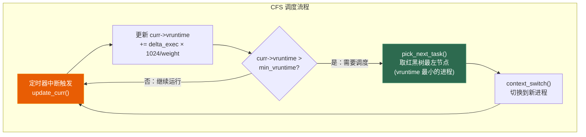
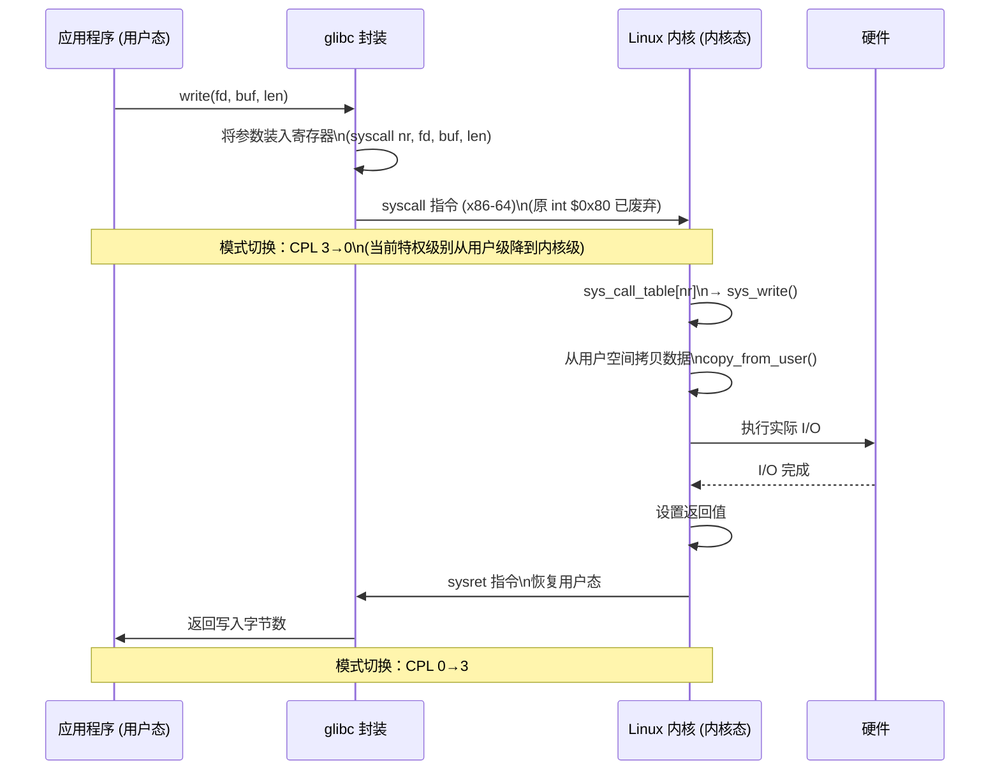

# 第五章 进程调度

> **一句话理解**：调度器的本质是在「公平」和「效率」之间做取舍。理解调度器如何选择下一个进程，是理解操作系统心跳的关键。

---

## 5.1 概念直觉 —— What & Why

### 调度的不可能三角

```
调度的三大目标：

    吞吐量 (Throughput)
   单位时间完成的作业数
         /\
        /  \
       /    \
      /      \
     /________\
响应时间              公平性 (Fairness)
(Response Time)      每个进程都有机会运行

三者不可兼得：
- 追求高吞吐 → 偏向短作业 → 长作业「饿死」→ 不公平
- 追求低延迟 → 频繁切换 → 上下文切换开销大 → 吞吐下降
- 追求绝对公平 → 一视同仁 → 交互进程得不到优先 → 响应差
```

### 抢占式 vs 非抢占式

| 维度 | 非抢占式 (Non-preemptive) | 抢占式 (Preemptive) |
|------|--------------------------|---------------------|
| **定义** | 进程主动放弃 CPU 才切换 | 调度器可以强制剥夺 CPU |
| **触发切换** | 进程结束 / 阻塞 / 主动 yield | 时间片耗尽 / 更高优先级进程就绪 |
| **响应时间** | 差（一个长进程卡死全部） | 好（保证时间片内响应） |
| **上下文切换开销** | 低（切换少） | 高（频繁切换） |
| **实现复杂度** | 简单 | 复杂（需要计时器中断） |
| **典型系统** | 早期批处理系统 | 现代通用 OS (Linux/Windows/macOS) |

```
为什么现代 OS 都选抢占式？

非抢占式的灾难场景：一个死循环进程
while (true) { }   →  如果非抢占，整个系统永远卡在这里

抢占式的保障：计时器中断
→ 时间片到期 → 硬件时钟中断 → 调度器强制切换
→ 即使进程不配合，系统也不会被卡死
```

---

## 5.2 原理图解

### 各经典调度算法的甘特图对比

以四个进程为例：P1(到达0, 执行8), P2(到达1, 执行4), P3(到达2, 执行9), P4(到达3, 执行5)

```mermaid
gantt
    title FCFS (先来先服务) —— 护航效应明显
    dateFormat X
    axisFormat %s
    
    section P1
    0-8    : 0, 8s
    section P2
    8-12   : 4s
    section P3
    12-21  : 9s
    section P4
    21-26  : 5s
```



```
FCFS 分析：
  平均等待时间 = (0 + 7 + 10 + 18) / 4 = 8.75
  问题：P1 是长进程 → 后面所有短进程都被挡住（护航效应 Convoy Effect）
```

```mermaid
gantt
    title SJF (最短作业优先) —— 理论最优平均等待
    dateFormat X
    axisFormat %s
    
    section P1
    0-1    : 1s
    section P2
    1-5    : 4s
    section P4
    5-10   : 5s
    section P3
    10-19  : 9s
```

```
SJF 分析（抢占式 SRTF）：
  时刻0: P1 开始
  时刻1: P2 到达，剩余 P1=7 > P2=4 → 抢占，P2 运行
  时刻2: P3 到达，P3=9 > P2剩余3 → 不抢占
  时刻3: P4 到达，P4=5 > P2剩余2 → 不抢占
  时刻5: P2 完成，选最短的 P4=5
  时刻10: P4 完成，选 P1剩余=7
  时刻17: P1 完成，选 P3=9

  平均等待时间 = (9 + 0 + 15 + 2) / 4 = 6.5（最优！）
  问题：需要预知执行时间——实际系统不可能精确知道
```

```mermaid
gantt
    title Round Robin (时间片=4) —— 响应时间保证
    dateFormat X
    axisFormat %s
    
    section P1
    0-4    : 4s
    section P2
    4-8    : 4s
    section P3
    8-12   : 4s
    section P4
    12-16  : 4s
    section P1
    16-20  : 4s
    section P3
    20-25  : 5s
    section P4
    25-26  : 1s
```

```
RR (时间片=4) 分析：
  平均等待时间 = (10 + 3 + 11 + 10) / 4 = 8.5
  平均响应时间 = (0 + 3 + 6 + 10) / 4 = 4.75（最短！）

  时间片选择的权衡：
  时间片太大 → 退化为 FCFS，响应差
  时间片太小 → 上下文切换开销占比过高
  
  经验法则：时间片略大于典型交互时间（~10-100ms）
  实际 Linux CFS：动态计算，通常 0.75ms ~ 6ms
```

```mermaid
gantt
    title MLFQ (多级反馈队列) —— 实际系统的主力方案
    dateFormat X
    axisFormat %s
    
    section Q1(8ms)
    0-8    : 8s
    section Q2(16ms)
    8-16   : 8s
    section Q3(32ms)
    16-24  : 8s
```

```
MLFQ 规则（简化版）：
┌─────────────────────────────────────────────┐
│  规则1: 优先级高的队列先运行                   │
│  规则2: 同优先级队列内，时间片轮转              │
│  规则3: 新进程进入最高优先级队列                │
│  规则4: 用完时间片未完成 → 降级到下一级          │
│         时间片用完前主动放弃 → 保持当前级别       │
│  规则5: 定期把所有进程提升回最高优先级           │
│         （防止长进程永久饿死——Priority Boost）   │
└─────────────────────────────────────────────┘

为什么 MLFQ 优秀？
- 短进程快速完成（在高优先级队列就搞定了）
- 长进程在后台慢慢跑（被降级到低优先级）
- I/O 密集型自动留在高优先级（没到时间片就阻塞了）
- CPU 密集型自动降到低优先级（每次都耗尽时间片）
→ 不需要预知进程类型，自适应！
```

---

## 5.3 底层机制剖析

### 5.3.1 经典调度算法深入

#### FCFS 与护航效应

```
护航效应 (Convoy Effect)：
一个 CPU 密集型长进程先到达，占着 CPU 不放。
后面所有 I/O 密集型短进程排队等待。
→ CPU 利用率和 I/O 设备利用率都很低
  （长进程用 CPU 时 I/O 空闲；短进程等 CPU 时 I/O 也空闲）
→ 就像公路上被一辆慢车挡住的车队

教训：纯 FCFS 在现代交互式系统中不可用
```

#### Round Robin 时间片的计算

```cpp
// 时间片选择的数学模型
// 设上下文切换开销 = S（通常 1-10μs）
// 时间片 = Q

// 如果 Q 太小：
//   切换次数 = 总执行时间 / Q
//   总切换开销 = S × 总执行时间 / Q
//   有效 CPU 利用率 = (Q / (Q + S)) × 100%

// 例：Q = 1ms, S = 10μs
//   利用率 = 1000 / (1000 + 10) = 99%
//   看起来不错，但上下文切换的间接成本（缓存污染）远大于 10μs

// 如果 Q 太大：
//   响应时间 ≈ Q × 进程数
//   例：Q = 100ms, 10 个进程
//   最差响应时间 ≈ 900ms → 对交互来说太慢了

// Linux CFS 的解决方案：
//   不设固定时间片，而是动态计算
//   target_latency = 6ms × log2(nr_running)
//   min_granularity = 0.75ms
//   时间片 = max(target_latency / nr_running, min_granularity)
```

#### MLFQ 的参数调优

```
MLFQ 的实际参数（以 FreeBSD 为例）：

队列数：      3-4 级
时间片倍增：  8ms → 16ms → 32ms → 64ms
Boost 周期：  1 秒（把所有进程拉回最高优先级）

Solaris 的变体：
  队列数：    60 级（0-59）
  前 10 级给实时进程，后 50 级给普通进程
  时间片：    20ms ~ 200ms，每降一级时间片翻倍
  Boost：     每 1 秒（通过一张表，将优先级重新计算）

Linux CFS：  不用 MLFQ，用红黑树 + vruntime（见 5.3.2）
```

### 5.3.2 Linux CFS (Completely Fair Scheduler)

CFS 是 Linux 从 2.6.23（2007 年）开始使用的默认调度器。它抛弃了传统的固定时间片和优先级队列，转而使用一个核心概念：**vruntime（虚拟运行时间）**。

#### vruntime 的核心思想

```
CFS 的核心理念：
「理想情况下，每个进程应该获得完全相等的 CPU 时间。」

但实际不可能——CPU 只有一个，切换有开销。

CFS 的解决方案：
用 vruntime（虚拟运行时间）追踪每个进程「实际获得了多少 CPU 时间」。
每次调度时，选择 vruntime 最小的进程运行。
→ 保证长期的公平性

vruntime 的计算：

  实际运行时间   ×   (nice_0 的权重 / 当前进程的权重)
  
  = 实际运行时间   ×   1024 / weight

  权重映射表（nice → weight）：
  nice  -20: weight=88761   (最高优先级)
  nice  -10: weight=11056
  nice    0: weight=1024    (默认)
  nice    5: weight=335
  nice   10: weight=110
  nice   19: weight=15      (最低优先级)

  关键：nice 0 的进程运行 1ms → vruntime += 1ms
        nice 5 的进程运行 1ms → vruntime += 3.06ms（更快增长）
        nice -5 的进程运行 1ms → vruntime += 0.33ms（更慢增长）

  权重差 10% → CPU 份额差 ~10%（不是按 nice 差值线性映射）
```

#### 红黑树实现 O(log n) 调度

```cpp
// CFS 调度器的核心数据结构（简化）
struct sched_entity {
    u64                 vruntime;          // 虚拟运行时间（排序 key）
    u64                 exec_start;        // 开始执行的时间戳
    u64                 sum_exec_runtime;  // 累计实际运行时间
    struct rb_node      run_node;          // 红黑树节点
};

struct cfs_rq {  // CFS Run Queue (每个 CPU 有一个)
    struct rb_root_cached  tasks_timeline; // 红黑树，按 vruntime 排序
    u64                    min_vruntime;   // 当前最小 vruntime
    unsigned int           nr_running;     // 就绪进程数
    struct sched_entity*   curr;           // 当前运行的进程
};
```



```
CFS 调度的时间复杂度：

插入就绪进程：  O(log n)  — 插入红黑树
删除就绪进程：  O(log n)  — 从红黑树删除
选取下一个：    O(1)      — 取最左节点（缓存）
更新 vruntime： O(log n)  — 更新后需要调整位置

对比传统 O(n) 轮询就绪队列：
  64 个进程时 log2(64)=6 vs 64 → 10x 差距
  1024 个进程时 log2(1024)=10 vs 1024 → 100x 差距
```

#### CFS 对交互进程的优化

```
问题：交互进程（如文本编辑器）的特点——
  大部分时间在睡眠（等用户输入），偶尔醒来需要快速响应
  如果醒了被排在有大量 vruntime 积累的 CPU 密集型进程后面
  → 用户感觉卡顿

CFS 的优化策略：

1. 唤醒进程的 vruntime 补偿
   进程睡眠时，它的 vruntime 不变（不增长）
   其他进程在运行，vruntime 持续增长
   → 睡眠进程醒来时 vruntime 天然就是最小的之一
   → 自动获得优先调度！
   
2. min_vruntime 追踪
   新进程醒来时，vruntime 设为 max(自身vruntime, min_vruntime - 阈值)
   → 不会因为 vruntime 太小而霸占 CPU（防止「睡眠越久优先级越高」的极端情况）

3. sched_wakeup_granularity
   进程唤醒后，如果 vruntime 比当前进程小很多
   → 不一定立即抢占
   → 只有当差距 > sched_wakeup_granularity(默认 1ms) 时才抢占
   → 避免频繁的上下文切换
```

#### nice 值的权重表

| nice | 权重 (weight) | 相对 CPU 份额 (单进程) | 典型场景 |
|------|-------------|----------------------|---------|
| -20 | 88761 | ~87% | 最高优先级（几乎不用于普通进程） |
| -10 | 11056 | ~11% | 音频处理、视频编码 |
| -5 | 3121 | ~3% | 需要优先响应的后台服务 |
| 0 | 1024 | ~1% | 默认值，绝大多数进程 |
| 5 | 335 | ~0.33% | 低优先级后台任务 |
| 10 | 110 | ~0.11% | 批处理、数据同步 |
| 19 | 15 | ~0.015% | 最低优先级（SETI@home 类） |

> 💡 **面试中的表述**：「CFS 的核心思想是 vruntime——用虚拟运行时间来度量每个进程获得的 CPU 份额。每次调度选 vruntime 最小的进程，用红黑树实现 O(log n) 插入和 O(1) 选取。nice 值通过权重映射到 vruntime 增长速率——nice 值越高，vruntime 增长越快，被调度的机会越少。」

### 5.3.3 实时调度

#### Linux 的三种实时调度策略

```
Linux 支持的实时调度策略：

SCHED_FIFO (先进先出实时)
  - 没有时间片
  - 高优先级实时进程运行直到阻塞或主动放弃
  - 同优先级按 FIFO 顺序
  - 优先级范围：1-99

SCHED_RR (轮转实时)
  - 类似 SCHED_FIFO，但同优先级之间时间片轮转
  - 时间片默认 100ms
  - 优先级范围：1-99

SCHED_DEADLINE (截止时间调度, Linux 3.14+)
  - 每个进程声明：运行时间(预算) + 周期 + 截止时间
  - 内核用 EDF (Earliest Deadline First) 算法调度
  - 做准入控制（如果总利用率 > 100%，拒绝加入）
  - 最强实时性保证

优先级规则：
  SCHED_DEADLINE > SCHED_FIFO/RR > SCHED_NORMAL(CFS)
  即：任何实时进程都优先于所有普通进程
```

#### 硬实时 vs 软实时

```
硬实时 (Hard Real-Time)：
  错过截止时间 → 系统失败（可能造成物理损坏）
  例：汽车刹车系统、飞机飞控、心脏起搏器
  需要：确定性的响应时间保证
  手段：RTOS (VxWorks, QNX)，或 Linux + PREEMPT_RT 补丁

软实时 (Soft Real-Time)：
  错过截止时间 → 体验降级，但系统仍可运行
  例：音频播放（偶尔爆音可接受）、视频帧率（偶尔掉帧可接受）、游戏
  需要：统计意义上的低延迟
  手段：标准 Linux 的 SCHED_FIFO/SCHED_RR 通常足够
```

```
面试常问：游戏引擎的主循环需要实时调度吗？

答案：通常不需要，但有例外。

1. 主循环（Update + Render）—— 不需要实时调度
   游戏主循环的目标是稳定的帧率（16ms/33ms），
   但有偶发的长帧（如加载资源）是设计上可接受的。
   用普通优先级 + 足够的时间片即可。
   
   画蛇添足：如果把主循环设为 SCHED_FIFO 且陷入死循环
   → 整个系统卡死，连 SSH 都连不进去！

2. 音频回调线程 —— 需要实时调度
   音频缓冲区通常只有 5-10ms，
   如果被其他进程抢占超过缓冲区大小 → 爆音
   → 需要 SCHED_FIFO + 高优先级

3. 物理模拟线程 —— 看情况
   如果物理 tick 频率固定且不可延迟（如格斗游戏的帧同步）
   → 需要实时调度
   如果物理可以有弹性（如单机 RPG）→ 普通调度即可
```

### 5.3.4 中断与系统调用

#### 中断的分类

```
中断的三种类型：

1. 硬件中断 (Hardware Interrupt)
   - 由外部设备触发
   - 异步于 CPU 执行
   - 例：键盘按下、网络包到达、时钟中断
   - 通过中断控制器 (APIC) 路由到 CPU
   - 每个中断有中断号 → 中断向量表 → 中断处理程序

2. 软中断 (Softirq / Tasklet)
   - 由内核代码触发（软件产生）
   - 用于将非紧急的工作从硬中断处理程序推迟
   - 例：网络包处理（硬中断只收包，软中断做协议栈处理）
   - 可被硬中断打断，但不能被同类型软中断打断

3. 异常 (Exception)
   - 由 CPU 执行指令时触发
   - 同步于指令执行
   - 例：除零、缺页中断、非法指令、断点
   - 处理方式：IDT (Interrupt Descriptor Table)
```

#### 系统调用的完整流程



#### 系统调用的开销

```
系统调用的成本拆分：

1. 直接成本（模式切换）：
   - 保存用户态寄存器（通用、浮点、SIMD）
   - 切换栈（用户栈 → 内核栈）
   - 修改 CPU 特权级别
   - 跳转到内核入口点
   - 返回时反向操作
   → 典型开销：~100-200 cycles

2. 间接成本（缓存污染）：
   - TLB 刷新（部分 CPU）
   - 指令缓存污染（内核代码替换了用户代码）
   - 数据缓存污染（内核数据替换了用户数据）
   - 分支预测器状态丢失
   → 典型开销：额外 ~50-200 cycles

总计：一次空的 getpid() 调用约 ~150-300 cycles
      一次 read() 取决于 I/O 设备的实际延迟

减少系统调用的手段：
- 缓冲 I/O (stdio)：把多次 write 合并为一次
- 批量操作：sendmmsg() 一次发多个网络包
- io_uring：通过共享内存环形缓冲区提交/完成 I/O
```

### 5.3.5 优先级反转

这是调度领域中**最著名的真实 bug**，发生在 NASA 的 Mars Pathfinder 探测器上。

#### 问题定义

```
优先级反转 (Priority Inversion)：
一个高优先级进程在等待一个低优先级进程持有的锁，
而低优先级进程被一个中优先级进程抢占，
导致高优先级进程被无限期阻塞。

          优先级: H (高) > M (中) > L (低)

时刻0:  L 获得锁
时刻1:  H 就绪，抢占 L
时刻2:  H 试图获取 L 持有的锁 → 阻塞
时刻3:  L 继续运行（释放锁需要 L 完成临界区）
时刻4:  M 就绪，抢占 L（因为 M > L）
时刻5:  M 长时间运行 ... → H 被 M 阻塞（虽然 H 优先级最高！）
        ↑ H 等待 L 释放锁，但 L 被 M 抢占 → L 永远得不到 CPU → 死锁
```

#### Mars Pathfinder 真实案例 (1997)

```
Mars Pathfinder (火星探路者) 的优先级反转 bug：

系统组成：
- 高优先级总线管理线程 (SCHED_FIFO)
- 中优先级通信线程
- 低优先级气象数据采集线程

触发场景：
1. 低优先级线程获得一个互斥锁（保护共享总线数据）
2. 高优先级线程尝试获取同一个锁 → 阻塞
3. 中优先级通信线程长时间运行
4. 低优先级线程得不到 CPU → 锁永远无法释放
5. 高优先级线程超时 → 系统判定总线故障 → 触发安全重启
6. 探测器自动重启 ← 地球上的工程师发现：「系统在火星上莫名其妙重启！」

解决方案：
启用优先级继承 (Priority Inheritance)
→ 当高优先级线程等待低优先级线程的锁时
→ 临地把低优先级线程提升到高优先级
→ 低优先级线程快速完成临界区 → 释放锁 → 高优先级线程继续
→ 中优先级线程无法抢占（因为 L 已经提升到 H 的优先级）

这个故事在面试中堪称「必讲案例」——它完美说明了：
1. 理论问题（优先级反转）如何导致真实的 bug
2. 优先级继承如何优雅解决问题
3. 为什么调度器设计需要考虑同步原语的交互
```

#### 解决方案对比

```
方案 1：优先级继承 (Priority Inheritance)
  ┌────────────────────────────────────────────┐
  │ 持有锁的进程临时继承等待者的优先级（取最高）    │
  │                                             │
  │ 优点: 简单，Linux 内核默认使用                 │
  │       pthread_mutex 可通过 PTHREAD_PRIO_     │
  │       INHERIT 属性启用                        │
  │ 缺点: 可能有连锁继承（A 等 B 的锁，B 等 C 的锁）│
  │       实现复杂度 O(等待链深度)                  │
  └────────────────────────────────────────────┘

方案 2：优先级天花板 (Priority Ceiling)
  ┌────────────────────────────────────────────┐
  │ 每个锁设置一个「天花板优先级」                  │
  │ = 所有可能使用此锁的线程中的最高优先级           │
  │ 线程获取锁时，立即提升到天花板优先级             │
  │                                             │
  │ 优点: 提前预防，不会发生反转                    │
  │       死锁预防（不会出现循环等待）               │
  │ 缺点: 可能过度提升（线程可能不需要那么高的优先级） │
  │       需要预先知道哪些线程会使用这个锁            │
  └────────────────────────────────────────────┘

方案 3：禁用中断 / 抢占
  ┌────────────────────────────────────────────┐
  │ 在临界区内关中断或禁止抢占                     │
  │                                             │
  │ 优点: 最彻底（根本不会有调度）                  │
  │ 缺点: 只适用于极短的临界区                     │
  │       可能影响系统实时性                       │
  │       用户态无法使用（只有内核可以用）            │
  └────────────────────────────────────────────┘
```

---

## 5.4 面试高频题

**Q：常见的进程调度算法有哪些？各有什么特点？**

> FCFS 最简单，但护航效应导致短作业被长作业阻塞。SJF/SRTF 理论最优，但需要预知执行时间。Round Robin 公平且响应时间可控，核心是时间片的选取——太大退化为 FCFS，太小上下文切换开销过高。优先级调度灵活但可能出现饿死和优先级反转。MLFQ 结合了以上所有优点：短作业快速完成、长作业后台运行、I/O 密集型自动获得高优先级——现代调度器的范式。

**Q：什么是 CFS？怎么保证公平的？**

> CFS 是 Linux 的默认调度器，核心是 vruntime（虚拟运行时间）。每个进程运行时 vruntime 增长，增长速度与 nice 值成正比（nice 越高增长越快）。调度时选取 vruntime 最小的进程——保证长期来看每个进程获得按权重比例的 CPU 时间。用红黑树维护所有就绪进程，取出最小 vruntime 是 O(1)，插入/更新是 O(log n)。交互进程因为经常睡眠，vruntime 天然保持较低，醒来自动获得优先调度。

**Q：什么是优先级反转？怎么解决？**

> 高优先级进程在等低优先级进程的锁，而低优先级进程被中优先级进程抢占，导致高优先级进程被中优先级间接阻塞。经典案例是 Mars Pathfinder——探测器在火星上因优先级反转不断重启。解决方案：优先级继承——持有锁的低优先级进程临时继承等待者的高优先级；优先级天花板——获取锁时立即提升到所有可能使用者中的最高优先级。

**Q：什么是中断？系统调用和中断的区别？**

> 中断是让 CPU 暂停当前执行流、转而处理突发事件的一种机制。分为三类：硬件中断（外部设备触发，异步）、软中断（内核代码触发，用于推迟非紧急工作）、异常（指令执行触发，如缺页/除零，同步）。系统调用是用户态程序主动请求内核服务的方式，通过 syscall 指令触发——它本质上是一种「主动的异常」。区别在于：中断是外部/异步的，系统调用是程序主动/同步的。

**Q：用户态和内核态有什么区别？怎么切换？**

> 用户态（Ring 3）只能访问受限的地址空间（用户空间），不能执行特权指令（如修改页表、关中断）。内核态（Ring 0）可以访问全部内存和所有硬件。切换发生在三种情况：系统调用（程序主动请求）、中断（外部设备触发）、异常（指令执行出错）。切换时 CPU 保存用户态寄存器、切换栈、修改 CPL 特权级别、跳转到内核入口——典型开销 100-200 cycles。

---

## 5.5 🎮 游戏实战场景

### 5.5.1 游戏主循环的三种步长策略

这是游戏引擎设计中最基础的决策之一：每一帧的时间步长怎么定义。

```cpp
// 策略 1：固定步长 (Fixed Timestep)
// 适用：确定性要求高的游戏（格斗、RTS 录像回放、帧同步网络游戏）
class GameLoop_Fixed {
    constexpr static double TICK_RATE = 1.0 / 60.0;  // 16.67ms
    
    void run() {
        auto previous = clock::now();
        double lag = 0.0;
        
        while (running) {
            auto current = clock::now();
            double elapsed = std::chrono::duration<double>(current - previous).count();
            previous = current;
            lag += elapsed;
            
            while (lag >= TICK_RATE) {
                fixedUpdate(TICK_RATE);  // 固定步长更新
                lag -= TICK_RATE;
            }
            
            render(lag / TICK_RATE);  // 插值渲染
        }
    }
    
    // 优点：确定性（replay 可以精确复现）
    //       网络同步友好
    //       物理模拟稳定
    // 缺点：如果机器性能不够 → 追赶螺旋 (Death Spiral)
    //       一帧做不完 → lag 累积 → 下一帧更做不完
};

// 策略 2：可变步长 (Variable Timestep)
// 适用：对确定性要求不高的游戏（多数单机游戏）
class GameLoop_Variable {
    void run() {
        auto previous = clock::now();
        
        while (running) {
            auto current = clock::now();
            double dt = std::chrono::duration<double>(current - previous).count();
            previous = current;
            
            // 防止大 delta（如调试断点后）
            dt = std::min(dt, 0.1);  // 上限 100ms
            
            update(dt);   // 用实际 delta 时间更新
            render();
        }
    }
    
    // 优点：简单
    //       不会追赶
    // 缺点：物理不稳定（不同帧率的物理结果不同）
    //       网络同步困难
};

// 策略 3：半固定步长 (Semi-Fixed Timestep)
// 适用：大多数现代游戏引擎（UE5, Unity）
class GameLoop_SemiFixed {
    constexpr static double FIXED_DT = 1.0 / 60.0;
    constexpr static int MAX_UPDATES = 5;  // 最多追赶 5 帧
    
    void run() {
        auto previous = clock::now();
        double accumulator = 0.0;
        
        while (running) {
            auto current = clock::now();
            double frame_time = std::chrono::duration<double>(current - previous).count();
            previous = current;
            
            // 防止螺旋
            frame_time = std::min(frame_time, 0.25);  // 帧率不低于 4fps
            
            accumulator += frame_time;
            
            int updates = 0;
            while (accumulator >= FIXED_DT && updates < MAX_UPDATES) {
                fixedUpdate(FIXED_DT);   // 物理用固定步长
                accumulator -= FIXED_DT;
                updates++;
            }
            
            // 如果追不上，丢弃多余的累积（避免螺旋）
            if (updates >= MAX_UPDATES) {
                accumulator = 0.0;
            }
            
            double alpha = accumulator / FIXED_DT;  // 插值因子
            render(alpha);
        }
    }
    
    // 优点：物理确定 + 防追赶螺旋
    // 缺点：略微复杂
};
```

```
三种策略的选择指南：

              确定性要求
             高 ─────────── 低
              │              │
         固定步长        半固定步长      可变步长
      (格斗/帧同步)     (主流3A)      (休闲游戏)
              │              │              │
         物理稳定          最佳平衡        实现简单
         网络友好          UE5/Unity      物理不稳定
         但可能追杀        默认方案        不适合联网
```

### 5.5.2 vsync 与操作系统调度的交互

```
vsync (垂直同步) 和调度的经典冲突：

场景：60Hz 显示器，游戏引擎目标 60fps

帧循环 1（理想情况）：
  [----Update 8ms----][--Render 6ms--][等 vsync 2.67ms][--Present--]
                                                ↑ 
                                          Sleep(1) 或忙等

帧循环 2（Sleep 精度问题）：
  [----Update 12ms----][--Render 3ms--][Sleep(1) 实际睡了 5ms]
  → Present 延迟 → 错过 vsync → 等下一个 vsync → 掉到 30fps！
  
  Windows 默认时钟分辨率：15.6ms (64Hz)
  Sleep(1) 的实际精度：1-16ms 不等
  
  解决方案：
  1. timeBeginPeriod(1) → 将系统时钟分辨率提升到 1ms
     → Sleep(1) 精度提升到 1-2ms
     → 代价：增加系统功耗（CPU 更频繁被唤醒）
     
  2. 不用 Sleep，用忙等 (Busy Wait)：
     while (remaining > 0) {
         if (remaining < 100us) {
             // 最后 100us 用忙等（精确但不费电太久）
             while (clock::now() < target) { _mm_pause(); }
         } else {
             Sleep(0);  // 或 Sleep(1)
             remaining = target - clock::now();
         }
     }

  3. 使用高精度可等待定时器：
     Windows: CreateWaitableTimerEx (高精度)
     Linux:   timerfd_create + epoll
```

### 5.5.3 高精度计时器

```cpp
// Windows 高精度计时器
class Timer_Windows {
    LARGE_INTEGER _frequency;
    LARGE_INTEGER _start;
    
public:
    Timer_Windows() {
        QueryPerformanceFrequency(&_frequency);  // 通常是 10MHz
        QueryPerformanceCounter(&_start);
    }
    
    double elapsed_ms() {
        LARGE_INTEGER now;
        QueryPerformanceCounter(&now);
        return (now.QuadPart - _start.QuadPart) * 1000.0 / _frequency.QuadPart;
    }
    
    double elapsed_us() {
        LARGE_INTEGER now;
        QueryPerformanceCounter(&now);
        return (now.QuadPart - _start.QuadPart) * 1'000'000.0 / _frequency.QuadPart;
    }
    
    // 精度：通常 < 1μs
    // 开销：~20-50ns（读取 TSC 寄存器）
};
```

```cpp
// Linux 高精度计时器
class Timer_Linux {
    timespec _start;
    
public:
    Timer_Linux() {
        clock_gettime(CLOCK_MONOTONIC, &_start);  // 单调时钟，不受系统时间调整影响
    }
    
    double elapsed_ms() {
        timespec now;
        clock_gettime(CLOCK_MONOTONIC, &now);
        return (now.tv_sec - _start.tv_sec) * 1000.0
             + (now.tv_nsec - _start.tv_nsec) / 1'000'000.0;
    }
    
    double elapsed_ns() {
        timespec now;
        clock_gettime(CLOCK_MONOTONIC, &now);
        return (now.tv_sec - _start.tv_sec) * 1'000'000'000.0
             + (now.tv_nsec - _start.tv_nsec);
    }
    
    // CLOCK_MONOTONIC：不受 NTP 校准影响，用于测量时间间隔
    // CLOCK_REALTIME：  墙上时钟，可被 NTP 调整
    // CLOCK_THREAD_CPUTIME_ID：本线程消耗的 CPU 时间
    // 精度：通常 ~20-50ns（通过 vDSO 在用户态完成，不走系统调用！）
    //       vDSO = 内核把 clock_gettime 映射到用户态内存页
};
```

```
为什么 clock_gettime 那么快？

因为 Linux 使用了 vDSO (Virtual Dynamic Shared Object)：
- 内核把当前时间和 TSC 频率映射到一个只读共享内存页
- 用户态调用 clock_gettime 时，glibc 直接读取这个页
- 不需要真正做系统调用！
- 开销：~20ns vs 真正的 syscall ~150ns

Windows 的 QueryPerformanceCounter 思想类似：
- 直接读取 TSC (Time Stamp Counter) 寄存器
- 用 rdtsc / rdtscp 指令
- 不需要进入内核
```

### 5.5.4 实时线程在音频引擎中的应用

音频是游戏中**唯一真正需要实时调度**的子系统。

```
音频回调的硬性约束：

假设：
- 采样率: 48000 Hz
- 缓冲区大小: 256 samples
- 缓冲区时长: 256 / 48000 = 5.33ms

这意味着：
音频回调线程每 5.33ms 被唤醒一次，
必须在 5.33ms 内完成处理（混音、DSP 效果、编码），
否则音频缓冲区下溢 → 爆音/杂音！

如果操作系统调度器把音频线程换下超过 5.33ms：
→ 即使 CPU 总体利用率只有 50%
→ 音频也会爆音！
```

```cpp
// 音频线程的正确配置（Linux）
#include <pthread.h>
#include <sched.h>

void setup_audio_thread() {
    pthread_t thread = pthread_self();
    
    // 设置为 SCHED_FIFO 实时调度
    sched_param param;
    param.sched_priority = 80;  // 0-99，越高优先级越高
                                // 80 是音频的典型选择
                                // 不能设 99（可能抢占内核关键线程）
    
    pthread_setschedparam(thread, SCHED_FIFO, &param);
    
    // 锁定内存——防止音频缓冲区被 swap 出去
    mlockall(MCL_CURRENT | MCL_FUTURE);
    
    // 效果：
    // 1. 音频线程不会被普通 SCHED_NORMAL 线程抢占
    // 2. 只可能被更高优先级的 SCHED_FIFO 线程抢占
    // 3. 内存不会被换出（避免 page fault 导致的延迟尖峰）
}
```

```
Windows MMCSS (Multimedia Class Scheduler Service)：

Windows 的音频调度方案更成熟——通过 MMCSS：

1. 进程注册为「音频」任务：
   AvSetMmThreadCharacteristics(L"Audio", &taskIndex);

2. MMCSS 自动将线程提升到 MMCSS 调度类
   - 优先级：比普通线程高，但低于系统关键线程
   - 时间片：更短（保证快速轮转）
   - 不会被普通线程饿死

3. 可用类别：
   - "Audio"      → 音频渲染/捕获
   - "Capture"    → 视频捕获
   - "Playback"   → 视频播放
   - "Games"      → 游戏（Windows 10+）
   - "Pro Audio"  → 专业音频（DAW，极低延迟）

4. 典型用法：
   DWORD taskIndex = 0;
   HANDLE handle = AvSetMmThreadCharacteristics(L"Audio", &taskIndex);
   // ... 音频回调线程运行 ...
   AvRevertMmThreadCharacteristics(handle);
```

### 5.5.5 完整案例：游戏引擎的线程调度设计

```
一个游戏引擎的线程调度层次：

优先级从高到低：

┌────────────────────────────────────────────────────┐
│ 实时级 (SCHED_FIFO / MMCSS Pro Audio)              │
│ ├── 音频回调线程         优先级 80 | 周期 ~5ms      │
│ └── VR 追踪线程          优先级 75 | 周期 ~1ms      │
│    (VR 的 ATW/ASW 需要亚毫秒级响应)                 │
├────────────────────────────────────────────────────┤
│ 高优先级 (SCHED_FIFO / MMCSS Games)                │
│ ├── 渲染提交线程         优先级 50 | 周期 ~16ms     │
│ └── 物理模拟线程         优先级 40 | 周期 ~16ms     │
│    (如果独立于主循环运行)                            │
├────────────────────────────────────────────────────┤
│ 普通级 (SCHED_NORMAL / nice 0)                     │
│ ├── 主循环线程 (Update+Render)                      │
│ │   大部分游戏引擎的核心线程                         │
│ ├── 网络 I/O 线程                                  │
│ └── 资源流式加载线程                                │
│    (I/O 密集型 → 经常睡眠 → CFS 自动给高优先级)      │
├────────────────────────────────────────────────────┤
│ 低优先级 (SCHED_NORMAL / nice 5-10)                │
│ ├── 文件写入线程（存档、日志）                        │
│ ├── 统计数据收集线程                                │
│ └── 后台编译着色器线程                              │
└────────────────────────────────────────────────────┘

关键原则：
1. 不要把所有线程都设为实时——会互相抢占，整体性能更差
2. 只有真正有截止时间要求的线程才用实时调度
3. 主循环用普通调度即可——CFS 对 I/O 密集型的自动优化足够好
4. 音频是唯一「必须」实时的——缓冲区下溢比掉帧更难接受
```

---

## 5.6 30 秒速答

> 📋 以下是本章核心知识点的面试速答模板。每个回答控制在 30 秒内。

---

**Q：常见的进程调度算法有哪些？**

> FCFS（简单护航效应严重）、SJF（理论最优但需预知执行时间）、Round Robin（公平响应好、时间片太大退化为 FCFS 太小切换开销高）、优先级调度（灵活但可能饿死和反转）、MLFQ（综合方案——短作业自动快、长作业后台跑、I/O 密集天然优先，不需要预知进程类型）。Linux 默认 CFS 用 vruntime 替代 MLFQ 实现公平。

**Q：什么是 CFS？如何保证公平？**

> CFS 用 vruntime 度量每个进程获得的 CPU 时间。vruntime 增长速率与 nice 值成正比——nice 越高增长越快。调度时选 vruntime 最小的进程运行，用红黑树维护 O(log n) 插入、O(1) 选取。交互进程因常睡眠 vruntime 保持低位，醒来自动优先——不需要特殊检测 I/O 密集型。

**Q：什么是优先级反转？怎么解决？**

> 高优先级等低优先级的锁，低优先级被中优先级抢占→高优先级被间接阻塞。典型案例是 Mars Pathfinder 在火星上不断重启。解决方案：优先级继承——锁持有者临时继承等待者的最高优先级，完成临界区后恢复；优先级天花板——获取锁即提升到所有可能使用者的最高优先级。

**Q：中断和系统调用的区别？**

> 中断是外部/异步触发的（硬件中断、时钟中断），系统调用是程序主动/同步请求的（通过 syscall 指令）。中断可以在任意时刻发生，系统调用只在程序显式调用时发生。两者都导致从用户态切换到内核态，但触发源不同。开销上中断处理要求更严格的快速返回，系统调用可以相对宽松。

**Q：用户态和内核态如何切换？**

> 通过 syscall（x86-64）指令触发，CPU 在一条指令内完成：保存 RIP/RFLAGS 到内核栈、切换栈指针、加载内核入口地址、修改 CPL。返回用 sysret。典型切换开销 ~100-200 cycles。间接成本包括 TLB/cache 污染和分支预测器状态丢失。clock_gettime 通过 vDSO 在用户态完成，不需要真正切换——所以那么快。

**Q：游戏主循环需要实时调度吗？**

> 通常不需要。主循环的目标是稳定帧率（16ms），偶发的长帧可接受。只有音频回调线程需要实时调度——缓冲区只有 5ms，被抢占超过这个时间就爆音。如果给主循环 SCHED_FIFO 且陷入死循环，整个系统会卡死。关键原则：只给真正有截止时间要求的线程实时优先级。

---

> 📖 上一章：[第四章 CPU 缓存与性能优化](../04_cpu_cache) —— Cache Line、MESI 协议、伪共享、分支预测、ECS 架构的缓存优势。

> 📖 下一章：[第六章 进程间通信 (IPC)](../06_ipc) —— 管道、消息队列、共享内存、信号、Socket、游戏编辑器与引擎的通信架构。
