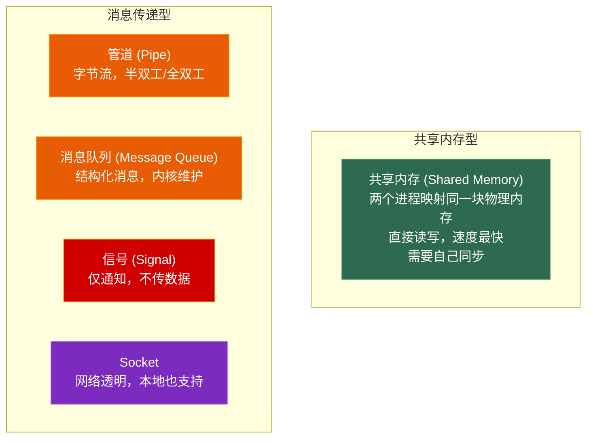
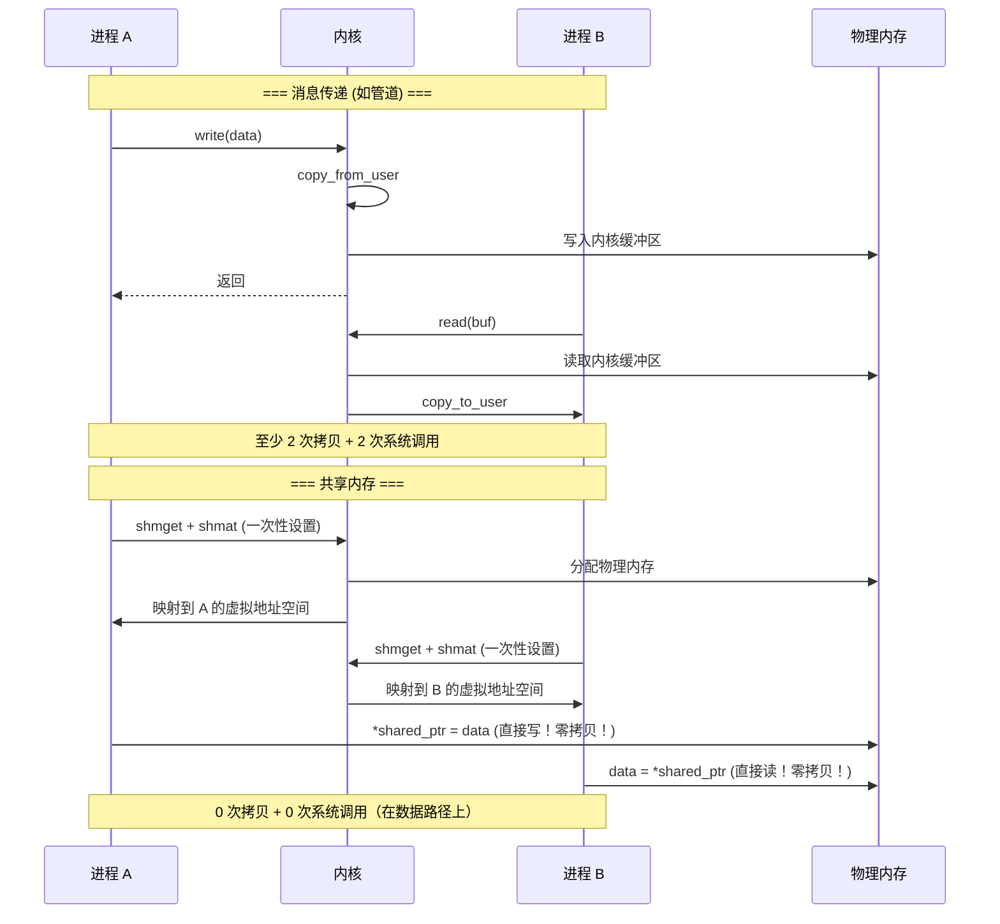
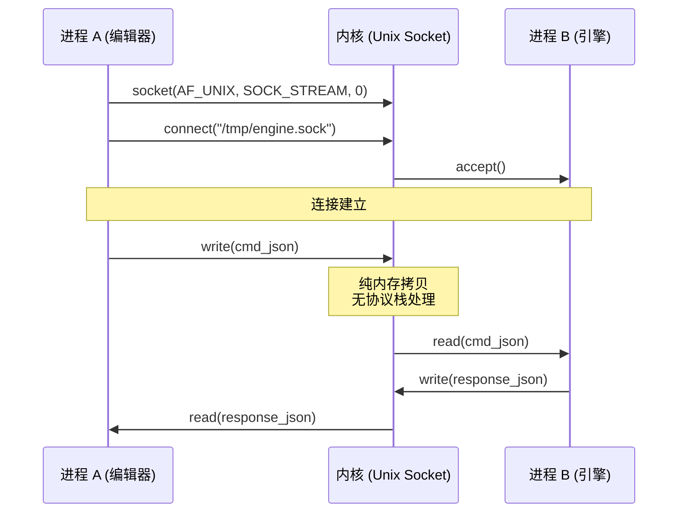
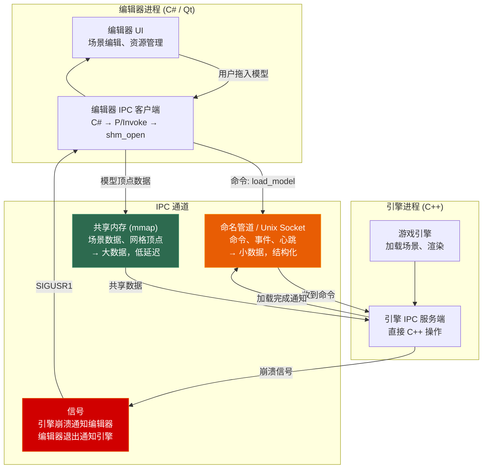

# 第六章 进程间通信 (IPC)

> **一句话理解**：进程地址空间天然隔离——IPC 就是在隔离的墙之间开一扇传递数据的窗。选哪种 IPC，取决于你到底要传多大的数据、多快、以及多复杂。

---

## 6.1 概念直觉 —— What & Why

### 为什么进程间不能直接通信？

```
进程 A 的虚拟地址空间：          进程 B 的虚拟地址空间：
┌──────────────────────┐       ┌──────────────────────┐
│ 0x7FFF... 内核空间    │       │ 0x7FFF... 内核空间    │
│ 0x7FFF... 栈          │       │ 0x7FFF... 栈          │
│ 0x7F00... mmap 区     │       │ 0x7F00... mmap 区     │
│ 0x0100... 堆          │       │ 0x0100... 堆          │
│ 0x0040... 数据段      │       │ 0x0040... 数据段      │
│ 0x0000... 代码段      │       │ 0x0000... 代码段      │
└──────────────────────┘       └──────────────────────┘

进程 A 中 0x0100ABCD 指向 A 堆上的某个对象
进程 B 中 0x0100ABCD 可能指向 B 堆上完全不同的东西
→ 同一个虚拟地址，映射到不同的物理地址
→ 进程间不能通过传指针来共享数据
→ 必须通过内核提供的 IPC 机制
```

### IPC 的两大类



```
共享内存 vs 消息传递的核心区别：

共享内存：
  原理：映射同一块物理内存到两个进程的虚拟地址空间
  流程：A 直接写 → B 直接读（零拷贝，不经内核中转）
  同步：需要额外的同步机制（信号量/互斥锁/futex）
  
消息传递：
  原理：A 把数据交给内核 → 内核把数据交给 B
  流程：A → write/send → 内核缓冲区 → read/recv → B
  同步：内核自动处理（读不到就阻塞）
  
一句话选型：「数据量大 + 追求性能 → 共享内存；简单可靠 → 消息传递」
```

---

## 6.2 底层机制剖析

### 6.2.1 管道 (Pipe)

管道是最古老的 IPC 方式，诞生于 Unix 的「一切皆文件」哲学。

#### 匿名管道

```cpp
#include <unistd.h>
#include <sys/wait.h>
#include <cstdio>
#include <cstring>

void anonymous_pipe_demo() {
    int pipefd[2];  // pipefd[0] = 读端, pipefd[1] = 写端
    
    if (pipe(pipefd) == -1) {
        perror("pipe");
        return;
    }
    
    pid_t pid = fork();
    
    if (pid == 0) {
        // ===== 子进程：读数据 =====
        close(pipefd[1]);  // 关闭写端（不需要写）
        
        char buf[256];
        ssize_t n = read(pipefd[0], buf, sizeof(buf) - 1);
        buf[n] = '\0';
        printf("子进程收到: %s\n", buf);
        
        close(pipefd[0]);
        _exit(0);
    } else {
        // ===== 父进程：写数据 =====
        close(pipefd[0]);  // 关闭读端（不需要读）
        
        const char* msg = "Hello from parent";
        write(pipefd[1], msg, strlen(msg));
        
        close(pipefd[1]);  // 关闭写端 → 子进程 read() 返回 0 (EOF)
        waitpid(pid, nullptr, 0);
    }
}
```

```
匿名管道的特性：

  优点：
    - 最简单，无需任何设置
    - 自动同步（读端没数据时阻塞）
    - 内核自动管理缓冲区（通常 64KB）
  
  限制：
    - 半双工（数据单向流动）
    - 只能用于有亲缘关系的进程（父子进程通过 fork 继承 fd）
    - 字节流（没有消息边界，需要自己协议解析）
    - 不支持随机访问
    
  典型用途：
    - Shell 管道：ls | grep foo | wc -l
    - 进程间简单的数据流传递
```

#### 命名管道 (FIFO)

```
命名管道 = 有名字的管道，通过文件系统可见的任何进程都可以打开。

与匿名管道的区别：
┌──────────────┬──────────────────┬──────────────────┐
│              │   匿名管道        │   命名管道 (FIFO)  │
├──────────────┼──────────────────┼──────────────────┤
│ 标识         │ fd 数字           │ 文件系统中的路径   │
│ 创建         │ pipe()            │ mkfifo()         │
│ 进程关系     │ 需要亲缘关系       │ 任意进程          │
│ 生命周期     │ 所有 fd 关闭即消失 │ 持久化（可跨会话） │
│ 可见性       │ 只有持有 fd 的进程 │ 任何知道路径的进程 │
└──────────────┴──────────────────┴──────────────────┘
```

```cpp
// 命名管道：两个不相关的进程通信
// ===== 写入进程 =====
#include <sys/stat.h>
#include <fcntl.h>

void fifo_writer() {
    mkfifo("/tmp/my_fifo", 0666);  // 创建命名管道
    
    int fd = open("/tmp/my_fifo", O_WRONLY);
    const char* msg = "Hello via FIFO";
    write(fd, msg, strlen(msg));
    close(fd);
}

// ===== 读取进程（完全独立，不相关） =====
void fifo_reader() {
    int fd = open("/tmp/my_fifo", O_RDONLY);  // 阻塞直到有写入者打开
    char buf[256];
    ssize_t n = read(fd, buf, sizeof(buf) - 1);
    buf[n] = '\0';
    printf("收到: %s\n", buf);
    close(fd);
}
```

```
FIFO 的同步语义：

  open(O_RDONLY)：阻塞直到有进程 open(O_WRONLY)
  open(O_WRONLY)：阻塞直到有进程 open(O_RDONLY)
  open(O_RDONLY | O_NONBLOCK)：立即返回（即使没有写入者）
  
  当所有写入者关闭写端 → 读取者 read() 返回 0 (EOF)
  当所有读取者关闭读端 → 写入者 write() 收到 SIGPIPE
```

### 6.2.2 消息队列

管道传的是无结构的字节流，消息队列传的是有结构的**消息**——每条消息有类型和边界。

#### System V vs POSIX 消息队列

| 维度 | System V 消息队列 | POSIX 消息队列 |
|------|-----------------|---------------|
| **API** | `msgget/msgsnd/msgrcv` | `mq_open/mq_send/mq_receive` |
| **标识** | key (ftok 生成) | 名称 (如 "/my_queue") |
| **优先级** | 支持（消息类型 = 优先级） | 支持（msg_prio） |
| **通知** | 无 | `mq_notify()`：消息到达时发信号/线程 |
| **持久化** | 内核持久（重启才消失） | 内核持久 |
| **文件接口** | 无 | 可以用 `mq_getattr` 查属性 |
| **标准化** | SUS (Unix 标准) | POSIX.1-2001 |
| **推荐** | 遗留系统兼容 | 新项目首选 |

```cpp
// ===== POSIX 消息队列 =====
#include <mqueue.h>
#include <fcntl.h>

struct Message {
    int type;        // 消息类型
    float payload;   // 有效数据
};

void posix_mq_demo() {
    // 创建/打开消息队列
    mq_attr attr;
    attr.mq_flags = 0;
    attr.mq_maxmsg = 10;         // 最多 10 条消息
    attr.mq_msgsize = sizeof(Message);
    attr.mq_curmsgs = 0;
    
    mqd_t mq = mq_open("/game_events",
                        O_CREAT | O_RDWR,
                        0644,
                        &attr);
    
    // ===== 发送消息 =====
    Message msg{1, 3.14f};  // type=1 表示 "碰撞事件"
    mq_send(mq, (const char*)&msg, sizeof(msg), 0);  // 0 = 默认优先级
    
    // ===== 接收消息（按优先级，同优先级按 FIFO） =====
    Message recv;
    unsigned int prio;
    mq_receive(mq, (char*)&recv, sizeof(recv), &prio);
    printf("收到: type=%d, payload=%.2f, priority=%u\n",
           recv.type, recv.payload, prio);
    
    mq_close(mq);
    // mq_unlink("/game_events");  // 删除队列
}
```

```
消息队列 vs 管道的选择：

场景 1：传「命令」而非「数据流」
  例：游戏引擎向编辑器发送 "资源已更新"
  → 用消息队列（有边界，有类型，方便路由）

场景 2：传大量连续数据（日志、渲染命令）
  → 用管道或共享内存（消息队列有固定最大大小）

场景 3：需要异步通知
  → POSIX MQ 的 mq_notify 可以在消息到达时触发信号
  → 不需要轮询，事件驱动
```

### 6.2.3 共享内存 —— 最快的 IPC

共享内存是所有 IPC 中速度最快的——数据不经过内核中转，进程直接读写同一块物理内存。



#### POSIX 共享内存

```cpp
#include <sys/mman.h>
#include <sys/stat.h>
#include <fcntl.h>
#include <unistd.h>
#include <semaphore.h>
#include <cstring>
#include <cstdio>

// POSIX 共享内存 + 信号量同步
struct SharedData {
    sem_t sem;             // POSIX 信号量（用于同步）
    int frame_number;
    float delta_time;
    char scene_name[64];
};

void shared_memory_demo() {
    const char* SHM_NAME = "/game_editor_shm";
    
    // ===== 进程 A (游戏引擎)：创建并写入 =====
    {
        // 1. 创建共享内存对象
        int fd = shm_open(SHM_NAME, O_CREAT | O_RDWR, 0644);
        
        // 2. 设置大小
        ftruncate(fd, sizeof(SharedData));
        
        // 3. 映射到进程虚拟地址空间
        auto* shared = (SharedData*)mmap(
            nullptr, sizeof(SharedData),
            PROT_READ | PROT_WRITE,
            MAP_SHARED,  // 关键：修改对其他进程可见
            fd, 0
        );
        
        // 4. 初始化信号量（进程间共享）
        sem_init(&shared->sem, 1, 1);  // pshared=1 → 进程间
        
        // 5. 写入数据（需要同步！）
        sem_wait(&shared->sem);        // P 操作：获取锁
        shared->frame_number = 12345;
        shared->delta_time = 0.016f;
        strcpy(shared->scene_name, "Level_03");
        sem_post(&shared->sem);        // V 操作：释放锁
        
        close(fd);  // fd 可以关了，mmap 映射仍然有效
    }
    
    // ===== 进程 B (编辑器)：打开并读取 =====
    {
        int fd = shm_open(SHM_NAME, O_RDWR, 0);
        auto* shared = (SharedData*)mmap(
            nullptr, sizeof(SharedData),
            PROT_READ | PROT_WRITE,
            MAP_SHARED, fd, 0
        );
        
        sem_wait(&shared->sem);        // P 操作
        printf("Frame: %d, DT: %.3f, Scene: %s\n",
               shared->frame_number,
               shared->delta_time,
               shared->scene_name);
        sem_post(&shared->sem);        // V 操作
        
        munmap(shared, sizeof(SharedData));
        close(fd);
    }
    
    // 清理
    shm_unlink(SHM_NAME);
}
```

#### 共享内存的同步 —— 为什么必须配合

```cpp
// ❌ 没有同步的共享内存 —— 竞态条件
// 进程 A 写了一半，进程 B 就开始读 → 读到不完整的数据

// 同步方案对比：

// 方案 1：POSIX 信号量 (进程间)
sem_t sem;
sem_init(&sem, 1, 1);    // pshared=1 是重点——进程间可见！
sem_wait(&sem);          // 原子操作（通过 futex）
// ... 临界区 ...
sem_post(&sem);

// 方案 2：futex (Linux 特有，最快)
#include <linux/futex.h>
#include <sys/syscall.h>
int futex(int* uaddr, int op, int val, ...);
// futex = Fast Userspace muTEX
// 无竞争时完全在用户态（一次原子操作）
// 有竞争时才陷入内核

// 方案 3：C++ 原子变量 + 共享内存
struct SharedAtomic {
    std::atomic<bool> ready{false};   // 需要保证在共享内存中！
    int data;
};
// 前提：std::atomic 必须是无锁的 (is_lock_free)
// 在共享内存中使用 lock-free atomic 需要：
//   - 平台保证原子变量在共享内存中也能工作（Linux 上通常可以）
//   - POSIX 标准不保证，但实践中大多数 Linux 平台支持
```

> 💡 **面试中的表述**：「共享内存是最快的 IPC——数据路径上零拷贝、零系统调用。但代价是自己管理同步——必须配合信号量或 futex 使用。共享内存特别适合大块数据的频繁交换，比如游戏引擎和编辑器之间传输整个场景数据。」

### 6.2.4 信号 (Signal)

信号与其他 IPC 截然不同——它传递的不是数据，而是**通知**。一个信号就是一个整数，告诉进程「发生了某件事」。

```
常用信号：

  终止类：
    SIGKILL (9)  — 强制杀死进程（不可捕获、不可忽略）
    SIGTERM (15) — 请求进程终止（可捕获，优雅退出的机会）
    SIGINT  (2)  — Ctrl+C 触发
    
  错误类：
    SIGSEGV (11) — 段错误（访问非法内存）
    SIGFPE  (8)  — 浮点异常（除零）
    SIGABRT (6)  — abort() 调用
    
  子进程类：
    SIGCHLD (17) — 子进程状态变化（退出/停止/继续）
    
  用户自定义：
    SIGUSR1 (10) — 用户自定义信号 1
    SIGUSR2 (12) — 用户自定义信号 2
    
  杂项：
    SIGPIPE (13) — 向已关闭的管道写入
    SIGALRM (14) — alarm() 定时器到期
    SIGBUS  (7)  — 总线错误（硬件故障 / mmap 越界）
```

```cpp
#include <csignal>
#include <cstdio>
#include <unistd.h>

// 信号的异步性和重入问题
volatile sig_atomic_t g_shutdown = 0;  // 只能用 sig_atomic_t！

void signal_handler(int sig) {
    // ⚠️ 信号处理器中只能做极少的事！
    // 原因：信号可能在任何时刻打断主程序
    // → 如果在 malloc 中被打断，再次 malloc 会导致死锁
    // → 信号处理器中只能调用「异步信号安全」的函数
    
    // ✅ 安全：设置全局标志
    g_shutdown = 1;
    
    // ✅ 安全：write() 是异步信号安全的
    write(STDOUT_FILENO, "收到 SIGTERM\n", 13);
    
    // ❌ 不安全：printf（内部有锁）
    // printf("收到信号\n");
    
    // ❌ 不安全：malloc（内部有锁）
    // char* p = (char*)malloc(100);
}

void signal_demo() {
    // 注册信号处理器
    signal(SIGTERM, signal_handler);
    // 推荐用 sigaction 而非 signal（行为可移植）
    
    struct sigaction sa;
    sa.sa_handler = signal_handler;
    sigemptyset(&sa.sa_mask);
    sa.sa_flags = SA_RESTART;  // 被信号打断的系统调用自动重启
    sigaction(SIGTERM, &sa, nullptr);
    
    // 主循环
    while (!g_shutdown) {
        // 做正常的事
        usleep(100000);
    }
    printf("优雅退出\n");
}
```

```
信号的限制：

1. 数据量：只能传一个整数信号编号，不能传自定义数据
   （sigqueue + sigaction 可以传一个 int/pointer 的附加数据，但有限）

2. 异步性：信号处理器在任何时刻都可能执行
   → 只能调用异步信号安全函数（write, _exit, 设置原子标志位...）
   → 查看完整的异步信号安全函数列表：man 7 signal-safety

3. 不可靠：标准信号不排队
   → 连续发两次 SIGTERM，可能只收到一次

4. 实时信号 (SIGRTMIN ~ SIGRTMAX)：
   → 排队发送，携带附加数据
   → sigqueue() + siginfo_t
   → Linux 特有扩展
```

```
信号的典型游戏场景：

1. 优雅关闭：
   SIGTERM → 保存进度 → 释放资源 → 退出
   SIGINT  → 同上（Ctrl+C 触发）

2. 崩溃处理：
   SIGSEGV → signal handler → 写 mini dump → 打崩溃日志 → _exit
   （不要在 SIGSEGV 中做复杂操作，段错误后进程状态已损坏）

3. 子进程管理：
   SIGCHLD → 自动回收子进程（无需 waitpid 轮询）
```

### 6.2.5 Unix Domain Socket

Unix Domain Socket (UDS) 是同一台机器上最快的 socket IPC——比 TCP loopback 更快，因为数据不经过网络协议栈。

```
Unix Domain Socket 为什么比 TCP loopback 快？

TCP loopback 路径：
  进程 A → write() → TCP 协议栈 (分段/校验/拥塞控制)
  → IP 协议栈 (路由) → loopback 设备 → IP 协议栈
  → TCP 协议栈 (重组/校验) → read() → 进程 B
  → 两次完整的 TCP/IP 协议栈处理

Unix Domain Socket 路径：
  进程 A → write() → 内核 socket 缓冲区 → read() → 进程 B
  → 纯内存拷贝，不经过任何协议栈
  
性能差距（同一机器）：
  UDS 延迟: ~2-5μs   (一次往返)
  TCP loopback: ~10-20μs  
  UDS 带宽:  ~5-10GB/s
  TCP loopback: ~2-5GB/s
```



```cpp
#include <sys/socket.h>
#include <sys/un.h>
#include <unistd.h>
#include <cstring>

// Unix Domain Socket —— 服务器端
int uds_server() {
    int fd = socket(AF_UNIX, SOCK_STREAM, 0);
    
    sockaddr_un addr{};
    addr.sun_family = AF_UNIX;
    strcpy(addr.sun_path, "/tmp/engine.sock");  // Socket 文件路径
    
    unlink("/tmp/engine.sock");  // 删除可能存在的旧文件
    bind(fd, (sockaddr*)&addr, sizeof(addr));
    listen(fd, 5);
    
    int client = accept(fd, nullptr, nullptr);
    
    // 接收命令
    char buf[4096];
    ssize_t n = recv(client, buf, sizeof(buf), 0);
    
    // 返回响应
    const char* response = R"({"status": "ok"})";
    send(client, response, strlen(response), 0);
    
    close(client);
    close(fd);
    unlink("/tmp/engine.sock");
    return 0;
}

// Unix Domain Socket —— 客户端
int uds_client() {
    int fd = socket(AF_UNIX, SOCK_STREAM, 0);
    
    sockaddr_un addr{};
    addr.sun_family = AF_UNIX;
    strcpy(addr.sun_path, "/tmp/engine.sock");
    
    connect(fd, (sockaddr*)&addr, sizeof(addr));
    
    // 发送命令
    const char* cmd = R"({"cmd": "load_scene", "name": "Level_03"})";
    send(fd, cmd, strlen(cmd), 0);
    
    // 接收响应
    char buf[4096];
    ssize_t n = recv(fd, buf, sizeof(buf) - 1, 0);
    buf[n] = '\0';
    printf("响应: %s\n", buf);
    
    close(fd);
    return 0;
}
```

```
Unix Domain Socket 的独特能力——辅助数据 (Ancillary Data)：

通过 sendmsg/recvmsg，UDS 可以在进程间传递文件描述符！

场景：主进程打开了一个资源文件，想把 fd 传给工作进程
→ 不能简单地传一个 int（不同进程的 fd 表不同）
→ 用 UDS + SCM_RIGHTS 传递真正的 fd

这就是 systemd 的 socket activation 和很多服务管理器的基础机制。
```

### 6.2.6 IPC 性能对比与选型指南

| IPC 方式 | 延迟 | 带宽 | 消息边界 | 关系要求 | 代码复杂度 | 最佳场景 |
|---------|------|------|---------|---------|-----------|---------|
| **匿名管道** | ~2μs | ~500MB/s | 字节流 | 亲缘进程 | 最低 | Shell 管道、简单数据流 |
| **命名管道** | ~3μs | ~500MB/s | 字节流 | 任意 | 低 | 不相关进程的简单通信 |
| **消息队列** | ~3μs | ~200MB/s | 有边界 | 任意 | 低 | 结构化命令传递 |
| **共享内存** | ~0.05μs | ~10GB/s+ | 无（自己定义） | 任意 | 高（需同步） | 大数据频繁交换 |
| **Unix Socket** | ~3μs | ~5GB/s | 字节流/数据报 | 任意 | 中 | 本地 C/S 架构 |
| **信号** | ~1μs | N/A（无数据） | N/A | 任意（需知PID） | 中 | 通知、优雅关闭 |

---

## 6.3 面试高频题

**Q：进程间通信有哪些方式？各自特点？**

> 六种主流方式。管道：最简单，字节流，半双工，匿名需要亲缘关系，命名任意进程可用。消息队列：结构化消息，有边界和优先级，比管道更适合传命令。共享内存：最快，零拷贝零系统调用，但需要自己加锁同步——适合大数据频繁交换。信号：只传通知不传数据，适合 SIGTERM 优雅关闭和 SIGSEGV 崩溃处理。Unix Domain Socket：本地 C/S 架构首选，比 TCP loopback 快 3-5 倍，还能传文件描述符。选型原则：大数据量→共享内存；命令通知→消息队列；简单数据流→管道；C/S 架构→Unix Socket。

**Q：共享内存和管道的区别？**

> 核心区别在数据路径。管道数据经过内核中转（write 拷贝到内核缓冲区→read 从内核拷贝出来），每次都至少两次拷贝。共享内存数据不经过内核——进程直接读写同一块物理内存，零拷贝。性能差距悬殊：共享内存延迟 ~0.05μs，管道 ~2μs，差 40 倍；带宽差距更大。但共享内存必须自己处理同步（信号量/futex），而管道的 read/write 自动阻塞同步。

**Q：什么情况下用共享内存？**

> 三个条件：数据量大（MB 级别以上）、交换频繁（每秒成百上千次）、延迟敏感（希望微秒级延迟）。典型场景：游戏引擎和编辑器之间传输整个场景数据、视频解码器输出帧到渲染进程、数据库的 Buffer Pool 跨进程共享。如果有其中任意一个条件不满足，用管道或消息队列更简单可靠。

---

## 6.4 🎮 游戏实战场景

### 6.4.1 游戏编辑器与引擎的通信架构

这是 IPC 在游戏开发中最典型的应用——编辑器是你看到的 UI（C# WPF / Qt），引擎是运行游戏的 C++ 进程。两者必须通信。



```
UE5 的编辑器-引擎通信设计：

1. 编辑器进程 (UnrealEditor.exe)
   - 运行 Slate UI (C++ 实现的编辑器界面)
   - 管理资产浏览器、蓝图编辑器、关卡编辑器

2. 引擎进程 (通常是同一个进程，但 PIE 时分离)
   - Play In Editor (PIE) 模式：引擎在独立进程中运行
   - 通过共享内存传输场景快照
   - 通过命名管道发送命令（Play/Stop/Pause）

3. Live Coding (热重载 C++)
   - 编译 DLL → 通过 IPC 通知引擎 → 引擎 Patch 虚函数表
   - 跨进程操作，防止编译 crash 崩掉编辑器

Unity 编辑器与 Player 的 IPC：

1. Unity Editor (C#)
   - 基于 Mono/.NET 的 Socket 通信层
   - 使用 TCP/UDP 进行 Profiler 数据传输
   - 使用共享内存进行 GPU 纹理数据的高效传输

2. Unity Player
   - 内置 IPC 层接收编辑器指令
   - Profiler 数据回传编辑器用于性能分析
```

```cpp
// 简化版：编辑器-引擎 IPC 框架
class EditorEngineIPC {
    // 命令通道：Unix Socket (低延迟，结构化)
    int _cmd_socket;       // SOCK_SEQPACKET：保留消息边界
    
    // 数据通道：共享内存 (大块数据)
    void* _scene_data;     // mmap 映射的场景数据块
    size_t _scene_size;
    
    sem_t* _sem;           // 同步信号量
    
public:
    // 编辑器端：加载场景到引擎
    void sendLoadScene(const std::string& scene_path) {
        // 1. 发送命令（通过 Socket）
        json cmd = {{"cmd", "load_scene"}, {"path", scene_path}};
        std::string cmd_str = cmd.dump();
        send(_cmd_socket, cmd_str.data(), cmd_str.size(), 0);
        
        // 2. 等引擎准备好
        char ack[64];
        recv(_cmd_socket, ack, sizeof(ack), 0);  // "ready"
        
        // 3. 传输大块场景数据（通过共享内存）
        sem_wait(_sem);
        loadSceneToSharedMemory(scene_path);     // 写入共享内存
        sem_post(_sem);
        
        // 4. 通知引擎读取
        const char* go = "process";
        send(_cmd_socket, go, strlen(go), 0);
    }
    
    // 引擎端：接收并处理
    void handleCommands() {
        while (true) {
            char buf[4096];
            ssize_t n = recv(_cmd_socket, buf, sizeof(buf), 0);
            json cmd = json::parse(std::string(buf, n));
            
            if (cmd["cmd"] == "load_scene") {
                send(_cmd_socket, "ready", 5, 0);   // 告诉编辑器可以写数据
                
                recv(_cmd_socket, buf, 4, 0);       // 等 "process"
                
                sem_wait(_sem);
                processSceneFromSharedMemory();      // 从共享内存读取
                sem_post(_sem);
            }
        }
    }
};
```

### 6.4.2 多进程架构 —— 来自 Chrome 的启发

Chrome 是最著名的多进程架构实践者。每个标签页一个进程——这个设计对游戏开发有直接的借鉴意义。

```
Chrome 多进程模型：

┌──────────┐  ┌──────────┐  ┌──────────┐  ┌──────────┐
│ Browser  │  │ Renderer │  │ Renderer │  │ GPU      │
│ 进程     │  │ 进程 1   │  │ 进程 2   │  │ 进程     │
│          │  │ (标签1)   │  │ (标签2)   │  │          │
│ UI +     │  │ HTML/JS  │  │ HTML/JS  │  │ 渲染     │
│ 网络+    │  │ 解析     │  │ 解析     │  │ 合成     │
│ 文件     │  │          │  │          │  │          │
└──────────┘  └──────────┘  └──────────┘  └──────────┘
     │              │              │              │
     └──────────────┴──── IPC ─────┴──────────────┘
            (Unix Socket / Named Pipe)

为什么一个标签页一个进程？
  - 崩溃隔离：一个标签页崩溃不影响其他标签页
  - 安全隔离：渲染器在沙箱中，不能直接访问文件系统
  - 资源隔离：每个标签页有独立的内存限制
```

```
游戏开发中的多进程架构：

场景 1：热更新
  ┌──────────────┐     ┌──────────────┐
  │ 启动器进程    │ ←→  │ 游戏进程     │
  │ (C#/Electron) │ IPC │ (C++ 引擎)  │
  │              │     │              │
  │ 检查更新      │     │ 实际运行游戏  │
  │ 下载补丁      │     │ 不需要关注   │
  │ 版本管理      │     │ 更新逻辑     │
  └──────────────┘     └──────────────┘
  
  优势：更新下载在一个独立进程中，不阻塞游戏
       游戏进程崩溃 → 启动器可以重启它
       更新逻辑的 bug 不影响游戏运行

场景 2：插件沙箱
  ┌──────────────┐     ┌──────────────┐
  │ 游戏主进程    │ ←→  │ 脚本插件进程  │
  │              │ IPC │ (Lua/Python) │
  │ C++ 引擎核心  │     │              │
  │              │     │ 玩家写的 Mod  │
  │              │     │ 第三方脚本    │
  └──────────────┘     └──────────────┘
  
  优势：脚本插件死循环 → 不影响主进程
       脚本访问非法内存 → 只崩插件进程
       安全边界：插件无法直接操作引擎内存

场景 3：网络渲染分离
  ┌──────────────┐     ┌──────────────┐
  │ 游戏逻辑进程  │ ←→  │ 渲染进程     │
  │              │ IPC │              │
  │ 物理/AI/网络  │     │ 纯渲染命令   │
  │              │     │ 执行         │
  └──────────────┘     └──────────────┘
  
  优势：渲染崩溃不丢游戏进度
       可以独立升级渲染后端 (DX11→DX12)
       方便做录制/回放（只记录渲染命令）
```

### 6.4.3 多进程 vs 多线程 —— 游戏开发的取舍

```
┌──────────────────┬──────────────────┬──────────────────┐
│                  │    多进程         │     多线程        │
├──────────────────┼──────────────────┼──────────────────┤
│ 隔离性           │ ✅ 强隔离         │ ❌ 共享地址空间    │
│                  │   (天然沙箱)      │   (一个崩溃全崩)   │
├──────────────────┼──────────────────┼──────────────────┤
│ 通信开销         │ ❌ 需要 IPC       │ ✅ 共享内存         │
│                  │   (序列化成本)    │   (传指针即可)     │
├──────────────────┼──────────────────┼──────────────────┤
│ 内存占用         │ ❌ 每个进程独立   │ ✅ 共享代码/数据    │
│                  │   地址空间        │   段               │
├──────────────────┼──────────────────┼──────────────────┤
│ 启动速度         │ ❌ 加载新的 ELF   │ ✅ 创建线程快       │
│                  │   创建页表        │   (无新地址空间)    │
├──────────────────┼──────────────────┼──────────────────┤
│ 调试难度         │ ✅ 独立进程易隔离  │ ❌ 竞态/死锁难复现  │
├──────────────────┼──────────────────┼──────────────────┤
│ 安全边界         │ ✅ 天然安全边界    │ ❌ 无边界           │
├──────────────────┼──────────────────┼──────────────────┤
│ 适用场景         │ 热更新/插件/编辑器 │ 引擎内部并行        │
└──────────────────┴──────────────────┴──────────────────┘

游戏引擎的典型选择：

内核引擎（渲染/物理/AI/音频）  → 多线程（性能优先，共享数据多）
外部工具（编辑器/启动器）      → 多进程（稳定性优先，隔离需求）
插件/Mod 系统                  → 多进程（安全优先）
网络服务（匹配/排行榜）        → 多进程（独立部署/扩容）

一句话：「内部并行用线程，边界隔离用进程」
```

---

## 6.5 30 秒速答

> 📋 以下是本章核心知识点的面试速答模板。每个回答控制在 30 秒内。

---

**Q：进程间通信有哪些方式？**

> 六种：管道（匿名/命名，字节流最简单）、消息队列（结构化有边界）、共享内存（最快零拷贝，需自带同步）、信号（只传通知不传数据）、Unix Domain Socket（本地 C/S 首选，比 TCP loopback 快 3-5 倍，还能传文件描述符）、以及传统的 System V IPC（信号量/消息队列/共享内存三件套，新项目建议 POSIX）。

**Q：共享内存为什么最快？**

> 因为数据路径上零拷贝、零系统调用。管道每次 read/write 都要经过内核缓冲区（两次拷贝），共享内存只做一次 mmap 映射，之后直接读写物理内存。数据量越大、交换越频繁，共享内存的优势越明显。代价是必须自己处理同步——通常用 POSIX 信号量或 futex 做加锁。

**Q：管道和消息队列怎么选？**

> 管道传的是无结构的字节流，适合流式数据（日志、Shell 管道）。消息队列传的是有结构有边界的消息，有类型和优先级，适合传命令（"加载场景"、"播放动画"）。管道没有消息边界——发送 3 次可能 1 次读出，需要自定协议。消息队列天然保留边界——发送 3 次，接收 3 次。

**Q：游戏引擎为什么用多进程而不是纯多线程？**

> 多进程提供崩溃隔离和安全边界——编辑器崩溃不影响正在运行的游戏，插件死循环不卡死主引擎，Mod 代码的非法内存访问只崩自己的沙箱进程。代价是 IPC 通信开销和更大的内存占用。引擎内部核心（渲染/物理/AI）仍用多线程追求极致性能。原则：内部并行用线程，边界隔离用进程。

**Q：什么时候用 Unix Domain Socket？**

> 当两个本地进程需要 C/S 模式的持续双向通信时——编辑器与引擎、数据库客户端与服务端、systemd 与服务进程。它保留了 Socket 的编程模型（connect/accept/send/recv），但没有 TCP 协议栈的开销。额外好处：通过 sendmsg 的 SCM_RIGHTS 可以在进程间传递文件描述符——这是其他 IPC 做不到的。

---

> 📖 上一章：[第五章 进程调度](../05_process_scheduling) —— 调度算法、CFS、优先级反转、游戏主循环的三种步长策略。

> 📖 下一章：[第七章 文件系统与 I/O](../07_file_io) —— 文件系统结构、五种 I/O 模型、epoll、零拷贝、游戏的异步资源加载系统。
