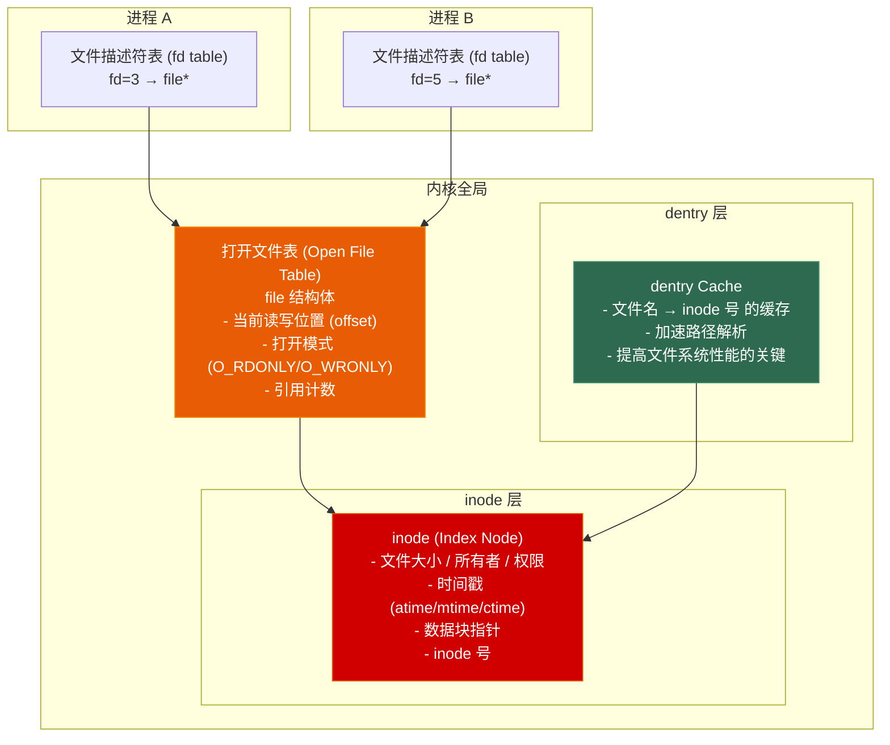
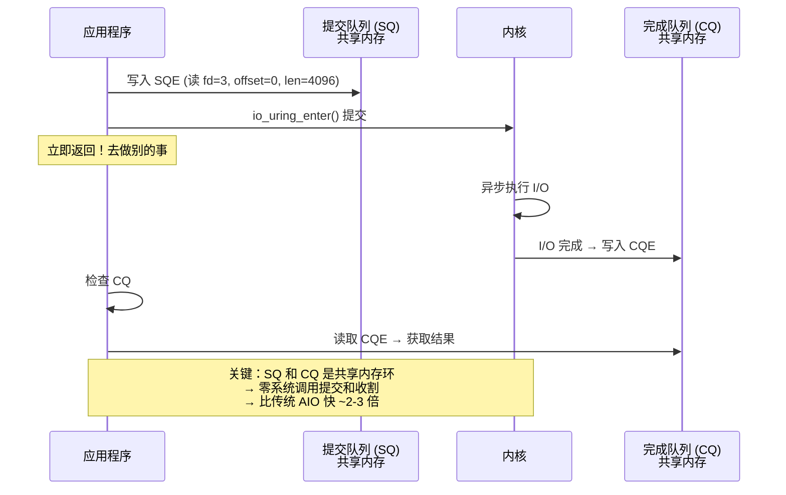
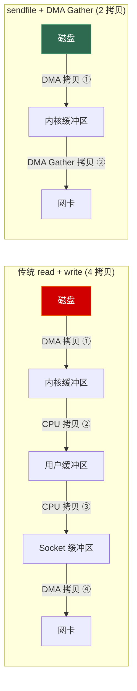
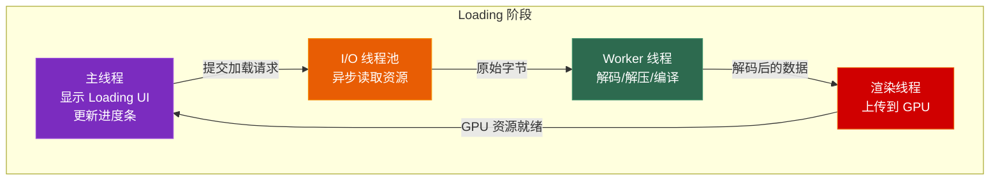

# 第七章 文件系统与 I/O

> **一句话理解**：文件系统的核心就三层——inode 管文件元数据，dentry 管文件名到 inode 的映射，fd 管进程到文件的连接。I/O 模型的核心就一件事——在「等数据」的时候，CPU 能去干什么。

---

## 7.1 概念直觉 —— What & Why

### 文件系统的本质

```
文件系统在做什么？—— 把「磁盘上的字节块」抽象为「用户看到的文件」。

物理层面：
  磁盘 = 一长串的扇区 (512B/4KB)
  「把第 4,823,001 个扇区开始的 1024 个扇区读出来」
  → 用户不关心扇区号

文件系统层面：
  磁盘 = 目录树 + 文件
  「打开 /game/textures/player.dds」
  → 路径名 → inode → 数据块映射 → 磁盘扇区

文件系统的三个核心职责：
  1. 命名：  路径名 → 文件标识 (inode)
  2. 映射：  文件偏移 → 磁盘块号
  3. 保护：  权限检查 (rwx)
```

---

## 7.2 底层机制剖析

### 7.2.1 文件系统内核数据结构

#### inode、dentry 与 fd 的三层关系



```
三层结构详解：

1. 文件描述符表 (File Descriptor Table)
   - 每个进程一个
   - fd 就是一个整数索引
   - 指向「打开文件表」中的条目
   
2. 打开文件表 (Open File Table)
   - 全内核一个（所有进程共享）
   - 存储打开状态：当前读写位置、打开模式
   - 同一文件可以被打开多次 → 多个 file 结构体指向同一个 inode
   - 用引用计数管理（fork 后父子进程共享同一 file 条目）

3. inode
   - 一个文件一个 inode（无论被打开多少次）
   - 存储文件元数据（大小、权限、时间戳、数据块指针）
   - 不存储文件名（文件名在目录的 dentry 中）

为什么这样设计？
  → 一个进程可以 dup() 让两个 fd 指向同一 file（共享 offset）
  → 一个文件可以 open() 两次得到两个 file（独立 offset）
  → fork() 后父子进程共享 file 条目（共享 offset）
```

#### 文件描述符的生命周期

```cpp
int fd1 = open("/tmp/a.txt", O_RDONLY);   // fd=3, file 引用计数=1
int fd2 = dup(fd1);                         // fd=4, file 引用计数=2
// fd1 和 fd2 指向同一个 file → 共享 offset
// lseek(fd1, 100, SEEK_SET) 后, read(fd2) 从 offset 100 开始

int fd3 = open("/tmp/a.txt", O_RDONLY);   // fd=5, 新的 file → 独立 offset

pid_t pid = fork();
// 子进程继承了 fd1, fd2, fd3 → file 引用计数++
// 父子进程对 fd1/fd2 共享 offset(fork 前就已经共享)
// fd3 也共享（但子进程有独立的 offset 副本，因为不同 file 条目？错了——fork 后父子共享同一 file，所以 offset 也共享）

close(fd1);  // 引用计数-1
close(fd2);  // 引用计数-1 → 减到 0 → 释放 file 条目
// fd3 仍然有效，不受影响（独立的 file）
```

#### ext4 文件系统结构

```
ext4 磁盘布局概览：

┌────────────────────────────────────────────────────┐
│ 超级块 (Superblock)                                 │
│ → 文件系统大小、块大小、inode 总数、空闲块数         │
│ → 有多个备份（Block Group 0, 1, 3, 5, 7, 9...）     │
├────────────────────────────────────────────────────┤
│ Block Group 0  │ Block Group 1  │ ... │ Block Group N │
│ ├ 组描述符      │               │     │              │
│ ├ 块位图        │               │     │              │
│ ├ inode 位图    │               │     │              │
│ ├ inode 表      │               │     │              │
│ └ 数据块        │               │     │              │
└────────────────────────────────────────────────────┘

inode 数据块寻址（经典多级间接块）：

inode 结构中有 15 个数据块指针（以 4KB 块为例）：
  [0:11]   直接块：直接指向数据块 → 12 × 4KB = 48KB
  [12]     一级间接块：指向一个存满指针的块 → (4KB/8B) × 4KB = 4MB
  [13]     二级间接块：两级指针 → (4KB/8B)² × 4KB = 4GB
  [14]     三级间接块：三级指针 → (4KB/8B)³ × 4KB = 4TB

  小文件 (< 48KB) 直接用直接块，零间接开销
  大文件自动扩展间接层 → 支持最大 4TB 文件

ext4 的 extent 树（现代优化）：
  不再用逐块映射，而用 extent = (起始块号, 连续块数)
  → 一个大文件一个 extent 就够了，不用干级间接块
```

### 7.2.2 五种 I/O 模型

这是面试中最常被拿来考察候选人对 I/O 理解深度的话题。


```
五种 I/O 模型的完整对比（以读取网络数据为例）：

阶段划分：
  阶段1 = 等数据到达（内核缓冲区准备）
  阶段2 = 数据从内核拷贝到用户空间

┌────────────────┬─────────────────┬─────────────────┬──────────────┐
│ I/O 模型       │ 阶段1 (等待)     │ 阶段2 (拷贝)     │ CPU 利用率    │
├────────────────┼─────────────────┼─────────────────┼──────────────┤
│ 阻塞 I/O       │ 进程阻塞         │ 进程阻塞         │ 低            │
│ 非阻塞 I/O     │ 轮询(不阻塞)     │ 进程阻塞         │ 高(但浪费)    │
│ I/O 多路复用   │ select/epoll阻塞 │ 进程阻塞         │ 高(管理多连接) │
│ 信号驱动 I/O   │ 不阻塞(信号通知)  │ 进程阻塞         │ 高            │
│ 异步 I/O       │ 不阻塞            │ 不阻塞(内核完成) │ 最高           │
│ (io_uring)     │                  │                 │               │
└────────────────┴─────────────────┴─────────────────┴──────────────┘

关键洞察：
  前四种在阶段2都是阻塞的（数据必须拷贝到用户空间）
  只有真正的异步 I/O 两个阶段都不阻塞——内核完成所有工作才通知你
```

#### select → poll → epoll 的演进

```cpp
// ===== select —— 最古老，兼容性最好，性能最差 =====
#include <sys/select.h>

void select_demo() {
    fd_set read_fds;
    FD_ZERO(&read_fds);
    FD_SET(sock1, &read_fds);
    FD_SET(sock2, &read_fds);
    FD_SET(sock3, &read_fds);
    
    // 每次调用都要把整个 fd_set 从用户态拷到内核态
    // 内核要遍历所有 fd（O(n)）检查谁就绪
    int max_fd = std::max({sock1, sock2, sock3});
    int ready = select(max_fd + 1, &read_fds, nullptr, nullptr, nullptr);
    
    // 返回后要遍历所有 fd 检查 FD_ISSET
    for (int fd = 0; fd <= max_fd; fd++) {
        if (FD_ISSET(fd, &read_fds)) {
            // fd 就绪
        }
    }
}

// select 的限制：
//   - 最大 fd 数 FD_SETSIZE (通常 1024)
//   - 每次调用重新初始化 fd_set → O(n) 拷贝
//   - 内核轮询 O(n) 查找就绪 fd
```

```cpp
// ===== poll —— 去掉了 fd 数量上限，但本质仍是 O(n) =====
#include <poll.h>

void poll_demo() {
    pollfd fds[3];
    fds[0] = {sock1, POLLIN, 0};
    fds[1] = {sock2, POLLIN, 0};
    fds[2] = {sock3, POLLIN, 0};
    
    // 仍然每次 O(n) 拷贝 pollfd 数组到内核
    // 内核仍然 O(n) 轮询
    int ready = poll(fds, 3, -1);
    
    for (int i = 0; i < 3; i++) {
        if (fds[i].revents & POLLIN) {
            // fd 就绪
        }
    }
}

// poll 的改进：
//   ✅ 去掉了 fd 数量上限
//   ❌ 仍然是 O(n) 拷贝和轮询（大并发时性能差）
```

```cpp
// ===== epoll —— Linux 的终极方案 =====
#include <sys/epoll.h>

void epoll_demo() {
    int epfd = epoll_create1(0);  // 创建 epoll 实例
    
    // 1. 注册感兴趣的 fd（只做一次！）
    epoll_event ev;
    ev.events = EPOLLIN | EPOLLET;  // 关注可读 + 边沿触发
    ev.data.fd = sock1;
    epoll_ctl(epfd, EPOLL_CTL_ADD, sock1, &ev);
    epoll_ctl(epfd, EPOLL_CTL_ADD, sock2, &ev);
    epoll_ctl(epfd, EPOLL_CTL_ADD, sock3, &ev);
    
    // 2. 等待事件（只返回就绪的 fd！）
    epoll_event events[64];
    while (true) {
        int nfds = epoll_wait(epfd, events, 64, -1);
        
        for (int i = 0; i < nfds; i++) {
            int ready_fd = events[i].data.fd;
            // 直接处理 → 不需要遍历所有 fd
            handle(ready_fd);
        }
    }
}

// epoll 为什么快？
//   1. epoll_ctl 注册一次 → 红黑树存储 → 不用每次重新传 fd 列表
//   2. fd 就绪时 → 加入就绪链表 → epoll_wait 直接返回 O(1)
//   3. epoll_wait 只返回就绪的 fd → 不需要遍历全部

// 经典面试对比：
//   select 最大 1024 fd, O(n) 拷贝 + O(n) 轮询
//   poll   无上限,        O(n) 拷贝 + O(n) 轮询
//   epoll  无上限,        O(1) 注册(红黑树) + O(1) 等待(就绪链表)
//   10,000 个连接时: select 每次拷贝 1250 B × 10000 ≈ 12MB
//                   epoll 只需要返回就绪的几个
```

#### epoll 的 ET vs LT

```
水平触发 (Level-Triggered, LT) — 默认模式
  只要 fd 的读缓冲区有数据 → 每次 epoll_wait 都返回
  「你还没读完对吧？我再通知你一次」
  
  优点: 编程简单，不容易丢事件
  缺点: 可能重复通知，效率稍低
  适合: 大多数场景

边沿触发 (Edge-Triggered, ET)
  只在 fd 状态变化时（无可读→有可读）通知一次
  「有新数据了，自己去读，我不会再通知你」
  
  优点: 高效，不重复通知
  缺点: 必须用非阻塞 fd，必须一次性读/写到 EAGAIN
        编程难度大，漏读就会永久丢数据
  适合: 高性能场景

ET 模式下的正确写法：
  epoll_event ev;
  ev.events = EPOLLIN | EPOLLET;  // ET 模式
  ev.data.fd = fd;
  epoll_ctl(epfd, EPOLL_CTL_ADD, fd, &ev);
  
  // 处理时：
  while (true) {
      ssize_t n = read(fd, buf, sizeof(buf));
      if (n > 0) {
          process(buf, n);
      } else if (n == 0) {
          break;  // EOF
      } else {  // n < 0
          if (errno == EAGAIN || errno == EWOULDBLOCK) {
              break;  // 读完——必须读到 EAGAIN！
          }
          // 真正的错误
          break;
      }
  }
```

#### io_uring —— Linux 异步 I/O 的新纪元

```cpp
#include <liburing.h>  // liburing (用户态封装库)

void io_uring_demo() {
    io_uring ring;
    io_uring_queue_init(256, &ring, 0);  // 队列深度 256
    
    // ===== 提交异步读取请求 =====
    struct io_uring_sqe* sqe;
    char buf[4096];
    
    sqe = io_uring_get_sqe(&ring);          // 获取提交队列条目
    io_uring_prep_read(sqe, fd, buf, sizeof(buf), 0);  // 异步读
    io_uring_sqe_set_data(sqe, buf);         // 附加用户数据
    io_uring_submit(&ring);                  // 提交给内核
    
    // CPU 可以去做别的事！不阻塞！
    // ...
    
    // ===== 稍后获取完成结果 =====
    struct io_uring_cqe* cqe;
    io_uring_wait_cqe(&ring, &cqe);         // 等待至少一个完成
    
    char* completed_buf = (char*)io_uring_cqe_get_data(cqe);
    ssize_t bytes_read = cqe->res;           // 实际读到的字节数
    
    io_uring_cqe_seen(&ring, cqe);           // 标记已处理
    
    io_uring_queue_exit(&ring);
}
```



### 7.2.3 Page Cache 与 Buffer Cache

```
Page Cache：Linux 对文件数据的缓存机制。

当你 read() 一个文件时：
  1. 内核先查 Page Cache
  2. 命中 → 直接从内存返回（零磁盘 I/O）
  3. 未命中 → 从磁盘读入 Page Cache → 再返回

当 Page Cache 被修改了（写操作）：
  - 页面被标记为 Dirty
  - 不会立即写回磁盘（Write-Back 策略）
  - 内核线程 pdflush/flush 定期扫描 dirty 页并写回
  - 或者当脏页比例超过阈值（dirty_ratio, 默认 20%）时触发写回

Page Cache 的回收：
  - 系统内存不足时 → kswapd 回收干净页（直接丢弃）
  - 脏页 → 必须先写回才能回收
  - 回收策略：LRU 近似（两个链表：Active + Inactive）

为什么 Page Cache 对游戏重要？
  1. 热资源（UI 纹理、常驻音效）→ 常驻内存，利用 Page Cache
  2. 冷资源 → 读一次后 Page Cache 会自动回收
  3. 但是 —— 游戏引擎通常自己做缓存管理（Frame/Pool allocator）
     → 不希望 OS 的 Page Cache 占用宝贵内存
     → 用 O_DIRECT 或 madvise(MADV_DONTNEED) 管理
```

```cpp
// fsync 与数据持久化
#include <fcntl.h>
#include <unistd.h>

void atomic_save() {
    int fd = open("save_data.json", O_WRONLY | O_CREAT, 0644);
    
    const char* data = R"({"level": 5, "hp": 100})";
    write(fd, data, strlen(data));
    
    // ⚠️ write() 返回后数据只在 Page Cache 中！还没到磁盘！
    // 如果此时断电 → 数据丢失
    
    fsync(fd);   // 强制将 Page Cache 中的 dirty 数据刷到磁盘
    // fdatasync(fd) 只刷数据不刷元数据（更快，但文件大小可能不更新）
    
    close(fd);
    // 现在数据才真正安全
}
```

### 7.2.4 零拷贝 (Zero-Copy)

```
传统 read + write（如文件服务器发送文件到网络）：

  read(fd, buf, len)
    → 磁盘 → DMA 拷贝 → 内核缓冲区 → CPU 拷贝 → 用户缓冲区 (buf)
  write(sock, buf, len)
    → 用户缓冲区 → CPU 拷贝 → Socket 缓冲区 → DMA 拷贝 → 网卡
    
  总计：4 次拷贝 + 4 次上下文切换 + 2 次系统调用

sendfile()：
  sendfile(sock, fd, nullptr, len)
    → 磁盘 → DMA 拷贝 → 内核缓冲区 → CPU 拷贝 → Socket 缓冲区 → DMA 拷贝 → 网卡
    
  总计：3 次拷�� (省了一次用户缓冲区拷贝)
        2 次上下文切换 + 1 次系统调用

sendfile() + DMA Gather (网卡支持 scatter-gather)：
  sendfile(sock, fd, nullptr, len)
    → 磁盘 → DMA 拷贝 → 内核缓冲区
    → 网卡 DMA 直接从内核缓冲区 + Socket 缓冲区拉取
    → 内核只传了文件描述符和长度信息给 Socket
    
  总计：2 次 DMA 拷贝！真正零 CPU 拷贝！
        2 次上下文切换 + 1 次系统调用

mmap + write：
  addr = mmap(nullptr, len, PROT_READ, MAP_PRIVATE, fd, 0)
    → 文件映射到用户空间（但数据仍在内核 Page Cache 中）
  write(sock, addr, len)
    → 直接从 Page Cache → Socket 缓冲区
    
  总计：3 次拷贝（仍有一次 CPU 拷贝）
        但可以省略用户缓冲区 → 省下了用户态内存
```



---

## 7.3 面试高频题

**Q：select/poll/epoll 的区别？**

> select：最古老，fd 数量上限 1024，每次调用都要把整个 fd_set 从用户态拷到内核，内核 O(n) 轮询所有 fd，返回后用户还要遍历检查。poll：去掉了 fd 上限，用链表替代位图，但仍是 O(n) 拷贝和轮询。epoll：革命性改进——epoll_ctl 把 fd 加入红黑树（一次注册），就绪 fd 加入链表，epoll_wait 直接返回就绪列表 O(1)。10k 连接时 select 要拷贝 12MB，epoll 只返回就绪的几个字节。

**Q：epoll 的 ET 和 LT 模式的区别？**

> LT（水平触发，默认）：只要缓冲区有数据就通知，可能重复通知，编程简单。ET（边沿触发，nginx 用）：只在状态变化时通知一次，必须用非阻塞 fd 且一次性读到 EAGAIN。ET 效率更高（不重复通知），但更容易写出 bug——漏读一次数据就永久丢失。高性能场景用 ET，大多数场景 LT 足够。

**Q：什么是零拷贝？**

> 传统文件发送到网络经历 4 次数据拷贝（磁盘→内核→用户→内核→网卡）。零拷贝的目标是消除 CPU 参与的拷贝。sendfile() 减少到 3 次拷贝，配合 DMA Gather 减少到 2 次纯 DMA 拷贝（CPU 不参与数据搬运）。mmap + write 可以省略用户缓冲区。在游戏资源加载中，mmap 大文件可以直接从 Page Cache 上传到 GPU，避免一次 CPU 拷贝。

**Q：什么是 inode？一个文件占多少个 inode？**

> inode 是文件系统中描述文件元数据的结构——包含文件大小、权限、所有者、时间戳、数据块指针。每个文件（包括目录、符号链接、设备文件）都占用一个 inode。inode 不存文件名——文件名存在目录的 dentry 中。一个文件系统创建时就固定了 inode 数量（mkfs 时分配），`df -i` 查看 inode 使用情况。

**Q：文件描述符是什么？**

> 文件描述符（fd）是进程级别的整数句柄，用于标识一个打开的文件。每个进程有自己的 fd 表，fd 指向内核全局「打开文件表」中的条目，后者再指向 inode。这三级结构支持了 dup（两个 fd 共享 offset）、fork（父子共享 file）、多次 open（独立 offset）。fd 的范围从 0 开始（0=stdin, 1=stdout, 2=stderr），Linux 默认上限 1024（可调）。

---

## 7.4 🎮 游戏实战场景

### 7.4.1 异步资源加载系统

游戏启动时的 Loading 界面背后是一个完整的异步 I/O 管道。



```cpp
// 简化版游戏异步加载系统（基于 io_uring）
#include <liburing.h>
#include <functional>
#include <unordered_map>
#include <vector>

class AsyncAssetLoader {
    io_uring _ring;
    std::vector<char> _read_buffers;       // 预分配的读取缓冲区池
    std::unordered_map<uint64_t, std::function<void(std::vector<char>&)>> _callbacks;
    int _pending = 0;
    
public:
    AsyncAssetLoader(int queue_depth, size_t buffer_size) {
        io_uring_queue_init(queue_depth, &_ring, 0);
        
        // 预注册读取缓冲区（io_uring 5.5+ 的 fixed buffers）
        _read_buffers.resize(queue_depth * buffer_size);
    }
    
    // 异步加载资源
    void loadAsync(const std::string& path,
                   std::function<void(std::vector<char>&)> on_complete) {
        int fd = open(path.c_str(), O_RDONLY);
        
        auto* sqe = io_uring_get_sqe(&_ring);
        char* buf = &_read_buffers[_pending * BUFFER_SIZE];
        
        io_uring_prep_read(sqe, fd, buf, BUFFER_SIZE, 0);
        io_uring_sqe_set_data64(sqe, _pending);  // 把请求 ID 存进去
        
        _callbacks[_pending] = std::move(on_complete);
        _pending++;
        
        close(fd);  // 读请求提交后就可以关了
    }
    
    // 主循环中调用：收割完成的 I/O
    void pollCompletions() {
        io_uring_cqe* cqe;
        
        while (io_uring_peek_cqe(&_ring, &cqe) == 0) {
            uint64_t id = cqe->user_data;
            ssize_t bytes = cqe->res;
            
            if (bytes > 0) {
                std::vector<char> data(
                    &_read_buffers[id * BUFFER_SIZE],
                    &_read_buffers[id * BUFFER_SIZE] + bytes
                );
                _callbacks[id](data);  // 回调：主线程处理
            }
            
            _callbacks.erase(id);
            _pending--;
            io_uring_cqe_seen(&_ring, cqe);
        }
    }
    
    // 等待全部加载完
    void waitAll() {
        while (_pending > 0) {
            io_uring_cqe* cqe;
            io_uring_wait_cqe(&_ring, &cqe);
            // ... 同样的处理逻辑
        }
    }
};
```

#### UE5 Async Loading System 原理

```
UE5 异步加载系统 (AsyncLoadingSystem) 的分层架构：

层 1: FAsyncLoadingThread (I/O 线程)
  - 独立的 I/O 线程，负责从 PAK 文件读取
  - 使用 Precache 预读即将需要的资源
  - 基于优先级调度（玩家附近的资源先加载）

层 2: FAsyncPackage (包管理)
  - 每个资源包（纹理+材质+模型）是一个 AsyncPackage
  - 跟踪加载状态：等待I/O → 序列化 → PostLoad → 完成
  - 依赖关系管理（材质依赖纹理，先确保纹理加载完）

层 3: FStreamableManager (高层 API)
  - 游戏代码调用：StreamableManager.RequestAsyncLoad(path)
  - 支持优先级、取消加载、批量加载
  - 回调或 Delegate 通知加载完成

加载流程：
  1. RequestAsyncLoad("/Game/Heroes/Knight")
  2. → 查找 .uasset 在 PAK 文件中的偏移和大小
  3. → I/O 线程异步读取（相当于 pread + io_uring）
  4. → 反序列化（UE 自定义二进制格式 → UObject）
  5. → PostLoad（修复引用、初始化默认值）
  6. → 回调：资源就绪！
```

### 7.4.2 资源打包与虚拟文件系统 (VFS)

```
为什么游戏不直接读散文件？

以一个 3A 游戏为例：
  散文件数量：~200,000+ 个
  每个文件打开需要：
    1. 路径解析 → 目录 dentry 查找（可能多次磁盘 I/O）
    2. inode 查找（磁盘 I/O）
    3. 权限检查
  
  200,000 次 open() → 大量磁盘寻道
  HDD 寻道 ~10ms × 200,000 = 2000 秒 ≈ 33 分钟！
  即使 SSD (~0.1ms 随机读) 也要 20 秒

打包方案（PAK / AssetBundle / Addressable）：
  → 所有资源打包进一个大文件
  → 打开一次 → 以后都在这个 fd 上 pread()
  → 资源定位 = 在包内的偏移 + 大小
  → 零额外寻道！
```

```
主流打包方案对比：

PAK 文件 (Unreal Engine)：
  ┌──────────────────────────────────────┐
  │ Header: 魔数 + 版本 + 索引偏移       │
  ├──────────────────────────────────────┤
  │ 文件数据块 1: /Game/Heroes/Knight.uasset  │
  │ 文件数据块 2: /Game/Heroes/Knight.uexp    │
  │ ...                                  │
  ├──────────────────────────────────────┤
  │ Index: 路径 → (偏移, 压缩大小, 原始大小)  │
  │  (在文件末尾，可选择性 mmap)          │
  └──────────────────────────────────────┘
  
  特点：可选压缩（zlib/lz4/oodle）、可选加密
       运行时索引常驻内存

AssetBundle (Unity)：
  每个 Bundle 是独立的文件
  优点：更灵活的加载和卸载（按场景/功能划分）
  缺点：多个 Bundle 间有重复资源时需要处理依赖

Addressable (Unity 新版)：
  更高级的抽象——不关心资源在哪个 Bundle
  按 Address 引用：LoadAssetAsync("Hero_Knight")
  系统自动处理依赖和下载
```

```cpp
// 简化版虚拟文件系统
class VirtualFileSystem {
    struct FileEntry {
        uint64_t offset;      // 在 PAK 文件中的偏移
        uint64_t size_comp;   // 压缩后大小
        uint64_t size_orig;   // 原始大小
        uint32_t flags;       // 压缩算法 / 加密标志
    };
    
    int _pak_fd;  // PAK 文件的 fd（整个游戏只有一个！）
    std::unordered_map<std::string, FileEntry> _index;
    
public:
    bool mount(const std::string& pak_path) {
        _pak_fd = open(pak_path.c_str(), O_RDONLY);
        
        // 读取索引（通常在文件末尾）
        // ... 解析并填充 _index
        
        return true;
    }
    
    std::vector<char> readFile(const std::string& path) {
        auto& entry = _index.at(path);
        
        // 一次 pread（不改变 fd 的 offset，线程安全！）
        std::vector<char> compressed(entry.size_comp);
        pread(_pak_fd, compressed.data(), entry.size_comp, entry.offset);
        
        // 解压
        if (entry.flags & FLAG_ZLIB) {
            return zlibDecompress(compressed, entry.size_orig);
        }
        return compressed;
    }
    
    // mmap 大文件（如纹理）避免拷贝
    void* mapFile(const std::string& path, size_t& size) {
        auto& entry = _index.at(path);
        size = entry.size_comp;
        
        // 直接 mmap PAK 文件的对应区域
        // 利用 OS 的 Page Cache 和按需分页
        return mmap(nullptr, entry.size_comp,
                    PROT_READ, MAP_PRIVATE,
                    _pak_fd, entry.offset);
    }
};
```

### 7.4.3 存档系统的原子性设计

游戏存档最怕什么？——**写一半崩溃/断电，存档损坏，玩家几十小时进度丢失。**

```
存档的原子性保证 —— 三步法：

1. 写临时文件
   fd = open("save.sav.tmp", O_WRONLY | O_CREAT)
   write(fd, data, len)
   fsync(fd)           ← 关键！确保数据真正落到磁盘
   close(fd)

2. 写入校验信息
   fd = open("save.sav.sig", O_WRONLY | O_CREAT)
   write(fd, &checksum, sizeof(checksum))
   fsync(fd)
   close(fd)

3. 原子替换
   rename("save.sav.tmp", "save.sav")  ← rename 是原子的！
   rename("save.sav.sig", "save.sav.sig")

为什么 rename 是原子的？
  → POSIX 保证： rename() 要么成功（新旧 inode 交换），要么无变化
  → 不会出现「旧文件被删了新文件还没就位」的中间状态
  → 文件系统用 journal 保证 rename 的原子性

关键细节：
  ✅ 写临时文件 → fsync → rename（标准做法）
  ✅ 校验码独立存储（防止数据损坏被当作有效存档）
  ❌ 不要直接覆盖原文件（一旦崩溃 → 只写了一半）
  ❌ 不要省略 fsync（数据可能还在 Page Cache 中）
  ❌ 不要用 write + close + rename 但跳过 fsync
```

```cpp
#include <crc32.h>  // 简化的 CRC32

class SaveSystem {
    static constexpr int MAX_BACKUPS = 3;
    
public:
    bool save(const std::string& slot_name, const std::vector<uint8_t>& data) {
        // 1. 计算校验码
        uint32_t checksum = crc32(data.data(), data.size());
        
        // 2. 写数据到临时文件
        std::string tmp_path = slot_name + ".tmp";
        if (!writeAndSync(tmp_path, data))
            return false;
        
        // 3. 写校验文件
        std::string sig_tmp = slot_name + ".sig.tmp";
        std::vector<uint8_t> sig_data(sizeof(checksum));
        memcpy(sig_data.data(), &checksum, sizeof(checksum));
        if (!writeAndSync(sig_tmp, sig_data))
            return false;
        
        // 4. 轮转备份（保留最近 3 个存档）
        for (int i = MAX_BACKUPS - 1; i >= 0; i--) {
            std::string old = slot_name + (i > 0 ? ".bak" + std::to_string(i) : "");
            std::string newer = slot_name + ".bak" + std::to_string(i + 1);
            if (access(old.c_str(), F_OK) == 0) {
                rename(old.c_str(), newer.c_str());
            }
        }
        rename(slot_name.c_str(), (slot_name + ".bak1").c_str());
        
        // 5. 原子替换（顺序重要！先数据后校验）
        rename(tmp_path.c_str(), slot_name.c_str());
        rename(sig_tmp.c_str(), (slot_name + ".sig").c_str());
        
        return true;
    }
    
    std::vector<uint8_t> load(const std::string& slot_name) {
        // 1. 读取数据
        auto data = readFile(slot_name);
        
        // 2. 验证校验码
        auto sig = readFile(slot_name + ".sig");
        if (sig.size() != sizeof(uint32_t))
            return {};  // 存档损坏
        
        uint32_t stored_checksum;
        memcpy(&stored_checksum, sig.data(), sizeof(uint32_t));
        
        uint32_t actual_checksum = crc32(data.data(), data.size());
        
        if (stored_checksum != actual_checksum)
            return {};  // 校验失败 → 尝试加载备份
        
        return data;
    }
    
private:
    bool writeAndSync(const std::string& path,
                      const std::vector<uint8_t>& data) {
        int fd = open(path.c_str(),
                      O_WRONLY | O_CREAT | O_TRUNC, 0644);
        if (fd < 0) return false;
        
        size_t written = 0;
        while (written < data.size()) {
            ssize_t n = write(fd,
                data.data() + written,
                data.size() - written);
            if (n < 0) { close(fd); return false; }
            written += n;
        }
        
        if (fsync(fd) < 0) { close(fd); return false; }
        close(fd);
        return true;
    }
};
```

---

## 7.5 30 秒速答

> 📋 以下是本章核心知识点的面试速答模板。每个回答控制在 30 秒内。

---

**Q：select/poll/epoll 的区别？**

> select：fd 上限 1024，每次 O(n) 拷贝整个 fd_set 到内核，内核 O(n) 轮询，返回后用户 O(n) 遍历。poll：去掉了上限，用 pollfd 数组替代 fd_set，但仍 O(n) 拷贝和轮询。epoll：革命性的——epoll_ctl 一次注册进红黑树，就绪 fd 加入链表，epoll_wait 直接取链表 O(1)。高并发场景 epoll 是唯一选择。

**Q：epoll 的 ET 和 LT 模式？**

> LT（默认）：缓冲区有数据就反复通知，编程简单但可能重复。ET：只在状态变化时通知一次，必须非阻塞 fd + 一次读到 EAGAIN，效率高但容易漏读导致永久丢数据。nginx 用 ET，大多数应用用 LT。

**Q：什么是零拷贝？**

> 消除 CPU 参与的数据拷贝。传统 read+write 要 4 次拷贝（2 DMA + 2 CPU），sendfile 减少到 3 次，sendfile+DMA Gather 只需 2 次 DMA 拷贝——CPU 完全不参与数据搬运。mmap+write 可以减少用户缓冲区。游戏资源加载常用 mmap 让 GPU 直接从 Page Cache 读取纹理数据。

**Q：什么是 inode？**

> inode 是文件元数据的存储结构——大小、权限、所有者、时间戳、数据块指针。每个文件一个 inode，inode 不存文件名（文件名在目录的 dentry 中）。文件系统创建时固定 inode 总数，`df -i` 查看使用情况。删文件的本质是释放 inode 和数据块，不一定是覆盖数据。

**Q：文件描述符是什么？**

> 进程级的整数句柄，指向内核全局打开文件表中的条目，再指向 inode。三层结构支持：dup 共享 offset、fork 父子共享、多次 open 独立 offset。fd 0/1/2 预留给 stdin/stdout/stderr。Linux 默认上限 1024，ulimit -n 调整。

**Q：游戏存档怎么保证原子性？**

> 三步：写临时文件 → fsync 确保落盘 → rename 原子替换。rename 是 POSIX 保证的原子操作——要么成功要么不变。再加校验码防止静默数据损坏（磁盘 bit rot），保留最近 3 个备份（如果当前存档坏了还有上一个）。绝对不要直接覆盖原文件——崩溃就丢一切。

---

> 📖 上一章：[第六章 进程间通信 (IPC)](../06_ipc) —— 管道、消息队列、共享内存、信号、Unix Socket、游戏编辑器与引擎的 IPC 架构。

> 📖 下一章：[第八章 协程](../08_coroutine) —— 有栈/无栈协程、C++20 co_await/co_yield、协程帧与 HALO 优化、UE5 Latent Action 与游戏 AI 的协程化。
