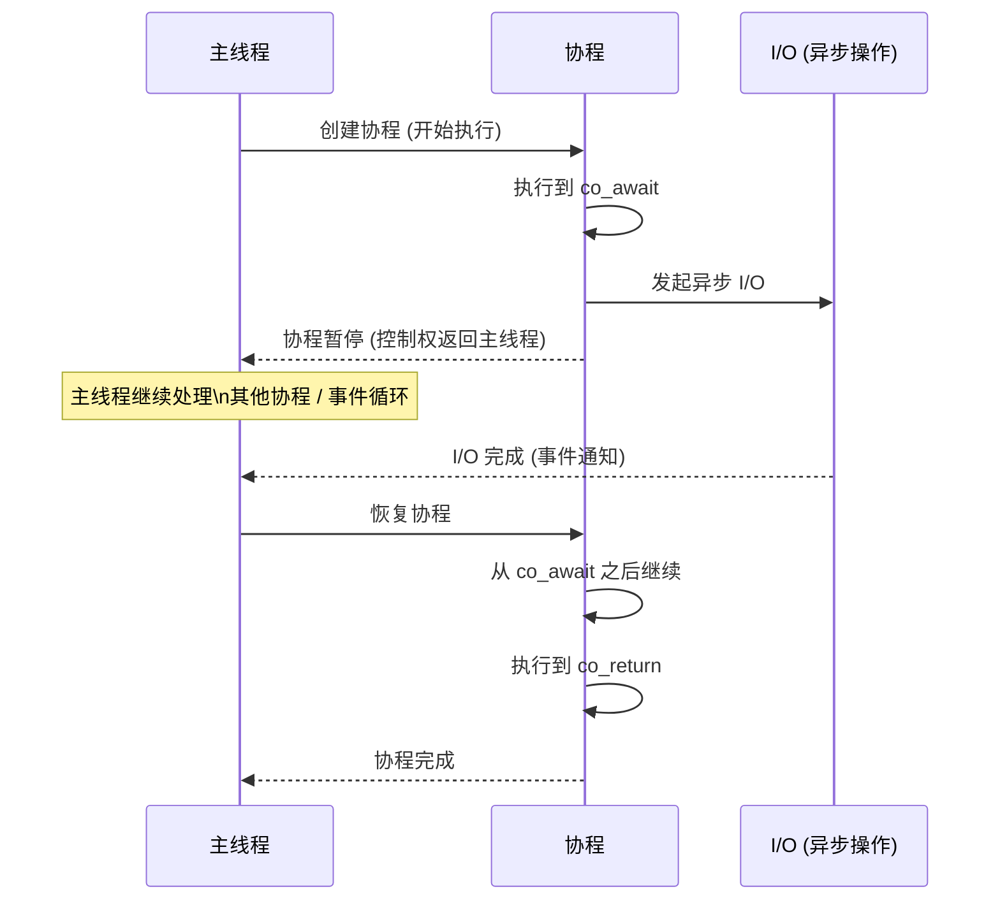
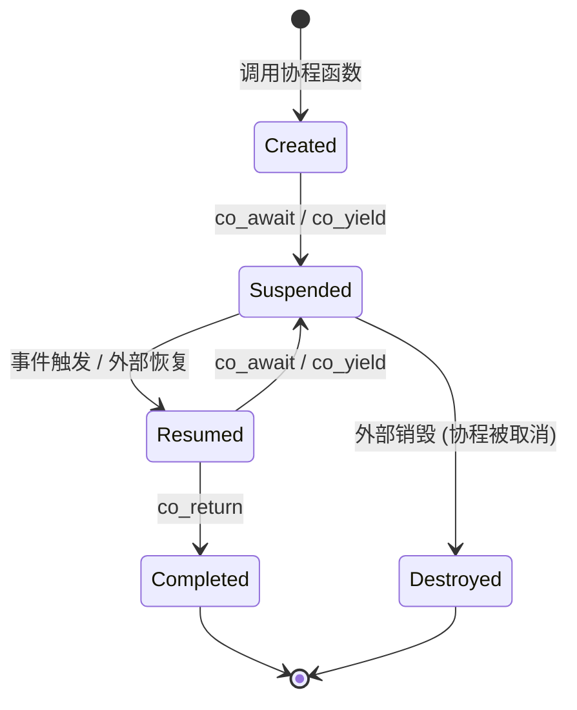
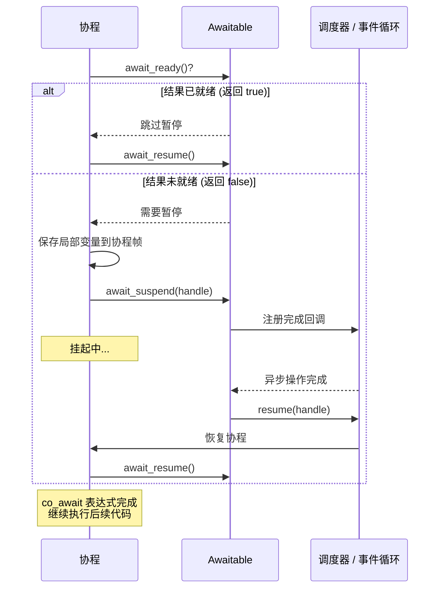

# 第八章 协程

> **一句话理解**：协程是可以暂停和恢复的函数——它把「等它完成再告诉我」的异步逻辑写成「看起来像是同步的」代码。协程比线程轻量（用户态调度），比回调清晰（没有嵌套地狱）。

---

## 8.1 概念直觉 —— What & Why

### 协程是什么？

```
协程 (Coroutine) = Cooperative + Routine（协作式例程）

对比三种执行流：

  函数 (Function)：
    调用 → 从头执行 → 返回 → 结束
    只能「一次性」运行，不能暂停
    
  线程 (Thread)：
    操作系统调度 → 抢占式切换
    可以在任意位置被换下（由 OS 决定）
    切换成本高（~1-10μs，涉及内核态）
    
  协程 (Coroutine)：
    自己决定何时暂停（co_await / co_yield）
    自己决定何时恢复（由调度器/事件循环驱动）
    纯用户态切换（~10-50ns，不涉及内核）
```

```
为什么需要协程？—— 回调地狱 vs 协程

场景：游戏启动 → 加载配置 → 连接服务器 → 认证 → 进入大厅

// ===== 回调版本 (Callback Hell) =====
void startGame() {
    loadConfig([](Config cfg) {
        connectServer(cfg, [](Connection conn) {
            authenticate(conn, [](AuthResult auth) {
                enterLobby(auth, [](Lobby lobby) {
                    // 终于进来了！但代码已经嵌套 4 层...
                    // 如果某个步骤需要条件分支 → 每一层都要写 → 爆炸
                });
            });
        });
    });
}

// ===== 协程版本 =====
Task<void> startGame() {
    Config cfg = co_await loadConfig();       // 「等待」但线程不阻塞
    Connection conn = co_await connectServer(cfg);
    AuthResult auth = co_await authenticate(conn);
    Lobby lobby = co_await enterLobby(auth);
    // 代码看起来像同步，但实际上是异步的！
    // 每个 co_await 处协程暂停，等结果到了再恢复
}
```

### 协程 vs 线程 vs 回调

| 维度 | 回调 | 线程 | 协程 |
|------|------|------|------|
| **代码可读性** | ❌ 嵌套地狱 | ✅ 顺序清晰 | ✅ 顺序清晰 |
| **切换开销** | 无（只是函数调用） | ~1-10μs (内核态) | ~10-50ns (用户态) |
| **并发模型** | 单线程异步 | 多线程并行 | 单线程并发 (也可多线程) |
| **栈空间** | 共享调用栈 | 独立栈 (~1-8MB) | 独立帧 (~几十B~几KB) |
| **调度者** | 事件循环 | 操作系统 | 用户态调度器 |
| **抢占** | N/A | 抢占式 | 协作式 |
| **适用场景** | 简单异步 | CPU 密集型 | I/O 密集型异步 |

> 💡 **面试中的表述**：「协程是用户态的协作式执行流。关键区别——线程是操作系统抢占调度的，协程是自己主动让出的。这让协程切换比线程快 100-1000 倍。协程解决的是异步代码的可读性问题——用同步的写法实现异步的执行。」

---

## 8.2 原理图解

### 协程的暂停/恢复执行流



```
关键洞察：协程暂停 ≠ 线程阻塞

线程 A 等待 I/O：
  A 被操作系统挂起 → 上下文切换 → 内核调度 → A 的线程栈仍然占用内存
  → 10,000 个并发连接 = 10,000 个线程栈 = ~80GB 内存（不可行）

协程等待 I/O：
  协程帧被保存到堆上 → 控制权返回事件循环 → 事件循环继续处理其他协程
  → 10,000 个并发协程 = 10,000 个协程帧 ≈ ~几十 MB（完全可行）
```

### 协程状态机



```
协程的生命周期：

1. Created (创建)
   调用协程函数 → 分配协程帧 → 执行 initial_suspend
   → 如果 initial_suspend 是 suspend_always: 暂停，等待首次 resume
   → 如果 initial_suspend 是 suspend_never: 立即开始执行

2. Suspended (挂起)
   遇到 co_await / co_yield → 保存当前执行状态到协程帧
   → 控制权返回调用者 / 恢复者

3. Resumed (恢复执行)
   外部调用 coroutine_handle::resume()
   → 从协程帧恢复状态 → 从上次暂停点之后继续

4. Completed (完成)
   协程执行到最后 / 遇到 co_return → 调用 final_suspend
   → final_suspend 通常返回 suspend_always → 外部可以取结果
   → 然后销毁协程帧
```

---

## 8.3 底层机制剖析

### 8.3.1 有栈协程 vs 无栈协程

这是协程技术栈中最核心的二分法。

```
有栈协程 (Stackful Coroutine)：

  原理：协程拥有自己独立的调用栈
        切换时保存/恢复整个栈指针 + 寄存器
  
  代表：Boost.Context / Boost.Coroutine2
        Go goroutine
        Lua coroutine
        Python gevent (greenlet)
  
  特点：
    ✅ 可以在任意嵌套深度 yield（和线程一样自由）
    ✅ 已有代码（如第三方库）不需要修改就能协程化
    ❌ 每个协程有独立栈（~8KB~1MB）
    ❌ 切换开销较大（保存/恢复栈 + 寄存器）
  
  实现：Boost.Context 用汇编做栈切换 (jump_fcontext)
    - 保存当前栈指针、指令指针、非易失寄存器
    - 切换到目标协程的栈
    - 恢复目标协程的栈指针和寄存器
    - 跳转到目标协程的暂停点
```

```cpp
// 有栈协程示例 (Boost.Coroutine2)
#include <boost/coroutine2/all.hpp>
using Coroutine = boost::coroutines2::coroutine<int>::pull_type;

void stackful_example() {
    Coroutine source([](Coroutine::push_type& yield) {
        // 这个 lambda 运行在独立栈上！
        for (int i = 0; i < 5; i++) {
            yield(i);  // 可以在这里 yield → 切换回主线程的栈
            // 从 yield 返回 → 栈切换回来
            doSomethingNested(yield);  // 可以在嵌套调用中 yield！
        }
    });
    
    while (source) {
        int val = source.get();  // 获取 yield 的值
        source();                 // 恢复协程 → 栈切换
    }
}

void doSomethingNested(Coroutine::push_type& yield) {
    // 嵌套调用中仍然可以 yield → 这是有栈协程的核心优势
    yield(42);
}
```

```
无栈协程 (Stackless Coroutine)：

  原理：协程不拥有独立栈
        编译器将协程体转换为状态机
        每次暂停，状态机记录「暂停点编号」
        恢复时，switch/跳转到对应状态继续执行
  
  代表：C++20 coroutine
        C# async/await
        Python async/await (asyncio 协程)
        JavaScript async/await
        Rust async/await
  
  特点：
    ✅ 零开销抽象（编译器生成状态机，等价于手写）
    ✅ 极小的内存开销（只保存跨越暂停点的局部变量）
    ✅ 不需要分配独立栈
    ❌ 只能在顶层 co_await/yield（不能从嵌套调用中暂停）
    ❌ 「染色问题」：异步函数只能被异步函数调用
```

```cpp
// 无栈协程示例 (C++20)
// 编译器将这个函数转换为：
// struct __frame {
//     int __state;  // 0=开始, 1=在co_await之后
//     int i;        // 跨越暂停点的局部变量
//     promise_type __promise;
// };
Task<void> stackless_example() {
    for (int i = 0; i < 5; i++) {
        co_await someAsyncOp(i);  // 暂停点 1
        // 恢复后从这里继续
    }
    // 不能从嵌套调用中 co_await！
    // doSomethingNested() → 如果里面有 co_await → 编译错误
    // 除非 doSomethingNested 本身返回 awaitable
}
```

```
有栈 vs 无栈 —— 全面的对比：

┌──────────────┬──────────────────┬──────────────────┐
│              │    有栈协程       │    无栈协程       │
├──────────────┼──────────────────┼──────────────────┤
│ 栈           │ 独立栈 (~8KB-1MB) │ 无独立栈 (复用调用者的栈) │
│ 暂停粒度     │ 任意嵌套深度       │ 仅顶层             │
│ 内存开销     │ ~8KB-1MB/协程     │ ~几十B-几KB/协程   │
│ 切换开销     │ ~50-200ns        │ ~5-20ns           │
│ 实现方式     │ 汇编栈切换        │ 编译器状态机       │
│ 染色问题     │ 无                │ 有                │
│ 典型语言     │ Go, Lua, Boost   │ C++20, C#, Rust   │
│ 游戏引擎     │ UE5 (部分场景)     │ UE5 Latent Action │
└──────────────┴──────────────────┴──────────────────┘
```

### 8.3.2 C++20 协程三要素

C++20 引入了三个新关键字，但它们不是独立的——它们触发编译器将函数转换为协程。

```cpp
// co_await —— 暂停，等待某个异步操作完成
auto result = co_await some_async_call();

// co_yield —— 暂停并产出一个值（用于 generator）
co_yield some_value;

// co_return —— 完成协程并返回最终结果
co_return final_result;
```

```
只要函数体中出现了 co_await / co_yield / co_return 之一
→ 该函数就是协程
→ 编译器为其生成协程帧
→ 返回类型必须满足 Promise 要求

一个函数不能同时是普通函数和协程
→ 由关键字决定
→ 普通函数：不能包含 co_* 关键字
→ 协程：必须包含至少一个 co_* 关键字
```

### 8.3.3 Promise Type 与 Awaitable —— 协程的控制中心

C++20 协程的设计哲学：**编译器提供机制（暂停/恢复），库提供策略（怎么暂停/怎么恢复）。**

#### Promise Type

```
promise_type 的角色：
  协程的「控制平面」——管理协程生命周期
  由协程的返回类型通过 Traits 绑定
  
  using promise_type = /* 你的定义 */;

promise_type 的接口（编译器调用的回调）：
  get_return_object()  → 创建返回给调用者的对象
  initial_suspend()    → 协程开始时是否暂停
  final_suspend()      → 协程结束时是否暂停
  return_void/value()  → 处理 co_return
  yield_value(v)       → 处理 co_yield
  unhandled_exception()→ 处理协程中未捕获的异常
```

#### Awaitable

```
Awaitable 的角色：
  co_await 后面的表达式必须满足 Awaitable 概念
  
  三个方法（编译器生成对它们的调用）：
  
    1. await_ready() → bool
       → true: 不需要暂停，直接返回结果（快速路径）
       → false: 需要暂停，调用 await_suspend
    
    2. await_suspend(coroutine_handle) → void / bool / coroutine_handle
       → 协程已暂停，局部变量已保存到协程帧
       → 在这里注册回调、启动异步操作
       → 返回 void: 协程完全暂停，控制权返回调用者
       → 返回 bool: true=不恢复, false=立即恢复
       → 返回 coroutine_handle: 恢复另一个协程（对称转移）
    
    3. await_resume() → T
       → 协程被恢复后调用
       → 返回 co_await 表达式的结果
```



### 8.3.4 协程帧 (Coroutine Frame) 的内存布局

```
协程帧 = 编译器为协程分配的一块堆内存（默认）
包含以下内容：

┌──────────────────────────────────────┐
│ coroutine_handle (指向自身的指针)      │
├──────────────────────────────────────┤
│ promise_type 对象                     │
│   - 协程的控制平面                     │
├──────────────────────────────────────┤
│ 函数参数副本                          │
│   (按值传递的参数需要保存)             │
│   (按引用传递的只保存引用——小心悬空！) │
├──────────────────────────────────────┤
│ 跨越暂停点的局部变量                   │
│   (编译器分析：哪些变量在 co_await 之   │
│    后仍被使用 → 放入协程帧)            │
│ 不跨越暂停点的局部变量 → 仍留在调用栈  │
├──────────────────────────────────────┤
│ 当前暂停点编号 (resume point)          │
│   (状态机：0=开始, 1=第一个co_await后, │
│    2=第二个co_await后, ...)           │
└──────────────────────────────────────┘

示例：
Task<void> example(int x, const std::string& s) {
    int a = x + 1;         // 跨越暂停点 → 入帧
    co_await something();
    std::string b = s + "...";  // 不跨越后续暂停点 → 可留在栈
    use(b);
}

协程帧包含：
  - promise
  - x (int, 参数副本)
  - s (const string&, 引用——但 string 本身在哪？悬空风险！)
  - a (int, 跨越暂停点的局部变量)
  - 暂停点编号
```

#### HALO 优化 (Heap Allocation eLision Optimization)

```
HALO = 协程帧的堆分配消除

问题：协程帧默认在堆上分配 → new/delete 开销
优化：如果编译器能证明协程的生命周期被调用者完全覆盖
      → 协程帧可以分配在调用者的栈上（或用 alloca）

条件（编译器实现相关）：
  1. 协程创建后立即被 co_await / 同步等待
  2. 协程帧的大小在编译时已知
  3. 协程不逃逸（不会被存到全局变量 / 被其他线程使用）

效果：
  → 消除堆分配的开销 (~50-200ns)
  → 和高性能回调等价

实际使用建议：
  不要依赖 HALO（编译器实现尚未完全成熟）
  关键路径上的协程可配合对象池复用协程帧
```

### 8.3.5 手写简化版 Task\<T\> 协程框架

```cpp
#include <coroutine>
#include <exception>
#include <functional>
#include <variant>

// ===== 1. Task<T>：协程的返回类型 =====
template<typename T>
class Task {
public:
    struct promise_type;
    using handle_type = std::coroutine_handle<promise_type>;
    
    Task(handle_type h) : _handle(h) {}
    ~Task() { if (_handle) _handle.destroy(); }
    
    // 移动语义
    Task(Task&& other) noexcept : _handle(other._handle) {
        other._handle = nullptr;
    }
    
    // 获取结果（阻塞等待协程完成）
    T get() {
        if (!_handle.done()) {
            _handle.resume();   // 启动 / 恢复协程
        }
        return std::move(_handle.promise()._result);
    }
    
    // 检查是否已完成
    bool isDone() const { return !_handle || _handle.done(); }
    
private:
    handle_type _handle;
};

// ===== 2. promise_type：控制协程生命周期 =====
template<typename T>
struct Task<T>::promise_type {
    std::variant<std::monostate, T, std::exception_ptr> _result;
    
    Task<T> get_return_object() {
        return Task<T>(handle_type::from_promise(*this));
    }
    
    // 协程开始时立即执行（不暂停）
    std::suspend_never initial_suspend() { return {}; }
    
    // 协程结束时发起挂起——让外部有机会取结果
    std::suspend_always final_suspend() noexcept { return {}; }
    
    void return_value(T value) {
        _result.template emplace<T>(std::move(value));
    }
    
    void unhandled_exception() {
        _result.template emplace<std::exception_ptr>(std::current_exception());
    }
};

// Task<void> 偏特化
template<>
struct Task<void>::promise_type {
    std::exception_ptr _exception;
    
    Task<void> get_return_object() {
        return Task<void>(handle_type::from_promise(*this));
    }
    
    std::suspend_never initial_suspend() { return {}; }
    std::suspend_always final_suspend() noexcept { return {}; }
    
    void return_void() {}
    
    void unhandled_exception() {
        _exception = std::current_exception();
    }
};

// ===== 3. 一个具体的 Awaitable：模拟异步操作 =====
template<typename T>
class AsyncOperation {
    T _value;
    bool _ready;
    std::coroutine_handle<> _continuation;
    
public:
    AsyncOperation(T val) : _value(std::move(val)), _ready(false) {}
    
    // 模拟异步完成
    void complete() {
        _ready = true;
        if (_continuation) {
            _continuation.resume();  // 恢复等待的协程
        }
    }
    
    // Awaitable 三件套
    bool await_ready() const noexcept { return _ready; }
    
    void await_suspend(std::coroutine_handle<> h) noexcept {
        _continuation = h;   // 记录：完成后恢复谁
    }
    
    T await_resume() const noexcept { return _value; }
};

// ===== 4. 使用示例 =====
AsyncOperation<int> loadPlayerLevel(int playerId) {
    // 模拟：发起异步数据库查询，返回 awaitable
    return AsyncOperation<int>(playerId * 100);
}

Task<int> loadGameProgress(int playerId) {
    int level = co_await loadPlayerLevel(playerId);
    int score = co_await loadPlayerLevel(playerId + 1);  // 等第一次完成才执行第二次
    co_return level + score;
}

// 在某个事件循环中使用：
// Task<int> task = loadGameProgress(42);
// auto& op = ...; // 保存 AsyncOperation 的引用
// op.complete();  // 模拟异步完成
// int result = task.get();
```

---

## 8.4 面试高频题

**Q：协程和线程的区别？**

> 线程是操作系统调度的执行单元，拥有独立栈和内核上下文，切换需要陷入内核（~1-10μs）。协程是用户态的协作式执行流，没有独立栈（无栈协程）或独立栈在用户空间（有栈协程），切换纯用户态（~10-50ns）。线程适合 CPU 密集型并行计算，协程适合 I/O 密集型异步编程。协程解决的核心问题是「用同步写法实现异步执行」——消灭回调地狱的同时不需要线程的开销。

**Q：有栈协程和无栈协程的区别？**

> 有栈协程拥有独立调用栈，可以在任意嵌套深度 yield（和线程一样自由），但内存开销大（~8KB-1MB/协程），切换稍慢，如 Go/Lua/Boost。无栈协程不做栈切换，由编译器将协程体转换为状态机——只能在顶层 co_await，但有「零开销抽象」的优势（~几十B 帧大小），如 C++20/C#/Rust async。游戏引擎倾向无栈协程（性能优先），UI 逻辑倾向无栈协程或轻量有栈。

**Q：C++20 协程的底层原理？**

> C++20 协程是无栈协程。编译器将包含 co_await/co_yield/co_return 的函数转换为状态机，分配一个协程帧（通常在堆上）存储 promise_type、参数副本、跨越暂停点的局部变量和当前状态号。co_await 触发 Awaitable 三连回调：await_ready 快速路径检查、await_suspend 注册完成回调、await_resume 取结果。这不是语法糖——是和手写状态机等价的零开销抽象。

**Q：协程的优势和劣势？**

> 优势：代码可读性（同步写法实现异步）、轻量（无栈协程几 KB 内存）、高效（纯用户态切换）。劣势：有栈协程内存开销大（独立栈），无栈协程有「染色问题」（异步函数只能被异步函数调用）、嵌套暂停受限、C++20 协程标准库不完善（需手写 Task/promise_type）。此外，协程不解决 CPU 密集型并行——它解决的是异步 I/O 的组织问题。

---

## 8.5 🎮 游戏实战场景

### 8.5.1 UE5 的协程应用 —— Latent Action

```
UE5 的 Latent Action 系统是无栈协程思想在 C++17 时代的前瞻性实现：

原理：
  C++ 中没有 co_await 之前（UE5 基于 C++17），
  Epic 手动实现了类似协程的效果：
    节点函数返回时保存状态 → 下一帧被蓝图 VM 恢复
  → 本质上是 C++20 协程的手动状态机

但在 C++20 协程支持下，UE5 正在集成真正的协程：

  UAsyncAction 基类 + co_await 支持
  → 等待动画播放完成：
    co_await PlayMontageAsync(Character, AttackMontage);
    // 动画播完了，继续下一步
  → 等待网络响应：
    auto* Response = co_await SendHttpRequestAsync(URL);
```

```cpp
// 对比：回调版 vs 协程版 —— UE5 风格的异步逻辑

// ===== 回调版：常见的 UE5 异步流程 =====
void AMyCharacter::StartComplexAction() {
    // 播放动画 → 等动画完成 → 生成特效 → 等延迟 → 应用伤害
    
    PlayAnimMontage(AttackMontage, 1.0f, NAME_None);
    
    GetWorldTimerManager().SetTimer(
        AnimTimer, 
        [this]() {
            // 动画播完，生成特效
            SpawnEmitter(HitEffect, GetActorLocation());
            
            GetWorldTimerManager().SetTimer(
                DelayTimer,
                [this]() {
                    // 延迟结束，应用伤害
                    ApplyDamageToTarget();
                },
                0.5f, false
            );
        },
        AnimDuration, false
    );
    // 嵌套 3 层，且 Timer 管理容易出错
}

// ===== 协程版：想象有 co_await 后的 UE5 =====
Task<void> AMyCharacter::StartComplexAction_Coroutine() {
    co_await PlayAnimMontageAsync(AttackMontage);  // 等动画播完
    SpawnEmitter(HitEffect, GetActorLocation());
    co_await DelayAsync(0.5f);                     // 等 0.5 秒
    ApplyDamageToTarget();
    // 代码完全线性——和策划想的「先这样再那样」一致！
}
```

### 8.5.2 游戏 AI 的行为树协程化

```cpp
// 行为树节点的协程化 —— 分帧执行
#include <coroutine>

class AIController;

// 一个行为树节点：寻找掩体
Task<BehaviorStatus> FindCover(AIController* ai) {
    // 第一步：评估周围环境
    auto candidates = co_await EvaluateEnvironment(ai);  // 可能需要几帧
    co_yield BehaviorStatus::Running;  // 告诉行为树「还在执行中」
    
    // 第二步：路径寻找
    for (auto& spot : candidates) {
        auto path = co_await FindPathAsync(ai, spot);  // 寻路可能很慢
        co_yield BehaviorStatus::Running;
        
        if (path.isValid()) {
            ai->setTarget(spot);
            co_return BehaviorStatus::Success;
        }
    }
    
    co_return BehaviorStatus::Failure;
}

// 对比传统实现：
// 传统行为树每个节点是 Tick() 函数 + 状态机
//   class FindCoverNode : public BTNode {
//       enum State { EVAL, PATHFIND, DONE };
//       State _state;
//       int _candidateIndex;
//       // ... 大量手动状态管理
//   };
//
// 协程版本：把状态管理交给编译器和协程帧 → 代码量和可读性大幅改善
```

```
行为树协程化的核心优势：

1. 代码量：传统 ~80 行状态机 → 协程 ~15 行线性代码
2. 分帧执行：每个 co_yield 处自动暂停 → 下一帧自动恢复
   → 不会出现「一个复杂 BT 节点卡一帧」
3. 可调试性：代码是线性的 → 断点和堆栈都清晰
4. 组合性：可以用 if/for/while 控制行为——传统状态机做不到
```

### 8.5.3 对话系统的协程实现

对话系统是协程的最佳用武之地——逐字显示、等待玩家输入、条件分支，天然适合协程的暂停/恢复模型。

```cpp
#include <coroutine>
#include <string>
#include <vector>
#include <queue>

// 对话系统的协程化 Generator
class DialogNode {
public:
    struct promise_type {
        std::string _currentText;
        std::vector<std::string> _choices;
        
        DialogNode get_return_object() {
            return DialogNode(handle_type::from_promise(*this));
        }
        std::suspend_never initial_suspend() { return {}; }
        std::suspend_always final_suspend() noexcept { return {}; }
        std::suspend_always yield_value(std::string text) {
            _currentText = std::move(text);
            return {};
        }
        void return_void() {}
        void unhandled_exception() { std::terminate(); }
    };
    
    // 条件分支：等待玩家选择
    struct ChoiceAwaiter {
        std::vector<std::string>& choices;
        int& result;
        
        bool await_ready() { return false; }  // 总是暂停等玩家
        void await_suspend(std::coroutine_handle<>) {}  // 由外部恢复
        int await_resume() { return result; }
    };
    
    ChoiceAwaiter showChoices(std::vector<std::string> opts) {
        _promise()._choices = std::move(opts);
        return ChoiceAwaiter{_promise()._choices, _playerChoice};
    }
    
    void setPlayerChoice(int c) { _playerChoice = c; }
    std::string currentText() { return _promise()._currentText; }
    // ...
};

// 编写对话脚本——像写小说一样自然
DialogNode welcomeDialog() {
    co_yield "欢迎来到冒险者公会！";
    co_yield "我是会长艾琳。";
    
    int choice = co_await showChoices({
        "我想接任务",
        "我想买卖装备",
        "随便聊聊"
    });
    
    if (choice == 0) {
        co_yield "很好！最近城外的哥布林又猖獗了...";
        // 接任务流程
    } else if (choice == 1) {
        co_yield "来看看我们的新货吧！";
        // 商店流程
    } else {
        co_yield "听说北方的巨龙最近苏醒了呢...";
        // 闲聊流程
    }
    
    co_yield "祝你旅途愉快！";
}

// 对比：传统 if/else 嵌套 + 状态机管理每个对话阶段
// → 协程版本是真正的「用代码写剧本」
```

### 8.5.4 完整案例：游戏加载流程的协程化

```cpp
// 真实游戏场景：协程化加载流程
Task<void> loadGameFlow() {
    // 1. 显示 Loading 界面（不阻塞）
    co_await showLoadingScreen("加载中...");
    
    // 2. 并行加载多个资源（真正需要框架支持并行）
    auto textureTask = loadTextureAsync("/Game/Heroes/Knight");
    auto modelTask = loadModelAsync("/Game/Heroes/Knight");
    auto audioTask = loadAudioAsync("/Game/Sounds/Footsteps");
    
    // 等待所有资源加载完成
    auto texture = co_await textureTask;
    co_await updateProgress(0.33);
    
    auto model = co_await modelTask;
    co_await updateProgress(0.66);
    
    auto audio = co_await audioTask;
    co_await updateProgress(1.0);
    
    // 3. 连接服务器
    auto conn = co_await connectServerAsync("game.example.com", 7777);
    if (!conn.isValid()) {
        co_await showErrorDialog("连接失败，请检查网络");
        co_await retryOrQuit();
        co_return;
    }
    
    // 4. 隐藏 Loading，进入游戏
    co_await hideLoadingScreen();
    co_await spawnPlayerCharacter();
    
    // 整个加载流程 —— 从 200 行回调嵌套 → 30 行线性代码
}
```

---

## 8.6 30 秒速答

> 📋 以下是本章核心知识点的面试速答模板。每个回答控制在 30 秒内。

---

**Q：协程和线程的区别？**

> 线程是 OS 调度的抢占式执行流，有独立栈和内核上下文，切换 1-10μs。协程是用户态的协作式执行流，自己决定何时让出，切换 10-50ns。线程适合 CPU 并行，协程适合 I/O 异步。C10K 问题用线程要 10K×8MB=80GB 栈，用协程只需几十 MB。协程解决的核心问题是「用同步写法实现异步执行」。

**Q：有栈协程和无栈协程的区别？**

> 有栈协程有独立栈，可在任意嵌套深度 yield（如 Go/Lua/Boost），栈开销 8KB-1MB/协程。无栈协程由编译器转为状态机（如 C++20/C#/Rust），只能在顶层 co_await，帧只需几十 B。游戏引擎倾向无栈（性能优先），脚本系统倾向有栈（灵活性优先）。

**Q：C++20 协程的底层原理？**

> 编译器将协程体转换为状态机。协程帧存 promise + 参数副本 + 跨越暂停点的局部变量 + 状态号。co_await 触发 Awaitable 三回调：await_ready 快速路径、await_suspend 注册完成回调、await_resume 取结果。本质是编译器帮你写手写状态机——零开销抽象。

**Q：协程的优势和劣势？**

> 优势：消灭回调地狱（线性代码风格）、超低切换成本（~10ns）、极小内存占用（无栈协程几 KB）。劣势：无栈协程有染色问题（异步函数只能被异步调用）、嵌套暂停受限、C++20 标准库不完善需手写基础设施、不适用于 CPU 密集型并行（那是线程的领地）。

**Q：游戏引擎中协程的典型用途？**

> 三大场景：异步加载——co_await LoadAsync 让加载流程线性可读，替代回调嵌套；行为树——每个 BT 节点是协程，co_yield 实现分帧执行不卡帧；对话系统——Generator 协程做逐字显示 + co_await 等玩家选择，代码像剧本。UE5 的 Latent Action 本质就是协程思想的手动实现。

---

> 📖 上一章：[第七章 文件系统与 I/O](../07_file_io) —— inode/dentry/fd、五种 I/O 模型、epoll/io_uring、零拷贝、游戏异步加载系统。

> 📖 下一章：[第九章 调试与性能分析](../09_debug_and_profiling) —— strace/perf/gdb、火焰图、游戏内存泄漏排查、帧时间分析。
