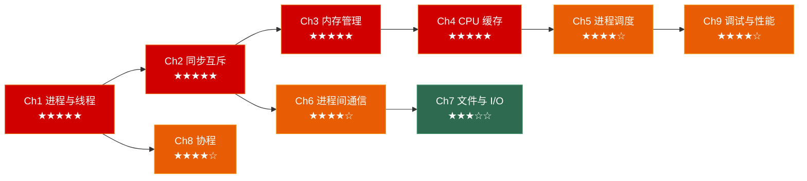

# 操作系统笔记：从进程到协程

> 面向**游戏客户端开发岗**的操作系统深入笔记系列。每章覆盖：原理图解 → 底层剖析 → 面试高频题 → 🎮 游戏实战 → 30 秒速答。

---

## 系列全景



---

## 各章速览

| 章节 | 主题 | 面试权重 | 核心考点 |
|------|------|---------|---------|
| [**第一章**](./01_process_and_thread/) | 进程与线程 | ★★★★★ | fork/COW、PCB、上下文切换、线程模型、线程池 |
| [**第二章**](./02_synchronization/) | 进程同步与互斥 | ★★★★★ | 竞态条件、死锁、CAS/futex、信号量、读写锁、无锁队列 |
| [**第三章**](./03_memory_management/) | 内存管理 | ★★★★★ | 虚拟内存、多级页表、TLB、页面置换、mmap、自定义分配器 |
| [**第四章**](./04_cpu_cache/) | CPU 缓存与性能优化 | ★★★★★ | Cache Line、MESI 协议、伪共享、分支预测、ECS 缓存优势 |
| [**第五章**](./05_process_scheduling/) | 进程调度 | ★★★★☆ | FCFS/SJF/RR/MLFQ、CFS/vruntime、优先级反转、游戏主循环 |
| [**第六章**](./06_ipc/) | 进程间通信 | ★★★★☆ | 管道、消息队列、共享内存、信号、Unix Socket、多进程架构 |
| [**第七章**](./07_file_io/) | 文件系统与 I/O | ★★★☆☆ | inode/dentry/fd、epoll/io_uring、零拷贝、PAK 虚拟文件系统 |
| [**第八章**](./08_coroutine/) | 协程 | ★★★★☆ | 有栈/无栈协程、C++20 co_await/co_yield、协程帧、UE5 Latent Action |
| [**第九章**](./09_debug_and_profiling/) | 调试与性能分析 | ★★★★☆ | strace/gdb/perf/火焰图、valgrind/ASan、帧时间分析、内存追踪 |

---

## 推荐阅读路线

### 🚀 面试急救（3 天）

> 时间紧迫？按面试权重从高到低刷：

```
Day 1: Ch1 进程与线程 → Ch2 同步互斥 → Ch3 内存管理
Day 2: Ch4 CPU 缓存 → Ch5 进程调度
Day 3: Ch8 协程 → Ch9 调试与性能分析（9.3~9.4 重点工具）
```

### 📚 系统掌握（2 周）

> 每天 1 小时，按章节顺序 Ch1→Ch9 完整阅读 + 手写代码验证。

```
Week 1: Ch1 → Ch2 → Ch3 → Ch4
Week 2: Ch5 → Ch6 → Ch7 → Ch8 → Ch9
```

### 🎮 游戏开发重点

> 已有 OS 基础？重点看游戏实战场景：

- **引擎架构**：Ch1 多线程架构/线程池、Ch6 多进程编辑器通信
- **同步与性能**：Ch2 无锁队列/双缓冲、Ch4 伪共享/分支预测/ECS
- **内存管理**：Ch3 自定义分配器/流式加载、Ch7 资源打包 VFS
- **异步编程**：Ch7 io_uring 异步加载、Ch8 UE5 Latent Action/行为树协程化
- **调试调优**：Ch9 内存泄漏追踪/帧时间分析/perf c2c 伪共享检测

---

## 系列特色

- 🧠 **面试导向**：每章的"30 秒速答"可直接用于面试口述，覆盖大厂高频考点
- 🎮 **游戏实战**：所有示例围绕游戏引擎、物理引擎、AI 系统、异步加载
- 📊 **图解原理**：Mermaid 图解进程状态、MESI 协议、I/O 模型、调度甘特图
- 🛠 **工具实战**：Ch9 覆盖完整的调试与性能分析工具链（gdb/perf/strace/火焰图）
- 🔗 **交叉引用**：深度关联 C++ 深入笔记、数据结构笔记系列

## 面试覆盖矩阵

```
                  进程管理  内存管理  并发同步  性能优化  调试排错
Ch1 进程与线程       ●●●     ●●      ●●       ●        -
Ch2 同步互斥         ●●      -       ●●●      ●●       -
Ch3 内存管理          ●      ●●●     -        ●●●      ●
Ch4 CPU 缓存          -      ●●      ●●●      ●●●      ●
Ch5 进程调度         ●●●     -       ●●       ●●       -
Ch6 进程间通信       ●●      -       -        ●●       -
Ch7 文件与 I/O        ●      ●       -        ●●       ●
Ch8 协程              ●      -       ●●       ●●       -
Ch9 调试与性能        ●      ●●      ●●       ●●●      ●●●
```