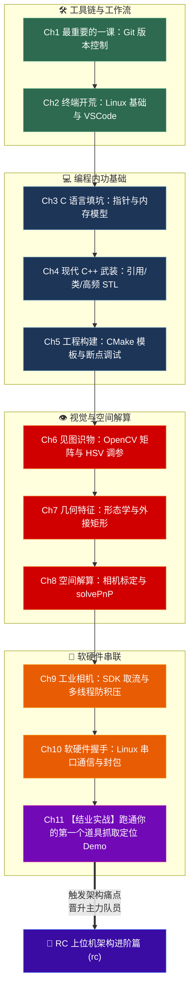

# 写在前面

笔者写了RC上位机开发相关文档之后发现一个问题，此前的文章并不是零基础。所以对读者还是有一定门槛。因此我回过头来开始编写了这部从0开始的上位机教程。

这个基础篇的目标非常简单直接：
> **用最快的方式填补大一零基础到竞赛开发之间的鸿沟，带你亲手写出一个能用摄像头识别比赛道具、解算出三维空间坐标、并通过串口发给电控单片机用于机械臂抓取的完整定位Demo。**

顺带一提，RC历年的题目基本上都可以抽象为抓物放物，所以我也是根据这个来写。

当你跑通这个Demo后，你就会真正推开机器人上位机的大门，并顺理成章地进入后续的 **[RC 上位机进阶架构篇](../rc/)**。

---

## 学习路线全景

---

## 章节索引

### 第一阶段：工具链与开发环境
- [**Ch1 最重要的一课：Git 版本控制与协作规范**](./01_how_to_use_git/)
- [**Ch2 终端开荒：Ubuntu 基础操作与 VSCode Remote 配置**](./02_linux_and_tools/)

### 第二阶段：语言武装（从 C 到现代 C++）
- [**Ch3 C 语言内功填坑：指针本质、内存分配与结构体对齐**](./03_c_pointers_and_memory/)
- [**Ch4 告别 C 语言：现代 C++ 引用、RAII 思想与高频 STL**](./04_modern_cpp_primer/)
- [**Ch5 工程化构建：现代 CMakeLists 编写与 VSCode 单步断点调试**](./05_cmake_and_debug/)

### 第三阶段：OpenCV 视觉与空间几何解算
- [**Ch6 见图识物：cv::Mat 内存本质、HSV 色彩提取与 GUI 调参窗口**](./06_opencv_mat_and_color/)
- [**Ch7 几何特征提取：形态学去噪、轮廓分析与旋转矩形筛选**](./07_contours_and_features/)
- [**Ch8 从 2D 像素到 3D 现实：小孔成像模型、张氏标定与 solvePnP 解算**](./08_camera_model_and_pnp/)

### 第四阶段：软硬件打通与综合考核
- [**Ch9 工业相机接入：驱动 SDK 封装与 std::thread 双缓冲防积压**](./09_camera_sdk_and_threads/)
- [**Ch10 软硬件握手：Linux 串口通信、结构体内存打包与校验**](./10_simple_serial_packet/)
- [**Ch11 【结业考核】组装你的第一个道具抓取定位 Demo 与进阶之路**](./11_capstone_project/)

---

## 赛前装备与心态建议

1. **比赛是团队性质的**：一定要和你的队友多交流，不要这不知道不问瞎写那也不知道也瞎写。
2. **看报错是程序员的第一本能**：编译器报红不要直接闭眼问学长，复制红字最后一行去搜，或者直接喂给AI，99%的问题都在那一行提示里。
3. **一定要动手跑代码**：每一章末尾都有配套的小作业，必须自己亲自敲一遍跑通，光看文档是学不会写代码的。