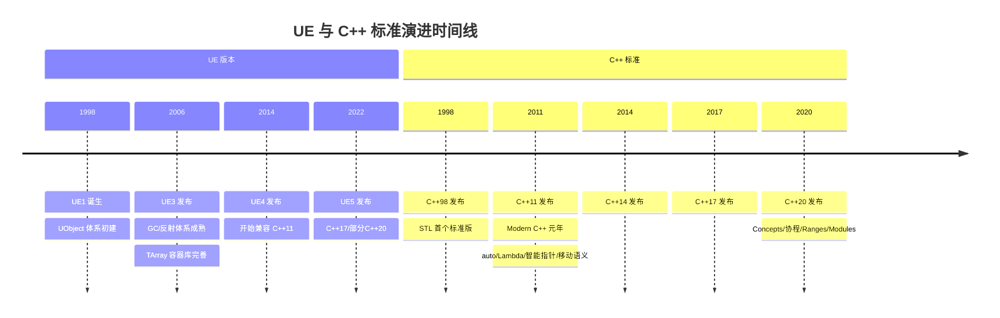
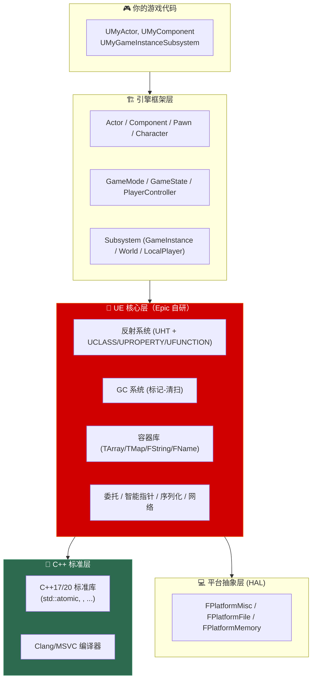
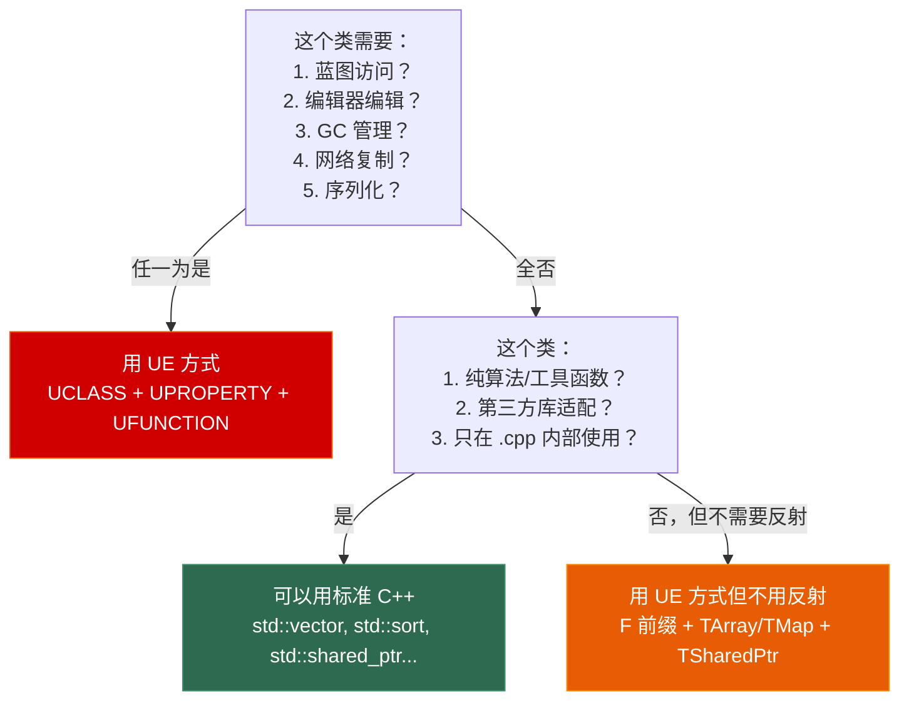

# 第一章 全景对比：UE C++ vs Modern C++

> **一句话理解**：UE C++ 不是"另一门语言"，而是 Epic 在 C++98 时代发现标准库不够用之后，用**宏 + 代码生成**在标准 C++ 之上搭建的一整套**并行体系**。你学的 Modern C++（C++11~20）没有白学——理解底层后，你会发现 UE C++ 只是换了一套 API 做同样的事。

---

## 1.1 概念直觉 —— 为什么 UE C++ 长这样？

### 1.1.1 时代错位：UE 诞生于 C++11 之前 13 年



如果你在 2002 年用 C++98 写游戏引擎，你会面临什么？

```cpp
// ==== 2002 年，C++98 时代的真实困境 ====

// 困境 1：没有 shared_ptr，内存管理全靠手动
class GameEntity {
    std::vector<GameEntity*> children;  // 谁负责 delete？文档？口头约定？
};
// 结果：每个引擎都自己写引用计数系统

// 困境 2：没有 std::string 的跨平台保证（各平台 STL 实现不一致）
// GCC 的 string 和 MSVC 的 string 内部布局不同
// 结果：每个引擎都自己写字符串类

// 困境 3：没有运行时反射
// 无法在编辑器中修改属性、无法序列化、无法和脚本语言互操作
// 结果：写大量样板代码手动注册每个属性

// 困境 4：没有移动语义
std::vector<Mesh> LoadMeshes() {
    std::vector<Mesh> meshes;
    // ... 加载 10000 个网格
    return meshes;  // 深拷贝整个 vector！性能灾难
}
// 结果：到处用输出参数或指针，导致代码难以组合
```

Epic 的答案是：**不等标准委员会了，我们自己造**。

### 1.1.2 标准 C++ 缺少的，Epic 全自己做了

| 游戏引擎的需求 | C++98/11 缺少什么 | Epic 自研方案 | 如今的标准对应 |
|--------------|-------------------|-------------|-------------|
| 运行时反射 | RTTI 只能给 `type_info`，无法枚举属性 | UHT 代码生成 + `UCLASS`/`UPROPERTY` 宏 | 无（C++26 开始讨论反射） |
| 自动垃圾回收 | 无（`shared_ptr` 到 C++11 才有） | UObject 引用图 + 标记-清扫 GC | `shared_ptr`（但有循环引用问题） |
| 跨平台容器 | STL 各平台行为不一致（1998~2008） | `TArray`/`TMap`/`TSet` | C++17 STL（已极大改善） |
| 编辑器可编辑属性 | 无 | `UPROPERTY(EditAnywhere)` → Details 面板 | 无 |
| 蓝图/脚本绑定 | 无 | `UFUNCTION(BlueprintCallable)` | 无 |
| 网络自动复制 | 无 | `UPROPERTY(Replicated)` | 无 |
| 序列化 | 需手写 `<<` 运算符或 `serialize()` | `FArchive` + UPROPERTY 自动序列化 | 无标准方案 |
| 委托/事件广播 | `std::function` 到 C++11 才有，且不支持多播 | `DECLARE_MULTICAST_DELEGATE` | 无标准方案 |
| 线程安全 | `std::thread`/`std::mutex` 到 C++11 才有 | `FRunnable`/`AsyncTask`/`FCriticalSection` | C++11 线程库 |
| 字符串 | `std::string` 窄字符（Windows 游戏用宽字符） | `FString`（TCHAR 封装，自动处理 ANSI/Unicode） | `std::string` + `std::wstring` |

> 💡 **一句话**：UE C++ 的很多设计看起来"重复造轮子"，但这不是 Epic 任性——是因为这些轮子在 1998~2008 年间**根本不存在、或者不够好**。当 C++ 标准终于赶上时，UE 已经是一个千万行代码的航母了，不可能掉头。

---

## 1.2 全景架构图 —— 一张图理解 UE C++ 的分层



这张图的核心信息是：**Epic 自研的部分（红色）替代了本来应该由 C++ 标准库承担的职责**。你在 UE 中写的 C++ 代码，大部分时间不是调 `std::`，而是调 Epic 的 API。

---

## 1.3 类型映射速查表 —— 从 `std::` 到 `F`/`T`/`U`/`A`

这是日常编码中最实用的速查表。当你脑中冒出"我要用 `std::vector`"时，下面就是 UE 的对应。

### 1.3.1 容器映射

| 标准 C++ | UE C++ | 备注 |
|----------|--------|------|
| `std::vector<T>` | `TArray<T>` | API 相似但不兼容，见 1.5.1 |
| `std::unordered_map<K,V>` | `TMap<K,V>` | UE 版没有 `[]` 插入（未找到 key 会断言） |
| `std::map<K,V>` | 无内置等价 | 需要有序 → 排序 TArray + BinarySearch |
| `std::unordered_set<T>` | `TSet<T>` | — |
| `std::queue<T>` | `TQueue<T>` | 线程安全的 `TQueue` 支持 SPSC/MPMC |
| `std::stack<T>` | 直接用 TArray + Push/Pop | — |
| `std::deque<T>` | 直接用 TArray + Insert(0, ...) | — |
| `std::priority_queue<T>` | TArray + Heapify/HeapPush/HeapPop | UE 把堆操作直接放在 TArray 上 |
| `std::bitset<N>` | `TBitArray<>` | — |
| `std::span<T>` | `TArrayView<T>` | 零拷贝视图 |
| `std::initializer_list<T>` | `{1, 2, 3}` 直接初始化 TArray | UE 支持 initializer_list |

### 1.3.2 字符串映射

| 标准 C++ | UE C++ | 用途 |
|----------|--------|------|
| `std::string` / `std::wstring` | `FString` | 通用可变字符串 |
| `std::string_view` | `FStringView`（UE5.4+）或 `const FString&` | 只读字符串参数 |
| 无 | `FName` | 哈希字符串池，标识符专用，O(1) 比较 |
| 无（需第三方库如 gettext） | `FText` | 可本地化的 UI 文本 |
| `"hello"` | `TEXT("hello")` | 字面量必须用 `TEXT()` 宏：在 Windows 上 `TEXT("hello")` → `L"hello"`（`wchar_t` 数组，对应 2 字节 UTF-16 的 `TCHAR`）；在 Linux/Mac/Android/iOS 上 `TEXT("hello")` → **`u"hello"`**（`char16_t` 数组），因为现代 UE 在所有非 Windows 平台上将 `TCHAR` 强行定义为 **`char16_t`（2 字节 UTF-16）**，而非系统自带的 4 字节 `wchar_t`。这是 Epic 为了在所有平台上保持 UE 内部字符串编码一致性（统一 UTF-16）和优化内存开销所做的 HAL 层决策——如果非 Windows 平台用 `L` 前缀，类型是 4 字节的 `wchar_t*`，根本无法赋值给 2 字节的 `TCHAR*` 变量 |

### 1.3.3 智能指针映射

| 标准 C++ | UE C++ | 适用对象 | 关键差异 |
|----------|--------|---------|---------|
| `std::shared_ptr<T>` | `TSharedPtr<T>` | **非 UObject** | UE 版可选线程安全模式 |
| `std::unique_ptr<T>` | `TUniquePtr<T>` | **非 UObject** | — |
| `std::weak_ptr<T>` | `TWeakPtr<T>` | **非 UObject** | `Pin()` 返回 `TSharedPtr` |
| 无 | `TWeakObjectPtr<T>` | **UObject** | GC 安全的弱引用，不阻止 GC |
| `std::make_shared<T>()` | `MakeShared<T>()` | **非 UObject** | — |
| 无 | `TSharedRef<T>` | **非 UObject** | 保证非空的共享引用 |
| 无 | `NewObject<T>()` | **UObject** | GC 管理的创建方式 |
| 无 | `TObjectPtr<T>`（UE5.1+） | **UObject** | 动态句柄包装器：编辑器/开发构建中支持延迟解析（Resolve-on-access）、大世界动态加载（World Partition）；Shipping 中退化（Degrade）为原始 `UObject*`，零开销 |

### 1.3.4 其他常用映射

| 标准 C++ | UE C++ | 用途 |
|----------|--------|------|
| `std::function<Ret(Args...)>` | `DECLARE_DELEGATE` 宏族 | 回调（单播/多播/动态） |
| `std::thread` | `FRunnable` | 自定义线程 |
| `std::async` | `AsyncTask()` | 任务图异步 |
| `std::mutex` | `FCriticalSection` | 互斥锁 |
| `std::lock_guard` | `FScopeLock` | RAII 锁 |
| `std::atomic<T>` | `TAtomic<T>` | 原子操作 |
| `std::optional<T>` | `TOptional<T>` | 可选值 |
| `std::variant<...>` | `TVariant<...>` | 类型安全的 union |
| `std::tuple<...>` | `TTuple<...>` | 元组 |
| `std::pair<K,V>` | `TPair<K,V>` | 键值对 |
| `std::numeric_limits<T>` | `TNumericLimits<T>` | 数值边界 |
| `dynamic_cast<T*>` | `Cast<T>()` | UObject 反射安全转换 |
| `static_cast` | 正常使用 | — |
| `nullptr` | `nullptr` | 正常使用 |
| `std::cout` | `UE_LOG(LogTemp, Log, TEXT(...))` | 日志输出 |
| `assert()` | `check()` / `ensure()` | 断言 |

---

## 1.4 命名前缀体系 —— 从名字一眼看懂类型

这是 UE C++ 最具辨识度的特征。当你看到 `UMyActor`，无需查找定义就知道它是 UObject 的子类。

### 1.4.1 前缀规则一览

```cpp
// ==== 类型前缀（匈牙利命名法的 Epic 变体）====

// U —— 继承自 UObject
UCLASS()
class UMyObject : public UObject { /* ... */ };
class UMyComponent : public UActorComponent { /* ... */ };
// 现代 UE5 极力推崇的 USubsystem 也是 U 家族的重要分支：
// UGameInstanceSubsystem / UWorldSubsystem / ULocalPlayerSubsystem / UEditorSubsystem
// 详见 Ch9 Game Framework 与 Subsystem 体系

// A —— 继承自 AActor（Actor 也是 UObject，但前缀升级为 A）
UCLASS()
class AMyActor : public AActor { /* ... */ };
class AMyCharacter : public ACharacter { /* ... */ };

// F —— 纯数据结构 / 非 UObject 类（"F" = Float，继承自 UE 早期的浮点类型命名习惯）
struct FVector { float X, Y, Z; };            // 数学类型
struct FMyData { int32 Value; FString Name; };  // 数据结构
class FMyAlgorithm { /* 纯 C++ 逻辑，无反射 */ }; // 算法类

// I —— 接口（"I" = Interface）
UINTERFACE()
class UMyInterface : public UInterface { /* ... */ }; // 接口的 UObject 包装
class IMyInterface { /* 实际的 C++ 接口 */ };

// E —— 枚举（"E" = Enum）
UENUM()
enum class EMyState : uint8 { Idle, Running, Dead };

// T —— 模板类（"T" = Template）
template<typename T>
class TArray { /* ... */ };
TSharedPtr<int> Ptr;

// S —— Slate Widget（"S" = Slate）
class SButton : public SCompoundWidget { /* ... */ };
class STextBlock : public SLeafWidget { /* ... */ };

// b —— 布尔变量前缀（小写）
bool bIsAlive = true;
bool bCanJump = false;
```

### 1.4.2 为什么需要前缀？三个理由

```cpp
// 理由 1：代码即文档，无需跳转到定义
void Process(AActor* Actor, UActorComponent* Comp, FVector Location);
//            ↑ AActor     ↑ UActorComponent        ↑ FVector
// 一眼看出来：Actor 是场景实体，Component 是挂载组件，Vector 是值类型

// 对比标准 C++ 风格（需要查定义才知道类型性质）：
void Process(Actor* actor, ActorComponent* comp, Vector location);
//           ↑ 是 UObject？是普通类？是结构体？不知道。

// 理由 2：决定了对象的生命周期管理方式
UObject* Obj;        // GC 管理 → 必须用 UPROPERTY 保护或 NewObject 创建
FVector* Vec;        // 手动管理 → 可用 new/delete 或智能指针
AActor* Actor;       // GC 管理 → 用 SpawnActor / Destroy

// 理由 3：编辑器资产的命名一致性
// 内容浏览器中：SK_Hero_Body (Skeletal Mesh), M_Hero_Face (Material),
//              BP_Hero (Blueprint), MI_Hero_Arm (Material Instance)
// 命名前缀体系统一了 C++ 代码和资产命名
```

> ⚠️ **常见错误**：给不需要反射的纯 C++ 类加 `U` 前缀。如果你的类不继承 UObject，请用 `F` 前缀。

---

## 1.5 核心心智转换 —— 四个"反直觉"的思维调整

### 1.5.1 "别用 STL 容器"——不是性能问题，是生态问题

这是从标准 C++ 转到 UE 最大的习惯改变。很多新人会问："`TArray` 比 `std::vector` 快吗？"

**答案**：性能差异不是重点。重点是你一旦用了 `std::vector` 作为 UObject 的成员，你就失去了：

```cpp
UCLASS()
class UMyActor : public AActor
{
    GENERATED_BODY()

    // ✗ 如果用 std::vector
    // std::vector<int> Scores;        // 不能被 GC 追踪（虽然 int 不需要 GC）
    // std::vector<UObject*> Objects;  // GC 不知道这里有 UObject 引用！
    //                                  // → 对象可能被 GC 误删 → 野指针 → 崩溃

    // ✓ 用 TArray
    UPROPERTY()
    TArray<int> Scores;                 // 可序列化、可网络复制

    UPROPERTY()
    TArray<UObject*> Objects;           // GC 知道追踪这些引用
};
```

**使用策略**：
- **公共 API / UObject 成员** → 必须用 TArray/TMap/FString
- **`.cpp` 内部实现** → 可以用 STL（算法、临时数据结构）
- **第三方库集成** → 用 STL，但封装好边界

### 1.5.2 "别用 `new` / `delete`"——UObject 由 GC 接管

```cpp
// ==== 标准 C++ 的肌肉记忆 ====
MyClass* obj = new MyClass();
// ... 使用 ...
delete obj;  // 你负责释放

// ==== UE C++：UObject 不能这么干 ====
// ✗ 错误！
UMyObject* Obj = new UMyObject();   // 编译报错！UObject 不能 new
delete Obj;                          // 编译报错！UObject 不能 delete

// ✓ 正确
UMyObject* Obj = NewObject<UMyObject>();
// 不需要 delete —— GC 在 Obj 不可达时自动回收

// AActor 更特殊——必须用 SpawnActor
AMyActor* Actor = GetWorld()->SpawnActor<AMyActor>();
Actor->Destroy();  // 不是立即删除，而是标记 PendingKill，等 GC
```

> 💡 **心智模型**：把 UObject 想象成 C# 或 Java 的对象——你只管创建和引用，系统负责回收。但不加 `UPROPERTY()` 的引用会被 GC 忽略，导致误回收。

### 1.5.3 "没有异常"——不是设计失误，是游戏引擎的刻意选择

```cpp
// ==== 标准 C++：异常无处不在 ====
try {
    int* buf = new int[1000000000];  // 可能抛出 std::bad_alloc
    LoadFile(path);                   // 可能抛出各种异常
} catch (const std::exception& e) {
    std::cerr << e.what() << '\n';
}

// ==== UE C++：异常被禁用（/EHsc-）====
// 为什么？
// 1. 异常会阻止编译器内联优化（对游戏性能影响显著）
// 2. 异常使控制流不可预测（在实时渲染循环中很危险）
// 3. 异常的表驱动实现有运行时开销
// 4. 历史兼容：UE 的千万行代码从未假设异常存在

// UE 的错误处理三件套：
int* Buf = new int[1000000000];          // new 不会抛异常，返回 nullptr

// check：Development/Debug 构建中失败 → 立即崩溃；Shipping 中整个表达式被编译器移除
check(Buf != nullptr);
checkf(Buf, TEXT("Failed to alloc %d bytes"), Size); // 带格式化消息的 check

// ensure：Development 中失败 → 记录日志 + 调用栈 + 继续运行（首次上报，之后静默）；
// Shipping（DO_CHECK=0）中整个宏被剥离，连表达式判断都不会执行，仅展开为 (Buf != nullptr)
// 适合"开发期抓 bug 但不崩，上线后零开销"的场景
ensure(Buf != nullptr);

// verify：和 check 语义相同（Development 中失败=崩溃），区别在于——
// Shipping（DO_CHECK=0）中，verify(expr) 被编译期替换为 (expr)（即纯粹的表达式求值），
// 运行时不存在"检查"这个动作——它就是一行普通的函数调用，无任何断言语义
// 适合"函数有副作用，必须在 Shipping 中也执行，但开发期希望验证返回值"的场景
verify(ImportantCall());

// 函数级别的错误通过返回值：
UObject* Obj = LoadObject<UObject>(nullptr, TEXT("/Game/SomeAsset"));
if (!Obj) {
    UE_LOG(LogTemp, Error, TEXT("Asset not found!"));
    return;  // 提前返回，替代异常传播
}
```

### 1.5.4 "别用 `dynamic_cast`"——用 `Cast<T>()` 代替

```cpp
// ==== 标准 C++ ====
Base* base = GetBase();
if (Derived* derived = dynamic_cast<Derived*>(base)) {
    derived->SpecialMethod();
}

// ==== UE C++：UE 默认禁用了 RTTI（编译选项 /GR-）====
// 为什么？
// 1. UE 的反射系统比 RTTI 功能强大得多——不需要 RTTI
// 2. RTTI 会为每个多态类型生成额外的 type_info 数据，增加内存开销
// 3. 最关键：UObject 的虚函数表和类型体系是引擎自己魔改过的，
//    dynamic_cast 对 UObject 根本就是无效且不安全的
//
// ✗ 绝对禁止对 UObject 使用 dynamic_cast！
//    即使你手动在 Build.cs 里开启了 bUseRTTI = true，
//    dynamic_cast 在 UObject 面前依然是不可靠的——必须且只能用 Cast<T>
// MyClass* Obj = dynamic_cast<MyClass*>(SomeObj);  // 永远不要这样做

// ✓ Cast<T>：利用 UE 反射系统，比 dynamic_cast 更可靠
AActor* GenericActor = GetOwner();
if (APlayerCharacter* Player = Cast<APlayerCharacter>(GenericActor)) {
    Player->SpecialMethod();  // 安全！
}

// ✓ static_cast：不需要反射检查时正常使用
int32 Val = static_cast<int32>(SomeFloat);

// ✓ Cast 内部原理（简化版）：
// 1. 检查 GenericActor 是否为空
// 2. 通过反射系统检查 GenericActor->GetClass() 是否 == APlayerCharacter::StaticClass()
// 3. 如果是，返回转换后的指针；否则返回 nullptr
```

---

## 1.6 代码对比 —— 同一个功能，两种写法

用一个简单的"受伤组件"来直观对比标准 C++ 和 UE C++ 的写法差异：

### 1.6.1 标准 C++ 版本

```cpp
#include <string>
#include <vector>
#include <functional>
#include <memory>
#include <iostream>

class HealthComponent {
public:
    HealthComponent(const std::string& name, int maxHealth)
        : m_name(name), m_maxHealth(maxHealth), m_health(maxHealth) {}

    void takeDamage(int damage) {
        m_health = std::max(0, m_health - damage);
        std::cout << m_name << " took " << damage << " damage, HP: "
                  << m_health << "/" << m_maxHealth << '\n';

        for (auto& callback : m_onHealthChanged) {
            callback(m_health, -damage);
        }

        if (m_health <= 0) {
            onDeath();
        }
    }

    void bindOnHealthChanged(std::function<void(int, int)> callback) {
        m_onHealthChanged.push_back(std::move(callback));
    }

    int getHealth() const { return m_health; }
    bool isAlive() const { return m_health > 0; }

private:
    std::string m_name;
    int m_maxHealth;
    int m_health;
    std::vector<std::function<void(int, int)>> m_onHealthChanged;

    virtual void onDeath() {
        std::cout << m_name << " died!\n";
    }
};

// 使用
int main() {
    auto comp = std::make_unique<HealthComponent>("Hero", 100);
    comp->bindOnHealthChanged([](int hp, int delta) {
        // UI 更新逻辑
    });
    comp->takeDamage(30);
}
```

### 1.6.2 UE C++ 版本

```cpp
#include "CoreMinimal.h"
#include "Components/ActorComponent.h"
#include "HealthComponent.generated.h"   // ← 必须最后 #include

UCLASS(ClassGroup = (Custom), meta = (BlueprintSpawnableComponent))
class UHealthComponent : public UActorComponent
{
    GENERATED_BODY()                     // ← 展开反射胶水代码

public:
    UHealthComponent();

    // --- 属性（反射 + 蓝图 + GC + 序列化 + 网络 + 编辑器）---
    UPROPERTY(EditAnywhere, BlueprintReadWrite, Category = "Health",
              meta = (ClampMin = 0, ClampMax = 1000))
    int32 MaxHealth = 100;

    UPROPERTY(EditAnywhere, BlueprintReadWrite, Category = "Health",
              meta = (ClampMin = 0))
    int32 CurrentHealth;

    UPROPERTY(BlueprintReadOnly, Category = "Health")
    bool bIsAlive = true;

    // --- 委托（多播 + 蓝图可绑定）---
    DECLARE_DYNAMIC_MULTICAST_DELEGATE_TwoParams(
        FOnHealthChanged, int32, NewHealth, int32, Delta);

    UPROPERTY(BlueprintAssignable, Category = "Events")
    FOnHealthChanged OnHealthChanged;

    // --- 函数（蓝图可调用）---
    UFUNCTION(BlueprintCallable, Category = "Health")
    void TakeDamage(int32 Damage);

    UFUNCTION(BlueprintPure, Category = "Health")
    int32 GetHealth() const { return CurrentHealth; }

    UFUNCTION(BlueprintPure, Category = "Health")
    bool IsAlive() const { return bIsAlive; }

protected:
    virtual void BeginPlay() override;

    UFUNCTION()
    virtual void OnDeath();
};

// ===== .cpp 实现 =====
#include "HealthComponent.h"
#include "GameFramework/Actor.h"

UHealthComponent::UHealthComponent()
{
    PrimaryComponentTick.bCanEverTick = false;
}

void UHealthComponent::BeginPlay()
{
    Super::BeginPlay();
    CurrentHealth = MaxHealth;
}

void UHealthComponent::TakeDamage(int32 Damage)
{
    if (!bIsAlive) return;

    CurrentHealth = FMath::Clamp(CurrentHealth - Damage, 0, MaxHealth);
    bIsAlive = CurrentHealth > 0;

    UE_LOG(LogTemp, Log, TEXT("%s took %d damage, HP: %d/%d"),
           *GetOwner()->GetName(), Damage, CurrentHealth, MaxHealth);

    OnHealthChanged.Broadcast(CurrentHealth, -Damage);

    if (!bIsAlive) { OnDeath(); }
}

void UHealthComponent::OnDeath()
{
    UE_LOG(LogTemp, Warning, TEXT("%s died!"), *GetOwner()->GetName());
    // 播放死亡动画、生成掉落物、通知 GameMode...
}
```

### 1.6.3 差异分析

| 维度 | 标准 C++ | UE C++ | 实际影响 |
|------|---------|--------|---------|
| **代码行数** | ~40 行 | ~80 行（含宏和声明） | UE 代码更啰嗦，但每一行都有明确意图 |
| **类型安全** | `std::function` 类型擦除 | `DECLARE_DELEGATE` 编译期强类型 | 委托绑定错误在编译期捕获 |
| **蓝图互操作** | 无 | `BlueprintCallable` / `BlueprintAssignable` | 策划/美术可直接使用 |
| **编辑器可见** | 无 | `EditAnywhere` → Details 面板 | 设计师可在编辑器中调参数 |
| **序列化** | 需手写 | 自动（UPROPERTY） | SaveGame 零额外代码 |
| **网络复制** | 需手写 | 加 `Replicated` 即可 | 多人游戏大幅省代码 |
| **内存安全** | `unique_ptr` | GC + UPROPERTY | 不需要手动 delete |
| **错误处理** | 异常 | check/ensure/日志 | 崩溃时能看到明确的错误信息 |
| **依赖** | 纯 C++ 标准库 | 必须继承 UActorComponent | 无法脱离引擎运行 |

---

## 1.7 何时用标准 C++，何时用 UE 的方式？



**实战经验法则**：

```cpp
// ✓ 纯算法/工具函数 → 标准 C++ 随便用
static float ComputeDamage(float Base, float Multiplier) {
    return std::clamp(Base * Multiplier, 0.0f, 9999.0f);  // std::clamp OK
}

// ✓ .cpp 内部的临时数据结构 → 标准 C++ OK
void UMyActor::SomeInternalMethod()
{
    std::unordered_map<int, float> TempCache;  // 只在函数内使用，没问题
    // ...
}

// ✗ UObject 的公共成员 → 必须 UE 方式
UCLASS()
class UMyActor : public AActor
{
    UPROPERTY()
    TArray<float> WeaponDamages;  // ✓

    // std::vector<float> WeaponDamages;  // ✗ 不能反射/序列化/GC
};

// ✓ 非 UObject 的结构体 → F 前缀 + TArray/TMap
struct FWeaponData
{
    FString Name;
    TArray<float> DamageCurve;
    // 不需要继承 UObject，不需要 UPROPERTY
};
```

---

## 1.8 你不必放弃的现代 C++ 特性

UE 虽然禁用了部分标准库功能，但很多现代 C++ **语法糖**仍然可以用：

| 特性 | 可用？ | 备注 |
|------|--------|------|
| `auto` | ✅ 适度使用 | 迭代器、Lambda 返回类型、复杂模板类型 |
| Lambda | ✅ 广泛使用 | Slate、AsyncTask、委托绑定 |
| range-for | ✅ | `for (auto& Elem : TArray)` |
| `override` / `final` | ✅ **必须使用** | 覆写虚函数时必须加 `override` |
| `nullptr` | ✅ | 替代 `NULL` |
| `enum class` | ✅ | UE 也有反射枚举 `UENUM()` |
| 移动语义 | ✅ | TArray/FString 都支持移动构造 |
| `constexpr` | ⚠️ 谨慎 | UE 宏在 constexpr 上下文中可能有问题 |
| `if constexpr` | ✅ | 模板元编程中可用 |
| 结构化绑定 | ✅ UE5+ | `auto [Key, Value] = MapPair;` |
| 折叠表达式 | ✅ | `(Args + ...)` |
| `std::move` | ✅ | 内部实现中使用 |
| `std::forward` | ✅ | 完美转发 |
| `noexcept` | ❌ 基本不用 | UE 禁用了异常 |
| C++ 异常 | ❌ 禁用 | `/EHsc-` |
| RTTI | ❌ 禁用 | `dynamic_cast` 对 UObject 无效且危险，即使强行开启 RTTI 也不能用，必须用 `Cast<T>` |
| STL 容器（公共API） | ❌ | 用 TArray/TMap 等 |
| `std::string`（公共API） | ❌ | 用 FString/FName/FText |
| `char8_t`/`char16_t` | ❌ | 用 `TCHAR`（UE 的跨平台字符类型） |

---

## 1.9 30 秒速答

> **面试被问："你学过 Modern C++，那 UE C++ 和你学的 C++ 最大的区别是什么？"**

UE C++ 本质上是 Epic 在 C++98 时代发现标准库不够用之后，用**宏 + 代码生成（UHT）**在标准 C++ 之上搭建的一套并行体系。核心差异有三层：

1. **反射替代 RTTI**：`UCLASS()`/`UPROPERTY()`/`UFUNCTION()` 不是注释——UHT 在编译前解析它们，生成反射胶水代码，提供运行时类型查询、蓝图绑定、序列化和网络复制。这比 C++ 的 RTTI 强大得多。

2. **GC 替代手动内存管理**：所有 UObject 由标记-清扫 GC 管理，`UPROPERTY()` 保护引用不被误回收。非 UObject 才用 `TSharedPtr` 等智能指针。这和标准 C++ 的"一切自己管"完全不同。

3. **自有库替代 STL**：`TArray`/`TMap`/`FString`/`FName` 等代替 STL 容器和字符串，保证跨平台一致性和编辑器集成。但现代 C++ 的语法糖（auto、Lambda、range-for、override）照常使用。

总结：**底层的 C++ 还是那个 C++，但日常开发中你用的是 Epic 的 API 体系而不是标准库。**

---

> 📚 **下一章**：[Ch2 UHT 反射系统深入](../02_uet_reflection/) — 理解 `UCLASS()`/`UPROPERTY()`/`UFUNCTION()` 到底做了什么，以及 `.generated.h` 里生成了什么代码。

> 💡 **对本系列其他章节的引用**：
> - 标准 C++ 内存模型、智能指针、多态等底层知识 → 见 [C++ 面试突击系列](../../cpp_deep_dive/)
> - `TArray` / `TMap` / `FString` / `FName` 详解 → 等待 Ch4
> - `TSharedPtr` / GC 机制详解 → 等待 Ch3 + Ch5
> - 委托系统详解 → 等待 Ch6
> - 编码规范详解 → 等待 Ch20
