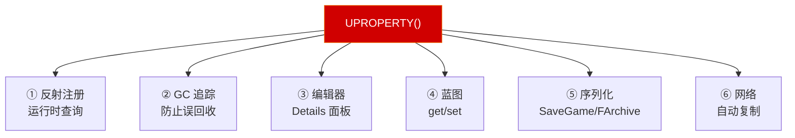
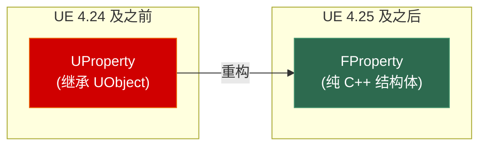

# 第二章 UHT 反射系统：UE C++ 的基石

> **一句话理解**：UHT（Unreal Header Tool）不是编译器，也不是预处理器——它是 Epic 写的**代码生成器**，在你真正编译之前扫描你的头文件，把 `UCLASS()`/`UPROPERTY()`/`UFUNCTION()` 这些宏翻译成几万行胶水代码。没有 UHT，就没有蓝图、没有 GC、没有网络复制、没有编辑器——UE 不过是一个普通的 C++ 渲染框架。

---

## 2.1 概念直觉 —— UHT 在编译管线中的位置

### 2.1.1 标准 C++ 的编译流程 vs UE C++


**关键事实**：UHT 在**预处理器之前**运行。它直接解析你的 `.h` 文件中的特殊宏，生成新的 `.generated.h` 和 `gen.cpp` 文件。然后这些生成的文件和你的代码一起被预处理器和编译器处理。

### 2.1.2 一个最小示例，看完整条链路

```cpp
// ===== MyActor.h —— 你写的 =====
#pragma once
#include "CoreMinimal.h"
#include "GameFramework/Actor.h"
#include "MyActor.generated.h"    // ← 最后一行！UHT 会生成这个文件

UCLASS(Blueprintable)             // ← UHT 从这里开始解析
class MYPROJECT_API AMyActor : public AActor
{
    GENERATED_BODY()              // ← 展开为生成的胶水代码

public:
    UPROPERTY(EditAnywhere, BlueprintReadWrite)
    float Speed = 600.0f;

    UFUNCTION(BlueprintCallable)
    void DoSomething();
};
```

这条链路有三层魔法。我们一层一层拆开。

---

## 2.2 第一层：`GENERATED_BODY()` —— 宏展开里面有什么？

`GENERATED_BODY()` 是你写的代码和 UHT 生成代码之间的**连接点**。把它展开后大概是这样的：

```cpp
// GENERATED_BODY() 的简化展开（实际代码由 UHT 在 .generated.h 中生成）
// 你在 .h 文件中看不到这些——它们藏在 .generated.h 里，由 UHT 写入

private:
    // 1. 声明一个静态类型信息对象（全局唯一，用于反射查询）
    static class UClass* StaticClass();  // 后文详解

    // 2. 重写基类的 GetClass()，返回静态类型对象
    virtual UClass* GetClass() const override
    {
        return StaticClass();
    }

    // 3. 声明一个辅助结构体，用于收集这个类的所有反射信息
    friend struct Z_Construct_UClass_AMyActor_Statics;
    //    ↑ UHT 在 gen.cpp 中定义这个结构体，
    //    它会收集所有的 UPROPERTY、UFUNCTION 元数据

    // 4. 声明构造函数（用于注册反射信息到全局表）
    AMyActor(const FObjectInitializer& ObjectInitializer);
    //    ↑ UHT 会在 gen.cpp 中实现这个构造函数的包装版本

public:
    // 5. 注册 UPROPERTY 和 UFUNCTION 的偏移量信息
    //    （简化表示——实际非常复杂）
    static void StaticRegisterNativesAMyActor();
    // ...

    // 6. 声明 DECLARE_CLASS 等辅助宏（展开后约 20 行样板代码）
    //    包括 GetPrivateStaticClass() 的声明等
```

> 💡 **一句话**：`GENERATED_BODY()` 不是魔法——它只是展开为一堆**普通 C++ 函数声明和友元声明**。这些声明对应的定义（函数体）由 UHT 在 `gen.cpp` 中自动生成。

### 2.2.1 历史演进：GENERATED_UCLASS_BODY() → GENERATED_BODY()

如果你在阅读 UE4 早期的源码或旧教程，可能会看到 `GENERATED_UCLASS_BODY()`。这是 UE4 早期版本的写法，和新版的区别在于**构造函数的约定**：

```cpp
// ==== 旧版：GENERATED_UCLASS_BODY()（UE4 早期）====
UCLASS()
class UMyClass : public UObject
{
    GENERATED_UCLASS_BODY()  // ← 旧版宏

public:
    // 强制要求：必须显式声明带 const FObjectInitializer& 的构造函数
    UMyClass(const FObjectInitializer& ObjectInitializer);
};

// .cpp 中必须这样写：
UMyClass::UMyClass(const FObjectInitializer& ObjectInitializer)
    : Super(ObjectInitializer)  // ← 必须手动调用 Super()
{
}

// ==== 新版：GENERATED_BODY()（UE4 后期至今）====
UCLASS()
class UMyClass : public UObject
{
    GENERATED_BODY()  // ← 新版宏

public:
    // 可以直接使用无参构造函数！
    UMyClass();
    // 核心机制（不是 UHT 代码生成！）：
    // 1. NewObject<T>() 在调用构造函数前，将 FObjectInitializer 压入当前线程的 TLS
    // 2. C++ 标准规定：子类默认构造函数自动调用基类默认构造函数 UObject::UObject()
    // 3. UObject 的默认构造函数内部从 TLS 中"偷出" FObjectInitializer 完成初始化
    // 这套隐式传递完全由 C++ 构造链 + 引擎 TLS 架构协同完成，与 UHT 无关
};

// .cpp 中简洁了：
UMyClass::UMyClass()
{
    // 不需要手动调 Super(ObjectInitializer)——
    // 基类 UObject 的默认构造函数已通过 TLS 拿到了 FObjectInitializer
}
```

> 💡 **为什么改？** 这体现了 UE 向"Modern C++"思维的靠拢：**让引擎运行时机制承担脏活，让人写的代码更干净**。`GENERATED_BODY()` 允许开发者像写普通 C++ 类一样写默认构造函数，引擎通过 TLS（线程局部存储）在 `UObject::UObject()` 中隐式传递 `FObjectInitializer`。如果你现在看到 `GENERATED_UCLASS_BODY()`，可以安全地替换为 `GENERATED_BODY()`（除非你在维护 UE4 早期的项目）。

---

## 2.3 第二层：`UCLASS()` —— 类的"身份证"

### 2.3.1 UCLASS 元数据里写了什么？

```cpp
UCLASS(
    Blueprintable,          // 这个类可以被蓝图继承
    BlueprintType,          // 这个类可以作为蓝图的变量类型
    ClassGroup = "Custom",  // 在编辑器的"添加 C++ 类"对话框中显示在哪个分组
    meta = (
        DisplayName = "我的 Actor",   // 编辑器中的显示名
        ShortTooltip = "这是一个示例"  // 悬浮提示
    )
)
class MYPROJECT_API AMyActor : public AActor
{
    GENERATED_BODY()
    // ...
};
```

每个 `UCLASS` 说明符的职责：

| 说明符 | 作用 | 不写的后果 |
|--------|------|-----------|
| `Blueprintable` | 蓝图可以创建该类的子类 | 蓝图菜单中不显示此类 |
| `BlueprintType` | 该类型的变量可以在蓝图中使用 | 蓝图中无法声明该类型的变量 |
| `NotBlueprintable` | 禁止蓝图继承 | — |
| `Abstract` | 抽象类，不能直接放入关卡 | 可以在编辑器中拖入关卡（可能崩溃） |
| `ClassGroup="XXX"` | 在"新建 C++ 类"对话框中的分组 | 显示在"Custom"分组 |
| `HideCategories=(...)` | 在 Details 面板隐藏指定分类 | — |
| `ShowCategories=(...)` | 强制显示被隐藏的分类 | — |
| `Deprecated` | 标记为已弃用 | — |
| `Within=UMyOuter` | 限制该类的 Outer 必须是给定类型 | 可能被创建在不合法的 Outer 上 |

### 2.3.2 StaticClass() —— 反射系统的"入口钥匙"

```cpp
// 你可以通过静态方法拿到类的类型信息：
UClass* MyClass = AMyActor::StaticClass();  // ← 类级别的反射入口

// 也可以通过实例拿到：
AActor* Instance = GetOwner();
UClass* InstanceClass = Instance->GetClass();  // ← 实例级别的反射入口
// 这两个返回的是同一个 UClass 对象（全局唯一）
check(MyClass == InstanceClass);  // 同一个指针

// UClass 能做什么？
const UClass* Class = AMyActor::StaticClass();

// 1. 查询类的继承链
Class->IsChildOf(AActor::StaticClass());   // true
Class->GetSuperClass();                     // AActor::StaticClass()

// 2. 查询类的属性
for (TFieldIterator<FProperty> It(Class); It; ++It)
{
    FProperty* Property = *It;
    UE_LOG(LogTemp, Log, TEXT("Property: %s, Type: %s"),
           *Property->GetName(), *Property->GetCPPType());
    // 输出：Property: Speed, Type: float
}

// 3. 查询类的函数
for (TFieldIterator<UFunction> It(Class); It; ++It)
{
    UFunction* Function = *It;
    UE_LOG(LogTemp, Log, TEXT("Function: %s"), *Function->GetName());
    // 输出：Function: DoSomething
}

// 4. 查询元数据（UCLASS 括号里的那些说明符）
if (Class->HasMetaData(TEXT("DisplayName")))
{
    FString Name = Class->GetMetaData(TEXT("DisplayName"));
}

// 5. 创建实例（等价于 NewObject<T>，但是运行时动态决定类型）
AActor* NewInstance = NewObject<AActor>(GetTransientPackage(), Class);
```

> 💡 **面试表达**：「`StaticClass()` 返回的是全局唯一的 `UClass` 对象——它是这个类的运行时类型描述符，包含了类的所有反射信息。一个进程中有且只有一个 `AMyActor::StaticClass()` 实例，无论有多少个 `AMyActor` 对象。」

---

## 2.4 第三层：`UPROPERTY()` —— 属性的"多重身份"

### 2.4.1 UPROPERTY 到底做了什么？

`UPROPERTY()` 是 UE 中最常被误解的宏。很多人以为它只是"让蓝图看到这个变量"——实际上它有**六重语义**：

```cpp
UCLASS()
class UMyComponent : public UActorComponent
{
    GENERATED_BODY()

public:
    UPROPERTY(EditAnywhere, BlueprintReadWrite, Category = "Config",
              meta = (ClampMin = 0, ClampMax = 100))
    int32 Health = 100;

    // 这一个宏同时实现了：
    // ① 反射注册       → 运行时可通过 FindPropertyByName("Health") 访问
    // ② GC 追踪         → 如果类型是 UObject*，GC 会追踪这个引用（此处 int 不需要）
    // ③ 编辑器可见性    → Details 面板自动生成编辑控件（EditAnywhere）
    // ④ 蓝图可读写      → 蓝图中 get/set Health（BlueprintReadWrite）
    // ⑤ 序列化          → 保存/加载时自动处理（SaveGame、FArchive）
    // ⑥ 网络复制        → 如果加了 Replicated/ReplicatedUsing，自动网络同步
};
```



### 2.4.2 FProperty —— 运行时的"属性描述符"

```cpp
// 运行时获取属性的元数据：
UClass* Class = UMyComponent::StaticClass();

// 通过名字查找属性
FProperty* HealthProp = Class->FindPropertyByName(TEXT("Health"));

if (HealthProp)
{
    // 读取属性值
    UMyComponent* Comp = /* ... */;
    // ContainerPtrToValuePtr 是非模板函数，返回 void*，必须强转
    int32* ValuePtr = (int32*)HealthProp->ContainerPtrToValuePtr(Comp);
    int32 Value = *ValuePtr;  // 100

    // 写入属性值
    *ValuePtr = 80;

    // 查询属性的元数据
    if (HealthProp->HasMetaData(TEXT("ClampMin")))
    {
        FString MinStr = HealthProp->GetMetaData(TEXT("ClampMin"));
        int32 Min = FCString::Atoi(*MinStr);  // 0
    }

    // 查询属性的 Flag
    if (HealthProp->HasAnyPropertyFlags(CPF_Edit))  // EditAnywhere
    {
        // 该属性在编辑器中可编辑
    }
    if (HealthProp->HasAnyPropertyFlags(CPF_BlueprintVisible))  // BlueprintReadWrite
    {
        // 该属性对蓝图可见
    }
}
```

### 2.4.2.1 面试加分项：UProperty → FProperty 的历史重构

> ⚠️ **高频面试题**：「你知道 UE 为什么要从 UProperty 改成 FProperty 吗？」

在 UE 4.25 之前，运行时属性描述符叫 **UProperty**——它是 UObject 的子类。4.25 之后，Epic 进行了全面重构，改成了纯 C++ 结构体体系的 **FProperty**。



**为什么改？——三层原因（大厂级答案）**：

1. **GC 开销**：一个大型项目可能有**几十万个属性**元数据对象。如果每个属性都是 UObject，它们全部会被注册到全局 UObject 数组（`GUObjectArray`）中。每次 GC 进行标记-清扫时，都要遍历这几十万个对象——哪怕其中 99% 的属性永远不会被 GC 回收（因为类的元数据是常驻的）。改为 FProperty 后，属性元数据**彻底脱离了 GC 体系**，标记-清扫不再触碰它们。

2. **内存占用**：UObject 的实例有相当大的固定开销（虚表指针、内部状态、ObjectFlags 等），一个 UObject 至少几十字节。FProperty 作为纯结构体，去掉了这些开销，几十万个属性节省的内存非常可观。

3. **引擎启动速度**：UObject 的注册和初始化需要走完整的 GC 注册流程。FProperty 直接在静态初始化阶段完成，不再需要一个个注册到 GUObjectArray，启动速度显著提升。

```cpp
// 旧版（UE 4.24-）：UProperty 是 UObject
class UProperty : public UField { /* 有虚表、GC 追踪、ObjectFlags... */ };
class UFloatProperty : public UProperty { /* ... */ };

// 新版（UE 4.25+）：FProperty 是纯结构体
class FProperty { /* 没有虚表，不在 GUObjectArray 中，不参与 GC */ };
class FFloatProperty : public FProperty { /* ... */ };

// 使用上完全透明——API 向后兼容：
// FProperty* Prop = Class->FindPropertyByName(TEXT("Health"));
// 无论底层是 UProperty 还是 FProperty，这行代码不变
```

> 💡 **面试表达**：「这是一个经典的**用纯 C++ 结构体替代 UObject 来减少 GC 压力**的优化案例。核心思想是：如果某些对象的生命周期和类本身一样长（永远不会被单独回收），就没有必要让它走 GC 体系。在 UE5 中，这一优化让属性系统的内存占用和 GC 开销大幅降低。」

### 2.4.2.2 FProperty 实战

### 2.4.3 UPROPERTY 常用说明符

```cpp
UCLASS()
class UMyActor : public AActor
{
    GENERATED_BODY()

    // ==== 编辑器可见性 ====
    UPROPERTY(EditAnywhere)           // 编辑器 + 蓝图默认值面板都可编辑
    float EditAny = 1.0f;

    UPROPERTY(EditDefaultsOnly)       // 只在蓝图默认值面板可编辑（关卡实例不可编辑）
    float EditDefault = 2.0f;

    UPROPERTY(EditInstanceOnly)       // 只在关卡实例上可编辑（蓝图默认值不可编辑）
    float EditInstance = 3.0f;

    UPROPERTY(VisibleAnywhere)        // 在编辑器中只读可见（灰色显示）
    float Visible = 4.0f;

    // ==== 蓝图可访问性 ====
    UPROPERTY(BlueprintReadOnly)      // 蓝图只读
    float BpRead = 5.0f;

    UPROPERTY(BlueprintReadWrite)     // 蓝图可读写
    float BpWrite = 6.0f;

    // ==== 网络复制 ====
    UPROPERTY(Replicated)             // 自动复制到所有客户端
    float ReplicatedValue;

    UPROPERTY(ReplicatedUsing = OnRep_Health)  // 复制时回调
    int32 Health;

    UFUNCTION()
    void OnRep_Health();              // 当 Health 被复制到客户端时调用

    // ==== 序列化控制 ====
    UPROPERTY(SaveGame)               // 包含在 SaveGame 序列化中
    int32 SavedData;

    UPROPERTY(Transient)              // 不序列化（临时/计算值），UE 中不存在 SkipSerialization 这个说明符
    int32 TempData;

    // ==== 高级说明符 ====
    UPROPERTY(Instanced)              // 该属性的对象实例和 Outer 一起序列化
    UMyComponent* InstancedComp;

    UPROPERTY(Interp)                 // 可通过 Matinee/Timeline 插值
    float InterpValue;

    UPROPERTY(Config)                 // 值保存在 .ini 文件中
    float ConfigValue;

    // ==== meta 标签 ====
    UPROPERTY(EditAnywhere, meta = (
        ClampMin = "0",               // 最小值
        ClampMax = "100",             // 最大值
        UIMin = "0",                  // 滑条最小值（可超出 ClampMin）
        UIMax = "100",                // 滑条最大值（可超出 ClampMax）
        DisplayName = "生命值",        // 编辑器中的显示名
        ToolTip = "角色的当前生命值",   // 悬浮提示
        EditCondition = "bIsAlive",   // 条件可编辑
        MakeEditWidget = true         // 在视口中显示 3D Widget
    ))
    float HP;
};
```

### 2.4.4 ⚠️ 没有 UPROPERTY 的 UObject* —— 崩溃的根源

```cpp
UCLASS()
class UMyComponent : public UActorComponent
{
    GENERATED_BODY()

    // 场景：你缓存了一个资产引用
    UPROPERTY()               // ← 有这个 → GC 知道这里引用了 Asset
    UMyAsset* CachedAsset;    // 安全：Asset 不会被 GC 误回收

    UMyAsset* DangerousAsset; // ← 没 UPROPERTY → GC 不知道这里有引用
    //                              → GC 可能把 DangerousAsset 指向的对象回收
    //                              → DangerousAsset 变成野指针
    //                              → 下一次访问 → 崩溃（随机、难复现）

public:
    void CacheAsset(UMyAsset* InAsset)
    {
        CachedAsset = InAsset;     // ✓ 安全
        DangerousAsset = InAsset;  // ✗ 危险！GC 不可见
    }
};

// 典型崩溃场景：
// 1. 加载了一个 UMyAsset
// 2. 把它缓存到 DangerousAsset（忘加 UPROPERTY）
// 3. 之后的某个时刻，GC 发现没有 UPROPERTY 引用这个 Asset → 回收它
// 4. 你尝试通过 DangerousAsset 访问 → 访问已释放的内存 → 崩溃
// 5. 崩溃栈完全看不出和你的 CacheAsset 有什么关系（因为 GC 随机触发）
//
// 排查方法：
// - 在对象的 BeginDestroy() 中打断点，看谁在引用它
// - 使用 TWeakObjectPtr 替代原始指针（至少能检测到已释放）
// - 开启 GC 日志：-LogGarbage 启动参数
```

---

## 2.5 `UFUNCTION()` —— 函数的"多面手"

### 2.5.1 UFUNCTION 说明符速查

```cpp
UCLASS()
class AMyCharacter : public ACharacter
{
    GENERATED_BODY()

public:
    // ==== 蓝图互操作 ====
    UFUNCTION(BlueprintCallable)                  // 蓝图中可调用
    void DoDamage(float Amount);

    UFUNCTION(BlueprintCallable, BlueprintPure)   // 纯函数（无副作用，无执行引脚）
    float GetDamageMultiplier() const { return 1.5f; }

    UFUNCTION(BlueprintImplementableEvent)        // 蓝图实现（C++ 只声明，由蓝图图表来实现逻辑）
    void OnDamageReceived(float Amount);           // C++ 中不写函数体！蓝图覆写后自动调用蓝图版本

    UFUNCTION(BlueprintNativeEvent)               // C++ 有默认实现，蓝图可覆写
    void OnHealReceived(float Amount);             // 需提供 _Implementation 后缀的实现

    // ==== 网络 RPC ====
    UFUNCTION(Server, Reliable)                   // 客户端 → 服务器（可靠）
    void ServerDoAction(int32 ActionID);

    UFUNCTION(Server, Unreliable)                 // 客户端 → 服务器（不可靠）
    void ServerPing(float Timestamp);

    UFUNCTION(Client, Reliable)                   // 服务器 → 所属客户端
    void ClientDisplayMessage(const FString& Msg);

    UFUNCTION(NetMulticast, Reliable)             // 服务器 → 所有客户端（包括自己）
    void MulticastPlayEffect(const FVector& Location);

    // ==== 编辑器 ====
    UFUNCTION(CallInEditor)                       // 编辑器中可在此类的 Details 面板中点击执行
    void DebugPrintValues();

    // ==== 高级 ====
    UFUNCTION(Exec)                               // 可通过控制台命令调用
    void MyConsoleCommand(float Value);
    // 控制台中输入：MyConsoleCommand 3.14

    UFUNCTION(BlueprintCallable, meta = (
        ExpandEnumAsExecs = "Result"              // 枚举展开为执行引脚
    ))
    void TrySomething(TEnumAsByte<EMyResult>& Result);
};
```

### 2.5.2 BlueprintNativeEvent 的实现模式

```cpp
// .h 文件
UCLASS()
class AMyCharacter : public ACharacter
{
    GENERATED_BODY()

public:
    UFUNCTION(BlueprintNativeEvent, BlueprintCallable)
    void OnHealReceived(float Amount);

    // BlueprintNativeEvent 的底层原理：
    // UHT 会生成一个 _Implementation 函数和一个默认的桥接函数：
    //
    // 生成的代码（概念）：
    // void AMyCharacter::OnHealReceived(float Amount) {
    //     // 如果有蓝图覆写了这个事件 → 调蓝图的实现
    //     // 否则 → 调 C++ 的 _Implementation
    //     ProcessEvent(FindFunction("OnHealReceived"), &Amount);
    // }
};

// .cpp 文件 —— 必须提供 _Implementation 后缀的默认实现
void AMyCharacter::OnHealReceived_Implementation(float Amount)
{
    // 这是 C++ 的默认实现
    // 如果蓝图覆写了 OnHealReceived，这个不会被调用
    Health = FMath::Min(MaxHealth, Health + Amount);
    UE_LOG(LogTemp, Log, TEXT("Healed: %f"), Amount);
}

// ⚠️ 常见错误：忘记 _Implementation 后缀，导致链接错误！
// ✗ void AMyCharacter::OnHealReceived(float Amount)  // 链接错误！找不到符号
// ✓ void AMyCharacter::OnHealReceived_Implementation(float Amount)
```

### 2.5.3 BlueprintImplementableEvent vs BlueprintNativeEvent

| | BlueprintImplementableEvent | BlueprintNativeEvent |
|---|---|---|
| C++ 有默认实现？ | ❌ 不能有 | ✅ 通过 `_Implementation` 提供 |
| 蓝图必须实现？ | ❌ 可选 | ❌ 可选 |
| C++ 可否调用？ | ✅ 可以（会调蓝图实现） | ✅ 可以（有蓝图调蓝图，无蓝图调 `_Implementation`） |
| 适用场景 | "这个逻辑让策划在蓝图中自由发挥" | "C++ 提供默认行为，蓝图按需覆写" |
| 典型用例 | 受伤特效（每个角色不同，让美术自由发挥） | AI 决策（默认用行为树，特殊 Boss 蓝图中自定义） |

---

## 2.6 `USTRUCT()` —— 轻量级的反射结构体

```cpp
// USTRUCT 不需要继承 UObject，不参与 GC
// 但它可以有反射、序列化、蓝图可见性
USTRUCT(BlueprintType)
struct FMyData
{
    GENERATED_BODY()                    // ← USTRUCT 也需要 GENERATED_BODY！

public:
    UPROPERTY(EditAnywhere, BlueprintReadWrite)
    FString Name;

    UPROPERTY(EditAnywhere, BlueprintReadWrite)
    int32 Value;

    UPROPERTY(EditAnywhere, BlueprintReadWrite)
    TArray<int32> Scores;

    // USTRUCT 也可以有函数（但不能是 UFUNCTION！）
    bool IsValid() const { return !Name.IsEmpty(); }
};

// 使用：
UCLASS()
class UMyActor : public AActor
{
    GENERATED_BODY()

    UPROPERTY(EditAnywhere, BlueprintReadWrite)
    FMyData Config;                     // 作为 UPROPERTY 的成员变量
    // ↑ 可以反射、可以序列化、可以在蓝图中读写
    // 但 FMyData 本身不受 GC 管理（没有 UObject 的 GC 能力）
};

// FMyData 的 UPROPERTY 成员如果是 UObject* 类型，
// 会被 GC 追踪——但前提是 FMyData 本身作为某个 UObject 的 UPROPERTY 成员存在。
// 如果是栈上的 FMyData，GC 不会追踪。
```

---

## 2.7 `UENUM()` —— 反射枚举

```cpp
// 标准 C++ 枚举——运行时没有名字
enum class EStandardColor : uint8 { Red, Green, Blue };
// 你无法在运行时获得 "Red" 这个字符串

// UE 反射枚举
UENUM(BlueprintType)
enum class EMyColor : uint8
{
    Red     UMETA(DisplayName = "红色"),
    Green   UMETA(DisplayName = "绿色"),
    Blue    UMETA(DisplayName = "蓝色"),
};

// 反射枚举能做什么？
EMyColor Color = EMyColor::Red;

// 1. 枚举值转字符串
FString Name = UEnum::GetValueAsString(Color);    // "EMyColor::Red"
FString DisplayName = UEnum::GetDisplayValueAsText(Color).ToString(); // "红色"

// 2. 字符串转枚举值
EMyColor Parsed;
if (UEnum::TryParse("Red", Parsed)) { /* OK */ }

// 3. 遍历所有枚举值
for (EMyColor Val : TEnumRange<EMyColor>())
{
    UE_LOG(LogTemp, Log, TEXT("%s"), *UEnum::GetValueAsString(Val));
}

// 4. 在蓝图中可作为枚举类型使用（BlueprintType）
// 5. Details 面板自动显示为下拉框（如果作为 UPROPERTY(EditAnywhere)）
```

---

## 2.8 运行时反射 API 实战 —— 你在哪里会用到反射？

### 2.8.1 需求：一个通用的"属性复制"工具

```cpp
// 场景：你有一个 SaveGame 系统，需要把某个 Actor 的所有
// SaveGame 标记的属性复制到另一个 Actor

void CopySaveGameProperties(AActor* From, AActor* To)
{
    UClass* FromClass = From->GetClass();
    UClass* ToClass = To->GetClass();

    // 遍历源对象的所有属性
    for (TFieldIterator<FProperty> PropIt(FromClass); PropIt; ++PropIt)
    {
        FProperty* Property = *PropIt;

        // 只处理标记了 SaveGame 的属性
        if (!Property->HasAnyPropertyFlags(CPF_SaveGame))
        {
            continue;
        }

        // 目标对象也要有同名属性
        FProperty* TargetProperty = ToClass->FindPropertyByName(
            Property->GetFName());
        if (!TargetProperty)
        {
            continue;
        }

        // 复制属性值（通过反射——无需知道具体类型！）
        void* SourceValue = Property->ContainerPtrToValuePtr(From);
        void* DestValue = TargetProperty->ContainerPtrToValuePtr(To);
        Property->CopyCompleteValue(DestValue, SourceValue);
    }
}

// 这段代码的关键：你不需要知道 Actor 有哪些属性，
// 它在运行时自动发现所有 SaveGame 属性并复制。
// 这是反射系统真正的威力。
```

### 2.8.2 需求：运行时通过字符串调用函数

```cpp
// 场景：从配置文件读取"当玩家死亡时，调用哪个函数"
// Config.ini: OnDeathFunction=ExplodeAndRespawn

void AMyCharacter::HandleDeath()
{
    FString FunctionName = ReadFromConfig(TEXT("OnDeathFunction"));
    // FunctionName = "ExplodeAndRespawn"

    // 通过名字找到函数
    UFunction* Function = GetClass()->FindFunctionByName(*FunctionName);

    if (Function)
    {
        // 通过反射调用——不需要 if-else 或 switch-case！
        ProcessEvent(Function, nullptr);

        // 深入一点：ProcessEvent 就是虚幻引擎虚拟机（Blueprint VM）的真正入口。
        // 无论是：
        //   - 蓝图调用 C++ 函数（BlueprintCallable 的 UFUNCTION）
        //   - C++ 调用蓝图实现（BlueprintImplementableEvent）
        //   - 通过字符串反射调用（你这里写的这种）
        //   - 网络 RPC 的本地执行
        // 底层最终都会走到 UObject::ProcessEvent。
        //
        // ProcessEvent 负责：
        //   1. 解析参数栈（把 C++ 参数打入 VM 的字节码栈帧）
        //   2. 切换执行上下文（如果当前在蓝图中，切到 C++；反之亦然）
        //   3. 把控制权交给对应函数的字节码执行器
        //
        // 你可以把 ProcessEvent 理解为 UE 反射世界的"万能函数调用器"。
    }
    else
    {
        UE_LOG(LogTemp, Warning, TEXT("Function %s not found in %s"),
               *FunctionName, *GetClass()->GetName());
    }
}
```

### 2.8.3 需求：编辑器中的属性批处理

```cpp
// 场景：编辑器中选中 100 个 Actor，批量设置它们的一个属性
// 用反射——不需要知道具体类型

void SetPropertyOnAllSelectedActors(FName PropertyName, float NewValue)
{
    for (FSelectionIterator It(GEditor->GetSelectedActorIterator()); It; ++It)
    {
        AActor* Actor = Cast<AActor>(*It);
        if (!Actor) continue;

        // 查找该 Actor 是否有所需属性
        FProperty* Property = Actor->GetClass()->FindPropertyByName(PropertyName);
        if (!Property) continue;

        // 检查类型是否匹配
        if (FFloatProperty* FloatProp = CastField<FFloatProperty>(Property))
        {
            FloatProp->SetPropertyValue_InContainer(Actor, NewValue);
        }
        // else if (FIntProperty* IntProp = ...) { ... }
        // 对不同类型的属性做不同处理
    }
}
```

---

## 2.9 常见陷阱与排查

### 2.9.1 忘记 `#include "XXX.generated.h"`

```cpp
// ✗ 错误
#pragma once
#include "CoreMinimal.h"
#include "MyActor.h"          // 包含其他类 OK
// 忘记 #include "MyComponent.generated.h" ← 致命错误

UCLASS()
class MYPROJECT_API UMyComponent : public UActorComponent
{
    GENERATED_BODY()  // ← 编译器报错：GENERATED_BODY 未定义！
    // 因为 GENERATED_BODY 宏定义在 .generated.h 中
};

// ✓ 正确
#pragma once
#include "CoreMinimal.h"
#include "MyActor.h"
#include "MyComponent.generated.h"  // ← 必须最后 #include
```

### 2.9.2 `.generated.h` 不放在最后

```cpp
#pragma once
#include "CoreMinimal.h"
#include "MyComponent.generated.h"  // ✗ 放太早了
#include "MyOtherClass.h"           // 如果 MyOtherClass 使用了反射宏
                                    // UHT 可能无法正确解析
// ✓ 规则：.generated.h 必须是头文件中最后一个 #include
```

### 2.9.3 反射类型不匹配

```cpp
UCLASS()
class UMyActor : public AActor
{
    GENERATED_BODY()

    // ✗ 错误：声明为 UPROPERTY，但类型不支持反射
    UPROPERTY()
    std::string Name;  // UHT 在编译前置阶段直接硬报错（如"Cannot find class, struct,
                       // or enum named 'std::string'"），强制中断整个编译管线。
                       // 绝不可能"编译通过"或延后到运行时——UHT 有一票否决权。

    // ✓ 正确
    UPROPERTY()
    FString Name;  // FString 支持反射
};
```

### 2.9.4 UFUNCTION 参数类型限制

```cpp
UCLASS()
class UMyActor : public AActor
{
    GENERATED_BODY()

    // ✗ 错误：UFUNCTION 参数不能是 const 引用非反射类型
    UFUNCTION(BlueprintCallable)
    void Process(const std::vector<int>& Data);  // 蓝图中无法传递

    // ✓ 正确：使用反射支持的类型
    UFUNCTION(BlueprintCallable)
    void Process(const TArray<int>& Data);  // TArray 支持反射
};
```

### 2.9.5 BlueprintNativeEvent 忘记 _Implementation

```cpp
// .h
UFUNCTION(BlueprintNativeEvent)
void OnDamage(float Amount);

// .cpp
// ✗ 错误（链接报错）
void UMyActor::OnDamage(float Amount) { /* ... */ }

// ✓ 正确
void UMyActor::OnDamage_Implementation(float Amount) { /* ... */ }
```

### 2.9.6 UPROPERTY 类型不能是 const

```cpp
// ✗ 错误
UPROPERTY()
const int32 MaxHealth = 100;  // const 不能作为 UPROPERTY

// ✓ 正确
UPROPERTY()
int32 MaxHealth = 100;  // 不加 const，通过 Setter 控制修改
```

---

## 2.10 30 秒速答

> **面试被问："UPROPERTY 宏到底做了什么？"**

`UPROPERTY()` 不是注释——它是指令，告诉 UHT（Unreal Header Tool）在编译前为这个成员变量生成反射胶水代码。一个 `UPROPERTY()` 同时提供了**六重能力**：

1. **反射注册**：运行时可通过 `FindPropertyByName("HP")` 访问
2. **GC 追踪**：如果是 `UObject*`，GC 通过 UPROPERTY 知道这里有引用，不会误回收
3. **编辑器可见**：Details 面板自动生成编辑控件
4. **蓝图互操作**：`BlueprintReadWrite` 让蓝图可以 get/set
5. **自动序列化**：SaveGame / FArchive 自动处理
6. **网络复制**：加了 `Replicated` 后，服务器自动同步到客户端

如果没有 `UPROPERTY()`，以上六个功能全部失效。尤其是 GC 追踪——不加 UPROPERTY 的 `UObject*` 是 UE C++ 中最常见的崩溃来源之一。

---

> 📚 **下一章**：[Ch3 UObject 与 GC 机制](../03_uobject_gc/) — 理解 GC 标记-清扫的全流程，`IsValid()` vs `nullptr` 的真正区别，以及 `NewObject`/`SpawnActor`/`CreateDefaultSubobject` 的使用场景。

> 💡 **回归本系列的底层基础**：
> - C++ 虚函数表与多态原理 → 见 [C++ 第三章：OOP 多态](../../cpp_deep_dive/03_oop_and_polymorphism/)（理解反射为何能替代 RTTI）
> - C++ 宏与预处理器 → 见 [C++ 第六章：编译链接](../../cpp_deep_dive/06_compilation_and_linking/)（理解 UHT 在编译管线中的位置）
