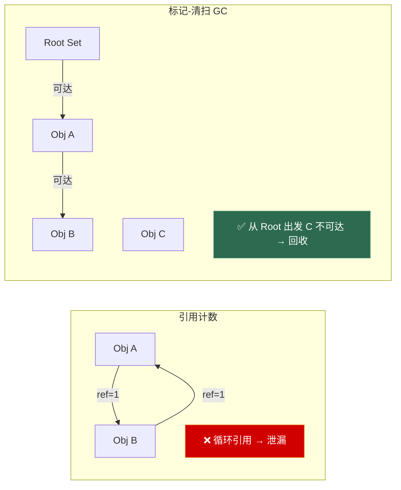
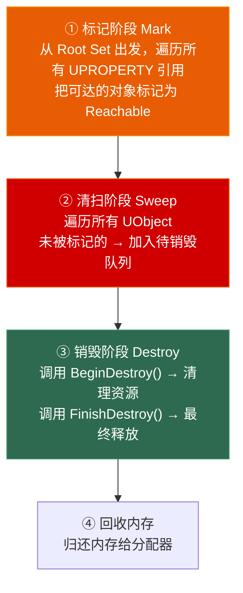
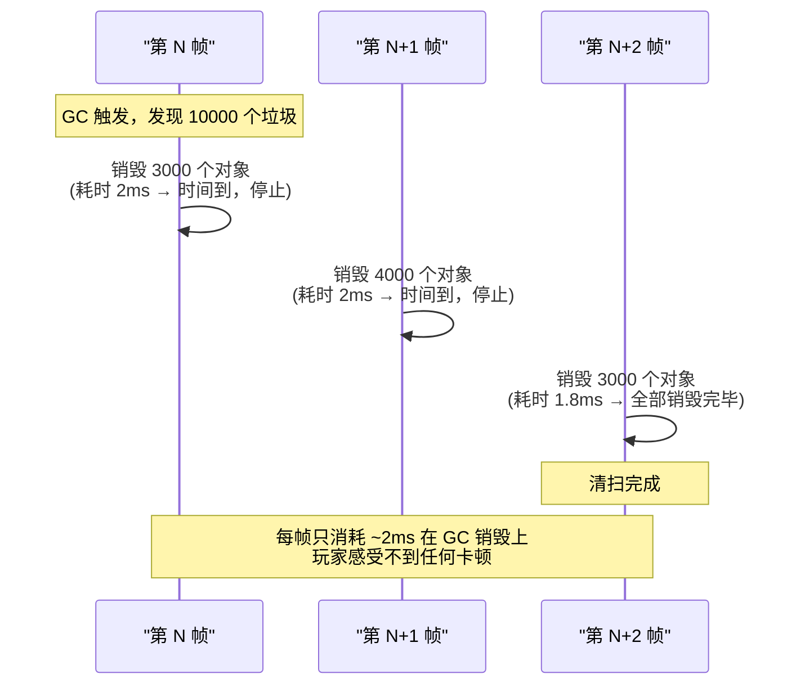
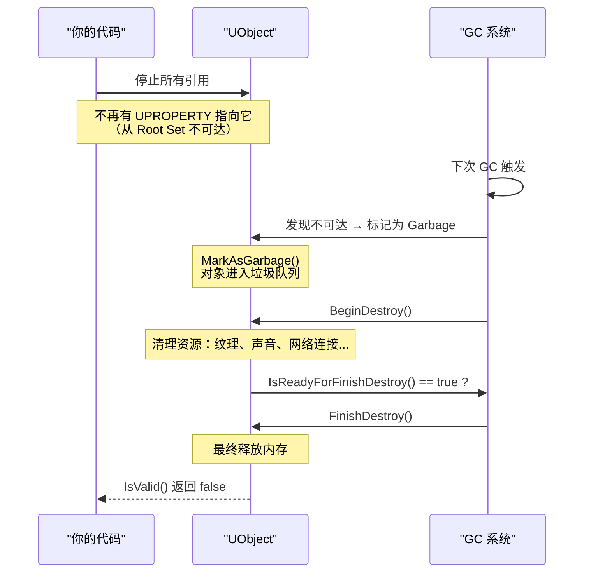
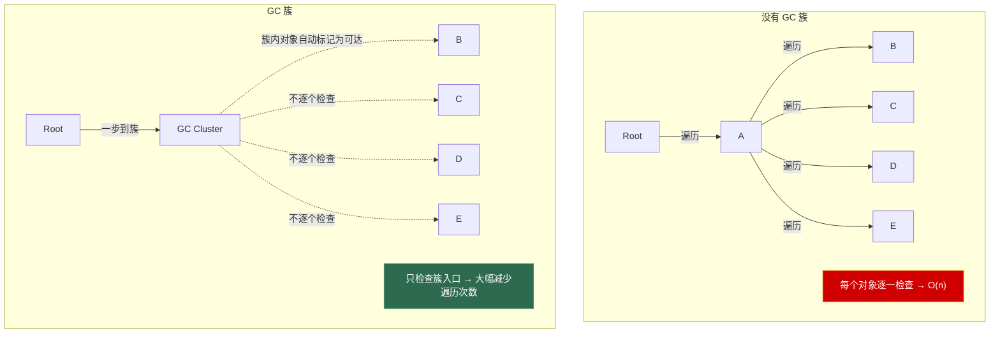

# 第三章 UObject 与 GC：掌控对象的生与死

> **一句话理解**：UE 的 GC 不是 Java/C# 那种"后台默默运行你完全不用管"的 GC——你需要精确理解**什么引用会被 GC 看见、什么时候 GC 会跑、以及怎么防止 GC 误删你的对象**。在 UE 中，GC 是一个你可以预测、可以控制、但也必须尊重的系统。

---

## 3.1 概念直觉 —— 为什么 UE 不用 `shared_ptr` 管理 UObject？

### 3.1.1 先看标准 C++ 的方案：引用计数

```cpp
// 标准 C++ 的 shared_ptr：引用计数
std::shared_ptr<Texture> tex1 = std::make_shared<Texture>("Hero.png");
std::shared_ptr<Texture> tex2 = tex1;  // 引用计数 = 2
tex1.reset();                           // 引用计数 = 1
tex2.reset();                           // 引用计数 = 0 → 释放
// 问题：循环引用 → 泄漏
```

引用计数的**致命缺陷在游戏引擎中尤为突出**——循环引用。想象：

```
Level → 持有 → Actor → 持有 → Component → 持有 → 指向 Level 的指针
```

如果全用引用计数，这构成一个环——谁都不会被释放。你可以用 `weak_ptr` 打破循环，但大型游戏中有**几万个对象和几十万条引用关系**，手工分析循环引用是不可能的。

### 3.1.2 UE 的方案：标记-清扫 GC



标记-清扫 GC 的核心思想：**不求追踪每条引用的增减，而是定期从"根"出发，扫描所有可达对象。不可达的 = 垃圾，回收。**

---

## 3.2 GC 全流程 —— 从标记到清扫

### 3.2.1 四个阶段



### 3.2.2 标记阶段 —— GC 怎么知道谁引用了谁？

```cpp
// GC 的标记过程（概念代码，不是真实实现）：
void GarbageCollector::Mark()
{
    // 第一步：从 Root Set 出发
    TArray<UObject*> RootSet = GetRootSet();
    // Root Set 包含：
    //   - UGameInstance
    //   - UWorld（当前关卡）
    //   - 所有显式调用 AddToRoot() 的对象
    //   - 所有加载到内存中的 UPackage

    TArray<UObject*> ReachableObjects;

    for (UObject* Root : RootSet)
    {
        MarkRecursive(Root, ReachableObjects);
    }
}

void GarbageCollector::MarkRecursive(UObject* Obj, TArray<UObject*>& OutReachable)
{
    if (OutReachable.Contains(Obj)) return;  // 已标记，跳过
    OutReachable.Add(Obj);

    // 遍历这个对象的所有 UPROPERTY
    // GC 通过反射系统知道每个 UPROPERTY 的偏移量和类型
    for (FProperty* Property : GetClassProperties(Obj->GetClass()))
    {
        if (FObjectProperty* ObjProp = CastField<FObjectProperty>(Property))
        {
            // 这是一个 UObject* 类型的属性
            UObject* ReferencedObj = ObjProp->GetObjectPropertyValue(Obj);
            if (ReferencedObj)
            {
                MarkRecursive(ReferencedObj, OutReachable);
            }
        }
        else if (FArrayProperty* ArrayProp = CastField<FArrayProperty>(Property))
        {
            // 这是一个 TArray<UObject*> 类型的属性
            FScriptArrayHelper Helper(ArrayProp, Property->GetValuePtr(Obj));
            for (int i = 0; i < Helper.Num(); i++)
            {
                UObject* Element = *(UObject**)Helper.GetRawPtr(i);
                if (Element) MarkRecursive(Element, OutReachable);
            }
        }
        // else: int, float, FString... 不包含 UObject 引用，跳过
    }
}
```

> 💡 **深入一步**：上面的"反射遍历每个属性"是为了帮助理解。在真实引擎实现中，GC 标记的性能要快得多——**引擎在 UHT 代码生成阶段就为每个 UClass 预计算了 `FGCReferenceTokenStream`（GC 令牌流）**。这是一个紧凑的字节流，编码了"这个类有哪些 UObject* 成员、分别在什么偏移量"。标记时，GC 无需跑 `TFieldIterator<FProperty>` 这样的反射遍历——它直接解码令牌流，按偏移量读指针，达到了接近硬编码的性能。这也是 Ch2 中 UHT 代码生成的核心价值之一。

### 3.2.3 关键：什么算"引用"？

```cpp
UCLASS()
class UMyObject : public UObject
{
    GENERATED_BODY()

    // ==== 以下引用会被 GC 追踪 ====

    UPROPERTY()
    UObject* SafeRef;                    // ✓ UPROPERTY + UObject* → GC 能看见

    UPROPERTY()
    TArray<UObject*> SafeArray;          // ✓ TArray<UObject*> + UPROPERTY → GC 遍历每个元素

    UPROPERTY()
    TMap<int, UObject*> SafeMap;         // ✓ TMap 的 Value 是 UObject* → GC 追踪

    UPROPERTY()
    TSet<UObject*> SafeSet;

    // ==== 以下引用 GC 看不见！====

    UObject* NakedRef;                   // ✗ 没有 UPROPERTY → GC 不知道这里引用了对象

    TArray<UObject*> NakedArray;         // ✗ 同上

    // 在函数栈上的引用
    void SomeFunction()
    {
        UObject* LocalRef = LoadObject<UObject>(...);
        // 如果 LocalRef 是最后一个引用，函数返回后对象立即变得"不可达"
        // 下一次 GC 时被回收
    }
};
```

> 💡 **核心规则**：GC 不是通过"扫描内存"来找引用——它是**通过反射系统读取 UPROPERTY 元数据**来确定引用关系的。没有 UPROPERTY = 在 GC 眼中不存在。

---

## 3.3 GC 的触发时机 —— 它什么时候跑？

```cpp
// GC 不是实时在后台跑的！它是时机触发的：

// 触发条件（满足任一即触发）：
// 1. 内存超过阈值 —— 默认约 128MB 的 UObject 分配后触发
// 2. 关卡切换（LoadMap）—— 旧关卡的对象需要清理
// 3. 手动调用 —— TryCollectGarbage() 或 ForceGarbageCollection()
// 4. 编辑器中 —— PIE 结束、Asset 重新加载
// 5. 低内存警告 —— 平台内存紧张时

// 你可以在代码中手动触发 GC：
GEngine->ForceGarbageCollection(true);  // true = 完全清扫（包括长期存活的）

// 也可以请求 GC 但不强制立即执行：
GEngine->TryCollectGarbage(true);

// ⚠️ 不要在 Tick 中频繁调 GC！一般在关卡切换、大型资源释放后调用。
```

### 3.3.1 面试加码：增量清扫（Incremental Purge）—— 为什么 GC 不掉帧？

> ⚠️ **大厂高频面试题**：「如果一帧内要销毁 1 万个对象，UE 是怎么做到不掉帧的？」

如果 GC 的清扫/销毁阶段在一帧内完成所有工作，当待销毁对象数量巨大时（如关卡切换、卸载大型地图），帧时间会远远超过 16.6ms，导致明显卡顿。UE 的解决方案是 **Incremental Purge（增量清扫）**：

```cpp
// 核心机制：时间片驱动（Time-Sliced）
// 引擎内部通过 IncrementalPurgeGarbage() 实现

// 简化版概念代码：
void IncrementalPurgeGarbage(bool bUseTimeLimit, float TimeLimit)
{
    static TArray<UObject*> PendingDestroyObjects;  // 待销毁队列

    double StartTime = FPlatformTime::Seconds();

    while (PendingDestroyObjects.Num() > 0)
    {
        UObject* Obj = PendingDestroyObjects.Pop();
        Obj->ConditionalBeginDestroy();  // 销毁一个对象

        // 关键：每销毁一个对象后检查时间
        if (bUseTimeLimit &&
            FPlatformTime::Seconds() - StartTime > TimeLimit)
        {
            // 本帧时间用完了！剩下的下一帧继续
            break;
        }
    }
    // 如果队列没清空，下一帧 World::Tick 中会继续调用此函数
}

// 引擎默认配置：
// - IncrementalBeginDestroyEnabled = true（默认开启）
// - 单帧最大耗时约 2ms（可配置：GGarbageCollectionTimeLimit）
// - 首次 GC 触发后，每帧都调用 IncrementalPurgeGarbage 直到队列清空
```



> 💡 **一句话总结**：「UE 的 GC 清扫是**分帧执行**的。通过时间片机制，每帧只花约 2ms 在对象销毁上，剩余队列下一帧继续。这保证了即使一次性回收上万个对象，帧率也始终稳定。」

---

## 3.4 UObject 的创建 —— 三条路径

### 3.4.1 NewObject —— 创建"纯数据"UObject

```cpp
// NewObject：创建不挂载到关卡中的 UObject
// 适用场景：数据资产、运行时临时对象、子系统

// 最简形式：
UMyObject* Obj = NewObject<UMyObject>();

// 指定 Outer（GC 的容器概念）：
UMyObject* Obj = NewObject<UMyObject>(OuterPackage);

// 指定类（运行时动态决定类型）：
UClass* DynamicClass = LoadClass<UMyObject>(nullptr, TEXT("/Game/MyBP.MyBP_C"));
UMyObject* Obj = NewObject<UMyObject>(GetTransientPackage(), DynamicClass);

// ⚠️ 注意：蓝图类没有 C++ 的 StaticClass()！
// 蓝图类在运行时是动态生成的 UBlueprintGeneratedClass 实例。
// 要使用蓝图类创建对象，必须通过 TSubclassOf 或 LoadClass 获取其 UClass*：

// 方式 1：通过 TSubclassOf（成员变量，编辑器中指定）
UPROPERTY(EditAnywhere)
TSubclassOf<UMyObject> ObjectClass;  // 编辑器中可选择 "BP_MyObject"

UMyObject* Obj = NewObject<UMyObject>(this, ObjectClass);

// 方式 2：通过 LoadClass（运行时按路径加载）
TSubclassOf<UMyObject> LoadedClass = LoadClass<UMyObject>(
    nullptr, TEXT("/Game/Blueprints/BP_MyObject.BP_MyObject_C"));
//                                                       ↑ _C 后缀 = 类本身
UMyObject* Obj2 = NewObject<UMyObject>(this, LoadedClass);
```

### 3.4.2 SpawnActor —— 创建"关卡中的实体"

```cpp
// SpawnActor：创建 Actor 并注册到关卡中
// 适用场景：角色、道具、子弹——任何需要在关卡中存在的对象

// 最简形式：
AMyActor* Actor = GetWorld()->SpawnActor<AMyActor>();

// 指定位置和旋转：
FVector Location(0, 0, 100);
FRotator Rotation(0, 90, 0);
AMyActor* Actor = GetWorld()->SpawnActor<AMyActor>(Location, Rotation);

// 指定 SpawnParameters：
FActorSpawnParameters Params;
Params.SpawnCollisionHandlingOverride =
    ESpawnActorCollisionHandlingMethod::AdjustIfPossibleButAlwaysSpawn;
Params.Owner = this;
Params.Instigator = GetInstigator();
AMyActor* Actor = GetWorld()->SpawnActor<AMyActor>(Location, Rotation, Params);

// SpawnActor 是同步阻塞操作，返回时 Actor 已完全构造好（包括组件初始化、
// 蓝图 Construction Script、PostInitializeComponents、BeginPlay 全部执行完毕）

// ==== SpawnActor 内部完整生命周期链条（大厂面试高频） ====
//
// 1. NewObject<AMyActor>()           — 分配内存，构造 C++ 对象
// 2. InitProperties()                — 用默认值初始化所有 UPROPERTY
// 3. PostActorCreated()              — C++ 诞生回调（对象存在了，但还不知道自己是谁）
// 4. PostInitializeComponents()      — 所有组件初始化完毕
//    （关键：此时 C++ 组件已完全构建并初始化，可以安全访问）
// 5. 执行蓝图 Construction Script    — 通过 AActor::OnConstruction() 调用蓝图构造脚本
//    （架构逻辑：引擎必须等组件 Ready 之后才执行蓝图构造脚本——
//     否则策划在构造脚本中获取 C++ 组件、修改属性或动态挂载子组件时，
//     会因 C++ 组件尚未初始化而导致空指针或资产数据丢失崩溃）
// 6. OnActorSpawned() (FActorSpawnedDelegate) — 广播 Actor 已生成
// 7. BeginPlay()                     — 游戏开始（关卡开始或生成后首帧 Tick 前）
//
// 常规 SpawnActor 返回时机：全部 7 步执行完毕后返回（同步阻塞）
// → 返回时 Actor 已完成组件初始化、构造脚本、BeginPlay
// → 你拿到的是一个完整的成型对象，所有蓝图属性已生效
//
// ==== 延迟生成 SpawnActorDeferred（唯一在步骤间返回的路径）====
// 只有使用 SpawnActorDeferred 时，引擎才会在步骤 3 和 4 之间提前返回：
//   AMyActor* Actor = GetWorld()->SpawnActorDeferred<AMyActor>(...);
//   // ↑ 此时 PostActorCreated 已调用，但 PostInitializeComponents 尚未执行！
//   // 你可以在这里手动设置属性，作为后续初始化的"初始参数"
//   Actor->CustomParameter = SomeValue;
//   Actor->FinishSpawning(Transform);  // 此时才执行 PostInitComponents → Construction Script → BeginPlay
//
// 面试陷阱：面试官常问"SpawnActor 返回时 BeginPlay 执行了吗？"
// 标准答案：常规 SpawnActor → 已执行；SpawnActorDeferred → 未执行，等 FinishSpawning
```
```

### 3.4.3 CreateDefaultSubobject —— 创建"内置组件"

```cpp
// CreateDefaultSubobject：在 Actor 的构造函数中创建子对象
// 适用场景：Actor 的组件——每个实例都有、随 Actor 一起创建/销毁

UCLASS()
class AMyActor : public AActor
{
    GENERATED_BODY()

public:
    AMyActor()
    {
        // 在构造函数中创建组件
        // 第一个参数：组件名（必须唯一，用于编辑器识别）
        MeshComponent = CreateDefaultSubobject<UStaticMeshComponent>(TEXT("Mesh"));
        RootComponent = MeshComponent;  // 通常第一个组件设为 RootComponent

        HealthComponent = CreateDefaultSubobject<UHealthComponent>(TEXT("Health"));
    }

private:
    UPROPERTY(VisibleAnywhere)
    UStaticMeshComponent* MeshComponent;

    UPROPERTY(VisibleAnywhere)
    UHealthComponent* HealthComponent;
};

// CreateDefaultSubobject 的特点：
// 1. 只能在构造函数中调用
// 2. 创建的组件会被序列化到 Actor 的数据中（保存/加载保留）
// 3. 组件名字是唯一的——不能在同一 Actor 中创建两个同名的 Component
```

### 3.4.4 三兄弟对比

| | NewObject | SpawnActor | CreateDefaultSubobject |
|---|---|---|---|
| **创建什么** | 任意 UObject | 只能 AActor 及其子类 | 任意 UObject（通常是 Component） |
| **调用位置** | 任意位置 | 任意位置（需要有效的 World） | **只能在构造函数中** |
| **Outer** | 手动指定 | 自动设为当前 Level | 自动设为 this（Actor） |
| **生命周期** | 跟随 Outer（或被 GC 回收） | 跟随 Level（Destroy 后等 GC） | 跟随所属 Actor |
| **网络复制** | 不参与（除非是 Replicated 的 UObject） | 参与（可 Replicate） | 参与（作为 Actor 的一部分） |
| **典型场景** | 数据资产、临时计算结果、子系统 | 角色、道具、子弹 | Mesh、碰撞体、自定义 Component |

---

## 3.5 UObject 的销毁 —— 一条不能回头的路

### 3.5.1 销毁时间线



### 3.5.2 Actor 的专用路径：Destroy()

```cpp
// Actor 有额外的销毁逻辑：
void AMyActor::OnSomeEvent()
{
    // 请求销毁
    Destroy();
    // ⚠️ Destroy() 返回后，Actor 并没有立即被释放！
    // 它只是被标记为 Garbage（通过 MarkAsGarbage()）
    // 真正的释放要等 GC 清扫（参见 3.3.1 的 Incremental Purge）

    // 之后的多帧内：
    // - Actor 停止 Tick
    // - Actor 从 Level 中移除
    // - 等待 GC 分帧清扫
}

// 销毁过程中的关键回调：
void AMyActor::EndPlay(const EEndPlayReason::Type Reason)
{
    Super::EndPlay(Reason);
    // Destroy() 后立即调用
    // 在这里做：停止音效、取消定时器、通知关联系统...
    // BeginPlay 的对偶操作
}

void AMyActor::BeginDestroy()
{
    Super::BeginDestroy();
    // GC 准备删除时调用
    // 在这里做：释放非 UObject 资源（文件句柄、线程...）
}

// ⚠️ Destroy() 后指针仍然不是 nullptr！
void AMyActor::SomeFunction()
{
    Destroy();
    UE_LOG(LogTemp, Log, TEXT("%s"), *GetName());  // 还能用！对象没释放
    // 但被标记为 Garbage 后，IsValid() 已经返回 false
    // 并且 GC 清扫后，这就是野指针了
}

// 正确做法：Destroy() 后立即 return
void AMyActor::Die()
{
    Destroy();
    return;  // ← 必须在 Destroy() 后立即结束函数
}
```

> ⚠️ **工业界常见陷阱——幽灵对象（Ghost Object）**：虽然你调了 `Destroy()` 且 C++ 逻辑已经 return，但如果该 Actor 的指针被存储在了**非 UPROPERTY 的全局容器**（如第三方库的回调注册表、裸指针的静态 TArray、`std::vector<AActor*>` 等）中，GC 无法追踪这些引用，对象在 GC 清扫后仍然不存在于 GC 的知识体系中，但这些容器中的指针变成了**野指针**。其他系统通过野指针调用 Actor → 随机崩溃。解决：要么用 `UPROPERTY() TArray<AActor*>`（GC 可追踪），要么销毁时手动从这些容器中移除。

```

### 3.5.3 非 Actor 的 UObject：MarkAsGarbage()

```cpp
// 对于不是 Actor 的 UObject，不能调 Destroy()（那是 AActor 专属）
// 正确的停止方式：

UMyObject* Obj = NewObject<UMyObject>();

// 方式 1：让 GC 来处理（推荐）
// 清除所有 UPROPERTY 引用 → GC 下次运行时自动回收
Obj = nullptr;  // 如果这是唯一的 UPROPERTY 引用

// 方式 2：手动标记为垃圾（UE5 标准写法）
// 将对象注册到 GC 的垃圾队列，等待 GC 分帧清扫
Obj->MarkAsGarbage();
Obj = nullptr;  // 置空自己的引用

// ⚠️ 旧版 UE4 使用 ConditionalBeginDestroy()——那是引擎内部调用的，
// 外部代码不应直接调用。在 UE5 中，正确的外部接口是 MarkAsGarbage()

// 方式 3：加入 Root 后再移除（精确控制生命周期的场景）
Obj->AddToRoot();       // 标记为 GC Root，永远不会被回收
// ... 使用对象 ...
Obj->RemoveFromRoot();  // 不再保护，GC 下次运行时回收
```

---

## 3.6 IsValid() vs nullptr —— 面试必考的差异

### 3.6.1 为什么不能只用 nullptr？

```cpp
// 标准 C++：nullptr 检查就够了
std::shared_ptr<MyClass> ptr = /* ... */;
if (ptr != nullptr) { ptr->DoSomething(); }  // OK

// UE C++：nullptr 检查不够！
UObject* Obj = /* ... */;

// 场景：Actor 被 Destroy() 了，但指针没置空
AActor* Actor = GetCachedActor();
Actor->Destroy();  // Actor 被标记为 Garbage
// Actor 指针仍然不是 nullptr！它指向的内存还在（等 GC）
// 但 Actor 已经不能正常使用了

if (Actor != nullptr)  // ← 返回 true！但对象已经"死了"
{
    Actor->DoSomething();  // 可能崩溃，也可能悄悄失败
}

// ✓ 正确：用 IsValid()
if (IsValid(Actor))  // 检查 nullptr + 检查 Garbage 标记
{
    Actor->DoSomething();  // 安全
}
```

### 3.6.2 IsValid() 检查什么？

```cpp
// IsValid() 的简化实现（概念，UE5 实际更复杂）：
bool IsValid(const UObject* Test)
{
    // 1. nullptr 检查
    if (Test == nullptr) return false;

    // 2. Garbage 标记检查（对象是否已被标记为垃圾）
    //    UE5 中不再使用 RF_BeginDestroyed 这个 ObjectFlag，
    //    而是检查 GUObjectArray 中该对象内部索引的 EInternalObjectFlags::Garbage
    if (Test->HasAnyInternalFlags(EInternalObjectFlags::Garbage))
        return false;
    // 注意：UE5.0+ 彻底废弃了 PendingKill，用 MarkAsGarbage() 替代

    // 3. 全局表索引验证
    //    检查对象在 GUObjectArray 中的索引是否仍然有效
    //    （对象可能已经从全局注册表中移除）
    if (!GUObjectArray.IsValid(Test))
        return false;

    return true;
}

// 使用：
AActor* Actor = GetSomeActor();

// 销毁前
IsValid(Actor);   // true
Actor->Destroy();  // 内部调用 MarkAsGarbage()，设置 Garbage 标记
IsValid(Actor);   // false ← 即使指针不为 nullptr！

// ⚠️ 性能注意：IsValid() 比 nullptr 检查慢（查 GUObjectArray 索引）
// 不需要在每帧 Tick 中对每个指针调 IsValid()
// 只在"对象可能已被销毁"的场景使用
```

### 3.6.3 什么时候用 IsValid()，什么时候用 nullptr？

```cpp
// 场景 1：你自己销毁了对象 → 把指针置空，以后用 nullptr
AActor* MyActor = SpawnActor(...);
// ...
MyActor->Destroy();
MyActor = nullptr;  // 手动置空
// 后续：if (MyActor != nullptr) ← 够用且更快

// 场景 2：你不知道对象是否被销毁 → 用 IsValid()
// 典型：缓存的弱引用、其他系统传来的指针、异步回调时的 this
void UMyComponent::OnAsyncComplete()
{
    // this 可能在异步过程中被 Destroy 了
    if (!IsValid(this)) return;
    // 安全使用 this
}

// 场景 3：每帧 Tick → 缓存结果，不要每帧调 IsValid
void UMyComponent::Tick(float DeltaTime)
{
    // ✗ 不好：
    if (IsValid(CachedActor)) { CachedActor->DoSomething(); }

    // ✓ 更好：CachedActor 销毁时通知你，把指针置空
    //     Tick 中只需要 nullptr 检查
}
```

---

## 3.7 弱引用 —— TWeakObjectPtr 与 FObjectPtr

### 3.7.1 为什么需要弱引用？

```cpp
// 场景：你缓存了一个 Actor 的引用，但你不拥有它
// 它可能被销毁（关卡切换、敌人死亡、GC...）

// ✗ 用 UPROPERTY 保护的原始指针：
UPROPERTY()
AActor* CachedTarget;  // 这会让 GC 认为 Target 有引用 → 不会被回收
// → 问题：Target 该销毁时没销毁 → 泄漏 / 逻辑错误

// ✓ 用 TWeakObjectPtr：
TWeakObjectPtr<AActor> CachedTarget;  // 不阻止 GC 回收
// ...
if (CachedTarget.IsValid())
{
    CachedTarget->DoSomething();
}
```

### 3.7.2 TWeakObjectPtr API

```cpp
// 设置
TWeakObjectPtr<AActor> WeakActor = SomeActor;

// 检查——三种方式：
if (WeakActor.IsValid())           // 检查是否 Stale + 检查 Garbage 标记
if (WeakActor.IsStale())           // 只检查对象索引是否已失效（不关心 Garbage）
if (WeakActor.Get())               // 返回原始指针，可能为 nullptr

// 使用：
if (AActor* Actor = WeakActor.Get())
{
    if (IsValid(Actor))  // 双重保险
    {
        Actor->DoSomething();
    }
}

// 重置：
WeakActor.Reset();  // 变回空状态
```

### 3.7.3 TWeakObjectPtr vs TObjectPtr (UE5.1+)

```cpp
// UE5.1 引入了 TObjectPtr，作为 UObject* 的"增强版"
// 但关键设计是：它在不同构建配置下的行为完全不同

// ==== 编辑器构建（Editor Build）====
// TObjectPtr 是一个包装类，提供了：
// - 惰性加载（Lazy Loading）：通过路径字符串延迟解析资产引用
// - 非法访问截获：如果访问了 Garbage 标记的对象，编辑器会报错而不是静默崩溃
// - 资产路径追踪：你可以在编辑器中看到引用链

// ==== 打包构建（Packaged/Shipping Build）====
// TObjectPtr<T> 在任何构建配置下始终是一个纯正的 C++ 模板类——从未被宏展开抹除
// 它在 Shipping 中实现"零开销"的核心机制是模板特化：
// - Shipping 下，TObjectPtr<T> 内部仅持有一个原始的 T* 裸指针
// - 通过大量 forceinline 的隐式转换操作符，编译后生成的机器码与裸指针完全一致
// - 这是编译期优化（模板特化 + 内联），不是预处理器宏替换
// → 零运行时开销！和原始指针性能完全一致

UPROPERTY()
TObjectPtr<AActor> TargetActor;  // UE5.1+ 推荐
// 编辑器：安全包装 + 懒加载
// Shipping：等价于 AActor*，零开销

// TWeakObjectPtr 的目的：弱引用，不阻止 GC
TWeakObjectPtr<AActor> WeakTarget;  // 不阻止 GC

// 总结：
// - 强引用（拥有关系）→ UPROPERTY + TObjectPtr<AActor>（UE5.1+）或 AActor*
// - 弱引用（缓存关系）→ TWeakObjectPtr<AActor>
// - 非 UObject → TSharedPtr / TWeakPtr
```

---

## 3.8 GC 簇 —— 性能优化的核武器

### 3.8.1 问题：标记阶段太慢了

```cpp
// 一个大型关卡中可能有 10 万+ UObject
// 标记阶段需要遍历所有可达对象

// 但大部分对象是"同生共死"的：
// - 一个 UStaticMesh 的所有 LOD 数据
// - 一个 UMaterial 的所有表达式节点
// - 一个 SkeletalMesh 的所有材质槽

// 如果这些对象被分到同一个 GC 簇（Cluster），
// GC 标记时只需要检查簇的"入口"——内部对象自动标记为可达。
```

### 3.8.2 GC 簇的概念



```cpp
// 作为普通开发者，你通常不需要手动管理 GC 簇
// 但理解这个概念有助于理解 GC 性能

// 让对象加入 GC 簇（引擎内部使用，你很少需要手动调）：
MyObject->AddToCluster(ClusterRoot);

// 创建簇（引擎内部使用）：
UObject* Cluster = GCClusterSystem::CreateCluster(ClusterRootObj);

// ⚠️ 自定义 UClass 想要作为簇的根节点，需要显式开启资格：
UCLASS()
class UMyAsset : public UObject
{
    GENERATED_BODY()

public:
    // 你的自定义类默认不能成为簇根。
    // 要让它具备资格，必须重写此方法：
    virtual bool CanBeClusterRoot() const override { return true; }
};

// 但是——不要盲目开启！
// 簇的价值体现在"一个根下有大量子节点"的场景（如 UStaticMesh 的 LOD 数据、
// UMaterial 的表达式节点——成百上千个子对象只需要一次标记）。
// 如果你的自定义 UObject 下面只有 2-3 个子对象，开簇反而增加了
// 簇维护的内存开销和管理复杂度，得不偿失。

// 实际项目中，关注这些就够了：
// - 静态网格、材质、纹理 → 引擎自动放进簇了，性能和内存都很好
// - 你的自定义 UObject → 绝大多数情况默认即可，不要轻易重写 CanBeClusterRoot()
// - 性能敏感场景 → 优先考虑用 ObjectPool 复用 UObject，而不是频繁创建/销毁
```

---

## 3.9 常见陷阱与排查

### 3.9.1 陷阱 1：忘写 UPROPERTY → 野指针

```cpp
// 这是 UE C++ 中最致命的 bug 类别
UCLASS()
class UMyComponent : public UActorComponent
{
    GENERATED_BODY()

    // 你："我只是想缓存一个资产引用"
    UPROPERTY()
    UMyAsset* SafeAsset;     // ✓ GC 知道

    UMyAsset* UnsafeAsset;   // ✗ GC 不知道！
    // 结果：UnsafeAsset 指向的对象被 GC 回收
    //      → UnsafeAsset 变成野指针
    //      → 下次访问 → 崩溃（时机随机，难以复现和调试）

public:
    void CacheAsset(UMyAsset* Asset)
    {
        SafeAsset = Asset;   // 安全
        UnsafeAsset = Asset; // 定时炸弹
    }
};
```

**排查方法**：

```cpp
// 1. 启用 GC 日志
// 启动参数：-LogGarbage
// 会输出每次 GC 回收了哪些对象

// 2. 在可疑对象的 BeginDestroy() 中打断点
void UMyAsset::BeginDestroy()
{
    Super::BeginDestroy();
    // 在这里打断点 → 看调用栈 → 谁触发了 GC？
    // 如果对象不该被回收，说明有 UPROPERTY 遗漏
}

// 3. 使用 TWeakObjectPtr 而不是裸指针
TWeakObjectPtr<UMyAsset> CachedAsset;  // 至少能用 IsValid() 检测
// 配合断言在早期捕获：
checkf(CachedAsset.IsValid(), TEXT("Asset was garbage collected!"));
```

### 3.9.2 陷阱 2：在构造函数中做太多事

```cpp
UCLASS()
class UMyComponent : public UActorComponent
{
    GENERATED_BODY()

public:
    UMyComponent()
    {
        // ✗ 错误：构造函数中不能访问 Outer/Actor
        // AActor* Owner = GetOwner();  // 返回 nullptr！还没设置

        // ✗ 错误：构造函数中不能 SpawnActor
        // GetWorld()->SpawnActor<...>();  // World 可能还不可用

        // ✓ 构造函数中只做：
        //   - 设置默认值
        //   - CreateDefaultSubobject
        //   - 设置组件属性（PrimaryComponentTick 等）
        PrimaryComponentTick.bCanEverTick = false;
    }

    // ✓ 需要 Outer/World 的逻辑放 BeginPlay：
    virtual void BeginPlay() override
    {
        Super::BeginPlay();
        AActor* Owner = GetOwner();  // 此时正确
    }
};
```

### 3.9.3 陷阱 3：异步回调中的 this 已失效

```cpp
UCLASS()
class UMyComponent : public UActorComponent
{
    GENERATED_BODY()

    void LoadAssetAsync()
    {
        // ✗ 危险：Lambda 捕获 this
        FStreamableManager& Manager = UAssetManager::GetStreamableManager();
        Manager.RequestAsyncLoad(AssetPath, [this]() {
            // this 可能在异步加载过程中被 Destroy 了！
            // → 崩溃
            OnAssetLoaded();
        });

        // ✓ 安全写法：用 TWeakObjectPtr（必须且只能用弱引用！）
        TWeakObjectPtr<UMyComponent> WeakThis(this);
        Manager.RequestAsyncLoad(AssetPath, [WeakThis]() {
            if (WeakThis.IsValid())
            {
                WeakThis->OnAssetLoaded();
            }
        });

        // ✗ 绝对禁止：异步回调中捕获裸指针 [this] + IsValid() 守卫
        // Manager.RequestAsyncLoad(AssetPath, [this]() {
        //     if (!IsValid(this)) return;  // ← 致命错误！
        //     OnAssetLoaded();
        // });
        //
        // 为什么这是致命毒药？
        // IsValid() 能安全检测 nullptr 和 Garbage 标记，但绝对不能检测
        // "内存已被 GC 彻底释放"的情况。如果异步加载耗时很长，this 指向的
        // 对象已在前面某帧被 GC 清扫（Sweep）——此时 this 是纯粹野指针，
        // 一旦尝试读取 this->HasAnyInternalFlags()（IsValid 内部），
        // 操作系统立即判定非法内存访问 → Access Violation → 闪退。
        //
        // 异步回调必须且只能使用 TWeakObjectPtr 捕获！
    }
};
```

### 3.9.4 陷阱 4：AddToRoot 后忘记 RemoveFromRoot

```cpp
// AddToRoot 是防止对象被 GC 的最强手段
// 但如果你忘了 RemoveFromRoot → 内存泄漏

UMyObject* Obj = NewObject<UMyObject>();
Obj->AddToRoot();  // "这个对象很重要，GC 别碰它"

// ... 使用对象 ...

// ✗ 如果忘记这行 → 对象永远不会被回收 → 泄漏！
Obj->RemoveFromRoot();

// ⚠️ AddToRoot 不是银弹——它能阻止回收，但也阻止了正常的清理流程
// 只在以下场景使用：
// 1. 对象被 C++ 非 UObject 代码持有（裸指针/static/全局变量）
// 2. 对象需要在关卡切换后仍然存活
// 一般用 UPROPERTY 更安全
```

---

## 3.10 30 秒速答

> **面试被问："UE 的 GC 是怎么工作的？怎么防止一个 UObject 被 GC 误删？"**

UE 使用**标记-清扫 GC**，不是引用计数。核心流程：

1. **标记阶段**：从 Root Set（UGameInstance、UWorld、显式 AddToRoot 的对象）出发，通过 UPROPERTY 记录的引用关系，递归标记所有可达对象。
2. **清扫阶段**：未被标记的 UObject 被视为垃圾，进入销毁队列。
3. **销毁阶段**：依次调用 BeginDestroy() → FinishDestroy()，释放内存。

**防止对象被误删的关键**：确保从 Root Set 到你的对象有一条 **UPROPERTY 保护的引用链**。如果一个 `UObject*` 没有 UPROPERTY，GC 看不见它——这是最常见的崩溃原因。

**三个安全等级**：
- 强引用：`UPROPERTY() UObject*` —— GC 不会回收
- 弱引用：`TWeakObjectPtr<T>` —— 不阻止 GC，可以安全检测
- 裸指针：`UObject*` 不加 UPROPERTY —— 定时炸弹

---

> 📚 **下一章**：[Ch4 容器与字符串体系](../04_containers_strings/) — TArray/TMap/TSet API 对照 STL，FString vs FName vs FText 的决策模型，字符串编码与跨平台处理。

> 💡 **回归本系列的底层基础**：
> - C++ 智能指针（shared_ptr/weak_ptr）的引用计数原理 → 见 [C++ 第二章：智能指针](../../cpp_deep_dive/02_pointers_and_smart_pointers/)
> - C++ 内存模型 → 见 [C++ 第一章：内存模型](../../cpp_deep_dive/01_memory_model/)
