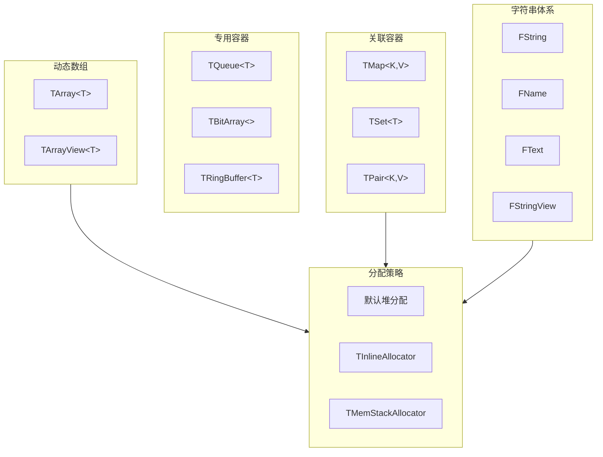
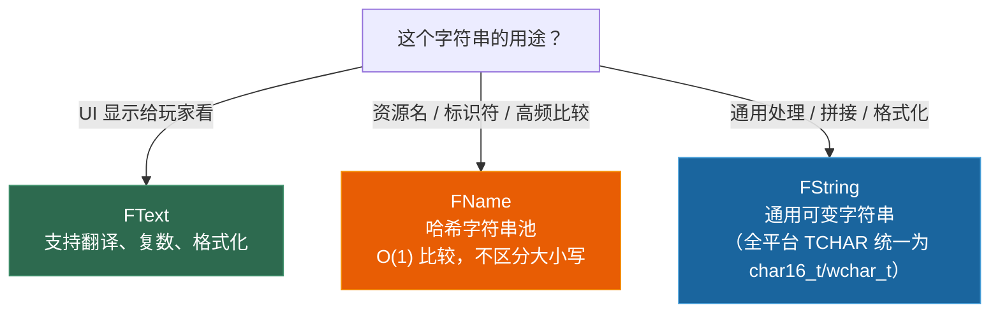

# 第四章 容器与字符串：从 `std::vector` 到 `TArray`，从 `std::string` 到 `FString`

> **一句话理解**：UE 的容器和字符串不是"性能更好的 STL"，而是为**编辑器集成、序列化、GC 追踪和跨平台一致性**从头设计的平行体系。API 看起来很相似，但关键细节不同——用错了不会编译报错，但会在运行时给你惊喜。

---

## 4.1 概念直觉 —— 为什么要重新发明容器？

### 4.1.1 Ch1 的回顾 + 本章的定位

Ch1 解释了"为什么"——UE 诞生于 1998 年，STL 在当年各平台实现质量参差不齐。本章聚焦"怎么用"：**你脑中已经有 `std::vector` / `std::unordered_map` / `std::string` 的使用经验，本章的目标是帮你建立到 UE 容器的精确映射**。

### 4.1.2 UE 容器库全景



---

## 4.2 TArray —— 你每天写 100 次的容器

### 4.2.1 API 对照：std::vector → TArray

```cpp
// ===== 创建与初始化 =====
// std::vector
std::vector<int> vec = {1, 2, 3};
std::vector<int> vec2(100, 42);       // 100 个 42
std::vector<int> vec3(vec2);          // 拷贝

// TArray
TArray<int> Arr = {1, 2, 3};          // ✓ 支持 initializer_list
TArray<int> Arr2;
Arr2.Init(42, 100);                   // 100 个 42（注意顺序：值在前，数量在后）
TArray<int> Arr3(Arr2);               // 拷贝

// ===== 添加元素 =====
// std::vector
vec.push_back(4);
vec.emplace_back(Args...);

// TArray
Arr.Add(4);                            // = push_back
Arr.Emplace(Args...);                  // = emplace_back
Arr.Insert(42, 0);                     // 在索引 0 处插入
Arr.Append({5, 6, 7});               // 批量追加
Arr.AddUnique(4);                      // 只有在不存在时才添加（TSet 更适合大量去重）

// ===== 删除元素 =====
// std::vector
vec.pop_back();
vec.erase(vec.begin() + idx);

// TArray
Arr.Pop();                             // 移除末尾（不返回值）
Arr.RemoveAt(0);                       // 按索引移除
Arr.Remove(42);                        // 移除所有等于 42 的元素
Arr.RemoveAll([](int x) { return x < 0; });    // 条件移除
Arr.RemoveSingle(42);                  // 只移除第一个等于 42 的

// O(1) 删除——用最后一个元素覆盖被删除位置（不保持顺序！）
Arr.RemoveAtSwap(0);                   // 用最后元素覆盖索引 0，O(1)
Arr.RemoveSwap(42);                    // 用最后元素覆盖第一个 == 42 的位置，O(1)
// ⚠️ RemoveAtSwap/RemoveSwap 改变元素顺序，但比 RemoveAt(0)/Remove(42) 的 O(n) 快得多！
// 适用于元素顺序无关紧要的场景（粒子池、缓存列表、中间结果...）

Arr.Empty();                           // 清空 + 释放所有已分配堆内存（Max() 归零）
Arr.Reset();                           // 清空但保留当前容量（Max() 不变，避免重新分配）
// 实战：每帧填充再清空的临时数组用 Reset()（省去反复 malloc/free），
//       需要彻底释放大块内存时用 Empty()（降低内存常驻水位）

// ===== 访问元素 =====
// std::vector
int val = vec[0];
int last = vec.back();
int first = vec.front();

// TArray
int Val = Arr[0];                      // Debug/Development 中有 checkSlow 越界断言
                                       // Shipping 中无检查 → UB（和 std::vector 的默认行为一致）
int Last = Arr.Last();                 // 注意：空数组调用 Last() 会断言崩溃
int First = Arr[0];                    // 没有 Front() 方法，直接用 [0]
int& Top = Arr.Top();                  // = back()，空则断言
bool bValid = Arr.IsValidIndex(5);     // 安全地检查索引是否有效

// ===== 遍历 =====
// std::vector
for (auto& elem : vec) { /* ... */ }
for (auto it = vec.begin(); it != vec.end(); ++it) { /* ... */ }

// TArray
for (auto& Elem : Arr) { /* ... */ }    // ✓ range-for 完全支持
for (int32 i = 0; i < Arr.Num(); i++)  // 索引遍历（Num() = size()）
{
    auto& Elem = Arr[i];
}
// 迭代器（返回索引而非指针，适合在遍历中安全删除）：
for (auto It = Arr.CreateIterator(); It; ++It)
{
    if (It->ShouldRemove()) { It.RemoveCurrent(); }
}

// ===== 排序与查找 =====
// std::vector
std::sort(vec.begin(), vec.end());
auto it = std::find(vec.begin(), vec.end(), 42);
bool found = std::binary_search(vec.begin(), vec.end(), 42);

// TArray
Arr.Sort();                            // 默认升序
Arr.Sort([](int A, int B) { return A > B; });  // 自定义比较
Arr.StableSort();                      // 稳定排序
Arr.HeapSort();                        // 堆排序

int* Found = Arr.FindByPredicate([](int x) { return x > 10; });  // 返回指针！
int32 Idx = Arr.IndexOfByKey(42);      // 线性查找，返回索引
int32 Idx2 = Arr.IndexOfByPredicate([](int x) { return x > 10; });  // 条件查找索引
// 二分查找（需要先排序）：
int32 SortedIdx = Arr.BinarySearch(42); // 找到 → 返回索引；未找到 → 返回 INDEX_NONE（-1）
// ⚠️ BinarySearch 不会像 std::lower_bound 那样返回"插入点"！
//    拿着 -1 去 Arr.Insert() 会立即触发越界断言崩溃
//    需要插入点以维持有序性 → 改用 Algo::LowerBound(Arr, 42)

// ===== 堆操作（TArray 独有，std::vector 没有内置）=====
Arr.Heapify();                         // 将数组原地转换为堆
Arr.HeapPush(99);                      // 插入并维护堆性质
Arr.HeapPop();                         // 移出堆顶并维护堆性质
int& HeapTop = Arr.HeapTop();          // 查看堆顶

// ===== 内存管理 =====
// std::vector
vec.reserve(100);
vec.shrink_to_fit();
size_t cap = vec.capacity();

// TArray
Arr.Reserve(100);                      // 预分配
Arr.Shrink();                          // 收缩到实际大小
int32 Max = Arr.Max();                 // 最大容量（当前预分配的上限）
int32 Num = Arr.Num();                 // 当前元素个数
int32 Slack = Arr.GetSlack();          // 剩余容量 = Max() - Num()
```

### 4.2.2 ⚠️ TArray 的坑 —— API 同名但行为不同

```cpp
// 坑 1：Remove() 删除所有匹配项，不像 std::vector::erase 只删一个
TArray<int> Arr = {1, 2, 2, 3};
Arr.Remove(2);                         // → {1, 3}，两个 2 都被删了！
// 如果只想删第一个 → RemoveSingle(2) → {1, 2, 3}
// 新手常常用 Remove 期望只删一个，结果删了所有

// 坑 2：operator[] 的越界行为和构建配置相关
TArray<int> Arr = {1, 2, 3};
// Debug/Development 构建中：越界会触发 checkSlow 断言→ 崩溃，准确定位问题
// Shipping 构建中：越界变为 UB（和 std::vector::operator[] 一样无检查）
int Val = Arr[100];                    // Debug/Dev 中这里必崩；Shipping 中 UB
// 用 IsValidIndex() 做安全边界检查（所有构建配置中都安全）

// 坑 3：Add() 触发的内存分配可能很昂贵
// 和 std::vector 一样，TArray 在扩容时会复制所有元素
// 预知大小时务必 Reserve：
TArray<FVector> Vertices;
Vertices.Reserve(100000);              // 一次分配到位
for (int i = 0; i < 100000; i++)
{
    Vertices.Add(ComputeVertex(i));    // 不会反复扩容
}

// 坑 4：TArray<T*> 不会自动管理指针的生命周期
TArray<AActor*> Actors;
Actors.Add(GetWorld()->SpawnActor<AActor>());
Actors.RemoveAt(0);  // 从数组中移除了，但 Actor 仍然存在于关卡中
// TArray 只管自己的内存，不管元素指向的对象
// → 想要 GC 追踪，必须把 TArray 放在 UPROPERTY 下
```

### 4.2.3 分配器策略 —— 决定 TArray 的内存从哪来

```cpp
// ==== 默认分配器（堆分配）====
TArray<int> Arr;                        // 内存在堆上，和 std::vector 一样

// ==== TInlineAllocator —— 小数组走栈，大了才走堆 ====
// 适合：绝大多数元素数量在 N 以内的场景
// 原理：对象内部预留 N 个元素的空间（栈上），超出后再堆分配
TArray<int, TInlineAllocator<16>> InlineArr;
// 前 16 个元素：存储在 TArray 对象内部的栈空间中，零堆分配
// 第 17 个元素起：自动切换到堆分配
// 典型应用：函数参数列表（通常不超过 4-8 个）、临时索引缓冲

// ⚠️ TInlineAllocator 的内存膨胀陷阱：
// 内联空间直接嵌入在宿主对象中。如果你把
//   TArray<int, TInlineAllocator<64>> LargeInlineArr;
// 作为 UActorComponent 的成员变量，关卡中每生成该组件的一个实例，
// 就会常驻 64 * sizeof(int) = 256 字节的内联存储，
// 即使这个数组大多数时候是空的！
//
// 审慎选择 N 的大小——只对极大概率用到的元素数量预留空间。
// 默认堆分配的 TArray 只在 Add 时才分配内存，空数组零额外开销。

// ==== TMemStackAllocator —— 帧分配器（每帧自动清空）====
// 适合：单帧内的临时数据，帧结束时自动回收
// ⚠️ 不能在帧结束后保留引用！
{
    TArray<int, TMemStackAllocator<>> FrameArr;
    FrameArr.Add(42);
    // ... 使用 FrameArr ...
}  // ← 帧结束时，FrameArr 的内存被回收（无需手动释放）

// 分配器选择总结：
// 默认堆分配      → 通用场景，和 std::vector 一样的语义
// TInlineAllocator → 热点路径中的小数组（避免堆分配开销）
// TMemStackAllocator → 单帧生命周期内的临时数组
```

---

## 4.3 TMap —— 你的哈希表

### 4.3.1 API 对照：std::unordered_map → TMap

```cpp
// ===== 创建与插入 =====
TMap<FString, int32> Map;

// Add：如果 key 不存在则插入，存在则 覆盖旧值（= std::map::insert_or_assign）
Map.Add(TEXT("A"), 1);                 // 插入 "A" → 1
Map.Add(TEXT("A"), 42);               // 覆盖！"A" → 42（不会崩溃！）
Map.Emplace(TEXT("B"), 2);            // 同 Add，避免临时变量拷贝

// FindOrAdd：只接收一个参数 Key——不存在则插入默认值（零初始化）并返回引用
int32& Ref = Map.FindOrAdd(TEXT("C"));   // "C" 不存在 → 插入默认值 0，返回引用
Ref = 3;                                  // 再赋值为 3
int32& Ref2 = Map.FindOrAdd(TEXT("C"));  // "C" 已存在 → 返回已有值(3)的引用
Ref2 = 100;                               // 更新为 100
// ⚠️ 如果想在插入的同时指定初始值，使用 Add() 或 Emplace()：
// Map.Add(TEXT("C"), 3);  // key 存在则覆盖，不存在则插入

// ===== 查找 =====
// ⚠️ 核心差异：TMap::operator[] 和 std::unordered_map::operator[] 行为完全不同！
int32* Val = Map.Find(TEXT("A"));       // 返回指针，找不到返回 nullptr
if (Val) { Use(*Val); }

// TMap::operator[] → key 不存在时 断言崩溃！
// int32 Crash = Map[TEXT("NotExist")]; // ← 断言！不要用 [] 做查找
// （std::unordered_map 的 [] 在 key 不存在时插入默认值——TMAP 不做这件事）

// 安全的访问方式：
int32 SafeVal = Map.FindRef(TEXT("A"));           // 返回值的拷贝，找不到返回默认值(0)
int32& SafeRef = Map.FindOrAdd(TEXT("A"));         // 找不到就插入默认值
bool bFound = Map.Contains(TEXT("A"));             // 检查 key 是否存在

// ===== 删除 =====
Map.Remove(TEXT("A"));                  // 按 key 删除
Map.Empty();                            // 清空
int32 OutValue = 0;  // 声明接收删除值的变量
int32 NumRemoved = Map.RemoveAndCopyValue(TEXT("B"), OutValue);  // 删除并获取被删除的值

// ===== 遍历 =====
for (auto& Pair : Map)
{
    // Pair.Key, Pair.Value            ← 不是 .first / .second！
    UE_LOG(LogTemp, Log, TEXT("%s → %d"), *Pair.Key, Pair.Value);
}

for (auto It = Map.CreateConstIterator(); It; ++It)
{
    // It->Key, It->Value
}

// ===== 其他常用操作 =====
int32 Count = Map.Num();                // = size()
Map.Reserve(100);                       // 预分配哈希桶
Map.Compact();                          // 整理内存碎片（删除大量元素后）
Map.Shrink();                           // 释放多余内存

// 获取所有 Keys / Values：
TArray<FString> Keys;
Map.GetKeys(Keys);                      // 填充到已存在的 TArray 中

TArray<int32> Values;
Map.GenerateValueArray(Values);         // 生成 Values 数组
```

### 4.3.2 TMap 的哈希与比较

```cpp
// TMap 使用的是 UE 自己定义的哈希和相等性检查
// 对于 FString、FName、int32、指针等内置类型，开箱即用

// 自定义 Key 类型需要同时提供哈希函数和相等比较：
struct FMyKey
{
    int32 ID;
    FString Name;

    // 哈希函数
    friend uint32 GetTypeHash(const FMyKey& Key)
    {
        return HashCombine(GetTypeHash(Key.ID), GetTypeHash(Key.Name));
    }

    // 相等比较
    bool operator==(const FMyKey& Other) const
    {
        return ID == Other.ID && Name == Other.Name;
    }
};

// 然后可以直接使用：
TMap<FMyKey, int32> CustomMap;
```

### 4.3.3 TMultiMap —— 一个 Key 对应多个 Value

```cpp
// TMultiMap：允许多个相同的 Key（= std::unordered_multimap）
TMultiMap<FString, int32> MultiMap;
MultiMap.Add(TEXT("A"), 1);
MultiMap.Add(TEXT("A"), 2);             // OK！不会覆盖也不会崩溃

// 查找所有匹配：
TArray<int32> FoundValues;
MultiMap.MultiFind(TEXT("A"), FoundValues);  // → [1, 2]

// 删除指定键值对：
MultiMap.Remove(TEXT("A"), 1);          // 删掉 "A"→1 这一条
MultiMap.Remove(TEXT("A"));             // 删掉所有 Key="A" 的条目
```

---

## 4.4 TSet —— 当你想去重

```cpp
// TSet = std::unordered_set
TSet<int32> Set;

// 添加
Set.Add(42);                            // 已存在则跳过（TSet 的 Add 和 TMap 一样不崩溃，只是语义为去重）
Set.Append({1, 2, 3});

// 查找
bool bContains = Set.Contains(42);
int32* Found = Set.Find(42);            // 返回指针

// 删除
Set.Remove(42);

// 集合操作（TSet 独有）
TSet<int32> A = {1, 2, 3};
TSet<int32> B = {2, 3, 4};

TSet<int32> Union = A.Union(B);         // {1, 2, 3, 4}
TSet<int32> Intersection = A.Intersect(B);  // {2, 3}
TSet<int32> Difference = A.Difference(B);   // {1}
```

---

## 4.5 专用容器速查

### 4.5.1 TQueue —— 线程安全的队列

```cpp
// TQueue 支持 SPSC（单生产者单消费者）和 MPMC（多生产者多消费者）模式
TQueue<int32> Queue;                     // 默认 MPSC（多生产单消费）

Queue.Enqueue(42);
int32 Val;
if (Queue.Dequeue(Val))
{
    // 成功出队
}

// 线程安全模式配置：
TQueue<int32, EQueueMode::Spsc> SPSCQueue;  // 更快，但只能一生产一消费
TQueue<int32, EQueueMode::Mpsc> MPSCQueue;

// 清空：
Queue.Empty();
```

### 4.5.2 TArrayView —— 零拷贝的数组视图

```cpp
// TArrayView = std::span（C++20）
// 不拥有数据，只是"看"一段连续内存

void ProcessVertices(TArrayView<FVector> Vertices)
{
    for (FVector& V : Vertices)
    {
        V *= 2.0f;
    }
}

// 可以从多种来源构造：
TArray<FVector> Arr = {FVector(0), FVector(1), FVector(2)};
ProcessVertices(TArrayView<FVector>(Arr));          // 整个 TArray
ProcessVertices(TArrayView<FVector>(&Arr[1], 2));   // 从索引 1 开始，2 个元素

// 也可以从裸指针构造：
FVector* Buffer = /* ... */;
ProcessVertices(TArrayView<FVector>(Buffer, Count));

// 性能对比：
// void Process(TArray<FVector> Data);  // ✗ 每次传参都拷贝整个数组
// void Process(TArrayView<FVector> D); // ✓ 只传指针+大小，零拷贝
```

---

## 4.6 字符串体系 —— FString / FName / FText

这是 UE C++ 中新手最容易困惑的体系。标准 C++ 只有一个 `std::string`，而 UE 有三个——但它们各有**明确的职责边界**。

### 4.6.1 决策模型



### 4.6.2 FString —— 通用可变字符串

```cpp
#include "Containers/UnrealString.h"  // 实际上 CoreMinimal.h 已包含

// ===== 创建 =====
FString Str1 = TEXT("Hello 世界");       // ← 字面量必须用 TEXT() 宏
FString Str2 = FString(TEXT("Direct"));
FString Str3 = FString::Printf(TEXT("HP: %d/%d"), CurrentHP, MaxHP);
//                                ↑ UE 的 sprintf，没有 std::format

// ===== 拼接 =====
FString Combined = Str1 + TEXT(" ") + Str2;
Combined += TEXT("!");
FString Joined = FString::Join(ArrayOfStrings, TEXT(", "));

// ===== 修改 =====
Str1.ToUpper();
Str1.ToLower();
Str1.Replace(TEXT("Hello"), TEXT("你好"));
Str1.TrimStartAndEnd();                  // 去前后空白

// ===== 查找 =====
bool bStartsWith = Str1.StartsWith(TEXT("Hello"));
bool bContains = Str1.Contains(TEXT("世界"));
int32 Idx = Str1.Find(TEXT("世"));        // 返回索引，-1 为未找到
FString Left5 = Str1.Left(5);             // 前 5 个字符
FString Right3 = Str1.Right(3);           // 后 3 个字符
FString Mid = Str1.Mid(2, 4);            // 从索引 2 开始，4 个字符

// ===== 数值转换 =====
FString NumStr = FString::FromInt(42);              // int → FString
FString FloatStr = FString::SanitizeFloat(3.14159);  // float → FString
int32 Val = FCString::Atoi(*Str1);                   // FString → int（*取出 TCHAR*）
float FVal = FCString::Atof(*Str1);                  // FString → float

// ===== 平台编码转换 =====
// FString → std::string (UTF-8)
std::string StdStr = TCHAR_TO_UTF8(*Str1);

// std::string → FString
FString UEStr = UTF8_TO_TCHAR(StdStr.c_str());

// FString → const wchar_t* (Windows)
const wchar_t* Wide = *Str1;             // 解引用 FString 得到 TCHAR*

// FString → ANSI (注意可能的编码丢失)
FString AnsiStr = ANSI_TO_TCHAR("Hello");  // "Hello" 是纯 ASCII，安全
```

> ⚠️ **高频崩溃陷阱：`TCHAR_TO_UTF8` 的栈分配（alloca）本质**
>
> `TCHAR_TO_UTF8` 和 `TCHAR_TO_ANSI` 等转换宏使用 `alloca` 在当前栈帧上分配临时内存。**当语句结束时，返回的指针立即失效！**
>
> ```cpp
> // ✗ 极其危险的间接野指针！
> const char* PartName = TCHAR_TO_UTF8(*AssetFString);
> // ↑ TCHAR_TO_UTF8 在栈上分配了一个临时的 char 数组，
> //   表达式结束后该内存已经无效！
> UsePartName(PartName);  // ← 野指针！乱码或崩溃
>
> // ✗ 同样危险——TCHAR_TO_UTF8 返回的指针立即传给函数 OK，
> //   但如果你试图保存该指针，它就失效了：
> const char* Dangerous = TCHAR_TO_UTF8(*FString1);
> const char* Dangerous2 = TCHAR_TO_UTF8(*FString2);
> // ↑ Dangerous 可能已经被第二个 TCHAR_TO_UTF8 的 alloca 覆盖！
>
> // ✓ 方式 1：直接作为函数实参（最常见的正确用法）
> SomeFunction(TCHAR_TO_UTF8(*AssetFString));
>
> // ✓ 方式 2：用 std::string 承接拷贝
> std::string StandardString = TCHAR_TO_UTF8(*AssetFString);
> const char* SafePtr = StandardString.c_str();  // 安全——生命周期由 std::string 管理
>
> // ✓ 方式 3：用 FString 的拷贝
> FString SafeCopy = FString(AssetFString);  // 安全
> ```

### 4.6.3 FName —— 哈希字符串池

```cpp
// FName 是不区分大小写的、不可变的哈希字符串
// 内部结构（64 位系统占 8 字节）：
//   - ComparisonIndex (4 字节)：指向全局名字表（Name Table）的哈希索引，用于 O(1) 比较
//   - Number (4 字节)：数字后缀，处理同名变体（如 "Mesh_0", "Mesh_1", "Mesh_2"）
// 相同内容的 FName 在名字表中只存一份——ComparisonIndex 指向同一位置
// 比较两个 FName == 比较 (ComparisonIndex + Number) → O(1)
//
// Number 字段的意义：大量带数字后缀的重名资产（如骨骼网格的 LOD 名称），
// 不会导致名字表无限膨胀——它们共享同一个字符串 "Mesh"，仅 Number 不同

// ===== 创建 =====
FName Name1 = FName(TEXT("MyAssetName"));
FName Name2 = TEXT("MyAssetName");       // 隐式转换（通过构造函数）
FName Name3(TEXT("myassetname"));        // 和 Name1 是同一个 FName！
// FName 不区分大小写：TEXT("MyAssetName") == TEXT("MYASSETNAME")

// ===== 比较 =====
if (Name1 == Name2) { /* true！O(1) 整数比较 */ }
// FName 的比较比 FString 快约 100 倍（不需要逐字符比较）

// ===== 查询 =====
FString Str = Name1.ToString();          // FName → FString
int32 Idx = Name1.GetComparisonIndex();  // 获取内部索引（用于调试）
bool bNone = Name1.IsNone();             // 是否是空 FName

// ===== 使用场景 =====
// ✓ 资源路径：/Game/Characters/Hero
// ✓ 资产名：SK_Hero_Body
// ✓ 属性名、函数名（反射系统全部用 FName）
// ✓ Socket 名、Bone 名
// ✗ 不要用于需要修改、拼接的字符串
// ✗ 不要用于 UI 显示文本

// ===== 性能警告 =====
// FName 的创建不是免费的——它需要查全局哈希表
// 不要在 Tick 中创建 FName：
void Tick(float DeltaTime)
{
    // ✗ 每帧查哈希表，不好
    FName DynamicName = FName(FString::Printf(TEXT("Bone_%d"), FrameCount));

    // ✓ 用静态/缓存的 FName
    static FName CachedBone = FName(TEXT("Bone_Head"));
}
```

### 4.6.4 FText —— 本地化的 UI 文本

```cpp
// FText 是为本地化（翻译）设计的
// 内部存储：源字符串 + 翻译 Key + 可选的格式化参数

// ===== 创建 =====
// 方式 1：用 NSLOCTEXT（Namespace + Key + 默认文本）
FText WelcomeText = NSLOCTEXT("MyGame", "WelcomeMessage", "欢迎来到这个世界");
//   Namespace: "MyGame" → 用于组织翻译文件
//   Key: "WelcomeMessage" → 翻译系统通过此 Key 查找对应语言的文本
//   Default Text: "欢迎来到这个世界" → 没有翻译时的回退文本

// 方式 2：用 LOCTEXT（快捷方式，Namespace 自动设为文件名）
FText ShortText = LOCTEXT("StartGame", "开始游戏");

// 方式 3：从 FString 创建（非本地化，仅占位用）
FText DynamicText = FText::FromString(TEXT("一些动态内容"));

// 方式 4：格式化文本（带参数）
FText DamageText = FText::Format(
    NSLOCTEXT("MyGame", "DamageFormat", "造成了 {0} 点伤害"),
    DamageAmount  // {0} 被替换为 DamageAmount
);

// ===== 显示 =====
// 在 UMG TextBlock 中：
MyTextBlock->SetText(WelcomeText);       // ✓ 会自动查找翻译
// MyTextBlock->SetText(FText::FromString(...));  // △ 不会翻译

// ===== 规则 =====
// ✓ 所有玩家能看到的 UI 文字 → 必须用 FText
// ✗ 日志、调试信息 → 不需要翻译，用 FString
// ✗ 资源路径、标识符 → 用 FName
```

---

## 4.7 字符串与编码 —— 跨平台的地雷区

### 4.7.1 TCHAR 的本质

```cpp
// TCHAR 是 UE 的跨平台字符类型，现代 UE5 全平台统一为 16 位宽度：

// Windows: TCHAR = wchar_t (2 字节，UTF-16)
// Linux/Mac/Android/iOS: TCHAR = char16_t (2 字节，UTF-16)

// TEXT() 宏的作用：在编译期根据平台包裹正确的字符前缀
// Windows: TEXT("Hello") → L"Hello"     (wchar_t 数组)
// Mac:     TEXT("Hello") → u"Hello"     (char16_t 数组)
// 全平台统一为宽字符——绝不存在"Mac 上是窄 char"的情况

// 所有 UE API 都使用 TCHAR*，不要直接使用 char* 或 wchar_t*
FString Path = TEXT("/Game/Assets/Hero");  // 跨平台安全

// 当你需要和外部库交互时，显式转换：
std::string Utf8Str = TCHAR_TO_UTF8(*Path);       // → std::string (UTF-8)
FString FromUtf8 = UTF8_TO_TCHAR(Utf8Str.c_str()); // ← 从 std::string 回来

// 和 Windows API 交互：
const wchar_t* WinStr = *Path;           // Windows 上 TCHAR = wchar_t，直接兼容
// Mac/Linux 上 TCHAR = char16_t，需通过 TCHAR_TO_UTF8 转为 UTF-8 再对接 POSIX API
```

### 4.7.2 字符串转换性能

```cpp
// 字符串转换有成本！以下是性能排序（从快到慢）：

// 1. FName ↔ FName：O(1)，就是整数比较
// 2. FString → FName：O(n)，需要哈希计算 + 查表
// 3. FString ↔ std::string：O(n)，内存拷贝 + 可能的编码转换
// 4. FString → FText：O(n)，内存拷贝
// 5. FText → 翻译后的字符串：O(1)，取缓存的翻译结果

// 避免在 Tick 中做字符串转换：
void Tick(float DeltaTime)
{
    // ✗ 每帧都从路径创建 FName，查哈希表
    FName BoneName = FName(TEXT("/Game/Characters/Hero/Bones/Head"));

    // ✓ 缓存在成员变量中，构造时创建一次
    // UPROPERTY()
    // FName CachedBoneName;
}

// 对于大量字符串比较的场景，用 FName：
// FString 比较 = O(n) 逐字符
// FName 比较 = O(1) 整数比较
```

---

## 4.8 性能与陷阱速查

### 4.8.1 循环中构造 FName —— 隐藏的哈希表开销

```cpp
// FName(TEXT("...")) 在每次调用时都会去查全局名字表的哈希表
// 在循环中反复构造同一个 FName 是常见的性能陷阱

TArray<TMap<FName, int32>> ComplexData;

// ✗ 每次迭代都查全局哈希表构造 FName：
for (int i = 0; i < ComplexData.Num(); i++)
{
    for (int j = 0; j < InnerArray.Num(); j++)
    {
        int32 Val = ComplexData[i][FName(TEXT("Key"))];
        //                        ↑ 每圈都查一次全局哈希表，构造完全相同的 FName！
    }
}

// ✓ 提到循环外，构造一次，复用：
static const FName KeyName(TEXT("Key"));  // 全局名字表中只查一次
for (int i = 0; i < ComplexData.Num(); i++)
{
    const TMap<FName, int32>& Map = ComplexData[i];  // 引用，避免重复 operator[]
    for (int j = 0; j < InnerArray.Num(); j++)
    {
        int32* Val = Map.Find(KeyName);  // O(1) FName 比较 + 没有重复构造
        // 也避免了 TMap::operator[] 的 key-not-found 断言风险
    }
}
```

### 4.8.2 容器元素移除时的迭代器失效

```cpp
// 和 STL 一样，在遍历中删除元素需要小心

// ✗ 危险：在 range-for 中删除
for (auto& Elem : Arr)
{
    if (ShouldRemove(Elem))
    {
        Arr.Remove(Elem);  // 迭代器失效！未定义行为
    }
}

// ✓ 方式 1：反向索引遍历
for (int32 i = Arr.Num() - 1; i >= 0; --i)
{
    if (ShouldRemove(Arr[i]))
    {
        Arr.RemoveAt(i);
    }
}

// ✓ 方式 2：使用 TArray 的迭代器（自动处理失效）
for (auto It = Arr.CreateIterator(); It; ++It)
{
    if (ShouldRemove(*It))
    {
        It.RemoveCurrent();  // 安全删除，迭代器自动指向下一个
    }
}

// ✓ 方式 3：RemoveAll（最推荐）
Arr.RemoveAll([](auto& Elem) { return ShouldRemove(Elem); });
```

### 4.8.3 FString 的临时对象

```cpp
// FString 的 + 操作会产生临时对象

// ✗ 链式拼接产生多个临时 FString：
FString Result = A + TEXT("_") + B + TEXT("_") + C;
// 产生了至少 4 个临时 FString 对象

// ✓ 用 FString::Printf 或预分配：
FString Result = FString::Printf(TEXT("%s_%s_%s"), *A, *B, *C);

// ✓ 或用 TStringBuilder（UE 推荐的流式构建器，避免 Printf 的格式解析开销）：
TStringBuilder<256> Builder;  // 256 字符内栈分配，超出自动转堆
Builder << A << TEXT("_") << B << TEXT("_") << C;
FString Result = Builder.ToString();
```

---

## 4.9 30 秒速答

> **面试被问："FName 和 FString 的区别？什么场景该用哪个？"**

**FString** 是通用可变字符串，支持拼接、修改、格式化——等价于 `std::string`。**FName** 是不可变的哈希字符串，内部只有一个 4 字节的整数索引，所有相同内容的 FName 在全局字符串池中只有一份。

**关键差异**：
- **比较速度**：FName 是整数比较 O(1)，比 FString 的逐字符比较快约 100 倍。
- **内存占用**：重复的 FName 不重复存储（如 100 个 `"PlayerController"` 只存一份），FString 每个实例都独立存储。
- **创建成本**：FName 创建时需要查全局哈希表（有开销），FString 只是堆分配。

**选择决策**：
- 资源路径、资产名、Bone/Socket 名、属性/函数名 → **FName**（频繁比较 + 大量重复）
- 通用字符串处理、拼接、格式化 → **FString**
- UI 显示文本 → **FText**（需要本地化翻译）

> **面试追问："UE 的 TCHAR 是什么？"**

TCHAR 是 UE 的跨平台字符类型，现代 UE5 全平台统一为 16 位宽度：Windows 上为 `wchar_t`（UTF-16），Linux/Mac/Android/iOS 上为 `char16_t`（UTF-16）。`TEXT()` 宏在编译期根据平台包裹正确的字符前缀（Win → `L"..."`，Mac/Linux → `u"..."`）。所有 UE API 都用 TCHAR，与外部库交互时用 `TCHAR_TO_UTF8` / `UTF8_TO_TCHAR` 显式转换。

---

> 📚 **下一章**：[Ch5 智能指针与内存分配](../05_smart_pointers/) — TSharedPtr/TUniquePtr/TWeakPtr vs STL，UObject 为什么不能用智能指针，GMalloc 分配器体系。

> 💡 **回归本系列的底层基础**：
> - STL 容器的底层实现（哈希表、动态数组）→ 见 [C++ 第一章：内存模型](../../cpp_deep_dive/01_memory_model/)
> - 移动语义对容器性能的影响 → 见 [C++ 第四章：移动语义](../../cpp_deep_dive/04_move_semantics/)
